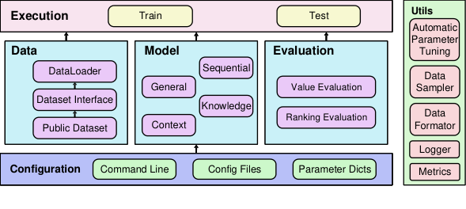
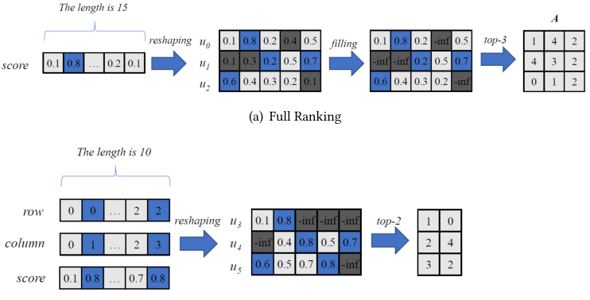
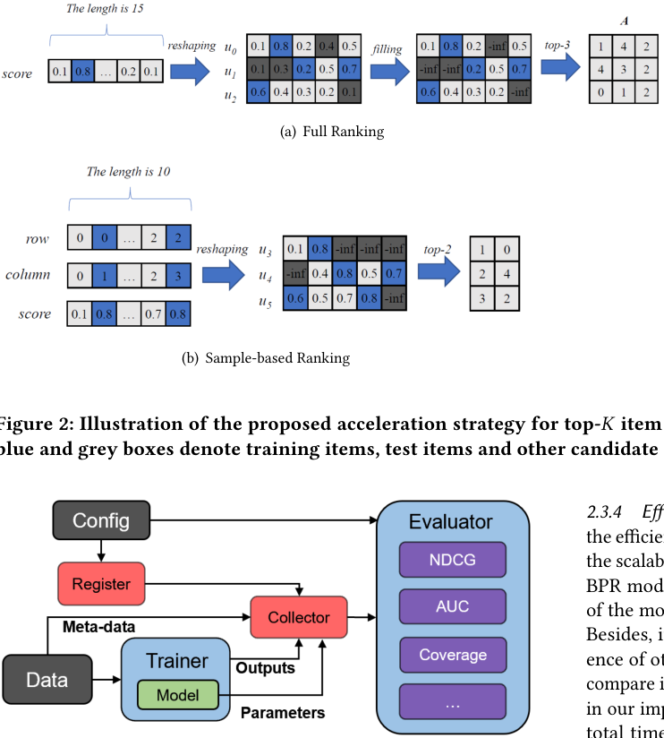
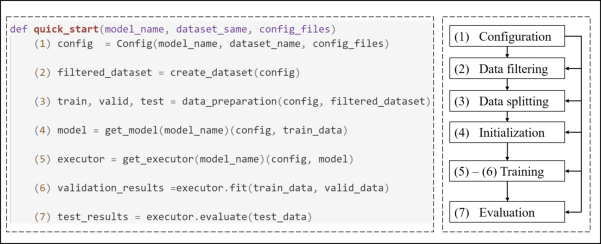

# RecBole: Towards a Unified, Comprehensive and Efficient Framework for Recommendation Algorithms

> Wayne Xin Zhao, Yupeng Hou, Xingyu Pan, Chen Yang et al. | Renmin University of China

本文介绍了 RecBole: Towards a Unified, Comprehensive and Efficient Framework for Recommendation Algorithms。核心内容：

关键发现：

---

## 摘要

## RecBole：迈向统一、全面且高效的推荐算法框架

赵维鑫 1,2，穆山磊 1,3,#，侯宇鹏 1,2,#，林子涵 1,3，陈宇硕 1,2，潘星宇 1,3，
李开元 4，陆玉洁 7，王慧 1,3，田长鑫 1,3，闵英倩 1,3，冯志超 4，范心妍
1,2，陈旭 1,2,∗，王鹏飞 4,∗，季文迪 5，李亚亮 6，王晓玲 5，文继荣 1,2,3
1 北京市大数据管理与分析方法重点实验室
{2 高瓴人工智能学院，3 信息学院} 中国人民大学
4 北京邮电大学，5 华东师范大学，6 阿里巴巴，7 辽宁大学

### 摘要

近年来，文献中提出了大量的推荐算法，从传统的协同过滤到深度学习算法。然而，研究社区对于如何标准化推荐算法的开源实现的关注持续增加。针对这一挑战，我们提出了一个统一、全面且高效的推荐系统库，名为 RecBole（发音为 [rEk'boUl@r]），它提供了一个统一的框架，用于以研究为目的开发和复现推荐算法。在该库中，我们在 28 个基准数据集上实现了 73 个推荐模型，涵盖通用推荐、序列推荐、上下文感知推荐和基于知识的推荐。我们基于 PyTorch 实现了 RecBole 库，PyTorch 是目前最流行的深度学习框架之一。我们的库在多个方面具有特色，包括通用且可扩展的数据结构、全面的基准模型和数据集、高效的 GPU 加速执行，以及广泛且标准的评估协议。我们提供了一系列辅助函数、工具和脚本以方便该库的使用，例如自动参数调优和断点续训。这样的框架有助于标准化推荐系统的实现和评估。item和文档发布在 https://recbole.io/。

**ACM 引用格式：**
赵维鑫 1,2，穆山磊 1,3,#，侯宇鹏 1,2,#，林子涵 1,3，陈宇硕 1,2，潘星宇 1,3，李开元 4，陆玉洁 7，王慧 1,3，田长鑫 1,3，闵英倩 1,3，冯志超 4，范心妍 1,2，陈旭 1,2,∗，王鹏飞 4,∗，季文迪 5，李亚亮 6，王晓玲 5，文继荣 1,2,3。2021。RecBole：迈向统一、全面且高效的推荐算法框架。载于第30届ACM国际信息与知识管理会议论文集（CIKM'21），2021年11月1–5日，澳大利亚昆士兰州，虚拟会议。ACM，纽约，NY，美国，12页。https://doi.org/10.1145/3459637.3482016

---

## 1 引言

在大数据时代，推荐系统在处理信息过载方面发挥着关键作用，极大地改善了用户在从电子商务、视频分享到医疗辅助和在线教育等各种应用中的体验。巨大的商业价值使推荐系统成为一个长期的研究课题，每年都有大量新模型被提出[83]。随着推荐算法的快速增长，这些算法通常在不同的平台或框架下开发。通常，经验丰富的研究人员常常发现很难用统一的方式或框架实现比较的基线模型。事实上，这些推荐算法的许多通用组件或过程是重复或高度相似的，这些应该被重用或扩展。此外，我们意识到研究社区对模型可复现性的关注日益增加。由于某些原因，许多已发表的推荐算法仍然缺乏公开的实现。即使有开源代码，许多细节也由不同的开发者以不一致的方式实现（例如，使用不同的损失函数或优化策略）。因此，有必要以统一的方式重新考虑推荐算法的实现。

为了缓解上述问题，我们启动了一个item，旨在为开发推荐算法提供统一的框架。我们实现了一个开源推荐系统库，名为 RecBole（发音为 [rEk'boUl@r]）¹。基于该库，我们希望增强现有模型的可复现性，并简化新算法的开发过程。我们的工作也有助于标准化推荐算法的评估协议。事实上，在过去十年中已经发布了相当多的推荐系统库[14, 15, 59, 64, 74]。这些工作极大地推动了开源推荐系统的进展。许多库随着功能的不断增加而持续改进。我们广泛调研了这些库，并将其优点广泛地融合到 RecBole 中。

¹伯乐是中国春秋时期一位著名的相马专家，相传是相马术（"通过外表判断马的质量"）的传奇发明者。伯乐常与传说中的"千里马"联系在一起，据说千里马一天能奔驰一千里（约400公里）。更多关于伯乐的细节请参见维基百科页面：https://en.wikipedia.org/wiki/Bo_Le。这里，我们将识别千里马与做出好的推荐进行类比。

---

## 执行 训练 测试 工具
## 自动参数调优
## 数据 模型 评估
## 数据加载器 序列 数据 评估 采样器
## 通用 值 评估 接口
## 数据集 知识
## 公共数据集 上下文 排名 评估 数据格式器
## 日志器
## 配置 命令行 配置文件 参数字典 指标

**图1：我们的 RecBole 库的总体框架。**

总之，我们的 RecBole 库的关键特性和能力总结为以下五个方面：

- **统一的推荐框架。** 我们采用 PyTorch[46] 来开发整个推荐系统库，因为它是最流行的深度学习框架之一，尤其是在研究社区。作为我们库的三个核心组件，我们设计和开发了数据模块、模型模块和评估模块，并封装了许多不同推荐算法共享的通用组件、函数或过程。在我们的库中，对于重用现有模型，用户可以通过简单而灵活的配置，使用内置评估协议轻松比较不同的推荐算法；对于开发新模型，用户只需关注少量的接口函数，从而使得公共部分可以被重用，实现细节对用户透明。

- **通用且可扩展的数据结构。** 为了实现统一的算法开发，我们在两个层面实现了支持性的数据结构。在用户层面，我们引入原子文件（atomic files）以灵活的方式格式化主流推荐任务的输入。提出的原子文件能够刻画四类主流推荐任务的输入。在算法层面，我们引入了一种通用的数据结构 Interaction，以统一针对 GPU 环境的内部数据表示。Interaction 的设计特别方便开发新算法，提供了支持机制或函数，例如通过引用特征名称获取数据。我们实现了 Dataset 和 DataLoader（两个 Python 类）来自动化整个数据流程，这极大地减少了开发新模型的工作量。

- **全面的基准模型和数据集。** 到目前为止，我们已经实现了 73 个推荐算法，涵盖通用推荐、序列推荐、上下文感知推荐和基于知识的推荐。除了传统的推荐算法，我们还整合了大量近年来提出的神经算法。我们通过配置文件或命令行提供了灵活的支持机制来运行、比较和测试这些算法。我们还实现了丰富的辅助函数来使用这些模型，包括自动参数调优和断点续训。为了构建可重用的基准，我们整合了 28 个常用数据集来评估推荐系统。配合原始数据集副本，用户可以使用我们提供的预处理工具或脚本简单地将数据转换为可以在我们的库中使用的格式。更多的数据集和方法将被纳入我们的库中。

- **高效的 GPU 加速执行。** 我们设计并实现了许多针对 GPU 环境的效率优化技术。作为两个主要的耗时来源，模型训练和测试都使用面向 GPU 的实现进行了加速。对于模型测试，提出了一种特殊的加速策略来提高 top-K item推荐中全排序的效率。我们将所有用户的 top-K 评估转换为基于统一矩阵形式的计算。利用这种矩阵形式，我们可以利用 PyTorch 中的 GPU 版本 topk() 函数直接优化 top-K 查找过程。此外，这种矩阵形式对于生成推荐和计算评估指标特别方便。我们通过实验证明，与没有我们加速策略的直接实现相比，它显著降低了时间成本。

- **广泛且标准的评估协议。** 我们的库支持一系列广泛采用的评估协议，用于测试和比较推荐算法。它整合了[87]中讨论的各种评估设置。特别地，我们实现了item排序（即在数据划分前如何对item排序）和数据划分（即如何得到训练集/验证集/测试集）的不同组合来获得评估集。我们还考虑了全排序和基于采样的排序，这最近是推荐系统领域一个有争议的问题[32]。我们封装了四个基本接口（即 Group、Split、Order 和 NegSample）来支持上述评估协议，这使得包含其他评估设置变得灵活。我们提供了几种常用的评估设置（例如，基于比例的划分加上随机排序用于数据集划分），它整合了上述四个因素的备选设置。我们的库提供了在不同评估设置下评估模型的可能性。

---

## 2 库——RecBole

我们的 RecBole 库的总体框架如图 1 所示。底部是配置模块，帮助用户设置实验环境（例如，超参数和运行细节）。数据、模型和评估模块建立在配置模块之上，构成了我们库的核心代码。执行模块负责基于环境的特定设置来运行和评估模型。所有辅助函数都收集在工具模块中，包括自动参数调优、日志器和评估指标。下面，我们简要介绍三个核心模块的设计，更多细节可以在库文档中找到。

### 2.1 数据模块

我们库的一个主要开发准则是使代码高度自包含和统一。为此，数据模块确实是最重要的部分，它通过提供基础的数据结构和函数来支持整个库。

#### 2.1.1 总体数据流

为了可扩展性和可重用性，我们的数据模块设计了一个优雅的数据流，将原始数据转换为模型输入。

总体数据流可以描述如下：**原始输入 \rightarrow 原子文件 \rightarrow Dataset *DataFrame* \rightarrow DataLoader *Interaction* \rightarrow 算法**。Dataset 类的实现主要基于 pandas 库中的主要数据结构 pandas.DataFrame，而 DataLoader 类的实现基于一个称为 Interaction 的通用内部数据结构。

我们的数据流涉及两种特殊的数据形式，分别面向用户和算法。对于数据准备，我们引入并定义了六种原子文件类型（具有相同或相似的文件格式），用于在用户层面统一输入。而对于内部数据表示，我们引入并实现了一种灵活的数据结构 Interaction，用于算法层面。原子文件能够刻画不同推荐任务所需的大部分输入数据形式，而 Interaction 数据结构为不同的推荐算法提供了统一的内部数据表示。

为了帮助用户将原始输入转换为原子文件，我们收集了超过 28 个常用数据集，并发布了相应的转换工具，这使得开始使用我们的库非常方便。我们在表 1 中展示了这些数据集的统计数据。在从原子文件到 Dataset 的转换步骤中，我们提供了许多有用的函数，支持推荐系统中的一系列预处理步骤，如 k-core 数据过滤和缺失值填充。我们在表 2 中展示了 Dataset 类支持的函数。

**表 1：我们的 RecBole 库中收集的数据集。**

| 数据集 | #用户 | #item | #交互 |
|--------|-------|-------|-------|
| MovieLens | - | - | - |
| Anime | 73,515 | 11,200 | 7,813,737 |
| Epinions | 116,260 | 41,269 | 188,478 |
| Yelp | 1,968,703 | 209,393 | 8,021,122 |
| Netflix | 480,189 | 17,770 | 100,480,507 |
| Book-Crossing | 105,284 | 340,557 | 1,149,780 |
| Jester | 73,421 | 101 | 4,136,360 |
| Douban | 738,701 | 28 | 2,125,056 |
| YahooMusic | 1,948,882 | 98,211 | 11,557,943 |
| KDD2010 | - | - | - |
| Amazon | - | - | - |
| Pinterest | 55,187 | 9,911 | 1,445,622 |
| Gowalla | 107,092 | 1,280,969 | 6,442,892 |
| Last.FM | 1,892 | 17,632 | 92,834 |
| DIGINETICA | 204,789 | 184,047 | 993,483 |
| Steam | 2,567,538 | 32,135 | 7,793,069 |
| Ta-Feng | 32,266 | 23,812 | 817,741 |
| FourSquare | - | - | - |
| Tmall | 963,923 | 2,353,207 | 44,528,127 |
| YOOCHOOSE | 9,249,729 | 52,739 | 34,154,697 |
| Retailrocket | 1,407,580 | 247,085 | 2,756,101 |
| LFM-1b | 120,322 | 3,123,496 | 1,088,161,692 |
| Criteo | - | - | 45,850,617 |
| Avazu | - | - | 40,428,967 |
| iPinYou | 19,731,660 | 163 | 24,637,657 |
| Phishing websites | - | - | 11,055 |
| Adult | - | - | 32,561 |
| MIND | - | - | - |

¹"-"表示该数据集要么由许多小子集组成（例如，Amazon、KDD2010），因此我们请读者访问我们的网站获取更详细的统计数据；要么该数据集基于特征（例如，Criteo、Avazu），而不是基于用户和item。

**表 2：Dataset 类支持的函数。**

| 函数 | 描述 |
|------|------|
| _filter_by_inter_num | 基于交互次数的用户/item过滤 |
| _filter_by_field_value | 基于值的过滤 |
| _remap_ID | 将特征映射为 ID |
| _fill_nan | 缺失值填充 |
| _set_label_by_threshold | 生成交互标签 |
| _normalize | 归一化特征 |
| _preload_weight_matrix | 初始化嵌入表 |

#### 2.1.2 原子文件

到目前为止，我们的库引入了六种原子文件类型，它们作为基本组件用于刻画各种推荐任务的输入。在文献中，有大量的推荐任务。我们试图总结并统一主流推荐任务最基本的输入形式。请注意，这些文件仅在功能上有所不同，而它们的格式相当相似。这些原子文件的详细信息总结在表 3 中。

**表 3：原子文件总结。**

| 后缀 | 数据类型 | 内容 |
|------|----------|------|
| .inter | 所有类型 | 用户-item交互 |
| .user | 所有类型 | 用户特征 |
| .item | 所有类型 | item特征 |
| .kg | int | 知识图谱中的三元组 |
| .link | int | item-实体链接数据 |
| .net | 所有类型 | 社交图数据 |

我们通过不同的后缀来识别不同的文件。通过总结现有推荐模型和数据集，我们归纳出四种基本数据类型，即 "token"（表示整数或字符串）、"token sequence"（token序列）、"float"（浮点数）和 "float sequence"（浮点数序列）。"token" 和 "token sequence" 用于表示离散特征，如 ID 或类别，而 "float" 和 "float sequence" 用于表示连续特征，如价格。原子文件支持稀疏特征表示，因此原子文件占用的空间可以大幅减少。大多数原子文件支持所有四种数据类型，但 .kg 和 .link 文件除外。下面我们对每种原子文件进行详细描述：

- **.inter** 是所有推荐任务中必需使用的文件。每一行由用户 ID（token）、item ID（token）、用户-item评分（float，可选）、时间戳（float，可选）和评论文本（token sequence，可选）组成。不同字段之间用逗号分隔。
- **.user** 是用户配置文件，包含用户的类别或连续特征。每行格式为：用户 ID（token），特征（token 或 float），特征（token 或 float），...，特征（token 或 float）。
- **.item** 是item特征文件，描述item的特性，格式如下：item ID（token），特征（token 或 float），特征（token 或 float），...，特征（token 或 float）。.user 和 .item 用于上下文感知推荐。
- **.kg** 是知识图谱文件，用于基于知识的推荐。每一行对应一个 ⟨头实体, 尾实体, 关系⟩ 三元组，格式如下：头实体 ID（token），尾实体 ID（token），关系 ID（token）。
- **.link** 也用于基于知识的推荐。它记录了推荐系统item与知识图谱实体之间的对应关系。文件格式如下：item ID（token），实体 ID（token），表示item到实体的映射。
- **.net** 是社交网络文件，用于社交推荐。格式如下：源用户 ID（token），目标用户 ID（token），权重（float，可选）。

原子文件的本质是基于特征的数据框架，对应于任务输入的不同部分。它们可以涵盖文献中大多数主流推荐任务的输入。如果原子文件不足以支持新任务，用户可以灵活地增量引入新的原子文件。

#### 2.1.3 推荐任务的输入文件

基于上述原子文件，我们可以利用一系列文件组合来支持五种主流的推荐任务，即通用推荐、上下文感知推荐、基于知识的推荐、序列推荐和社交推荐。目前，我们已经实现了对前四类推荐任务的支持机制，而社交推荐的代码正在开发中。

原子文件和推荐模型之间的对应关系见表 4。我们输入文件的一个主要优点是原子文件本身不依赖于特定任务。正如我们所看到的，给定一个数据集，用户在切换不同推荐任务时可以重用相同的 .inter 文件（无需对数据文件做任何修改）。我们的库读取配置文件，并决定如何处理数据文件。

**表 4：推荐任务与原子文件之间的对应关系。**

| 任务 | 必需原子文件 |
|------|--------------|
| 通用推荐 | .inter |
| 上下文感知推荐 | .inter, .user, .item |
| 基于知识的推荐 | .inter, .kg, .link |
| 序列推荐 | .inter |
| 社交推荐 | .inter, .net |

另一个需要注意的是，表 4 展示了每个任务中必需原子文件的组合。除了必需文件之外，还可以使用额外的原子文件。例如，对于序列推荐，我们可能还需要使用上下文特征。为了支持这一点，用户只需根据需要将原始组合扩展为 ⟨.inter, .user, .item⟩。

#### 2.1.4 内部数据结构 Interaction

如第 2.1.1 节所述，在我们的库中，Interaction 是输入到推荐算法中的内部数据结构。

为了使其统一且灵活，它被实现为一种基于 Python dict 的新抽象数据类型，是一种键值索引的数据结构。键对应输入中的特征，在编写推荐算法时可以方便地通过特征名称引用；值对应张量（由 torch.Tensor 实现），将用于学习算法中的更新和计算。特别地，特定键的值条目存储了一个批次或小批次中所有对应的张量数据。

利用这种数据结构，我们的库提供了友好的接口，以基于批次的模式实现推荐算法。从原始输入到内部数据表示的所有转换细节对开发者都是透明的。基于统一的内部数据表示 Interaction，用户可以轻松实现不同的算法。此外，值组件基于 torch.Tensor 实现。我们封装了 PyTorch 的许多函数来开发一个面向 GPU 的数据结构，它可以支持基于批次的机制（例如，将一批数据复制到 GPU）。特别地，我们在表 5 中总结了 Interaction 支持的重要函数。

**表 5：Interaction 类支持的函数。**

| 函数 | 描述 |
|------|------|
| to(device) | 将张量转移到 torch.device |
| cpu | 将所有张量转移到 CPU |
| numpy | 将所有张量转换为 numpy.Array |
| repeat | 沿 batch_size 维度重复 |
| repeat_interleave | 重复张量的元素 |
| update | 用另一个 Interaction 更新对象 |

### 2.2 模型模块

基于数据模块，我们将推荐算法的实现组织在一个独立的模型模块中。

#### 2.2.1 统一实现接口

通过建立模型模块，我们可以将算法实现与其他组件大幅解耦，这对于本库的协作开发尤为重要。要在表 4 中的四类任务中实现一个新模型，用户只需遵循所需的接口来连接输入和评估模块，而其他部分的细节可以忽略。具体来说，我们使用接口函数 `calculate_loss(·)` 进行训练，使用接口函数 `predict(·)` 进行测试。要实现一个模型，用户需要做的就是实现这些重要的接口函数，而无需考虑其他细节。这些接口函数对于各种推荐算法确实是通用的，因此我们可以以高度统一的方式实现各种算法。这种设计模式使得新算法的快速开发成为可能。此外，我们的模型模块进一步封装了许多重要的模型实现细节，例如学习策略。为了代码复用，我们实现了几个常用的损失函数（例如，BPR 损失、基于间隔的损失和基于正则化的损失）、神经组件（例如，MLP、多头注意力和图神经网络）和初始化方法（例如，Xavier 正态和均匀初始化）作为独立组件，可以在构建复杂模型或算法时直接使用。

#### 2.2.2 已实现的模型

到目前为止，我们已经在通用推荐、序列推荐、上下文感知推荐和基于知识的推荐这四个类别中实现了 73 个推荐模型。我们请读者参考表 6 了解这些模型的更多细节。在选择要实现的模型时，我们仔细调研了最近的文献，并在我们的库中选择了常用的推荐模型及其相关变体（这些变体可能引用量不高）。我们主要关注最近提出的神经方法，同时也保留了一些经典的傳統方法，如 ItemKNN 和 FM。未来，更多的方法也将通过定期更新纳入。对于所有已实现的模型，我们已经在两个或四个选定的数据集上测试了它们的性能，并邀请了代码审查员检查实现的正确性。

**表 6：在 RecBole 中实现的 73 个推荐模型，涵盖 4 个类别。**

| 类别 / 模型 | 会议 | 年份 | 典型评估数据集 |
|-------------|------|------|----------------|
| **通用推荐** | | | |
| popularity | - | - | - |
| ItemKNN[13] | TOIS | 2004 | ctlg,ccard,ecmrc,EachMovie,MovieLens,skill |
| BPR[51] | UAI | 2009 | Rossmann,Netflix |
| SLIMElastic[44] | ICDM | 2011 | ctlg,ccard,ecmrc,Book-Crossing,MoiveLens,Netflix,YahooMusic |
| FISM[29] | SIGKDD | 2013 | MovieLens,Netflix,YahooMusic |
| LINE[61,88] | WWW | 2015 | NetWork(Wikipedia,Flickr,Youtube,DBLP) |
| CDAE[76] | WSDM | 2016 | MovieLens,Netflix,Yelp |
| NeuMF[23] | WWW | 2017 | MovieLens,Pinterest |
| ConvNCF[21] | IJCAI | 2017 | Yelp,Gowalla |
| DMF[79] | IJCAI | 2017 | MovieLens,Amazon |
| NNCF[4] | CIKM | 2017 | Delicious,MovieLens,Rossmann |
| NAIS[22] | TKDE | 2018 | MovieLens,Pinterest |
| SpectralCF[89] | RecSys | 2018 | MovieLens,HetRec,Amazon |
| MultiVAE[37] | WWW | 2018 | MovieLens,MillionSong,Netflix |
| MultiDAE[37] | WWW | 2018 | MovieLens,MillionSong,Netflix |
| GCMC[63] | SIGKDD | 2018 | MovieLens,Flixster,Douban,YahooMusic |
| NGCF[72] | SIGIR | 2019 | Gowalla,Yelp,Amazon |
| MacridVAE[41] | NeurIPS | 2019 | AliShop-7C,MovieLens,Netflix |
| EASE[57] | WWW | 2019 | MovieLens,MillionSong,Netflix |
| LightGCN[20] | SIGIR | 2020 | Gowalla,Yelp,Amazon |
| DGCF[73] | SIGIR | 2020 | Gowalla,Yelp,Amazon |
| RaCT[39] | ICLR | 2020 | MovieLens,MillionSong,Netflix |
| RecVAE[55] | WSDM | 2020 | MovieLens,MillionSong,Netflix |
| ENMF[9] | TOIS | 2020 | Ciao,Epinions,MovieLens |
| **上下文感知推荐** | | | |
| LR[53] | WWW | 2007 | Microsoft web search dataset |
| FM[49] | ICDM | 2010 | CML/PKDDDiscoveryChallenge2009,Netflix |
| DSSM[26] | CIKM | 2013 | Henceforth |
| FFM[28] | RecSys | 2016 | Criteo,Avazu |
| FNN(DNN)[86] | ECIR | 2016 | iPinYou |
| PNN[47] | ICDM | 2016 | Criteo,iPinYou |
| Wide&Deep[11] | RecSys | 2016 | Google play dataset |
| XGBoost[10] | KDD | 2016 | Allstate,HiggsBoson,YahooLTRC,Criteo |
| NFM[19] | SIGIR | 2017 | Frappe,MovieLens |
| DeepFM[16] | IJCAI | 2017 | Criteo,Company |
| AFM[77] | IJCAI | 2017 | Frappe,MoiveLens |
| DCN[70] | ADKDD | 2017 | Criteo |
| LightGBM[31] | NIPS | 2017 | Allstate,FlightDelay,LETOR,KDD10,KDD12 |
| xDeepFM[36] | SIGKDD | 2018 | Criteo,Dianping,BingNews |
| FwFM[45] | WWW | 2018 | Criteo,Oath |
| DIN[91] | SIGKDD | 2018 | Amazon,MovieLens,Alibaba |
| DIEN[90] | AAAI | 2019 | Amazon |
| AutoInt[56] | CIKM | 2019 | Criteo,Avazu,KDDCup2012,MovieLens |
| **序列推荐** | | | |
| FPMC[52] | WWW | 2010 | ROSSMANN |
| HRM[69] | SIGIR | 2015 | Ta-Feng,BeiRen,Tmall |
| ImprovedGRU-Rec[60] | DLRS | 2016 | YOOCHOOSE |
| GRU4RecF(+feature embedding)[24] | RecSys | 2016 | coinedVIDXL,CLASS |
| Fossil[18] | ICDM | 2016 | Amazon,Epinions,Foursquare |
| NARM[35] | CIKM | 2017 | YOOCHOOSE,DIGINETICA |
| TransRec[17] | RecSys | 2017 | Amazon,Epinions,Foursquare,GoogleLocal |
| STAMP[38] | SIGKDD | 2018 | YOOCHOOSE,DIGINETICA |
| Caser[62] | WSDM | 2018 | MovieLens,Gowalla,Foursquare,Tmall |
| SASRec[30] | ICDM | 2018 | Amazon,Steam,MovieLens |
| KSR[25] | SIGIR | 2018 | LastFM,MovieLens,Amazon |
| SHAN[80] | IJCAI | 2018 | Tmall,Gowalla |
| NPE[43] | IJCAI | 2018 | Movielens,OnlineRetail,TasteProfile |
| NextItnet[81] | WSDM | 2019 | YOOCHOOSE,LastFM |
| BERT4Rec[58] | CIKM | 2019 | Amazon,Steam,MovieLens |
| SRGNN[75] | AAAI | 2019 | YOOCHOOSE,DIGINETICA |
| GCSAN[78] | IJCAI | 2019 | DIGINETICA,Retailrocket |
| SASRecF(+feature embedding)[84] | IJCAI | 2019 | - |
| FDSA[85] | IJCAI | 2019 | Amazon,Tmall |
| RepeatNet[48] | AAAI | 2019 | YOOCHOOSE,DIGINETICA,LastFM |
| HGN[40] | SIGKDD | 2019 | MovieLens,Amazon,Goodreads |
| S3Rec[92] | CIKM | 2020 | Meituan,Amazon,Yelp,LastFM |
| GRU+KGEmbedding | - | - | - |
| **基于知识的推荐** | | | |
| CKE[82] | SIGKDD | 2016 | MovieLens,IntentBooks |
| CFKG[1] | MDPI | 2018 | Amazon |
| RippleNet[65] | CIKM | 2018 | MovieLens,Book-Crossing,Bing-News |
| KTUP[6] | WWW | 2019 | MovieLens,DBbook2014 |
| KGAT[71] | SIGKDD | 2019 | Amazon,LastFM,Yelp2018 |
| MKR[67] | WWW | 2019 | MovieLens,Book-Crossing,LastFM,Bing-News |
| KGCN[68] | WWW | 2019 | MovieLens,Book-Crossing,LastFM |
| KGNN-LS[66] | SIGKDD | 2019 | MovieLens,Book-Crossing,LastFM,Dianping-Food |

#### 2.2.3 丰富的辅助函数

为了更好地使用我们库中的模型，我们还实现了一系列有用的函数。一个特别有用的功能是自动参数调优。用户可以提供一个参数集来搜索最优值，从而获得最佳性能。给定一组参数值，我们可以指定四种调优方法，即"网格搜索"（GridSearch）、"随机搜索"（RandomSearch）、"Parzen 估计器树"（Tree of Parzen Estimators，TPE）和"自适应 TPE"（Adaptive TPE）。调优过程基于 hyperopt[5] 库实现。此外，我们增加了模型保存和加载功能，以分别存储和重用学习到的模型。我们的库还支持从之前保存的断点恢复模型学习。在训练过程中，用户可以打印和监控损失值的变化，并应用训练技巧，如早停（early-stopping）。这些小技巧极大地改善了我们库的使用体验。

### 2.3 评估模块

评估模块的功能是为推荐系统实现常用的评估协议。由于不同的模型可以在相同的评估模块下进行比较，我们的库有助于标准化推荐系统的评估。

#### 2.3.1 评估指标

我们的库同时支持基于值的评估指标和基于排名的评估指标。基于值的指标（用于评分预测）包括均方根误差（RMSE）和平均绝对误差（MAE），衡量真实值与预测值之间的预测差异。基于排名的指标（用于 top-K item推荐）包括最广泛使用的排名感知指标，如 Recall@K、Precision@K、NDCG 和 MRR，衡量算法生成的推荐列表的排名性能。

#### 2.3.2 评估设置

近年来，关于推荐系统适当评估的讨论越来越多[32, 87]。从根本上说，分歧主要在于 top-K item推荐的基于排名的评估。需要注意的是，我们库的重点不是确定最合适的评估协议。相反，我们旨在提供文献中大多数广泛采用的评估协议（甚至是最关键的协议）。我们的库提供了在不同评估协议下比较各种模型性能的可能性。

对于 top-K item推荐，实现的评估设置涵盖了我们在[87]中早期工作的各种设置，其中我们研究了不同评估协议对模型性能比较的影响。特别地，我们主要考虑item排序（即在数据划分前如何对item排序）和数据划分（即如何得到训练/验证/测试集）的组合，用于构建评估集。我们还考虑了全排序和基于采样的排序，这是最近推荐系统领域一个有争议的问题[32]。我们在表 7 中总结了我们库支持的评估设置。

**表 7：示例评估设置。**

| 表示 | 解释 |
|------|------|
| RO_RS | 随机排序 + 基于比例的划分 |
| TO_LS | 时间排序 + 留一划分 |
| RO_LS | 随机排序 + 留一划分 |
| TO_RS | 时间排序 + 基于比例的划分 |
| full | 对所有item候选进行全排序 |
| uni_N | 一个正样本与 N 个负样本配对 |

为了支持各种评估设置，我们将相关功能封装为四个主要部分，即 Group、Split、Order 和 NegSample。通过这些实现，我们可以有效地支持不同的评估协议，这也是使用我们库的一个吸引人的特点。

#### 2.3.3 Top-K 评估的加速策略

计算 Top-K 评估指标通常很耗时。基本原因在于需要穷尽地估计每个用户-item对的分数。由于分数估计方法因模型而异，因此以通用方式优化整个评估过程并不容易。因此，我们主要关注根据排名分数选择和生成 top-K item的步骤。

一个问题是，不同的用户在测试集中有不同数量的真实item（导致不同大小的用户-item矩阵），这不适合以统一的方式进行并行 GPU 计算。我们的方法是考虑所有item，包括训练集中的item（称为训练item）。给定 n 个用户和 m 个待考虑item，当执行全排序时，我们可以得到一个 n
$$
\times
$$
m 的矩阵 D，其中包含模型对整个item集的置信度分数。当执行基于采样的排序时，我们创建一个 n
$$
\times
$$
m 的矩阵 D，将所有元素初始化为负无穷。然后，我们用采样item上的置信度分数填充矩阵 D。这一步称为**重塑**（reshaping）。当对所有item候选执行全排序时，我们提供一个选项来屏蔽训练item的分数。如果用户选择屏蔽，上一步得到的矩阵 D 不能直接用于 top-K 预测。我们的解决方案是将训练item的分数设置为负无穷，并在不删除训练item的情况下对整个item集执行全排序。这一步称为**填充**（filling）。通过这种方式，所有用户对应相同大小的评估矩阵（即 n
$$
\times
$$
m），用于后续的全排序和基于采样的排序计算，后续步骤对两种情况相同。

然后，我们利用 PyTorch 提供的 GPU 版本 topk() 函数来查找用户得分最高的前 K 个item。GPU 版本的 topk() 函数已基于 CUDA 进行了特别优化，在我们的场景中非常高效。这一步称为**topk 查找**（topk-finding）。利用 topk() 函数，我们可以得到一个大小为 n
$$
\times
$$
K 的矩阵 A，该矩阵记录了所选 top-K item的原始索引。我们进一步生成一个大小为 n
$$
\times
$$
m 的二进制矩阵 B，以指示item在测试集中的存在性（图 2(a) 和图 2(b) 中的蓝色框）。接下来，我们使用矩阵 A 的每一行来索引矩阵 B 中的同一行，并得到一个大小为 n
$$
\times
$$
K 的二进制矩阵 C，这可以通过 PyTorch 提供的 gather() 函数高效实现。我们以全排序的情况为例，如图 2(c) 所示。这一步称为**索引**（indexing）。最后，我们连接所有批次的矩阵 C。生成的结果由 0 和 1 组成，这对于计算评估指标特别方便。如下所示，这种加速策略能够提高全排序和基于采样的排序item推荐的效率。

**(a) 全排序**

**(b) 基于采样的排序**

**(c) 索引**

**图 2：提出的 top-K item评估加速策略图示。这里， $u_0$ , …, $u_5$ 表示六个用户；黑色、蓝色和灰色框分别表示训练item、测试item和其他候选item。**

#### 2.3.4 效率和可扩展性

在这一部分，我们通过实验分析我们的加速策略带来的效率提升以及评估架构的可扩展性。具体来说，选择经典 BPR 模型[51]进行效率分析，因为它是 top-K 推荐中最常用的基线之一。此外，其模型架构非常简单，不受其他因素的影响，适合进行效率分析。我们比较了在我们的实现中有和没有加速策略时的性能。我们通过以下总时间来衡量模型性能：（1）为用户生成前十名item推荐列表的时间，以及（2）在推荐列表上计算指标（NDCG@10 和 Recall@10）的时间，针对所有用户。为了进一步分析模型在不同规模数据集上的效率，我们使用三个 MovieLens 数据集²（即 MovieLens-100k、MovieLens-1M 和 MovieLens-10M）进行实验。我们将一个原始数据集按 8:1:1 的比例划分为训练集、验证集和测试集。我们只统计在测试集上生成前十名推荐（全排序）的时间。我们对不同实现的十次运行时间取平均。我们的实验在一台 Linux PC 上进行，配备 CPU（Intel(R) Xeon(R) Silver 4216，16 核，32 线程，2.10GHz）和 GPU（Nvidia RTX 3090 24G）。效率比较的结果如表 8 所示。从结果可以看出，通过应用加速策略，我们可以显著加快评估过程。特别是，在最大的数据集 MovieLens-10M 上，加速模型可以在大约两秒内执行全排序，这表明我们的实现相当高效。目前，我们只比较了包含所有加速技术的总体时间。作为未来的工作，我们将详细分析每种具体技术的贡献。除了效率优势，RecBole 的评估也是灵活且可扩展的。如图 3 所示，评估器与模型和数据解耦，计算指标所需的所有资源都由收集器（collector）良好封装。通过这种方式，可以灵活地使用这些统一接口开发其他自定义指标：实现新指标并将其注册到注册表中（见图 3）。

²https://grouplens.org/datasets/movielens/

**表 8：在不同大小的 MovieLens 数据集上有无加速策略的时间成本比较（秒）。BPR_acc 表示使用加速策略的模型。**

| 模型 | MovieLens-100k | MovieLens-1M | MovieLens-10M |
|------|----------------|--------------|---------------|
| BPR | 0.245s | 2.478s | 29.900s |
| BPR_acc | 0.009s | 0.090s | 2.210s |

**图 3：评估模型的架构和数据流。**

---

## 3 库的使用示例

在本节中，我们通过代码示例展示如何使用我们的库。我们将使用说明详细分为两部分，即在我们库中运行现有模型和基于我们库提供的接口实现新模型。

### 3.1 运行现有模型

我们库中包含的模型可以使用固定参数或自动调优参数运行。

#### 3.1.1 使用固定参数运行模型

图 4 展示了在我们的库中运行现有模型的一般流程。首先，用户需要基于我们提供的工具下载并格式化原始公共数据集。运行过程依赖于一些实验配置，这些配置可以从文件、命令行或参数字典中获得。根据配置的参数和设置准备数据集和模型，执行模块负责训练和评估模型。详细步骤如下：

(i) **格式化数据集。** 用户首先选择一个数据集，然后基于脚本进行格式化，该脚本可以为不同数据集生成所需的原子文件。此过程使用以下代码：`atomic_file = PreProcess(dataset)`。

(ii) **生成配置。** 在我们的库中，实验配置可以通过不同方式生成。用户可以编写一个配置文件，然后在主函数中读取该文件，如图 4 的第 (1) 行所示。另一种配置方式是在命令行中包含参数，这对于特别关注的参数很有用。最后，用户也可以直接在代码中编写参数字典。

(iii) **过滤和划分数据集。** 我们提供丰富的辅助函数来过滤和划分数据集。例如，用户可以通过保留至少 K 次交互的用户/item来过滤数据集，或者移除在某个固定时间段内发生的数据。不同的过滤方法可以通过统一的函数应用（图 4 的第 (2) 行）。在划分数据集时，可以指定基于比例的方法或留一法。然后，用户可以使用图 4 的第 (3) 行生成训练、验证和测试集。

(iv) **加载模型。** 下一步是构建推荐模型。考虑到目标模型，用户可以根据图 4 的第 (4) 行获得一个模型实例。

(v) **训练和评估。** 一旦数据集和模型准备就绪，用户最终可以根据图 4 的第 (5) 行训练和评估模型。

**图 4：我们库的示例使用流程。**

#### 3.1.2 参数调优

我们的库具有自动参数（或超参数）调优的能力。用户可以根据提供的超参数范围轻松优化给定模型。一般步骤如下：

(i) **设置参数范围。** 允许用户在 "hyper.test" 文件中提供候选参数值。在该文件中，每一行格式为：`parameter = [value1, value2, ... valueN]`。用户可以不指定固定值，而是凭经验指定一个值集合，这将在后续的调优步骤中被探索。

(ii) **设置调优方法。** 我们的参数调优函数基于 hyperopt 库实现。给定一组参数值，我们可以指定四种类型的调优方法，即"网格搜索"、"随机搜索"、"Parzen 估计器树（TPE）"和"自适应 TPE"。调优方法通过以下代码调用：`hy = HyperTuning(objective, tuning_method, range_file)`，其中参数范围文件用于指示参数值。

(iii) **开始调优过程。** 用户可以通过以下代码启动运行过程：`hy.run()`。通过调优范围和方法，我们的库将迭代运行模型，最终输出并保存最优参数和相应的模型性能。

### 3.2 实现新模型

基于 RecBole，通过实例化以下三个函数可以方便地实现新模型：

(i) **实现 `__init__()` 函数。** 在此函数中，用户执行参数初始化、全局变量定义等。新模型应该是我们库中提供的抽象模型类的子类。到目前为止，我们已经实现了通用推荐、基于知识的推荐、序列推荐和上下文感知推荐的抽象类。

(ii) **实现 `calculate_loss()` 函数。** 此函数计算新模型要优化的损失。基于此函数的返回值，库将根据预设配置自动调用不同的优化方法来学习模型。

(iii) **实现 `predict()` 函数。** 此函数用于从输入数据（例如，用户-item对的评分）预测分数。此函数可用于计算损失或在模型测试阶段推导item排名。

---

## 4 与现有库的比较

近年来，已经发布了相当多的开源推荐系统库用于研究目的。我们在表 9 中总结并比较了现有推荐系统库的特性，从中可以看出：这些库的编程语言从 C/C++/JAVA 逐渐演变为 Python/Tensorflow/PyTorch。从模型角度来看，最近的库大多支持神经推荐模型，这与推荐领域的发展趋势一致。在我们的框架中，我们选择 PyTorch 作为开发的基础深度学习框架，因为它具有友好的特性，如易于调试、与 numpy 兼容等。

**表 9：与现有推荐系统库的比较。**

| 库 | 语言 | #模型 | #数据集 | #Fork | #Star | #Issues | 发布时间 | 神经 | 参数调优 |
|----|------|-------|---------|-------|-------|---------|---------|------|----------|
| MyMediaLite([14]) | C# | 61 | 5 | 199 | 477 | 451 | 2010 | 否 | 手动 |
| LibFM([50]) | C++ | 1 | - | 415 | 1400 | 32 | 2014 | 否 | 手动 |
| LibRec([15]) | Java | 93 | 11 | 1000+ | 3009 | 252 | 2014 | 否 | 手动 |
| RankSys([8]) | Java | 8 | - | 58 | 259 | 38 | 2016 | 否 | 手动 |
| Crab([7]) | Python | 2 | 4 | 381 | 1122 | 75 | 2011 | 否 | 手动 |
| Surprise([27]) | Python | 11 | 3 | 888 | 4989 | 333 | 2015 | 否 | 手动 |
| LightFM([34]) | Python | 1 | 2 | 610 | 3741 | 425 | 2015 | 否 | 手动 |
| CaseRecommender([12]) | Python | 27 | - | 75 | 354 | 24 | 2015 | 否 | 手动 |
| Recommenders([3]) | Tensorflow | 31 | 5 | 1900+ | 10000+ | 602 | 2018 | 是 | 自动 |
| Cornac([54]) | Tensorflow | 42 | 14 | 75 | 397 | 58 | 2018 | 是 | 自动 |
| NeuRec([74]) | Tensorflow | 33 | 3 | 199 | 816 | 29 | 2019 | 是 | 手动 |
| Elliot([2]) | Tensorflow | 50 | - | 19 | 108 | 8 | 2021 | 是 | 自动 |
| Spotlight([33]) | PyTorch | 8 | 5 | 389 | 2552 | 109 | 2017 | 是 | 自动 |
| DaisyRec([59]) | PyTorch | 20 | 14 | 59 | 354 | 8 | 2019 | 是 | 自动 |
| ReChorus([64]) | PyTorch | 12 | 2 | 47 | 214 | 16 | 2020 | 是 | 手动 |
| Beta-recsys([42]) | PyTorch | 22 | 21 | 25 | 75 | 120 | 2020 | 是 | 手动 |
| **RecBole** | **PyTorch** | **73** | **28** | **193** | **1179** | **163** | **2020** | **是** | **自动** |

¹"神经"表示该库支持深度推荐模型，"参数调优"表示参数调优方式。统计数据收集于 2021 年 8 月 21 日。

RecBole 在现有库中提供了最全面的模型和基准数据集，可以更好地将用户从繁重的模型重编程工作中解放出来。除了复现现有模型外，我们还旨在简化新算法的开发过程。我们设计了通用且可扩展的底层数据结构来支持统一的开发框架。通过提供一系列有用的工具、函数和脚本（例如，自动参数调优），我们的库对于科学研究特别方便。

最后，我们相信实现只是开源推荐库的第一步，因为需要更多的努力来根据用户的反馈和建议来维护和更新库。我们的团队正在努力响应 GitHub 的问题并修复可能的 bug（截至 2021 年 8 月 21 日，已解决 134 个问题）。发布后，我们的库受到了用户的广泛关注。截至发表之日，它在"recommender system"和"recommendation system"主题下分别根据获得的星标数排名第三和第四。

---

## 5 结论

在本文中，我们发布了一个新的推荐系统库，名为 RecBole。到目前为止，我们已经在 28 个常用数据集上实现了 73 个推荐算法。我们设计了通用且可扩展的数据结构，为新的推荐算法提供统一的开发框架。我们还支持广泛且标准的评估协议，以比较和测试不同的推荐算法。此外，我们的库以 GPU 加速的方式实现，涉及一系列优化技术以实现高效执行。RecBole 库有望提高推荐模型的可复现性，简化新算法的开发过程，并为推荐系统领域建立一个基准框架。未来，我们将持续努力添加更多的数据集和模型。我们还将考虑添加更多工具以方便库的使用，例如结果可视化和算法调试。

---

## 6 致谢

本工作得到了国家自然科学基金（批准号 61872369、61802029 和 61972155）、北京人工智能研究院（BAAI）（批准号 BAAI2020ZJ0301）以及北京杰出青年科学家计划（批准号 BJJWZYJH012019100020098）的部分支持。我们还衷心感谢非作者的团队成员（杨晨、龚政、商晨展、宋子涵、张泽、张景森、徐兰玲、田珍和岳文静）对我们库的测试。

---

## 参考文献

（共 92 篇参考文献，此处逐条翻译标题）

[1] Qingyao Ai, Vahid Azizi, Xu Chen, 和 Yongfeng Zhang. 2018. 学习异构知识库嵌入用于可解释推荐. Algorithms 11, 9 (2018), 137.

[2] Vito Walter Anelli, Alejandro Bellogín, Antonio Ferrara, Daniele Malitesta, Felice Antonio Merra, Claudio Pomo, Francesco Maria Donini, 和 Tommaso Di Noia. 2021. Elliot: 一个用于可复现推荐系统评估的全面且严谨的框架. 载于 SIGIR. ACM, 2405–2414.

[3] Andreas Argyriou, Miguel González-Fierro, 和 Le Zhang. 2020. Microsoft Recommenders: 生产就绪推荐系统的最佳实践. 载于 Companion of The 2020 Web Conference 2020, 台北, 台湾, 2020年4月20–24日. 50–51.

[4] Ting Bai, Ji-Rong Wen, Jun Zhang, 和 Wayne Xin Zhao. 2017. 一种基于交互邻域的神经协同过滤模型. 载于 CIKM. ACM, 1979–1982.

[5] James Bergstra, Daniel Yamins, 和 David D. Cox. 2013. 使模型搜索科学化：视觉架构的数百维超参数优化. 载于第30届国际机器学习大会论文集, ICML 2013, 亚特兰大, GA, 美国, 2013年6月16–21日 (JMLR Workshop and Conference Proceedings, Vol. 28). JMLR.org, 115–123.

[6] Yixin Cao, Xiang Wang, Xiangnan He, Zikun Hu, 和 Tat-Seng Chua. 2019. 统一知识图谱学习和推荐：迈向更好地理解用户偏好. 载于 The World Wide Web Conference, WWW 2019, 旧金山, CA, 美国, 2019年5月13–17日. 151–161.

[7] Marcel Caraciolo, Bruno Melo, 和 Ricardo Caspirro. 2011. Crab: 一个用于 Python 的推荐引擎框架. Jarrodmillman Com (2011).

[8] Pablo Castells, Neil J. Hurley, 和 Saul Vargas. 2015. 推荐系统中的新颖性和多样性. 载于 Recommender Systems Handbook. 881–918.

[9] Chong Chen, Min Zhang, Yongfeng Zhang, Yiqun Liu, 和 Shaoping Ma. 2020. 无需采样的高效神经矩阵分解用于推荐. ACM Trans. Inf. Syst. 38, 2 (2020), 14:1–14:28.

[10] Tianqi Chen 和 Carlos Guestrin. 2016. XGBoost: 一个可扩展的树提升系统. 载于 KDD. ACM, 785–794.

[11] Heng-Tze Cheng, Levent Koc, Jeremiah Harmsen, Tal Shaked, Tushar Chandra, Hrishi Aradhye, Glen Anderson, Greg Corrado, Wei Chai, Mustafa Ispir, Rohan Anil, Zakaria Haque, Lichan Hong, Vihan Jain, Xiaobing Liu, 和 Hemal Shah. 2016. 用于推荐系统的 Wide & Deep 学习. 载于第1届推荐系统深度学习研讨会论文集, DLRS@RecSys 2016, 波士顿, MA, 美国, 2016年9月15日. 7–10.

[12] Arthur F. Da Costa, Eduardo P. Fressato, Fernando S. Aguiar Neto, Marcelo G. Manzato, 和 Ricardo J. G. B. Campello. 2018. Case recommender: 一个灵活且可扩展的 Python 推荐系统框架. 载于第12届ACM推荐系统会议论文集, RecSys 2018, 温哥华, BC, 加拿大, 2018年10月2–7日. 494–495.

[13] Mukund Deshpande 和 George Karypis. 2004. 基于item的 top-N 推荐算法. ACM Trans. Inf. Syst. 22, 1 (2004), 143–177.

[14] Zeno Gantner, Steffen Rendle, Christoph Freudenthaler, 和 Lars Schmidt-Thieme. 2011. MyMediaLite: 一个免费的推荐系统库. 载于第5届ACM国际推荐系统会议 (RecSys 2011) (芝加哥, 美国).

[15] Guibing Guo, Jie Zhang, Zhu Sun, 和 Neil Yorke-Smith. 2015. LibRec: 一个用于推荐系统的 Java 库. 载于第23届用户建模、适应和个性化会议 (UMAP 2015) 的海报、演示、后期突破性成果和研讨会论文集, 都柏林, 爱尔兰, 2015年6月29日–7月3日.

[16] Huifeng Guo, Ruiming Tang, Yunming Ye, Zhenguo Li, 和 Xiuqiang He. 2017. DeepFM: 一种基于因子分解机的神经网络用于 CTR 预测. 载于第26届国际人工智能联合会议论文集, IJCAI 2017, 墨尔本, 澳大利亚, 2017年8月19–25日. 1725–1731.

[17] Ruining He, Wang-Cheng Kang, 和 Julian J. McAuley. 2017. 基于翻译的推荐. 载于第11届ACM推荐系统会议论文集, RecSys 2017, 科莫, 意大利, 2017年8月27–31日. 161–169.

[18] Ruining He 和 Julian J. McAuley. 2016. 融合相似性模型与马尔可夫链用于稀疏序列推荐. 载于 ICDM. IEEE Computer Society, 191–200.

[19] Xiangnan He 和 Tat-Seng Chua. 2017. 用于稀疏预测分析的神经因子分解机. 载于第40届国际ACM SIGIR信息检索研究与发展会议论文集, 新宿, 东京, 日本, 2017年8月7–11日. 355–364.

[20] Xiangnan He, Kuan Deng, Xiang Wang, Yan Li, Yong-Dong Zhang, 和 Meng Wang. 2020. LightGCN: 简化和增强图卷积网络用于推荐. 载于第43届国际ACM SIGIR信息检索研究与发展会议论文集, SIGIR 2020, 虚拟会议, 中国, 2020年7月25–30日. 639–648.

[21] Xiangnan He, Xiaoyu Du, Xiang Wang, Feng Tian, Jinhui Tang, 和 Tat-Seng Chua. 2018. 基于外积的神经协同过滤. 载于第27届国际人工智能联合会议论文集, IJCAI 2018, 2018年7月13–19日, 斯德哥尔摩, 瑞典. 2227–2233.

[22] Xiangnan He, Zhankui He, Jingkuan Song, Zhenguang Liu, Yu-Gang Jiang, 和 Tat-Seng Chua. 2018. NAIS: 神经注意力item相似度模型用于推荐. IEEE Trans. Knowl. Data Eng. 30, 12 (2018), 2354–2366.

[23] Xiangnan He, Lizi Liao, Hanwang Zhang, Liqiang Nie, Xia Hu, 和 Tat-Seng Chua. 2017. 神经协同过滤. 载于第26届国际万维网会议论文集, WWW 2017, 珀斯, 澳大利亚, 2017年4月3–7日. 173–182.

[24] Balázs Hidasi, Massimo Quadrana, Alexandros Karatzoglou, 和 Domonkos Tikk. 2016. 用于富特征会话推荐的行列化循环神经网络架构. 载于第10届ACM推荐系统会议论文集, 波士顿, MA, 美国, 2016年9月15–19日. 241–248.

[25] Jin Huang, Wayne Xin Zhao, Hongjian Dou, Ji-Rong Wen, 和 Edward Y. Chang. 2018. 通过知识增强记忆网络改进序列推荐. 载于 SIGIR. ACM, 505–514.

[26] Po-Sen Huang, Xiaodong He, Jianfeng Gao, Li Deng, Alex Acero, 和 Larry P. Heck. 2013. 利用点击数据学习用于 Web 搜索的深度结构化语义模型. 载于第22届ACM国际信息与知识管理会议, CIKM'13, 旧金山, CA, 美国, 2013年10月27日–11月1日. 2333–2338.

[27] Nicolas Hug. 2020. Surprise: 一个用于推荐系统的 Python 库. Journal of Open Source Software 5, 52 (2020), 2174.

[28] Yu-Chin Juan, Yong Zhuang, Wei-Sheng Chin, 和 Chih-Jen Lin. 2016. 用于 CTR 预测的场感知因子分解机. 载于第10届ACM推荐系统会议论文集, 波士顿, MA, 美国, 2016年9月15–19日. 43–50.

[29] Santosh Kabbur, Xia Ning, 和 George Karypis. 2013. FISM: 用于 top-N 推荐系统的分解item相似性模型. 载于第19届ACM SIGKDD国际知识发现与数据挖掘会议, KDD 2013, 芝加哥, IL, 美国, 2013年8月11–14日. 659–667.

[30] Wang-Cheng Kang 和 Julian J. McAuley. 2018. 自注意力序列推荐. 载于 ICDM. IEEE Computer Society, 197–206.

[31] Guolin Ke, Qi Meng, Thomas Finley, Taifeng Wang, Wei Chen, Weidong Ma, Qiwei Ye, 和 Tie-Yan Liu. 2017. LightGBM: 一种高效梯度提升决策树. 载于 NIPS. 3146–3154.

[32] Walid Krichene 和 Steffen Rendle. 2020. 关于item推荐的采样指标. 载于 KDD'20: 第26届ACM SIGKDD知识发现与数据挖掘会议, 虚拟会议, CA, 美国, 2020年8月23–27日. 1748–1757.

[33] Kula 和 Maciej. 2017. Spotlight. https://github.com/maciejkula/spotlight.

[34] Maciej Kula. 2015. 用于用户和item冷启动推荐的元数据嵌入. 载于第2届基于内容的推荐系统新趋势研讨会论文集, 与第9届ACM推荐系统会议 (RecSys 2015) 合办, 维也纳, 奥地利, 2015年9月16–20日. (CEUR Workshop Proceedings, Vol. 1448). CEUR-WS.org, 14–21.

[35] Jing Li, Pengjie Ren, Zhumin Chen, Zhaochun Ren, Tao Lian, 和 Jun Ma. 2017. 神经注意力会话推荐. 载于2017年ACM信息与知识管理会议论文集, CIKM 2017, 新加坡, 2017年11月6–10日. 1419–1428.

[36] Jianxun Lian, Xiaohuan Zhou, Fuzheng Zhang, Zhongxia Chen, Xing Xie, 和 Guangzhong Sun. 2018. xDeepFM: 结合显式和隐式特征交互用于推荐系统. 载于第24届ACM SIGKDD国际知识发现与数据挖掘会议论文集, KDD 2018, 伦敦, 英国, 2018年8月19–23日. 1754–1763.

[37] Dawen Liang, Rahul G. Krishnan, Matthew D. Hoffman, 和 Tony Jebara. 2018. 用于协同过滤的变分自编码器. 载于 WWW. ACM, 689–698.

[38] Qiao Liu, Yifu Zeng, Refuoe Mokhosi, 和 Haibin Zhang. 2018. STAMP: 用于会话推荐的短时注意力/记忆优先级模型. 载于第24届ACM SIGKDD国际知识发现与数据挖掘会议论文集, KDD 2018, 伦敦, 英国, 2018年8月19–23日. 1831–1839.

[39] Sam Lobel, Chunyuan Li, Jianfeng Gao, 和 Lawrence Carin. 2020. RaCT: 面向协同过滤的摊销排名关键训练. 载于 ICLR. OpenReview.net.

[40] Chen Ma, Peng Kang, 和 Xue Liu. 2019. 用于序列推荐的层次门控网络. 载于 KDD. ACM, 825–833.

[41] Jianxin Ma, Chang Zhou, Peng Cui, Hongxia Yang, 和 Wenwu Zhu. 2019. 学习解耦表示用于推荐. 载于 NeurIPS. 5712–5723.

[42] Zaiqiao Meng, Richard McCreadie, Craig Macdonald, Iadh Ounis, Siwei Liu, Yaxiong Wu, Xi Wang, Shangsong Liang, Yucheng Liang, Guangtao Zeng, Junhua Liang, 和 Qiang Zhang. 2020. BETA-Rec: 构建、评估和调优自动推荐系统. 载于 RecSys 2020: 第14届ACM推荐系统会议, 虚拟会议, 巴西, 2020年9月22–26日. 588–590.

[43] Thai Binh Nguyen 和 Atsuhiro Takasu. 2018. NPE: 用于协同过滤的神经个性化嵌入. 载于 IJCAI. ijcai.org, 1583–1589.

[44] Xia Ning 和 George Karypis. 2011. SLIM: 用于 Top-N 推荐系统的稀疏线性方法. 载于 ICDM. IEEE Computer Society, 497–506.

[45] Junwei Pan, Jian Xu, Alfonso Lobos Ruiz, Wenliang Zhao, Shengjun Pan, Yu Sun, 和 Quan Lu. 2018. 用于展示广告点击率预测的场加权因子分解机. 载于2018年万维网会议论文集, WWW 2018, 里昂, 法国, 2018年4月23–27日. 1349–1357.

[46] Adam Paszke, Sam Gross, Francisco Massa, Adam Lerer, James Bradbury, Gregory Chanan, Trevor Killeen, Zeming Lin, Natalia Gimelshein, Luca Antiga, 等. 2019. PyTorch: 一种命令式风格的高性能深度学习库. 载于 Advances in Neural Information Processing Systems. 8026–8037.

[47] Yanru Qu, Han Cai, Kan Ren, Weinan Zhang, Yong Yu, Ying Wen, 和 Jun Wang. 2016. 基于产品的神经网络用于用户响应预测. 载于 IEEE 第16届国际数据挖掘会议, ICDM 2016, 2016年12月12–15日, 巴塞罗那, 西班牙. 1149–1154.

[48] Pengjie Ren, Zhumin Chen, Jing Li, Zhaochun Ren, Jun Ma, 和 Maarten de Rijke. 2019. RepeatNet: 一种用于会话推荐的重复感知神经推荐机. 载于 AAAI. AAAI Press, 4806–4813.

[49] Steffen Rendle. 2010. 因子分解机. 载于 ICDM 2010, 第10届IEEE国际数据挖掘会议, 悉尼, 澳大利亚, 2010年12月14–17日. 995–1000.

[50] Steffen Rendle. 2012. 使用 libFM 的因子分解机. ACM Trans. Intell. Syst. Technol. 3, 3, Article 57 (2012年5月), 22页.

[51] Steffen Rendle, Christoph Freudenthaler, Zeno Gantner, 和 Lars Schmidt-Thieme. 2009. BPR: 基于隐式反馈的贝叶斯个性化排序. 载于 UAI 2009, 第25届人工智能不确定性会议论文集, 蒙特利尔, QC, 加拿大, 2009年6月18–21日. 452–461.

[52] Steffen Rendle, Christoph Freudenthaler, 和 Lars Schmidt-Thieme. 2010. 分解个性化马尔可夫链用于下一篮推荐. 载于第19届国际万维网会议论文集, WWW 2010, 罗利, 北卡罗来纳, 美国, 2010年4月26–30日. 811–820.

[53] Matthew Richardson, Ewa Dominowska, 和 Robert Ragno. 2007. 预测点击量：估算新广告的点击率. 载于第16届国际万维网会议论文集, WWW 2007, 班夫, 阿尔伯塔, 加拿大, 2007年5月8–12日. 521–530.

[54] Aghiles Salah, Quoc-Tuan Truong, 和 Hady W. Lauw. 2020. Cornac: 一个用于多模态推荐系统的比较框架. Journal of Machine Learning Research 21, 95 (2020), 1–5.

[55] Ilya Shenbin, Anton Alekseev, Elena Tutubalina, Valentin Malykh, 和 Sergey I. Nikolenko. 2020. RecVAE: 一种用于隐式反馈 Top-N 推荐的新型变分自编码器. 载于 WSDM. ACM, 528–536.

[56] Weiping Song, Chence Shi, Zhiping Xiao, Zhijian Duan, Yewen Xu, Ming Zhang, 和 Jian Tang. 2019. AutoInt: 通过自注意力神经网络自动学习特征交互. 载于第28届ACM国际信息与知识管理会议论文集, CIKM 2019, 北京, 中国, 2019年11月3–7日. 1161–1170.

[57] Harald Steck. 2019. 用于稀疏数据的简洁自编码器. 载于 WWW. ACM, 3251–3257.

[58] Fei Sun, Jun Liu, Jian Wu, Changhua Pei, Xiao Lin, Wenwu Ou, 和 Peng Jiang. 2019. BERT4Rec: 使用 Transformer 双向编码器表示的序列推荐. 载于第28届ACM国际信息与知识管理会议论文集, CIKM 2019, 北京, 中国, 2019年11月3–7日. 1441–1450.

[59] Zhu Sun, Di Yu, Hui Fang, Jie Yang, Xinghua Qu, Jie Zhang, 和 Cong Geng. 2020. 我们是否在严格评估？为可复现评估和公平比较基准化推荐. 载于第14届ACM推荐系统会议论文集.

[60] Yong Kiam Tan, Xinxing Xu, 和 Yong Liu. 2016. 改进的会话推荐循环神经网络. 载于第1届推荐系统深度学习研讨会论文集, DLRS@RecSys 2016, 波士顿, MA, 美国, 2016年9月15日. 17–22.

[61] Jian Tang, Meng Qu, Mingzhe Wang, Ming Zhang, Jun Yan, 和 Qiaozhu Mei. 2015. LINE: 大规模信息网络嵌入. 载于 WWW. ACM, 1067–1077.

[62] Jiaxi Tang 和 Ke Wang. 2018. 通过卷积序列嵌入的个性化 Top-N 序列推荐. 载于第11届ACM国际网络搜索与数据挖掘会议论文集, WSDM 2018, 滨海德尔雷, CA, 美国, 2018年2月5–9日. 565–573.

[63] Rianne van den Berg, Thomas N. Kipf, 和 Max Welling. 2017. 图卷积矩阵补全. CoRR abs/1706.02263 (2017). arXiv:1706.02263

[64] Chenyang Wang, Min Zhang, Weizhi Ma, Yiqun Liu, 和 Shaoping Ma. 2020. Make It a Chorus: 用于序列推荐的知识和时间感知item建模. 载于第43届国际ACM SIGIR信息检索研究与发展会议论文集, SIGIR 2020, 虚拟会议, 中国, 2020年7月25–30日. 109–118.

[65] Hongwei Wang, Fuzheng Zhang, Jialin Wang, Miao Zhao, Wenjie Li, Xing Xie, 和 Minyi Guo. 2018. RippleNet: 在知识图谱上传播用户偏好用于推荐系统. 载于第27届ACM国际信息与知识管理会议论文集, CIKM 2018, 都灵, 意大利, 2018年10月22–26日. 417–426.

[66] Hongwei Wang, Fuzheng Zhang, Mengdi Zhang, Jure Leskovec, Miao Zhao, Wenjie Li, 和 Zhongyuan Wang. 2019. 具有标签平滑正则化的知识感知图神经网络用于推荐系统. 载于第25届ACM SIGKDD国际知识发现与数据挖掘会议论文集, KDD 2019, 安克雷奇, AK, 美国, 2019年8月4–8日. 968–977.

[67] Hongwei Wang, Fuzheng Zhang, Miao Zhao, Wenjie Li, Xing Xie, 和 Minyi Guo. 2019. 用于知识图谱增强推荐的多任务特征学习. 载于 The World Wide Web Conference, WWW 2019, 旧金山, CA, 美国, 2019年5月13–17日. 2000–2010.

[68] Hongwei Wang, Miao Zhao, Xing Xie, Wenjie Li, 和 Minyi Guo. 2019. 用于推荐系统的知识图卷积网络. 载于 The World Wide Web Conference, WWW 2019, 旧金山, CA, 美国, 2019年5月13–17日. 3307–3313.

[69] Pengfei Wang, Jiafeng Guo, Yanyan Lan, Jun Xu, Shengxian Wan, 和 Xueqi Cheng. 2015. 学习层次表示模型用于下一篮推荐. 载于 SIGIR. ACM, 403–412.

[70] Ruoxi Wang, Bin Fu, Gang Fu, 和 Mingliang Wang. 2017. 深度交叉网络用于广告点击预测. 载于 ADKDD'17 论文集, 哈利法克斯, NS, 加拿大, 2017年8月13–17日. 12:1–12:7.

[71] Xiang Wang, Xiangnan He, Yixin Cao, Meng Liu, 和 Tat-Seng Chua. 2019. KGAT: 知识图注意力网络用于推荐. 载于第25届ACM SIGKDD国际知识发现与数据挖掘会议论文集, KDD 2019, 安克雷奇, AK, 美国, 2019年8月4–8日. 950–958.

[72] Xiang Wang, Xiangnan He, Meng Wang, Fuli Feng, 和 Tat-Seng Chua. 2019. 神经图协同过滤. 载于第42届国际ACM SIGIR信息检索研究与发展会议论文集, SIGIR 2019, 巴黎, 法国, 2019年7月21–25日. 165–174.

[73] Xiang Wang, Hongye Jin, An Zhang, Xiangnan He, Tong Xu, 和 Tat-Seng Chua. 2020. 解耦图协同过滤. 载于第43届国际ACM SIGIR信息检索研究与发展会议论文集, SIGIR 2020, 虚拟会议, 中国, 2020年7月25–30日. 1001–1010.

[74] Bin Wu, Zhongchuan Sun, Xiangnan He, Xiang Wang, 和 Jonathan Staniforth. 2017. NeuRec. https://github.com/wubinzzu/NeuRec.

[75] Shu Wu, Yuyuan Tang, Yanqiao Zhu, Liang Wang, Xing Xie, 和 Tieniu Tan. 2019. 基于图神经网络的会话推荐. 载于第33届AAAI人工智能会议, AAAI 2019, 第31届人工智能创新应用会议, IAAI 2019, 第9届AAAI人工智能教育进展研讨会, EAAI 2019, 火奴鲁鲁, 夏威夷, 美国, 2019年1月27日–2月1日. 346–353.

[76] Yao Wu, Christopher DuBois, Alice X. Zheng, 和 Martin Ester. 2016. 用于 Top-N 推荐系统的协同去噪自编码器. 载于 WSDM. ACM, 153–162.

[77] Jun Xiao, Hao Ye, Xiangnan He, Hanwang Zhang, Fei Wu, 和 Tat-Seng Chua. 2017. 注意力因子分解机：通过注意力网络学习特征交互的权重. 载于第26届国际人工智能联合会议论文集, IJCAI 2017, 墨尔本, 澳大利亚, 2017年8月19–25日. 3119–3125.

[78] Chengfeng Xu, Pengpeng Zhao, Yanchi Liu, Victor S. Sheng, Jiajie Xu, Fuzhen Zhuang, Junhua Fang, 和 Xiaofang Zhou. 2019. 用于会话推荐的图语境化自注意力网络. 载于第28届国际人工智能联合会议论文集, IJCAI 2019, 澳门, 中国, 2019年8月10–16日. 3940–3946.

[79] Hong-Jian Xue, Xinyu Dai, Jianbing Zhang, Shujian Huang, 和 Jiajun Chen. 2017. 用于推荐系统的深度矩阵分解模型. 载于第26届国际人工智能联合会议论文集, IJCAI 2017, 墨尔本, 澳大利亚, 2017年8月19–25日. 3203–3209.

[80] Haochao Ying, Fuzhen Zhuang, Fuzheng Zhang, Yanchi Liu, Guandong Xu, Xing Xie, Hui Xiong, 和 Jian Wu. 2018. 基于层次注意力网络的序列推荐系统. 载于 IJCAI. ijcai.org, 3926–3932.

[81] Fajie Yuan, Alexandros Karatzoglou, Ioannis Arapakis, Joemon M. Jose, 和 Xiangnan He. 2019. 一个用于下一item推荐的简单卷积生成网络. 载于第12届ACM国际网络搜索与数据挖掘会议论文集, WSDM 2019, 墨尔本, VIC, 澳大利亚, 2019年2月11–15日. 582–590.

[82] Fuzheng Zhang, Nicholas Jing Yuan, Defu Lian, Xing Xie, 和 Wei-Ying Ma. 2016. 用于推荐系统的协同知识库嵌入. 载于第22届ACM SIGKDD国际知识发现与数据挖掘会议论文集, 旧金山, CA, 美国, 2016年8月13–17日. 353–362.

[83] Shuai Zhang, Lina Yao, Aixin Sun, 和 Yi Tay. 2019. 基于深度学习的推荐系统：综述与新视角. ACM Comput. Surv. 52, 1, Article 5 (2019年2月), 38页. https://doi.org/10.1145/3285029

[84] Tingting Zhang, Pengpeng Zhao, Yanchi Liu, Victor S. Sheng, Jiajie Xu, Deqing Wang, Guanfeng Liu, 和 Xiaofang Zhou. 2019. 用于序列推荐的特征级深度自注意力网络. 载于 IJCAI. ijcai.org, 4320–4326.

[85] Tingting Zhang, Pengpeng Zhao, Yanchi Liu, Victor S. Sheng, Jiajie Xu, Deqing Wang, Guanfeng Liu, 和 Xiaofang Zhou. 2019. 用于序列推荐的特征级深度自注意力网络. 载于第28届国际人工智能联合会议论文集, IJCAI 2019, 澳门, 中国, 2019年8月10–16日. 4320–4326.

[86] Weinan Zhang, Tianming Du, 和 Jun Wang. 2016. 多领域类别数据的深度学习——用户响应预测案例研究. 载于 Advances in Information Retrieval - 第38届欧洲信息检索研究会议, ECIR 2016, 帕多瓦, 意大利, 2016年3月20–23日, 论文集. 45–57.

[87] Wayne Xin Zhao, Junhua Chen, Pengfei Wang, Qi Gu, 和 Ji-Rong Wen. 2020. 重新审视用于评估 Top-N item推荐算法的替代实验设置. 载于 CIKM'20: 第29届ACM国际信息与知识管理会议, 虚拟会议, 爱尔兰, 2020年10月19–23日. ACM, 2329–2332.

[88] Wayne Xin Zhao, Jin Huang, 和 Ji-Rong Wen. 2016. 使用网络嵌入方法为推荐系统学习分布式表示. 载于 Asia Information Retrieval Symposium. Springer, 224–236.

[89] Lei Zheng, Chun-Ta Lu, Fei Jiang, Jiawei Zhang, 和 Philip S. Yu. 2018. 谱协同过滤. 载于第12届ACM推荐系统会议论文集, RecSys 2018, 温哥华, BC, 加拿大, 2018年10月2–7日. 311–319.

[90] Guorui Zhou, Na Mou, Ying Fan, Qi Pi, Weijie Bian, Chang Zhou, Xiaoqiang Zhu, 和 Kun Gai. 2019. 用于点击率预测的深度兴趣演化网络. 载于第33届AAAI人工智能会议, AAAI 2019, 第31届人工智能创新应用会议, IAAI 2019, 第9届AAAI人工智能教育进展研讨会, EAAI 2019, 火奴鲁鲁, 夏威夷, 美国, 2019年1月27日–2月1日. 5941–5948.

[91] Guorui Zhou, Xiaoqiang Zhu, Chengru Song, Ying Fan, Han Zhu, Xiao Ma, Yanghui Yan, Junqi Jin, Han Li, 和 Kun Gai. 2018. 用于点击率预测的深度兴趣网络. 载于第24届ACM SIGKDD国际知识发现与数据挖掘会议论文集, KDD 2018, 伦敦, 英国, 2018年8月19–23日. 1059–1068.

[92] Kun Zhou, Hui Wang, Wayne Xin Zhao, Yutao Zhu, Sirui Wang, Fuzheng Zhang, Zhongyuan Wang, 和 Ji-Rong Wen. 2020. S3-Rec: 基于互信息最大化的序列推荐自监督学习. 载于 CIKM '20: 第29届ACM国际信息与知识管理会议, 虚拟会议, 爱尔兰, 2020年10月19–23日. ACM, 1893–1902.
