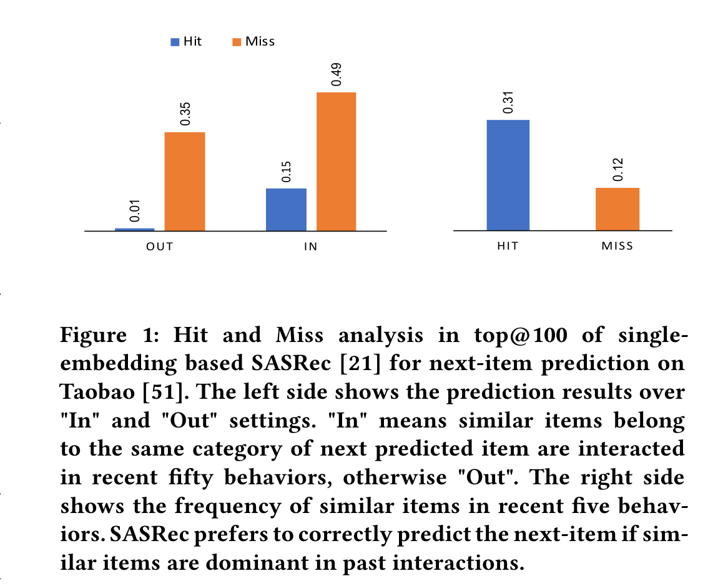
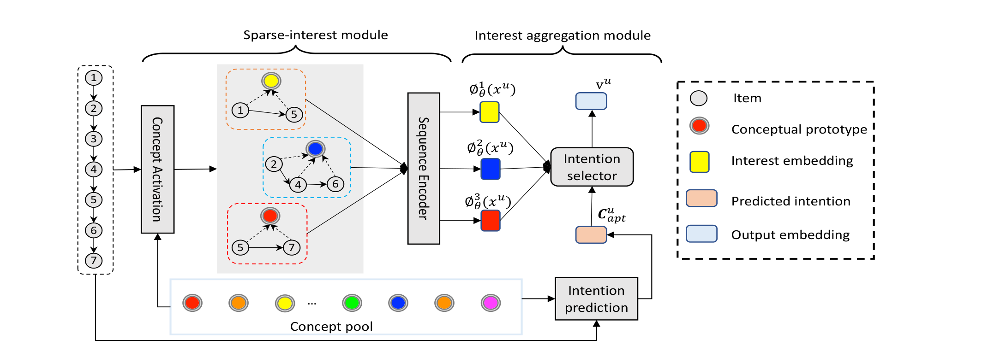
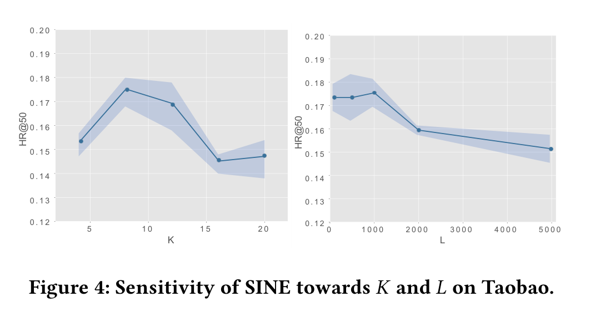
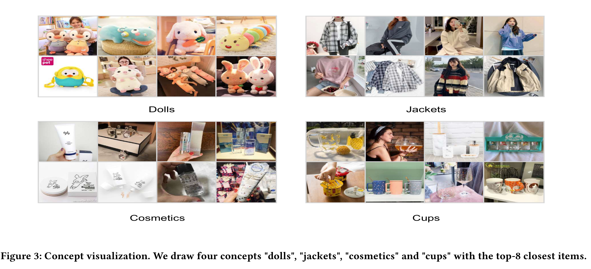

# 序列推荐的稀疏兴趣网络（Sparse-Interest Network for Sequential Recommendation）

> Qiaoyu Tan¹ | Jianwei Zhang² | Jiangchao Yao² | Ninghao Liu¹
>
> Jingren Zhou² | Hongxia Yang² | Xia Hu¹
>
> ¹ 德克萨斯农工大学计算机科学与工程系，德克萨斯州，美国（Texas A&M University, TX, USA）
>
> ² 阿里巴巴集团（Alibaba Group）
>
> {qytan,nhliu43,xiahu}@tamu.edu
>
> {zhangjianwei.zjw,jiangchao.yjc,jingren.zhou,yang.yhx}@alibaba-inc.com

本文提出稀疏兴趣网络（SINE，Sparse-Interest NEtwork）——用一个"概念激活 + 意图分配 + 注意力加权"的稀疏兴趣模块，从大规模概念原型池中自适应地为每个用户激活一小簇稀疏的概念并生成多个兴趣嵌入，再用一个基于主动预测的兴趣聚合模块动态预测用户下一意图、显式聚合多重兴趣做 top-N 推荐，**在 Taobao 与十亿规模工业数据集 ULarge 上全面超越 state-of-the-art 基线，最高相对提升达 +34.06%**。

核心内容：

- 痛点：从行为序列学单一嵌入会被最近的高频行为主导，当概念相似 item 不在近期交互中占优时会推错；工业级 item 往往在概念上没有干净聚类，且用户只与少数几个概念交互
- 方案：SINE 用上下文激活（top-K 选择技巧让离散选择可微）从巨大的概念池里为每个用户激活稀疏概念子集，再按 item-意图概率和注意力生成多个兴趣嵌入
- 技术细节：概念编码层（ $s^u = \langle C, z^u \rangle$ + top-K）→ 意图分配（余弦相似度 $P_{k|t}$ ）→ 自注意力加权（ $P_{t|k}$ ）→ 输出 $K$ 个兴趣嵌入 $\phi^k_\theta(x^{(u)})$
- 聚合模块：先用 softmax 注意力预测用户的下一意图 $C^u_{apt}$ ，再用带温度 $\tau=0.1$ 的 softmax 选中最优兴趣，凑出最终表示 $v^u$
- 训练：负对数似然（判示例为 softmax）用 sampled softmax 加速，另加协方差正则化 $\mathcal{L}_c$ 强制概念原型互相正交

关键发现：

- 三个开源基准上 SINE 均优于所有基线；Taobao 上 HR@50 达到 17.69，比最佳基线 MIND（15.35）相对提升约 **+15.24%**
- 十亿级工业数据集 ULarge 上，SINE 的 HR@50 达 12.24，相对第二好基线 MIND（9.13）提升 **+34.06%**，HR@100 提升 +9.37%
- 消融：SINE 相对用原始类别做原型的 SINE-cate 在 Taobao/ULarge 上大幅领先；学到概念与专家标注的第二层类别最接近（NMI 0.37），说明其捕获的是高层语义
- 超参： $K=8$ 、 $L=1000$ 时表现最佳，验证概念可视为"虚拟类别"
- 局限/展望：作者计划用终身学习（lifelong learning）捕获用户的长期兴趣

---

## 摘要

序列推荐的近期方法侧重于从用户的行为序列中学到一个整体嵌入向量来做下一 item 推荐。然而，通过实证分析我们发现，用户的行为序列往往包含多个概念上截然不同的 item，而统一的嵌入向量主要受一个人最近的频繁行为影响。因此，如果概念相似的 item 不是近期交互中的主导，那么它就可能无法推断出下一个偏好的 item。为此，一种替代方案是用多个嵌入向量来表示每个用户，以编码用户意图的不同方面。然而，近期关于多兴趣嵌入的工作通常只考虑通过聚类发现的少量概念，这可能无法与真实系统中庞大的 item 类别池相匹敌。有效地建模大量多样的概念原型并非易事，因为 item 在细粒度上往往没有在概念上得到良好聚类。此外，一个个体通常只与一个稀疏的概念集交互。鉴于此，我们为序列推荐提出一种新颖的稀疏兴趣网络（SINE，Sparse Interest NEtwork）。我们的稀疏兴趣模块能从大型概念池中自适应地推断出每个用户的稀疏概念集，并相应地输出多个嵌入。给定多个兴趣嵌入后，我们开发了一个兴趣聚合模块，以主动预测用户的当前意图，然后用它显式地为下一 item 预测建模多重兴趣。在几个公开基准数据集和一个大规模工业数据集上的实证结果表明，SINE 能相对 state-of-the-art 方法取得显著提升。

**关键词（Keywords）**：Recommender system, Sequential recommendation, Sparse-interest network, Multi-interest extraction

允许出于个人或课堂使用目的，免费制作本工作的全部或部分内容的数字或硬拷贝，前提是这些拷贝不得以营利或商业优势为目的进行制作或分发，且拷贝首页须带有本声明和完整的引用信息。对本工作中由 ACM 以外的组织拥有的组件的版权必须予以尊重。允许在注明出处的前提下进行摘要转载。如需以其他方式复制、再版、发布到服务器或分发给列表，须事先获得特定许可并/或支付相应费用。请向 permissions@acm.org 申请许可。

WSDM '21，2021 年 3 月 8–12 日，虚拟会议（线上），以色列。© 2021 美国计算机学会（ACM，Association for Computing Machinery）。ACM ISBN 978-1-4503-8297-7/21/03...\$15.00

DOI: https://doi.org/10.1145/3437963.3441811

## 1. 引言

推荐系统已被广泛应用到许多在线服务中，例如电子商务（E-commerce）、广告和社交媒体，以执行个性化的信息过滤 [14, 17, 31, 46]。其核心是基于过去的行为（例如购买和点击）估计用户与某个 item 交互的可能性。传统推荐方法采用协同过滤（CF，Collaborative Filtering）方法 [35] 来解决该问题，其假设行为上相似的用户会对 item 表现出相似的偏好。近年来，得益于深度学习强大的表达能力，基于神经网络的深度推荐模型在许多推荐场景中展现出革命性的性能。例如，NCF（Neural Collaborative Filtering，神经协同过滤）[14] 通过把内积的交互函数替换为非线性神经网络，扩展了基于矩阵分解的模型 [35]。PinSage [46] 建立在 GraphSage [10] 之上，通过在用户-item 交互图上执行卷积操作来学习用户和 item 的嵌入。然而，这些方法忽略了用户行为中的序列结构，因而无法捕获相邻行为之间的相关性。

一些近期工作将推荐形式化为一个序列问题。其核心思想是用有序序列表示每个用户，并假设顺序很重要。基于用户的行为历史，序列推荐方法首先对过去的行为进行排序以获得有序序列。之后，该序列会被输入到不同的神经序列模块（例如循环神经网络（RNN，Recurrent Neural Network）[17]、卷积神经网络（CNN，Convolutional Neural Network）[42] 和 Transformer [21]）中，以生成一个整体用户嵌入向量，然后用来预测下一个感兴趣的 item。由于序列推荐方法反映了现实世界的推荐情形，它在现代推荐系统中引起了广泛关注。

尽管取得了这些进展，我们仍然认为，由于从用户的行为序列中学习单一嵌入这一瓶颈，现有的序列推荐模型对下一 item 预测而言可能不是最优的。电子商务平台中的每个用户通常会随时间与几种概念上不同的 item 交互。例如，我们发现，在 Taobao 数据集 [51] 上，一个用户最近五十个行为中属于不同类别的 item 的类别数量约为 10 个。对于用户的多个意图 ¹，我们还观察到，在图 1 中，从行为序列中学到的整体用户嵌入向量主要受最近的频繁行为影响。因此，如果与下一个 item 概念相似的 item 不是近期交互中的主导，那么它就可能无法提取出预测下一 item 所需的相关信息。因此，一个有前景的替代方案是从用户的行为序列中学到多个嵌入向量，其中每个嵌入向量编码用户兴趣的一个方面。

然而，在工业级数据上从用户行为序列中有效提取多个嵌入向量存在几个挑战。首先，在真实系统中，item 往往在概念上没有良好聚类。虽然 item 的类别信息可以用作概念，但在许多情况下，由于实践中的标注噪声，这类辅助信息可能不可用或不可靠。第二个挑战是从大型概念池中自适应地为用户推断出一个稀疏的感兴趣概念集。该推断过程包含一个选择操作，这是一个离散优化问题，难以端到端训练。第三，给定多个兴趣嵌入向量，我们需要确定哪个兴趣可能在下一 item 预测中被激活。在训练期间，下一个被预测的 item 可以用作标签来激活优选的意图，但推理阶段没有这样的标签。模型必须自适应地预测用户的下一意图。

在本文中，我们提出一种新颖的稀疏兴趣网络（SINE，Sparse-Interest NEtwork）用于序列推荐，以解决这些问题。SINE 能以端到端的方式学习一个大规模的兴趣组池并捕获用户的多重意图。图 4 展示了 SINE 的整体结构。我们的稀疏兴趣提取模块从大规模兴趣组池中自适应地推断用户交互过的兴趣，并输出多个兴趣嵌入。聚合模块能够动态预测用户的下一意图，从而显式地为 top-N item 推荐捕获多重兴趣。我们在几个公开基准和一个工业数据集上开展实验。实证结果表明，我们的框架优于 state-of-the-art 模型，并能产出合理的 item 簇。总而言之，本文的主要贡献如下：

- 我们提出了一个综合框架，在推荐系统中联合集成了大规模 item 聚类与稀疏兴趣提取。
- 我们研究了一个自适应兴趣聚合模块，用于在序列推荐场景显式地为 top-N 推荐建模用户的多重兴趣。
- 我们的模型不仅在几个具有挑战性的真实世界数据集上取得了 state-of-the-art 性能，还产出了合理的兴趣组，以辅助多兴趣提取。

**图 1：** 基于单一嵌入的 SASRec [21] 在 Taobao [51] 上预测下一 item 的 top@100 命中与未命中分析。左侧展示在 "In" 和 "Out" 两种设置下的预测结果。"In" 表示与下一预测 item 属于同一类别的相似 item 出现在最近五十个行为中，否则为 "Out"。右侧展示最近五个行为中相似 item 的频率。如果相似 item 在过去交互中占主导，SASRec 更倾向于正确预测下一 item。

## 2. 相关工作

### 2.1 通用推荐

在传统推荐系统中，研究者专注于从用户的历史行为中提取用户的总体口味。典型示例包括协同过滤（CF）[35, 36]、矩阵分解（MF，Matrix Factorization）技术 [23] 和因子分解机（FM，Factorization Machine）[32]。它们的关键挑战在于用嵌入向量表示用户和 item，以计算它们的相似度。矩阵分解（MF）方法试图将用户和 item 映射到联合潜在（latent）空间中，并通过它们嵌入向量之间的内积来估计用户-item 交互。因子分解机 [32] 旨在用因子化参数建模变量之间的所有交互，即使在面临稀疏性问题时也能估计交互。近年来，受深度学习在计算机视觉和自然语言处理领域成功的启发 [49]，大量工作致力于开发基于深度学习的推荐算法 [9, 14, 40]。一条工作线试图用神经网络为内容感知推荐提取额外特征 [22]。另一类工作旨在替代传统 MF。例如，NCF [14] 用多层感知机替代 MF 中的内积运算进行交互估计，而 AutoRec [37] 采用自编码器来预测评分。此外，若干尝试也将图神经网络（GNN，Graph Neural Network）[7, 19, 39, 48] 应用于推荐 [13, 46]。

### 2.2 序列推荐

序列推荐已成为现代推荐系统的关键问题，因为它能够捕获连续 item 之间的序列模式。一类工作试图基于马尔可夫链（MC，Markov Chain）建模 item 到 item 的转移矩阵。例如，一些工作用一阶马尔可夫链 [4, 33] 对序列建模，其假设下一个动作只依赖于最后一个行为。为放宽这一限制，还有采用高阶马尔可夫链的方法，它们考虑更多先前的 item [11, 12, 45]。一个代表性工作是 Caser [42]，它把用户的行为序列当作一张"图像"，并采用卷积神经网络（CNN）来提取用户表示。另一类工作试图用序列神经模块处理用户行为序列 [16, 21, 38, 41]。例如，GRU4Rec [17] 首先应用门控循环单元（GRU，Gated Recurrent Unit）对整体会话建模，以获得更准确的推荐。与此同时，SASRec [21] 探索使用基于自注意力 [43] 的序列模型来捕获长期语义，并利用注意力机制基于相对较少的动作进行预测。此外，还有其他一些工作 [16, 25, 47] 为特定的推荐场景引入特定的神经模块。例如，DIN [50] 开发了一个局部激活单元，根据过去行为为某个特定广告自适应地学习用户表示。RUM [3] 在协同过滤见解的启发下，引入一种带记忆增强的神经网络用于推荐。SDM [28] 将多头自注意力模块与门控融合模块集成，为下一 item 预测捕获用户的长短期偏好。

### 2.3 注意力机制

注意力机制最初在计算机视觉 [2] 中提出，直到近几年才流行起来。它首先被用于解决机器翻译问题 [1]，后来作为 Transformer [43] 成为突破性的构建模块。近来，BERT 利用 Transformer 在自然语言处理领域的预训练中取得了巨大成功。它也被成功应用到许多推荐应用中 [38]，并且在现实世界的应用任务中相当有用和高效。

## 3. 方法

在本节中，我们首先介绍问题定义，然后详细讨论所提出的框架。最后，我们讨论我们的框架与现有方法之间的差异。

### 3.1 记号与问题定义

设 $\{x^{(u)}\}_{u=1}^{N}$ 为行为数据集，它由 $N$ 个用户和 $M$ 个 item 之间的交互组成。 $x^{(u)} = [x^{(u)}_1, x^{(u)}_2, \cdots, x^{(u)}_n]$ 是用户 $u$ 点击的 item 的有序序列，其中 $n$ 是用户 $u$ 的点击次数。序列中的每个元素 $x^{(u)}_t \in \{1, 2, \cdots, M\}$ 是被点击 item 的索引。注意，由于对延迟和性能的严格要求，工业推荐系统包含两个阶段：匹配阶段（matching stage）和排序阶段（ranking stage）[6]。匹配阶段旨在从大规模 item 池中检索 top-N 候选 item，而排序阶段旨在用更精确的分数对候选 item 进行排序。我们专注于提高匹配阶段的有效性，该阶段的任务是基于观测到的序列 $x^{(u)}$ 检索用户可能点击的高质量候选 item。

### 3.2 稀疏兴趣框架

由于真实世界推荐系统的 item 池通常包含数百万乃至数十亿个 item，匹配阶段在现代推荐系统中至关重要。具体来说，匹配阶段中的一个深度序列模型通常包含一个序列编码器 $\phi_\theta(\cdot)$ 和一个 item 嵌入表 $H \in \mathbb{R}^{M \times D}$ ，其中 $\theta$ 是包含所有可训练参数（包括 $H$ ）的集合。编码器以用户的历史行为序列 $x^{(u)}$ 为输入，输出序列的表示 $\phi_\theta(x^{(u)})$ ，它可以被视为用户意图的表示。用户意图嵌入随后被用作查询，通过一种快速的近邻算法（即 faiss [20]）从 item 池中生成候选 item。文献中的大多数编码器 $\phi_\theta(\cdot)$ 输出一个单一的 $D$ 维嵌入向量，但也有模型输出 $K$ 个 $D$ 维嵌入向量，以在 $K$ 个潜在类别下保留用户的意图。我们主要关注后者，目标是准确捕获用户的多样化意图。

用于捕获用户多重意图的 state-of-the-art 序列编码器可归结为两类。第一类方法借助强大的序列编码器来隐式提取用户的多重意图，例如基于多头自注意力（又称 Transformer [43]）的模型。另一类方法依赖潜在原型（latent prototype）显式捕获用户的多重意图。总体而言，由于实际中意图检测与嵌入相互交织，前者可能限制其捕获多重意图的能力。例如，实证结果表明，Transformer 学到的多个向量表示相比单头实现 [21] 并没有明显的优势。相反，后者可以借助通过聚类识别的概念有效提取用户的多样化兴趣，这一点已在 [27, 29] 中得到实证证明。然而，这些方法的可扩展性较差，因为它们要求每个用户在每个概念下都有一个意图嵌入，在工业应用中这很容易扩展到上千个。例如，在中国 Tmall 电子商务平台上，数百万乃至数十亿的 item 属于超过一万个由专家标注的叶类别 [24]。面对真实系统中的大规模兴趣概念池，需要一个可扩展的多兴趣提取模块。

因此，我们在此提出一个稀疏兴趣网络，它能够从大型概念池中为用户自适应地激活一个概念子集。我们模型的输入是用户的行为序列 $x^{(u)}$ ，它随后被送入嵌入层并转换为 item 嵌入矩阵 $X^{u} \in \mathbb{R}^{n \times D}$ 。设 $C \in \mathbb{R}^{L \times D}$ 表示整体的概念原型矩阵， $C^{u} \in \mathbb{R}^{K \times D}$ 表示用户 $u$ 在 $K$ 个潜在概念上被激活的原型嵌入矩阵。 $L$ 是概念总数。

**图 2：** SINE 的架构（最好彩色查看）。给定用户的行为序列作为输入，稀疏兴趣模块旨在从大规模兴趣组池中自适应地激活他/她的兴趣，并输出多兴趣嵌入。随后，兴趣聚合模块通过主动预测用户的下一意图，帮助为下一 item 推荐选择最偏好的兴趣。SINE 提供了以端到端方式聚类 item 并推断用户稀疏兴趣集的能力。

#### 3.2.1 概念激活

我们的稀疏兴趣层首先为每个用户 $u$ 推断感兴趣的概念原型 $C^{u}$ 。给定 $X^{u} \in \mathbb{R}^{n \times D}$ ，首先应用自注意力方法 [26] 有选择地聚合输入序列：

$$
a = \text{softmax}(\tanh(X^{u}W_1)W_2) \qquad (1)
$$

其中 $W_1 \in \mathbb{R}^{D \times D}$ 和 $W_2 \in \mathbb{R}^{D}$ 是可训练参数。向量 $a \in \mathbb{R}^{n}$ 是用户行为的注意力权重向量。当我们按注意力权重大小对输入序列的嵌入求和时，可以得到用户的虚拟概念向量 $z^{u} = (a^{\top}X^{u})^{\top}$ 。 $z^{u} \in \mathbb{R}^{D}$ 反映了用户的一般意图，可用于激活感兴趣的概念原型：

$$
s^{u} = \langle C, z^{u} \rangle, \quad idx = \text{rank}(s^{u}, K), \quad C^{u} = C(idx, :) \odot (\text{Sigmoid}(s^{u}(idx, :)1^{\top})) \qquad (2)
$$

其中 $\text{rank}(s^{u}, K)$ 是 top-K 排序算子，它返回 $s^{u}$ 中最大的 $K$ 个值的索引。 $\text{rank}(s^{u}, K)$ 返回的索引包含为用户 $u$ 选择出的原型的索引。 $C(idx, :)$ 执行行提取以形成子原型矩阵，而 $s(idx, :)$ 提取 $s^{u}$ 中索引为 $idx$ 的值。 $1 \in \mathbb{R}^{K}$ 是一个所有元素都为 1 的向量。 $\odot$ 表示 Hadamard 积， $\langle \cdot, \cdot \rangle$ 是内积。 $C^{u} \in \mathbb{R}^{K \times D}$ 是用户 $u$ 最终被激活的 $K$ 个潜在概念嵌入矩阵。公式 2 是一个 top-K 选择技巧，它使离散选择操作可微，先前工作 [8] 发现它在近似 top-K 选择问题方面非常有效。

#### 3.2.2 意图分配

在推断出当前概念原型 $C^{u}$ 之后，我们可以根据行为序列中每个 item 与原型的距离来估计其相关的用户意图：

$$
P_{k|t} = \frac{\exp(\text{LayerNorm}_1(X^{u}_t W_3) \cdot \text{LayerNorm}_2(C^{u}_k))}{\sum_{k'=1}^{K} \exp(\text{LayerNorm}_1(X^{u}_t W_3) \cdot \text{LayerNorm}_2(C^{u}_{k'}))} \qquad (3)
$$

其中 $P_{k|t}$ 衡量位置 $t$ 处的主要意图与第 $k$ 个潜在概念相关的可能性。 $C^{u}_k \in \mathbb{R}^{D}$ 是用户 $u$ 第 $k$ 个被激活概念原型的嵌入。 $W_3 \in \mathbb{R}^{D \times D}$ 是可训练权重矩阵。 $\text{LayerNorm}_l(\cdot)$ 表示层归一化层。注意，由于这里做了归一化，我们使用余弦相似度而不是内积。这一选择源于如下事实：在面临模型坍缩 [29]（即模型忽略大多数原型的退化情形）时，余弦相似度远不如点积那么脆弱。

#### 3.2.3 注意力加权

除了从概念角度计算的注意力权重 $P_{k|t}$ 之外，我们还考虑另一个注意力权重 $P_{t|k}$ ，以估计位置 $t$ 处的 item 对预测用户下一意图有多重要：

$$
P_{t|k} = a^{k}_t, \quad a^{k} = \text{softmax}(\tanh(X^{u}W_{k,1})W_{k,2})^{\top} \qquad (4)
$$

$a^{k} \in \mathbb{R}^{n}$ 是所有位置的注意力向量。上标 $k$ 表示它是第 $k$ 个被激活意图的注意力层。与公式 1 类似，上式是另一个自注意力层。主要区别在于，我们这里试图利用用户序列的顺序，并将额外的可训练位置嵌入 [43] 加到输入嵌入上。位置嵌入的维度与 item 嵌入相同，因此可以直接相加。

#### 3.2.4 兴趣嵌入生成

现在我们能够根据 $P_{k|t}$ 和 $P_{t|k}$ 从用户的行为序列 $X^{u}$ 生成多个兴趣嵌入向量。具体来说，我们的稀疏兴趣编码器 $\phi^{k}_{\theta}(x^{(u)}) \in \mathbb{R}^{D}$ 的第 $k$ 个输出计算如下：

$$
\phi^{k}_{\theta}(x^{(u)}) = \text{LayerNorm}_3 \left( \sum_{t=1}^{n} P_{k|t} \cdot P_{t|k} \cdot X^{u}_t \right) \qquad (5)
$$

至此，我们已经介绍了稀疏兴趣网络的完整流程。给定一个用户的行为序列，我们首先从概念池中激活他/她偏好的概念原型。随后执行意图分配，以估计输入序列中每个 item 相关的用户意图。之后，应用自注意力层计算所有 item 对下一 item 预测的注意力权重。最后，根据公式 5 通过加权求和生成用户的多个兴趣嵌入。

### 3.3 兴趣聚合模块

经过稀疏兴趣提取模块之后，我们为每个用户获得多个兴趣嵌入。一个自然的后续问题是如何利用各种兴趣进行实际推理。一个直观的解决方案是像 MIND [24] 那样，用下一个被预测的 item 作为目标标签，在训练中为选择不同的兴趣嵌入。尽管它很简单，但主要缺点是推理期间没有目标标签，这会带来训练与测试之间的差距，并可能导致性能退化。

为解决这个问题，我们提出一个基于主动预测的自适应兴趣聚合模块。这里的动机是，预测用户基于时间偏好的下一意图，比寻找理想的标签更容易。具体来说，基于公式 3 中计算的意图分配分数 $P_{k|t}$ ，我们可以得到一个意图分布矩阵，记为 $P^{u} \in \mathbb{R}^{n \times K}$ ，它覆盖行为序列中的所有 item。然后，输入行为序列 $x^{u}$ 可以从意图视角重新表述，记为 $\widetilde{X}^{u} = P^{u}C^{u}$ ，其中 $\widetilde{X}^{u} \in \mathbb{R}^{n \times D}$ 被视为用户 $u$ 的意图序列。利用 $\widetilde{X}^{u}$ ，用户的下一意图 $C^{u}_{apt}$ 被自适应地计算为：

$$
C^{u}_{apt} = \text{LayerNorm}_4 \left( \left( \text{softmax}(\tanh(\widetilde{X}^{u}W_3)W_4) \right)^{\top} \widetilde{X}^{u} \right)^{\top} \qquad (6)
$$

其中 $C^{u}_{apt} \in \mathbb{R}^{D}$ 是用户 $u$ 对下一 item 的预测意图。 $W_3 \in \mathbb{R}^{D \times D}$ 和 $W_4 \in \mathbb{R}^{D}$ 是可训练参数。给定 $C^{u}_{apt}$ 和多个兴趣嵌入 $\{ \phi^{k}_{\theta}(x^{(u)}) \}_{k=1}^{K}$ ，不同兴趣的聚合权重计算如下：

$$
e^{u}_{k} = \frac{\exp((C^{u}_{apt})^{\top}\phi^{k}_{\theta}(x^{(u)})/\tau)}{\sum_{k'=1}^{K} \exp((C^{u}_{apt})^{\top}\phi^{k'}_{\theta}(x^{(u)})/\tau)} \qquad (7)
$$

其中 $e^{u} = [e^{u}_1, e^{u}_2, \cdots, e^{u}_K]^{T} \in \mathbb{R}^{K}$ 是多样化兴趣的注意力向量。 $\tau$ 是一个待调节的温度参数。当 $\tau$ 很大（ $\tau \to \infty$ ）时， $e^{u}$ 近似于一个均匀分布向量。当 $\tau$ 很小（ $\tau \to 0^{+}$ ）时， $e^{u}$ 近似于一个 one-hot 向量。在实验中，我们使用 $\tau = 0.1$ 来迫使聚合器在推理时选择最偏好的意图。最终的用户表示 $v^{u} \in \mathbb{R}^{D}$ 计算如下：

$$
v^{u} = \sum_{k=1}^{K} e^{u}_{k} \cdot \phi^{k}_{\theta}(x^{(u)}) \qquad (8)
$$

### 3.4 模型优化

我们遵循常见做法 [21, 24]，通过基于该点击之前的截断序列 $[x^{(u)}_1, x^{(u)}_2, \cdots, x^{(u)}_{t-1}]$ 恢复下一次点击 $x^{(u)}_t$ 来训练我们的模型。给定一个带有用户嵌入向量 $v^{u}$ 和 item 嵌入 $H_t$ 的训练样本 $(u, t)$ ，我们旨在最小化如下的负对数似然：

$$
\mathcal{L}_{like} = - \sum_{u} \sum_{t} \log P(x^{(u)}_t | x^{(u)}_1, x^{(u)}_2, \cdots, x^{(u)}_{t-1}) = - \sum_{u} \sum_{t} \log \frac{\exp(H^{\top}_t v^{u})}{\sum_{j \in \{1, 2, \cdots, M\}} \exp(H^{\top}_j v^{u})} \qquad (9)
$$

公式 (9) 在实践中通常是不可解的，因为分母的求和运算在计算上极其昂贵。因此，我们采用一种采样的 softmax（Sampled Softmax）技术 [6, 18] 来训练我们的模型。此外，我们还按照 [5] 引入一个协方差正则化项，以强制学到的概念原型保持正交。具体来说，记 $M = \frac{1}{D}(C - \bar{C})(C - \bar{C})^{\top}$ 为原型嵌入的协方差矩阵，其中 $\bar{C}$ 是 $C$ 的均值矩阵。用于正则化协方差的正则化损失 $\mathcal{L}_{c}$ 为：

$$
\mathcal{L}_{c} = \frac{1}{2} \left( ||M||^{2}_{F} - ||\text{diag}(M)||^{2}_{F} \right) \qquad (10)
$$

其中 $||\cdot||_{F}$ 是 Frobenius 范数矩阵。结合上述两个损失，我们模型的最终损失函数为：

$$
\mathcal{L} = \mathcal{L}_{like} + \lambda \mathcal{L}_{c} \qquad (11)
$$

其中 $\lambda$ 是平衡这两个损失的权衡参数。

### 3.5 与现有模型的联系

我们将我们的模型与专注于在推荐匹配阶段提取用户多重兴趣嵌入的现有方法进行比较。我们粗略地将它们分为两类，并分析其中的差异。

隐含方法。这类方法依赖强大的神经网络来隐式聚类历史行为并提取多样化兴趣。例如，MIND [24] 利用胶囊网络（Capsule network）[34] 将用户行为自适应地聚合为兴趣嵌入向量。SASRec [21] 采用多头自注意力机制 [43] 为用户输出多个表示。与这些方法相比，我们的模型属于一种显式方法，它基于潜在概念原型从用户行为序列中显式检测意图。

显式方法。属于这一类的方法维护一组概念原型，以显式确定用户行为序列中 item 的意图。MCPRN [44] 是近期一个从会话中提取多重兴趣用于下一 item 推荐的代表性工作。DisenRec [29] 利用潜在原型帮助为推荐学习解耦表示。与它们相比，我们也遵循显式方法，但我们的模型可以扩展到大规模数据集。具体来说，它们要求多样化兴趣嵌入的数量等于概念原型的数量。然而，潜在概念的数量取决于应用，在工业推荐系统中可以轻易扩展到数百甚至数千，从而阻碍了它们在实际中的应用。相比之下，我们的稀疏兴趣网络能够自动从大型概念池中推断出一个稀疏的偏好意图集。

## 4. 实验

在本节中，我们在三个基准数据集和一个十亿规模（billion-scale）的工业数据上开展实验，以验证所提出的方法。具体来说，我们试图回答以下问题：

- 与其他 state-of-the-art 基线相比，所提出的方法有多有效？Q1
- 通过消融研究，不同模块——稀疏兴趣模块与兴趣聚合模块——各自的贡献是什么？Q2
- 超参数设置有多敏感，包括偏好的 $K$ 个意图和相应的 $L$ 个概念原型？Q3

### 4.1 实验设置

在本节中，我们详细说明实验中的数据集描述、评估指标和比较方法。

数据集。我们在三个基准数据集和一个十亿规模工业数据上进行实验。数据集的统计信息如表 2 所示。

- MovieLens ² 收集用户对电影的评分。在实验中，我们按照 [15] 对数据集进行预处理。
- Amazon ³ 包含来自 Amazon 的产品浏览记录。在实验中，我们只使用 Book 类别行为的仅评分版本。注意，由于体积大且稀疏，该版本比 [24] 中使用的 5-core 版本更具挑战性。
- Taobao ⁴ 收集来自淘宝推荐系统的用户行为。在实验中，我们只使用点击行为。
- ULarge 包含从阿里巴巴公司 2020 年 3 月 29 日至 4 月 4 日的日常日志中收集的点击行为。

对于所有数据集，我们都遵循 [21] 将数据集划分为训练集/验证集/测试集。具体来说，我们将每个用户的历史序列分成三部分：(1) 最近一次动作用于测试，(2) 第二近的动作用于验证，(3) 其余所有动作用于训练。注意，在测试期间，输入序列包含训练动作和验证动作。

**表 2：** 数据集的统计信息。

| 数据集 | # users | # items | # interactions |
| --- | --- | --- | --- |
| MovieLens | 6,040 | 3,952 | 1,000,209 |
| Amazon | 8,026,324 | 2,330,066 | 22,507,155 |
| Taobao | 987,994 | 4,162,024 | 100,150,807 |
| ULarge | 106,527,123 | 25,000,000 | 4,000,000,000 |

竞争者。我们将所提出的 SINE 模型与下列 state-of-the-art 序列推荐基线进行比较。

- 单一嵌入模型：GRU4Rec [17] 是一项开创性工作，它采用 GRU 对用户行为序列建模。Caser [42] 是近期一个基于 CNN 的序列推荐基准。
- 多嵌入模型：MIND [24] 和 SASRec [21] 是近期提出的基于胶囊网络 [34] 和多头自注意力 [43] 的多兴趣方法。MCPRN 是另一个基于潜在概念原型的 state-of-the-art 多兴趣框架。

参数配置。为公平比较，所有方法都用 Tensorflow 实现，并用 Adam 优化器优化，mini-batch 大小为 128。学习率固定为 0.001。我们根据原论文建议的值调节比较方法的参数，并设置嵌入大小 $D$ 为 128，负样本数量为 5 和 10（分别用于 MovieLens 和其他数据集）。对于我们的方法，它有三个关键超参数：权衡参数 $\lambda$ 、意图数量 $K$ 和潜在原型 $L$ 。我们搜索 $K \in \{4, 8, 12, 16\}$ 、 $L \in \{50, 100, 500, 1000, 2000, 5000\}$ ，并在 0 到 1 之间以步长 0.1 搜索 $\lambda$ 。我们发现当 $\lambda$ 大约为 0.5 时模型相对稳定，于是设 $\lambda = 0.5$ 。另外两个参数在四个数据集上的配置报告在表 3 中。

**表 3：** 我们模型的最优超参数设置。其他参数如维度 $D$ 、序列长度 $n$ 和 $\lambda$ 分别设置为 128、20 和 0.5。

| 数据集 | # intentions $K$ | # concepts $L$ |
| --- | --- | --- |
| MovieLens | 4 | 50 |
| Amazon | 4 | 500 |
| Taobao | 8 | 1000 |
| ULarge | 8 | 5000 |

评估指标。对于测试集中的每个用户，我们把该用户未交互过的所有 item 视为负 item。我们使用两种常用的评估标准 [14]：命中率（HR，Hit Rate）和归一化折扣累积增益（NDCG，Normalized Discounted Cumulative Gain）来评估我们模型的性能。此外，我们还利用广泛使用的归一化互信息（NMI，Normalized Mutual Information）[30] 来对我们模型学到的概念原型在 item 聚类方面的有效性进行定量分析。

### 4.2 与 SOTA 的比较（Q1）

表 1 总结了 SINE 以及基线在三个基准数据集上的性能。显然，总体而言，SINE 在所有评估标准上都取得了与所有基线相当的性能。Caser 在只为每个用户输出单一嵌入的模型（GRU4Rec）中取得了最佳性能。可以观察到，为用户使用多个嵌入向量（SASRec、MIND、MCPRN、SINE）的方法总体上优于基于单一嵌入的方法（Caser 和 GRU4Rec）。因此，探索多个用户嵌入向量已被证明是建模用户多样化兴趣、提升序列推荐准确率的有效途径。此外，我们可以观察到，捕获用户各种意图所带来的提升在 Taobao 和 Amazon 数据集上更为显著。Taobao 和 Amazon 的用户在线购物时往往比给电影评分时表现出更多样化的兴趣。MIND 相对 SASRec 的提升表明，动态路由（dynamic routing）作为多兴趣提取器要优于多头自注意力。一个有趣的观察是，MIND 在 Amazon 和 Taobao 上打败了 MCPRN，却在 MovieLens 上失利。这主要是因为 MCPRN 只支持将全部 item 聚类到一小组原型中，难以很好地聚类 Amazon 和 Taobao 上数百万的 item。综合 MIND 和 SINE 的结果来看，SINE 在所有评估指标上、三个数据集上始终优于 MIND。这可以归结为两点：1) 稀疏兴趣提取器层显式地利用一大组概念原型对 item 进行聚类，并自动推断出一组偏好的兴趣用于生成兴趣嵌入，从而获得更精确的用户表示。2) 兴趣聚合模块主动预测用户的当前意图，直接对所有用户嵌入向量做注意，从而能够为 top-N 推荐建模多重兴趣。

**表 1：** 公开数据集上的推荐性能。最佳结果以粗体突出显示。表中的所有数字均为省略了 "%" 的百分数。

| 方法 | MovieLens@10 HR | MovieLens@10 NDCG | MovieLens@50 HR | MovieLens@50 NDCG | Amazon@50 HR | Amazon@50 NDCG | Amazon@100 HR | Amazon@100 NDCG | Taobao@50 HR | Taobao@50 NDCG | Taobao@100 HR | Taobao@100 NDCG |
| --- | --- | --- | --- | --- | --- | --- | --- | --- | --- | --- | --- | --- |
| GRU4Rec | 14.61 | 5.66 | 41.61 | 10.66 | 1.70 | 0.51 | 2.74 | 0.67 | 9.41 | 3.60 | 12.43 | 4.08 |
| Caser | 15.44 | 6.13 | 43.64 | 11.53 | 2.60 | 0.81 | 3.96 | 1.03 | 10.71 | 4.96 | 13.50 | 5.68 |
| SASRec | 17.34 | 7.84 | 46.01 | 13.53 | 3.17 | 1.01 | 4.43 | 1.28 | 13.36 | 5.64 | 15.73 | 6.38 |
| MIND | 15.62 | 6.58 | 43.98 | 12.30 | 3.85 | 1.29 | 5.35 | 1.56 | 15.35 | 8.35 | 17.49 | 8.72 |
| MCPRN | 15.82 | 6.77 | 44.21 | 12.83 | 3.42 | 1.18 | 5.22 | 1.47 | 14.32 | 7.34 | 16.43 | 7.67 |
| SINE | 16.34 | 7.06 | 45.79 | 13.50 | 4.57 | 1.61 | 6.26 | 1.88 | 17.69 | 10.41 | 20.64 | 10.89 |

参数敏感性（Q3）。我们还研究意图数量 $K$ 和概念原型数量 $L$ 的敏感性。图 4 以 HR 的形式报告了模型的性能。具体来说，我们随机选择 100 万个用户进行推理，并报告 10 次运行的平均结果。其他数据集上的结果一致，这里为了节省空间省略了该图。从图中可以观察到，当 $K = 8$ 且 $L = 1000$ 时，SINE 取得最佳性能。考虑到 Taobao 总共有大约 9000 个不同的类别，这验证了学到的概念确实与 item 的类别有很强的联系，且概念可以被视为一个由若干类别组成的虚拟类别。

**图 4：** SINE 在 Taobao 上对 $K$ 和 $L$ 的敏感性。

### 4.3 工业数据集结果（Q1）

我们进一步开展离线实验，研究我们的模型在工业数据集中提取用户多样化兴趣的有效性。我们在阿里巴巴公司的分布式云平台上实施了我们的模型和基线，其中每两个 worker 共享一块 16GB 内存的 NVIDIA Tesla P100 GPU。表 4 以命中率的形式总结了性能。很明显，SINE 以很大的优势显著优于其他基线。另一个有趣的观察是，当召回 item 数量增加时，SINE 与第二好基准（MIND）之间的差距会缩小。这一事实表明，我们的稀疏兴趣网络帮助捕获了用户多样化的兴趣，并把最偏好的 item 排在了推荐列表顶部。

**表 4：** 工业数据集 ULarge 上的推荐性能。Improv. 行表示我们的模型相对第二好基线的提升。

| 方法 | HR@50 | HR@100 | HR@500 |
| --- | --- | --- | --- |
| Caser | 6.93 | 16.75 | 36.94 |
| GRU4Rec | 5.46 | 14.80 | 33.35 |
| SASRec | 8.64 | 18.58 | 38.82 |
| MCPRN | 7.89 | 17.65 | 37.66 |
| MIND | 9.13 | 19.31 | 39.09 |
| SINE | 12.24 | 21.12 | 40.81 |
| Improv. | 34.06% | 9.37% | 4.40% |

同时，我们还可视化了模型学到的概念原型。具体地说，对每个概念，我们利用其原型嵌入向量，在余弦相似度下检索最接近的 top-8 个 item。图 3 展示了四个示例概念来体现它们的聚类性能。可以看到，我们的模型成功地将一些语义相似的 item 分组成一个潜在概念。更重要的是，一个概念中的 item 来自不同的语义相近的叶类别。例如，"cosmetics"（化妆品）概念包含不同种类的护肤产品。这表明，与传统的叶类别划分相比，我们的概念原型与用户的高层意图相关。

**图 3：** 概念可视化。我们用最接近的 top-8 个 item 绘制四个概念 "dolls"（玩偶）、"jackets"（夹克）、"cosmetics"（化妆品）和 "cups"（杯子）。

为证实这一点，我们将学到的概念与阿里巴巴公司专家标注的类别层级进行比较，其中第一层、第二层和叶层的类别数量分别为 178、7,945 和 14,874。表 5 以 NMI 的形式报告了结果。我们可以观察到，学到的概念最接近第二层类别，而不是极细粒度（叶层）或极粗粒度（第一层）。这一结果表明，我们的模型能够捕获相对高层级的语义，以用于用户意图建模。

**表 5：** 与 ULarge 上一级、二级和叶级类别信息相比的原型聚类评估。

| 层级 | NMI |
| --- | --- |
| 一级（Level-1） | 0.09 |
| 二级（Level-2） | 0.37 |
| 叶级（Level-leaf） | 0.29 |

### 4.4 消融研究（Q2）

我们引入两个变体（SINE-cate 和 SINE-label）来验证学到的原型的有效性以及兴趣聚合模块的有效性。具体来说，SINE-cate 是通过使用类别属性作为原型得到的，而 SINE-label 是通过在训练中采用 [24] 中的标签感知注意力（label-aware attention）得到的。我们只在 Taobao 和 ULarge 上进行实验，因为其他数据集没有类别属性。Taobao 和 ULarge 分别有 9,439 和 14,874 个不同的类别。注意，与 MIND [24] 类似，SINE-label 首先基于 $K$ 个嵌入向量独立检索 $K \cdot N$ 个候选 item，然后通过对 $K \cdot N$ 个 item 排序输出最终的 top-N 推荐列表。表 5 以 HR 的形式报告了结果。显然，SINE 在两个数据集上都显著优于其他两个变体。SINE-cate 与 SINE 之间的巨大差异表明，学到的概念比原始 item 的类别更适合对 item 聚类。这验证了我们在模型中联合聚类 item 的动机。SINE 相对 SINE-label 的提升验证了我们的兴趣注意力模块对为下一 item 推荐建模多重兴趣是有用的。

**表 6：** SINE 的消融研究。

| 数据集 | 方法 | HR@50 | HR@100 |
| --- | --- | --- | --- |
| Taobao | SINE-cate | 12.45 | 15.33 |
| Taobao | SINE-label | 16.22 | 18.74 |
| Taobao | SINE | 17.69 | 20.64 |
| ULarge | SINE-cate | 7.18 | 17.46 |
| ULarge | SINE-label | 10.09 | 20.33 |
| ULarge | SINE | 12.24 | 21.12 |

## 5. 结论

在本文中，我们为序列推荐提出了一种新颖的稀疏兴趣嵌入框架。我们的模型能够从大型概念原型池中自适应地激活多个意图，从而为用户生成多个兴趣嵌入。它还开发了一个兴趣聚合模块来捕获多重兴趣，从而主动获得整体 top-N item。实证结果表明，我们的模型在具有挑战性的数据集上优于 state-of-the-art 基线。在十亿规模工业数据集上的结果进一步证实了我们的模型在推荐准确率以及产出合理 item 聚类方面的有效性。我们计划利用终身学习（lifelong learning）捕获用户的长期兴趣，以实现更准确的推荐。

---

¹ 在整篇论文中，我们交替使用意图（intention）和兴趣（interest）来表示由概念上相似的 item 构成的 item 簇。

² https://grouplens.org/datasets/movielens/1m/

³ http://jmcauley.ucsd.edu/data/amazon/

⁴ https://tianchi.aliyun.com/dataset/dataDetail?dataId=649

## 参考文献

[1] Dzmitry Bahdanau, Kyunghyun Cho, and Yoshua Bengio. 2014. Neural machine translation by jointly learning to align and translate. arXiv preprint arXiv:1409.0473 (2014).

[2] Peter J Burt. 1988. Attention mechanisms for vision in a dynamic world. In ICPRAM. IEEE Computer Society, 977–978.

[3] Xu Chen, Hongteng Xu, Yongfeng Zhang, Jiaxi Tang, Yixin Cao, Zheng Qin, and Hongyuan Zha. 2018. Sequential recommendation with user memory networks. In WSDM. 108–116.

[4] Chen Cheng, Haiqin Yang, Michael R Lyu, and Irwin King. 2013. Where you like to go next: Successive point-of-interest recommendation. In IJCAI.

[5] Michael Cogswell, Faruk Ahmed, Ross Girshick, Larry Zitnick, and Dhruv Batra. 2015. Reducing overfitting in deep networks by decorrelating representations. arXiv preprint arXiv:1511.06068 (2015).

[6] Paul Covington, Jay Adams, and Emre Sargin. 2016. Deep neural networks for youtube recommendations. In RecSys. 191–198.

[7] Wenqi Fan, Yao Ma, Qing Li, Yuan He, Eric Zhao, Jiliang Tang, and Dawei Yin. 2019. Graph neural networks for social recommendation. In WWW. 417–426.

[8] Hongyang Gao and Shuiwang Ji. 2019. Graph u-nets. arXiv preprint arXiv:1905.05178 (2019).

[9] Huifeng Guo, Ruiming Tang, Yunming Ye, Zhenguo Li, and Xiuqiang He. 2017. DeepFM: a factorization-machine based neural network for CTR prediction. arXiv preprint arXiv:1703.04247 (2017).

[10] Will Hamilton, Zhitao Ying, and Jure Leskovec. 2017. Inductive representation learning on large graphs. In NIPS. 1024–1034.

[11] Ruining He, Chen Fang, Zhaowen Wang, and Julian McAuley. 2016. Vista: a visually, socially, and temporally-aware model for artistic recommendation. In RecSys. 309–316.

[12] Ruining He and Julian McAuley. 2016. Fusing similarity models with markov chains for sparse sequential recommendation. In ICDM. IEEE, 191–200.

[13] Xiangnan He, Kuan Deng, Xiang Wang, Yan Li, Yongdong Zhang, and Meng Wang. 2020. LightGCN: Simplifying and Powering Graph Convolution Network for Recommendation. arXiv preprint arXiv:2002.02126 (2020).

[14] Xiangnan He, Lizi Liao, Hanwang Zhang, Liqiang Nie, Xia Hu, and Tat-Seng Chua. 2017. Neural collaborative filtering. In WWW. 173–182.

[15] Xiangnan He, Hanwang Zhang, Min-Yen Kan, and Tat-Seng Chua. 2016. Fast matrix factorization for online recommendation with implicit feedback. In SIGIR. ACM, 549–558.

[16] Balázs Hidasi and Alexandros Karatzoglou. 2018. Recurrent neural networks with top-k gains for session-based recommendations. In CIKM. 843–852.

[17] Balázs Hidasi, Alexandros Karatzoglou, Linas Baltrunas, and Domonkos Tikk. 2015. Session-based recommendations with recurrent neural networks. arXiv preprint arXiv:1511.06939 (2015).

[18] Sébastien Jean, Kyunghyun Cho, Roland Memisevic, and Yoshua Bengio. 2014. On using very large target vocabulary for neural machine translation. arXiv preprint arXiv:1412.2007 (2014).

[19] Bowen Jin, Chen Gao, Xiangnan He, Depeng Jin, and Yong Li. 2020. Multi-behavior recommendation with graph convolutional networks. In SIGIR. 659–668.

[20] Jeff Johnson, Matthijs Douze, and Hervé Jégou. 2019. Billion-scale similarity search with GPUs. IEEE Transactions on Big Data (2019).

[21] Wang-Cheng Kang and Julian McAuley. 2018. Self-attentive sequential recommendation. In ICDM. IEEE, 197–206.

[22] Donghyun Kim, Chanyoung Park, Jinoh Oh, Sungyoung Lee, and Hwanjo Yu. 2016. Convolutional matrix factorization for document context-aware recommendation. In RecSys. 233–240.

[23] Yehuda Koren, Robert Bell, and Chris Volinsky. 2009. Matrix factorization techniques for recommender systems. Computer 42, 8 (2009), 30–37.

[24] Chao Li, Zhiyuan Liu, Mengmeng Wu, Yuchi Xu, Huan Zhao, Pipei Huang, Guoliang Kang, Qiwei Chen, Wei Li, and Dik Lun Lee. 2019. Multi-interest network with dynamic routing for recommendation at Tmall. In CIKM. 2615–2623.

[25] Jiacheng Li, Yujie Wang, and Julian McAuley. 2020. Time Interval Aware Self-Attention for Sequential Recommendation. In WSDM. 322–330.

[26] Zhouhan Lin, Minwei Feng, Cicero Nogueira dos Santos, Mo Yu, Bing Xiang, Bowen Zhou, and Yoshua Bengio. 2017. A structured self-attentive sentence embedding. arXiv preprint arXiv:1703.03130 (2017).

[27] Ninghao Liu, Qiaoyu Tan, Yuening Li, Hongxia Yang, Jingren Zhou, and Xia Hu. 2019. Is a single vector enough? exploring node polysemy for network embedding. In KDD. 932–940.

[28] Fuyu Lv, Taiwei Jin, Changlong Yu, Fei Sun, Quan Lin, Keping Yang, and Wilfred Ng. 2019. SDM: Sequential deep matching model for online large-scale recommender system. In CIKM. 2635–2643.

[29] Jianxin Ma, Chang Zhou, Peng Cui, Hongxia Yang, and Wenwu Zhu. 2019. Learning disentangled representations for recommendation. In NIPS. 5711–5722.

[30] Aaron F McDaid, Derek Greene, and Neil Hurley. 2011. Normalized mutual information to evaluate overlapping community finding algorithms. arXiv preprint arXiv:1110.2515 (2011).

[31] Covington Paul, Adams Jay, and Sargin Emre. 2016. Deep neural networks for YouTube Recommendation. In RecSys. 191–198.

[32] Steffen Rendle. 2010. Factorization machines. In ICDM. IEEE, 995–1000.

[33] Steffen Rendle, Christoph Freudenthaler, and Lars Schmidt-Thieme. 2010. Factorizing personalized markov chains for next-basket recommendation. In WWW. 811–820.

[34] Sara Sabour, Nicholas Frosst, and Geoffrey E Hinton. 2017. Dynamic routing between capsules. In NIPS. 3856–3866.

[35] Badrul Sarwar, George Karypis, Joseph Konstan, and John Riedl. 2001. Item-based collaborative filtering recommendation algorithms. In WWW. 285–295.

[36] J Ben Schafer, Dan Frankowski, Jon Herlocker, and Shilad Sen. 2007. Collaborative filtering recommender systems. In The adaptive web. Springer, 291–324.

[37] Suvash Sedhain, Aditya Krishna Menon, Scott Sanner, and Lexing Xie. 2015. Autorec: Autoencoders meet collaborative filtering. In WWW. 111–112.

[38] Fei Sun, Jun Liu, Jian Wu, Changhua Pei, Xiao Lin, Wenwu Ou, and Peng Jiang. 2019. BERT4Rec: Sequential recommendation with bidirectional encoder representations from transformer. In CIKM. 1441–1450.

[39] Qiaoyu Tan, Ninghao Liu, and Xia Hu. 2019. Deep Representation Learning for Social Network Analysis. Frontiers in Big Data 2 (2019), 2.

[40] Qiaoyu Tan, Ninghao Liu, Xing Zhao, Hongxia Yang, Jingren Zhou, and Xia Hu. 2020. Learning to Hash with Graph Neural Networks for Recommender Systems. In WWW. 1988–1998.

[41] Qiaoyu Tan, Jianwei Zhang, Ninghao Liu, Xiao Huang, Hongxia Yang, Jignren Zhou, and Xia Hu. 2021. Dynamic memory based attention network for sequential recommendation. In AAAI.

[42] Jiaxi Tang and Ke Wang. 2018. Personalized top-n sequential recommendation via convolutional sequence embedding. In WSDM. 565–573.

[43] Ashish Vaswani, Noam Shazeer, Niki Parmar, Jakob Uszkoreit, Llion Jones, Aidan N Gomez, Łukasz Kaiser, and Illia Polosukhin. 2017. Attention is all you need. In NIPS. 5998–6008.

[44] Shoujin Wang, Liang Hu, Yan Wang, Quan Z Sheng, Mehmet A Orgun, and Longbing Cao. 2019. Modeling Multi-Purpose Sessions for Next-Item Recommendations via Mixture-Channel Purpose Routing Networks.. In IJCAI. 3771–3777.

[45] An Yan, Shuo Cheng, Wang-Cheng Kang, Mengting Wan, and Julian McAuley. 2019. CosRec: 2D Convolutional Neural Networks for Sequential Recommendation. In CIKM. 2173–2176.

[46] Rex Ying, Ruining He, Kaifeng Chen, Pong Eksombatchai, William L Hamilton, and Jure Leskovec. 2018. Graph convolutional neural networks for web-scale recommender systems. In KDD. 974–983.

[47] Feng Yu, Qiang Liu, Shu Wu, Liang Wang, and Tieniu Tan. 2016. A dynamic recurrent model for next basket recommendation. In SIGIR. 729–732.

[48] Wenhui Yu and Zheng Qin. 2020. Graph Convolutional Network for Recommendation with Low-pass Collaborative Filters. In ICML. PMLR, 10936–10945.

[49] Shuai Zhang, Lina Yao, Aixin Sun, and Yi Tay. 2019. Deep learning based recommender system: A survey and new perspectives. ACM Computing Surveys (CSUR) 52, 1 (2019), 1–38.

[50] Guorui Zhou, Xiaoqiang Zhu, Chenru Song, Ying Fan, Han Zhu, Xiao Ma, Yanghui Yan, Junqi Jin, Han Li, and Kun Gai. 2018. Deep interest network for click-through rate prediction. In KDD. 1059–1068.

[51] Han Zhu, Xiang Li, Pengye Zhang, Guozheng Li, Jie He, Han Li, and Kun Gai. 2018. Learning tree-based deep model for recommender systems. In SIGKDD. 1079–1088.