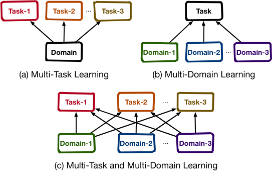
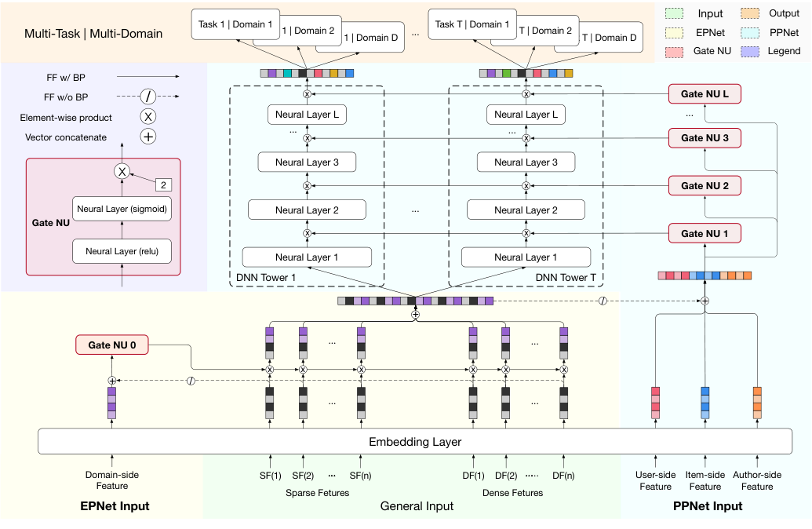
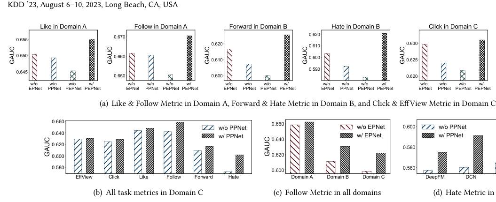
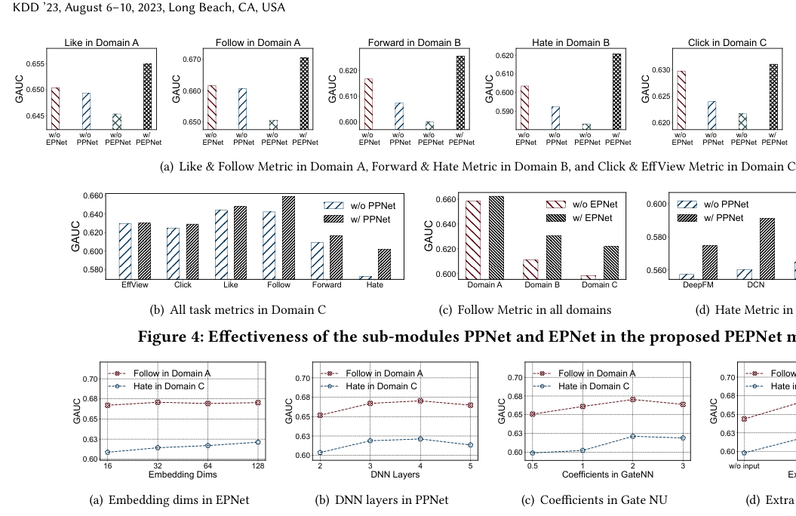

# PEPNet：注入个性化先验信息的参数与嵌入个性化网络

> Jianxin Chang, Chenbin Zhang∗, Yiqun Hui, Dewei Leng, Yanan Niu, Yang Song, Kun Gai | Kuaishou Technology, Unaffiliated
>
> KDD '23: The 29th ACM SIGKDD Conference on Knowledge Discovery and Data Mining, August 6-10, 2023, Long Beach, CA, USA
>
> ∗ 同等贡献，作者顺序由抛硬币决定。

本文介绍了PEPNet：注入个性化先验信息的参数与嵌入个性化网络。核心内容：

- 提出即插即用的参数与嵌入个性化网络（PEPNet），通过门控机制动态缩放底层嵌入和顶层DNN隐藏单元，用于多域和多任务推荐
- 嵌入个性化网络（EPNet）在嵌入层执行个性化选择，融合多域中不同用户具有不同重要性的特征；参数个性化网络（PPNet）对DNN参数进行个性化修改，平衡多任务中不同用户具有不同稀疏性的目标
- 该方法已在快手部署，每天服务超过3亿用户，带来观看时长超过1%的提升和多个交互目标约2%的提升

关键发现：

- 在快手工业数据集上，PEPNet在三个域的所有六个任务指标上显著优于所有基线方法，在更稀疏的域和任务上提升更为明显
- 消融研究验证了EPNet和PPNet分别在多域和多任务推荐中有效缓解不完全双重跷跷板问题
- PEPNet参数少、收敛速度快，可即插即用注入任何模型

---

## 摘要

随着在线购物和视频观看等在线服务中内容页面和交互按钮的增加，工业级推荐系统面临多域和多任务推荐的挑战。多任务和多域推荐的核心是在给定多种用户行为的情况下，准确捕捉用户在多个场景中的兴趣。在本文中，我们提出了一种即插即用的参数与嵌入个性化网络（PEPNet），用于多域和多任务推荐。PEPNet将个性化先验信息作为输入，通过门控机制动态缩放底层嵌入和顶层DNN隐藏单元。嵌入个性化网络（EPNet）在嵌入层执行个性化选择，以为多域中不同用户融合具有不同重要性的特征。参数个性化网络（PPNet）对DNN参数进行个性化修改，以平衡多任务中不同用户具有不同稀疏性的目标。我们结合快手训练框架和在线部署环境进行了一系列特殊的工程优化。通过注入嵌入的个性化选择和DNN参数的个性化修改，为每个个体兴趣量身定制的PEPNet获得了显著的性能提升，在跨多个域的多个任务指标上在线提升超过1%。我们已在快手应用中部署PEPNet，每天服务超过3亿用户。

**CCS概念**

• 信息系统 $\rightarrow$ 个性化；推荐系统。
• 计算方法 $\rightarrow$ 神经网络。

**关键词**

Multi-Domain Learning; Multi-Task Learning; Personalization; Recommender System

**ACM引用格式：**

Jianxin Chang, Chenbin Zhang, Yiqun Hui, Dewei Leng, Yanan Niu, Yang Song, and Kun Gai. 2023. PEPNet: Parameter and Embedding Personalized Network for Infusing with Personalized Prior Information. In Proceedings of the 29th ACM SIGKDD Conference on Knowledge Discovery and Data Mining (KDD '23), August 6-10, 2023, Long Beach, CA, USA. ACM, New York, NY, USA, 10 pages. https://doi.org/10.1145/3580305.3599884

## 1 引言

传统推荐模型关注单一域中的单一预测任务（如CTR（Click-Through Rate，点击率））[5, 14, 31]，即使用从单一域收集的样本进行训练，服务于单一任务的预测。然而，在实际应用中，推荐需求分散在不同的场景中。随着内容页面数量的增加，推荐系统面临数据片段分布在多个域中的关键问题。例如，淘宝1有诸如购前（猜你喜欢）、购中（再来一单）和购后（购买后猜你喜欢）等场景，如图1所示。而快手2有精选视频Tab、双列发现Tab和单列滑动Tab等场景。此外，每个页面上通常设计多个按钮供用户交互。为了利用用户反馈并提供更好的体验，推荐系统需要捕捉用户的多种行为偏好，建模用户与多个任务中不同目标进行交互的概率。例如，快手在图1中为用户提供了各种交互目标，如点赞、关注、转发、收藏和评论。

1https://www.taobao.com/
2https://www.kuaishou.com/

图2：与多任务学习或多域学习相比，多任务和多域学习在实际应用中更为重要且更为复杂。

由于不同场景中存在重叠的用户和item，多个域具有共性。并且不同目标在功能上相关，因此多个任务之间存在依赖关系。为每个域中的每个任务训练单独的模型，不仅在部署成本和迭代效率方面不可接受，而且未能利用全部数据，忽视数据之间的共性问题会导致次优性能。然而，将所有数据直接混合并使用统一模型进行训练，则忽略了域和任务之间的差异。无法对齐和融合具有不同语义和重要性的特征将导致域跷跷板[25]，因为用户行为和item候选在多个场景中的分布各不相同。由于不同目标具有不同的稀疏性且相互影响，无法平衡多个任务中相互依赖的目标会导致任务跷跷板[27]。

目前，多域学习和多任务学习在推荐系统中取得了很大进展[5, 23, 30–32]。但在实际应用中，我们不能简单直接地在多域和多任务联合设置中分别复用多域或多任务学习方法。多域方法侧重于对齐不同域下的特征语义，但忽略了多任务设置下标签空间中的目标依赖关系。多任务方法侧重于拟合不同任务的标签分布，但忽略了多域设置下特征空间的语义差异。如图2所示，与单独的多任务学习或多域学习相比，多任务学习和多域学习在实际应用中同时发生且更为复杂。一方面，同一任务的不同域和不同任务的同一域之间存在特征语义和重要性的差异。另一方面，同一域内的不同任务和不同域内的同一任务具有不同的目标稀疏性和相互依赖性。不同于任务跷跷板现象和域跷跷板现象，我们称之为不完全双重跷跷板现象。随着域和任务数量的增加，这种现象在工业级推荐系统中更为严重。由于实际行业中对高效率和低成本的要求，迫切需要一种即插即用的网络来解决多域和多任务的挑战。

个性化建模是推荐系统的核心。增强模型的个性化有助于捕捉用户在不同情境下对item的偏好程度。多域和多任务设置可以视为用户在不同情境下与item交互，因此更准确的个性化估计可以缓解不完全双重跷跷板问题。但简单地将个性化先验信息作为底层输入，其信号经过深度网络传递到顶层后效果变得极弱。如何在正确的位置以正确的方式将个性化先验信息注入模型是至关重要且值得探索的，特别是对于多个域和任务而言。

为了解决这个问题，我们提出了一种参数与嵌入个性化网络（PEPNet），用于多任务和多域推荐，它充分利用了任务之间的关系，并通过增强个性化来消除域偏差。与多任务学习[18, 27]和多域学习[13, 25]的现有工作相比，PEPNet是一种高效的即插即用网络。PEPNet将带有个性化先验信息的特征作为输入，通过门控机制动态缩放模型中的底层嵌入和顶层DNN（Deep Neural Network，深度神经网络）隐藏单元，分别称为域特定的EPNet和任务特定的PPNet。嵌入个性化网络（EPNet）在底层添加域特定的个性化信息以生成个性化嵌入门控。然后使用嵌入门控对来自多个域的原始嵌入进行个性化选择，得到个性化嵌入。参数个性化网络（PPNet）将用户和item的个性化信息与每个任务中DNN的输入连接起来，以获取个性化门控分数。然后与DNN隐藏单元逐元素相乘，对DNN参数进行个性化修改。通过将个性化先验信息映射到0到2之间的缩放权重，EPNet选择嵌入以融合多域中不同用户具有不同重要性的特征，PPNet修改DNN参数以平衡多任务中不同用户具有不同稀疏性的目标。

图1：快手短视频场景与淘宝电商场景的对比。两者都针对不同域进行推荐。此外，快手中每个域执行多个任务，例如对短视频的点赞、关注、转发、收藏和评论。

本工作的贡献总结如下：

• 我们提出了一种为每个个体兴趣量身定制的参数与嵌入个性化网络（PEPNet）。PEPNet是一种高效、低部署成本且即插即用的方法，可以注入任何模型。我们在工业短视频数据集上评估了PEPNet和其他SOTA方法，大量实验证明了我们的方法在缓解不完全双重跷跷板现象方面的有效性。

• 我们在快手的推荐系统中部署了PEPNet，服务超过3亿日活跃用户（DAU，Daily Active Users）。PEPNet的部署带来了观看时长超过1%的提升和多个交互目标约2%的提升。我们的方法可以推广到其他场景，研究人员可以从我们部署中获得的经验教训中受益。

## 2 方法

本节介绍缓解不完全双重跷跷板问题的详细设计。我们将详细阐述问题形式化、所提出的PEPNet的网络结构以及在中国最大的短视频平台之一快手中的部署。

### 2.1 问题形式化

这里我们定义研究中使用的符号和问题设置。模型使用稀疏/稠密输入，如用户历史行为、用户画像特征、item特征、上下文特征等。预测目标 $\hat{y}_t$ 是域 $d$ 中第 $t$ 个任务下用户 $u$ 对item $i$ 的偏好分数，通过以下方式计算：

$$
\hat{y}_t = F(\{E(u_1), \ldots, E(u_m) \oplus E(i_1), \ldots, E(i_n) \oplus E(c_1), \ldots, E(c_o)\}_d) \qquad (1)
$$

其中 $u_1, \ldots, u_m$ 表示用户特征，包括用户历史行为、用户画像和用户ID等。$i_1, \ldots, i_n$ 表示item特征，包括item类别、itemID（iid）和作者ID（aid）等。$c_1, \ldots, c_o$ 表示其他特征，包括上下文特征和组合特征。$m$、$n$ 和 $o$ 分别表示用户特征、item特征和其他特征的数量。$E(\ast)$ 表示稀疏/稠密特征经过分桶算法后由嵌入层映射为可学习嵌入，$\oplus$ 表示拼接。$\{\}_d$ 表示来自域 $d$ 的样本。$\hat{y}_t$ 表示任务 $t$ 的输出分数。$F$ 是推荐模型，本质上是一个可学习的预测函数。

在现实世界中，item候选池和部分用户在多个场景中是共享的。然而，由于不同的消费目的，用户对同一item的行为倾向在不同场景中会发生变化。为了更好捕捉用户对多种行为的倾向及其在多个场景中的关联，推荐器 $f$ 需要同时在多个域 $D$ 中对多任务 $T$ 进行预测。因此，多域和多任务推荐问题可以形式化为：$x_d \rightarrow \hat{y}_t$，其中 $x_d$ 是从每个域 $d \in D$ 收集的样本的特征，$\hat{y}_t$ 是每个任务 $t \in T$ 的预测分数。

### 2.2 网络结构

图3展示了我们提出的PEPNet模型的网络结构。整体架构由以下三个部分组成，我们将逐一详细阐述。

• **门控神经单元**。Gate NU是EPNet和PPNet的基本单元，是一种门控结构，用于处理更多具有不同个性化语义的先验信息，并注入到模型中。

• **嵌入个性化网络**。EPNet将个性化域特定信息作为Gate NU的输入，对嵌入进行个性化选择，以融合多域中不同用户具有不同重要性的特征。

• **参数个性化网络**。PPNet利用用户/item的个性化信息生成门控，对DNN参数进行个性化修改，以平衡多任务中不同用户具有不同稀疏性的目标。

#### 2.2.1 门控神经单元（Gate NU）

受语音识别领域提出的LHUC（Learning Hidden Unit Contributions，学习隐藏单元贡献）算法[26]启发，PEPNet引入了一种称为门控神经单元的门控机制，允许将个性化先验信息注入网络。LHUC专注于学习说话者特定的隐藏单元贡献，通过使用个性化贡献缩放模型的隐藏层，提高了不同说话者的语音识别准确性。然而，LHUC本质上使用用户ID作为个性化标识符，忽略了其他丰富的个性化先验信息，如用户的年龄、性别和其他画像信息。此外，在匹配用户和item的推荐系统中，item信息也至关重要，如item的ID、类别和作者。大量研究[22, 35, 36]表明，用户对不同item表现出不同的个性化偏好模式。

因此，我们提出了门控神经单元，简称Gate NU，以处理更多具有不同个性化语义的先验信息并将其注入模型。Gate NU（后面也称为℧）由两个神经网络层组成。我们将Gate NU的输入记为 $\mathbf{x}$，并将第一层公式化如下：

$$
\mathbf{x}' = \mathrm{Relu}(\mathbf{x}\mathbf{W} + \mathbf{b}) \qquad (2)
$$

其中 $\mathbf{W}$ 和 $\mathbf{b}$ 是可学习的权重和偏置。选择Relu作为非线性激活函数。第一层用于交叉具有各种先验信息的特征。然后，我们通过第二层定制门控分数的生成如下：

$$
\boldsymbol{\delta} = \gamma \ast \mathrm{Sigmoid}(\mathbf{x}'\mathbf{W}' + \mathbf{b}'), \quad \boldsymbol{\delta} \in [0, \gamma] \qquad (3)
$$

第一层的输出 $\mathbf{x}'$ 被输入到第二层。$\mathbf{W}'$ 和 $\mathbf{b}'$ 是第二层中可训练的权重和偏置。使用Sigmoid函数生成门控向量 $\boldsymbol{\delta}$，将其输出限制在 $[0, \gamma]$ 范围内。$\gamma$ 是缩放因子，设置为2。

从公式2和3可以看出，Gate NU利用先验信息 $\mathbf{x}$ 生成个性化门控 $\boldsymbol{\delta}$，自适应地控制先验信息的重要性，并使用超参数 $\gamma$ 进一步压缩和加倍有效信号。接下来，我们详细阐述如何在EPNet和PPNet中使用Gate NU，将重要的先验信息选择性注入模型的关键位置。

图3：PEPNet由Gate NU、EPNet和PPNet组成。Gate NU是利用先验信息生成个性化门控并自适应放大有效信号的基本单元。EPNet对嵌入进行个性化选择，以融合多域中不同用户具有不同重要性的特征。PPNet对DNN参数进行个性化修改，以平衡多任务中不同用户具有不同稀疏性的目标。在多个域中估计同一组多目标。PEPNet参数少、收敛速度快，可以即插即用到任何网络中。

#### 2.2.2 嵌入个性化网络（EPNet）

在工业级推荐系统中，嵌入表非常庞大，尤其是ID特征。为了节省计算和内存成本，共享底层嵌入结构被广泛使用如下：

$$
\mathbf{E} = E(\mathbf{F}_S) \oplus E(\mathbf{F}_D) \qquad (4)
$$

其中 $\mathbf{F}_S$ 是稀疏特征，$\mathbf{F}_D$ 是稠密特征。作为通用输入，它们通过嵌入层 $E(\ast)$ 转换为可学习嵌入 $\mathbf{E}$。

由于共享嵌入层用于来自不同域的训练样本，在实践中存在若干缺陷，因为它强调共性而忽略多个域之间的差异。EPNet在共享嵌入层的基础上，以低成本（即参数少、收敛速度快）将域特定的个性化先验信息注入嵌入。我们使用域侧特征 $E(\mathbf{F}_d) \in \mathbb{R}^k$ 作为EPNet的输入，包括域ID和域特定的个性化统计特征，如每个域中用户行为的计数和item曝光次数。℧$_{ep}$ 是嵌入层中EPNet的Gate NU，其输出 $\boldsymbol{\delta}_{\mathrm{domain}} \in \mathbb{R}^e$ 由下式给出：

$$
\boldsymbol{\delta}_{\mathrm{domain}} = \mathrm{℧}_{ep}(E(\mathbf{F}_d) \oplus (\nabla(\mathbf{E}))) \qquad (5)
$$

其中我们将通用嵌入 $\mathbf{E} \in \mathbb{R}^e$ 与输入拼接，但不使用梯度反向传播，记为 $\nabla(\ast)$。接下来，我们使用外部Gate NU对嵌入 $\mathbf{E}$ 进行个性化变换，而不改变原始嵌入层，从而为多域中不同用户对齐具有不同重要性的特征。变换后的嵌入为：

$$
\mathbf{O}_{ep} = \boldsymbol{\delta}_{\mathrm{domain}} \otimes \mathbf{E} \qquad (6)
$$

其中 $\mathbf{O}_{ep} \in \mathbb{R}^e$，$\otimes$ 表示逐元素乘积。注意，当嵌入层中的输入特征较多且向量维度较大时，向量级乘积是可选的。

#### 2.2.3 参数个性化网络（PPNet）

现有的多任务推荐器[18, 27]侧重于使用复杂模块来建模多任务表示。在基于多任务表示拟合多任务标签时，它们都使用DNN塔，即堆叠的神经网络层。然而，DNN塔的参数由所有用户共享。由于不同用户对各种行为的偏好不一致，缺乏个性化参数将使模型难以平衡多个任务，不可避免地导致性能跷跷板。

为了解决这个问题，我们提出PPNet来修改多任务学习中的DNN参数，构建为每个用户兴趣量身定制的DNN模型。我们使用用户/item/作者侧特征（$\mathbf{F}_u / \mathbf{F}_i / \mathbf{F}_a$）作为PPNet的个性化先验信息，如用户ID、itemID、作者ID（快手中短视频的创作者）以及其他侧信息特征，例如用户年龄/性别、item类别/热度等。具体来说，PPNet的详细结构如下：

$$
\mathbf{O}_{\mathrm{prior}} = E(\mathbf{F}_u) \oplus E(\mathbf{F}_i) \oplus E(\mathbf{F}_a)
$$

$$
\boldsymbol{\delta}_{\mathrm{task}} = \mathrm{℧}_{pp}(\mathbf{O}_{\mathrm{prior}} \oplus (\nabla(\mathbf{O}_{ep}))) \qquad (7)
$$

我们将EPNet的输出 $\mathbf{O}_{ep}$ 与个性化先验 $\mathbf{O}_{\mathrm{prior}}$ 拼接，作为℧$_{pp}$ 的输入，℧$_{pp}$ 是PPNet中的Gate NU。为避免影响EPNet中更新的嵌入，我们对 $\mathbf{O}_{ep}$ 执行停止梯度操作 $\nabla$。接下来，我们基于Gate NU输出 $\boldsymbol{\delta}_{\mathrm{task}}$ 使用逐元素乘积来加倍和压缩DNN每一层中的隐藏贡献 $\mathbf{H}$，如下所示：

$$
\mathbf{O}_{pp} = \boldsymbol{\delta}_{\mathrm{task}} \otimes \mathbf{H} \qquad (8)
$$

其中 $\mathbf{H} = [\mathbf{H}_1, \ldots, \mathbf{H}_T]$。在每个DNN层中，$\mathbf{H}_t \in \mathbb{R}^h$ 表示第 $t$ 个任务塔的隐藏单元。注意 $\boldsymbol{\delta}_{\mathrm{task}} \in \mathbb{R}^{h \ast T}$ 在分割成 $T$ 个维度为 $h$ 的向量后应用于 $T$ 个任务的隐藏层单元。类似地，分割后的 $\mathbf{O}_{pp}$ 表示 $T$ 个任务中 $h$ 维的PPNet输出。

此外，我们将PPNet集成到所有DNN层中，以充分个性化DNN参数，平衡多任务中不同用户具有不同稀疏性的目标，公式化如下：

$$
\mathbf{O}_{pp}^{(l)} = \boldsymbol{\delta}_{\mathrm{task}}^{(l)} \otimes \mathbf{H}^{(l)}
$$

$$
\mathbf{H}^{(l+1)} = f(\mathbf{O}_{pp}^{(l)} \mathbf{W}^{(l)} + \mathbf{b}^{(l)}), \quad l \in \{1, \ldots, L\} \qquad (9)
$$

其中 $L$ 是任务塔的DNN层数，$f$ 是激活函数。对于前 $L-1$ 层，激活函数 $f$ 使用Relu。最后一层的 $f$ 是Sigmoid，没有放大系数 $\gamma$，这与Gate NU不同。在最后一层获得多个域上多个任务的预测分数后，使用二元交叉熵进行优化。

### 2.3 工程优化策略

为了在快手的大规模推荐场景中部署PEPNet，我们制定了以下工程优化策略：

• **特征淘汰策略**：在大规模推荐系统中，将每个特征映射到嵌入向量会迅速占满服务器的内存资源。为避免耗尽存储嵌入的服务器内存，我们设计了一种无冲突且内存高效的全局共享嵌入表（GSET）。与传统的缓存淘汰策略（如LFU和LRU）侧重于最大化缓存命中率不同，GSET采用特征评分淘汰策略来防止低频特征反复进出系统，这会对系统性能产生负面影响。通过有效管理嵌入向量，内存使用可以保持在预定阈值以下，确保长期系统性能。

• **在线同步策略**：我们将在线学习中的最小训练单元称为"pass"。在每个pass中，DNN的更新参数会完全在线同步。然而，由于用户和item数量庞大，完全同步嵌入是不可行的。尽管新用户和新item不断出现，但较旧的用户和item可能过期或变冷。在每个pass中完全同步更新的嵌入会增加系统的冗余性，带来额外的存储、计算和通信成本。为了解决这个问题，我们实施了两种策略来同步每个pass中所需的嵌入。第一种策略是为每个特征设置数量限制，以防止任何单个特征的嵌入过度同步。第二种策略是为嵌入设置过期时间，仅同步那些频繁更新的嵌入，不同步那些未达到指定更新频率的嵌入。

• **离线训练策略**：在短视频场景中，嵌入的更新比DNN参数更频繁，尤其是ID特征。为了在在线学习的情况下更好捕捉底层嵌入的变化并稳定更新顶层DNN参数，我们分别训练嵌入和DNN参数，并采用不同的更新策略。在嵌入层，我们使用AdaGrad优化器，学习率设置为0.05。而DNN参数由Adam优化器更新，学习率为5.0e-06。

## 3 实验

在本节中，我们进行大量实验来评估PEPNet，旨在回答以下问题。

• RQ1：所提出的方法与最先进的推荐器相比表现如何？在多任务和多域场景中的性能如何？

• RQ2：所提出方法中的PPNet和EPNet是否能分别解决多任务和多域推荐中的不完全双重跷跷板问题？

• RQ3：所提出方法中不同组件和实现的效果如何？

• RQ4：PEPNet在真实在线场景中的表现如何？

### 3.1 实验设置

#### 3.1.1 数据集和指标

为了在遭受不完全双重跷跷板问题的真实场景中评估PEPNet，我们从快手收集了一个具有丰富域和任务的工业数据集。我们提取了2022年9月11日至9月22日共12天的日志子集。我们考虑了三个域：双列发现Tab、精选视频Tab和单列滑动Tab，在实验中分别标注为域A、域B和域C。六种类型的用户交互被预测为多个任务中的二值目标，即：点赞、关注、转发、不喜欢、点击和有效观看。单列Tab中的点击定义为观看超过3秒，以模拟沉浸式Tab中不存在的点击行为。EffView（有效观看的简称）定义为如果观看时长达到所有样本的50%或以上则为1，否则为0。

我们使用前10天的数据作为训练集，第11天用于验证，最后一天用于测试。我们进一步过滤掉交互次数少于10的用户和被少于10个用户交互的item。我们使用两种广泛采用的准确率指标来评估模型，包括AUC和GAUC [36]。数据集的统计信息总结在表1中，包括基本信息、每个域中每个任务的稀疏性以及跨域的用户和曝光item的重叠。尽管各域共享相同的item池且包含许多重叠用户，但可以观察到item曝光和用户行为在不同域之间存在差异。这表明用户在多个域中具有不同的行为意图，体验着差异化的消费生态系统。

#### 3.1.2 基线方法和实现

为了证明PEPNet的有效性，我们将其与几种最先进的方法进行比较。基线方法分为三类：仅处理单域单任务的通用推荐器、忽略多域影响的多任务推荐器以及综合考虑的多任务和多域推荐器。

表1：实验中使用的数据集的统计信息，包括基本信息、每个域中每个任务的稀疏性以及跨域的用户和曝光item的重叠。用户在多个域中具有不同的行为意图，体验着差异化的生态系统。

| | 域A | 域B | 域C |
|---|---|---|---|
| **基本信息** | 发现Tab | 精选视频Tab | 滑动Tab |
| 用户 | 76k | 110k | 88k |
| item | 9,474k | 5,205k | 5,588k |
| 实例 | 48,037k | 68,348k | 78,197k |
| **任务稀疏性** | | | |
| 点赞 | 3.68% | 2.91% | 2.82% |
| 关注 | 0.48% | 0.33% | 0.35% |
| 转发 | 0.21% | 0.21% | 0.28% |
| 不喜欢 | 0.20% | 0.06% | 0.08% |
| 点击 | 14.66% | 58.38% | 57.33% |
| 有效观看 | 45.57% | 44.58% | 48.48% |
| **用户重叠** | | | |
| 域A | - | 92.11% | 7.89% |
| 域B | 63.64% | - | 7.27% |
| 域C | 6.82% | 9.09% | - |
| **item重叠** | | | |
| 域A | - | 21.17% | 22.57% |
| 域B | 38.54% | - | 43.43% |
| 域C | 38.26% | 40.46% | - |

**通用推荐器**：我们分别训练每个域中的每个任务以报告多任务和多域结果。
• DeepFM [8] 是一种广泛使用的通用推荐器，它用因子分解机替换了WDL [5] 的宽部分。
• DCN [30] 用交叉网络替换了DeepFM的因子分解机，以建模线性交叉特征。
• xDeepFM [14] 进一步将向量级思想引入DCN的交叉部分，以高效学习特征交叉。
• DCNv2 [31] 使用低秩DCN的混合，在性能和延迟之间取得更健康的权衡，以达到SOTA。

**多任务推荐器**：我们在每个域中分别训练多个任务以报告多任务和多域结果。
• DCNv2-MT 将DCNv2扩展到多任务场景，在不同任务之间共享主模型并使用不同的DNN层生成偏好分数。
• SharedBottom是最常见的多任务模型，共享底层DNN层的参数，并使用特定任务塔生成相应的分数。
• MMoE [18] 跨所有任务共享多个专家子模型和一个门控网络，以隐式建模具有不同标签空间的多个任务之间的关系。
• PLE [27] 是最先进的方法，它为每个任务设置独立的专家，并在保留MMoE中共享专家的基础上考虑专家之间的交互。

**多任务和多域推荐器**：很少有工作致力于同时解决多任务和多域推荐问题。我们提出了一些变体来填补这一空白。
• PLE-MD 将PLE扩展到多域场景，跨不同域共享输入嵌入层。
• SharedTop 首先像PLE-MD一样共享输入嵌入层，并跨不同域共享顶层DNN任务塔，这与共享底层DNN层的SharedBottom不同。
• SpecificTop：与SharedTop不同，该模型在同一任务的不同域上采用不同的任务塔，而底层嵌入层仍在各域之间共享。
• SpecificAll：与SpecificTop不同，该模型不仅在不同域上区分不同的顶层DNN任务塔，还采用特定的底层嵌入层。

#### 3.1.3 超参数设置

在离线实验中，我们基于TensorFlow [1] 实现了所有模型。我们使用Adam [12] 进行优化，初始学习率为0.001。批次大小设置为1024，所有模型的嵌入大小固定为40。使用Xavier初始化 [7] 来初始化参数。所有方法使用隐藏大小为 [100, 64] 的两层前馈神经网络进行交互估计。为了公平比较，EPNet和PPNet中使用的先验信息作为额外输入添加到所有基线方法的嵌入层中。我们进行仔细的网格搜索以找到最佳超参数。MMoE、PLE及其变体中的专家数量在 [4, 6, 8] 中搜索。所有正则化系数在 [1e-7, 1e-5, 1e-3] 中搜索。

### 3.2 总体性能（RQ1）

表2展示了三个域中六个任务的实验结果。从结果中，我们有以下观察：

• **我们提出的方法一致实现了最佳性能**。我们可以观察到，我们的模型PEPNet在三个域的所有六个任务指标上显著优于所有基线方法。具体来说，我们的模型在域A上GAUC平均提升约0.01，在域B上提升约0.02，在域C上提升约0.02，p值 < 0.05。对于每个任务在三个域上的平均性能，点赞提升了0.01，关注提升了0.02，转发提升了0.02，不喜欢提升了0.03，点击提升了0.002，有效观看提升了0.005。在更稀疏的域和任务上提升更为明显，这验证了我们的方法能更有效地平衡多任务和多域推荐问题。它显著降低了以跨域和跨任务方式建模稀疏域和稀疏任务的难度。

• **通用推荐器无法平衡任务跷跷板**。通用推荐器在稠密域（域B）的稠密任务（点击）上表现良好，但在稀疏域（域A）的稀疏任务（转发）上表现不佳。简单地将通用推荐器（DCNv2）扩展到多任务（DCNv2-MT）会导致一些任务（点赞）变好而一些任务（不喜欢）变差。这表明集中式通用模型在面对多任务估计时存在跷跷板问题，导致各任务之间性能不平衡。相比之下，具有共享参数层和特定任务塔的SharedBottom在某些域（域C）的所有指标上获得了平衡的性能提升。这表明专门设计的任务推荐器可以缓解任务跷跷板现象。并且共享部分和特定部分的设计越复杂（MMoE和PLE），性能提升越明显。但它们仍然在稀疏域（域A）上表现不佳。

• **多任务推荐器无法平衡域跷跷板**。即使是最强大的多任务推荐器（PLE），当扩展到多域（PLE-MD）时，仍然会出现一些域（域A）变好而一些域（域C）变差的情况，即域跷跷板现象。原因是顶层的标签空间和底层的嵌入空间存在不一致性。多任务方法单独建模域的局限性在于它们无法同时考虑跨域和跨任务信息。基于多任务学习早期工作SharedBottom构建的多任务和多域变体SharedTop可以在一定程度上缓解双重跷跷板现象。当任务塔特定于域时，SpecificTop仅在某些域（域A）带来更好的结果，同时参数数量增加了数倍。而SpecificAll进一步划分了底层嵌入空间，忽略了域之间的共享知识，导致推荐效果恶化。我们的方法基于共享底层嵌入层和共享顶层DNN任务塔插入门控网络，以捕捉用户跨域和跨任务的个性化偏置，用少量参数实现了最佳性能。

表2：不同方法在三个域的所有六个任务指标上的性能对比。最佳和第二佳结果分别用粗体和下划线标出。* 表示与第二佳结果的性能差异在0.05水平上具有统计显著性。实验结果取五次平均值。

**域A | 双列发现Tab（AUC）**

| 方法 | 点赞 | 关注 | 转发 | 不喜欢 | 点击 | 有效观看 |
|---|---|---|---|---|---|---|
| DeepFM | 0.8606 | 0.7539 | 0.8025 | 0.7092 | 0.6998 | 0.6908 |
| DCN | 0.8687 | 0.7599 | 0.8017 | 0.7178 | 0.6958 | 0.7038 |
| xDeepFM | 0.8706 | 0.7828 | 0.8074 | 0.7279 | 0.6961 | 0.7045 |
| DCNv2 | 0.8725 | 0.7615 | 0.8102 | 0.7176 | 0.6973 | 0.7046 |
| DCNv2-MT | 0.8708 | 0.7949 | 0.8001 | 0.6489 | 0.6931 | 0.7007 |
| SharedBottom | 0.8685 | 0.7585 | 0.7973 | 0.7172 | 0.6922 | 0.7000 |
| MMoE | 0.8664 | 0.7676 | 0.7906 | 0.7306 | 0.6928 | 0.7010 |
| PLE | 0.8736 | 0.7991 | 0.7705 | 0.7674 | 0.6931 | 0.7006 |
| PLE-MD | 0.8708 | 0.7541 | 0.7773 | 0.7310 | 0.6912 | 0.7041 |
| SharedTop | 0.8709 | 0.7587 | 0.7612 | 0.7601 | 0.6925 | 0.7035 |
| SpecificTop | 0.8700 | 0.7615 | 0.7682 | 0.7012 | 0.6928 | 0.7042 |
| SpecificAll | 0.8673 | 0.7773 | 0.7624 | 0.7122 | 0.6926 | 0.7010 |
| **PEPNet** | **0.8797*** | **0.8258*** | **0.7911*** | **0.7887*** | **0.6957** | **0.7041** |

**域A | 双列发现Tab（GAUC）**

| 方法 | 点赞 | 关注 | 转发 | 不喜欢 | 点击 | 有效观看 |
|---|---|---|---|---|---|---|
| DeepFM | 0.6294 | 0.6077 | 0.6401 | 0.5490 | 0.5895 | 0.5815 |
| DCN | 0.6379 | 0.6082 | 0.6533 | 0.5378 | 0.5961 | 0.5893 |
| xDeepFM | 0.6459 | 0.6126 | 0.6525 | 0.5319 | 0.5973 | 0.5901 |
| DCNv2 | 0.6441 | 0.6161 | 0.6545 | 0.5360 | 0.5963 | 0.5909 |
| DCNv2-MT | 0.6508 | 0.6468 | 0.5985 | 0.5187 | 0.5942 | 0.5907 |
| SharedBottom | 0.6301 | 0.6112 | 0.6506 | 0.4801 | 0.5933 | 0.5824 |
| MMoE | 0.6295 | 0.6155 | 0.6578 | 0.4998 | 0.5903 | 0.5806 |
| PLE | 0.6337 | 0.6420 | 0.6269 | 0.5338 | 0.5918 | 0.5812 |
| PLE-MD | 0.6585 | 0.6037 | 0.5854 | 0.5455 | 0.5903 | 0.5881 |
| SharedTop | 0.6454 | 0.5782 | 0.5398 | 0.5502 | 0.5936 | 0.5872 |
| SpecificTop | 0.6435 | 0.5764 | 0.6214 | 0.4780 | 0.5939 | 0.5870 |
| SpecificAll | 0.5924 | 0.5854 | 0.6131 | 0.5119 | 0.5621 | 0.5819 |
| **PEPNet** | **0.7080*** | **0.6704*** | **0.6397*** | **0.5517** | **0.5950** | **0.5938*** |

**域B | 精选视频Tab（AUC）**

| 方法 | 点赞 | 关注 | 转发 | 不喜欢 | 点击 | 有效观看 |
|---|---|---|---|---|---|---|
| DeepFM | 0.8616 | 0.6184 | 0.8017 | 0.7156 | 0.7044 | 0.6247 |
| DCN | 0.8618 | 0.7705 | 0.8083 | 0.7152 | 0.7072 | 0.6342 |
| xDeepFM | 0.8670 | 0.6834 | 0.8071 | 0.7191 | 0.7075 | 0.6378 |
| DCNv2 | 0.8601 | 0.7746 | 0.8111 | 0.7190 | 0.7072 | 0.6408 |
| DCNv2-MT | 0.8523 | 0.7687 | 0.7886 | 0.7185 | 0.7074 | 0.6365 |
| SharedBottom | 0.8629 | 0.7746 | 0.8399 | 0.7154 | 0.7033 | 0.6267 |
| MMoE | 0.8611 | 0.7760 | 0.8325 | 0.7155 | 0.7037 | 0.6294 |
| PLE | 0.8677 | 0.7625 | 0.8326 | 0.7157 | 0.7033 | 0.6304 |
| PLE-MD | 0.7949 | 0.6184 | 0.7724 | 0.5288 | 0.5946 | 0.5712 |
| SharedTop | 0.8647 | 0.7705 | 0.8302 | 0.7185 | 0.7070 | 0.6239 |
| SpecificTop | 0.7534 | 0.6834 | 0.6525 | 0.3859 | 0.4016 | 0.5633 |
| SpecificAll | 0.8565 | 0.7746 | 0.8300 | 0.7161 | 0.7044 | 0.6266 |
| **PEPNet** | **0.9042** | **0.8837*** | **0.7974*** | **0.8587*** | **0.7203*** | **0.7092** |

**域B | 精选视频Tab（GAUC）**

| 方法 | 点赞 | 关注 | 转发 | 不喜欢 | 点击 | 有效观看 |
|---|---|---|---|---|---|---|
| DeepFM | 0.6388 | 0.6020 | 0.6106 | 0.5573 | 0.6018 | 0.5763 |
| DCN | 0.6493 | 0.5992 | 0.6105 | 0.5603 | 0.6065 | 0.5805 |
| xDeepFM | 0.6563 | 0.6006 | 0.6109 | 0.5647 | 0.6127 | 0.5738 |
| DCNv2 | 0.6525 | 0.6059 | 0.6149 | 0.5769 | 0.6130 | 0.5827 |
| DCNv2-MT | 0.6465 | 0.6011 | 0.6148 | 0.5716 | 0.6143 | 0.5726 |
| SharedBottom | 0.6415 | 0.6060 | 0.6098 | 0.5598 | 0.6092 | 0.5834 |
| MMoE | 0.6499 | 0.6061 | 0.6127 | 0.5841 | 0.6126 | 0.5663 |
| PLE | 0.6472 | 0.5939 | 0.6106 | 0.5822 | 0.6095 | 0.6053 |
| PLE-MD | 0.6111 | 0.5251 | 0.5666 | 0.5330 | 0.5596 | 0.4740 |
| SharedTop | 0.6505 | 0.6001 | 0.6125 | 0.5835 | 0.6101 | 0.5863 |
| SpecificTop | 0.6033 | 0.5767 | 0.4995 | 0.5224 | 0.4996 | 0.5156 |
| SpecificAll | 0.6411 | 0.6047 | 0.6115 | 0.5640 | 0.6119 | 0.5810 |
| **PEPNet** | **0.6705*** | **0.6257*** | **0.6207*** | **0.6189*** | **0.6208*** | **0.6149** |

**域C | 单列滑动Tab（AUC）**

| 方法 | 点赞 | 关注 | 转发 | 不喜欢 | 点击 | 有效观看 |
|---|---|---|---|---|---|---|
| DeepFM | 0.8571 | 0.7783 | 0.8406 | 0.7154 | 0.7107 | 0.6350 |
| DCN | 0.8598 | 0.7801 | 0.8431 | 0.7142 | 0.7136 | 0.6402 |
| xDeepFM | 0.8633 | 0.7796 | 0.8514 | 0.7192 | 0.7178 | 0.6431 |
| DCNv2 | 0.8603 | 0.7806 | 0.8521 | 0.7261 | 0.7181 | 0.6455 |
| DCNv2-MT | 0.8583 | 0.7710 | 0.8430 | 0.7273 | 0.7182 | 0.6442 |
| SharedBottom | 0.8574 | 0.7677 | 0.8346 | 0.7242 | 0.7152 | 0.6359 |
| MMoE | 0.8565 | 0.7667 | 0.8432 | 0.7245 | 0.7143 | 0.6334 |
| PLE | 0.8651 | 0.7723 | 0.8507 | 0.7246 | 0.7155 | 0.6345 |
| PLE-MD | 0.7621 | 0.5203 | 0.7146 | 0.4437 | 0.4491 | 0.5432 |
| SharedTop | 0.8605 | 0.7641 | 0.8458 | 0.7249 | 0.7180 | 0.6337 |
| SpecificTop | 0.6330 | 0.5199 | 0.6426 | 0.4833 | 0.4540 | 0.4214 |
| SpecificAll | 0.8582 | 0.7683 | 0.8510 | 0.7244 | 0.7148 | 0.6333 |
| **PEPNet** | **0.9063*** | **0.8843*** | **0.7927*** | **0.8589*** | **0.7296** | **0.7203** |

**域C | 单列滑动Tab（GAUC）**

| 方法 | 点赞 | 关注 | 转发 | 不喜欢 | 点击 | 有效观看 |
|---|---|---|---|---|---|---|
| DeepFM | 0.6379 | 0.6024 | 0.6350 | 0.5763 | 0.6202 | 0.6296 |
| DCN | 0.6451 | 0.6082 | 0.6209 | 0.5805 | 0.6231 | 0.6240 |
| xDeepFM | 0.6465 | 0.6055 | 0.6227 | 0.5738 | 0.6272 | 0.6232 |
| DCNv2 | 0.6505 | 0.6192 | 0.6240 | 0.5827 | 0.6292 | 0.6257 |
| DCNv2-MT | 0.6423 | 0.6093 | 0.6247 | 0.5726 | 0.6296 | 0.6220 |
| SharedBottom | 0.6436 | 0.6194 | 0.6222 | 0.5834 | 0.6240 | 0.6246 |
| MMoE | 0.6370 | 0.6131 | 0.6214 | 0.5663 | 0.6232 | 0.6244 |
| PLE | 0.6467 | 0.6142 | 0.6233 | 0.6053 | 0.6257 | 0.6315 |
| PLE-MD | 0.5984 | 0.4770 | 0.5470 | 0.4740 | 0.5005 | 0.5005 |
| SharedTop | 0.6424 | 0.6169 | 0.6217 | 0.5863 | 0.6271 | 0.5469 |
| SpecificTop | 0.5018 | 0.4778 | 0.4919 | 0.5156 | 0.4821 | 0.5012 |
| SpecificAll | 0.6375 | 0.6174 | 0.6208 | 0.5810 | 0.6237 | 0.6194 |
| **PEPNet** | **0.6501*** | **0.6720*** | **0.6373*** | **0.6342*** | **0.6212*** | **0.6311** |

### 3.3 消融研究（RQ2）

为了进一步验证PEPNet模型中提出的子模块的有效性，我们比较了没有PPNet模块、没有EPNet模块、两个模块都没有以及完整模型的离线性能，如图4（a）所示。此外，我们研究了PEPNet作为即插即用模块在多任务和多域推荐问题之外的设置上的泛化能力。具体来说，我们在图4（b）中比较了PPNet对多任务和单域推荐的效果，在图4（c）中比较了EPNet对单任务和多域推荐的效果，在图4（d）中比较了将PPNet添加到单任务和单域模型的效果。

图4（a）、（b）和（c）的结果显示了通过EPNet和PPNet捕捉跨域和跨任务信息的有效性。EPNet的嵌入个性化和PPNet的参数个性化可以分别带来进一步的性能提升。在图4（d）中，向单任务和单域模型添加纯参数个性化也能为通用推荐问题带来收益，这也说明了在推荐中建模个性化偏置的重要性。

### 3.4 超参数研究（RQ3）

为了研究所提出模型中不同设置和实现的影响，我们进行了超参数实验。首先，我们在图5（a）中比较了EPNet在不同每个输入特征嵌入大小下的性能，以及在图5（b）中PPNet耦合的DNN层数的影响。其次，由于我们提出在Gate NU的Sigmoid上添加缩放因子以放大或压缩维度之间的差异，我们在图5（c）中评估了不同系数下的推荐性能。最后，我们研究了EPNet和PPNet中额外输入的作用，并在图5（d）中比较了移除输入、添加输入但移除反向传播（BP）以及添加输入和BP对性能的影响。

从结果中，我们可以观察到EPNet在不同维度的嵌入下性能稳健，即使只有16的小维度也能保持优异的性能。随着DNN层数的增加，PPNet的性能变得更好，但超过一定层数后，过深的神经网络会导致过拟合。Gate NU中Sigmoid的系数在值为2时表现最佳，因为其输出范围是以1为中心的（0, 2），可以更好地平衡缩放效果。在EPNet和PPNet中添加通用输入并移除反向传播（BP）优于其他设置，这表明这种方式可以在不影响骨干网络的情况下更好地利用输入信息并建模用户个性化。

### 3.5 在线A/B测试（RQ4）

为了评估PEPNet的在线性能，我们进行了严格的在线A/B测试。表3显示了三个代表性域的改进：双列发现Tab、精选视频Tab和单列滑动Tab。与电商场景中的CTR和GMV不同，短视频场景关注以下指标：点赞、关注、转发和观看时长。观看时长衡量每个用户观看视频的平均时长。我们可以看到，与之前的SOTA方法相比，所有指标都有显著提升。值得注意的是，在快手，观看时长0.1%的提升就被认为是有成效的改进，因此PEPNet实现了显著的业务收益。PEPNet已部署在我们的在线服务中，每天服务超过3亿用户。

表3：三个代表性域的在线增益。注意在快手短视频推荐场景中，观看时长0.1%的提升就是显著的改进。

| | 发现Tab | 精选视频Tab | 滑动Tab |
|---|---|---|---|
| 点赞 | +1.08% | +1.36% | +2.11% |
| 关注 | +1.43% | +1.81% | +2.23% |
| 转发 | +1.31% | +1.55% | +1.43% |
| 观看时长 | +1.25% | +1.93% | +2.12% |

## 4 相关工作

我们的工作建立在传统CTR预测的基础上，并通过门控机制将其扩展到多域和多任务。在本节中，我们讨论关于CTR预测、多域学习、多任务学习和推荐中门控机制的相关工作。

### 4.1 点击率预测

点击率（CTR）预测是电商和流媒体互联网公司最重要的增长引擎，可以改善用户体验并增加公司收入。传统的浅层CTR模型，如逻辑回归（LR，Logistic Regression）、因子分解机（FM，Factorization Machine）和梯度提升决策树（GBDT，Gradient Boosted Decision Tree），因其强大的可解释性和轻量级的训练部署要求，在早期被广泛使用。

由于深度学习在捕捉高阶特征交叉方面的强大能力，现代深度方法取得了显著改进。FNN [32] 使用FM预训练嵌入层，然后将处理后的稠密特征输入DNN。PNN [23] 将向量内积/外积从预训练直接迁移到神经网络。WDL [5] 联合训练宽线性模型和深度神经网络，以结合记忆和泛化优势。DeepFM [8] 用FM替换WDL的宽部分，因此不再依赖手工特征工程。DCN [30, 31] 用交叉网络替换DeepFM的FM，xDeepFM [14] 进一步将向量级思想引入DCN的交叉部分。DCNv2 [31] 使用低秩DCN的混合，在性能和延迟之间取得更健康的权衡，以达到SOTA。

### 4.2 多域学习

多域学习是域适应的扩展，属于传导迁移学习。迁移学习可以利用有充足标注数据的源域来帮助标注数据少的目标域。当源域和目标域的数据分布不同但两个任务相同时，这种特殊的迁移学习称为域适应 [6]。直接在源域上训练的模型由于不满足独立同分布（IID）假设，通常在目标域上表现不佳，这种现象称为负迁移 [3, 4]。域适应的基本思想是将源域和目标域的不同分布数据对齐到统一空间，以获得域不变特征。与通用域适应问题不同，多源域适应涉及多个不同分布的源域，而多目标域适应旨在迁移到多个目标域 [37]。解决这类问题的关键在于多个域上的对齐策略 [21, 33, 34]。

传统的CTR预测主要关注在单个域中估计单个目标。随着现实场景的不断增加，需要考虑来自不同域数据的联合训练。因此，与以往工作不同，推荐场景中的多域学习 [13, 25] 弱化了源域和目标域的概念，强调同时在多个域中提升推荐效果。

### 4.3 多任务学习

多任务学习旨在同时学习多个相关任务，并通过挖掘共享信息来促进每个特定任务的学习。早期的线性模型 [2] 使用共享稀疏表示跨多个任务学习。在深度学习时代，硬参数共享方法可能由于任务差异导致负迁移。为了获得更好的性能，一些研究采用软参数共享方法进行优化。交叉网络 [20] 和水闸网络 [24] 被提出用于学习任务特定隐藏层的线性组合。其他方法使用门控机制和注意力机制进行信息融合。MOE（Mixture of Experts，混合专家）[11] 使用门控结构组合底部共享的多个专家。MTAN（Multi-Task Attention Network，多任务注意力网络）[15] 由一个共享网络和几个任务特定的注意力模块组成。

在推荐系统中，早期基于协同过滤和矩阵分解的模型 [16, 28, 29] 表达能力较低且忽略了任务之间的相关性。由于简单高效等不可替代的优势，底层硬参数共享（ShareBottom）在推荐系统中被广泛使用。MMoE [18] 进一步在不同任务中共享所有专家，并为每个任务使用不同的门控以扩展MOE。ESSM（Entire Space Multi-Task Model，全空间多任务模型）[19] 基于软参数共享结构，以顺序模式同时优化两个相关任务，以缓解预测目标的稀疏性。在保留MMoE中共享专家的基础上，PLE [27] 为每个任务设置独立专家，并考虑不同专家之间的交互。

### 4.4 推荐中的门控机制

门控机制因其能够自适应地增强重要信息并削弱无关信息的能力，在推荐系统中被广泛使用。最近，Ma等人 [17] 提出了层次门控网络（HGN），使用特征级门控和实例级门控模块自动建模用户对具有不同特征的item实例的选择。Huang等人 [10] 应用计算机视觉领域提出的压缩-激励网络（SENET）动态捕捉特征的重要性，并使用双线性函数学习特征组合。Huang等人 [9] 提出了特征嵌入门控和隐藏门控，通过使用自身作为门控输入，自适应地选择传递到网络更深层的特征和特征交互。然而，这些方法强调信息选择而未考虑个性化建模。由于缺乏对域跷跷板和任务跷跷板的洞察和设计，它们不适用于多任务和多域推荐。

## 5 结论

在本文中，我们研究了不完全双重跷跷板问题，即某些域的数据远少于其他域，且某些任务遭受稀疏标签的困扰。然后，我们提出了参数与嵌入个性化网络（PEPNet），该网络学习了多个域和多个任务之间的异质关系。在快手的推荐场景中，充分考虑了嵌入个性化和参数个性化，极大地改善了用户的消费体验。并针对短视频推荐的特点，我们制定了在训练和在线推理过程中的工程优化策略。我们已在快手应用中部署该模型。来自多个域的多个任务的所有在线和离线实验在应用使用和用户参与度方面均取得了显著提升。

## 参考文献

[1] Martín Abadi, Paul Barham, Jianmin Chen, Zhifeng Chen, Andy Davis, Jeffrey Dean, Matthieu Devin, Sanjay Ghemawat, Geoffrey Irving, Michael Isard, et al. 2016. Tensorflow: A system for large-scale machine learning. In 12th {USENIX} symposium on operating systems design and implementation ({OSDI} 16).

[2] Andreas Argyriou, Theodoros Evgeniou, and Massimiliano Pontil. 2008. Convex multi-task feature learning. Machine Learning 73, 3 (2008), 243–272.

[3] Shai Ben-David, John Blitzer, Koby Crammer, Alex Kulesza, Fernando Pereira, and Jennifer Wortman Vaughan. 2010. A theory of learning from different domains. Machine learning 79, 1 (2010), 151–175.

[4] Shai Ben-David, John Blitzer, Koby Crammer, Fernando Pereira, et al. 2007. Analysis of representations for domain adaptation. Advances in neural information processing systems 19 (2007), 137.

[5] Heng-Tze Cheng, Levent Koc, Jeremiah Harmsen, Tal Shaked, Tushar Chandra, Hrishi Aradhye, Glen Anderson, Greg Corrado, Wei Chai, Mustafa Ispir, et al. 2016. Wide & deep learning for recommender systems. In Proceedings of the 1st Workshop on Deep Learning for Recommender Systems. ACM, 7–10.

[6] Hal Daume III and Daniel Marcu. 2006. Domain adaptation for statistical classifiers. Journal of artificial Intelligence research 26 (2006), 101–126.

[7] Xavier Glorot and Yoshua Bengio. 2010. Understanding the difficulty of training deep feedforward neural networks. In Proceedings of the thirteenth international conference on artificial intelligence and statistics. 249–256.

[8] Huifeng Guo, Ruiming Tang, Yunming Ye, Zhenguo Li, and Xiuqiang He. 2017. Deepfm: a factorization-machine based neural network for ctr prediction. In Proceedings of the 26th International Joint Conference on Artificial Intelligence. Melbourne, Australia., 2782–2788.

[9] Tongwen Huang, Qingyun She, Zhiqiang Wang, and Junlin Zhang. 2020. GateNet: Gating-Enhanced Deep Network for Click-Through Rate Prediction. arXiv preprint arXiv:2007.03519 (2020).

[10] Tongwen Huang, Zhiqi Zhang, and Junlin Zhang. 2019. FiBiNET: combining feature importance and bilinear feature interaction for click-through rate prediction. In Proceedings of the 13th ACM Conference on Recommender Systems. 169–177.

[11] Robert A Jacobs, Michael I Jordan, Steven J Nowlan, and Geoffrey E Hinton. 1991. Adaptive mixtures of local experts. Neural computation 3, 1 (1991), 79–87.

[12] Diederik P. Kingma and Jimmy Ba. 2015. Adam: A Method for Stochastic Optimization. In ICLR.

[13] Pan Li and Alexander Tuzhilin. 2020. Ddtcdr: Deep dual transfer cross domain recommendation. In Proceedings of the 13th International Conference on Web Search and Data Mining. 331–339.

[14] Jianxun Lian, Xiaohuan Zhou, Fuzheng Zhang, Zhongxia Chen, Xing Xie, and Guangzhong Sun. 2018. xDeepFM: Combining Explicit and Implicit Feature Interactions for Recommender Systems. arXiv preprint arXiv:1803.05170 (2018).

[15] Shikun Liu, Edward Johns, and Andrew J Davison. 2019. End-to-end multi-task learning with attention. In Proceedings of the IEEE/CVF Conference on Computer Vision and Pattern Recognition. 1871–1880.

[16] Yichao Lu, Ruihai Dong, and Barry Smyth. 2018. Why I like it: multi-task learning for recommendation and explanation. In Proceedings of the 12th ACM Conference on Recommender Systems. 4–12.

[17] Chen Ma, Peng Kang, and Xue Liu. 2019. Hierarchical gating networks for sequential recommendation. In Proceedings of the 25th ACM SIGKDD international conference on knowledge discovery & data mining. 825–833.

[18] Jiaqi Ma, Zhe Zhao, Xinyang Yi, Jilin Chen, Lichan Hong, and Ed H Chi. 2018. Modeling task relationships in multi-task learning with multi-gate mixture-of-experts. In Proceedings of the 24th ACM SIGKDD International Conference on Knowledge Discovery & Data Mining. 1930–1939.

[19] Xiao Ma, Liqin Zhao, Guan Huang, Zhi Wang, Zelin Hu, Xiaoqiang Zhu, and Kun Gai. 2018. Entire space multi-task model: An effective approach for estimating post-click conversion rate. In The 41st International ACM SIGIR Conference on Research & Development in Information Retrieval. 1137–1140.

[20] Ishan Misra, Abhinav Shrivastava, Abhinav Gupta, and Martial Hebert. 2016. Cross-Stitch Networks for Multi-task Learning. 3994–4003.

[21] Xingchao Peng, Qinxun Bai, Xide Xia, Zijun Huang, Kate Saenko, and Bo Wang. 2019. Moment matching for multi-source domain adaptation. In Proceedings of the IEEE/CVF international conference on computer vision. 1406–1415.

[22] Qi Pi, Guorui Zhou, Yujing Zhang, Zhe Wang, Lejian Ren, Ying Fan, Xiaoqiang Zhu, and Kun Gai. 2020. Search-based User Interest Modeling with Lifelong Sequential Behavior Data for Click-Through Rate Prediction. In Proceeding of The 29th ACM International Conference on Information and Knowledge Management. 2685–2692.

[23] Yanru Qu, Han Cai, Kan Ren, Weinan Zhang, Yong Yu, Ying Wen, and Jun Wang. 2016. Product-based neural networks for user response prediction. In Proceedings of the16th International Conference on Data Mining. IEEE, 1149–1154.

[24] Sebastian Ruder, Joachim Bingel, Isabelle Augenstein, and Anders Søgaard. 2017. Sluice networks: Learning what to share between loosely related tasks. arXiv preprint arXiv:1705.08142 2 (2017).

[25] Xiang-Rong Sheng, Liqin Zhao, Guorui Zhou, Xinyao Ding, Binding Dai, Qiang Luo, Siran Yang, Jingshan Lv, Chi Zhang, Hongbo Deng, et al. 2021. One Model to Serve All: Star Topology Adaptive Recommender for Multi-Domain CTR Prediction. In Proceedings of the 30th ACM International Conference on Information & Knowledge Management. 4104–4113.

[26] Pawel Swietojanski, Jinyu Li, and Steve Renals. 2016. Learning hidden unit contributions for unsupervised acoustic model adaptation. IEEE/ACM Transactions on Audio, Speech, and Language Processing 24, 8 (2016), 1450–1463.

[27] Hongyan Tang, Junning Liu, Ming Zhao, and Xudong Gong. 2020. Progressive layered extraction (ple): A novel multi-task learning (mtl) model for personalized recommendations. In Fourteenth ACM Conference on Recommender Systems.

[28] Jialei Wang, Steven CH Hoi, Peilin Zhao, and Zhi-Yong Liu. 2013. Online multi-task collaborative filtering for on-the-fly recommender systems. In Proceedings of the 7th ACM conference on Recommender systems. 237–244.

[29] Nan Wang, Hongning Wang, Yiling Jia, and Yue Yin. 2018. Explainable recommendation via multi-task learning in opinionated text data. In The 41st International ACM SIGIR Conference on Research & Development in Information Retrieval. 165–174.

[30] Ruoxi Wang, Bin Fu, Gang Fu, and Mingliang Wang. 2017. Deep & cross network for ad click predictions. In Proceedings of the ADKDD'17. ACM, 12.

[31] Ruoxi Wang, Rakesh Shivanna, Derek Cheng, Sagar Jain, Dong Lin, Lichan Hong, and Ed Chi. 2021. DCN V2: Improved deep & cross network and practical lessons for web-scale learning to rank systems. In Proceedings of the Web Conference 2021. 1785–1797.

[32] Weinan Zhang, Tianming Du, and Jun Wang. 2016. Deep learning over multi-field categorical data. In European conference on information retrieval. Springer.

[33] Sicheng Zhao, Bo Li, Pengfei Xu, and Kurt Keutzer. 2020. Multi-source domain adaptation in the deep learning era: A systematic survey. arXiv preprint arXiv:2002.12169 (2020).

[34] Sicheng Zhao, Bo Li, Xiangyu Yue, Yang Gu, Pengfei Xu, Runbo Hu, Hua Chai, and Kurt Keutzer. 2019. Multi-source domain adaptation for semantic segmentation. arXiv preprint arXiv:1910.12181 (2019).

[35] Guorui Zhou, Na Mou, Ying Fan, Qi Pi, Weijie Bian, Chang Zhou, Xiaoqiang Zhu, and Kun Gai. 2019. Deep Interest Evolution Network for Click-Through Rate Prediction. In Proceedings of the 33rd AAAI Conference on Artificial Intelligence. Honolulu, Hawaii, USA, 5941–5948.

[36] Guorui Zhou, Xiaoqiang Zhu, Chenru Song, Ying Fan, Han Zhu, Xiao Ma, Yanghui Yan, Junqi Jin, Han Li, and Kun Gai. 2018. Deep interest network for click-through rate prediction. In Proceedings of the 24th ACM SIGKDD International Conference on Knowledge Discovery & Data Mining. ACM, 1059–1068.

[37] Yongchun Zhu, Fuzhen Zhuang, and Deqing Wang. 2019. Aligning domain-specific distribution and classifier for cross-domain classification from multiple sources. In Proceedings of the AAAI Conference on Artificial Intelligence, Vol. 33. 5989–5996.
