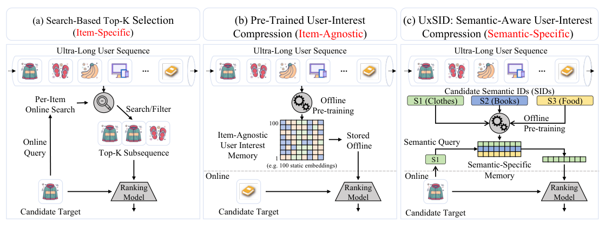
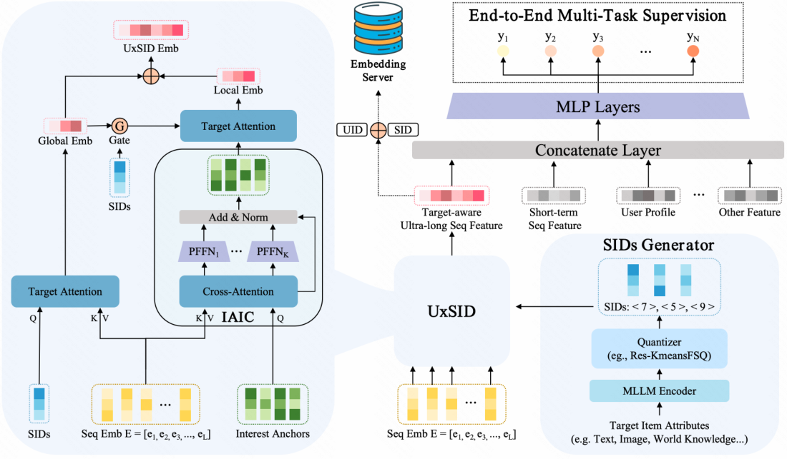
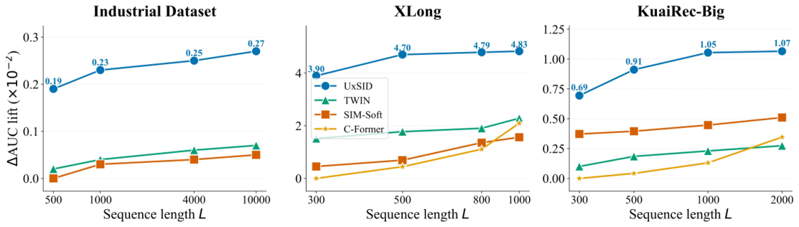
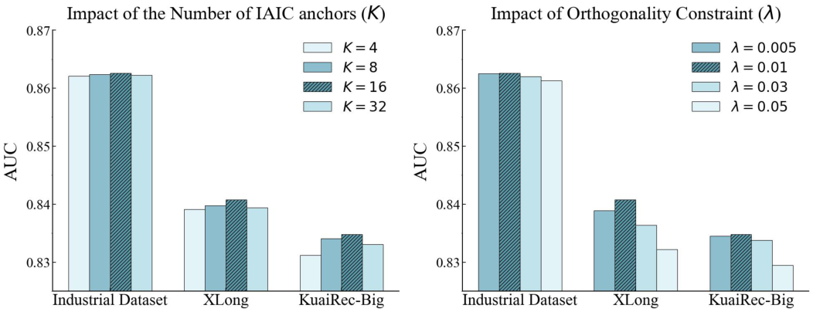
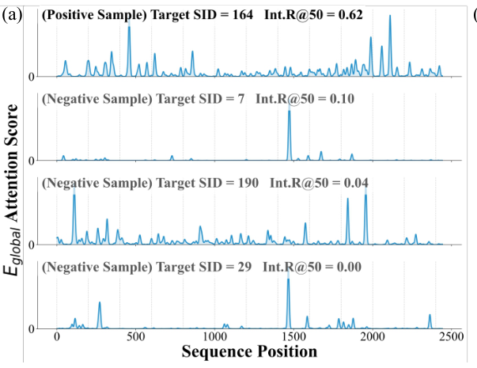
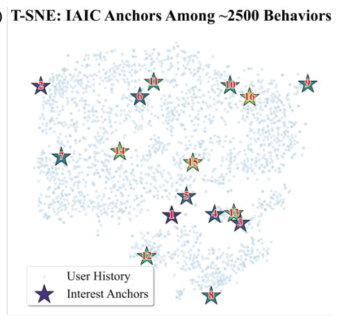
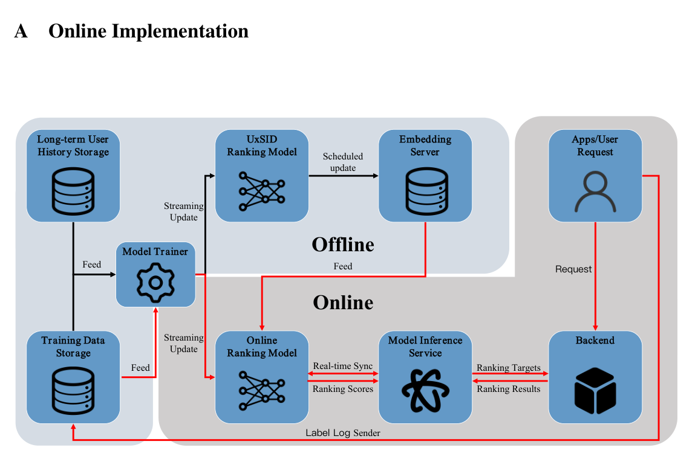

# UxSID：面向超长序列的语义感知用户兴趣建模

> Hongwei Zhang*, Qiqiang Zhong*, Jiangxia Cao*, Junfeng Shu†, Yiyang Lv, Huanjie Wang, Liwei Guan, Jing Yao, Chi Lu, Yiyu Wang, Zhaojie Liu, Han Li | 快手科技（Kuaishou Technology），中国北京
>
> *：同等贡献；†：通讯作者。预印本，arXiv:2605.09040v3 [cs.AI]，2026 年 5 月 18 日。

本文提出 UxSID，一个在"item 特定搜索"与"item 无关压缩"两条超长序列建模路线之外、开辟第三条"语义特定"压缩路径的框架——利用目标 item 的语义 ID（SID，Semantic ID）作为动态查询来引导兴趣压缩。核心发现是——**UxSID 以 $O(1)$ 的恒定在线推理复杂度（实测延迟开销仅 +0.16ms），在快手广告系统线上 A/B 测试中带来收入 +0.337% 的提升，并在 XLong 数据集上以 0.8408 AUC 碾压最强搜索式基线 TWIN（0.8154）**。

核心内容：

- 痛点：推荐系统流量巨大，超长用户序列带来 $O(n^2)$ 计算负担；现有路线要么是"item 特定检索"（有选择偏差、丢失低表面相关但高 latent 协同的历史），要么是"item 无关压缩"（静态嵌入缺乏目标感知、混入噪声）
- 方案：UxSID 走中间路线——语义相似的 item 共享同一份压缩用户兴趣记忆，用 SIDs 作为高密度语义探针引导压缩过程，实现目标感知但计算轻量
- 技术：双级注意力策略。IAIC（Item-Agnostic Interest Compression，item 无关兴趣压缩）用可学习兴趣锚 + PFFN（Per-token Feed-Forward Networks，逐 token 前馈网络）+ 正交性约束蒸馏多面兴趣；层次语义探测先做显式全局探测，再用门控 query 对压缩锚进行局部探测
- 工程：离线预计算用户-目标 pair 的压缩嵌入存进嵌入服务器（ES，Embedding Server），存储键为 UID 与 SID 的按位拼接哈希，线上仅一次 $O(1)$ 点查，恒定成本支撑 10k 长度序列

关键发现：

- **线上验证（快手广告，一周 A/B）：收入 +0.337%、成本 +0.231%、曝光 +0.111%——收入远超曝光增幅，说明模型在向高精度转化倾斜**
- **离线 AUC：XLong 0.8408（超 TWIN 0.8154、C-Former 0.8135），KuaiRec-Big 0.8348；工业数据集 CTCVR AUC 0.8626，超 SIM-Soft +0.18%**
- 消融：去掉 $e_{global}$ 或 $e_{local}$ 均显著掉点；SID 查询全面优于粗粒度类别（tag）查询；正交损失与门控机制各有增益
- 部署可行性：4 亿活跃用户规模下每用户平均约 100 个活跃 SID，嵌入服务器总存储仅约 2.56 TB；相比直接在排序模型内把序列从 1k 拉到 10k（需约 5,300 张 A10 GPU），UxSID 把负担完全转移到离线
- 未来工作：快手短视频场景的全量部署并扩展到终身序列建模

---

## 摘要

对超长用户行为序列进行建模是捕捉现代推荐系统中不断演化的用户偏好的关键任务，这一研究方向在过去几年贡献了实实在在的收益。然而，推荐系统总是服务着海量流量，延长用户序列会急剧增加计算成本，这在效率与效果之间制造了艰难的权衡。为了在保持轻量在线推理计算的同时扩展到更长的用户序列，现有工作可分为两种范式：（1）基于搜索的 Top-K 选择，为每个候选 item 构造一条 item 特定的子序列，从而避免直接面对超长序列；（2）预训练的用户兴趣压缩，将超长用户序列映射为一小组 item 无关的用户兴趣记忆，使在线模型能够通过这种高度压缩的稠密记忆感知用户长期兴趣。除了这两条技术路线（完全 item 特定或完全 item 无关）之外，我们认为还存在一条未被充分探索的中间路径：保留用户序列与目标 item 之间的部分相关性，同时只暴露有限的信号来引导兴趣压缩的方向。这种设计并不追求 item 特定的用户兴趣压缩，而是根据 item 属性寻求语义组共享的通用用户兴趣记忆，即语义相似的 item 共享同一份压缩后的用户兴趣记忆。基于这一动机，我们提出了 UxSID，一个弥合这一空白的全新框架，它在用户历史与候选语义 ID（SID，Semantic ID）之间促成目标 item 的语义感知交互。具体来说，UxSID 采用双级注意力策略：先从原始序列中提取 item 无关的用户兴趣，再在全局行为和这些无关兴趣之上执行语义特定的查询，以生成语义特定的偏好。通过采用这种端到端架构，UxSID 生成的离线嵌入在计算简洁性与目标 item 语义感知之间取得平衡，同时在恒定时间内严格保持与在线推理的一致性。广泛的公开基准测试和大规模 A/B 测试表明，UxSID 达到了最先进的性能，在广告中带来了 0.337% 的收入提升。

## 1 引言

TikTok、Instagram Reels 和快手等大规模工业平台吸引了庞大的用户群体，并承载着数以百万计的创作者所生产的图片、短视频和直播内容。为了将用户与平台的 item 连接起来，一个强大的推荐系统（RecSys，Recommendation System）必不可少，它负责把合适的 item 分发给合适的用户。在这个推荐与消费的循环中，数亿用户每天产生前所未有的海量行为数据；例如，活跃用户每周往往要交互多达 10,000 个 item。

因此，超长序列建模（ULSM，Ultra-Long Sequence Modeling）对现代推荐系统至关重要：它能在更长的时域上捕捉全面的偏好演化，弥合嘈杂的短期信号与潜在长期用户信号之间的鸿沟。通过揭示截断模型所忽略的关联，ULSM 已成为提升用户参与度、转化率和长期忠诚度的关键驱动因素 [1, 2]。

尽管它很重要，扩展序列长度却给必须处理海量实时流量的工业推荐系统带来了沉重的计算负担。例如，DIN（Deep Interest Network，深度兴趣网络）[4]、DIEN（Deep Interest Evolution Network，深度兴趣演化网络）[5] 和 TransAct（Transformer-based Realtime User Action Model，基于 Transformer 的实时用户行为模型）[6] 等标准注意力模型 [3] 天生受限于 $O(n^2)$ 的计算复杂度；因此，许多系统只能负担 $n = 100$ 的有限子序列长度。正因如此，许多 RecSys 研究者正专注于开发高效方法，以轻量计算扩展用户序列。总体而言，近年来已有两条主要的 ULSM 技术路线得到充分探索：

- **item 特定的 Top-k 子序列选择（图 1(a)）。** SIM（Search-based Interest Modeling，基于搜索的兴趣建模）[7] 和 TWIN（Two-stage Interest Network，两阶段兴趣网络）[8] 等方法利用全局搜索单元（GSU，Global Search Unit），在细粒度建模之前检索出与目标 item 相关的 Top-K 行为子集。尽管高效，基于搜索的方法却存在固有的选择偏差：无论是离散硬匹配还是基于嵌入的软检索，过滤过程从根本上受限于预定义键空间的表达能力以及严格的选取配额。

- **item 无关的压缩用户兴趣记忆（图 1(b)）。** MIMN（Multi-channel user Interest Memory Network，多通道用户兴趣记忆网络）[2]、LURM（Learning Universal user Representations via self-supervised lifelong behaviors Modeling）[9] 和 C-Former [10] 等基于压缩的方法，旨在将大量历史蒸馏为紧凑的 latent 表示。然而，这些嵌入通常是目标无关的，因为它们试图将用户多样化、不断演化的兴趣压缩进静态的、以用户为中心的嵌入中 [11, 10]。因此，这些方法不可避免地引入无关噪声 [12]，并且缺乏从海量历史背景中解开用户当前意图所需的目标特定性。

除了这两条技术路线（与目标候选完全 item 特定，或完全 item 无关）之外，我们认为还存在一条未被充分探索的中间路径：保留用户序列与目标 item 之间的部分相关性，同时只暴露有限的信号来引导兴趣压缩的方向。这种设计并不追求"item 特定"的用户兴趣压缩，而是根据 item 属性寻求语义组共享的通用用户兴趣记忆，即语义相似的 item 共享同一份压缩后的用户兴趣记忆，如图 1(c) 所示。

**图 1：** ULSM 不同范式的对比。(a) item 特定搜索：为每个候选进行在线过滤，计算成本高昂。(b) item 无关压缩：离线蒸馏成静态记忆，缺乏目标特定性。(c) UxSID：一种语义特定路径，在具有相同 SID 的 item 之间共享压缩后的兴趣记忆。

为了将这条中间路径落地，我们提出了 UxSID，一个目标语义感知的压缩框架，它将语义 ID（SIDs，Semantic IDs）作为兴趣蒸馏的原则性媒介。我们的核心直觉是：由深度量化（例如 RQ-VAE（Residual Quantized Variational Autoencoder，残差量化变分自编码器）[13]）产生的 SID 充当高密度语义探针，天然与用户兴趣簇对齐。传统的 ID 是离散的符号，而 SID 表示的是源自多模态内容 [14, 15]、协同信号 [16–18] 和世界知识 [19] 的合成语义簇。通过利用 SID 引导压缩过程，UxSID 能从海量历史中精确提取与目标相关的信号，使候选感知建模在大规模工业部署中既可行又高效。

**图 2：** UxSID 的架构主要由三个组件构成：一个目标 SIDs 生成器，将全面属性量化为语义丰富的离散 ID；一个语义感知的压缩网络，包含兴趣压缩与用于序列建模的层次注意力；以及一个端到端的多任务监督框架，以确保在线-离线一致性。

具体来说，我们提出一种层次化"压缩-探测"策略，以确保全局历史覆盖与语义特定精度兼得：

- **Item 无关兴趣压缩（IAIC，Item-Agnostic Interest Compression）。** 该模块将异构历史压缩为一组紧凑的可学习兴趣锚。通过采用逐 token 前馈网络（PFFNs，Per-token Feed-Forward Networks）和正交性约束，IAIC 确保每个蒸馏出的兴趣都捕捉到多面偏好的不同侧面，有效保持表示多样性。

- **层次化语义探测（Hierarchical Semantic Probing）。** 它先从超长序列中提取细粒度的全局信号，然后采用门控语义查询动态整合压缩兴趣中的信息。这一过程选择性地放大与目标相关的兴趣，同时过滤噪声，确保最终表示同时蕴含即时意图和长期依赖。

通过整合这一策略，UxSID 生成的压缩表示在离线训练与在线推理之间保持严格对齐。该架构有效克服了传统范式的固有选择偏差，在海量交互历史中实现了目标语义级别的解析。我们的主要贡献总结如下：

- **目标语义感知的行为压缩。** 据我们所知，UxSID 是第一个将基于 SID 的目标语义与 ULSM 相结合的工作。通过把 SID 用作查询，我们实现了从静态的、以用户为中心的蒸馏，到细粒度的、目标感知的兴趣压缩的范式转变。

- **可扩展的 UxSID 架构。** 我们设计了一个包含 IAIC 和层次化目标注意力的双阶段框架。该架构确保了恒定时间的推理和稳定的资源消耗，即使序列扩展到 10k 次交互，也能有效地将长期依赖转化为持续的排序收益。

- **SOTA 性能与工业影响。** 我们既在公开基准上，也在快手的大规模部署中提供了全面验证。UxSID 持续优于 SOTA 基线，并在生产中带来了 0.337% 的收入增长，证明了其在严苛工业延迟约束下的稳健可扩展性和显著商业价值。

**论文概览。** 第 2 节回顾 ULSM 的相关文献。第 3 节详细阐述 UxSID 的提出方法及其工业应用流水线。第 4 节呈现大量实验结果，涵盖离线评估、在线 A/B 测试、严格的消融研究和案例分析。最后，第 5 节总结全文。

## 2 相关工作

**序列建模的基础与可扩展性瓶颈。** 从历史上看，工业推荐系统遵循一种将序列建模与特征交互相结合的范式。这一演进过程中的一个里程碑式节点是 DIN [4]，它引入了目标感知注意力机制，动态激活与候选 item 相关的历史行为。后续创新在此基础上扩展，捕捉时间依赖（例如 DIEN [5] 和 DSIN（Deep Session Interest Network，深度会话兴趣网络）[20]）、缓解序列中的噪声，并提取多面用户兴趣 [21–24]。随着 Transformer 的成功 [3]，SASRec（Self-Attentive Sequential Recommendation，自注意力序列推荐）[25] 等自注意力架构已成为标准做法。最近，通过 next-token 预测优化的生成式模型（如 HSTU（Hierarchical Sequential Transduction Units，层次序贯转导单元）[26] 和 MTGR（Multi-Task Generative Recommender，多任务生成式推荐器）[27]）崭露头角，展现出学习丰富、上下文化用户兴趣表示的强大能力。然而，这些注意力和生成式架构固有的二次方计算复杂度带来了严峻的序列长度可扩展性挑战，将它们的部署长度严格限制在在线服务环境毫秒级延迟约束之内 [1]。这一瓶颈从根本上截断了模型的感受野，使它们不足以捕捉长期的、异构的用户轨迹，因此催生了专门为 ULSM 定制的新工作 [28]。

**面向超长序列建模的搜索式范式。** 为了克服超长序列的可扩展性瓶颈，工业界倾向于采用一种两级级联框架——即"先全局搜索，后精确搜索"的范式——其中轻量级的 GSU 将海量历史过滤为与目标相关的 Top-K 子轨迹，再由表达力更强的精确搜索单元（ESU，Exact Search Unit）进行后续的细粒度注意力建模。早期方法如 SIM [7] 依赖基于类别 item 属性的硬过滤，而后续模型引入了哈希和低精度注意力（例如 ETA（End-to-end Target Attention，端到端目标注意力）[29] 和 SDIM（Sampling-based Deep Interest Modeling，基于采样的深度兴趣建模）[30]）来加速相似度计算。最近，TWIN [8] 提出了一个端到端架构来对齐两个阶段的优化目标，该框架随后在 TWINv2 [31] 中通过层次聚类进一步增强可扩展性和性能。

尽管取得了成功，基于搜索的方法仍存在一个固有局限：它们的过滤逻辑往往牺牲那些表面相关性低但 latent 语义协同高的历史 item [32]。例如，一个偏向"裤子"的搜索单元可能会丢弃一条搭配的腰带或风格相配的鞋履，从而错过关键的组合意图。相比之下，SID 超越了这些表层过滤，捕捉到传统检索往往不可见的高阶语义关联 [13, 14]。

**面向超长序列建模的压缩式范式。** 为了规避基于搜索的方法高昂的在线计算成本，并更好地利用长序列内在的全局上下文信息，涌现出一批基于压缩的方法 [2, 9, 11, 33–37]。这些方法主要致力于将序列建模的重负转移到离线阶段，把超长序列压缩成紧凑、可复用的用户表示。早期探索包括 MIMN [2] 和 HPMN（Hierarchical Periodic Memory Network，层次周期记忆网络）[33] 等记忆增强模型，它们利用记忆网络在离线阶段以数千量级规模有效压缩序列。最近的进展聚焦于将这种离线表示学习模块化和规模化。例如，LREA（Low-Rank Efficient Attention，低秩高效注意力）[34] 采用低秩矩阵分解压缩序列表示，使下游模型能通过对这些浓缩嵌入的目标注意力高效捕捉用户兴趣。另外，DV365 [35] 等基于规则的分区方法将序列切成固定长度或时间窗口。PinnerFormer [11]、LURM [9] 和 C-Former [10] 则将海量用户序列浓缩为兴趣簇或稠密嵌入。

虽然基于压缩的方法在在线效率上表现出色，但静态压缩本质上就像一个低通滤波器——保留粗粒度的全局趋势，却边缘化了那些对精确排序至关重要、高频的目标特定兴趣峰。这一局限凸显了对自适应压缩框架的迫切需求，即能够生成目标语义感知表示的框架。

**Item tokenization 与语义标识符。** Item 标识符是现代推荐系统的基石。当前的范式正从依赖嵌入查表的随机图片 ID（PIDs，Photo IDs）[4, 7]，转向通过 RQ-VAE [13] 或其他 tokenization 框架（例如 QARM（Quantitative Alignment Multi-modal Recommendation，定量对齐多模态推荐）[38]）构建的 SID。与主要把 SID 用于生成式推荐 [39, 15, 17] 或 item 表示丰富化 [19, 40] 的现有范式不同，我们提出在 ULSM 情境下把 SID 用作动态语义查询。它们聚类的语义编码使得在传统基于 PID 的模型缺乏足够粒度的复杂兴趣空间中进行导航成为可能。

## 3 方法

在本节中，我们给出 UxSID 的细节——一个面向 ULSM 的语义感知压缩框架。UxSID 采用层次注意力架构执行端到端的兴趣压缩与推荐，确保高保真的兴趣感知。

**架构总览。** UxSID 架构由三个核心模块构成：（1）SIDs 生成，利用多模态大语言模型（MLLM，Multimodal Large Language Model）将异构 item 内容转化为离散语义编码；（2）Item 无关兴趣压缩，将原始轨迹过滤为结构化的兴趣锚；（3）层次化语义探测，采用门控双级注意力机制解析目标特定的意图。

**语义 ID 生成。** 为了让模型获得超越字面 ID 匹配的语义探针，我们通过基于推理的对齐机制生成 SID [19]。给定一个具有多模态属性（例如视频帧和文本描述）的 item $i$ ，我们首先使用 MLLM 编码器将其投影到一个连续的业务对齐语义空间中：

$$
z_i = \text{Enc}_{MLLM}(\text{Attributes}_i) \qquad (1)
$$

其中 $z_i \in \mathbb{R}^d$ 。为确保计算和存储效率，我们应用了 Res-KmeansFSQ 混合量化方法 [41]。该过程将 $z_i$ 分解为 $M$ 个层次级别：

$$
z_i \approx \sum_{m=1}^{M} C_m(k_m), \qquad k_m = \arg\min_{j} \lVert r_{m-1} - c_{m,j} \rVert_2 \qquad (2)
$$

其中 $C_m$ 表示第 $m$ 层的码本（codebook）， $c_{m,j} \in \mathbb{R}^d$ 是该码本中的第 $j$ 个码字。向量 $r_m = z_i - \sum_{l=1}^{m} C_l(k_l)$ 表示第 $m$ 层的量化残差，初始残差定义为 $r_0 = z_i$ 。通过这种方法，item 由一串 SID $(k_1, k_2, \ldots, k_M)$ 表示。在我们的工业部署中，我们主要使用第一层编码 $k_1$ 作为目标 SIDs（ $c_{target}$ ），以在语义粒度与推理延迟之间取得平衡。

**Item 无关兴趣压缩。** IAIC 模块旨在将原始交互序列 $B = [b_1, b_2, \ldots, b_L]$ 压缩为一组紧凑的 $K$ 个兴趣锚 $P \in \mathbb{R}^{K \times d}$ （ $K \ll L$ ）。

**兴趣锚压缩。** 我们首先通过嵌入查表层把每个 item 转化为 $d$ 维表示，得到矩阵 $E = [e_1, e_2, \ldots, e_L] \in \mathbb{R}^{L \times d}$ 。为了提取代表性信号，我们定义一组可学习的兴趣锚 $Q_{anc} \in \mathbb{R}^{K \times d}$ ，它们充当兴趣查询，通过交叉注意力机制聚合显著特征：

$$
H = \text{Softmax}\left(\frac{(Q_{anc}W^Q)(EW^K)^{\top}}{\sqrt{d}}\right)(EW^V) \qquad (3)
$$

其中 $H = [h_1, \ldots, h_K]^{\top} \in \mathbb{R}^{K \times d}$ 表示压缩后的兴趣特征， $W^Q, W^K, W^V \in \mathbb{R}^{d \times d}$ 是可学习的投影矩阵。此外，为增强每个兴趣锚的独立表示，我们采用 PFFN。具体来说，对每个锚 $h_k$ ，我们应用一个锚特定的子网络，并伴随残差连接和层归一化：

$$
p_k = \text{LayerNorm}\left(h_k + \sigma(h_k W_1^{(k)} + b_1^{(k)})W_2^{(k)} + b_2^{(k)}\right) \qquad (4)
$$

其中 $W_1^{(k)}, W_2^{(k)}$ 和 $b_1^{(k)}, b_2^{(k)}$ 是第 $k$ 个兴趣锚特有的可学习参数， $\sigma(\cdot)$ 是 sigmoid 函数。这一架构确保变换独立地应用于每个兴趣锚，使它们能在各自的语义子空间内被精炼。最终得到的一组压缩锚记为 $P = [p_1, \ldots, p_K]^{\top} \in \mathbb{R}^{K \times d}$ 。

**多样性与正交性约束。** 为确保兴趣锚捕捉多面偏好、避免退化为收敛到单一兴趣，我们引入了归一化的正交性损失 $L_{ortho}$ 。通过将 $P$ 的平方 L2 范数纳入分母，我们强制锚之间的结构独立性，同时在不同尺度下保持稳定性：

$$
L_{ortho} = \left\lVert \frac{PP^{\top}}{\lVert P \rVert_2^2} - I \right\rVert_F \qquad (5)
$$

其中 $I$ 是单位矩阵， $\lVert \cdot \rVert_F$ 表示 Frobenius 范数。该约束最小化兴趣锚之间的冗余，确保 latent 表示中的每个兴趣都代表用户长期行为轨迹中一个独特且分离良好的侧面。

**层次化语义探测。** 与静态方法不同，UxSID 通过一个由门控模块精炼的层次化双级注意力机制，将目标 SIDs $c_{target}$ 用作主动探针。

**显式语义探测。** 第一阶段通过目标 SIDs 直接对原始行为序列 $E$ 进行注意力计算，提取细粒度的语义信号。这一过程捕捉目标 item 与用户海量历史之间的全局相关性：

$$
e_{global} = \text{Softmax}\left(\frac{(c_{target}W_g^Q)(EW_g^K)^{\top}}{\sqrt{d}}\right)(EW_g^V) \qquad (6)
$$

其中 $e_{global} \in \mathbb{R}^d$ 表示全局兴趣响应。

**门控 latent 探测。** 为精炼兴趣分辨率，第二阶段通过门控向量 $g_{ctx} \in \mathbb{R}^d$ 将探测过程以全局上下文为条件：

$$
g_{ctx} = \sigma(\text{GatedNet}(e_{global})) \qquad (7)
$$

其中 $\text{GatedNet}(\cdot)$ 是两层多层感知机（MLP，Multi-Layer Perceptron）， $\sigma(\cdot)$ 是 sigmoid 函数。这个门控向量充当一个 latent 掩码，调制目标 SID 嵌入 $c_{target}$ 以产生精炼后的查询 $q_{ref}$ ：

$$
q_{ref} = c_{target} \odot g_{ctx} \qquad (8)
$$

通过应用该 Hadamard 积，我们将目标语义属性与用户的全局行为对齐。最后，从兴趣锚 $P$ 中提取局部化意图 $e_{local}$ ：

$$
e_{local} = \text{Softmax}\left(\frac{(q_{ref}W_l^Q)(PW_l^K)^{\top}}{\sqrt{d}}\right)(PW_l^V) \qquad (9)
$$

其中 $W_l^Q, W_l^K, W_l^V \in \mathbb{R}^{d \times d}$ 是可学习参数。

最终目标感知的表示通过拼接双级输出得到： $E_{UxSID} = [e_{global}; e_{local}]$ 。这种层次化探测确保 UxSID 能同时感知与实时推荐相关的广阔历史上下文和特定的潜在兴趣峰。

**模型训练与损失函数。** 预计算好的 $E_{UxSID}$ 与目标特征 $E_t$ 、用户画像 $E_u$ 、上下文 $E_c$ 和短期行为 $E_{short}$ 整合在一起。预测 $p(x)$ 的形式化定义如下：

$$
p(x) = \sigma(\text{MLP}(E_t; E_u; E_c; E_{short}; E_{UxSID} \mid x)) \qquad (10)
$$

模型通过联合损失函数以端到端方式优化：

$$
L = -\frac{1}{N} \sum_{n=1}^{N} \left[ y_n \log(p(x_n)) + (1-y_n)\log(1-p(x_n)) \right] + \lambda L_{ortho} \qquad (11)
$$

其中第一项是推荐任务的二元交叉熵（Binary Cross-Entropy）损失。

**生产环境服务。** 离线流水线确保最终表示 $E_{UxSID}$ 是目标感知且任务对齐的。训练完成后， $E_{UxSID}$ 被预计算并缓存到嵌入服务器（ES，Embedding Server）中。存储键通过用户 ID（UID）与目标 item SID（SID）的按位拼接生成：

$$
\text{Key} = \text{Hash}(\text{UID} \oplus \text{SID}), \qquad \text{Value} = E_{UxSID} \qquad (12)
$$

在实时服务阶段，系统执行一次 $O(1)$ 点查询，从 ES 中取回 $E_{UxSID}$ 。SIDs 强大的表示能力使得每个用户的唯一 ID 集合有限且可管理；因此，总存储占用完全处于工业可行性范围内（见附录 A）。随后，压缩后的嵌入充当目标感知的用户历史键/值，通过与目标 item 查询（辅以侧信息）之间的轻量注意力机制进行交互，完成最终排序，从而有效满足严苛的工业延迟要求。

## 4 实验

**数据集。** UxSID 的有效性在两个公开基准 XLong [42] 和 KuaiRec-Big [43] 以及一个大规模工业数据集上进行了评估。之所以选择这些公开基准，是因为它们提供了配对的item内容特征，这对于 SIDs 的训练和语义对齐不可或缺。详细的统计数据和预处理流程见附录 B。

**基线。** 为评估 UxSID 的有效性，我们与几个有竞争力的基线（详见附录 C）进行比较：DIN [4]、SIM [7]、ETA [29]、SDIM [30]、MIRRN（Multi-granularity Interest Retrieval and Refinement Network，多粒度兴趣检索与精炼网络）[32]、TWIN [8]、C-Former [10]。所有基线共享底层网络，仅在 ULSM 模块上有所不同。

**评估指标。** 我们使用 AUC（Area Under the Curve，曲线下面积）、UAUC（User-level AUC，用户级曲线下面积）和 WUAUC（Weighted User-level AUC，加权用户级曲线下面积）评估模型的整体和用户级排序性能，参考了 [8, 19, 44] 等研究。此外，我们在消融和案例分析中引入 Interest Recall@K（Int.R@K，兴趣召回率）来量化语义激活精度，其定义为：在显式语义探测期间通过注意力得分检索出的 Top-K 行为中，与目标 item 共享相同第一层 SIDs 或类别（tag）的比例。

**实现细节。** 我们遵循 [10, 32] 的实验设置，包括数据划分和超参数配置。基线评估使用 KuaiRec-Big 的 2k 序列长度和 XLong 的 1k 序列长度，DIN 除外（使用 100）。GSU 的检索数量也设为 100。所有模型的预测头都由隐藏层为 {200, 80, 2} 的 MLP 组成，稀疏嵌入维度固定为 16。值得注意的是，主要评估在工业数据集上采用 1k 长度的序列，而在第 4.3 节中专门分析了扩展至 10k 的可扩展性。所有公开实验都使用 Adam 优化器训练，批量大小为 256，学习率为 0.001，运行在 NVIDIA L20 GPU 上。具体到 UxSID，门控网络配置为 {16, 16} 并带一个激活层，而 PFFN 中的每个 FFN 采用 {16, 32, 16} 结构。我们采用 LETTER [45] 来构建码本，并为公开数据集训练形状为 {256, 256, 256, 256} 的 SIDs。最终使用第一层 SIDs，IAIC 锚的数量为 16。

### 4.1 总体性能

**表 1：** 与基线的 AUC 性能对比。最优结果以加粗显示。'-' 表示类别不可用。

| 模型 | XLong | KuaiRec-Big |
|---|---|---|
| DIN | 0.7889 | 0.8181 |
| SIM-Hard | – | 0.8201 |
| SIM-Soft | 0.7971 | 0.8279 |
| ETA | 0.7910 | 0.8231 |
| SDIM | 0.7915 | 0.8209 |
| MIRRN | 0.7926 | 0.8217 |
| TWIN | 0.8154 | 0.8269 |
| C-Former | 0.8135 | 0.8276 |
| **UxSID** | **0.8408** | **0.8348** |

**公开数据集上的性能。** 我们首先在两个广受认可的公开基准 XLong 和 KuaiRec-Big 上进行实验。如表 1 所示，UxSID 一贯取得 SOTA 性能，全面超越所有基线范式。此外，我们在表 7（附录 D.1）中表明，UxSID 各项指标的标准差微不足道。具体而言，在 XLong 上，UxSID 取得了 0.8408 的 AUC，超过了最强的搜索式基线（TWIN）和先进的压缩模型（C-Former）。相对 C-Former 的增益值得注意：虽然 C-Former 利用可学习锚进行聚类，但它在压缩期间本质上仍然是目标无关的。相比之下，UxSID 将 SIDs 用作语义查询来激活目标特定的兴趣，证明了目标感知的感知能力对于解决 ULSM 中的细粒度偏好至关重要。

**大规模工业数据集上的性能。** 我们进一步在快手一个超大规模的工业数据集上评估 UxSID，在该场景下 0.1% 的提升即代表一个重要的里程碑。

**表 2：** UxSID 与其他基线模型的性能对比。

| 模型 | CTR AUC | CTR UAUC | CTR WUAUC | CTCVR AUC | CTCVR UAUC | CTCVR WUAUC |
|---|---|---|---|---|---|---|
| SIM-Hard | 0.8698 | 0.6042 | 0.6063 | 0.8599 | 0.6161 | 0.6221 |
| SIM-Soft | 0.8711 | 0.6084 | 0.6099 | 0.8608 | 0.6228 | 0.6307 |
| TWIN | 0.8712 | 0.6093 | 0.6104 | 0.8609 | 0.6232 | 0.6310 |
| **UxSID (Ours)** | **0.8728** | **0.6125** | **0.6161** | **0.8626** | **0.6269** | **0.6350** |

如表 2 所示，UxSID 在点击率（CTR，Click-Through Rate）和点击转化率（CTCVR，Click-Through and Conversion Rate）两项指标上均取得最优结果，其中 CTCVR AUC 达 0.8626，显著优于最强的工业基线，包括 SIM-Soft（+0.18%）和 TWIN（+0.17%）。这一优越性能主要归功于我们的 IAIC 模块和层次化探测架构。虽然 SIM 和 TWIN 通过检索或注意力具备一定的 item 特定能力，UxSID 进一步通过利用 SIDs 的高密度语义在广阔的兴趣景观中导航来扩展这一优势。与导致信息丢失的传统启发式过滤不同，UxSID 的优越结构通过精确弥合稠密用户历史与目标语义意图之间的鸿沟，保持了全局兴趣捕捉能力。

**表 3：** 线上 A/B 结果。

| 场景 | 广告指标 |
|---|---|
| 曝光（Exposure） | +0.111% |
| 成本（Cost） | +0.231% |
| 收入（Revenue） | +0.337% |

**线上 A/B 测试表现。** 我们在快手的短视频广告平台上部署了 UxSID，为期一周的线上 A/B 测试（表 3）通过显著的性能提升证明了其有效性。

收入（+0.337%）与曝光（+0.111%）之间的显著差异尤其具有启示意义，它凸显了向高精度转化的转变。这些结果表明，通过语义特定的压缩与存储，UxSID 使端到端 ULSM 不仅高度准确，而且在严苛延迟约束下对工业级流量具备计算可行性（细节见附录 A）。

### 4.2 消融研究

**表 4：** UxSID 消融结果。'-' 表示消融导致或特征不可用。

| 变体 | 工业数据集 CTR AUC | 工业数据集 CTR UAUC | 工业数据集 CTR WUAUC | 工业数据集 CTCVR AUC | 工业数据集 CTCVR UAUC | 工业数据集 CTCVR WUAUC | XLong Int.R@50 | XLong AUC | KuaiRec-Big AUC | KuaiRec-Big Int.R@50 |
|---|---|---|---|---|---|---|---|---|---|---|
| Category (Tag) | 0.8707 | 0.6081 | 0.6088 | 0.8605 | 0.6186 | 0.6288 | 0.0543 | - | 0.8261 | 0.0916 |
| w/o $e_{global}$ | 0.8714 | 0.6101 | 0.6108 | 0.8615 | 0.6230 | 0.6318 | - | 0.8370 | 0.8302 | - |
| w/o $e_{local}$ | 0.8719 | 0.6114 | 0.6121 | 0.8618 | 0.6238 | 0.6327 | 0.1454 | 0.8375 | 0.8314 | 0.2009 |
| w/o $L_{ortho}$ | 0.8725 | 0.6119 | 0.6144 | 0.8624 | 0.6261 | 0.6342 | 0.1471 | 0.8385 | 0.8344 | 0.2063 |
| w/o Gate | 0.8723 | 0.6116 | 0.6127 | 0.8623 | 0.6249 | 0.6334 | 0.1467 | 0.8376 | 0.8342 | 0.2044 |
| **UxSID** | **0.8728** | **0.6125** | **0.6161** | **0.8626** | **0.6269** | **0.6350** | **0.1488** | **0.8408** | **0.8348** | **0.2071** |

我们对 UxSID 进行了全面的消融研究，以评估其各组件以及目标语义特定感知能力（表 4）。

**基于 SID 的语义查询的有效性。** 我们通过将候选 SIDs 替换为粗粒度的类别（tag）属性来评估查询粒度。如表 4 所示，SIDs 在所有指标上一致优于基于 tag 的查询。这证实了类别级属性缺乏精确导航复杂用户兴趣分布所需的语义分辨率。

反之，SIDs 充当高密度语义探针，能够实现对历史兴趣的细粒度激活。正如 Int.R@50 指标所证明的，这种探测机制增强了模型识别目标语义簇内历史交互的能力。这种召回率的提升很可能推动了所观察到的 AUC 增益，从实证上表明 UxSID 成功弥合了传统压缩范式固有的目标无关瓶颈。

**图 3：** 所有数据集上不同序列长度的 AUC 提升（百分点）。

**层次化语义探测的影响。** 移除 $e_{global}$ 或 $e_{local}$ 中的任何一个都会导致明显的性能下降。具体而言：

- **压缩的全局信号（w/o $e_{global}$ ）：** 消除显式注意力导致 AUC 显著下降。这表明细粒度的、item 到 item 的语义信号对于捕捉压缩过程中可能被平滑掉的即时目标特定相关性不可或缺。

- **压缩的局部兴趣（w/o $e_{local}$ ）：** 观察到的下降表明，兴趣锚对于过滤历史噪声和提供 $e_{global}$ 无法有效捕捉的、多样化且结构化的用户偏好视图至关重要。

**门控探测与多样性损失的作用。** 对 $\text{GatedNet}(\cdot)$ 的消融揭示，直接用原始 SIDs 进行探测是次优的。门控机制确保局部 latent 探针以第一阶段的全局上下文为精确条件，增强了查询时的鲁棒性。此外，移除 $L_{ortho}$ 会损害性能，这验证了强制不同的兴趣簇可以防止模式坍缩（mode collapse）并保持用户偏好的多面性。

附录 D.2 证实，UxSID 的增益源于其架构，而非 SIDs 注入本身。

### 4.3 效率与缩放定律分析

理论复杂度总结于表 5。搜索式范式（SIM、TWIN）存在在线匹配开销。相反，UxSID 将 ULSM 卸载到离线，实现了目标级压缩的 $O(1)$ 在线复杂度，即使扩展至 10k 也保持恒定延迟。

**表 5：** 推理时间复杂度对比。 $B$ ：批量大小， $L$ ：原始序列长度， $R$ ：检索序列长度， $d$ ：隐藏层维度， $A$ ：属性索引大小， $m$ ：哈希函数个数， $c$ ：压缩后的兴趣长度， $f$ ：特征数量。

| 模型 | 推理时间复杂度 |
|---|---|
| SIM-Hard | $B \log(A) + BRd$ |
| SIM-Soft | $BLd + BRd$ |
| ETA | $BLm + BRd$ |
| SDIM | $Bm \log(d)$ |
| MIRRN | $BLm + BR\log(R)d + BRd^2$ |
| TWIN | $BL + BfLd + BRd$ |
| C-Former | $BRd$ |
| **UxSID** | $\mathbf{Bcd}$ |

图 3 展示了序列规模不断增大时的性能趋势，揭示了两个主要发现：

**检索与静态压缩的局限。** 随着序列长度的增加，基于搜索的模型（SIM 和 TWIN）呈现出增长放缓的趋势；其固定的检索范围不可避免地排除了遥远但相关的交互。与此同时，C-Former 的性能在短序列上不稳定，但随着历史变长而扩展。这凸显了静态压缩的一个缺陷：如果没有目标感知的引导，模型难以从不断累积的噪声中解开信号，无法在序列规模变化时维持稳健的表示。

**可扩展性与效率。** UxSID 始终维持最高 AUC，并且性能差距在 10k 规模上进一步拉大。这证实了基于 SID 的路由能有效定位特定兴趣，将海量行为数据转化为实质性收益。值得注意的是，这一切是在恒定的在线消耗下实现的，展示了 UxSID 在建模终身行为方面的潜力。

**图 4：** UxSID 在所有三个数据集上的超参数分析。

 

**图 5：** UxSID 在兴趣建模中的有效性。(a) 突出展示了基于目标 SID 的注意力路由，而 (b) 展示了学习到的长期兴趣锚的多样性。

### 4.4 参数敏感性研究

我们在所有数据集上进行了敏感性分析，结果总结于图 4。

**IAIC 锚数量（ $K$ ）的影响。** $K$ 决定了 IAIC 模块捕捉多样意图的能力。当 $K = 4$ 时性能下降，这表明把超长行为压缩进高度瓶颈化的嵌入会迫使兴趣纠缠并丢失细粒度信息。随着 $K$ 增长性能提升，在 16 时达到峰值。然而，过大的 $K$ 会引入冗余和噪声，导致路由过于分散，指标略有下降。

**正交性约束（ $\lambda$ ）的影响。** $\lambda$ 控制施加于压缩兴趣上的多样性正则化的强度。惩罚不足时，兴趣锚倾向于捕捉高频模式，降低 IAIC 模块的多样性。然而，过大的 $\lambda$ 会过度约束 latent 空间，强制分离从而干扰主要的 CTR 预测任务。

### 4.5 可视化与案例研究

我们研究了 UxSID 有效性背后的具体机制，重点关注 KuaiRec-Big 上候选 SID 在序列中的激活以及压缩锚。如图 5(a) 所示，不同候选呈现出截然不同的注意力路由模式，证明 SIDs 成功触发了多样化的语义兴趣。正样本与负样本之间 Int.R@50 的对比验证了激活相关性与 CTR 目标之间的对齐：负样本 item 由于语义不相关导致 Int.R@50 较低，而正样本则取得显著更高的召回率。值得注意的是，UxSID 激活了完整行为周期内的数据；即使早期行为也被赋予了高注意力权重，这是传统压缩方法难以达到的粒度。图 5(b) 进一步揭示，IAIC 模块捕捉到多个兴趣锚，覆盖了行为的全谱系。这种协同效应确保了 UxSID 在 ULSM 中的效率与整体性兼备。

## 5 结论

在本文中，我们提出了 UxSID，一个端到端框架，它利用目标 SIDs 在现代推荐系统中进行压缩式超长序列建模。UxSID 引入了 Item 无关兴趣压缩机制和层次化语义探测，将 SIDs 作为语义特定的路由器来导航复杂的超长行为历史。通过利用 SIDs 高密度的语义分辨率，该框架有效地弥合了历史交互密度与目标意图精度之间的鸿沟，在保持工业级效率的同时实现了卓越的预测准确度。大量离线和在线实验表明，UxSID 显著优于 SOTA 基线，而全面的消融研究验证了每个组成模块的必要性和有效性。未来工作包括在快手短视频场景中的全规模部署以及向终身序列建模的扩展。

## 参考文献

[1] Rui Zhou, Qinglin Jia, Bo Chen, Peng Xu, Yijia Sun, Siyuan Lou, Chaoxin Fu, Mengyuan Fu, Guoming Shen, Zheli Zhou, et al. A survey of user lifelong behavior modeling: Perspectives on efficiency and effectiveness. 2026.

[2] Qi Pi, Weijie Bian, Guorui Zhou, Xiaoqiang Zhu, and Kun Gai. Practice on long sequential user behavior modeling for click-through rate prediction. In Proceedings of the 25th ACM SIGKDD international conference on knowledge discovery & data mining, page 2671–2679. ACM, 2019. doi: 10.1145/3292500.3330666.

[3] Ashish Vaswani, Noam Shazeer, Niki Parmar, Jakob Uszkoreit, Llion Jones, Aidan N Gomez, Łukasz Kaiser, and Illia Polosukhin. Attention is all you need. Advances in neural information processing systems, 30, 2017.

[4] Guorui Zhou, Xiaoqiang Zhu, Chenru Song, Ying Fan, Han Zhu, Xiao Ma, Yanghui Yan, Junqi Jin, Han Li, and Kun Gai. Deep interest network for click-through rate prediction. In Proceedings of the 24th ACM SIGKDD international conference on knowledge discovery & data mining, pages 1059–1068, 2018.

[5] Guorui Zhou, Na Mou, Ying Fan, Qi Pi, Weijie Bian, Chang Zhou, Xiaoqiang Zhu, and Kun Gai. Deep interest evolution network for click-through rate prediction. In Proceedings of the AAAI conference on artificial intelligence, volume 33, pages 5941–5948, 2019.

[6] Xue Xia, Pong Eksombatchai, Nikil Pancha, Dhruvil Deven Badani, Po-Wei Wang, Neng Gu, Saurabh Vishwas Joshi, Nazanin Farahpour, Zhiyuan Zhang, and Andrew Zhai. Transact: Transformer-based realtime user action model for recommendation at pinterest. In Proceedings of the 29th ACM SIGKDD Conference on Knowledge Discovery and Data Mining, pages 5249–5259, 2023.

[7] Qi Pi, Guorui Zhou, Yujing Zhang, Zhe Wang, Lejian Ren, Ying Fan, Xiaoqiang Zhu, and Kun Gai. Search-based user interest modeling with lifelong sequential behavior data for click-through rate prediction. In Proceedings of the 29th ACM International Conference on Information & Knowledge Management, pages 2685–2692, 2020.

[8] Jianxin Chang, Chenbin Zhang, Zhiyi Fu, Xiaoxue Zang, Lin Guan, Jing Lu, Yiqun Hui, Dewei Leng, Yanan Niu, Yang Song, et al. Twin: Two-stage interest network for lifelong user behavior modeling in ctr prediction at kuaishou. In Proceedings of the 29th ACM SIGKDD Conference on Knowledge Discovery and Data Mining, pages 3785–3794, 2023.

[9] Bei Yang, Ke Liu, Xiaoxiao Xu, Renjun Xu, Hong Liu, et al. Learning universal user representations via self-supervised lifelong behaviors modeling. 2021.

[10] Xingmei Wang, Shiyao Wang, Wuchao Li, Jiaxin Deng, Song Lu, Defu Lian, and Guorui Zhou. Transformers are good clusterers for lifelong user behavior sequence modeling. In Proceedings of the 34th ACM International Conference on Information and Knowledge Management, pages 3123–3132, 2025.

[11] Nikil Pancha, Andrew Zhai, Jure Leskovec, and Charles Rosenberg. Pinnerformer: Sequence modeling for user representation at pinterest. In Proceedings of the 28th ACM SIGKDD conference on knowledge discovery and data mining, pages 3702–3712, 2022.

[12] Kirti Jain and Rajni Jindal. Sampling and noise filtering methods for recommender systems: A literature review. Engineering Applications of Artificial Intelligence, 122:106129, 2023.

[13] Shashank Rajput, Nikhil Mehta, Anima Singh, Raghunandan Hulikal Keshavan, Trung Vu, Lukasz Heldt, Lichan Hong, Yi Tay, Vinh Tran, Jonah Samost, et al. Recommender systems with generative retrieval. Advances in Neural Information Processing Systems, 36:10299–10315, 2023.

[14] Kun Zhang, Jingming Zhang, Wei Cheng, Yansong Cheng, Jiaqi Zhang, Hao Lu, Xu Zhang, Haixiang Gan, Jiangxia Cao, Tenglong Wang, et al. Onemall: One model, more scenarios–end-to-end generative recommender family at kuaishou e-commerce. arXiv preprint arXiv:2601.21770, 2026.

[15] Ruining He, Lukasz Heldt, Lichan Hong, Raghunandan Keshavan, Shifan Mao, Nikhil Mehta, Zhengyang Su, Alicia Tsai, Yueqi Wang, Shao-Chuan Wang, et al. Plum: Adapting pre-trained language models for industrial-scale generative recommendations. arXiv preprint arXiv:2510.07784, 2025.

[16] Wencai Ye, Mingjie Sun, Shaoyun Shi, Peng Wang, Wenjin Wu, and Peng Jiang. Das: Dual-aligned semantic ids empowered industrial recommender system. In Proceedings of the 34th ACM International Conference on Information and Knowledge Management, pages 6217–6224, 2025.

[17] Huanjie Wang, Xinchen Luo, Honghui Bao, Zhang Zixing, Lejian Ren, Yunfan Wu, Hongwei Zhang, Liwei Guan, and Guang Chen. Pit: A dynamic personalized item tokenizer for end-to-end generative recommendation. arXiv preprint arXiv:2602.08530, 2026.

[18] Junwei Yin, Senjie Kou, Changhao Li, Shuli Wang, Xue Wei, Yinqiu Huang, Yinhua Zhu, Haitao Wang, and Xingxing Wang. Dos: Dual-flow orthogonal semantic ids for recommendation in meituan. arXiv preprint arXiv:2602.04460, 2026.

[19] Tian Xia, Jiaqi Zhang, Yueyang Liu, Hongjian Dou, Tingya Yin, Jiangxia Cao, Xulei Liang, Tianlu Xie, Lihao Liu, Xiang Chen, et al. Qarm v2: Quantitative alignment multi-modal recommendation for reasoning user sequence modeling. arXiv preprint arXiv:2602.08559, 2026.

[20] Yufei Feng, Fuyu Lv, Weichen Shen, Menghan Wang, Fei Sun, Yu Zhu, and Keping Yang. Deep session interest network for click-through rate prediction. arXiv preprint arXiv:1905.06482, 2019.

[21] Zheng Chai, Zhihong Chen, Chenliang Li, Rong Xiao, Houyi Li, Jiawei Wu, Jingxu Chen, and Haihong Tang. User-aware multi-interest learning for candidate matching in recommenders. In Proceedings of the 45th international ACM SIGIR conference on research and development in information retrieval, pages 1326–1335, 2022.

[22] Chao Li, Zhiyuan Liu, Mengmeng Wu, Yuchi Xu, Huan Zhao, Pipei Huang, Guoliang Kang, Qiwei Chen, Wei Li, and Dik Lun Lee. Multi-interest network with dynamic routing for recommendation at tmall. In Proceedings of the 28th ACM international conference on information and knowledge management, pages 2615–2623, 2019.

[23] Chuan He, Yongchao Liu, Qiang Li, Weiqiang Wang, Xing Fu, Xinyi Fu, Chuntao Hong, and Xinwei Yao. Multi-grained preference enhanced transformer for multi-behavior sequential recommendation. In Proceedings of the 31st ACM SIGKDD Conference on Knowledge Discovery and Data Mining V. 2, pages 872–883, 2025.

[24] Qiwei Chen, Huan Zhao, Wei Li, Pipei Huang, and Wenwu Ou. Behavior sequence transformer for e-commerce recommendation in alibaba. In Proceedings of the 1st international workshop on deep learning practice for high-dimensional sparse data, pages 1–4, 2019.

[25] Wang-Cheng Kang and Julian McAuley. Self-attentive sequential recommendation. In 2018 IEEE international conference on data mining (ICDM), pages 197–206. IEEE, 2018.

[26] Jiaqi Zhai, Lucy Liao, Xing Liu, Yueming Wang, Rui Li, Xuan Cao, Leon Gao, Zhaojie Gong, Fangda Gu, Michael He, et al. Actions speak louder than words: Trillion-parameter sequential transducers for generative recommendations. arXiv preprint arXiv:2402.17152, 2024.

[27] Ruidong Han, Bin Yin, Shangyu Chen, He Jiang, Fei Jiang, Xiang Li, Chi Ma, Mincong Huang, Xiaoguang Li, Chunzhen Jing, et al. Mtgr: Industrial-scale generative recommendation framework in meituan. In Proceedings of the 34th ACM International Conference on Information and Knowledge Management, pages 5731–5738, 2025.

[28] Li-Wei Pan, Wei-Ke Pan, Mei-Yan Wei, Hong-Zhi Yin, and Zhong Ming. A survey on sequential recommendation. Frontiers of Computer Science, 20(3):2003606, 2026.

[29] Qiwei Chen, Changhua Pei, Shanshan Lv, Chao Li, Junfeng Ge, and Wenwu Ou. End-to-end user behavior retrieval in click-through rateprediction model. arXiv preprint arXiv:2108.04468, 2021.

[30] Yue Cao, Xiaojiang Zhou, Jiaqi Feng, Peihao Huang, Yao Xiao, Dayao Chen, and Sheng Chen. Sampling is all you need on modeling long-term user behaviors for ctr prediction. In Proceedings of the 31st ACM International Conference on Information & Knowledge Management, pages 2974–2983, 2022.

[31] Zihua Si, Lin Guan, ZhongXiang Sun, Xiaoxue Zang, Jing Lu, Yiqun Hui, Xingchao Cao, Zeyu Yang, Yichen Zheng, Dewei Leng, et al. Twin v2: Scaling ultra-long user behavior sequence modeling for enhanced ctr prediction at kuaishou. In Proceedings of the 33rd ACM International Conference on Information and Knowledge Management, pages 4890–4897, 2024.

[32] Xiang Xu, Hao Wang, Wei Guo, Luankang Zhang, Wanshan Yang, Runlong Yu, Yong Liu, Defu Lian, and Enhong Chen. Multi-granularity interest retrieval and refinement network for long-term user behavior modeling in ctr prediction. In Proceedings of the 31st ACM SIGKDD Conference on Knowledge Discovery and Data Mining V. 1, pages 2745–2755, 2025.

[33] Kan Ren, Jiarui Qin, Yuchen Fang, Weinan Zhang, Lei Zheng, Weijie Bian, Guorui Zhou, Jian Xu, Yong Yu, Xiaoqiang Zhu, et al. Lifelong sequential modeling with personalized memorization for user response prediction. In Proceedings of the 42nd International ACM SIGIR Conference on Research and Development in Information Retrieval, pages 565–574, 2019.

[34] Xin Song, Xiaochen Li, Jinxin Hu, Hong Wen, Zulong Chen, Yu Zhang, Xiaoyi Zeng, and Jing Zhang. Lrea: Low-rank efficient attention on modeling long-term user behaviors for ctr prediction. In Proceedings of the 48th International ACM SIGIR Conference on Research and Development in Information Retrieval, pages 2843–2847, 2025.

[35] Wenhan Lyu, Devashish Tyagi, Yihang Yang, Ziwei Li, Ajay Somani, Karthikeyan Shanmugasundaram, Nikola Andrejevic, Ferdi Adeputra, Curtis Zeng, Arun K Singh, et al. Dv365: Extremely long user history modeling at instagram. In Proceedings of the 31st ACM SIGKDD Conference on Knowledge Discovery and Data Mining V. 2, pages 4717–4727, 2025.

[36] Zheng Chai, Qin Ren, Xijun Xiao, Huizhi Yang, Bo Han, Sijun Zhang, Di Chen, Hui Lu, Wenlin Zhao, Lele Yu, et al. Longer: Scaling up long sequence modeling in industrial recommenders. In Proceedings of the Nineteenth ACM Conference on Recommender Systems, pages 247–256, 2025.

[37] Xiao Lv, Jiangxia Cao, Shijie Guan, Xiaoyou Zhou, Zhiguang Qi, Yaqiang Zang, Ben Wang, and Guorui Zhou. Marm: Unlocking the recommendation cache scaling-law through memory augmentation and scalable complexity. In Proceedings of the 34th ACM International Conference on Information and Knowledge Management, pages 2022–2031, 2025.

[38] Xinchen Luo, Jiangxia Cao, Tianyu Sun, Jinkai Yu, Rui Huang, Wei Yuan, Hezheng Lin, Yichen Zheng, Shiyao Wang, Qigen Hu, et al. Qarm: Quantitative alignment multi-modal recommendation at kuaishou. In Proceedings of the 34th ACM International Conference on Information and Knowledge Management, pages 5915–5922, 2025.

[39] Jiaxin Deng, Shiyao Wang, Kuo Cai, Lejian Ren, Qigen Hu, Weifeng Ding, Qiang Luo, and Guorui Zhou. Onerec: Unifying retrieve and rank with generative recommender and iterative preference alignment. arXiv preprint arXiv:2502.18965, 2025.

[40] Zhen Zhao, Tong Zhang, Jie Xu, Qingliang Cai, Qile Zhang, Leyuan Yang, Daorui Xiao, and Xiaojia Chang. Farewell to item ids: Unlocking the scaling potential of large ranking models via semantic tokens. arXiv preprint arXiv:2601.22694, 2026.

[41] Fabian Mentzer, David Minnen, Eirikur Agustsson, and Michael Tschannen. Finite scalar quantization: Vq-vae made simple. arXiv preprint arXiv:2309.15505, 2023.

[42] Kan Ren, Jiarui Qin, Yuchen Fang, Weinan Zhang, Lei Zheng, Weijie Bian, Guorui Zhou, Jian Xu, Yong Yu, Xiaoqiang Zhu, et al. Lifelong sequential modeling with personalized memorization for user response prediction. In Proceedings of the 42nd International ACM SIGIR Conference on Research and Development in Information Retrieval, pages 565–574, 2019.

[43] Chongming Gao, Shijun Li, Wenqiang Lei, Jiawei Chen, Biao Li, Peng Jiang, Xiangnan He, Jiaxin Mao, and Tat-Seng Chua. Kuairec: A fully-observed dataset and insights for evaluating recommender systems. In Proceedings of the 31st ACM International Conference on Information & Knowledge Management, CIKM '22, page 540–550, 2022. doi: 10.1145/3511808.3557220.

[44] Heng-Tze Cheng, Levent Koc, Jeremiah Harmsen, Tal Shaked, Tushar Chandra, Hrishi Aradhye, Glen Anderson, Greg Corrado, Wei Chai, Mustafa Ispir, et al. Wide & deep learning for recommender systems. In Proceedings of the 1st workshop on deep learning for recommender systems, pages 7–10, 2016.

[45] Wenjie Wang, Honghui Bao, Xinyu Lin, Jizhi Zhang, Yongqi Li, Fuli Feng, See-Kiong Ng, and Tat-Seng Chua. Learnable item tokenization for generative recommendation. In Proceedings of the 33rd ACM International Conference on Information and Knowledge Management, pages 2400–2409, 2024.

[46] Guorui Zhou, Hengrui Hu, Hongtao Cheng, Huanjie Wang, Jiaxin Deng, Jinghao Zhang, Kuo Cai, Lejian Ren, Lu Ren, Liao Yu, et al. Onerec-v2 technical report. arXiv preprint arXiv:2508.20900, 2025.

[47] Hugo Touvron, Thibaut Lavril, Gautier Izacard, Xavier Martinet, Marie-Anne Lachaux, Timothée Lacroix, Baptiste Rozière, Naman Goyal, Eric Hambro, Faisal Azhar, et al. Llama: Open and efficient foundation language models. arXiv preprint arXiv:2302.13971, 2023.

## 附录 A 在线部署实现

**图 6：** UxSID 的整体系统部署流水线，包括离线 UxSID 嵌入生成（黑色路径）、在线模型训练（红色路径）以及实时在线推理（红色路径）。

**在线部署的可行性。** UxSID 在线部署的主要挑战在于用户-目标交互的规模。与为每个用户分配单个固定嵌入的传统序列压缩方法不同，UxSID 执行用户-目标交叉压缩，这在理论上意味着更大的存储占用。然而，得益于 SIDs 优越的聚类特性，每个用户的活跃 SID 数量保持在可控范围内。在快手服务 4 亿活跃用户的基础设施背景下，UxSID 离线生成平均覆盖每个用户约 100 个唯一 SID。因此，嵌入服务器上的总存储需求约为 2.56 TB，这一体量完全在现代分布式 KV 存储系统的承载能力之内，从而确保了大规模部署的可行性。

**模型配置与维护。** UxSID 使用与 QARM V2 [19] 和 OneRec-v2 [46] 相同的 SIDs 码本架构，该架构已在多个工业场景中表现出色。具体而言，第一层码本大小设为 4096，嵌入查表维度为 32。该维度与 UxSID 内三个单头注意力网络的隐藏单元策略性对齐，以确保表示一致性。为保持语义表示的时效性，嵌入服务器每周执行一次计划性更新。涵盖离线生成与在线服务的完整端到端流水线如图 6 所示。

**计算成本与延迟分析。** 我们从训练和推理两个阶段评估 UxSID 的资源效率。对于 UxSID 模型的离线训练，1k 序列长度需要 16 张 NVIDIA A10 GPU，而扩展至 10k 序列长度则需要 40 张 A10 GPU。关键在于，下游在线模型的资源消耗与序列长度无关，因为它仅以增量的方式与压缩后的 UxSID 嵌入（形状为 [2, 32]）交互。在服务基础设施方面，虽然当前使用 1k 序列长度的在线模型大约占用 450 张 A10 GPU，但我们估计，若直接在排序模型内把序列长度扩展至 10k，要实现吞吐需求将需要约 5,300 张 A10 GPU。通过将长序列建模的计算负担转移到 UxSID 框架中，我们的方法相比不含 UxSID 嵌入的基线仅引入了 +0.16 ms 的可忽略延迟开销。这种高容量建模与最小推理延迟之间的平衡，凸显了 UxSID 在规模化实时推荐中的效率。

**表 6：** 公开数据集统计信息。

| 数据集 | #用户数 | #Item数 | #交互数 | 平均序列长度 | 最大序列长度 |
|---|---|---|---|---|---|
| XLong | 1,000 | 3,269,017 | 1,000,000 | 1,000 | 1,000 |
| KuaiRec-Big | 7,176 | 10,728 | 12,530,806 | 1,746 | 3,000 |

## 附录 B 数据集

**XLong**^3 [42]：从一个大型电商平台（2018 年 4 月至 9 月）采样而来，该数据集为长期建模提供每个用户 1k 交互的序列。对于每个 item 序列，最后一个视频用于测试，倒数第二个视频用于验证，其余用于训练。

**KuaiRec-Big**^4 [43]：KuaiRec 是一个从快手 App 的推荐日志中收集的真实世界数据集，包含 2020 年 7 月 5 日至 2020 年 9 月 5 日期间的用户交互和视频元数据。我们使用用户的交互历史按时间戳排序构建视频序列，并过滤掉评论少于 50 条的用户。对于每个视频序列，最后 7 个视频用于测试，倒数第 8 至第 14 个视频用于验证，其余用于训练。我们将用户的交互历史固定为最多 2k。

**工业数据集：** 从快手广告系统（2026 年 4 月 1 日至 7 日）收集，包含曝光日志和标签。对于每个用户，交互历史保留最多 10k。

**SIDs 生成。** 对于 KuaiRec-Big 数据集，我们从 item_daily_features.csv 中提取 item 相关字段，并使用 Llama 模型 [47] 生成高维内容嵌入。XLong 数据集自带预提供的 item 嵌入，我们直接使用。对于两个数据集，我们都采用 LETTER^5 [45] 提供的量化工具包训练层次码本，生成结构配置为 $[256 \times 256 \times 256 \times 256]$ 的 SIDs。

## 附录 C 基线

下面简要描述我们与之比较的 UxSID 基线：

- **DIN** [4] 是一个基础基线，它从近期行为序列中引入目标感知注意力机制。
- **SIM Hard / Soft** [7] 采用两阶段方法，其中 GSU 通过基于类别的硬匹配或基于嵌入的软检索过滤海量历史。
- **ETA** [29] 采用局部敏感哈希（Locality Sensitive Hashing）和汉明距离进行 GSU 检索。
- **SDIM** [30] 采用基于采样的方法，利用多个哈希函数为 ULSM 生成签名。
- **MIRRN** [32] 利用跨不同时间尺度的多粒度查询进行行为检索。
- **TWIN** [8] 确保 ULSM 中 GSU 与 ESU 阶段之间的目标一致性。
- **C-Former** [10] 采用重构约束以端到端方式对用户兴趣进行聚类。

## 附录 D 公开数据集的详细结果

### D.1 鲁棒性与稳定性分析

为评估 UxSID 的稳定性，我们报告了使用不同随机种子（2024、2025 和 2026）的三次独立运行的性能。如表 7 所示，这些运行间观察到的微小方差表明，我们的框架对初始化噪声高度鲁棒，并在不同实验试次中持续保持其性能增益。

**表 7：** UxSID 在三个不同随机种子（2024、2025、2026）下三次独立运行的详细性能。最终结果反映了我们提出框架的稳定性。

| 模型 | 种子 | KuaiRec-Big (AUC) | XLong (AUC) |
|---|---|---|---|
| UxSID | 2024 | 0.83484 | 0.84084 |
| UxSID | 2025 | 0.83482 | 0.84405 |
| UxSID | 2026 | 0.83462 | 0.83964 |
| 均值 ± 标准差 | - | 0.8348 ± 0.0001 | 0.8415 ± 0.0023 |

^3 https://tianchi.aliyun.com/dataset/22482；^4 https://kuairec.com/；^5 https://github.com/HonghuiBao2000/LETTER/tree/master

### D.2 性能增益归因

一个潜在的疑问是，UxSID 的性能增益是否主要源于 item 侧的 SID 信息而非所提出的架构。为隔离这种信息增强的影响，我们进行了一项对照实验，将第一层 SID 作为额外的稀疏特征纳入所有基线模型。

表 8 显示，虽然加入 SID 特征后所有基线的性能略有提升，但 UxSID 始终保持着显著领先。这证实了我们的优越性从根本上源自 IAIC 的结构设计和层次化路由机制，而非单纯的信息增强。

**表 8：** 为所有模型增补 item 侧 SID 特征后与基线的对比。最优结果以加粗显示。

| 模型（+ SID 特征） | XLong | KuaiRec-Big |
|---|---|---|
| DIN | 0.7932 | 0.8214 |
| SIM-Hard | – | 0.8246 |
| SIM-Soft | 0.7999 | 0.8305 |
| ETA | 0.7930 | 0.8271 |
| SDIM | 0.7955 | 0.8246 |
| MIRRN | 0.7976 | 0.8257 |
| TWIN | 0.8189 | 0.8296 |
| C-Former | 0.8180 | 0.8311 |
| **UxSID (Base)** | **0.8408** | **0.8348** |
| UxSID + SID | 0.8439 | 0.8361 |
