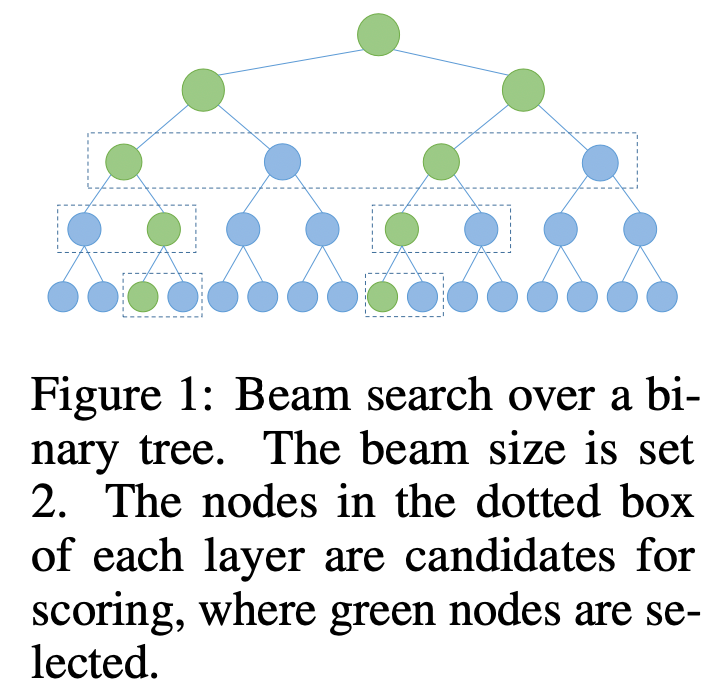
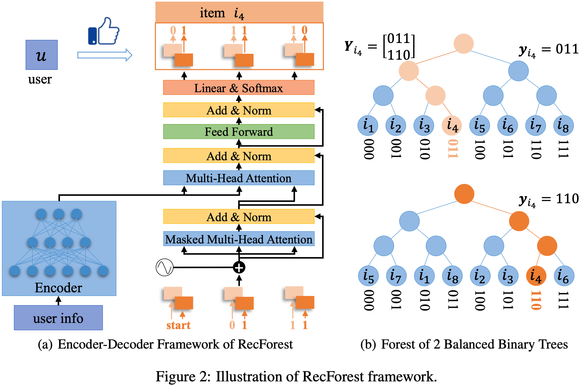

# Recommender Forest for Efficient Retrieval（中文翻译）

> Chao Feng¹*, Wuchao Li¹*, Defu Lian¹, Zheng Liu², Enhong Chen¹
> ¹中国科学技术大学计算机科学与技术学院，合肥，中国
> ²微软亚洲研究院，北京，中国
> {chaofeng,liwuchao}@mail.ustc.edu.cn, {liandefu,cheneh}@ustc.edu.cn, zhengliu@microsoft.com
> *共同第一作者；Defu Lian 为通讯作者
> 第36届神经信息处理系统大会（NeurIPS 2022）

本文介绍了 Recommender Forest for Efficient Retrieval。核心内容：
关键发现：
---
关键发现：
---
---
## 摘要
推荐系统（RS）需要从海量item集中选择 top-n item。为了高效推荐，RS 通常将用户和item表示为潜在（latent）嵌入，并依赖近似最近邻搜索（ANNs）来检索推荐结果。尽管运行时间得以减少，但表示学习与 ANNs 索引构建是相互独立的；因此两者可能不兼容，导致推荐精度的潜在损失。为解决上述问题，我们提出了**推荐森林**（Recommender Forest，简称 RecForest），该模型联合学习潜在嵌入和索引，以实现高效且高保真的推荐。RecForest 由多个 K 叉树组成，每棵树通过层次化均衡聚类对item集进行划分，使得每个item由一条从根到叶子的路径唯一表示。基于这种数据结构，我们开发了一种基于编码器-解码器的路由网络：它首先将用户信息编码为用户表示；然后利用基于 Transformer 的解码器，通过束搜索（beam search）识别出 top-n item。与现有方法相比，RecForest 具有以下优势：1）使用多棵树可以有效缓解边界附近item的错误划分问题；2）得益于强大的 Transformer 解码器，路由操作变得更加精确；3）分支参数在不同树层级之间共享，使得索引极为节省内存。我们在六个流行的推荐数据集上进行了实验：在显著简化训练成本的情况下，RecForest 在推荐精度和效率方面均优于具有竞争力的基线方法。代码地址：https://github.com/wuchao-li/RecForest。
---
## 1 引言
推荐系统（RS）是解决信息过载问题的重要方式。一个典型的推荐系统需要从海量item集中为用户选择 top-n item。为了实现高效推荐，RS 通常需要表示学习与近似最近邻搜索（ANNs）协同工作。首先，用户和item在同一潜在空间中被表示为嵌入向量；其次，item嵌入通过特定的 ANNs 索引（如 SCANN 和 HNSW）进行组织，从而可以高效地完成用户的 top-n 推荐。**尽管上述工作流程极大地加速了推荐过程，但由于表示模型是独立学习的，可能与 ANNs 索引不兼容，推荐质量可能会受到限制。**
近年来，许多工作致力于缓解表示模型与 ANNs 索引之间的不兼容问题，特别是对两个组件进行联合优化的尝试。一个有代表性的工作是阿里巴巴提出的树模型（TDM）[29] 和联合优化树模型（JTM）[28]。**在这两个工作中，item集通过二叉树结构组织：每个内部节点扮演聚类中心的角色，每个叶子节点对应一个唯一item。在树结构之上，学习一个偏好模型，从根节点路由到叶子节点以获取 top-n 推荐结果**。这些工作相比传统的两阶段方法取得了经验上的提升；此外，由于时间成本与item集大小成对数关系，它们保持了有竞争力的检索效率。
然而，现有的基于树的推荐器在多个方面仍然受限。首先，item集是层次化划分的；因此，路由到位于划分边界附近的item具有挑战性。其次，路由决策的做出没有考虑路由轨迹（即从根节点到当前节点的直接祖先），因此束搜索的精度可能受限。第三，基于树的索引可能很耗内存，因为内部节点的数量与叶子节点（即item数量）处于同一量级。最后但同样重要的是，现有方法要求表示模型和树索引的联合适应，因此树结构需要重复更新，导致训练阶段的显著成本。
为克服这些限制，我们提出了一种新颖的框架——推荐森林（Recommender Forest，简称 RecForest），用于高效且高保真的推荐。RecForest 具有以下突出特点：
- RecForest **由多个 K 叉树组成**，每棵树基于平衡层次聚类对item集进行划分。通过这种构造，可以有效地改善边界附近item的检索（如第 3.6.1 节所示），因为在一棵树中丢失的边界item可以在另一棵树中被找回。
- RecForest 利用 Transformer 解码器进行束搜索。基于这种解码器，在进行下一步路由决策时，可以**联合考虑路由轨迹**（即从根节点到当前节点的路径）。与**仅考虑当前节点的先前**方法相比，由于充分利用了路由轨迹，束搜索变得更加精确（如第 3.4 节分析所示）。
- 树参数在不同层级之间共享；换句话说，**在每个 K 叉树中只有 K 个向量（对应 K 个不同分支**）。得益于参数共享，RecForest 相比现有的基于树的推荐器更加节省内存，如表 1（理论）和表 3（实验）所示。TODO：如何在代码中体现？
- 基于上述设置，RecForest 对item集的划分变得不那么敏感。因此，无需任何树更新，RecForest 就能比需要重复树更新的 TDM 和 JTM 表现得更好，如表 3 所示。因此，RecForest 可以避免树结构的重复适应，节省了相当一部分训练成本。
我们在六个流行的推荐数据集上进行了全面评估。根据实验结果，RecForest 在推荐质量和效率方面显著优于现有的基于树的推荐器。此外，我们通过实验验证了 RecForest 可以用更少的时间成本进行有效训练，表明其在真实场景中具有很强的可用性。
---
## 2 推荐森林
### 2.1 预备知识
如上所述，RS 通常将用户和item表示为潜在嵌入，用户对item的偏好通过嵌入的内积来度量 [19, 1, 11, 12]。因此，top-n 推荐归结为最大内积搜索（MIPS）问题。为了实现高效推荐，实践中利用各种 ANNs 索引，如基于树的索引 [18, 10, 2, 14]、基于哈希的索引 [21, 22, 7, 17]、基于量化的索引 [4, 25, 5, 13, 15] 以及基于图的索引 [16, 23, 27, 3] 等。这些索引已由工具包（如 FAISS）很好地实现，极大地促进了推荐系统在实际中的部署。然而，当前基于 ANN 的方法的一个限制是**索引构建和表示学习是解耦的，这可能会在两个模块之间引入不兼容性**。
为缓解上述问题，近期的工作提出了联合优化表示模型和索引，其中两个代表性工作是 TDM [29] 和 JTM [28]。这两种方法都基于树结构，通过**逐层束搜索**可以高效地完成 top-n 推荐。例如，如图 1 所示，**当束大小为 2 时，这些模型会对之前检索到的 2 个节点的所有子节点进行评分，从中选择得分最大的两个子节点**。该过程迭代进行，直到最终检索到 top-2 叶子节点。

**图 1：二叉树上的束搜索。束大小设为 2。每层虚线框中的节点是待评分候选，其中绿色节点被选中。**
### 2.2 概述
RecForest 的框架概述如下。首先，基于层次化均衡 K-means 对item集进行划分，从而生成树结构。该树结构使得item能够在 O(log N) 的时间复杂度内被高效检索（N 为item数量）。考虑到位于划分边界附近的item可能被错误分配到某个分支而丢失在检索过程中，我们提出利用多个多样化的树，这样可以大大降低丢失概率。每个item对应树中的一个叶子节点，可以用一条从根出发的路径来表示。假设使用 K 叉树，每个item可以用一个分支 ID (0, ..., K−1) 序列来表示，序列长度为 ⌈log_K N⌉。

**图 2：RecForest 框架说明。(a) RecForest 的编码器-解码器框架；(b) 2 棵均衡二叉树的森林。**
例如，在图 2(b) 中，item $i_4$ 在对应的两棵二叉树中分别表示为 "011" 和 "110"。**基于item的层次化编码，推荐问题转化为一个seq2seq序列到序列问题：基于编码后的用户表示，通过 束搜索 逐步解码出通往最偏好item的 路径，从而得出 top-n 推荐**。RecForest 的总体框架如图 2(a) 所示。
为便于理解，我们先总结本文使用的符号。令 $x_u$ 表示用户 u 的用户信息，可以是行为序列或用户特征向量。令 $y_i $ \in $ \{0, K−1\}^H$ 为item i 的**长度为 H 的路由序列**， $Y_i $ \in $ \{0, K−1\} ^ {T$ \times $H}$ 为item i 在 T 棵树上的路由序列的拼接。形式化地，RecForest 使用  seq2seq架构建模条件概率 $P(Y_i | x_u)$ 。
### 2.3 树与森林的构建
如前所述，item集通过树结构组织，语义相近的item应尽可能落入同一分支。我们将构建多棵树以缓解边界附近item的错误分配。详细流程如下所述。
#### 2.3.1 树的构建
出于树上高效束搜索的需要，树应该是均衡的。因此，我们**利用层次化均衡聚类，每个聚类被均匀划分为 K 个子聚类，直到每个子聚类仅包含一个item**。我们提出从整个item集中随机采样 $K^H−N$ 个item（H = ⌈log_K N⌉ 为树的高度），使得构建的树成为一棵完全的 K 叉树。
我们建议使用以下两种方法进行item集的均衡划分：
- **随机（Random）**：对于每个聚类，包含的item被随机划分为 K 个等大小的子集。这种方法极其简单；然而，item间的语义关系被忽略了。
- **均衡 K-means（简称 Kmeans）**：具体地，我们**首先基于任意现成的推荐模型预训练item嵌入**。在我们的实验中，对于序列推荐使用深度兴趣网络（DIN）[26]，对于非序列推荐使用贝叶斯个性化排序（BPR）[19]，这是考虑到它们在不同场景下的有效性和流行性。**通过这样的推荐模型，item的语义接近度可以通过它们的嵌入相似度来衡量，因为相关item在潜在空间中会彼此靠近**。然后，对于每个聚类，包含的item通过 K-means 相对于它们的嵌入相似度进行均匀划分。由于篇幅限制，均衡 K-means 聚类的细节在附录中给出。 TODO
#### 2.3.2 森林的构建
**不同的树需要具有多样性，以便边界item能够更好地从束搜索中被覆盖**。为此，我们提出了一种简单而有效的方法，结合了随机和 K-means 树构建。具体地，对于每个包含 n 个item的聚类，首先随机选择 n mod K 个item，从中每个子聚类有放回地采样一个item；然后，剩余item通过均衡 K-means 进一步划分为 K 个等大小的组。这样做的好处是，由于固有的随机性，不同的树自然具有多样性。
TODO：不太理解，看看对应代码？
### 2.4 RecForest 编码器
如图 2(a) 所示，**编码器用于编码用户信息并输出用户表示**。任何基于神经网络的编码器都与我们的框架兼容。我们主要考虑序列场景和非序列场景，分别使用序列编码器和特征编码器来编码用户行为序列和特征向量。
**特征编码器**：在非序列场景中，用户信息由特征向量表示，即 $x_u$ 。我们简单使用 MLP 作为特征编码器： $z_u = MLP(x_u)$ 。当只有用户 ID 可用时，我们可以将其嵌入作为用户表示，无需任何非线性变换。
**序列编码器**：在序列场景中，用户信息是一个item序列。具体地， $x_u = [i_{t1}, i_{t2}, ..., i_{tm}]$ ，其中item $i_{tj} (1 $ \leq $ j $ \leq $ m)$ 是用户 u 的第 j 个交互item。**将item特征纳入考虑是直接的**。鉴于 Transformer [24] 在机器翻译和语音识别等 seq2seq 任务中的最先进性能，我们使用 Transformer 编码器作为序列编码器。具体地， $z_u = \text{transformer-encoder}(x_u)$ ，其中 $z_u$ 的长度与 $x_u$ 相同。由于篇幅限制，Transformer 编码器的更多细节在附录中给出。
### 2.5 RecForest 解码器
解码器的任务是在给定 编码器输出的用户表示 和 路由轨迹 的情况下，预测下一个分支（路由决策）。如图 2(a) 所示，我们应用 Transformer [24] 解码器来完成此任务，因为它具有强大的能力。从下到上，在 分支嵌入 和 位置嵌入 之后，利用 掩码多头注意力（Masked Multi-Head Attention）[24] 来建模不同层级分支之间的复杂依赖关系。以掩码多头注意力的输出为输入，接着使用多头注意力（Multi-Head Attention）[24] 来**编码用户表示 与 路由轨迹表示之间的复杂交互**。然后 FFN 层增强上下文感知的路由轨迹表示的非线性。最后应用带有 softmax 激活的线性层来预测下一个路由决策。注意，**该解码器也可以处理非序列场景，因为用户特征向量可以视为只有一个元素的序列。**
### 2.6 训练
如图 2(b) 所示，item $i_4$ 在两棵树上的路由轨迹分别是 [0,1,1] 和 [1,1,0]。框架使用 [start,0,1] 预测 [0,1,1]，使用 [start,1,1] 预测 [1,1,0]。'start' 是用于初始化序列的特殊符号，实际上对应树的根节点。根据实验结果，我们不在树之间共享 Transformer 解码器，即 $P(Y_i | x_u) = $ \prod $_k P_{$ \theta $_k}(Y_i[k] | x_u)$ ，其中
$$
\theta$_k$ 表示第 k 棵树的参数。在这种情况下，所有树共享相同的训练过程，因此我们以一棵树为例说明训练。
在每一层，训练任务是在给定路由轨迹的情况下预测下一个路由决策，这对应一个多分类问题。给定用户 u 及其交互的item i，用于优化编码器和解码器的损失函数公式如下：
$L(u,i) = −$\sum$_{h=0}^{H−1} \text{log Prob}(y_i^h | cat(start, y_i[0:h]), z_u)$   (1)
其中 $y_i^h$ 和 $y_i[0:h]$ 分别表示第 h 层的分支（路由决策）和直到第 h 层的路由轨迹，'cat' 表示拼接。
TODO：暂时没看懂
### 2.7 推理
由于树中的每个叶子对应一个item，**RecForest 将 top-n 推荐转化为序列预测问题**。具体地，我们首先应用编码器推导用户表示，并利用解码器基于束搜索生成 top-n 路由序列（即每棵树上从根节点到叶子节点的路径）。**注意，每个item可以在每棵树中对应多个叶子节点（即路由序列），因为构建完全 K 叉树时随机采样了一些item**。因此，生成的item应进行去重。令 C 表示森林中生成的所有候选item的并集。对于 c
$$
 $
$$
$
$$
$
$$
$
$$
 $
$$
$
$$
$$\in
$$
$
$$
$
$$
 $
$$
$
$$
$
$$
$
$$
$$ C，我们首先计算每棵树中的对数概率
$$
\sum $_{h=0}^{H−1} log Prob(y_i^h | cat(start, y_i[0:h]), z_u)$ ，然后将所有树上的对数概率求和作为item c 的得分。然后我们从 C 中选择 top-n item进行推荐。
### 2.8 复杂度分析
**符号**：令 D 为item嵌入大小，B 为束搜索大小，K 为分支数量，I 为训练集大小。令 T 表示 RecForest 中树的数量以及 JTM 和 TDM 中树更新的次数。在 SCANN 中，令 K_vq 为 VQ 中的质心数，K_pq 为 PQ 中的质心数，M 为子空间数量，W 为探测的 VQ 单元数量。
**时间复杂度**：在推理中，束搜索可以在 O(TKB log_K N) 内完成，因为需要计算所有树每一层 KB 个分支的概率。层次化 K-means 聚类可以在 O(NK log_K N) 内完成以构建一棵树索引，因此构建森林索引需要 O(TNK log_K N)。
**空间复杂度**：推荐模型的内存消耗在任何推荐系统中都是不可避免的，因此我们主要关注索引结构的大小。在 RecForest 中，我们只需要保留树结构和 T 个大小为 K
$$
\times
$$
D 的矩阵（表示 T 棵树的分支嵌入）。在 TDM 和 JTM 中，除了树结构外，它们还存储所有树节点嵌入，其中树节点的数量与item数量处于同一量级。
我们在表 1 中总结了典型算法的复杂度分析，显示 RecForest 具有较小的索引内存成本和较低的推理时间。这是因为只需要较小的束大小和较少的束搜索次数，并且树节点表示不需要存储而是实时计算。
**表 1：复杂度分析。SCANN 的索引时间仅考虑给定码本情况下的编码阶段以实现公平比较。IPNSW 的时间复杂度来自 HNSW 的原始论文，基于精确 Delaunay 图推导。**
| 复杂度 | RecForest | JTM | TDM | IPNSW | SCANN |
|--------|-----------|-----|-----|-------|-------|
| 推理时间 | O(TKB log_K N) | O(B log N) | O(B log N) | O(log N) | O(K_vq + K_pq + W·N/K_vq) |
| 索引时间 | O(TNK log_K N) | O(TI log N) | O(TN log N) | O(N log N) | O(NMK_pq) |
| 索引大小 | O(TKD) | O(ND) | O(ND) | O(ND) | O(K_vq D + K_pq D) |
## 3 实验
我们进行实验以回答以下研究问题：
- **RQ-1**：RecForest 在效率与精度的权衡上是否优于最先进的高效推荐器？
- **RQ-2**：基于森林的索引是否改善了边界附近item的检索？
- **RQ-3**：位置编码的效果如何？
实验在序列场景和非序列场景下进行，分别使用序列编码器和特征编码器。由于篇幅限制，我们**仅报告序列场景**的结果。其他结果在附录中提供。所有实验在配备 Tesla V100 GPU 的 Linux 服务器上完成。
### 3.1 数据集
我们使用六个真实世界的推荐数据集评估 RecForest，可从 URL* 下载。数据集包括 MovieLens 10M（简称 Movie）、Amazon Books（简称 Amazon）、Tmall Click（简称 Tmall）、Gowalla Check-in Dataset（简称 Gowalla）、Microsoft News Dataset（简称 MIND）。**由于某些数据集仅包含基于评分的显式反馈，需要将其转换为隐式反馈作为 RecForest 的输入**。这些数据集经过预处理，**过滤掉交互item不超过 15 个的用户**。数据集的总体信息总结在表 2 中。
**表 2：数据集统计**
| 数据集 | #用户 | #item | #交互 | 密度 |
|--------|-------|-------|--------|------|
| Movie | 69,878 | 10,677 | 10,000,054 | 1.34% |
| Amazon | 29,980 | 67,402 | 2,218,926 | 0.11% |
| Tmall | 139,234 | 135,293 | 10,487,585 | 0.05% |
| Gowalla | 13,583 | 71,436 | 977,425 | 0.10% |
| MIND | 36,281 | 7,129 | 5,610,960 | 2.16% |
| Yelp | 26,031 | 35,294 | 1,713,759 | 0.19% |
### 3.2 基线
在此部分，我们报告序列推荐场景的结果，因此我们将提出的 RecForest 与两阶段索引方法（IPNSW [16] 和 SCANN [5]）、可学习索引方法（TDM [29] 和 JTM [28]）以及基于暴力检索的 YoutubeDNN [1] 和 DIN [26] 进行比较。注意，基于暴力检索的 YoutubeDNN 和 DIN 在在线服务中耗时过长，但可以作为两个强基线。IPNSW 和 SCANN 建立在推荐器的item嵌入之上。**推荐器共享与 RecForest 相同的编码器，但将解码器替换为扁平item嵌入，然后以与 DIN 相同的损失进行训练。**（TODO：） TDM 和 JTM 仅基于当前节点做出路由决策，而不考虑路由轨迹。关于基线的更多细节可参考附录。
TODO：两阶段索引方法（IPNSW [16] 和 SCANN [5]）？
### 3.3 实验设置
在每个数据集中，我们随机选择 10% 的用户作为验证用户，10% 作为测试用户，其余作为训练用户。遵循 TDM 和 JTM，我们使用滑动窗口将用户-item交互历史分割为长度最多为 70 的片段。对于训练用户数据，前 69 个交互用作输入上下文，第 70 个item作为预测的真实标签。**对于验证和测试用户数据，前一半作为上下文，其余作为真实标签**。
所有方法的潜在维度设为 96。为了公平比较运行时间，我们使用 PyTorch 实现 SCANN 和 IPNSW。为了构建基于量化的索引，我们遵循 SCANN 的默认设置。为了构建 IPNSW 的图索引，每个节点的最大度设为 16。任何束搜索的束大小默认设为 100。学习模型时，学习率统一设为 **1e-3 并采用指数衰减**。**用于构建树的item表示来自每个数据集上预训练的 DIN 的item嵌入**。
### 3.4 与基线的比较
**设置**：我们在所有数据集上比较 RecForest 与基线方法。RecForest 在 Movie 和 MIND 上使用 2 棵树，在其他数据集上使用 4 棵树。其他设置可参考第 3.3 节。
**结果**：所有结果如表 3 所示，其中 RecForest 的索引内存成本表示解码器的内存消耗。以下观察回答了 RQ-1：
**表 3：与基线的比较——NDCG@20 和 NDCG@40、索引内存成本（MB）和推理时间（秒）。粗体表示最佳性能。**
（六个数据集
$$
\times
$$
 7 种方法的详细结果表，此处省略数值表格——可见原文）
- RecForest 在所有数据集上，在 NDCG@20 和 NDCG@40 方面显著优于所有带索引的高效推荐器。相比最佳基线，在 NDCG@20 上的提升分别为 Movie 4.69%、Amazon 3.72%、Gowalla 45.78%、Tmall 21.40%、MIND 3.23%、Yelp 7.96%。它优于两阶段基线（IPNSW 和 SCANN）证明了联合表示学习的有效性，尽管基于图的索引表现出较强的性能。相比 TDM 和 JTM 更高的精度表明了使用路由轨迹、多棵树和强大的 Transformer 解码器的好处。
- RecForest 在所有数据集上表现优于基于暴力检索的 YoutubeDNN，甚至在 Movie、Gowalla 和 MIND 上优于基于暴力检索的 DIN。注意，我们没有对 DIN 应用后重排序，否则检索精度可以进一步提高。这再次证实了 Transformer 解码器的强大能力。注意，在超参数微调后，YoutubeDNN 的表现优于 TDM 和 JTM，这可能与 TDM 和 JTM 中的结果不一致。
- RecForest 还享有最小的索引内存成本，这在经验和理论上得到了支持。这是因为 RecForest 仅嵌入路由决策并实时计算树节点表示，而 TDM 和 JTM 直接嵌入所有树节点。RecForest 甚至比最轻量的基于 PQ 的索引 SCANN（仅存储数据点的编码和码本）占用更少的内存。尽管检索精度良好，基于图的索引 IPNSW 由于需要存储图和数据点而占用较多内存。注意，DIN 和 YoutubeDNN 基于穷举搜索，因此不消耗索引内存。
- RecForest 在 top-n item检索方面几乎与 SCANN 一样快，有时甚至更快，而 SCANN 被认为是 MIPS 在检索效率和精度方面的 SOTA 索引。这得益于将 top-n 推荐转化为序列预测，可以通过 GPU 上的束搜索高效完成。注意，IPNSW 的运行时间成本与表 1 似乎不一致，这是因为在实践中只能高效构建近似近邻图（而非精确 Delaunay 图）用于查询。理论结果显示 RecForest 几乎与 TDM 和 JTM 一样高效，而实验结果表明 RecForest 稍快。一方面，这是因为我们使用了相对较大的分支（远大于 TDM 和 JTM 中使用的 2），显著减少了树深度从而减少了束搜索次数。另一方面，因为 RecForest 使用简单的函数进行路由决策，并且由于使用 Transformer 解码器实现了高并行性。
### 3.5 效率与精度的广泛研究
**设置**：效率-精度曲线是评估 ANNs 索引的常用标准，因此我们也提供此结果以更好地说明 RecForest 的优越性。该研究主要在 Amazon、MIND、Gowalla 和 Yelp 数据集上进行，因为其他两个数据集呈现类似趋势。为了改变 RecForest 的检索时间，我们调整束搜索的束大小从 10 到 100，步长为 10，森林最多包含 5 棵树。对于 TDM、JTM 和 IPNSW，我们调整束大小从 10 到 200，步长为 10。对于 SCANN，我们调整探测单元数量从 50 到 2000，步长为 100。
**结果**：不同算法在 NDCG@20 与查询时间之间的曲线如图 3 所示。以下观察结果确认了 RQ-1 的答案。首先，RecForest 在所有四个数据集上取得了查询时间与检索精度的最佳平衡，因为其曲线位于其他曲线的上方。这确认了 RecForest 相对于这些竞争基线的优越性。在 Gowalla 数据集上优势最为显著，表现为 RecForest 与 IPNSW 之间的最大差距。其次，随着束大小的增加，RecForest 的精度提升比基线更显著。这得益于强大的 Transformer 解码器、新颖的训练范式以及基于森林的索引，使得表示模型和树索引能够更好地联合学习。
### 3.6 消融研究
#### 3.6.1 森林构建的效果
**设置**：我们研究了第 2.3.2 节中提到的三种构建森林的方式，最多使用 10 棵树，每棵树的分支数设为 4。
**结果**：Amazon、Gowalla、MIND 和 Yelp 数据集上的结果如图 4 所示。我们可以观察到带有随机性的 K-means（即 Random+Kmeans）始终表现最佳，并且随着树数量的增加而提升，而 Random 表现最差，并且随着树数量增加提升不如 Random+Kmeans 显著。Random 效果不好的原因是语义要求未满足。由于 K-means 利用了语义信息，它比 Random 表现更好，但受到树数量增长的影响不大。这可以通过树之间缺乏多样性来解释。这回答了 RQ-2：由于使用基于森林的索引可以显著提高检索精度，特别是当树构建考虑了语义信息时，基于森林的索引改善了边界附近item的检索。
**图 4：消融研究：不同的森林构建方式。**
#### 3.6.2 分支数量 K 的效果
**设置**：我们在 Amazon、MIND、Gowalla 和 Yelp 数据集上，使用单棵 K-means 构建的树进行实验，改变分支数量 {2, 4, 8, 10, 16, 18}。
**结果**：结果如表 4 所示。我们可以观察到 RecForest 的检索精度随着分支数量的增加而提高，特别是从 2 个分支到 4 个分支。在 Gowalla 和 Yelp 数据集上改进最为显著。这一观察可以解释如下：首先，词汇表大小增加，因此解码器可以通过更具挑战性的判别信号进行监督，解码器的参数也增加。**其次，路由序列变得更短，在一定程度上减少了序列预测的误差累积**。
**表 4：分支数量的效果（NDCG@20）**
| #分支 | Amazon | MIND | Gowalla | Yelp |
|-------|--------|------|---------|------|
| 2 | 0.1624 | 0.6900 | 0.2353 | 0.1951 |
| 4 | 0.1912 | 0.6935 | 0.2795 | 0.2269 |
| 8 | 0.1864 | 0.6966 | 0.2938 | 0.2483 |
| 10 | 0.2022 | 0.6954 | 0.2843 | 0.2577 |
| 16 | 0.2031 | 0.6977 | 0.2957 | 0.2437 |
| 18 | 0.2088 | 0.7154 | 0.3337 | 0.2581 |
#### 3.6.3 位置编码的效果
**设置**：由于路由序列用于表示item，路由决策的顺序很重要。为此，我们比较了四种位置编码方式：（1）**None**：没有位置编码；（2）**绝对位置编码（Abs）**：通过可学习参数编码从 1 到最大序列长度的绝对位置；（3）**相对键（RelK）**[20]：关注注意力机制中决策之间的相对距离；（4）**相对键查询（RelKQ）**[8]：是对相对键的改进。更多细节请参考 [8]。
TODO：各种位置编码
**结果**：结果总结在表 5 中。我们可以观察到位置编码在提高检索能力方面具有显著效果，而不同的位置编码方法在检索精度上没有显著差异，这回答了 RQ-3。位置编码的效果在 Gowalla 和 Yelp 数据集上更为显著。
**表 5：位置编码的效果（NDCG@20）**
| 位置编码 | Amazon | MIND | Gowalla | Yelp |
|----------|--------|------|---------|------|
| None | 0.1704 | 0.6476 | 0.1697 | 0.1988 |
| Abs | 0.1805 | 0.6986 | 0.2632 | 0.2505 |
| RelK | 0.1824 | 0.6942 | 0.2617 | 0.2402 |
| RelKQ | 0.1840 | 0.6917 | 0.2588 | 0.2492 |
---
## 4 结论与未来工作
在本文中，我们提出了用于高效推荐的推荐森林（Recommender Forest），它可以在序列到序列框架中简单地训练。RecForest 享有较小的索引内存成本、较低的推理时间和高精度的推荐，
。在六个真实推荐数据集上的广泛研究表明，RecForest 成为了最先进的高效推荐器。未来，我们将探索多任务学习、非自回归预测、索引结构学习以及更通用的框架。
---
## 致谢
本工作得到了国家自然科学基金（No. 62022077 和 61976198）的资助。
## 参考文献
[1] Covington et al. Deep neural networks for youtube recommendations. RecSys 2016.
[2] Feng et al. Forest-based deep recommender. SIGIR 2022.
[3] Feng et al. Reinforcement routing on proximity graph for efficient recommendation. TOIS 2022.
[4] Guo et al. Quantization based fast inner product search. AISTATS 2016.
[5] Guo et al. Accelerating large-scale inference with anisotropic vector quantization. ICML 2020.
[6] He et al. Neural collaborative filtering. WWW 2017.
[7] Huang et al. Accurate and fast asymmetric locality-sensitive hashing scheme for maximum inner product search. KDD 2018.
[8] Huang et al. Improve transformer models with better relative position embeddings. EMNLP 2020.
[9] Kingma & Ba. Adam: A method for stochastic optimization. ICLR 2015.
[10] Koenigstein et al. Efficient retrieval of recommendations in a matrix factorization framework. CIKM 2012.
[11] Koren et al. Matrix factorization techniques for recommender systems. Computer 2009.
[12] Lian et al. Personalized ranking with importance sampling. WWW 2020.
[13] Lian et al. Lightrec: A memory and search-efficient recommender system. WWW 2020.
[14] Lian et al. Geography-aware sequential location recommendation. KDD 2020.
[15] Lian et al. Product quantized collaborative filtering. TKDE 2020.
[16] Morozov & Babenko. Non-metric similarity graphs for maximum inner product search. NeurIPS 2018.
[17] Neyshabur & Srebro. On symmetric and asymmetric LSHs for inner product search. ICML 2015.
[18] Ram & Gray. Maximum inner-product search using cone trees. KDD 2012.
[19] Rendle et al. BPR: Bayesian personalized ranking from implicit feedback. UAI 2009.
[20] Shaw et al. Self-attention with relative position representations. NAACL-HLT 2018.
[21] Shrivastava & Li. Asymmetric LSH (ALSH) for sublinear time maximum inner product search (MIPS). NeurIPS 2014.
[22] Shrivastava & Li. Improved asymmetric locality sensitive hashing (ALSH) for maximum inner product search (MIPS). UAI 2015.
[23] Tan et al. On efficient retrieval of top similarity vectors. EMNLP-IJCNLP 2019.
[24] Vaswani et al. Attention is all you need. NeurIPS 2017.
[25] Wu et al. Multiscale quantization for fast similarity search. NeurIPS 2017.
[26] Zhou et al. Deep interest network for click-through rate prediction. KDD 2018.
[27] Zhou et al. Möbius transformation for fast inner product search on graph. NeurIPS 2019.
[28] Zhu et al. Joint optimization of tree-based index and deep model for recommender systems. NeurIPS 2019.
[29] Zhu et al. Learning tree-based deep model for recommender systems. KDD 2018.