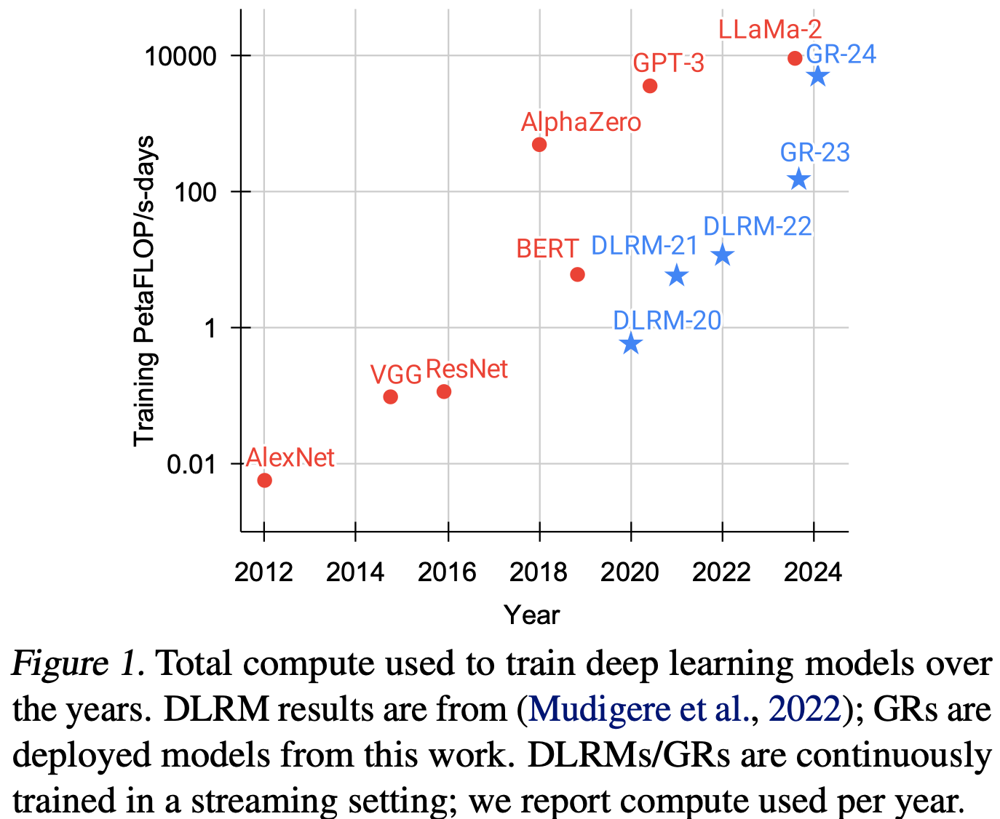
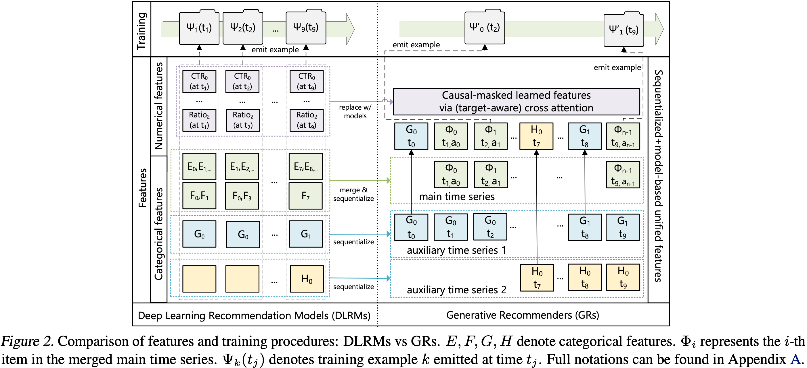
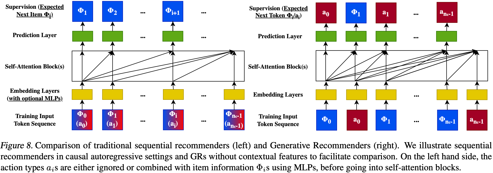
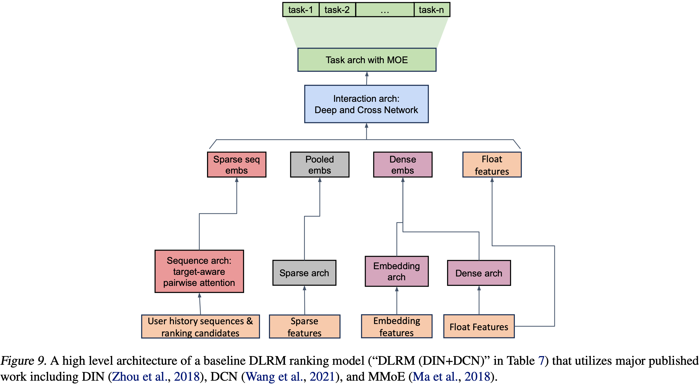
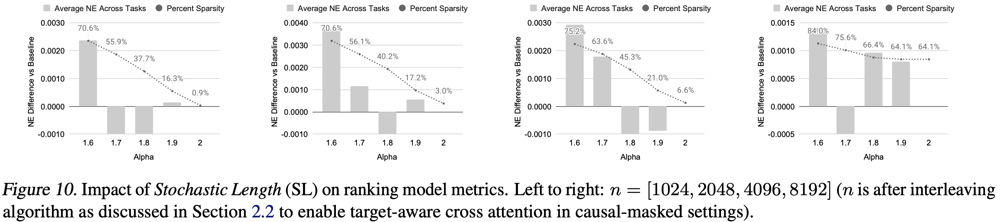

# 行胜于言：面向生成式推荐的万亿参数序列转换器

>Jiaqi Zhai¹, Lucy Liao¹, Xing Liu¹, Yueming Wang¹, Rui Li¹, Xuan Cao¹, Leon Gao¹, Zhaojie Gong¹, Fangda Gu¹, Michael He¹, Yinghai Lu¹, Yu Shi¹
> ¹MRS, Meta AI. 通讯作者: <{jiaqiz, lucyyl, xingl, yuemingw, ruili}@meta.com>.
代码地址: https://github.com/facebookresearch/generative-recommenders.
第41届国际机器学习大会(ICML)会议录, 维也纳, 奥地利. PMLR 235, 2024. 版权所有 2024 by the author(s).


本文提出了生成式推荐器（Generative Recommenders, GRs），将推荐系统中的排序和检索任务重新表述为 **生成式建模框架下的序列转换任务**。核心内容：

- **HSTU 架构**：专为高基数、非平稳流式推荐数据设计的**新序列转换架构**，在 8192 长度序列上比基于 FlashAttention-2 的 Transformer 快 5.3-15.2 倍
- **生成式训练**：将 **传统展示级训练** 转为生成式训练，降低 $O(N)$ 计算复杂度
- **M-FALCON 算法**：通过 微批处理 和 KV 缓存 实现推理成本摊销，服务复杂 285 倍的模型而计算量更少
- **缩放定律**：首次在推荐系统中展示了训练计算量的幂律缩放，跨越三个数量级直至 GPT-3/LLaMa-2 规模

关键发现：基于 HSTU 的生成式推荐器拥有 1.5 万亿参数，在线 A/B 测试指标提升 12.4%，已在拥有数十亿用户的大型互联网平台多个表面部署。

---


## 摘要

大规模推荐系统的特点是依赖于**高基数、异构**的特征，并且需要每天处理数百亿的用户行为。尽管在包含数千个特征的海量数据上进行训练，工业界的大多数深度学习推荐模型(DLRMs)在计算规模扩展方面表现不佳。受Transformer在语言和视觉领域成功的启发，我们重新审视了推荐系统中的基本设计选择。我们将推荐问题重新表述为生成式建模框架内的序列转换任务（"生成式推荐器"），并提出了一种新的架构HSTU，专为高基数、非平稳的流式推荐数据而设计。HSTU在合成和公共数据集上，NDCG指标相比基线最高提升65.8%，并且在8192长度的序列上，比基于FlashAttention-2的Transformer快5.3倍到15.2倍。基于HSTU的生成式推荐器拥有1.5万亿参数，在在线A/B测试中指标提升12.4%，并已在拥有数十亿用户的大型互联网平台的多个表面部署。更重要的是，生成式推荐器的模型质量在经验上遵循训练计算量的幂律缩放，跨越三个数量级，直至GPT-3/LLaMa-2规模，这降低了未来模型开发所需的碳足迹，并进一步为推荐领域的首个基础模型铺平了道路。

---


## 1. 引言

推荐系统是在线内容平台和电子商务领域的典型代表，在每天为数十亿用户个性化体验方面发挥着关键作用。大约十年来，最先进的推荐方法一直基于深度学习推荐模型(DLRMs) [38,6,8,52,56,68]。DLRMs的特点在于使用异构特征，例如数值特征（计数器和比率）、嵌入以及类别特征（如创作者ID、用户ID等）。由于每分钟都有新的内容和产品加入，特征空间具有极高的基数，通常在数十亿量级[14]。为了利用数以万计的此类特征，DLRMs采用各种神经网络来组合特征、转换中间表示并构成最终输出。

尽管使用了大量人工工程化的特征集并在海量数据上进行训练，但工业界的大多数DLRMs在计算扩展方面表现不佳[67]。这一局限性值得关注，并且至今未有答案。

受Transformer在语言和视觉领域成功的启发，我们重新审视了现代推荐系统中的基本设计选择。我们观察到，在数十亿用户规模下的替代方案需要克服三个挑战。首先，推荐系统中的特征缺乏显式结构。虽然在小规模设置中已经探索了序列化方案（详见附录B的讨论），但异构特征，包括高基数ID、交叉特征、计数器、比率等，在工业级DLRMs中扮演着关键角色[38]。其次，推荐系统使用每日持续变化的十亿级词汇表。**与语言领域中100K规模的静态词汇表[2]相比，十亿级动态词汇表带来了训练挑战，并且由于需要以目标感知的方式考虑数以万计的候选 [57,68]，导致推理成本高昂**。最后，计算成本是实现大规模序列模型的主要瓶颈。GPT-3在1-2个月内使用数千个GPU总计训练了300B个token[2]。这个规模看起来令人生畏，直到我们将其与用户行为的规模进行对比。最大的互联网平台服务着数十亿日活跃用户，这些用户每天与数十亿的帖子、图片和视频互动。用户序列长度可达10⁵ [3]。因此，**推荐系统每天需要处理的token数量比语言模型在1-2个月内处理的要多几个数量级**。

在这项工作中，我们将用户行为视为生成式建模中的一种新模态。我们的关键见解是：a) 在给定适当的新特征空间的情况下，工业级推荐器中的核心排序和检索任务可以转化为生成式建模问题；b) 这种范式使我们能够系统地利用特征、训练和推理中的冗余来提高效率。由于我们的新方案，我们部署的模型**在计算复杂度上比之前最先进的模型高出三个数量级，同时将核心指标提升了12.4%**，如图1所示。



**图1. 历年训练深度学习模型所使用的总计算量。DLRM结果来自[38]；GRs是本文部署的模型。DLRMs/GRs在流式设置中持续训练；我们报告每年使用的计算量。**

我们的贡献如下。我们首先在第2节提出生成式推荐器(GRs)，这是一种替代DLRMs的新范式。我们将DLRMs中的异构特征空间进行序列化并统一，**新方法在序列长度趋于无穷时逼近完整的DLRM特征空间**。这使我们能够将主要的推荐问题（排序和检索）重新表述为GRs中的纯序列转换任务。重要的是，这还进一步使模型训练能够以序列化的生成式方式进行，从而允许我们在相同的计算量下训练数量级更多的数据。

接下来，我们解决训练和推理过程中的计算成本挑战。我们提出了一种新的序列转换架构——**层次化序列转换单元(HSTU)**。HSTU针对大规模**非平稳词汇表**修改了注意力机制，并利用推荐数据集的特征，在8192长度的序列上实现了比基于FlashAttention-2的Transformer快5.3倍到15.2倍的加速。此外，通过一种新算法M-FALCON，该算法通过微批处理（第3.4节）完全摊销了计算成本，我们可以在与传统DLRMs相同的推理预算下，服务复杂285倍的GR模型，同时实现1.50倍至2.99倍的加速。

最后，我们在第4节通过**合成数据集**、公共数据集以及在拥有数十亿日活跃用户的大型互联网平台多个表面的部署来验证所提出的技术。据我们所知，我们的工作是首个展示纯序列转换架构（如HSTU）在生成式设置（GRs）中能在大规模工业环境中显著优于DLRMs的结果。值得注意的是，我们不仅克服了传统DLRMs中已知的缩放瓶颈，还成功展示了缩放定律[29]适用于推荐系统，这代表了**推荐系统潜在的"ChatGPT时刻"**。

---


## 2. 推荐作为序列转换任务：从DLRMs到GRs

### 2.1. 统一DLRMs中的异构特征空间

现代DLRM模型通常使用大量类别（"稀疏"）和数值（"稠密"）特征进行训练。在GRs中，我们将这些特征整合并编码为单一的、统一的时间序列，如图2所示。

**类别（"稀疏"）特征。** 此类特征的示例包括用户喜欢的item、用户关注的某个类别（例如，户外）的创作者、用户语言、用户加入的社区、发起请求的城市等。我们按如下方式对这些特征进行序列化。我们首先选择最长时间序列，通常通过合并代表用户与之互动的item的特征，作为主时间序列。其余特征通常是随时间缓慢变化的时间序列，例如人口统计属性或关注的创作者。我们通过保留每个连续段中最早的条目来压缩这些时间序列，然后将结果合并到主时间序列中。鉴于这些时间序列变化非常缓慢，这种方法不会显著增加整体序列长度。

**数值（"稠密"）特征。** 此类特征的示例包括加权和衰减的计数器、比率等。例如，一个特征可以表示用户对匹配给定主题的item的过去点击率(CTR)。与类别特征相比，这些特征变化更为频繁，可能随着每一次（用户，item）交互而变化。因此，从计算和存储的角度来看，完全序列化这些特征是不可行的。然而，一个重要观察是，我们执行这些聚合所依据的类别特征（例如，item主题、位置）在GRs中已经被序列化并编码。因此，在GRs中，给定一个足够有表达力的序列转换架构，结合目标感知的方案[68]，随着我们增加整体序列长度和GRs中的计算量，可以有意义地捕获数值特征。



**图2. 特征和训练过程的比较：DLRMs vs GRs。E, F, G, H 表示类别特征。 $\Phi_{i}$ 表示合并后的主时间序列中的第 $i$ 个item。 $\Psi_{k}(t_{j})$ 表示在时间 $t_{j}$ 发出的训练样本 $k$ 。完整符号可在附录A中找到。**

### 2.2. 将排序和检索重新表述为序列转换任务

给定一个按时间顺序排列的 $n$ 个token $x_0, x_1, ..., x_{n-1}$ （ $x_i \in X$ ）的列表，以及观察到这些token的时间 $t_0, t_1, ..., t_{n-1}$ ，一个序列转换任务将此输入序列映射到输出token $y_0, y_1, ..., y_{n-1}$ （ $y_i \in X \cup \{\emptyset\}$ ），其中 $y_i = \emptyset$ 表示 $y_i$ 未定义。

我们使用 $\Phi \in X_c$ （ $X_c \subseteq X$ ）来表示系统提供给用户的内容（例如，图像或视频）。由于新内容不断被创建， $X_c$ 和 $X$ 是非平稳的。用户可以对 $\Phi_i$ 做出一些响应动作 $a_i$ （例如，点赞、跳过、看完并分享）， $a_i \in X$ 。我们用 $n_c$ 表示用户交互过的内容总数。

标准的排序和检索任务，在因果自回归设置中，可以定义为序列转换任务（表1）。我们做出以下观察：

**表1. 排序和检索作为序列转换任务。为简化起见省略了其他类别特征。我们在附录B.2中将GRs与传统序列推荐器进行比较。**

| 任务 | 规范（输入/输出） |
|---|---|
| 排序 | $x_i$ : $\Phi_0, a_0, \Phi_1, a_1, ..., \Phi_{n_c-1}, a_{n_c-1}$ |
| | $y_i$ : $a_0, \emptyset, a_1, \emptyset, ..., a_{n_c-1}, \emptyset$ |
| 检索 | $x_i$ : $(\Phi_0, a_0), (\Phi_1, a_1), ..., (\Phi_{n_c-1}, a_{n_c-1})$ |
| | $y_i$ : $(\Phi'_i = \Phi_i$ 如果 $a_i$ 是正面的，否则为 $\emptyset)$ |

**检索。** 在推荐系统的检索阶段，我们学习一个分布 $p(\Phi | u_i)$ ，其中 $\Phi \in X_c$ ， $u_i$ 是在token $i$ 处用户的表示。典型目标是选择 $\arg\max_{\Phi \in X_c} p(\Phi|u_i)$ 以最大化某种奖励。这与标准的自回归设置在两个方面不同。首先，对于 $x_i$ 的监督信号 $y_i$ 不一定是 $\Phi_{i+1}$ ，因为用户可能对 $\Phi_{i+1}$ 做出负面回应。其次，当 $x_{i+1}$ 代表非交互相关的类别特征（如人口统计信息）时， $y_i$ 是未定义的。

**排序。** GRs中的排序任务提出了独特的挑战，因为工业推荐系统通常需要"目标感知"的方案。在这种设置中，目标 $\Phi_{i+1}$ 与历史特征的"交互"需要尽可能早地发生，这在标准自回归设置中是不可行的（例如，在编码器输出之后通过softmax进行"交互"会太晚）。我们通过交错排列item和动作（如表1所示）来解决这个问题，这使得排序任务可以被表述为 $p(a_{i+1} | \Phi_0, a_0, \Phi_1, a_1, ..., \Phi_{i+1})$ （在类别特征之前）。我们在实践中应用一个小型神经网络来转换 $\Phi_{i+1}$ 处的输出，进行多任务预测。重要的是，这使我们能够通过一次前向传播对所有 $n_c$ 个交互应用目标感知的交叉注意力。

### 2.3. 生成式训练

工业推荐器通常在流式设置中训练，每个样本按顺序处理。在这种设置中，基于自注意力的序列转换架构（如Transformers[55]）的总计算需求为 $\sum_i (n_i^2 d + n_i d^2)$ ，其中 $n_i$ 是用户 $i$ 的token数， $d$ 是嵌入维度。括号中的第一部分来自自注意力，由于大多数次二次算法在质量上存在权衡且在挂钟时间上不如二次算法[12]，因此假设为 $O(n^2)$ 缩放因子。第二部分来自逐点MLP层，隐藏层大小为 $O(d_{ff}) = O(d)$ 。取 $N = \max n_i$ ，总体时间复杂度降至 $O(N^3 d + N^2 d^2)$ ，这在推荐设置中是代价高昂且不可行的。

为了以可扩展的方式应对在长序列上训练序列转换模型的挑战，我们从传统的展示级训练转向生成式训练，将计算复杂度降低了 $O(N)$ 因子，如图2顶部所示。通过这样做，我们将训练过程从处理 $N_c$ 个单独样本（每个样本对应一次展示）转变为处理一个包含 $N$ 个token的序列，节点数为 $2N$ 。

**DLRMs与GRs的比较（图2底部）：**
- DLRMs：每个展示 $\Psi_{k}(t_{j})$ 单独处理，总节点数 ∝ 总交互数，计算复杂度 $O(\sum N_c (d^2 + d))$
- GRs：整个序列 $\Phi_{0}, a_{0}, ..., \Phi_{n_c-1}, a_{n_c-1}$ 一次性处理，总节点数 ∝ $2n_c$ ，计算复杂度 $O(\sum (2n_c)^2 d + (2n_c) d^2)$

通过采用生成式训练，我们将复杂度从 $O(N_c (d^2 + d))$ 降低到 $O(2n_c (2n_c d + d^2))$ ，当 $N_c \gg n_c$ 时，这是一个显著减少。在工业推荐系统中， $N_c$ 通常比 $2n_c$ 大 1-2 个数量级，因为每个用户交互都会触发大量展示级的训练样本（包括未交互的推荐候选）。GRs通过仅对实际发生的交互进行建模来消除这种冗余。

---

## 3. 用于生成式推荐的高性能自注意力编码器

我们提出了一种新的编码器设计——层次化序列转换单元(HSTU)。HSTU由通过残差连接[21]连接的相同层堆叠而成。每一层包含三个子层：逐点投影（公式1）、空间聚合（公式2）、和逐点变换（公式3）：

```
U(X), V(X), Q(X), K(X) = Split(ϕ₁(f₁(X)))          (1)
A(X)V(X) = ϕ₂(Q(X)K(X)ᵀ + rab_{p,t}) V(X)          (2)
Y(X) = f₂(Norm(A(X)V(X)) ⊙ U(X))                    (3)
```

其中 $f_i(X)$ 表示一个MLP；我们对 $f_1$ 和 $f_2$ 使用一个线性层 $f_i(X) = W_i(X) + b_i$ ，以降低计算复杂度，并通过融合内核进一步批量计算查询 $Q(X)$ 、键 $K(X)$ 、值 $V(X)$ 和门控权重 $U(X)$ ； $\phi_1$ 和 $\phi_2$ 表示非线性函数，两者都使用 SiLU[15]；Norm 是层归一化； $rab_{p,t}$ 表示相对注意力偏置[43]，它结合了位置(p)和时间(t)信息。完整符号见表9。

**图3. 关键模型组件的比较：DLRMs vs GRs。左侧显示完整的DLRM设置[38]，右侧显示简化的HSTU。**

HSTU编码器设计允许用单个模块化块替换DLRMs中的异构模块。我们观察到，DLRMs中实际上有三个主要阶段：特征提取、特征交互和表示的变换。特征提取检索类别特征的池化嵌入表示。它们最先进的版本可以推广为成对注意力和目标感知池化[68]，这可以通过HSTU层捕获。

特征交互是DLRMs最关键的部分。常用的方法包括因子分解机及其神经网络变体[44]、高阶特征交互[56]等。HSTU通过使注意力池化后的特征通过 $Norm(A(X)V(X)) \odot U(X)$ 直接与其他特征"交互"来取代特征交互。

表示的变换通常通过专家混合(MoEs)和路由来处理多样化、异构的群体。一个关键思想是通过为不同用户专门化子网络来执行条件计算[37,52]。HSTU中的逐元素点积实际上可以在归一化因子上执行MoE中使用的门控操作。

该设计受到使用学习到的MLP近似点积的困难的启发[45,64]。鉴于 SiLU 应用于 $U(X)$ ， $Norm(A(X)V(X)) \odot U(X)$ 也可以解释为 SwiGLU[46] 的一个变体。

### 3.1. 逐点聚合注意力

HSTU采用一种新的逐点聚合（归一化）注意力机制（相比之下，softmax注意力在整个序列上计算归一化因子）。这基于两个因素。首先，与目标相关的先验数据点的数量作为一个强特征指示用户偏好的强度，这在softmax归一化后很难捕获。这一点很关键，因为我们需要同时预测交互的强度（例如，在给定item上花费的时间）和item的相对排序（例如，预测排序以最大化AUC）。其次，虽然softmax激活函数天然对噪声具有鲁棒性，但它不太适合流式设置中的非平稳词汇表。

所提出的逐点聚合注意力机制如公式(2)所示。重要的是，逐点池化后需要层归一化来稳定训练。理解这种设计的一种方法是通过遵循狄利克雷过程的合成数据，该过程在非平稳词汇表上生成流式数据（详见附录C）。在这种设置下，我们可以观察到softmax和逐点注意力设置之间高达44.7%的差距，如表2所示。

**表2. 合成数据在单遍流式设置中的结果。**

| 架构 | HR@10 | HR@50 |
|---|---|---|
| Transformers | .0442 | .2025 |
|
$$
 | .0617 | .2496 |
|
$$
 | .0893 | .3170 |

### 3.2. 利用并通过算法增加稀疏性

在推荐系统中，用户历史序列的长度通常遵循偏态分布，导致输入序列稀疏，特别是在具有超长序列的设置中。这种稀疏性可以被利用来显著提高编码器的效率。为了实现这一点，我们开发了一个高效的GPU注意力内核，它以类似于[12,42]的方式融合背靠背的GEMM，但执行完全不规则化的注意力计算。这实质上将注意力计算转化为各种大小的分组GEMM（附录G）。因此，HSTU中的自注意力变为内存受限，在内存访问方面扩展为 $\Theta(n_i^2 d_{qk}^2 R^{-1})$ ，其中 $n_i$ 是样本 $i$ 的序列长度， $d_{qk}$ 是注意力维度， $R$ 是寄存器大小。这种方法本身即可带来2-5倍的吞吐量提升，如第4.2节所述。

我们进一步通过随机长度(SL)在算法上增加用户历史序列的稀疏性。推荐系统中用户历史序列的一个关键特征是用户行为在时间上是重复的，因为用户行为在其整个交互历史中以多个尺度表现。这提供了人为增加稀疏性而不损害模型质量的机会，从而显著降低以 $\Theta(n_i^2)$ 速度扩大的编码器成本。

我们可以将用户 $j$ 的历史表示为一个序列 $(x_i)_{i=0}^{n_{c,j}}$ ，其中 $n_{c,j}$ 是用户交互过的内容数量。令 $N_c = \max_j n_{c,j}$ 。令 $(x_{i_k})_{k=0}^{L-1}$ 是从原始序列 $(x_i)_{i=0}^{n_{c,j}}$ 构建的 $L$ 长子序列。

SL按如下方式选择输入序列：

```
(xᵢ)_{i=0}^{n_{c,j}} 如果 n_{c,j} ≤ N_c^{α/2}
(x_{i_k})_{k=0}^{N_c^{α/2}} 如果 n_{c,j} > N_c^{α/2}, 概率为 1 - N_c^α / n_{c,j}^2
(xᵢ)_{i=0}^{n_{c,j}} 如果 n_{c,j} > N_c^{α/2}, 概率为 N_c^α / n_{c,j}^2
```

这将注意力相关的复杂度降低到 $O(N_c^\alpha d) = O(N^\alpha d)$ ，其中 $\alpha \in (1,2]$ 。关于子序列选择的更详细讨论见附录F.1。我们指出，将SL应用于训练可形成成本有效的系统设计，因为训练通常比推理涉及高得多的计算成本。

**表3. 随机长度(SL)对序列稀疏性的影响。**

| Alpha( $\alpha$ ) | 最大序列长度 |
|---|---|
| | 1,024 | 2,048 | 4,096 | 8,192 |
| 1.6 | 71.5% | 76.1% | 80.5% | 84.4% |
| 1.7 | 56.1% | 63.6% | 69.8% | 75.6% |
| 1.8 | 40.2% | 45.3% | 54.1% | 66.4% |
| 1.9 | 17.2% | 21.0% | 36.3% | 64.1% |
| 2.0 | 3.1% | 6.6% | 29.1% | 64.1% |

表3展示了不同序列长度和
$$
\alpha
$$
值下的稀疏性（见附录F），适用于具有30天用户历史的代表性工业规模配置。导致模型质量可忽略回归的设置加了下划线并以蓝色突出显示。标记为"
$$
\alpha
$$
=2.0"的行表示未应用SL的基本稀疏情况。较低的
$$
\alpha
$$
适用于更长的序列，直至我们测试的最长序列长度8,192。

### 3.3. 最小化激活内存使用

在推荐系统中，大批量大小的使用对于训练吞吐量[38]和模型质量[5,61,64]都至关重要。因此，与通常使用小批量大小且主要由参数内存使用主导的大型语言模型相比，激活内存使用成为一个主要的扩展瓶颈。

与Transformers相比，HSTU采用简化和完全融合的设计，显著减少了激活内存使用。首先，HSTU将注意力之外的线性层数量从六个减少到两个，这与最近使用逐元素门控来减少MLP计算的工作一致[18,25]。其次，HSTU将计算积极融合到单个操作中，包括公式(1)中的 $\phi_1(f_1(\cdot))$ ，以及公式(3)中的层归一化、可选的dropout和输出MLP。这种简化的设计将bfloat16下每层的激活内存使用减少到 $2d + 2d + 4h d_{qk} + 4h d_v + 2h d_v = 14d$ 。

作为比较，Transformers在注意力之后使用前馈层和dropout（中间状态为 $3h d_v$ ），然后是一个逐点前馈块，包括层归一化、线性、激活、线性和dropout，中间状态为 $2d + 4d_{ff} + 2d + 1d = 4d + 4d_{ff}$ 。这里，我们做标准假设 $h d_v \geq d$ 且 $d_{ff} = 4d$ [2]。因此，在计入输入和输入层归一化（ $4d$ ）以及qkv投影后，总激活状态为 $33d$ 。因此，HSTU的设计支持扩展到超过2倍深的层。

此外，用于表示词汇表的大规模原子ID也需要大量的内存使用。对于一个10B的词汇表、 $512d$ 的嵌入和Adam优化器，以fp32存储嵌入和优化器状态已经需要60TB的内存。为了减轻内存压力，我们采用行式AdamW优化器[20,31]并将优化器状态放置在DRAM上，这将每个浮点数的HBM使用量从12字节减少到2字节。

### 3.4. 通过成本摊销扩展推理

我们解决的最后一个挑战是推荐系统在服务时需要处理的大量候选。我们专注于排序，因为对于检索来说，编码器成本是完全可摊销的，并且存在利用量化、哈希或分区的高效MIPS算法[27,34,48,62]以及通过束搜索或层次检索的非MIPS情况[64,70]。

对于排序，我们需要处理多达数万个候选[8,57]。我们提出了一种算法M-FALCON（基于微批处理的快速注意力利用可缓存操作），用于对输入序列大小为n的m个候选进行推理。

在前向传播中，M-FALCON通过修改注意力掩码和 $rab_{p,t}$ 偏置来并行处理 $b_m$ 个候选，使得为 $b_m$ 个候选执行的注意力操作完全相同。这将应用交叉注意力的成本从 $O(b_m n^2 d)$ 降低到 $O((n + b_m)^2 d) = O(n^2 d)$ （当 $b_m$ 相对于 $n$ 可以被视为小常数时）。我们可以选择将全部 $m$ 个候选划分为 $\lceil m/b_m \rceil$ 个大小为 $b_m$ 的微批次，以利用前向传播之间或跨请求的编码器级KV缓存[40]来降低成本，或最小化尾部延迟（更详细的讨论见附录H）。

总的来说，M-FALCON使得模型复杂度能够随传统DLRMs排序阶段的候选数量线性扩展；我们成功地在恒定推理预算下，为典型的排序配置（第4.3节讨论）应用了复杂285倍的目标感知交叉注意力模型，吞吐量保持1.5倍至3倍。

---

## 4. 实验

### 4.1. 验证HSTU编码器的归纳假设

#### 4.1.1. 传统序列设置

我们首先在两个流行的推荐数据集MovieLens和Amazon Reviews上评估HSTU的性能。我们遵循文献中的序列推荐设置，包括全洗牌和多轮训练。基线模型使用SASRec，这是最先进的Transformer实现[28]¹。我们在整个语料库上报告HitRate@K和NDCG@K，与最近的工作一致[10,64]。

¹其他基线结果见附录D。

结果见表4。标有"SASRec(2023)"的行表示[64]中报告的最佳SASRec配方。"HSTU"行使用与SASRec相同的配置（相同的层数、头数等）。"HSTU-large"表示更大的HSTU编码器（4倍层数和2倍头数）。结果表明：a) HSTU以其针对推荐优化的设计，在使用相同配置时显著优于基线；b) HSTU在扩展时进一步提高性能。

**表4. 方法在多遍全洗牌设置下对公共数据集的评估。**

| 方法 | HR@10 | HR@50 | HR@200 | NDCG@10 | NDCG@200 |
|---|---|---|---|---|---|
| **ML-1M** | | | | | |
| SASRec(2023) | .2853 | .5474 | .7528 | .1603 | .2498 |
| HSTU | .3097 (+8.6%) | .5754 (+5.1%) | .7716 (+2.5%) | .1720 (+7.3%) | .2606 (+4.3%) |
| HSTU-large | .3294 (+15.5%) | .5935 (+8.4%) | .7839 (+4.1%) | .1893 (+18.1%) | .2771 (+10.9%) |
| **ML-20M** | | | | | |
| SASRec(2023) | .2906 | .5499 | .7655 | .1621 | .2521 |
| HSTU | .3252 (+11.9%) | .5885 (+7.0%) | .7943 (+3.8%) | .1878 (+15.9%) | .2774 (+10.0%) |
| HSTU-large | .3567 (+22.8%) | .6149 (+11.8%) | .8076 (+5.5%) | .2106 (+30.0%) | .2971 (+17.9%) |
| **Books** | | | | | |
| SASRec(2023) | .0292 | .0729 | .1400 | .0156 | .0350 |
| HSTU | .0404 (+38.4%) | .0943 (+29.5%) | .1710 (+22.1%) | .0219 (+40.6%) | .0450 (+28.6%) |
| HSTU-large | .0469 (+60.6%) | .1066 (+46.2%) | .1876 (+33.9%) | .0257 (+65.8%) | .0508 (+45.1%) |

需要注意的是，这里使用的评估方法与工业规模设置显著不同，因为全洗牌和多轮训练在工业中使用的流式设置中通常不可行[36]。

#### 4.1.2. 工业规模流式设置

接下来，我们在工业规模数据集的流式设置中比较HSTU、消融后的HSTU和Transformer的性能。在本节剩余部分，我们报告排序的归一化熵(NE)[22]。我们在100B个样本（DLRM等效）上训练模型，每个作业使用64-256个H100。鉴于排序是在多任务设置中完成的，我们报告主要交互事件（"E-Task"）和主要消费事件（"C-Task"）。在我们的上下文中，我们认为NE降低0.001是显著的，因为它通常会导致数十亿用户的核心指标提升0.5%。对于检索，由于设置类似于语言建模，我们报告对数困惑度。我们在较小规模的设置中固定编码器参数（排序使用 $l=3, n=2048, d=512$ ；检索使用 $l=6, n=512, d=256$ ），并根据资源限制网格搜索其他超参数。

结果见表5。首先，HSTU显著优于Transformer，尤其是在排序方面，这可能是由于逐点注意力和改进的相对注意力偏置。其次，消融后的HSTU与完整HSTU之间的差距证实了我们设计的有效性。基于Softmax的HSTU和Transformer的最优学习率比其余低约10倍，原因在于训练稳定性。即使使用更低的学习率和前归一化残差连接[60]，我们在排序中仍频繁遇到标准Transformer的损失爆炸。最后，HSTU优于LLMs中使用的流行Transformer变体——Transformer++[54]，后者使用RoPE[50]、SwiGLU等。总的来说，在这种小规模设置中，HSTU在质量更好的同时，挂钟时间快1.5-2倍，HBM使用量减少50%。

**表5. HSTU、消融后的HSTU和Transformer在工业规模数据集上的评估（单遍流式设置）。**

| 架构 | 检索 log pplx. | 排序 (NE) |
|---|---|---|
| | | E-Task | C-Task |
| Transformers | 4.069 | NaN | NaN |
|
$$
 | 4.024 | .5067 | .7931 |
|
$$
 | 4.021 | .4980 | .7860 |
| Transformer++ | 4.015 | .4945 | .7822 |
| HSTU (原始rab) | 4.029 | .4941 | .7817 |
| HSTU | 3.978 | .4937 | .7805 |

### 4.2. 编码器效率

**随机长度(SL)。** 图4和图5(a)展示了随机长度(SL)对模型指标的影响。在
$$
\alpha
$$
=1.6时，长度为4096的序列大部分时间被转换为长度为776的序列，即移除了超过80%的token。即使稀疏率增加到64%-84%，我们在主要任务上获得的NE并未恶化超过0.002（0.2%）。这一证据支持了SL在适当的
$$
\alpha
$$
下不会对模型质量产生负面影响，并且允许高稀疏性以降低训练成本。我们在附录F.3中进一步验证了SL显著优于现有的长度外推技术。

**图4. 随机长度(SL)对指标的影响。左： $n=4096$ 。右： $n=8192$ 。完整结果见附录F。**

**编码器效率。** 图5比较了HSTU和Transformer编码器在训练和推理设置中的效率。对于Transformer，我们使用最先进的FlashAttention-2[11]实现。我们考虑从1,024到8,192的序列长度，并在训练期间应用随机长度(SL)。在评估中，我们对HSTU和Transformer使用相同的配置（ $d=512$ , $h=8$ , $d_{qk}=64$ ），并消融相对注意力偏置，因为第4.1.2节显示没有 $rab_{p,t}$ 的HSTU已优于Transformer。我们在NVIDIA H100 GPU上以bfloat16比较编码器级别的性能。总体而言，HSTU在训练和推理中分别比Transformer高效多达15.2倍和5.6倍。此外，如第3.3节所讨论的，激活内存使用的减少使我们能够用HSTU构建比Transformer深2倍以上的网络。

**图5. 编码器级效率：HSTU vs 基于FlashAttention-2的Transformer在训练(a,b)和推理(c)上的比较。**

### 4.3. 生成式推荐器 vs DLRMs：工业规模流式设置

最后，我们在工业规模流式设置中将GRs的端到端性能与最先进的DLRM基线进行比较。我们的GR实现反映了生产环境中使用的典型配置，而DLRM设置反映了数百人多年来的迭代成果。鉴于推荐系统的检索阶段使用多个生成器，我们报告添加GR（"add source"）和替换现有主要DLRM源（"replace source"）的在线结果。表6和表7显示，GR不仅在离线状态下显著优于DLRMs，还带来了12.4%的A/B测试胜利。

**表6. 检索模型的离线/在线比较。**

| 方法 | 离线 HR@K | 在线指标 |
|---|---|---|
| | $K=100$ | $K=500$ | E-Task | C-Task |
| DLRM | 29.0% | 55.5% | +0% | +0% |
| DLRM (消融特征) | 28.3% | 54.3% | – | – |
| GR (基于内容的) | 11.6% | 18.8% | – | – |
| GR (仅交互) | 35.6% | 61.7% | – | – |
| GR (新增源) | 36.9% | 62.4% | +6.2% | +5.0% |
| GR (替换源) | | | +5.1% | +1.9% |

**表7. 排序模型的离线/在线比较。**

| 方法 | 离线 NE | 在线指标 |
|---|---|---|
| | E-Task | C-Task | E-Task | C-Task |
| DLRM | .4982 | .7842 | +0% | +0% |
| DLRM (DIN+DCN) | .5053 | .7899 | – | – |
| DLRM (消融特征) | .5053 | .7925 | – | – |
| GR (仅交互) | .4851 | .7903 | – | – |
| GR | .4845 | .7645 | +12.4% | +4.4% |

如第2节所述，GRs建立在原始类别交互特征之上，而DLRMs通常使用数量显著更多的特征进行训练，其中大部分是从原始信号手工工程化的。如果我们给DLRMs使用与GRs相同的特征集（"DLRM (消融特征)"），DLRMs的性能会显著下降，这表明GRs可以通过其架构和统一特征空间有意义地捕获这些特征。

我们通过将GR方案与仅考虑用户交互item的传统序列推荐器设置进行比较[28]（"GR (仅交互)"），进一步验证第2.2节中的GR方案。结果显著更差，其排序变体在主要消费任务的NE上比GRs差2.6%。考虑到基于内容的方法（包括LMs）的流行性，我们还包含了一个仅使用内容特征的GR基线（"GR (基于内容的)"）。基于内容的基线与DLRMs/GRs之间的巨大差距强调了高基数用户行为的重要性。

**图6. 推理吞吐量比较，在最具挑战性的排序设置中。完整结果见附录H.1。**

我们最终在图6中将GRs与我们的生产DLRM的效率进行比较。尽管GR模型计算复杂度高285倍，由于HSTU和第3.4节中新颖的M-FALCON算法，在对1024/16384个候选进行评分时，我们实现了1.50倍/2.99倍更高的QPS。

#### 4.3.1. 推荐系统的缩放定律

众所周知，在大规模工业环境中，DLRMs在特定计算量和参数规模下质量会饱和[67]。我们比较GRs和DLRMs的可扩展性以更好地理解这一现象。

由于特征交互层对DLRM的性能至关重要[38]，我们在排序设置中尝试了Transformers[55]、DHEN[65]以及在我们的生产设置中使用的增强残差连接[21]的DCN变体[56]来扩展DLRM基线。对于检索基线，由于我们的基线使用了残差设置，我们扩大了隐藏层大小、嵌入维度和层数。对于基于HSTU的生成式推荐器(GRs)，我们通过调整HSTU的超参数（包括残差层数、序列长度、嵌入维度、注意力头数等）来扩展模型。我们还额外调整了检索的负样本数量。

**图7. 可扩展性：大规模工业环境中DLRMs vs GRs在检索（上、中）和排序（下）中的表现。HR中+0.005和NE中-0.001代表显著改进。**

结果如图7所示。在低计算量区域，DLRMs可能由于手工特征而优于GRs，这证实了特征工程在传统DLRMs中的重要性。然而，GRs在FLOPs方面表现出显著更好的可扩展性，而DLRM的性能趋于平稳，这与先前工作的发现一致。我们还在嵌入参数和非嵌入参数方面观察到更好的可扩展性，GRs产生了1.5万亿参数模型，而DLRMs的性能在大约2000亿参数时饱和。

最后，我们的所有主要指标，包括检索的HitRate@100和HitRate@500，以及排序的NE，在给定适当超参数的情况下，经验上遵循计算量的幂律缩放。我们在三个数量级范围内观察到这一现象，直至我们能够测试的最大模型（8,192序列长度，1,024嵌入维度，24层HSTU），此时我们使用的总计算量（按365天标准化，因为我们使用标准的流式训练设置）接近GPT-3[2]和LLaMa-2[54]的总训练计算量，如图1所示。在合理范围内，与所应用的总训练计算量相比，确切的模型超参数扮演着不那么重要的角色。与语言建模[29]相比，序列长度在GRs中扮演着显著更重要的角色，并且序列长度和其他参数需要同步扩展。这也许是我们提出的方法最重要的优势，因为我们首次展示了来自LLMs的缩放定律也可能适用于大规模推荐系统。

---

## 5. 相关工作

先前关于序列推荐器的工作将用户交互减少为单个同质item序列[23,28]。序列方法的工业规模应用主要是成对注意力[68]或作为DLRMs一部分的序列编码器[4]。多阶段注意力已被探索作为自注意力的替代以提高效率[3]。将ID表示为token序列的生成式方法已在检索中得到探索[70]。我们在附录B.1中给出了更广泛的先前工作讨论。

高效注意力由于自注意力的 $O(n^2)$ 缩放因子一直是一个主要研究焦点，主要工作包括因子化注意力[7]、低秩近似[30]等。最近，序列转换设置的替代方案已被探索[18,25]。HSTU的逐元素门控设计特别受到FLASH[25]的启发。最近的硬件感知方案已被证明可以显著减少内存使用[33,42,64]并提供显著更好的挂钟时间结果[12]。长度外推使在较短序列上训练的模型能够泛化，尽管大多数工作集中于微调或改进偏置机制[41]。我们的工作则引入长度维度的随机性，受到深度维度随机性工作的启发[26]。

对大型语言模型(LLMs)的兴趣推动了将各种推荐任务视为基于预训练LLMs的上下文学习[49]、指令微调[1]或迁移学习[35]的工作。LLMs中嵌入的世界知识可以迁移到下游任务[9]，并在零样本或少样本情况下改进推荐。用户行为序列的文本表示在中规模数据集上也展示了良好的缩放行为[47]。大多数关于LLMs用于推荐的研究集中在低数据区域；在大规模环境中，它们尚未能在MovieLens上胜过协同过滤[24]。

---

## 6. 结论

我们提出了生成式推荐器(GRs)，这是一种新的范式，将排序和检索表述为序列转换任务，从而允许它们以生成式方式进行训练。这得益于新颖的HSTU编码器设计（在8192长度序列上比最先进的Transformer快5.3-15.2倍），以及新训练和推理算法（如M-FALCON）的使用。通过GRs，我们部署了复杂285倍但使用更少推理计算量的模型。GRs和HSTU已在生产中带来12.4%的指标提升，并展现出相比传统DLRMs优越的缩放性能。我们的结果证实了用户行为代表了生成式建模中一个未被充分探索的模态——呼应我们的标题"行胜于言"。

我们工作中特征的显著简化，通过实现跨领域可用的统一特征空间，为首个推荐、搜索和广告基础模型铺平了道路。GRs的完全序列化设置还使推荐能够在端到端的生成式设置中进行表述。这两者都使推荐系统能够更全面地从整体上帮助用户。

---

## 影响声明

我们相信我们的工作具有广泛的积极影响。减少推荐、搜索和广告系统对大量异构特征的依赖可以使这些系统更加隐私友好，同时改善用户体验。通过完全序列化的方案，使推荐系统能够将用户的长期结果归因于短期决策，可以减少网络上不符合用户长期目标的内容（包括点击诱饵和假新闻）的流行，并更好地将平台的激励措施与用户价值观对齐。最后，基础模型和缩放定律的应用可以帮助减少推荐、搜索及相关用例的模型研究和开发所产生的碳足迹。

---

## 致谢

这项工作代表了数百人的共同努力，没有以下贡献者的工作是不可能完成的（按字母顺序排列）：Adnan Akhundov, Bugra Akyildiz, Shabab Ayub, Alex Bao, Renqin Cai, Jennifer Cao, Guoqiang Jerry Chen, Lei Chen, Sean Chen, Xianjie Chen, Huihui Cheng, Weiwei Chu, Ted Cui, Shiyan Deng, Nimit Desai, Fei Ding, Francois Fagan, Lu Fang, Liang Guo, Liz Guo, Jeevan Gyawali, Yuchen Hao, Daisy Shi He, Samuel Hsia, Jie Hua, Yanzun Huang, Hongyi Jia, Rui Jian, Jin Jian, Rahul Kindi, Changkyu Kim, Yejin Lee, Fu Li, Hong Li, Shen Li, Wei Li, Zhijing Li, Xueting Liao, Emma Lin, Hao Lin, Jingzhou Liu, Xingyu Liu, Kai Londenberg, Liang Luo, Linjian Ma, Matt Ma, Yun Mao, Bert Maher, Matthew Murphy, Satish Nadathur, Min Ni, Jongsoo Park, Jing Qian, Lijing Qin, Alex Singh, Timothy Shi, Dennis van der Staay, Xiao Sun, Colin Taylor, Shin-Yeh Tsai, Rohan Varma, Omkar Vichare, Alyssa Wang, Pengchao Wang, Shengzhi Wang, Wenting Wang, Xiaolong Wang, Zhiyong Wang, Wei Wei, Bin Wen, Carole-Jean Wu, Eric Xu, Bi Xue, Zheng Yan, Chao Yang, Junjie Yang, Zimeng Yang, Chunxing Yin, Daniel Yin, Yiling You, Keke Zhai, Yanli Zhao, Zhuoran Zhao, Hui Zhang, Jingjing Zhang, Lu Zhang, Lujia Zhang, Na Zhang, Rui Zhang, Xiong Zhang, Ying Zhang, Zhiyun Zhang, Charles Zheng, Erheng Zhong, Xin Zhuang。

我们要感谢Shikha Kapoor, Rex Cheung, Lana Dam, Ram Ramanathan, Nipun Mathur, Bo Feng, Yanhong Wu, Zhaohui Guo, Hongjie Bai, Wen-Yun Yang, Zellux Wang, Arun Singh, Bruce Deng, Yisong Song, Haotian Wu, Meihong Wang的产品支持，以及Joseph Laria, Akshay Hegde, Abha Jain, Raj Ganapathy在项目管理方面的协助。最后，我们要感谢Ajit Mathews, Shilin Ding, Hong Yan, Lars Backstrom的领导支持，以及与Andrew Tulloch, Liang Xiong, Kaushik Veeraraghavan和Gaofeng Zhao的深刻讨论。

---

## 参考文献

[1] Bao, K., Zhang, J., Zhang, Y., Wang, W., Feng, F., and He, X. Tallrec: An effective and efficient tuning framework to align large language model with recommendation. In *Proceedings of the 17th ACM Conference on Recommender Systems*, RecSys '23. ACM, September 2023.

[2] Brown, T. B., Mann, B., Ryder, N., Subbiah, M., Kaplan, J., Dhariwal, P., Neelakantan, A., Shyam, P., Sastry, G., Askell, A., Agarwal, S., Herbert-Voss, A., Krueger, G., Henighan, T., Child, R., Ramesh, A., Ziegler, D. M., Wu, J., Winter, C., Hesse, C., Chen, M., Sigler, E., Litwin, M., Gray, S., Chess, B., Clark, J., Berner, C., McCandlish, S., Radford, A., Sutskever, I., and Amodei, D. Language models are few-shot learners. 2020.

[3] Chang, J., Zhang, C., Fu, Z., Zang, X., Guan, L., Lu, J., Hui, Y., Leng, D., Niu, Y., Song, Y., and Gai, K. Twin: Two-stage interest network for lifelong user behavior modeling in ctr prediction at kuaishou, 2023.

[4] Chen, Q., Zhao, H., Li, W., Huang, P., and Ou, W. Behavior sequence transformer for e-commerce recommendation in alibaba. In *Proceedings of the 1st International Workshop on Deep Learning Practice for High-Dimensional Sparse Data*, DLP-KDD '19, 2019.

[5] Chen, T., Kornblith, S., Norouzi, M., and Hinton, G. A simple framework for contrastive learning of visual representations. In *Proceedings of the 37th International Conference on Machine Learning*, ICML'20, 2020.

[6] Cheng, H.-T., Koc, L., Harmsen, J., Shaked, T., Chandra, T., Aradhye, H., Anderson, G., Corrado, G., Chai, W., Ispir, M., Anil, R., Haque, Z., Hong, L., Jain, V., Liu, X., and Shah, H. Wide & deep learning for recommender systems. In *Proceedings of the 1st Workshop on Deep Learning for Recommender Systems*, DLRS 2016, pp. 7-10, 2016.

[7] Child, R., Gray, S., Radford, A., and Sutskever, I. Generating long sequences with sparse transformers. *CoRR*, abs/1904.10509, 2019.

[8] Covington, P., Adams, J., and Sargin, E. Deep neural networks for youtube recommendations. In *Proceedings of the 10th ACM Conference on Recommender Systems*, RecSys '16, pp. 191-198, 2016.

[9] Cui, Z., Ma, J., Zhou, C., Zhou, J., and Yang, H. M6-rec: Generative pretrained language models are open-ended recommender systems, 2022.

[10] Dallmann, A., Zoller, D., and Hotho, A. A case study on sampling strategies for evaluating neural sequential item recommendation models. In *Proceedings of the 15th ACM Conference on Recommender Systems*, RecSys '21, pp. 505-514, 2021.

[11] Dao, T. Flashattention-2: Faster attention with better parallelism and work partitioning, 2023.

[12] Dao, T., Fu, D. Y., Ermon, S., Rudra, A., and Ré, C. FlashAttention: Fast and memory-efficient exact attention with IO-awareness. In *Advances in Neural Information Processing Systems*, 2022.

[13] Devlin, J., Chang, M., Lee, K., and Toutanova, K. BERT: pre-training of deep bidirectional transformers for language understanding. In *Proceedings of the 2019 Conference of the North American Chapter of the Association for Computational Linguistics: Human Language Technologies*, NAACL-HLT 2019, pp. 4171-4186, 2019.

[14] Eksombatchai, C., Jindal, P., Liu, J. Z., Liu, Y., Sharma, R., Sugnet, C., Ulrich, M., and Leskovec, J. Pixie: A system for recommending 3+ billion items to 200+ million users in real-time. In *Proceedings of the 2018 World Wide Web Conference*, WWW '18, pp. 1775-1784, 2018.

[15] Elfwing, S., Uchibe, E., and Doya, K. Sigmoid-weighted linear units for neural network function approximation in reinforcement learning. *CoRR*, abs/1702.03118, 2017.

[16] Gao, W., Fan, X., Wang, C., Sun, J., Jia, K., Xiao, W., Ding, R., Bin, X., Yang, H., and Liu, X. Learning an end-to-end structure for retrieval in large-scale recommendations. In *Proceedings of the 30th ACM International Conference on Information and Knowledge Management*, CIKM '21, pp. 524-533, 2021.

[17] Gillenwater, J., Kulesza, A., Fox, E., and Taskar, B. Expectation-maximization for learning determinantal point processes. In *Proceedings of the 27th International Conference on Neural Information Processing Systems - Volume 2*, NIPS'14, pp. 3149-3157, 2014.

[18] Gu, A., Goel, K., and Ré, C. Efficiently modeling long sequences with structured state spaces. In *The Tenth International Conference on Learning Representations*, ICLR 2022, 2022.

[19] Guo, H., Tang, R., Ye, Y., Li, Z., and He, X. Deepfm: A factorization-machine based neural network for ctr prediction. In *Proceedings of the 26th International Joint Conference on Artificial Intelligence*, IJCAI'17, pp. 1725-1731, 2017.

[20] Gupta, M. R., Bengio, S., and Weston, J. Training highly multiclass classifiers. *J. Mach. Learn. Res.*, 15(1):1461-1492, 2014.

[21] He, K., Zhang, X., Ren, S., and Sun, J. Deep residual learning for image recognition. *arXiv preprint arXiv:1512.03385*, 2015.

[22] He, X., Pan, J., Jin, O., Xu, T., Liu, B., Xu, T., Shi, Y., Atallah, A., Herbrich, R., Bowers, S., and Candela, J. Q. Practical lessons from predicting clicks on ads at facebook. In *Proceedings of the Eighth International Workshop on Data Mining for Online Advertising*, ADKDD'14, 2014.

[23] Hidasi, B., Karatzoglou, A., Baltrunas, L., and Tikk, D. Session-based recommendations with recurrent neural networks. In *4th International Conference on Learning Representations*, ICLR 2016, 2016.

[24] Hou, Y., Zhang, J., Lin, Z., Lu, H., Xie, R., McAuley, J., and Zhao, W. X. Large language models are zero-shot rankers for recommender systems. In *Advances in Information Retrieval - 46th European Conference on IR Research*, ECIR 2024, 2024.

[25] Hua, W., Dai, Z., Liu, H., and Le, Q. V. Transformer quality in linear time. In *International Conference on Machine Learning*, ICML 2022, pp. 9099-9117, 2022.

[26] Huang, G., Sun, Y., Liu, Z., Sedra, D., and Weinberger, K. Deep networks with stochastic depth, 2016.

[27] Jegou, H., Douze, M., and Schmid, C. Product quantization for nearest neighbor search. *IEEE Trans. Pattern Anal. Mach. Intell.*, 33(1):117-128, 2011.

[28] Kang, W.-C. and McAuley, J. Self-attentive sequential recommendation. In *2018 International Conference on Data Mining (ICDM)*, pp. 197-206, 2018.

[29] Kaplan, J., McCandlish, S., Henighan, T., Brown, T. B., Chess, B., Child, R., Gray, S., Radford, A., Wu, J., and Amodei, D. Scaling laws for neural language models. *CoRR*, abs/2001.08361, 2020.

[30] Katharopoulos, A., Vyas, A., Pappas, N., and Fleuret, F. Transformers are rnns: Fast autoregressive transformers with linear attention. In *Proceedings of the 37th International Conference on Machine Learning*, ICML'20, 2020.

[31] Khudia, D., Huang, J., Basu, P., Deng, S., Liu, H., Park, J., and Smelyanskiy, M. Fbgemm: Enabling high-performance low-precision deep learning inference. *arXiv preprint arXiv:2101.05615*, 2021.

[32] Klenitskiy, A. and Vasilev, A. Turning dross into gold loss: is bert4rec really better than sasrec? In *Proceedings of the 17th ACM Conference on Recommender Systems*, RecSys '23, pp. 1120-1125, 2023.

[33] Korthikanti, V., Casper, J., Lym, S., McAfee, L., Andersch, M., Shoeybi, M., and Catanzaro, B. Reducing activation recomputation in large transformer models, 2022.

[34] Li, C., Chang, E., Garcia-Molina, H., and Wiederhold, G. Clustering for approximate similarity search in high-dimensional spaces. *IEEE Transactions on Knowledge and Data Engineering*, 14(4):792-808, 2002.

[35] Li, J., Wang, M., Li, J., Fu, J., Shen, X., Shang, J., and McAuley, J. Text is all you need: Learning language representations for sequential recommendation. In *KDD*, 2023.

[36] Liu, Z., Zou, L., Zou, X., Wang, C., Zhang, B., Tang, D., Zhu, B., Zhu, Y., Wu, P., Wang, K., and Cheng, Y. Monolith: Real time recommendation system with collisionless embedding table, 2022.

[37] Ma, J., Zhao, Z., Yi, X., Chen, J., Hong, L., and Chi, E. H. Modeling task relationships in multi-task learning with multi-gate mixture-of-experts. *KDD* '18, 2018.

[38] Mudigere, D., Hao, Y., Huang, J., Jia, Z., Tulloch, A., Sridharan, S., Liu, X., Ozdal, M., Nie, J., Park, J., Luo, L., Yang, J. A., Gao, L., Ivchenko, D., Basant, A., Hu, Y., Yang, J., Ardestani, E. K., Wang, X., Komuravelli, R., Chu, C.-H., Yilmaz, S., Li, H., Qian, J., Feng, Z., Ma, Y., Yang, J., Wen, E., Li, H., Yang, L., Sun, C., Zhao, W., Melts, D., Dhulipala, K., Kishore, K., Graf, T., Eisenman, A., Matam, K. K., Gangidi, A., Chen, G. J., Krishnan, M., Nayak, A., Nair, K., Muthiah, B., khorashadi, M., Bhattacharya, P., Lapukhov, P., Naumov, M., Mathews, A., Qiao, L., Smelyanskiy, M., Jia, B., and Rao, V. Software-hardware co-design for fast and scalable training of deep learning recommendation models. In *Proceedings of the 49th Annual International Symposium on Computer Architecture*, ISCA '22, pp. 993-1011, 2022.

[39] Peng, B., Quesnelle, J., Fan, H., and Shippole, E. YaRN: Efficient context window extension of large language models. In *The Twelfth International Conference on Learning Representations*, 2024.

[40] Pope, R., Douglas, S., Chowdhery, A., Devlin, J., Bradbury, J., Levskaya, A., Heek, J., Xiao, K., Agrawal, S., and Dean, J. Efficiently scaling transformer inference, 2022.

[41] Press, O., Smith, N. A., and Lewis, M. Train short, test long: Attention with linear biases enables input length extrapolation. In *The Tenth International Conference on Learning Representations*, ICLR 2022, 2022.

[42] Rabe, M. N. and Staats, C. Self-attention does not need $o(n²)$ memory, 2021.

[43] Raffel, C., Shazeer, N., Roberts, A., Lee, K., Narang, S., Matena, M., Zhou, Y., Li, W., and Liu, P. J. Exploring the limits of transfer learning with a unified text-to-text transformer. *J. Mach. Learn. Res.*, 21(1), 2020.

[44] Rendle, S. Factorization machines. In *2010 IEEE International Conference on Data Mining (ICDM)*, pp. 995-1000, 2010.

[45] Rendle, S., Krichene, W., Zhang, L., and Anderson, J. Neural collaborative filtering vs. matrix factorization revisited. In *Fourteenth ACM Conference on Recommender Systems (RecSys'20)*, pp. 240-248, 2020.

[46] Shazeer, N. Glu variants improve transformer, 2020.

[47] Shin, K., Kwak, H., Kim, S. Y., Ramström, M. N., Jeong, J., Ha, J.-W., and Kim, K.-M. Scaling law for recommendation models: towards general-purpose user representations. In *Proceedings of the Thirty-Seventh AAAI Conference on Artificial Intelligence*, AAAI'23, 2023.

[48] Shrivastava, A. and Li, P. Asymmetric lsh (alsh) for sublinear time maximum inner product search (mips). In *Advances in Neural Information Processing Systems*, volume 27, 2014.

[49] Sileo, D., Vossen, W., and Raymaekers, R. Zero-shot recommendation as language modeling. In *Advances in Information Retrieval - 44th European Conference on IR Research*, ECIR 2022, pp. 223-230, 2022.

[50] Su, J., Lu, Y., Pan, S., Murtadha, A., Wen, B., and Liu, Y. Roformer: Enhanced transformer with rotary position embedding, 2023.

[51] Sun, F., Liu, J., Wu, J., Pei, C., Lin, X., Ou, W., and Jiang, P. Bert4rec: Sequential recommendation with bidirectional encoder representations from transformer. In *Proceedings of the 28th ACM International Conference on Information and Knowledge Management*, CIKM '19, pp. 1441-1450, 2019.

[52] Tang, H., Liu, J., Zhao, M., and Gong, X. Progressive layered extraction (ple): A novel multi-task learning (mtl) model for personalized recommendations. In *Proceedings of the 14th ACM Conference on Recommender Systems*, RecSys '20, pp. 269-278, 2020.

[53] Touvron, H., Lavril, T., Izacard, G., Martinet, X., Lachaux, M.-A., Lacroix, T., Rozière, B., Goyal, N., Hambro, E., Azhar, F., Rodriguez, A., Joulin, A., Grave, E., and Lample, G. Llama: Open and efficient foundation language models, 2023a.

[54] Touvron, H., Martin, L., Stone, K., Albert, P., Almahairi, A., Babaei, Y., Bashlykov, N., Batra, S., Bhargava, P., Bhosale, S., Bikel, D., Blecher, L., Ferrer, C. C., Chen, M., Cucurull, G., Esiobu, D., Fernandes, J., Fu, J., Fu, W., Fuller, B., Gao, C., Goswami, V., Goyal, N., Hartshorn, A., Hosseini, S., Hou, R., Inan, H., Kardas, M., Kerkez, V., Khabsa, M., Kloumann, I., Korenev, A., Koura, P. S., Lachaux, M.-A., Lavril, T., Lee, J., Liskovich, D., Lu, Y., Mao, Y., Martinet, X., Mihaylov, T., Mishra, P., Molybog, I., Nie, Y., Poulton, A., Reizenstein, J., Rungta, R., Saladi, K., Schelten, A., Silva, R., Smith, E. M., Subramanian, R., Tan, X. E., Tang, B., Taylor, R., Williams, A., Kuan, J. X., Xu, P., Yan, Z., Zarov, I., Zhang, Y., Fan, A., Kambadur, M., Narang, S., Rodriguez, A., Stojnic, R., Edunov, S., and Scialom, T. Llama 2: Open foundation and fine-tuned chat models, 2023b.

[55] Vaswani, A., Shazeer, N., Parmar, N., Uszkoreit, J., Jones, L., Gomez, A. N., Kaiser, L., and Polosukhin, I. Attention is all you need. In *Proceedings of the 31st International Conference on Neural Information Processing Systems*, NIPS'17, pp. 6000-6010, 2017.

[56] Wang, R., Shivanna, R., Cheng, D., Jain, S., Lin, D., Hong, L., and Chi, E. Dcn v2: Improved deep & cross network and practical lessons for web-scale learning to rank systems. In *Proceedings of the Web Conference 2021*, WWW '21, pp. 1785-1797, 2021.

[57] Wang, Z., Zhao, L., Jiang, B., Zhou, G., Zhu, X., and Gai, K. Cold: Towards the next generation of pre-ranking system, 2020.

[58] Xia, X., Eksombatchai, P., Pancha, N., Badani, D. D., Wang, P.-W., Gu, N., Joshi, S. V., Farahpour, N., Zhang, Z., and Zhai, A. Transact: Transformer-based real-time user action model for recommendation at pinterest. In *Proceedings of the 29th ACM SIGKDD Conference on Knowledge Discovery and Data Mining*, KDD '23, pp. 5249-5259, 2023.

[59] Xiao, J., Ye, H., He, X., Zhang, H., Wu, F., and Chua, T.-S. Attentional factorization machines: Learning the weight of feature interactions via attention networks. In *Proceedings of the 26th International Joint Conference on Artificial Intelligence*, IJCAI'17, pp. 3119-3125, 2017.

[60] Xiong, R., Yang, Y., He, D., Zheng, K., Zheng, S., Xing, C., Zhang, H., Lan, Y., Wang, L., and Liu, T.-Y. On layer normalization in the transformer architecture. In *Proceedings of the 37th International Conference on Machine Learning*, ICML'20, 2020.

[61] Yang, J., Yi, X., Zhiyuan Cheng, D., Hong, L., Li, Y., Xiaoming Wang, S., Xu, T., and Chi, E. H. Mixed negative sampling for learning two-tower neural networks in recommendations. In *Companion Proceedings of the Web Conference 2020*, WWW '20, pp. 441-447, 2020.

[62] Zhai, J., Lou, Y., and Gehrke, J. Atlas: A probabilistic algorithm for high dimensional similarity search. In *Proceedings of the 2011 ACM SIGMOD International Conference on Management of Data*, SIGMOD '11, pp. 997-1008, 2011.

[63] Zhai, J., Gong, Z., Wang, Y., Sun, X., Yan, Z., Li, F., and Liu, X. Revisiting neural retrieval on accelerators. In *Proceedings of the 29th ACM SIGKDD Conference on Knowledge Discovery and Data Mining*, KDD '23, pp. 5520-5531, 2023a.

[64] Zhai, Y., Jiang, C., Wang, L., Jia, X., Zhang, S., Chen, Z., Liu, X., and Zhu, Y. Bytetransformer: A high-performance transformer boosted for variable-length inputs. In *2023 IEEE International Parallel and Distributed Processing Symposium (IPDPS)*, pp. 344-355, 2023b.

[65] Zhang, B., Luo, L., Liu, X., Li, J., Chen, Z., Zhang, W., Wei, X., Hao, Y., Tsang, M., Wang, W., Liu, Y., Li, H., Badr, Y., Park, J., Yang, J., Mudigere, D., and Wen, E. Dhen: A deep and hierarchical ensemble network for large-scale click-through rate prediction, 2022.

[66] Zhao, X., Xia, L., Zhang, L., Ding, Z., Yin, D., and Tang, J. Deep reinforcement learning for page-wise recommendations. In *Proceedings of the 12th ACM Conference on Recommender Systems*, RecSys '18, pp. 95-103, 2018.

[67] Zhao, Z., Yang, Y., Wang, W., Liu, C., Shi, Y., Hu, W., Zhang, H., and Yang, S. Breaking the curse of quality saturation with user-centric ranking, 2023.

[68] Zhou, G., Zhu, X., Song, C., Fan, Y., Zhu, H., Ma, X., Yan, Y., Jin, J., Li, H., and Gai, K. Deep interest network for click-through rate prediction. *KDD* '18, 2018.

[69] Zhou, K., Wang, H., Zhao, W. X., Zhu, Y., Wang, S., Zhang, F., Wang, Z., and Wen, J.-R. S3-rec: Self-supervised learning for sequential recommendation with mutual information maximization. In *Proceedings of the 29th ACM International Conference on Information & Knowledge Management*, CIKM '20, pp. 1893-1902, 2020.

[70] Zhuo, J., Xu, Z., Dai, W., Zhu, H., Li, H., Xu, J., and Gai, K. Learning optimal tree models under beam search. In *Proceedings of the 37th International Conference on Machine Learning*, ICML'20, 2020.


## 附录A. 符号说明

我们在表8和表9中总结了本文中使用的主要符号。

**表8. 符号表（续下页）**

| 符号 | 描述 |
|---|---|
| $\Psi_{k}$ ( $t_j$ ) | 特征日志系统在时间 $t_j$ 发出的第 k 个训练样本（k 全局排序）。在典型的DLRM推荐系统中，用户消费完某些内容 $\Phi_{i}$ （通过响应动作 $a_i$ ，如跳过、看完并分享）后，特征日志系统将元组 ( $\Phi_{i}$ , $a_i$ ) 与用于排序 $\Phi_{i}$ 的特征连接起来，并发出 ( $\Phi_{i}$ , $a_i$ , 用于 $\Phi_{i}$ 的特征) 作为训练样本 $\Psi_{k}$ ( $t_j$ )。如第2.3节所述，DLRMs和GRs处理的训练样本数量不同，GRs中的样本数量通常小1-2个数量级。 |
| $n_c$ ( $n_{c,i}$ ) | 用户交互过的内容数量（对于用户/样本 $i$ ）。 |
| $\Phi_{0}$ , ..., $\Phi_{n_c-1}$ | 在推荐系统上下文中，用户交互过的内容列表。 |
| $a_0$ , ..., $a_{n_c-1}$ | 与 $\Phi_{i}$ 对应的用户动作列表。当所有预测事件为二元时，每个动作可以被视为一个多热向量，涵盖（原子）事件如点赞、分享、评论、图片查看、视频初始化、视频看完、隐藏等。 |
| $E, F$ | 图2中DLRMs中的类别特征。 $E_0$ , $E_1$ , ..., $E_7$ , $E_8$ 和 $F_0$ , $F_1$ , ..., $F_7$ 表示对 ( $\Phi_i$ , $a_i$ , $t_i$ ) 的变换，这些变换是在不同时间点通过特征提取获得的（例如，最近10张点赞的图片，与当前候选最相似的50个用户过去点击过的URL等）。"merge & sequentialize" 表示获取原始交互序列 ( $\Phi_i$ , $a_i$ , $t_i$ ) 的（虚拟）逆过程。 |
| $G, H$ | 图2中DLRMs中与用户-内容交互无关的类别特征。这些特征（例如人口统计属性或关注的创作者）被合并到主时间序列中（用户交互过的内容列表，如 $\Phi_{0}$ , $a_0$ , ..., $\Phi_{n_c-1}$ , $a_{n_c-1}$ ），如第2.1节所述并在图2中示意。 |
| $n$ ( $n_i$ ) | 序列转换任务中的token数量（对于用户/样本 $i$ ）。虽然 $O(n) = O(n_c)$ ，但即使没有任何非交互相关的类别特征， $n$ 也可能与 $n_c$ 不同；参见例如表1。 |
| $x_0, ..., x_{n-1}$ | 序列转换任务中的输入token列表。 |
| $y_0, ..., y_{n-1}$ | 序列转换任务中的输出token列表。 |
| $t_0, ..., t_{n-1}$ | 与 $x_0, ..., x_{n-1}$ 被观察到的时间相对应的时间戳列表。 |
| $X, X_c$ | 所有输入/输出token的词汇表( $X$ )及其内容子集( $X_c$ )。 |
| $N, N_c$ | $\max n_i$ , $\max n_{c,i}$ 。 |
| $u_t$ | 时间 $t$ 的用户表示。 |
| $s_u(n_i)$ , $\hat{s}_u(n_i)$ | 用户 $i$ 的采样率，用于生成式训练（第2.3节）。 |
| $d$ | 模型维度（嵌入维度）。 |
| $d_{qk}$ | HSTU和Transformer中注意力的维度大小。这适用于公式(1)中的 $Q(X)$ 和 $K(X)$ 。 |
| $d_v$ | HSTU中的值维度大小。对于Transformer，我们通常有 $d_{qk} = d_v$ 。 |
| $d_{ff}$ | Transformer逐点前馈层中的隐藏维度大小。HSTU不使用前馈层；参见下面的 $U(X)$ 。 |
| $h$ | 注意力头数。 |
| $l$ | HSTU中的层数。对于Transformer，注意力和逐点前馈层一起构成一层。 |

**表9. 符号表（续）**

| 符号 | 描述 |
|---|---|
| $X$ | HSTU层的输入。在标准术语中（批处理之前），假设我们有一个包含 $N$ 个token的输入序列， $X \in \mathbb{R}^{N \times d}$ 。 |
| $Q(X), K(X), V(X)$ | 基于公式(1)为给定输入 $X$ 获得的HSTU中的查询、键、值。其定义类似于标准Transformer中的 $Q, K, V$ 。 $Q(X), K(X) \in \mathbb{R}^{h \times N \times d_{qk}}$ ， $V(X) \in \mathbb{R}^{h \times N \times d_v}$ 。 |
| $U(X)$ | HSTU使用 $U(X)$ 在公式(3)中"门控"注意力池化后的值 $V(X)$ ，这与 $f_2(\cdot)$ 一起使HSTU能够完全避免前馈层。 $U(X) \in \mathbb{R}^{h \times N \times d_v}$ 。 |
| $A(X)$ | 为输入 $X$ 获得的注意力张量。 $A(X) \in \mathbb{R}^{h \times N \times N}$ 。 |
| $Y(X)$ | 为输入 $X$ 获得的HSTU层输出。 $Y(X) \in \mathbb{R}^d$ 。 |
| $\text{Split}(\cdot)$ | 将张量分割成块的操作。 $\phi_1(f_1(X)) \in \mathbb{R}^{N \times (2h d_{qk} + 2h d_v)}$ 在公式(1)中；我们通过分割更大的张量（并置换维度）获得 $U(X), V(X)$ （形状均为 $h \times N \times d_v$ ）， $Q(X), K(X)$ （形状均为 $h \times N \times d_{qk}$ ）。 |
| $rab_{p,t}$ | 结合了位置[43]和时间信息（基于观察token的时间 $t_0, ..., t_{n-1}$ ；一种可能的实现是将某种分桶函数应用于 $(t_j - t_i)$ 对于 $(i,j)$ ）的相对注意力偏置。在实践中，我们在同一层内的不同注意力头之间共享 $rab_{p,t}$ ，因此 $rab_{p,t} \in \mathbb{R}^{1 \times N \times N}$ 。 |
| $\alpha$ | HSTU中随机长度算法控制稀疏性的参数（第3.2节）。 |
| $R$ | GPU上的寄存器大小，在第3.2节讨论的HSTU算法上下文中。 |
| $m$ | 推荐系统排序阶段考虑的候选数量。 |
| $b_m$ | 微批量大小，在第3.4节讨论的M-FALCON算法中。 |

---

## 附录B. 生成式推荐器：背景与方案

许多读者可能更熟悉经典的深度学习推荐模型(DLRMs)[38]，这源于YouTube DNN时代[8]及其在每个大型在线内容和电子商务平台的广泛使用[3,6,56,64,68]。DLRMs在异构特征空间之上运行，使用各种神经网络，包括特征交互模块[56]、序列池化或目标感知成对注意力模块[3,23,68]以及高级多专家多任务模块[37,52]。我们因此在第2节和第3节中通过明确对比经典DLRMs来概述生成式推荐器(GRs)。在本节中，我们为读者提供从经典序列推荐文献出发的另一种视角。

### B.1. 背景：学术界和工业界的序列推荐

#### B.1.1. 学术研究（传统序列推荐器设置）

循环神经网络(RNNs)首先在GRU4Rec中被应用于推荐场景[23]。Hidasi等人(2016)考虑了门控循环单元(GRUs)并将其应用于两个数据集，RecSys Challenge 2015²和VIDEO（一个专有数据集）。在这两种情况下，只有正事件（点击过的电商item或用户观看超过一定时间的视频）被保留为输入序列的一部分。我们进一步观察到，在由检索和排序阶段组成的经典工业级两阶段推荐系统设置中[8]，Hidasi等人(2016)解决的任务主要映射到检索任务。

**Transformer、序列转换架构及其变体。** 后来几年序列转换架构的进展，特别是Transformer[55]，推动了推荐系统中的类似进展。SASRec[28]首先在自回归设置中应用了Transformer。他们将评论或评分的存在视为正面反馈，从而将Amazon Reviews³和MovieLens⁴等经典数据集转换为正面item序列，类似于GRU4Rec。使用了二元交叉熵损失，其中正目标被定义为下一个"正面"item（本质上这仅仅意味着存在评论或评分），负目标则从item语料库 $X = X_c$ 中随机采样。

大多数后续研究都建立在上述GRU4Rec[23]和SASRec[28]的类似设置之上，例如BERT4Rec[51]应用了来自BERT[13]的双向编码器设置，S3Rec[69]引入了显式预训练阶段等。

#### B.1.2. 作为深度学习推荐模型(DLRMs)一部分的工业应用

序列方法，包括序列编码器和成对注意力模块，由于能够增强用户表示作为DLRMs的一部分，已在工业设置中得到广泛应用。DLRMs通常使用相对较短的序列长度，如BST中的20[4]、DIN中的1,000[68]和TransAct中的100[58]。我们观察到这些比本工作中的8,192（第4.3节）小1-3个数量级。

尽管使用短序列长度，大多数DLRMs可以成功捕获长期用户偏好。这可以归因于两个关键方面。首先，预计算的用户画像/嵌入[58]或外部向量存储[3]在现代DLRMs中被广泛使用，两者都有效扩展了回溯窗口。其次，大量的上下文、用户侧和item侧特征通常被使用[3,4,68]，并且各种异构网络，如FMs[19,59]、DCNs[56]、MoEs等被用于变换表示和组合输出。

与附录B.1.1中讨论的序列设置相比，所有主要的工业工作都在（用户/请求，候选item）对上定义损失。在排序设置中，多任务二元交叉熵损失被广泛使用。在检索设置中，双塔设置[8]仍然是主导方法。最近的工作调查了将下一个推荐item表示为（子）token序列上的概率分布，例如OTM[70]和DR[16]（注意在其他近期工作中，同样的设置有时被称为"生成式检索"）。它们通常利用束搜索来从子token中解码item。高级学习的相似性函数，如logits混合[64]，也已被提出并部署为双塔设置和束搜索的替代方案，鉴于现代加速器（如GPU、定制ASIC和TPU）的普及。

从问题方案的角度来看，考虑到模型架构、使用的特征以及使用的损失与附录B.1.1中讨论的学术序列推荐研究显著不同，我们将上述讨论的所有工作视为DLRMs的一部分[38]。同样值得注意的是，在这项工作之前，还没有成功地在工业中应用完全序列化排序设置，特别是在数十亿日活跃用户(DAU)规模上。

### B.2. 方案：生成式推荐器(GRs)中的排序和检索作为序列转换任务

接下来，我们讨论传统序列推荐器设置和DLRM设置中的三个局限性，以及生成式推荐器(GRs)如何从问题方案的角度解决它们。

**忽略用户交互item以外的特征。** 过去的序列方案只考虑用户明确交互过的内容（item）[23,28]，而GRs之前的工业级推荐系统则使用大量特征进行训练以增强用户和内容的表示[3,4,6,8,64,68]。GR通过以下方式解决这一局限性：a) 压缩其他类别特征并将其与主时间序列合并，以及b) 利用目标感知方案通过交叉注意力交互捕获数值特征，如第2.1节和图2所述。我们通过展示忽略此类特征的传统"仅交互"方案显著降低模型质量来验证这一点；实验结果可在表7和表6中标有"GR (仅交互)"的行中找到，其中我们展示了仅使用交互历史导致检索的HitRate@100下降1.3%和排序的NE下降2.6%（回想0.1%的NE变化即为显著，如第4.1.2节和第4.3.1节所述）。

**用户表示在目标无关的设置中计算。** 第二个问题是大多数传统序列推荐器，包括GRU4Rec[23]、SASRec[28]、BERT4Rec[51]、S3Rec[69]等，是以目标无关的方式制定的，其中对于目标item $\Phi_{i}$ ， $\Phi_{0}$ , $\Phi_{1}$ , ..., $\Phi_{i−1}$ 被用作编码器输入来计算用户表示，然后用于提供预测。相比之下，工业设置中使用的大多数主要DLRM方法以目标感知的方式制定所使用的序列模块，能够将"目标"（排序候选）信息纳入用户表示。这些包括DIN[68]（阿里巴巴）、BST[4]（阿里巴巴）、TWIN[3]（快手）和TransAct[58]（Pinterest）。



**图8. 传统序列推荐器（左）与生成式推荐器（右）的比较。我们在因果自回归设置和没有上下文特征的GRs中说明序列推荐器，以便于比较。在左侧，动作类型 $a_{i}$ 要么被忽略，要么通过MLP与item信息 $\Phi_{i}$ 组合，然后进入自注意力块。**

生成式推荐器(GRs)通过交错排列内容和动作序列（第2.2节），以在因果、自回归设置中启用目标感知注意力，从而结合了两者的优点。我们在表10中对先前工作和本工作进行了分类和对比⁵。





**表10. 先前工作关于序列推荐器和GRs的比较，在排序设置中，包括DLRMs以求完整。**

| 架构 | 目标item i 的输入 | 目标item i 的期望输出 | 训练过程 |
|---|---|---|---|
| GRs | $\Phi_{0}$ , $a_0$ , $\Phi_{1}$ , $a_1$ , ..., $\Phi_{i}$ , $a_i$ | $a_i$ (目标感知) | 自注意力(HSTU) (流式/单遍) |
| GRU4Rec | $\Phi_{0}$ , $\Phi_{1}$ , ..., $\Phi_{i−1}$ | $\Phi_{i}$ | RNNs(GRUs) (多遍) |
| SASRec | $\Phi_{0}$ , $\Phi_{1}$ , ..., $\Phi_{i−1}$ | $\Phi_{i}$ | 自注意力(Transformers) (多遍) |
| BERT4Rec / S3Rec | (在推理时) $\Phi_{0}$ , $\Phi_{1}$ , ..., $\Phi_{i−1}$ | $\Phi_{i}$ | 自注意力(Transformers) 序列多遍⁶ |
| DIN / BST / TWIN / TransAct | 可变的 | $a_i$ (目标感知，在推理时隐式地作为DLRMs的一部分) | 成对注意力/自注意力(Transformers) 逐点(通常流式/单遍) |

**判别方案限制了先前序列推荐工作对逐点设置的适用性。** 最后，传统序列推荐器在设计上就是判别式的。现有序列推荐文献，包括GRU4Rec和SASRec等开创性工作，建模 $p(\Phi_i | \Phi_0, a_0, ..., \Phi_{i-1}, a_{i-1})$ ，即在给定用户当前状态下要推荐的下一个item的条件分布。另一方面，我们观察到标准推荐系统中有两个概率过程，即推荐系统向用户建议内容 $\Phi_i$ （例如，一些照片或视频）的过程，以及用户通过某些动作 $a_i$ （可以是点赞、看完、跳过等的组合）对所建议内容 $\Phi_i$ 作出反应的过程。

生成式方法需要对所建议内容和用户动作的整个序列进行联合分布建模，即 $p(\Phi_0, a_0, \Phi_1, a_1, ..., \Phi_{n_c-1}, a_{n_c-1})$ ，如第2.2节所述。我们提出的生成式推荐器能够对此类分布进行建模，如表11（图8）所示。注意下一个动作token $(a_i)$ 预测任务正是表1中讨论的GR排序设置，而下一次内容 $(\Phi_i)$ 预测任务类似于适应交错设置的检索设置，目标发生变化以学习输入数据分布。

**表11. 在 $p(\Phi_0, a_0, ..., \Phi_{n_c-1}, a_{n_c-1})$ 上的生成式建模。图8提供了图示。**

| 任务 | 规范（输入/输出/长度） |
|---|---|
| 下一动作token( $a_i$ )预测 | $x_i$ : $\Phi_{0}$ , $a_0$ , $\Phi_{1}$ , $a_1$ , ..., $\Phi_{n_c−2}$ , $a_{n_c−2}$ , $\Phi_{n_c-1}$ , $a_{n_c-1}$ |
| | $y_i$ : $a_0$ , $\emptyset$ , $a_1$ , $\emptyset$ , ..., $a_{n_c−2}$ , $\emptyset$ , $a_{n_c-1}$ , $\emptyset$ |
| | n: $2n_c$ |
| 下一内容token( $\Phi_{i}$ )预测 | $x_i$ : $\Phi_{0}$ , $a_0$ , $\Phi_{1}$ , $a_1$ , ..., $\Phi_{n_c−2}$ , $a_{n_c−2}$ , $\Phi_{n_c-1}$ , $a_{n_c-1}$ |
| | $y_i$ : $\emptyset$ , $\Phi_{1}$ , $\emptyset$ , $\Phi_{2}$ , ..., $\emptyset$ , $\Phi_{n_c-1}$ , $\emptyset$ , $\emptyset$ |
| | n: $2n_c$ |

重要的是，这种方案不仅能够正确建模数据分布，还能进一步通过例如束搜索直接对要向用户推荐的item序列进行采样。我们假设这将导致一种优于传统列表级方法（如DPP[17]和RL[66]）的方法，并将此类系统（在第6节中简要讨论）的完整方案和评估留作未来工作。

---

**图9. 基线DLRM排序模型的高层架构（表7中的"DLRM (DIN+DCN)"），利用了包括DIN[68]、DCN[56]和MMoE[37]在内的主要已发表工作。**

## 附录C. 评估：合成数据

如第3.1节之前所讨论的，标准softmax注意力由于其归一化因子，难以捕获用户偏好的强度，而这对用户表示学习很重要。这方面在推荐场景中很重要，因为系统可能需要预测交互的强度（例如，在特定主题上未来正面动作的数量）以及item的相对排序。

为了理解这种行为，我们构建了遵循狄利克雷过程的合成数据，该过程在动态词汇表集合上生成流式数据。狄利克雷过程捕获了用户交互历史中"富者愈富"的行为。我们按如下方式设置合成实验：

- 我们将20,000个itemID中的每一个随机分配到恰好100个类别之一。
- 我们生成1,000,000条记录，每条长度为128，前90%用于训练，最后10%用于测试。为模拟流式训练设置，我们使最初40%的itemID可用，其余ID以相等的间隔逐步可用；即在500,000条记录时，可以采样的最大ID为 (40% + 60% * 0.5) * 20,000 = 14,000。
- 我们为每条记录从100个类别中随机选择最多5个类别，并在这5个类别上随机采样一个先验 H_c。我们对每个位置依次按照狄利克雷过程从可能的类别中采样类别如下：
  - 对于 $n > 1$ :
    - 以概率 $\alpha/(\alpha + n - 1)$ ，从 $H_c$ 中抽取类别 $c$ 。
    - 以概率 $n_c/(\alpha + n - 1)$ ，抽取类别 $c$ ，其中 $n_c$ 是具有类别 $c$ 的先前item数量。
  - 其中 $\alpha$ 从 (1.0, 500.0) 中随机均匀采样。

结果可在表2中找到。我们始终去掉HSTU的 $rab_{p,t}$ ，因为该数据集没有时间戳。我们观察到，HSTU的Hit Rate@10相对标准Transformer提高了100%以上。重要的是，将HSTU的逐点注意力机制替换为softmax（"HSTU w/Softmax"）也导致命中率显著降低，验证了逐点注意力类聚合机制的重要性。

---

## 附录D. 评估：传统序列推荐器设置

我们在第4.1.1节中的评估主要集中在将HSTU与最先进的Transformer基线SASRec（使用最新的训练配方）进行比较。在本节中，我们进一步考虑另外两种替代方法。

**循环神经网络(RNNs)。** 我们考虑序列推荐器的经典工作GRU4Rec[23]，以帮助读者理解当所有最新的建模和训练改进被完全纳入时，自注意力模型（包括Transformer和HSTU）与传统RNNs相比如何。

**自监督序列方法。** 我们考虑最流行的工作BERT4Rec[51]，以理解双向自监督（BERT4Rec通过Cloze目标利用该机制）如何与单向因果自回归设置（如SASRec和HSTU）相比较。

**表12. 方法在传统序列推荐器设置（多遍、全洗牌）下对公共数据集的评估。与表4相比，额外包含两个其他基线（GRU4Rec和BERT4Rec）以求完整。**

| 方法 | HR@10 | HR@50 | HR@200 | NDCG@10 | NDCG@200 |
|---|---|---|---|---|---|
| **ML-1M** | | | | | |
| SASRec(2023) | .2853 | .5474 | .7528 | .1603 | .2498 |
| BERT4Rec | .2843 (-0.4%) | – | – | .1537 (-4.1%) | – |
| GRU4Rec | .2811 (-1.5%) | – | – | .1648 (+2.8%) | – |
| HSTU | .3097 (+8.6%) | .5754 (+5.1%) | .7716 (+2.5%) | .1720 (+7.3%) | .2606 (+4.3%) |
| HSTU-large | .3294 (+15.5%) | .5935 (+8.4%) | .7839 (+4.1%) | .1893 (+18.1%) | .2771 (+10.9%) |
| **ML-20M** | | | | | |
| SASRec(2023) | .2906 | .5499 | .7655 | .1621 | .2521 |
| BERT4Rec | .2816 (-3.4%) | – | – | .1703 (+5.1%) | – |
| GRU4Rec | .2813 (-3.2%) | – | – | .1730 (+6.7%) | – |
| HSTU | .3252 (+11.9%) | .5885 (+7.0%) | .7943 (+3.8%) | .1878 (+15.9%) | .2774 (+10.0%) |
| HSTU-large | .3567 (+22.8%) | .6149 (+11.8%) | .8076 (+5.5%) | .2106 (+30.0%) | .2971 (+17.9%) |
| **Books** | | | | | |
| SASRec(2023) | .0292 | .0729 | .1400 | .0156 | .0350 |
| HSTU | .0404 (+38.4%) | .0943 (+29.5%) | .1710 (+22.1%) | .0219 (+40.6%) | .0450 (+28.6%) |
| HSTU-large | .0469 (+60.6%) | .1066 (+46.2%) | .1876 (+33.9%) | .0257 (+65.8%) | .0508 (+45.1%) |

结果见表12。我们重用了Klenitskiy & Vasilev (2023)报告的ML-1M和ML-20M上的BERT4Rec结果和GRU4Rec结果。由于使用了采样softmax损失，我们保持使用的负样本数量不变（ML-1M和ML-20M为128，Amazon Books为512），以确保方法间的公平比较。

结果证实，当使用采样softmax损失时，SASRec仍然是传统序列推荐设置中最具竞争力的方法之一[64]，而HSTU显著优于评估的Transformer、RNN和自监督双向Transformer。

---

## 附录E. 评估：传统DLRM基线

第4节中使用的DLRM基线配置反映了数百名研究人员和工程师多年来的持续迭代，是在部署HSTU/GRs之前，拥有数十亿日活跃用户的大型互联网平台上生产配置的近似值。下面我们给出所用模型的高级描述。

**排序设置。** 基线排序模型，如[38]所述，使用大约一千个稠密特征和五十个稀疏特征。我们采用了各种建模技术，例如专家混合[37]、深度交叉网络变体[56]、包括目标感知成对注意力（工业设置中常用的变体可见[68]）在内的各种序列推荐模块，以及专门交互层上的残差连接[65]。对于缩放定律部分（第4.3.1节）的低FLOPs区域，一些计算成本高的模块被简化和/或替换为其他最先进的变体（如DCN）以达到所需的FLOPs。

虽然由于保密考虑我们无法披露确切的设置，但据我们所知，我们的基线代表了在完全纳入最新研究时最知名的DLRM方法之一。为验证这一说法并帮助读者理解，我们报告一个基于相同特征但仅利用主要已发表结果（包括DIN[68]、DCN[56]和MMoE[37]）（表7中的"DLRM (DIN+DCN)"）的典型设置，组合架构见图9。该设置显著逊于我们的生产DLRM设置，在主要E-Task上NE差0.71%，在主要C-Task上NE差0.57%（其中0.1%的NE即为显著）。

**检索设置。** 基线检索模型采用标准的双塔神经检索设置[8]，使用批内和批外混合采样。输入特征集包括高基数稀疏特征（例如itemID、用户ID）和低基数稀疏特征（例如语言、主题、兴趣实体）。使用带残差连接的[21]前馈层堆叠将输入特征压缩为用户和item嵌入。

**特征和序列长度。** 两个DLRM基线中使用的特征，包括各种序列编码器/成对注意力模块所利用的主要用户交互历史，是所有GR候选中使用特征的严格超集。这适用于本文进行的所有研究，包括缩放研究中使用的那些（第4.3.1节）。

---

## 附录F. 随机长度(SL)

### F.1. 子序列选择

在公式(4)中，我们从完整用户历史中选择一个长度为 $L$ 的子序列以增加稀疏性。我们的实证结果表明，子序列选择技术的精心设计可以改善模型质量。我们计算度量 $f_i = t_n - t_i$ ，它对应于自用户与item $x_i$ 交互以来经过的时间量。我们使用以下子序列选择方法进行离线实验：

- **贪婪选择** – 从 $S$ 中选择具有最小 $f_i$ 值的 $L$ 个item
- **随机选择** – 从 $S$ 中随机选择 $L$ 个item
- **特征加权选择** – 根据加权分布 $1 - f_i / (\sum_{j=1}^{L} f_{j,i})$ 从 $S$ 中选择 $L$ 个item

在我们的离线实验中，特征加权子序列选择方法产生了最佳的模型质量，如表13所示。

**表13. 子序列选择方法对模型质量的影响（随机长度），通过归一化熵(NE)衡量。**

| 选择类型 | 主要交互指标(NE) | 主要消费指标(NE) |
|---|---|---|
| 贪婪 | 0.495 | 0.792 |
| 加权 | 0.494 | 0.789 |
| 随机 | 0.495 | 0.791 |

### F.2. 随机长度对序列稀疏性的影响

在表3中，我们展示了具有30天用户交互历史的代表性工业规模配置下随机长度对序列稀疏性的影响。序列稀疏性定义为一减去所有样本的平均序列长度除以最大序列长度的比率。为了更好地表征稀疏注意力的计算成本，我们还定义了 s2，它定义为一减去注意力矩阵的稀疏性。作为参考，我们分别在表14和表15中展示了60天和90天用户交互历史的结果。

**表14. 随机长度(SL)对序列稀疏性的影响，60天用户交互历史。**

| Alpha | 最大序列长度 |
|---|---|
| | 1,024 | 2,048 | 4,096 | 8,192 |
| | 稀疏性 | s2 | 稀疏性 | s2 | 稀疏性 | s2 | 稀疏性 | s2 |
| 1.6 | 71.5% | 89.4% | 75.8% | 92.3% | 79.4% | 94.7% | 83.8% | 97.3% |
| 1.7 | 57.3% | 77.6% | 60.6% | 79.8% | 67.3% | 86.6% | 74.5% | 93.3% |
| 1.8 | 37.5% | 56.2% | 42.6% | 62.1% | 51.9% | 74.2% | 62.6% | 85.5% |
| 1.9 | 15.0% | 25.2% | 17.7% | 29.0% | 29.6% | 47.5% | 57.8% | 80.9% |
| 2.0 | 1.2% | 1.7% | 2.5% | 3.5% | 18.9% | 30.8% | 57.6% | 80.6% |

**表15. 随机长度(SL)对序列稀疏性的影响，90天用户交互历史。**

| Alpha | 最大序列长度 |
|---|---|
| | 1,024 | 2,048 | 4,096 | 8,192 |
| | 稀疏性 | s2 | 稀疏性 | s2 | 稀疏性 | s2 | 稀疏性 | s2 |
| 1.6 | 68.0% | 85.0% | 74.6% | 90.8% | 78.6% | 93.5% | 83.5% | 97.3% |
| 1.7 | 56.3% | 76.1% | 61.2% | 80.6% | 67.5% | 87.0% | 74.3% | 93.3% |
| 1.8 | 38.9% | 58.3% | 42.0% | 61.3% | 50.4% | 72.4% | 61.0% | 84.4% |
| 1.9 | 16.2% | 27.3% | 17.3% | 28.6% | 27.2% | 44.4% | 54.3% | 77.8% |
| 2.0 | 0.9% | 1.2% | 1.6% | 2.1% | 13.5% | 22.5% | 54.0% | 77.4% |

### F.3. 与序列长度外推技术的比较

我们进行额外的研究以验证随机长度在与语言建模中使用的现有序列长度外推技术相比具有竞争力。许多现有方法通过修改RoPE[50]来进行序列长度外推。为了与现有方法比较，我们训练了一个没有相对注意力偏置且具有旋转嵌入的HSTU变体（HSTU-RoPE）。

我们在HSTU-RoPE上评估以下序列长度外推方法：

- **零样本** – 在直接评估模型前应用NTK感知RoPE[39]，不进行微调；
- **微调** – 在应用NTK-by-parts[39]后，对模型进行1000步微调。

我们在HSTU上评估以下序列长度外推方法（包括相对注意力偏置，无旋转嵌入）：

- **零样本** – 根据最大训练序列长度钳制相对位置偏置，直接评估模型[41,43]；
- **微调** – 根据最大训练序列长度钳制相对位置偏置，在评估模型前对模型进行1000步微调。

**图10. 随机长度(SL)对排序模型指标的影响。从左到右： $n=[1024, 2048, 4096, 8192]$ （n是经过第2.2节讨论的交错算法以在因果掩码设置中实现目标感知交叉注意力之后的值）。**

**表16. 随机长度(SL)与现有长度外推方法的比较。**

| 模型类型 | 评估策略 | 平均NE差异 vs 完整序列基线 |
|---|---|---|
| | | 2048 / 52% 稀疏性 | 4096 / 75% 稀疏性 |
| HSTU [43] | 零样本 | 6.46% | 10.35% |
| HSTU-RoPE [39] | 零样本 | 7.51% | 11.27% |
| HSTU [43] | 微调 | 1.92% | 2.21% |
| HSTU-RoPE [39] | 微调 | 1.61% | 2.19% |
| 随机长度(SL) | HSTU | 0.098% | 0.64% |

在表16中，我们报告了在训练期间引入数据稀疏性的模型（随机长度、零样本、微调）与在完整数据上训练的模型之间的NE差异。我们将零样本和微调技术的稀疏性定义为训练期间的平均序列长度除以评估期间的最大序列长度。所有零样本和微调模型都在1024序列长度数据上训练，并在2048和4096序列长度数据上进行评估。为了为这些技术找到适当的随机长度基线，我们选择产生相同数据稀疏性指标的随机长度设置。

我们认为零样本和微调的序列长度外推方法不太适合处理高基数ID的推荐场景。根据经验，我们观察到随机长度显著优于微调和零样本方法。我们认为这可能是由于我们的词汇量大。零样本和微调方法无法为较旧的ID学习良好的表示，这可能损害它们充分利用较长序列中包含的信息的能力。

---

## 附录G. 稀疏分组GEMM和融合的相对注意力偏置

我们提供关于第3.2节中引入的高效HSTU注意力内核的额外信息。我们的方法建立在内存高效注意力[42]和FlashAttention[12]之上，是一种内存高效的自注意力机制，它将输入分成块，并避免为反向传播实例化大的 $h \times N \times N$ 中间注意力张量。通过利用输入序列的稀疏性，我们可以将注意力计算重述为一组具有不同形状的背靠背GEMM。我们实现了高效的GPU内核来加速此计算。由于内存访问，相对注意力偏置的构造也是一个瓶颈。为解决此问题，我们将相对偏置构造和分组GEMM融合到单个GPU内核中，并在反向传播中成功利用GPU的快速共享内存来累积梯度。虽然我们的算法需要在反向传播中重新计算注意力和相对偏置，但它比Transformer中使用的标准方法显著更快且使用更少内存。

---

## 附录H. M-FALCON：基于微批处理的快速注意力利用可缓存操作

在本节中，我们对第3.4节中讨论的M-FALCON算法提供详细描述。我们在算法1中给出了M-FALCON的伪代码。M-FALCON引入了三个关键思想。

**图11. M-FALCON算法示意图。上：GR目标感知方案中的模型训练。下：具有 $m$ 个候选 $\Phi'_{0}, ..., \Phi'_{m-1}$ 的模型推理，分为 $\lceil m/b_m \rceil$ 个微批次，其中我们在虚线上方显示第一个微批次 $\Phi'_{0}, ..., \Phi'_{b_m-1}$ 的模型推理（在算入 $\Phi_{0}, a_{0}, ..., \Phi_{n_c-1}, a_{n_c-1}$ 后共有 $2n_c + b_m$ 个token）。注意自注意力算法被修改，使得当 $i \neq j$ 时 $\Phi'_{i}$ 不能注意到 $\Phi'_{j}$ ——这在图中以 $\times$ 突出显示。**

**批量推理可应用于因果自回归设置。** GR中的排序任务以第2.2节讨论的目标感知方式制定。常识表明，在目标感知设置中，我们需要一次对一个item执行推理，对于 $m$ 个候选和序列长度 $n$ ，成本为 $O(m n^2 d)$ 。这里我们显示这不是最优解；即使使用vanilla Transformer，我们也可以修改自注意力中使用的注意力掩码来批量执行此类操作（"批量推理"），并将成本降低到 $O((n+m)^2 d) = O(n^2 d)$ 。

图11中提供了一个图示。这里，图11(a)和(b)都涉及用于因果自回归设置的注意力掩码矩阵。关键区别在于，图11(a)使用标准的大小为 $2n_c$ 的下三角矩阵用于因果训练，而图11(b)修改了大小为 $2n_c + b_m$ 的下三角矩阵，将满足 $i,j \geq 2n_c, i \neq j$ 的条目 $(i,j)$ 设置为 False 或 $-\infty$ ，以防止目标位置 $\Phi'_{0}, ..., \Phi'_{b_m-1}$ 相互关注。很容易看出，通过这样做，自注意力块对于 $\Phi'_{i}$ （ $0 \leq i < b_m$ ）的输出仅依赖于 $\Phi_{0}, a_{0}, ..., \Phi_{n_c-1}, a_{n_c-1}$ ，而不依赖于 $\Phi'_{j}$ （ $i \neq j$ ）。换句话说，通过使用修改后的注意力掩码对 $2n_c + b_m$ 个token进行一次前向传播，我们现在可以为最后的 $b_m$ 个token获得与进行了 $b_m$ 次对 $2n_c + 1$ 个token的独立前向传播相同的结果，其中在第 $i$ 次前向传播中使用标准因果注意力掩码将 $\Phi'_{i}$ 放置在第 $2n_c$ 个位置（基于0）。

**微批量处理将批量推理扩展到大型候选集。** 排序阶段可能需要处理大量的排序候选，多达数万个[57]。我们可以将全部 $m$ 个候选划分为 $\lceil m/b_m \rceil$ 个大小为 $b_m$ 的微批次，使得 $O(b_m) = O(n)$ ，这对于大多数实际推荐设置（高达数万个候选），保留了之前讨论的 $O((n+m)^2 d) = O(n^2 d)$ 运行时间。

**编码器级缓存在请求内部和跨请求间实现计算共享。** 最后，KV缓存[40]可以在请求内部和跨请求间应用。例如，对于本工作中提出的HSTU模型（第3节）， $K(X)$ 和 $V(X)$ 在微批次内部和/或跨请求之间是完全可缓存的。对于缓存的前向传播，我们只需要为最后的 $b_m$ 个token计算 $U(X)$ 、 $Q(X)$ 、 $K(X)$ 和 $V(X)$ ，同时重用为包含 $n$ 个token的序列化用户历史缓存的 $K(X)$ 和 $V(X)$ 。 $f_2(Norm(A(X)V(X)) \odot U(X))$ 类似地只需要为 $b_m$ 个候选重新计算。这将缓存前向传播的计算复杂度降低到 $O(b_m d^2 + b_m n d)$ ，即使在 $b_m = n$ 时也显著优于 $O((n+b_m)d^2 + (n+b_m)^2 d)$ ，有2-4倍的提升。

**算法1 M-FALCON算法。**

1: **输入:** 合并的token序列 $x_0, x_1, ..., x_{n-1}$ （可以是例如 $(\Phi_0, a_0, ..., \Phi_{n_c-1}, a_{n_c-1})$ ，其中 $n = 2n_c$ ）； $m$ 个排序候选 $\Phi'_0, ..., \Phi'_{m-1}$ ；一个在因果自回归设置中训练的 $b$ 层 $h$ 头自注意力模型（例如HSTU或Transformer） $f(X, cacheStates, attnMask) \to (X', updatedCacheStates)$ ，其中 $X, X' \in \mathbb{R}^{N \times d}$ ， $attnMask \in \mathbb{R}^{N \times N}$ ， $cachedStates, updatedCacheStates \in \mathbb{R}^{b \times h \times N \times d_{qk}} \times \mathbb{R}^{b \times h \times N \times d_{qk}}$ （由于跨 $b$ 层缓存 $K(X)$ 和 $V(X)$ ）；微批量大小 $b_m$ ，这里为简化假设 $m$ 是 $b_m$ 的倍数。

2: **输出:** 所有 $m$ 个排序候选的预测 $(a'_0, ..., a'_{m-1})$ 。

3: $numMicrobatches = (m + b_m - 1) / b_m$

4: $attnMask = L_{n+b_m}$ { $L_{n+b_m}$ 表示一个下三角矩阵。下三角条目为 0，其余为 $-\infty$ 。}

5: $attnMask[i, j] = -\infty$ 对于 $i, j \geq n, i \neq j$ {这防止最后的 $b_m$ 个条目相互关注。}

6: $(a'_0, a'_1, ..., a'_{b_m-1}), kvCache \leftarrow f(embLayer((x_0, x_1, ..., x_{n-1}, \Phi'_0, ..., \Phi'_{b_m-1})), \emptyset, attnMask)$

7: $predictions = (a'_0, a'_1, ..., a'_{b_m-1})$

8: $i = 1$

9: **while** $i < numMicrobatches$ **do**

10: $\quad (a'_{b_m \cdot i}, a'_{b_m \cdot i + 1}, ..., a'_{b_m \cdot (i+1) - 1}) \leftarrow f(embLayer((x_0, x_1, ..., x_{n-1}, \Phi'_{b_m \cdot i}, ..., \Phi'_{b_m \cdot (i+1) - 1})), kvCache, attnMask)$

11: $\quad predictions \leftarrow predictions + (a'_{b_m \cdot i}, a'_{b_m \cdot i + 1}, ..., a'_{b_m \cdot (i+1) - 1})$

12: $\quad i \leftarrow i + 1$

13: **end while**

14: **return** $predictions$

算法1在图11中进行了说明以帮助理解。我们指出，M-FALCON不仅适用于HSTU和GRs，而且作为一个推理优化算法广泛适用于基于自注意力架构的其他目标感知因果自回归设置。

### H.1. 推理吞吐量评估：生成式推荐器(GRs)（使用M-FALCON）vs DLRMs

如第3.4节所讨论的，M-FALCON并行处理 $b_m$ 个候选，以在推理时跨所有 $m$ 个候选摊销计算成本。为理解我们的设计，我们比较了基于相同硬件设置的GRs和DLRMs的吞吐量（即每秒评分的候选数量，QPS）。

**图12. 端到端推理吞吐量：大规模工业环境中的DLRMs vs GRs（使用M-FALCON）。注意此图与图6相同，在此复制以便阅读。**

**图13. 端到端推理吞吐量：M-FALCON吞吐量缩放，基于285倍FLOPs的GR模型，在大批量设置中，其中 $m$ （排序候选总数）从1,024到16,384， $b_m = 1,024$ 。**

如图12和图13所示，GRs的吞吐量基于排序阶段候选数量 $m$ 以次线性方式扩展，直到某个区域——在我们的案例研究中为 $m = 2,048$ ——这是由于批量推理实现了成本摊销。这证实了因果自回归设置中批量推理的关键性。由于注意力复杂度按 $O((n+b_m)^2)$ 缩放，利用多个微批次本身就提高了吞吐量。在微批处理的基础上，缓存进一步消除了冗余的线性和注意力计算。两者结合相对于单一微批处理的 $b_m = m = 1,024$ 的基线，带来了最多1.99x的额外加速，如图13所示。总体而言，由于高效的HSTU编码器设计和M-FALCON的使用，基于HSTU的生成式推荐器在大规模生产设置中在吞吐量方面超过DLRMs最多2.99倍，尽管GRs在FLOPs方面复杂285倍。

