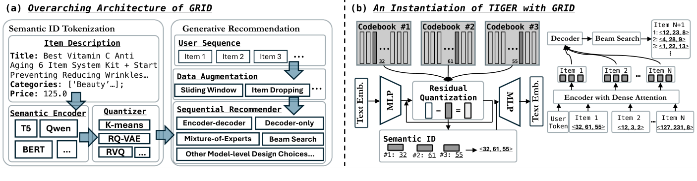

# 使用语义 ID 的生成式推荐：一份从业者手册（）

> Clark Mingxuan Ju、Liam Collins、Leonardo Neves、Bhuvesh Kumar、Louis Yufeng Wang、Tong Zhao、Neil Shah | Snap Inc.（美国加州圣莫尼卡）
>
> 邮箱：{mju,lcollins2,lneves,bkumar4,ywang14,tong,nshah}@snapchat.com

本文发布并开源了 GRID——首个面向"语义 ID 生成式推荐"的模块化统一框架，把"模态编码 + 量化 tokenizer + 序列生成"的完整流水线拆成可自由替换的组件，并用它对 7 类常被忽视的关键设计选择做了系统消融。核心发现是——**很多被默认接受、且计算/工程成本高昂的组件其实可以换成更省、更好的替代品，而真正决定性能的是编码器-解码器架构和数据增强**。

核心内容：

- 生成式推荐（GR）得益于生成模型的成功而快速兴起，语义 ID（SID）把预训练模型的连续语义表示变成离散 ID 序列，让模型同时利用语义知识（来自基础模型）和协同信号（来自交互历史）
- 问题：现有文献多数不开源、GR 流水线复杂且性能由多个混淆因素共同决定，从业者重实现代价极高，几乎无法调试根因
- 开源 GRID 框架：把 SID 工作流模块化为"先 tokenization 后生成"两阶段，编码器、量化 tokenizer（RK-Means / R-VQ / RQ-VAE）、生成模型全部即插即换，几行配置即可复现 TIGER
- 框架内已内置 user token、SID 去重、受限/不受限束搜索、编码器-解码器/仅解码器骨干、滑动窗口增强等可选组件
- 在 Amazon Beauty/Sports/Toys 三个公开基准上，对 tokenizer 算法、编码器规模、码本维度、user token 数量、网络架构、数据增强、去重、解码策略做逐一消融

关键发现：

- **RQ-VAE 的默认地位被打破**：RK-Means（有时 R-VQ）的推荐性能反而更好，尽管 RQ-VAE 的训练迭代数是它们的 5 倍
- 语义编码器从 Flan-T5-Large（780M 参数）升到 XXL（11B），参数量增加 14 倍，性能仅边际提升——更大 LLM 的世界知识没被充分利用
- **去掉 user token 反而最优**：user token 数量从 0 增至 8,000 的所有配置都不如完全不用（Recall@5 0.0408 vs 最高 0.0405），个性化目标落空
- 编码器-解码器显著优于仅解码器（Beauty Recall@10：0.0597 vs 0.0438）；去掉滑动窗口增强掉到 0.0447，数据增强不可或缺
- 受限与不受限束搜索性能基本持平（Beauty Recall@10：0.0597 vs 0.0609），但不受限束搜索计算成本显著更低；$(L, W) = (3, 256)$ 为最优码本配置，多加层反而掉点

---

## 摘要

生成式推荐（GR，Generative Recommendation）因其相比传统模型的出色性能而受到越来越多的关注。GR 成功的一个关键因素是语义 ID（SID，Semantic ID），它将连续的语义表示（例如来自大语言模型（LLM，Large Language Model））转换为离散 ID 序列。这使带 SID 的 GR 模型既能融合语义信息，又能学习协同过滤信号，同时保留离散解码的优势。然而，现有文献中多样的建模技术、超参数和实验设置使得 GR 方案之间的直接比较充满挑战。此外，缺乏开源、统一的框架阻碍了系统化的基准测试和扩展，减慢了模型迭代。为应对这一挑战，我们的工作引入并开源了一个语义 ID 生成式推荐框架，即 GRID，它专为模块化而设计，以便轻松替换组件、加速想法迭代。使用 GRID，我们在公开基准上对带 SID 的 GR 模型的不同组件进行了系统化实验与消融。GRID 的全面实验揭示，带 SID 的 GR 模型中许多被忽视的架构组件对性能有显著影响。这既提供了新颖的见解，也验证了开源平台对稳健基准测试和 GR 研究推进的效用。GRID 已在 https://github.com/snap-research/GRID 开源。

## 1 引言

推荐系统（RecSys，Recommender Systems）对于改善用户在 Web 服务上的体验至关重要，例如商品 [21, 48]、视频 [14, 22]、好友 [25, 28, 47] 推荐。在所有 RecSys 中，生成式推荐（GR）是一个快速增长的范式 [33, 44, 66, 68]，这得益于生成模型在视觉 [9, 16, 17] 和语言 [1, 3, 15, 24, 63] 领域近期的成功。GR 利用生成模型的进展，例如直接生成用户感兴趣的 item 的文本 [2, 12, 19, 51]，或从编码开放世界知识的预训练模型中提取语义表示 [45, 61, 64]。

在 GR 中，一种流行的范式探索语义 ID（SID）[7, 44, 61] 来弥合预训练基础模型与 RecSys 之间的鸿沟。如图 1 所示，该范式首先利用一个模态编码器（modality encoder）和一个量化 tokenizer（如 RQ-VAE（Residual Quantized Variational Autoencoder，残差量化变分自编码器）[31]、VQ-VAE（Vector Quantized Variational Autoencoder，向量量化变分自编码器）[10] 或 Residual K-means（残差 K 均值）[7]）将模态特征（如图像或文本）转换为 SID。随后训练一个序列推荐器（sequential recommender），根据过去 item 的 SID 自回归地预测用户未来将交互的 item 的 SID。

> **图 1：** (a) GRID 的总体架构。GRID 将带 SID 的 GR 工作流中的所有中间步骤模块化，以加快创新步伐。(b) 使用 GRID 实例化 TIGER [44] 非常简单，只需指定 GRID 中几个现成可用的组件，为从业者提供了可靠的参考实现，可以在此基础上进行开发。

带 SID 的 GR 提供了一种有效方式，同时利用预训练基础模型中编码的语义知识以及编码在用户-item 交互历史中的协同信号：两个 item 的 SID 重叠原则上反映它们的语义相似性，而下一个 item 监督让 GR 模型能够跨 SID 学习协同信号。自 [44] 提出以来，研究者提出了多种带 SID 的 GR 模型变体 [7, 41, 42, 61]，其中数种提升了性能或展示了在生产系统中的部署。

尽管进展令人鼓舞，带 SID 的 GR 的进一步发展仍面临若干挑战。首先，大多数相关文献不提供开源实现。这一挑战使从业者和研究者承担复杂的重新实现负担，不仅需要先进的技术专长，还需要仔细的超参数调优。由于带 SID 的 GR 流水线的复杂性质，这一挑战可能进一步加剧。正如我们将在本文后面展示的，GR 流水线的良好性能通常同时由多个混淆因素决定（例如适当的训练策略和仔细的架构调优）。从头构建带 SID 的 GR 流水线时，调试并定位潜在次优性能的根本原因极其困难，显著减缓了研究和开发的速度。此外，围绕带 SID 的 GR 设计选择的实用见解通常在文献中讨论不足，迫使从业者花费宝贵的时间和计算资源自行搭建实验流水线来积累这些理解。为弥合这些差距，我们做出以下贡献：

- 我们提出 GRID，一个易用、灵活且高效的可快速原型化带 SID 的 GR 方法的平台。GRID 包含带 SID 的 GR 中基本组件的严谨实现（如语义 ID tokenizer、序列推荐器等），并可轻松扩展以纳入 GR 领域持续进行的工作。据我们所知，GRID 是首个能够复现现有文献所报告结果的开源带 SID 的 GR 原型化资源。
- 利用 GRID，我们开展全面实验，研究带 SID 的 GR 范式中各组件的影响。我们的结果包含若干令人惊讶的观察，揭示了现有文献中迄今大多被忽视的关键建模与算法权衡。

## 2 相关工作

**语义 ID。** RecSys 的性能取决于学习高质量的表示 [5, 23, 27, 29, 37, 67]。标准做法是为用户/item 分配唯一的、无信息的 ID，将其映射到捕获协同信号的嵌入 [36, 39, 46, 58, 59, 64]。这种方法在可扩展性 [13, 58, 65] 以及稀疏或长尾设置下的性能 [23, 32, 36, 37, 49, 55] 方面存在困难。语义 ID（SID）通过模态编码器（如 LLM）编码语义特征（如文本），随后将稠密嵌入量化为稀疏 ID，解决了这些问题 [44, 50, 51]。常见的基于量化的 tokenizer 包括 RQ-VAE [31]、RVQ [54] 和 Residual K-Means [7]。

**带 SID 的生成式推荐。** TIGER [44] 首次将 transformer 应用于预测 item 的 SID 以实现推荐，扩展了文档检索中 GR 的思想 [52]。后续工作通过协同信号 [4, 34, 57, 60, 69, 70, 72]、分布均衡 [30, 62] 以及先进 LLM 或多模态编码器 [20, 35, 40, 51, 61, 73] 改进 SID 训练。然而，该领域缺乏统一的开源框架。我们通过发布 GRID（一个模块化工具包，用于简化和加速 GR 实验）来填补这一空白。

## 3 提出的框架：GRID–使用语义 ID 的生成式推荐

我们考虑一个与 item 集合 $I$ 交互的用户集合 $U$。每个 item $i \in I$ 具有关联的语义特征 $f_i$，包括但不限于文本和图像。每个用户 $u \in U$ 有一个长度为 $L_u$ 的交互序列，记为 $S_u = [i^u_1, i^u_2, \cdots, i^s_{L_u}]$。不失一般性，一个模态编码器（如 LLM 或 VLM（Vision Language Model，视觉语言模型））$E(\cdot) : f \to \mathbb{R}^d$ 将 $f_i$ 转换为 $d$ 维表示 $h_i \in \mathbb{R}^d$。GR 旨在解决序列推荐任务：给定用户序列 $S_u$，GR 框架为给定用户接下来将交互的 item（即 $i^s_{L_u+1}$）生成候选。

### 3.1 架构：先 Tokenization 后生成（Tokenization-then-Generation）

GRID 将带 SID 的 GR 拆分为两个独立阶段：先 tokenization 后生成，采用了常见模式（见图 1）。在 tokenization 阶段，GRID 将 item 嵌入（即 $h_i$）映射为 SID。在生成阶段，GRID 基于所有 item 的 SID，探索生成模型架构（如基于 transformer 的模型）来生成 $i^s_{L_u+1}$ 的 SID。GRID 为每个阶段的组件提供灵活的实现。

**语义 ID Tokenization。** SID tokenization 首先需要用预训练的模态编码器 $E(\cdot)$ 计算 item 语义特征的嵌入 $h_i$，然后通过层次聚类 tokenizer 将这些嵌入映射为稀疏 ID 序列。SID 的层次组织通过多样的前缀层级实现精确的粒度控制。形式上，给定 $h_i$，一个 tokenizer $\text{Tokenizer}(\cdot) : \mathbb{R}^d \to \{0, 1, \cdots, W\}^L$ 将 item 嵌入 $h_i$ 映射为 ID 序列，公式化为 $\text{SID}_i = \text{Tokenizer}(h_i) = [\text{SID}^0_i, \text{SID}^1_i, \cdots, \text{SID}^L_i]$，其中 $W$ 指每个 ID 的基数（cardinality），$L$ 表示层级数。GRID 为计算 $h_i$ 提供即插即用（plug-and-play）模块，使 $E(\cdot)$ 的替换变得简单直接——从业者既可以导入定制模型，也可以使用 HuggingFace[^1] 上可用的现有模型。对于 tokenizer，GRID 支持三种算法：残差迷你批 K 均值（Residual Mini-Batch K-Means，RK-Means [7, 38]）、残差向量量化（Residual Vector Quantization，R-VQ [10]）和残差量化变分自编码器（RQ-VAE [31]）。例如，如图 1 所示，TIGER [44] 的 tokenization 阶段可以通过指定一个 T5（Text-to-Text Transfer Transformer，文本到文本迁移 Transformer）编码器生成 item 表示、随后训练一个 RQ-VAE 生成 SID 来构成，全部只需几行配置更改。

**下一个 item 生成（Next Item Generation）。** 为所有 item 生成 SID 后，对于每个用户序列，GR 框架利用一个序列模型来生成给定用户最可能交互的候选 item 列表。在 GRID 中，我们集成了编码器-解码器（encoder-decoder）[8, 43, 56] 和仅解码器（decoder-only）[1, 3, 53] 两种模型架构，并配有灵活的配置（如注意力头数、层数或 transformer 层中的混合专家（mixture-of-experts））。与 tokenization 一样，从业者可以轻松导入自定义架构，或借用 HuggingFace 上公开可用的模型架构。默认情况下，我们使用广泛采用的 next-token 预测目标 [26, 44]（配合滑动窗口数据增强 [71][^2]）训练生成模型。推理生成通过带 KV cache 的束搜索进行，可调超参数包括束宽、搜索是否限制在有效 SID 内等。我们还提供了现有文献中广泛探索的若干技巧的实现，以展示 GRID 的灵活性，包括 user token [44]、以及 SID 去重以避免冲突。

[^1]: https://huggingface.co/docs/transformers
[^2]: 训练和推理逻辑可以完全自定义。

## 4 使用 GRID 的实验

我们接下来通过对带 SID 的 GR 中几个基本、但被忽视的设计选择进行简要而严谨的性能权衡研究，展示 GRID 的实用性。

**实验设置（Setup）。** 我们在 5-core 过滤的 Amazon Beauty、Sports 和 Toys 数据集 [18, 44] 上评估，使用每个用户的最后一个 item 作为测试、倒数第二个用于验证、其余用于训练。item 文本特征包括标题（Title）、类别（Categories）、描述（Description）和价格（Price）。语义嵌入通过对 Flan-T5-Large、XL 和 XXL [6] 的最终隐藏状态进行平均池化提取。对于 tokenization，我们考虑 RK-Means [7]、R-VQ [10] 和 RQ-VAE [31]。对于生成，我们分析上述架构选择。tokenizer 在 8 个 GPU 上训练，每设备批大小 2048。RK-Means 和 R-VQ 逐层（layer-wise）训练，每层 1k 步；RQ-VAE 共 15k 步。学习率（LR，Learning Rate）为 $10^{-3}$，使用 Adam（R-VQ）或 Adagrad（RQ-VAE）。残差被归一化（RK-Means、R-VQ），嵌入被白化（RQ-VAE）以防坍缩。生成模型使用 Adam，LR 为 $5 \times 10^{-4}$，权重衰减 $10^{-6}$，批大小 256。我们使用滑动窗口采样 [40]，在验证集 NDCG@10 连续 10 个验证间隔（每个 100 步）无改善后早停（early stopping）。对于生成模型的架构，我们总共探索 8 个 transformer 层（即编码器-解码器模型中编码器 4 层、解码器 4 层），每层 6 个注意力头，嵌入维度 128，MLP（Multi-Layer Perceptron，多层感知机）层隐藏维度 1024。我们报告测试集上 $K \in \{5, 10\}$ 的 Recall@K 和 NDCG@K（Normalized Discounted Cumulative Gain，归一化折损累积增益），使用验证 Recall@10 最佳的检查点（checkpoint）。所有结果是对 5 个不同随机种子的平均。

### 4.1 语义 ID Tokenization

我们通过消融研究 SID tokenization：(1) SID tokenizer 算法的选择、(2) 预训练语义编码器的规模、以及 (3) SID tokenizer 中残差层数（即 $L$）和每层 token 数（即 $W$）。我们训练各种 SID tokenizer 变体，并评估使用相应 tokenizer 训练的基础序列推荐模型的性能。除非另有说明，我们使用 $(L, W) = (3, 256)$ 的 RK-Means 和 Flan-T5-XL。

**SID Tokenizer 算法。** RQ-VAE 自 TIGER [44] 使用以来，在文献中被普遍用作默认 SID tokenizer [41, 50, 62, 68]。然而，它需要同时训练一个自编码器和量化器，加剧了许多挑战 [11, 30, 74]，并引发其性能收益是否值得实现复杂度的问题。表 1 表明答案是否定的：尽管我们训练 RQ-VAE 的迭代次数是更简单方案的 5 倍，RK-Means 以及有时 R-VQ 仍带来更好的推荐性能。

**表 1：不同 tokenization 算法生成的 SID 下 GR 模型的性能。**（指标为 Recall@5/Recall@10/NDCG@5/NDCG@10）

| 方法 | 数据集 | Recall@5 | Recall@10 | NDCG@5 | NDCG@10 |
| --- | --- | --- | --- | --- | --- |
| RK-Means | Beauty | 0.0422 | 0.0639 | 0.0277 | 0.0347 |
|  | Toys | 0.0376 | 0.0577 | 0.0243 | 0.0308 |
|  | Sports | 0.0236 | 0.0353 | 0.0153 | 0.0191 |
| R-VQ | Beauty | 0.0422 | 0.0638 | 0.0282 | 0.0351 |
|  | Toys | 0.0327 | 0.0493 | 0.0209 | 0.0262 |
|  | Sports | 0.0234 | 0.0352 | 0.0151 | 0.0189 |
| RQ-VAE | Beauty | 0.0404 | 0.0593 | 0.0268 | 0.0329 |
|  | Toys | 0.0342 | 0.0514 | 0.0224 | 0.0280 |
|  | Sports | 0.0205 | 0.0312 | 0.0132 | 0.0166 |

**语义编码器规模。** 我们接下来改变用于计算语义嵌入的 Flan-T5 模型 [6] 的规模，从 Large（780M 参数）到 XL（3B）再到 XXL（11B）。表 2 显示，LLM 参数量增加超过 14 倍只带来推荐性能的边际提升，这表明当前的带 SID 的 GR 流水线可以通过更充分地利用更大 LLM 中增加的世界知识来改进。

**表 2：不同规模语言模型编码器生成 RK-Means SID 的 GR 模型性能。**（指标为 Recall@5/Recall@10/NDCG@5/NDCG@10）

| 语言模型 | 数据集 | Recall@5 | Recall@10 | NDCG@5 | NDCG@10 |
| --- | --- | --- | --- | --- | --- |
| L | Beauty | 0.0429 | 0.0639 | 0.0285 | 0.0353 |
|  | Toys | 0.0373 | 0.0565 | 0.0237 | 0.0300 |
|  | Sports | 0.0224 | 0.0347 | 0.0145 | 0.0185 |
| XL | Beauty | 0.0422 | 0.0639 | 0.0277 | 0.0347 |
|  | Toys | 0.0376 | 0.0577 | 0.0243 | 0.0308 |
|  | Sports | 0.0236 | 0.0353 | 0.0153 | 0.0191 |
| XXL | Beauty | 0.0429 | 0.0646 | 0.0282 | 0.0352 |
|  | Toys | 0.0381 | 0.0586 | 0.0245 | 0.0311 |
|  | Sports | 0.0239 | 0.0363 | 0.0154 | 0.0194 |

**SID Tokenizer 维度。** 在表 3 中，我们变化 RK-Means 的残差层数 $L$ 和每层 token 数 $W$，观察到默认选择 $(L, W) = (3, 256)$ 带来最佳推荐性能。令人惊讶的是，尽管更多层向推荐模型传递更多语义信息，增加层数却使性能大幅下降。这指向 SID 序列可学习性与 SID 所含语义信息量之间的权衡。

**表 3：Flan-T5-XL 嵌入下不同码本维度的 RK-Means SID 的 Beauty GR 性能。**

| $L \times W$ | Recall@5 | Recall@10 | NDCG@5 | NDCG@10 |
| --- | --- | --- | --- | --- |
| $3 \times 128$ | 0.0412 | 0.0617 | 0.0273 | 0.0339 |
| $3 \times 256$ | 0.0422 | 0.0639 | 0.0277 | 0.0347 |
| $3 \times 512$ | 0.0415 | 0.0631 | 0.0273 | 0.0342 |
| $2 \times 256$ | 0.0403 | 0.0618 | 0.0264 | 0.0333 |
| $4 \times 256$ | 0.0405 | 0.0609 | 0.0265 | 0.0331 |
| $5 \times 256$ | 0.0396 | 0.0596 | 0.0257 | 0.0321 |

### 4.2 生成式推荐

为理解下一个 item 生成模型设计选择的影响，我们消融了：(1) user token 的数量、(2) 编码器-解码器与仅解码器架构之间的选择、(3) 训练中数据增强的整合、(4) ID 去重的实现、以及 (5) 受限与不受限束搜索的采用。我们采用前述默认 SID tokenization，并评估下一个 item 生成性能。

**user token 的数量。** TIGER [44] 在每个用户的 SID 序列前添加一个 user token，user token 通过随机哈希分配到固定词表大小。表 4 显示，更大的 user token 词表并不总是提升性能，完全移除这一设计（即 0）带来最优性能，暗示带 SID 的 GR 中当前 user token 的标准用法并未实现其个性化目标。

**表 4：不同数量 TIGER [44] 式 user token 的 Beauty GR 性能。**

| # Tokens | Recall@5 | Recall@10 | NDCG@5 | NDCG@10 |
| --- | --- | --- | --- | --- |
| 0 | 0.0408 | 0.0618 | 0.0270 | 0.0330 |
| 2,000 | 0.0396 | 0.0597 | 0.0264 | 0.0328 |
| 4,000 | 0.0401 | 0.0612 | 0.0264 | 0.0332 |
| 6,000 | 0.0401 | 0.0611 | 0.0264 | 0.0331 |
| 8,000 | 0.0405 | 0.0610 | 0.0269 | 0.0335 |

**编码器-解码器 vs. 仅解码器架构。** 大多数现有文献探索基于编码器-解码器的 transformer 生成模型 [44, 61]。为研究仅解码器架构的可行性，我们将编码器-解码器骨干替换为仅解码器架构。如表 5 所示，仅解码器模型显著劣于编码器-解码器模型。我们假设这一显著的性能差距可归因于编码器-解码器模型的内在设计：编码器对整个用户历史的稠密注意力（dense attention）机制有效捕获了更丰富、更全面的序列模式。这种深层的上下文理解随后被解码器用于生成，对生成式推荐这一挑战性任务似乎至关重要。

**表 5：不同架构的 GR 性能。**

| 模型 | 数据集 | Recall@5 | Recall@10 | NDCG@5 | NDCG@10 |
| --- | --- | --- | --- | --- | --- |
| 编码器-解码器 | Beauty | 0.0396 | 0.0597 | 0.0264 | 0.0328 |
|  | Toys | 0.0357 | 0.0548 | 0.0226 | 0.0287 |
|  | Sports | 0.0192 | 0.0290 | 0.0124 | 0.0156 |
| 仅解码器 | Beauty | 0.0300 | 0.0438 | 0.0206 | 0.0251 |
|  | Toys | 0.0286 | 0.0399 | 0.0202 | 0.0238 |
|  | Sports | 0.0152 | 0.0226 | 0.00979 | 0.0121 |

**训练的数据增强。** 在表 6 中，我们研究数据增强对带 SID 的 GR 性能的影响。我们探索滑动窗口数据增强，其中单个用户序列被扩展为所有可能的连续子序列 [71]。我们的观察强烈表明，适当的数据增强对实现稳健且高性能的 GR 模型至关重要。通过该技术生成的扩展且多样的训练样本可能增强模型从用户交互中学习更可泛化模式的能力、缓解过拟合，并提升其预测多样下一个 item 的能力，即使在存在噪声和/或稀疏数据的情况下也是如此。

**表 6：有无数据增强的 GR 性能。**

| 增强 | 数据集 | Recall@5 | Recall@10 | NDCG@5 | NDCG@10 |
| --- | --- | --- | --- | --- | --- |
| 滑动窗口 | Beauty | 0.0396 | 0.0597 | 0.0264 | 0.0328 |
|  | Toys | 0.0357 | 0.0548 | 0.0226 | 0.0287 |
|  | Sports | 0.0192 | 0.0290 | 0.0124 | 0.0156 |
| 不做增强 | Beauty | 0.0279 | 0.0447 | 0.0171 | 0.0226 |
|  | Toys | 0.0277 | 0.0442 | 0.0173 | 0.0226 |
|  | Sports | 0.0174 | 0.0250 | 0.0114 | 0.0140 |

**SID 的去重。** 去重（de-duplication）SID 对准确检索至关重要。我们比较两种策略：TIGER 的方法，即在 SID 后附加一个数字以解决冲突（"带去重"（With De-dup.）），以及冲突时随机选择 item 的更简单方法。表 7 显示两者性能相当，TIGER 的策略略有优势。然而，TIGER 的方法增加了序列长度和解码复杂度，且其需要全局 SID 分布知识，对大型 item 集合不切实际。

**表 7：有无 SID 去重的 GR 性能。**

| 方案 | 数据集 | Recall@5 | Recall@10 | NDCG@5 | NDCG@10 |
| --- | --- | --- | --- | --- | --- |
| 带去重 | Beauty | 0.0396 | 0.0597 | 0.0264 | 0.0328 |
|  | Toys | 0.0357 | 0.0548 | 0.0226 | 0.0287 |
|  | Sports | 0.0192 | 0.0290 | 0.0124 | 0.0156 |
| 不去重 | Beauty | 0.0381 | 0.0591 | 0.0253 | 0.0321 |
|  | Toys | 0.0353 | 0.0532 | 0.0225 | 0.0282 |
|  | Sports | 0.0186 | 0.0269 | 0.0011 | 0.0142 |

**受限 vs. 不受限束搜索。** 解码策略既影响生成质量也影响计算效率。我们的消融研究比较受限与不受限束搜索，这对生成式推荐系统的部署至关重要。受限（constrained）束搜索将输出引导到有效 SID，而不受限（unconstrained）束搜索探索所有序列而不施加显式规则。表 8 显示两者产生相似性能。关键在于，不受限束搜索明显更高效、计算成本更低。这表明 SID 生成任务的内在结构，结合学习到的模型模式，足以在没有显式约束开销的情况下产生高质量推荐。

**表 8：不同束搜索方式的 GR 性能。**

| 方案 | 数据集 | Recall@5 | Recall@10 | NDCG@5 | NDCG@10 |
| --- | --- | --- | --- | --- | --- |
| 受限 | Beauty | 0.0396 | 0.0597 | 0.0264 | 0.0328 |
|  | Toys | 0.0357 | 0.0548 | 0.0226 | 0.0287 |
|  | Sports | 0.0192 | 0.0290 | 0.0124 | 0.0156 |
| 自由形式 | Beauty | 0.0405 | 0.0609 | 0.0268 | 0.0334 |
|  | Toys | 0.0356 | 0.0546 | 0.0227 | 0.0289 |
|  | Sports | 0.0198 | 0.0302 | 0.0127 | 0.0160 |

## 5 结论

在这项工作中，我们强调了带 SID 的 GR 对统一开源框架的迫切需要。通过 GRID，我们开展系统性实验，揭示了多个令人惊讶的见解。我们发现，若干先前被认为必不可少——且通常计算和/或工程密集型——的组件，实际上可以被更高效的替代品替换而不牺牲性能。相反，其他常被忽视的设计选择被证明至关重要，如编码器-解码器架构和数据增强。这些发现不仅为带 SID 的 GR 性能的真正驱动因素提供了新颖见解，也凸显了 GRID 这类开源平台对稳健基准测试和加速研究的巨大价值。

## 参考文献

[1] Jinze Bai, Shuai Bai, Yunfei Chu, Zeyu Cui, Kai Dang, Xiaodong Deng, Yang Fan, Wenbin Ge, Yu Han, Fei Huang, et al. 2023. Qwen technical report. arXiv preprint arXiv:2309.16609 (2023).

[2] Keqin Bao, Jizhi Zhang, Yang Zhang, Wenjie Wang, Fuli Feng, and Xiangnan He. 2023. Tallrec: An effective and efficient tuning framework to align large language model with recommendation. In Proceedings of the 17th ACM Conference on Recommender Systems. 1007–1014.

[3] Tom Brown, Benjamin Mann, Nick Ryder, Melanie Subbiah, Jared D Kaplan, Prafulla Dhariwal, Arvind Neelakantan, Pranav Shyam, Girish Sastry, Amanda Askell, et al. 2020. Language models are few-shot learners. Advances in neural information processing systems 33 (2020), 1877–1901.

[4] Runjin Chen, Mingxuan Ju, Ngoc Bui, Dimosthenis Antypas, Stanley Cai, Xiaopeng Wu, Leonardo Neves, Zhangyang Wang, Neil Shah, and Tong Zhao. 2024. Enhancing item tokenization for generative recommendation through self-improvement. arXiv preprint arXiv:2412.17171 (2024).

[5] Heng-Tze Cheng, Levent Koc, Jeremiah Harmsen, Tal Shaked, Tushar Chandra, Hrishi Aradhye, Glen Anderson, Greg Corrado, Wei Chai, Mustafa Ispir, et al. 2016. Wide & deep learning for recommender systems. In Proceedings of the 1st workshop on deep learning for recommender systems. 7–10.

[6] Hyung Won Chung, Le Hou, Shayne Longpre, Barret Zoph, Yi Tay, William Fedus, Yunxuan Li, Xuezhi Wang, Mostafa Dehghani, Siddhartha Brahma, et al. 2024. Scaling instruction-finetuned language models. Journal of Machine Learning Research 25, 70 (2024), 1–53.

[7] Jiaxin Deng, Shiyao Wang, Kuo Cai, Lejian Ren, Qigen Hu, Weifeng Ding, Qiang Luo, and Guorui Zhou. 2025. Onerec: Unifying retrieve and rank with generative recommender and iterative preference alignment. arXiv preprint arXiv:2502.18965 (2025).

[8] Jacob Devlin, Ming-Wei Chang, Kenton Lee, and Kristina Toutanova. 2019. Bert: Pre-training of deep bidirectional transformers for language understanding. In Proceedings of the 2019 conference of the North American chapter of the association for computational linguistics: human language technologies, volume 1 (long and short papers). 4171–4186.

[9] Alexey Dosovitskiy, Lucas Beyer, Alexander Kolesnikov, Dirk Weissenborn, Xiaohua Zhai, Thomas Unterthiner, Mostafa Dehghani, Matthias Minderer, Georg Heigold, Sylvain Gelly, et al. 2020. An image is worth 16x16 words: Transformers for image recognition at scale. arXiv preprint arXiv:2010.11929 (2020).

[10] Patrick Esser, Robin Rombach, and Bjorn Ommer. 2021. Taming transformers for high-resolution image synthesis. In Proceedings of the IEEE/CVF conference on computer vision and pattern recognition. 12873–12883.

[11] Christopher Fifty, Ronald G Junkins, Dennis Duan, Aniketh Iyengar, Jerry W Liu, Ehsan Amid, Sebastian Thrun, and Christopher Ré. 2024. Restructuring vector quantization with the rotation trick. arXiv preprint arXiv:2410.06424 (2024).

[12] Shijie Geng, Shuchang Liu, Zuohui Fu, Yingqiang Ge, and Yongfeng Zhang. 2022. Recommendation as language processing (rlp): A unified pretrain, personalized prompt & predict paradigm (p5). In Proceedings of the 16th ACM conference on recommender systems. 299–315.

[13] Benjamin Ghaemmaghami, Mustafa Ozdal, Rakesh Komuravelli, Dmitriy Korchev, Dheevatsa Mudigere, Krishnakumar Nair, and Maxim Naumov. 2022. Learning to Collide: Recommendation System Model Compression with Learned Hash Functions. ArXiv abs/2203.15837 (2022). https://api.semanticscholar.org/CorpusID: 247794181

[14] Carlos A Gomez-Uribe and Neil Hunt. 2015. The netflix recommender system: Algorithms, business value, and innovation. ACM Transactions on Management Information Systems (TMIS) (2015).

[15] Daya Guo, Dejian Yang, Haowei Zhang, Junxiao Song, Ruoyu Zhang, Runxin Xu, Qihao Zhu, Shirong Ma, Peiyi Wang, Xiao Bi, et al. 2025. Deepseek-r1: Incentivizing reasoning capability in llms via reinforcement learning. arXiv preprint arXiv:2501.12948 (2025).

[16] Kaiming He, Xinlei Chen, Saining Xie, Yanghao Li, Piotr Dollár, and Ross Girshick. 2022. Masked autoencoders are scalable vision learners. In Proceedings of the IEEE/CVF conference on computer vision and pattern recognition. 16000–16009.

[17] Jonathan Ho, Ajay Jain, and Pieter Abbeel. 2020. Denoising diffusion probabilistic models. Advances in neural information processing systems 33 (2020), 6840–6851.

[18] Yupeng Hou, Jiacheng Li, Zhankui He, An Yan, Xiusi Chen, and Julian McAuley. 2024. Bridging Language and Items for Retrieval and Recommendation. arXiv preprint arXiv:2403.03952 (2024).

[19] Wenyue Hua, Shuyuan Xu, Yingqiang Ge, and Yongfeng Zhang. 2023. How to index item ids for recommendation foundation models. In Proceedings of the Annual International ACM SIGIR Conference on Research and Development in Information Retrieval in the Asia Pacific Region. 195–204.

[20] Bowen Jin, Hansi Zeng, Guoyin Wang, Xiusi Chen, Tianxin Wei, Ruirui Li, Zhengyang Wang, Zheng Li, Yang Li, Hanqing Lu, et al. 2023. Language models as semantic indexers. arXiv preprint arXiv:2310.07815 (2023).

[21] Clark Mingxuan Ju, Leonardo Neves, Bhuvesh Kumar, Liam Collins, Tong Zhao, Yuwei Qiu, Qing Dou, Sohail Nizam, Sen Yang, and Neil Shah. 2025. Revisiting Self-attention for Cross-domain Sequential Recommendation. arXiv preprint arXiv:2505.21811 (2025).

[22] Clark Mingxuan Ju, Leonardo Neves, Bhuvesh Kumar, Liam Collins, Tong Zhao, Yuwei Qiu, Qing Dou, Yang Zhou, Sohail Nizam, Rengim Aykan Ozturk, et al. 2025. Learning Universal User Representations Leveraging Cross-domain User Intent at Snapchat. In Proceedings of the 48th International ACM SIGIR Conference on Research and Development in Information Retrieval. 4345–4349.

[23] Mingxuan Ju, William Shiao, Zhichun Guo, Yanfang Ye, Yozen Liu, Neil Shah, and Tong Zhao. 2024. How Does Message Passing Improve Collaborative Filtering? arXiv preprint arXiv:2404.08660 (2024).

[24] Mingxuan Ju, Wenhao Yu, Tong Zhao, Chuxu Zhang, and Yanfang Ye. 2022. Grape: Knowledge graph enhanced passage reader for open-domain question answering. arXiv preprint arXiv:2210.02933 (2022).

[25] Mingxuan Ju, Tong Zhao, Qianlong Wen, Wenhao Yu, Neil Shah, Yanfang Ye, and Chuxu Zhang. 2022. Multi-task self-supervised graph neural networks enable stronger task generalization. arXiv preprint arXiv:2210.02016 (2022).

[26] Wang-Cheng Kang and Julian McAuley. 2018. Self-attentive sequential recommendation. In 2018 IEEE international conference on data mining (ICDM). IEEE, 197–206.

[27] Dongmoon Kim, Kun-su Kim, Kyo-Hyun Park, Jee-Hyong Lee, and Keon Myung Lee. 2007. A music recommendation system with a dynamic k-means clustering algorithm. In Sixth international conference on machine learning and applications (ICMLA 2007). IEEE, 399–403.

[28] Matthew Kolodner, Mingxuan Ju, Zihao Fan, Tong Zhao, Elham Ghazizadeh, Yan Wu, Neil Shah, and Yozen Liu. 2024. Robust training objectives improve embedding-based retrieval in industrial recommendation systems. arXiv preprint arXiv:2409.14682 (2024).

[29] Yehuda Koren, Robert Bell, and Chris Volinsky. 2009. Matrix factorization techniques for recommender systems. Computer 42, 8 (2009), 30–37.

[30] Zhirui Kuai, Zuxu Chen, Huimu Wang, Mingming Li, Dadong Miao, Binbin Wang, Xusong Chen, Li Kuang, Yuxing Han, Jiaxing Wang, et al. 2024. Breaking the Hourglass Phenomenon of Residual Quantization: Enhancing the Upper Bound of Generative Retrieval. arXiv preprint arXiv:2407.21488 (2024).

[31] Doyup Lee, Chiheon Kim, Saehoon Kim, Minsu Cho, and Wook-Shin Han. 2022. Autoregressive image generation using residual quantization. In Proceedings of the IEEE/CVF Conference on Computer Vision and Pattern Recognition. 11523–11532.

[32] Blerina Lika, Kostas Kolomvatsos, and Stathes Hadjiefthymiades. 2014. Facing the cold start problem in recommender systems. Expert systems with applications 41, 4 (2014), 2065–2073.

[33] Jianghao Lin, Xinyi Dai, Yunjia Xi, Weiwen Liu, Bo Chen, Hao Zhang, Yong Liu, Chuhan Wu, Xiangyang Li, Chenxu Zhu, et al. 2025. How can recommender systems benefit from large language models: A survey. ACM Transactions on Information Systems 43, 2 (2025), 1–47.

[34] Enze Liu, Bowen Zheng, Cheng Ling, Lantao Hu, Han Li, and Wayne Xin Zhao. 2024. End-to-End Learnable Item Tokenization for Generative Recommendation. arXiv preprint arXiv:2409.05546 (2024).

[35] Zihan Liu, Yupeng Hou, and Julian McAuley. 2024. Multi-behavior generative recommendation. In Proceedings of the 33rd ACM International Conference on Information and Knowledge Management. 1575–1585.

[36] Donald Loveland, Mingxuan Ju, Tong Zhao, Neil Shah, and Danai Koutra. 2025. On the Role of Weight Decay in Collaborative Filtering: A Popularity Perspective. arXiv preprint arXiv:2505.11318 (2025).

[37] Donald Loveland, Xinyi Wu, Tong Zhao, Danai Koutra, Neil Shah, and Mingxuan Ju. 2025. Understanding and Scaling Collaborative Filtering Optimization from the Perspective of Matrix Rank. In Proceedings of the ACM on Web Conference 2025. 436–449.

[38] Xinchen Luo, Jiangxia Cao, Tianyu Sun, Jinkai Yu, Rui Huang, Wei Yuan, Hezheng Lin, Yichen Zheng, Shiyao Wang, Qigen Hu, et al. 2024. QARM: Quantitative Alignment Multi-Modal Recommendation at Kuaishou. arXiv preprint arXiv:2411.11739 (2024).

[39] Zhongyu Ouyang, Mingxuan Ju, Soroush Vosoughi, and Yanfang Ye. 2025. Non-parametric Graph Convolution for Re-ranking in Recommendation Systems. arXiv preprint arXiv:2507.09969 (2025).

[40] Fabian Paischer, Liu Yang, Linfeng Liu, Shuai Shao, Kaveh Hassani, Jiacheng Li, Ricky Chen, Zhang Gabriel Li, Xialo Gao, Wei Shao, et al. 2024. Preference Discerning with LLM-Enhanced Generative Retrieval. arXiv preprint arXiv:2412.08604 (2024).

[41] Fabian Paischer, Liu Yang, Linfeng Liu, Shuai Shao, Kaveh Hassani, Jiacheng Li, Ricky TQ Chen, Zhang Gabriel Li, Xiaoli Gao, Wei Shao, et al. [n. d.]. Preference Discerning in Generative Sequential Recommendation. ([n. d.]).

[42] Enrico Palumbo, Gustavo Penha, Andreas Damianou, José Luis Redondo García, Timothy Christopher Heath, Alice Wang, Hugues Bouchard, and Mounia Lalmas. 2025. Text2Tracks: Prompt-based Music Recommendation via Generative Retrieval. arXiv preprint arXiv:2503.24193 (2025).

[43] Colin Raffel, Noam Shazeer, Adam Roberts, Katherine Lee, Sharan Narang, Michael Matena, Yanqi Zhou, Wei Li, and Peter J Liu. 2020. Exploring the limits of transfer learning with a unified text-to-text transformer. Journal of machine learning research 21, 140 (2020), 1–67.

[44] Shashank Rajput, Nikhil Mehta, Anima Singh, Raghunandan Hulikal Keshavan, Trung Vu, Lukasz Heldt, Lichan Hong, Yi Tay, Vinh Tran, Jonah Samost, et al. 2023. Recommender systems with generative retrieval. Advances in Neural Information Processing Systems 36 (2023), 10299–10315.

[45] Xubin Ren, Wei Wei, Lianghao Xia, Lixin Su, Suqi Cheng, Junfeng Wang, Dawei Yin, and Chao Huang. 2024. Representation learning with large language models for recommendation. In Proceedings of the ACM Web Conference 2024. 3464–3475.

[46] Steffen Rendle, Walid Krichene, Li Zhang, and John Anderson. 2020. Neural collaborative filtering vs. matrix factorization revisited. In Proceedings of the 14th ACM Conference on Recommender Systems. 240–248.

[47] Aravind Sankar, Yozen Liu, Jun Yu, and Neil Shah. 2021. Graph neural networks for friend ranking in large-scale social platforms. In Proceedings of the Web Conference 2021. 2535–2546.

[48] J Ben Schafer, Joseph Konstan, and John Riedl. 1999. Recommender systems in e-commerce. In Procs. of ACM conference on Electronic commerce.

[49] William Shiao, Mingxuan Ju, Zhichun Guo, Xin Chen, Evangelos E Papalexakis, Tong Zhao, Neil Shah, and Yozen Liu. 2025. Improving Out-of-Vocabulary Hashing in Recommendation Systems. In Companion Proceedings of the ACM on Web Conference 2025. 2521–2530.

[50] Anima Singh, Trung Vu, Nikhil Mehta, Raghunandan Keshavan, Maheswaran Sathiamoorthy, Yilin Zheng, Lichan Hong, Lukasz Heldt, Li Wei, Devansh Tandon, et al. 2024. Better generalization with semantic ids: A case study in ranking for recommendations. In Proceedings of the 18th ACM Conference on Recommender Systems. 1039–1044.

[51] Juntao Tan, Shuyuan Xu, Wenyue Hua, Yingqiang Ge, Zelong Li, and Yongfeng Zhang. 2024. Idgenrec: Llm-recsys alignment with textual id learning. In Proceedings of the 47th International ACM SIGIR Conference on Research and Development in Information Retrieval. 355–364.

[52] Yi Tay, Vinh Tran, Mostafa Dehghani, Jianmo Ni, Dara Bahri, Harsh Mehta, Zhen Qin, Kai Hui, Zhe Zhao, Jai Gupta, et al. 2022. Transformer memory as a differentiable search index. Advances in Neural Information Processing Systems 35 (2022), 21831–21843.

[53] Hugo Touvron, Thibaut Lavril, Gautier Izacard, Xavier Martinet, Marie-Anne Lachaux, Timothée Lacroix, Baptiste Rozière, Naman Goyal, Eric Hambro, Faisal Azhar, et al. 2023. Llama: Open and efficient foundation language models. arXiv preprint arXiv:2302.13971 (2023).

[54] Aaron Van Den Oord, Oriol Vinyals, et al. 2017. Neural discrete representation learning. Advances in neural information processing systems 30 (2017).

[55] Manasi Vartak, Arvind Thiagarajan, Conrado Miranda, Jeshua Bratman, and Hugo Larochelle. 2017. A meta-learning perspective on cold-start recommendations for items. Advances in neural information processing systems 30 (2017).

[56] Ashish Vaswani, Noam Shazeer, Niki Parmar, Jakob Uszkoreit, Llion Jones, Aidan N Gomez, Łukasz Kaiser, and Illia Polosukhin. 2017. Attention is all you need. Advances in neural information processing systems 30 (2017).

[57] Wenjie Wang, Honghui Bao, Xinyu Lin, Jizhi Zhang, Yongqi Li, Fuli Feng, See-Kiong Ng, and Tat-Seng Chua. 2024. Learnable item tokenization for generative recommendation. In Proceedings of the 33rd ACM International Conference on Information and Knowledge Management. 2400–2409.

[58] Kilian Weinberger, Anirban Dasgupta, John Langford, Alex Smola, and Josh Attenberg. 2009. Feature hashing for large scale multitask learning. In Proceedings of the 26th annual international conference on machine learning. 1113–1120.

[59] Xinyi Wu, Donald Loveland, Runjin Chen, Yozen Liu, Xin Chen, Leonardo Neves, Ali Jadbabaie, Mingxuan Ju, Neil Shah, and Tong Zhao. 2025. GraphHash: Graph Clustering Enables Parameter Efficiency in Recommender Systems. In Proceedings of the ACM on Web Conference 2025. 357–369.

[60] Longtao Xiao, Haozhao Wang, Cheng Wang, Linfei Ji, Yifan Wang, Jieming Zhu, Zhenhua Dong, Rui Zhang, and Ruixuan Li. 2025. Progressive Collaborative and Semantic Knowledge Fusion for Generative Recommendation. arXiv preprint arXiv:2502.06269 (2025).

[61] Liu Yang, Fabian Paischer, Kaveh Hassani, Jiacheng Li, Shuai Shao, Zhang Gabriel Li, Yun He, Xue Feng, Nima Noorshams, Sem Park, et al. 2024. Unifying Generative and Dense Retrieval for Sequential Recommendation. arXiv preprint arXiv:2411.18814 (2024).

[62] Yuhao Yang, Zhi Ji, Zhaopeng Li, Yi Li, Zhonglin Mo, Yue Ding, Kai Chen, Zijian Zhang, Jie Li, Shuanglong Li, et al. 2025. Sparse meets dense: Unified generative recommendations with cascaded sparse-dense representations. arXiv preprint arXiv:2503.02453 (2025).

[63] Wenhao Yu, Dan Iter, Shuohang Wang, Yichong Xu, Mingxuan Ju, Soumya Sanyal, Chenguang Zhu, Michael Zeng, and Meng Jiang. 2022. Generate rather than retrieve: Large language models are strong context generators. arXiv preprint arXiv:2209.10063 (2022).

[64] Zheng Yuan, Fajie Yuan, Yu Song, Youhua Li, Junchen Fu, Fei Yang, Yunzhu Pan, and Yongxin Ni. 2023. Where to go next for recommender systems? id- vs. modality-based recommender models revisited. In Proceedings of the 46th International ACM SIGIR Conference on Research and Development in Information Retrieval. 2639–2649.

[65] Caojin Zhang, Yicun Liu, Yuanpu Xie, Sofia Ira Ktena, Alykhan Tejani, Akshay Gupta, Pranay K. Myana, Deepak Dilipkumar, Suvadip Paul, Ikuhiro Ihara, Prasang Upadhyaya, Ferenc Huszár, and Wenzhe Shi. 2020. Model Size Reduction Using Frequency Based Double Hashing for Recommender Systems. In Proceedings of the 14th ACM Conference on Recommender Systems.

[66] Zihuai Zhao, Wenqi Fan, Jiatong Li, Yunqing Liu, Xiaowei Mei, Yiqi Wang, Zhen Wen, Fei Wang, Xiangyu Zhao, Jiliang Tang, et al. 2024. Recommender systems in the era of large language models (llms). IEEE Transactions on Knowledge and Data Engineering (2024).

[67] Zhe Zhao, Lichan Hong, Li Wei, Jilin Chen, Aniruddh Nath, Shawn Andrews, Aditee Kumthekar, Maheswaran Sathiamoorthy, Xinyang Yi, and Ed Chi. 2019. Recommending what video to watch next: a multitask ranking system. In Proceedings of the 13th ACM conference on recommender systems. 43–51.

[68] Bowen Zheng, Yupeng Hou, Hongyu Lu, Yu Chen, Wayne Xin Zhao, Ming Chen, and Ji-Rong Wen. 2024. Adapting large language models by integrating collaborative semantics for recommendation. In 2024 IEEE 40th International Conference on Data Engineering (ICDE). IEEE, 1435–1448.

[69] Bowen Zheng, Enze Liu, Zhongfu Chen, Zhongrui Ma, Yue Wang, Wayne Xin Zhao, and Ji-Rong Wen. 2025. Pre-training Generative Recommender with Multi-Identifier Item Tokenization. arXiv preprint arXiv:2504.04400 (2025).

[70] Bowen Zheng, Hongyu Lu, Yu Chen, Wayne Xin Zhao, and Ji-Rong Wen. 2025. Universal Item Tokenization for Transferable Generative Recommendation. arXiv preprint arXiv:2504.04405 (2025).

[71] Peilin Zhou, You-Liang Huang, Yueqi Xie, Jingqi Gao, Shoujin Wang, Jae Boum Kim, and Sunghun Kim. 2024. Is contrastive learning necessary? a study of data augmentation vs contrastive learning in sequential recommendation. In Proceedings of the ACM Web Conference 2024. 3854–3863.

[72] Jieming Zhu, Mengqun Jin, Qijiong Liu, Zexuan Qiu, Zhenhua Dong, and Xiu Li. 2024. CoST: Contrastive Quantization based Semantic Tokenization for Generative Recommendation. In Proceedings of the 18th ACM Conference on Recommender Systems. 969–974.

[73] Jing Zhu, Mingxuan Ju, Yozen Liu, Danai Koutra, Neil Shah, and Tong Zhao. 2025. Beyond Unimodal Boundaries: Generative Recommendation with Multimodal Semantics. arXiv preprint arXiv:2503.23333 (2025).

[74] Yongxin Zhu, Bocheng Li, Yifei Xin, and Linli Xu. 2024. Addressing representation collapse in vector quantized models with one linear layer. arXiv preprint arXiv:2411.02038 (2024).