# OneRec 技术报告

> OneRec 团队

Summary: 本文介绍了快手提出的 OneRec，一个端到端生成式推荐架构，通过编码器-解码器模型统一检索与排序，替代传统的多阶段级联推荐系统。核心内容：
- 提出端到端生成式推荐架构 OneRec，采用编码器-解码器结构，编码器压缩用户终身行为序列以建模用户兴趣，解码器利用混合专家（MoE）大规模扩展参数以进行精确的短视频推荐解码
- 实现 tokenizer 将视频转化为粗到细的语义 ID，融合协同信号与多模态特征，利用 RQ-Kmeans 生成高质量层次化语义标识符
- 在训练后阶段引入基于奖励系统的强化学习框架（ECPO），包括用户偏好对齐（P-Score）、生成格式正则化（Format Reward）和工业场景对齐（SIR）
- 通过基础设施优化实现训练 MFU 23.7%、推理 MFU 28.8%，OPEX 仅为传统推荐管线的 10.6%
关键发现：OneRec 在快手/快手极速版上线，处理约 25% 总 QPS，App 停留时间提升 0.54%/1.24%。

---

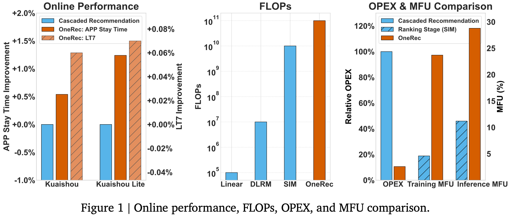

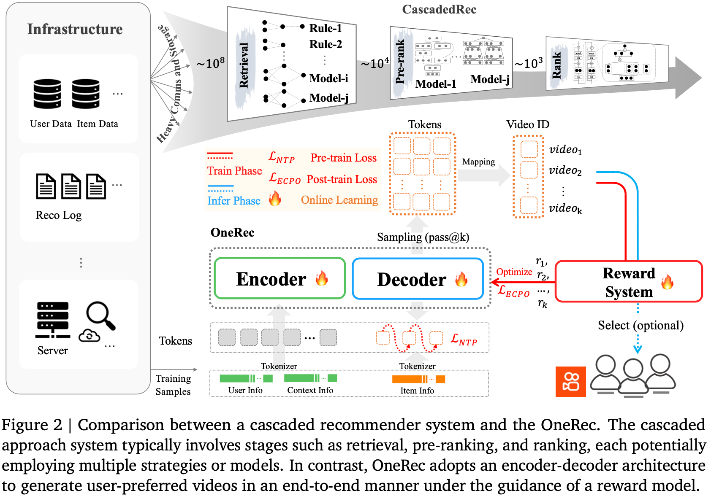

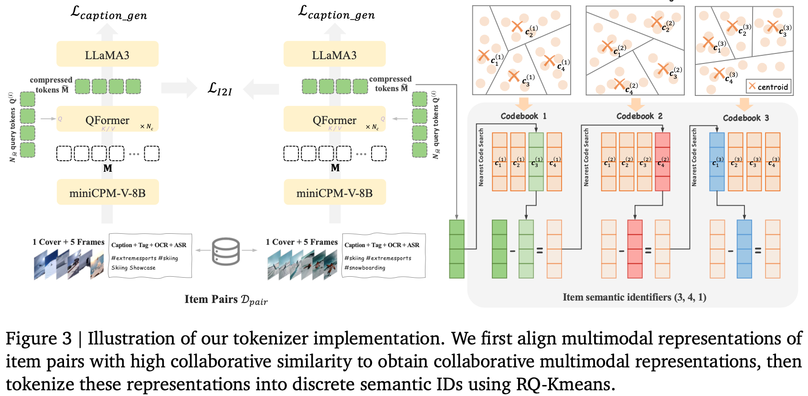

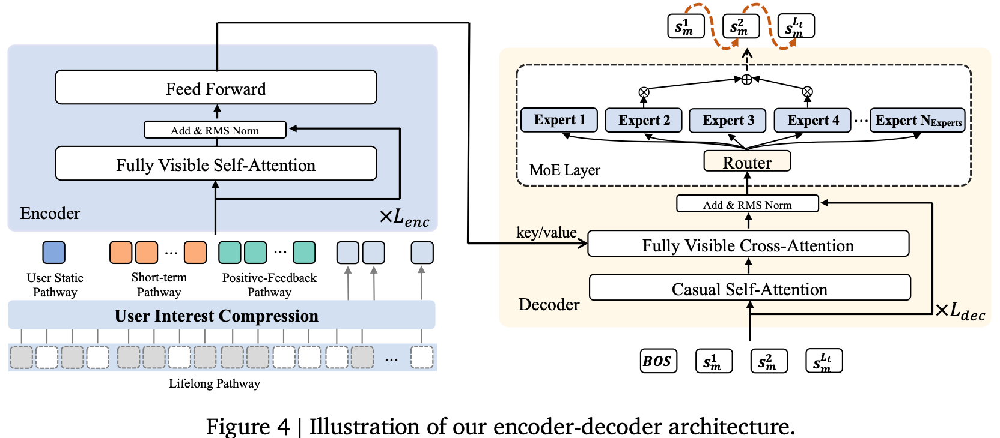

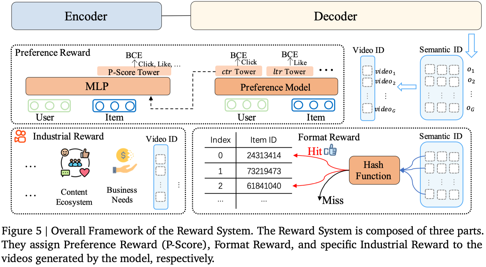

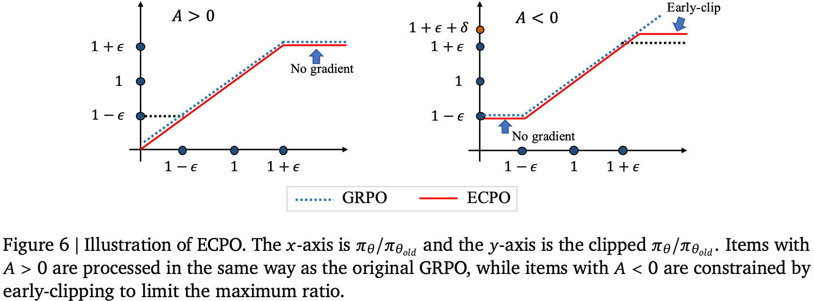

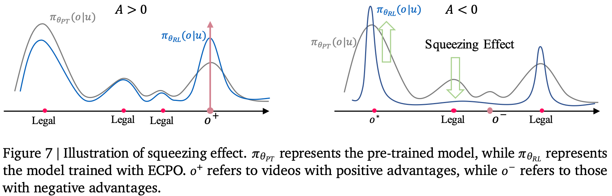

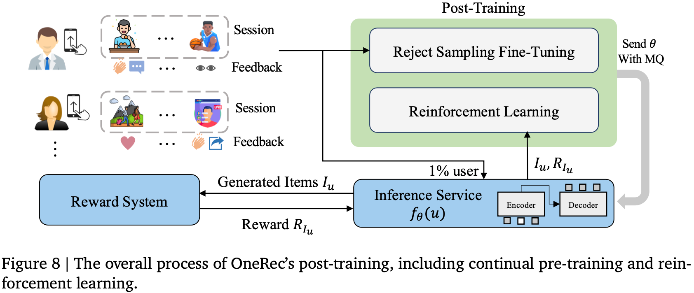

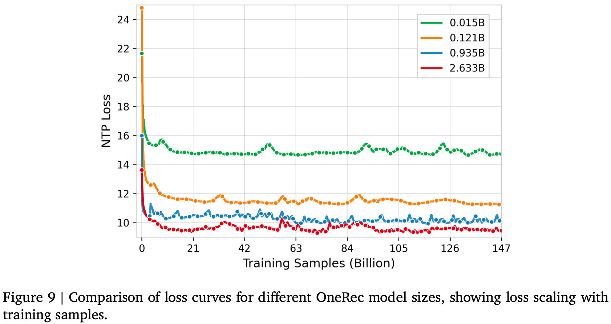

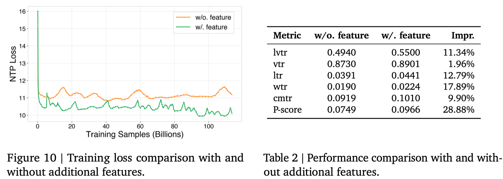

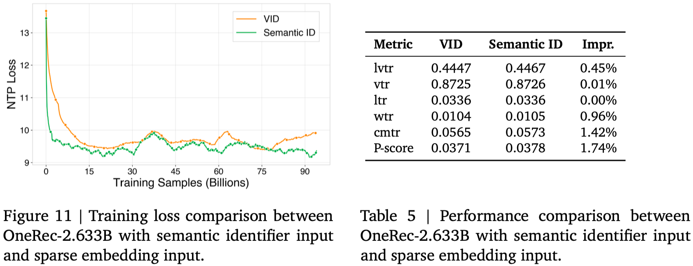

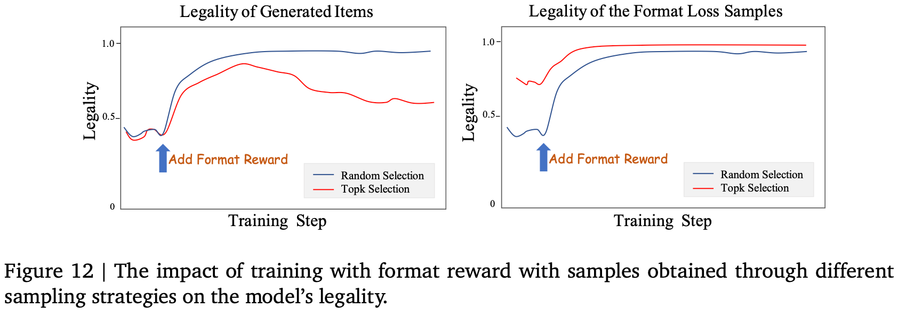

## 摘要

推荐系统多年来已被广泛应用于各种大规模面向用户的平台。过去十年中，推荐技术从传统的基于启发式规则发展到深度学习模型，显著提高了推荐精度。然而，与 AI 社区的快速变化和发展相比，推荐系统近年来未能实现突破。例如，它们仍然依赖多阶段级联架构而非端到端方法，导致计算碎片化和优化不一致性。此外，级联结构阻碍了 AI 社区关键突破技术在推荐场景中的有效应用。

为了解决这些问题，我们提出了 OneRec，它通过端到端生成式方法重塑推荐系统。在这种新架构下，我们取得了有前景的成果。首先，我们将当前推荐模型的计算 FLOPs 提升了 10 倍，并在一定边界内识别出了推荐的缩放定律。其次，以前难以应用于优化推荐的强化学习（RL）技术在此框架中展现出显著潜力。最后，通过基础设施优化，我们在旗舰 GPU 上实现了训练和推理中分别为 23.7% 和 28.8% 的模型 FLOPs 利用率（MFU），与 LLM 社区紧密对齐。该架构显著减少了通信和存储开销，导致运营支出（OPEX）仅为传统推荐管线的 10.6%。部署在快手/快手极速版 APP 中，它处理约 25% 的总每秒查询数（QPS），分别将整体 App 停留时间提升了 0.54% 和 1.24%。此外，我们观察到诸如 7 日生命周期（LT7）等指标显著增加，这是推荐体验的关键指标。我们还提供了来自开发、优化和维护一个具有显著实际影响的生产级推荐系统的实践经验和见解。

## 1. 引言

随着在线服务的快速发展，推荐系统（RS）已成为缓解信息过载和大规模提供个性化内容的基础设施（Ricci 等，2010）。在过去几十年中，推荐系统取得了若干突破性进展——从早期的因子分解机（Rendle，2010）到现代深度学习架构（Cheng 等，2016；Guo 等，2017；Pi 等，2020；Zhou 等，2018）。尽管 RS 研究社区取得了实质性进展，传统推荐模型仍然依赖多阶段级联架构（见图 2 的上半部分）而非端到端方法，这面临若干限制其最优性能的挑战：

**碎片化计算。** 级联架构存在计算效率低下问题。我们以快手为案例对资源分布进行的全面分析表明，服务期间超过 50% 的资源被分配给通信和存储，而非高精度计算。这种对非计算任务的显著资源分配凸显了当前架构的根本性低效。此外，专门用于计算（特别是计算最密集的排序模型）的资源表现出显著的低利用率。具体而言，该模型在旗舰 GPU 上的训练和推理 MFU 分别仅为 4.6% 和 11.2%，这远低于在大型语言模型（LLM）中观察到的效率（H100 上 MFU 约为 40%）（Grattafiori 等，2024；Shoeybi 等，2019）。这种差异凸显了推荐系统中计算任务资源利用的低效。此外，由于高 QPS 要求（大于 400k）和低延迟需求（小于 500ms），推荐模型通常被限制在小规模运行且不进行密集计算。这种操作约束进一步限制了高精度计算的潜力，从而影响了推荐系统的整体性能和可扩展性。

**目标冲突。** 什么是"好的"推荐结果所对应的优化目标并不明确，这导致了以下冲突：
1) **多目标冲突：** 除了常见的优化目标如点击率和观看时长之外，还存在来自用户、创作者和平台生态的竞争性目标（快手中数百个目标）。这些目标在系统的各个阶段进行干预，逐渐削弱系统一致性，并增加复杂性和运维低效。
2) **跨阶段建模冲突：** 即使是对相似目标进行建模，由于不同阶段模型的结构和规模不同，也可能产生冲突。例如，检索阶段的 effectiveness 可能受到排序模型限制的约束，而排序模型又可能受到次优上游结果的影响。这凸显了在推荐系统中需要更加统一的优化目标和模型结构以确保一致性和效率。

**落后于 AI 进化。** 尽管在 LLM 和视觉语言模型（VLM）领域已取得显著进展（例如缩放定律（Henighan 等，2020；Hoffmann 等，2022；Kaplan 等，2020）、强化学习（Ouyang 等，2022；Rafailov 等，2023；Shao 等，2024；Ziegler 等，2019）），现有的级联推荐框架在采用这些成熟技术时存在根本性的架构障碍。这种结构性错位造成了推荐系统与主流 AI 进展之间日益扩大的差距，限制了来自最先进方法的潜在性能提升。

为了解决传统级联推荐架构面临的挑战，我们提出了 OneRec（见图 2 的下半部分），一种新颖的推荐系统，旨在通过将检索和排序过程集成到单阶段编码器-解码器生成框架中，克服级联排序系统的局限性。该方法表现出以下特征：

- **端到端优化：** 该系统设计为既端到端又足够简单，以支持直接优化最终目标。
- **计算效率：** 专注于计算强度，该方法在训练和推理阶段都严格优化计算利用效率，从而充分利用计算能力进步带来的好处。

我们的新框架产生了若干重要发现：

■ 通过广泛的基础设施优化，我们在旗舰 GPU 上实现了训练和推理中分别为 23.7% 和 28.8% 的 MFU——相比原始排序模型分别提升 5.2 倍和 2.6 倍——显著缩小了与 LLM 社区的差距。更重要的是，这种端到端架构大幅减少了不必要的通信和存储开销，导致 OPEX 仅为传统复杂推荐管线的 10.6%。目前，其在快手/快手极速版 APP 主场景中的部署管理约 25% 的总 QPS，在 App 停留时间上带来 0.54% 和 1.24% 的提升，同时改善了所有核心指标——包括用户参与度、视频冷启动和分发平衡——展示了全面的性能提升。

■ 我们将当前推荐模型的计算 FLOPs 提升了 10 倍。通过这个过程，我们识别出了推荐系统的缩放定律。这一发现为如何随着模型规模和计算资源的扩展来优化推荐系统性能提供了宝贵的见解，确保在各种运营环境中的高效和有效部署。

■ 强化学习（RL）技术——之前在传统架构中影响有限——现在在我们的框架内展现出巨大的潜力。我们进行了广泛的离线与在线性能对比实验，并开发了满足实际工业迭代需求的特定应用实践。这些实现使系统能够利用 RL，从而实现改进的适应性和性能。

在本文的其余部分，我们首先详细阐述 OneRec 的架构（第 2 节），详细介绍我们针对短视频的 tokenization 管线、用于用户兴趣建模和压缩的编码器设计，以及用于精确输出生成的可扩展解码器优化；我们还介绍了用于推荐优化的强化学习框架，讨论了采样空间设计、策略和奖励函数对推荐结果的影响，以及来自生产部署的经验性见解。接下来，我们介绍预训练和后训练管线（第 3 节），涵盖训练数据构建、超参数配置和关键实现讨论，然后描述评估框架（第 4 节），包括离线指标系统和在线性能/效率优化。最后，我们总结本工作，讨论 OneRec 的现有局限性，并提出未来研究的潜在方向（第 5 节）。

## 2. 架构

在本节中，我们介绍 OneRec 架构（如图 2 下半部分所示）。该架构首先使用 tokenizer（第 2.1 节）将视频转换为语义 ID，作为模型的预测目标。在训练阶段，编码器-解码器结构（第 2.2 节和第 2.3 节）执行下一个token预测以预测目标item，同时通过奖励系统（第 2.4 节）进行强化学习对齐。在推理阶段，模型首先生成语义 ID，然后将这些token映射回视频推荐，并可选择基于奖励的选择步骤进行进一步优化。

### 2.1. Tokenizer

OneRec 是快手的生成式推荐系统，其十亿级且不断增长的item空间由于计算和架构约束而无法生成原子标识符。为解决这些问题，OneRec 使用精简且固定的词汇表将item token 化为粗到细的语义 ID，从而实现相似item间的知识迁移和对新item更好的泛化（Rajput 等，2024）。然而，先前的解决方案（Rajput 等，2024；Zheng 等，2024）仅从上下文特征生成语义 ID，忽略了协同信号，导致重建质量次优，如第 4.4 节所示。因此，我们的解决方案将协同信号与多模态特征集成，然后利用 RQ-Kmeans（Luo 等，2024）生成更高质量的层次化语义 ID。

#### 2.1.1. 对齐的协同感知多模态表示

我们通过对齐协同相似item对的多模态表示，将多模态内容与协同信号集成，如图 3（左）所示。因此，我们需要准备多模态表示、item对和对齐策略：

• **多模态表示。** 我们为每个视频整合多模态输入：标题、标签、ASR（语音转文本）、OCR（图像转文本）、封面图像以及 5 个均匀采样的帧。这些输入使用 miniCPM-V-8B（Hu 等，2024）处理，生成 $N_M = 1280$ 个token向量 $\mathbf{M} \in \mathbb{R}^{N_M \times d_t}$ （ $d_t = 512$ ）。然后，Querying Transformer（QFormer）（Li 等，2023）使用 $N_{\tilde{M}} = 4$ 个可学习查询token $\mathbf{Q}^{(1)} \in \mathbb{R}^{N_{\tilde{M}} \times d_t}$ 压缩这些token：

$$
\mathbf{Q}^{(i+1)} = \text{CrossAttn}(\mathbf{Q}^{(i)},\mathbf{M},\mathbf{M}), \qquad (1)
$$
$$
\mathbf{Q}^{(i+1)} = \text{FFN}(\text{RMSNorm}(\mathbf{Q}^{(i+1)})),\ \text{for}\ i \in \{1,2,...,N_c\}, \qquad (2)
$$

其中 $\tilde{\mathbf{M}} = \mathbf{Q}^{(N_c+1)} \in \mathbb{R}^{N_{\tilde{M}} \times d_t}$ 表示 $\mathbf{M}$ 的压缩版本， $N_c = 4$ 表示 QFormer 层数。

• **Item 对。** 我们通过以下方式构建高质量item对数据集 $\mathcal{D}_{pair}$ ：1) **用户到 Item 检索：** 对于每个用户，我们取一个正向点击的目标item，并将其与用户最近历史正向点击中最具协同相似性的item配对；2) **Item 到 Item 检索：** 我们将具有高相似性分数（例如 Swing 相似度）的item配对（Yang 等，2020）。

• **Item 到 Item 损失和标题损失。** 我们引入双重训练目标：1) item 到 item 对比损失，对齐协同相似视频对 $(i,j) \in \mathcal{D}_{pair}$ 的表示，捕获行为模式；2) 标题损失，通过使用 LLaMA3（Dubey 等，2024）作为解码器对视频标题进行下一个token预测来防止幻觉，从而保留内容理解能力。

$$
\mathcal{L}_{I2I} = -\frac{1}{|\mathcal{B}|} \sum_{(i,j) \in \mathcal{B}} \log \frac{\exp(\text{sim}(\tilde{\mathbf{M}}_i, \tilde{\mathbf{M}}_j) / \tau)}{\sum_{(i',j^{\prime}) \in \mathcal{B}} \exp(\text{sim}(\tilde{\mathbf{M}}_i, \tilde{\mathbf{M}}_{j'}) / \tau)}, \qquad (3)
$$
$$
\mathcal{L}_{caption\_gen} = -\sum_k \log P(t_{k+1} | [t_1, t_2, \cdots, t_k]), \qquad (4)
$$

其中 $\tau$ 表示温度系数， $\text{sim}(\cdot,\cdot)$ 表示相似度函数， $\mathcal{B}$ 表示一批 $\mathcal{D}_{pair}$ ， $t_k$ 表示第 $k$ 个标题token。

#### 2.1.2. Tokenization

我们利用 RQ-Kmeans（Luo 等，2024）进行 tokenization，它使用残差量化以粗到细的方式生成语义 ID。该方法通过对残差直接应用 K-means 聚类来构建码本。RQ-Kmeans 过程的示意图如图 3（右）所示。

形式上，第 $l=1$ 层的初始残差定义为：

$$
\mathbf{R}^{(1)} = \{\tilde{\mathbf{M}}_i \in \mathbb{R}^{N_{\tilde{M}} \times d_t} | \forall \text{ video } i\}. \qquad (5)
$$

对于每一层 $l$ ，码本 $\mathbf{C}^{(l)}$ 从 $\mathbf{R}^{(l)}$ 的 K-means 质心导出：

$$
\mathbf{C}^{(l)} = \text{K-means}(\mathbf{R}^{(l)}, N_t), \qquad (6)
$$

其中 $\mathbf{C}^{(l)} = \{\mathbf{c}_k^{(l)} \in \mathbb{R}^{N_{\tilde{M}} \times d_t} | k = 1,...,N_t\}$ ， $N_t$ 是码本大小。item $i$ 的最近质心索引计算为：

$$
s_i^l = \arg\min_k \|\mathbf{R}_i^{(l)} - \mathbf{c}_k^{(l)}\|, \qquad (7)
$$

其中 $\|\cdot\|$ 表示欧几里得范数。视频 $i$ 在第 $l+1$ 层的残差随后更新：

$$
\mathbf{R}_i^{(l+1)} = \mathbf{R}_i^{(l)} - \mathbf{c}_{s_i^l}^{(l)}. \qquad (8)
$$

此量化迭代 $L_t = 3$ 层。

如第 4.4 节所示，与广泛使用的 RQ-VAE（Lee 等，2022；Rajput 等，2024）相比，RQ-Kmeans 提供了更优的重建质量、更好的码本利用率和改进的平衡性。在这一阶段，每个视频 $m$ 可以由 $L_t$ 个粗到细的语义标识符表示： $\{s_m^1, s_m^2, ..., s_m^{L_t}\}$ ，这将成为 OneRec 推荐系统的输出，支持渐进式item生成。

### 2.2. 编码器

#### 2.2.1. 多尺度特征工程

本节介绍 OneRec 的特征工程组件。我们通过四个专门的嵌入通路处理用户行为数据，每个通路设计用于捕获不同尺度的用户交互模式：用户静态通路、短期通路、正反馈通路和终身通路。

**用户静态通路** 用户静态通路生成核心用户特征的紧凑表示，包括用户标识符（uid）、年龄（age）、性别（gender）等，然后转换为模型的隐藏维度：

$$
\mathbf{f}_u = [\mathbf{e}_{uid}; \mathbf{e}_{gender}; \mathbf{e}_{age}; \cdots], \qquad (9)
$$
$$
\mathbf{h}_u = \text{Dense}(\text{LeakyReLU}(\text{Dense}(\mathbf{f}_u))). \qquad (10)
$$

其中 $\mathbf{e}_{uid}, \mathbf{e}_{gender}, \mathbf{e}_{age} \in \mathbb{R}^{64}$ ， $\mathbf{h}_u \in \mathbb{R}^{1 \times d_{model}}$ 。

**短期通路** 短期行为通路处理最近（ $L_s = 20$ ）的用户交互，包含视频标识符（可以表示为视频标识符 vid 或语义标识符 sid，如第 2.1.2 节所述，我们将在第 4.2.2 节讨论这两种表示方法）、作者标识符（aid）、标签（tag）、时间戳（ts）、播放时长（playtime）、视频时长（dur）、标签（label，用户与每个视频的交互，包括点赞、关注、转发、不喜欢、评论、进入主页等）。该通路产生捕获即时用户偏好和影响当前行为模式的上下文因素的表示：

$$
\mathbf{f}_s = [\mathbf{e}_{vid}^s; \mathbf{e}_{aid}^s; \mathbf{e}_{tag}^s; \mathbf{e}_{ts}^s; \mathbf{e}_{playtime}^s; \mathbf{e}_{dur}^s; \mathbf{e}_{label}^s], \qquad (11)
$$
$$
\mathbf{h}_s = \text{Dense}(\text{LeakyReLU}(\text{Dense}(\mathbf{f}_s))). \qquad (12)
$$

特征维度组织如下：视频嵌入 $\mathbf{e}_{vid}^s$ 匹配模型维度 $d_{model}$ ，作者嵌入 $\mathbf{e}_{aid}^s$ 使用 512 维度，而所有其余特征使用 128 维度。所有特征跨越 $L_s$ 个序列位置，产生最终表示 $\mathbf{h}_s \in \mathbb{R}^{L_s \times d_{model}}$ 。

**正反馈通路** 正反馈行为通路操作于一个高参与度交互序列（ $L_p = 256$ ）。该通路保持已建立的维度结构：

$$
\mathbf{f}_p = [\mathbf{e}_{vid}^p; \mathbf{e}_{aid}^p; \mathbf{e}_{tag}^p; \mathbf{e}_{ts}^p; \mathbf{e}_{playtime}^p; \mathbf{e}_{dur}^p; \mathbf{e}_{label}^p], \qquad (13)
$$
$$
\mathbf{h}_p = \text{Dense}(\text{LeakyReLU}(\text{Dense}(\mathbf{f}_p))). \qquad (14)
$$

所有特征跨越 $L_p$ 个序列位置，产生最终表示 $\mathbf{h}_p \in \mathbb{R}^{L_p \times d_{model}}$ 。

**终身通路** 终身行为通路设计用于处理超长用户交互历史，序列长度可达 100,000 个视频。直接对此类序列应用注意力机制在计算上不可行。该通路采用受我们先前工作（Si 等，2024）启发的两阶段层次化压缩策略。

**行为压缩** 使用第 2.1.1 节中描述的多模态内容表示，我们对每个用户的交互序列执行层次化 K-means 聚类。为平衡计算效率和模型效果，我们通过将每一步的聚类数设置为 $\lfloor \sqrt[3]{|D|} \rfloor$ 来动态调整聚类数，其中 $|D|$ 是当前数据中的item数。这是一个经验性确定的设置。当当前聚类中的item数不超过预设阈值 $M$ 时，聚类过程终止。终止后，我们选择最接近每个聚类中心的item作为该聚类的代表。

**特征聚合** 对于每个聚类，我们通过区别处理离散和连续属性来构建代表性特征。对于稀疏类别型特征如 vid、aid 和 label，我们直接继承代表视频（即最接近聚类中心的视频）的特征。对于连续特征如 tag、ts、playtime 和 duration，我们计算聚类内所有视频的平均值以捕获集体行为模式。

对于用户的长期历史序列（ $L_l = 2000$ ），每个视频被其对应聚类代表的特征替换：

$$
\mathbf{f}_l = [\mathbf{e}_{vid}^l; \mathbf{e}_{aid}^l; \mathbf{e}_{tag}^l; \mathbf{e}_{ts}^l; \mathbf{e}_{playtime}^l; \mathbf{e}_{dur}^l; \mathbf{e}_{label}^l], \qquad (15)
$$
$$
\mathbf{v}_l = \text{Dense}(\text{LeakyReLU}(\text{Dense}(\mathbf{f}_l))). \qquad (16)
$$

最终表示 $\mathbf{v}_l \in \mathbb{R}^{L_l \times d_{model}}$ 。终身通路通过 QFormer 压缩历史序列，其中可学习的查询向量 $\mathbf{h}_l^{(0)} \in \mathbb{R}^{N_q \times d_{model}}$ （ $N_q = 128$ ）关注已处理的历史特征：

$$
\mathbf{h}_l^{(i+1)} = \text{CrossAttn}(\mathbf{h}_l^{(i)}, \mathbf{v}_l, \mathbf{v}_l), \qquad (17)
$$
$$
\mathbf{h}_l^{(i+1)} = \text{FFN}(\text{RMSNorm}(\mathbf{h}_l^{(i+1)})). \qquad (18)
$$

经过 $N_l = 2$ 个块后，我们获得压缩后的终身特征表示 $\mathbf{h}_l = \mathbf{h}_l^{(N_l)} \in \mathbb{R}^{N_q \times d_{model}}$ 。

#### 2.2.2. 编码器架构

如图 4 所示，OneRec 的编码器架构通过一个统一的基于 Transformer 的框架集成多尺度用户行为表示。编码器将来自四个多尺度通路的输出连接起来，形成综合输入序列：

$$
\mathbf{z}^{(1)} = [\mathbf{h}_u; \mathbf{h}_s; \mathbf{h}_p; \mathbf{h}_l] + \mathbf{e}_{pos}, \qquad (19)
$$

其中 $\mathbf{e}_{pos} \in \mathbb{R}^{(1+L_s+L_p+N_q) \times d_{model}}$ 表示可学习的位置嵌入。集成的表示通过 $L_{enc}$ 个 Transformer 编码器层处理，每层由全可见自注意力机制和带 RMS 归一化的前馈网络组成：

$$
\mathbf{z}^{(i+1)} = \mathbf{z}^{(i)} + \text{SelfAttn}(\text{RMSNorm}(\mathbf{z}^{(i)})), \qquad (20)
$$
$$
\mathbf{z}^{(i+1)} = \mathbf{z}^{(i+1)} + \text{FFN}(\text{RMSNorm}(\mathbf{z}^{(i+1)})). \qquad (21)
$$

最终的编码器输出 $\mathbf{z}_{enc} = \mathbf{z}^{(L_{enc}+1)} \in \mathbb{R}^{(1+L_s+L_p+N_q) \times d_{model}}$ 提供了整体的多尺度用户行为表示，作为后续推荐生成的基础。

### 2.3. 解码器

OneRec 在解码阶段采用逐点生成范式。对于每个目标视频 $m$ ，解码器输入序列通过连接一个可学习的序列开始token与视频的语义标识符构建：

$$
\mathcal{S}_m = \{s_{[BOS]}, s_m^1, s_m^2, \cdots, s_m^{L_t}\}, \qquad (22)
$$
$$
\mathbf{d}_m^{(0)} = \text{Emb\_lookup}(\mathcal{S}_m). \qquad (23)
$$

解码器通过 $L_{dec}$ 个 Transformer 层处理此序列。每层执行顺序操作：

$$
\mathbf{d}_m^{(i+1)} = \mathbf{d}_m^{(i)} + \text{CausalSelfAttn}(\mathbf{d}_m^{(i)}), \qquad (24)
$$
$$
\mathbf{d}_m^{(i+1)} = \mathbf{d}_m^{(i+1)} + \text{CrossAttn}(\mathbf{d}_m^{(i+1)}, \mathbf{z}_{enc}, \mathbf{z}_{enc}), \qquad (25)
$$
$$
\mathbf{d}_m^{(i+1)} = \mathbf{d}_m^{(i+1)} + \text{MoE}(\text{RMSNorm}(\mathbf{d}_m^{(i+1)})). \qquad (26)
$$

每个解码器层包含一个混合专家（MoE）前馈网络，以在保持计算效率的同时增强模型容量。MoE 层采用 $N_{experts}$ 个专家网络，使用 top- $k$ 路由策略：

$$
\text{MoE}(\mathbf{x}) = \sum_{j=1}^k \text{Gate}_j(\mathbf{x}) \cdot \text{Expert}_j(\mathbf{x}), \qquad (27)
$$

其中 $\text{Gate}_j(\mathbf{x})$ 表示由路由机制确定的门控权重， $\text{Expert}_j(\mathbf{x})$ 表示第 $j$ 个选中的专家网络的输出。为确保平衡的专家利用率而不引入干扰梯度，我们按照（Liu 等，2024）实现了无损负载均衡策略。

该模型使用交叉熵损失进行目标视频 $m$ 的语义标识符上的下一个token预测：

$$
\mathcal{L}_{NTP} = -\sum_{j=0}^{L_t-1} \log P(s_m^{j+1} | [s_{[BOS]}, s_m^1, s_m^2, \cdots, s_m^j]). \qquad (28)
$$

### 2.4. 奖励系统

预训练模型仅通过下一个token预测来拟合曝光item空间的分布，而曝光item来自过去的传统推荐系统。这导致模型无法突破传统推荐的天花板。为解决此问题，我们引入基于奖励系统的偏好对齐，使用在策略强化学习在生成的item空间中训练模型。通过奖励，模型感知更细粒度的偏好信息。我们引入偏好奖励以对齐用户偏好、格式奖励以确保生成格式尽可能合法，以及特定工业奖励以对齐某些特殊工业场景需求。

#### 2.4.1. 用户偏好对齐

在推荐系统中，定义"好的推荐"比确定数学解的正确性要困难得多。传统方法（Chang 等，2023；Wang 等，2024）通常定义多个目标，如点击、点赞、评论和观看时长，然后通过对每个目标的预测值（xtr）进行加权融合来组合成一个分数。然而，手动调整这些融合权重具有挑战性，不仅缺乏准确性还缺乏个性化，且经常导致目标之间的优化冲突。

为解决这些限制，我们提出使用神经网络来学习个性化的融合分数，称为 P-Score（偏好分数）（Cao 等，2025）。该模型的整体框架如图 5（中）所示。模型的底层架构基于搜索兴趣模型（SIM）（Pi 等，2020）。它包括多个塔，每个塔专门学习特定目标。在训练期间，这些塔使用相应的目标标签作为辅助任务计算二元交叉熵（BCE）损失。每个塔的隐藏状态以及用户和item表示被输入到最后一层的多层感知器（MLP）。该 MLP 后接一个输出 P-Score 的单塔，使用所有目标的标签计算二元交叉熵损失。该损失可以形式化表示如下：

$$
\mathcal{L}_{P\text{-}Score} = \sum_{xtr \in S_o} w_{xtr} \mathcal{L}_{P\text{-}Score}^{xtr}, \qquad (29)
$$
$$
\mathcal{L}_{P\text{-}Score}^{xtr} = -(y_{xtr} \log p + (1 - y_{xtr}) \log(1 - p)), \qquad (30)
$$
$$
S_o = \{ctr, lvtr, ltr, vtr, ...\}. \qquad (31)
$$

我们调整 $w_{xtr}$ 的值使 P-Score 偏向各个目标，最终实现所有目标 AUC 的提升。该方法允许模型接收特定用户信息并适当地调整该用户的偏好分数，而不损害其他用户的体验。与之前不加区分的加权求和相比，该方法更容易实现帕累托优化。因此，我们使用此方法获得的 P-Score 作为偏好对齐的奖励。

**早期裁剪 GRPO** 在本节中，我们介绍如何使用偏好分数来对齐用户偏好。我们使用 ECPO（早期裁剪 GRPO）进行优化。具体而言，对于用户 $u$ ，我们使用旧策略模型生成 $G$ 个item。每个item与用户一起输入偏好奖励模型以获得 P-Score 作为奖励 $r_i$ 。优化目标如下：

$$
J_{ECPO}(\theta) = \mathbb{E}_{u \sim P(U), \{o_i\}_{i=1}^G \sim \pi_{\theta_{old}}} \left[ \frac{1}{G} \sum_{i=1}^G \min\left( \frac{\pi_\theta(o_i|u)}{\pi_{\theta_{old}}(o_i|u)} A_i, \text{clip}\left( \frac{\pi_\theta(o_i|u)}{\pi_{\theta_{old}}(o_i|u)}, 1-\epsilon, 1+\epsilon \right) A_i \right) \right], \qquad (32)
$$
$$
A_i = \frac{r_i - \text{mean}(\{r_1, r_2, ..., r_G\})}{\text{std}(\{r_1, r_2, ..., r_G\})}, \qquad (33)
$$
$$
\pi_{\theta_{old}}(o_i|u) = \max\left( \frac{\text{sg}(\pi_\theta(o_i|u))}{1 + \epsilon + \delta}, \pi_{\theta_{old}}(o_i|u) \right), \ \delta > 0, \qquad (34)
$$

其中 sg 表示停止梯度操作， $\delta$ 是大于 0 的超参数。

我们对 GRPO（组策略相对优化）（Liu 等，2024）进行了修改，使其训练过程更加稳定。图示见图 6。在原始 GRPO 中，对于负优势允许较大的策略比率（ $\pi_\theta / \pi_{\theta_{old}}$ ），这很容易导致梯度爆炸。因此，我们预先裁剪具有大比率的策略以确保训练稳定性，同时仍然允许相应的负优势发挥作用。 $\delta$ 越大，可容忍的策略比率越大，这意味着可容忍的梯度越大。这可以根据实际需求确定。在 OneRec 中，我们将 $\delta$ 设置为 0.1，这表明具有负优势的策略比率被允许略微超过 $1+\epsilon$ 。我们移除了 KL 散度损失，因为在 OneRec 中强化学习（RL）和监督微调（SFT）一起训练，SFT 损失确保了模型的稳定性。

#### 2.4.2. 生成格式正则化

在生成式推荐中，合法性比率是指生成的语义 ID 序列中能够映射到实际 item ID 的比例。该指标对于评估生成的稳定性至关重要。在实践中，语义 ID 序列的基数 $N_t^{L_t}$ 远大于视频的基数。这确保了所有item都被覆盖，而更大的词汇表引入更多参数，从而带来更好的性能。然而，这也可能导致在推理过程中生成没有对应 item ID 的语义 ID 序列，即非法生成。

引入带有 ECPO 的强化学习显著增加了非法输出的产生。近期工作（Ren 和 Sutherland，2024）表明这是由于负优势引起的挤压效应。如图 7 所示，预训练模型已学会生成大多数合法token。加入 RL 后，具有 $A > 0$ 的item仅略微调整分布。当应用具有 $A < 0$ 的item时，模型的概率分布将大部分概率质量压缩到其当前认为的最优输出 $o^*$ 中。这导致一些合法token的概率被挤压到与非法token相当的水平，使模型难以区分合法token。

为解决此问题，我们建议在强化学习中引入格式奖励以鼓励模型的合法生成。具体而言，我们从 $G$ 个样本中随机选择 $K$ 个样本进行合法性强化学习。对于合法样本，我们将优势设置为 1，对于非法样本，我们直接丢弃它们以避免挤压效应。

$$
A_i = \begin{cases} 1 & \text{if } o_i \in \mathcal{I}_{legal} \\ 0 & \text{if } o_i \notin \mathcal{I}_{legal} \end{cases} \qquad (35)
$$

优化目标的公式与 ECPO（公式 32）相同，我们直接使用 $A_i$ 作为优势。

#### 2.4.3. 工业场景对齐

在工业场景中，推荐系统不仅需要考虑用户偏好，还需要考虑其他各个方面。例如，在快手，视频社区的生态系统、商业化需求以及冷启动和长尾视频的投放。传统推荐系统试图通过在推荐管线的一个阶段应用算法或策略来解决这些问题。由于不同阶段之间的不一致性，这容易导致意外问题交替出现的反复循环。工程师被迫通过打补丁不断进行调整，导致系统随时间变得臃肿，阻碍迭代。

在 OneRec 中，我们只需将优化目标纳入奖励系统，并采用强化学习进行针对性优化。这种方法不仅方便，而且可以实现端到端的实施，保持系统一致性。我们将在第 4.3.3 节提供一个优化实践示例。

## 3. 训练框架

### 3.1. 训练基础设施

在本节中，我们描述支持 OneRec 大规模预训练的硬件和基础设施，并介绍若干提升训练效率的优化。

**计算。** 我们使用 90 台服务器进行训练，每台配备 8 块旗舰 GPU 和 2 个 CPU，通过 400Gbps NVLink 互联以确保高速节点内带宽。

**网络。** 节点内通信由高效的 NVLink 网络管理，节点间通信由 400Gbps RDMA 支持训练流量，100Gbps TCP 支持训练数据和嵌入预取操作。

**存储。** 每台服务器配备 4 块 NVMe SSD 以加速检查点写入，允许将大规模嵌入参数和稠密参数存储在 HDFS 中，且具有最小的容错停机时间。

**训练加速。** 针对训练加速，实现了若干核心优化：
1) **嵌入加速：** 为管理超出 CPU 能力范围的大量嵌入工作负载，我们利用快手的 SKAI 框架进行基于 GPU 的参数服务器。该框架利用跨 GPU 统一嵌入表、GPU 缓存范式和预取管线来提升训练效率并降低管理开销。
2) **训练并行：** 结合使用数据并行、ZERO1（Rajbhandari 等，2020）和梯度累积进行模型训练。选择 ZERO1 是因为当前模型的稠密参数可以加载到单个 GPU 上，在交错多个宏批次时最小化数据并行组中的同步开销。
3) **混合精度训练：** 在某些 MLP 网络的计算中使用 BFloat16 以优化性能。
4) **编译优化：** 对注意力网络应用编译优化以减少计算开销。

得益于高度优化的训练基础设施的进步，模型的训练 MFU 已提升至 23.7%，显著缩小了与 LLM 训练效率的差距。

### 3.2. 预训练

**预训练数据** 如第 2.2.1 节所述，我们的模型以多尺度用户行为表示作为输入。预训练目标涉及预测用户的目标item序列。每个训练样本包含一个目标item，该item被 token 化为 3 个语义标识符。这种 tokenization 方案为生成模型的下一个token预测任务产生每个训练样本 3 个目标token。我们的训练管线每天处理约 180 亿个样本，产生每天 540 亿个token的吞吐量。OneRec-0.935B 模型（详见表 1）在训练约 1000 亿个样本后达到收敛，对应预训练期间总计 3000 亿个token的曝光量。

**关键超参数** OneRec 系列包括四种模型（两种稠密和两种 MoE 变体），专为推荐任务设计。关键架构超参数如层数、隐藏维度和注意力头数详见表 1。在这些模型中，编码器和解码器具有相同的层数。对于稠密变体，标准前馈网络（FFN）通常将隐藏维度 $d_{ff}$ 扩展为 $2 \times d_{model}$ 。对于 MoE 变体，我们在指定块中用 MoE 层替换标准 FFN，并使用 SwiGLU FFN（Shazeer，2020；Thoppilan 等，2022）作为专家。与开源 MoE LLM 设置一致（Fedus 等，2022；Jiang 等，2024），每个 SwiGLU 专家的隐藏维度计算为 $\frac{2}{3} \times 4 \times d_{model}$ ，确保其为 128 的倍数。

每个模型的收敛曲线可在第 4.2.1 节中找到。

### 3.3. 后训练

在后训练阶段，我们使用实时数据流进行在线训练。我们同时执行拒绝采样微调（RSFT）和强化学习（RL）。对于 RSFT，我们根据播放时长过滤掉底部 50% 的曝光会话。训练损失与预训练过程中的 $\mathcal{L}_{NTP}$ 损失相同，但我们通过将稀疏参数的学习率降低到 $1 \times 10^{-4}$ 、稠密参数降低到 $8 \times 10^{-5}$ 来应用退火。对于 RL，我们随机选择 RSFT 数据中 1% 的用户来生成 RL 样本。

为最大化计算资源利用率，我们通过使用外部推理服务将 RL 样本的生成与训练过程解耦。在训练期间，1% 的用户访问外部服务生成 512 个item，向奖励模型请求每个item的奖励，然后将数据返回给训练任务。训练任务每 1000 步通过消息队列（MQ）将更新后的参数发送到外部推理服务。整个后训练过程总结在图 8 中。

## 4. 评估

### 4.1. 评估指标

我们通过以下指标评估模型性能：

• **交叉熵损失：** 下一个token预测损失 $\mathcal{L}_{NTP}$ 曲线。
• **P（偏好）-Score：** 学习到的综合评估指标，详见第 2.4.1 节。
• **Xtr 指标：** 一组来自当前部署在我们系统中的预训练排序模型（Chang 等，2023；Wang 等，2024）的用户参与度指标，包括：
  - lvtr（长观看通过率）：显著视频观看的预测概率
  - vtr（观看通过率）：视频观看的预测概率
  - ltr（点赞通过率）：视频点赞的预测概率
  - wtr（关注通过率）：关注创作者的预测概率
  - cmtr（评论通过率）：视频评论的预测概率

对于 P-Score 和 xtr 奖励指标，我们的评估系统在流式数据上运行，其值在不同时期可能有所变化。因此，由于数据流的时间变化，相同的指标在不同实验中可能显示不同的绝对值。然而，我们通过在同一时期内进行比较实验并在足够长的观察窗口上取平均值来确保可靠的评估，使我们的发现在统计上具有可信度。

### 4.2. 缩放

#### 4.2.1. 训练缩放

**参数缩放** OneRec 系列包括不同大小的模型：OneRec-0.015B、OneRec-0.121B、OneRec-0.935B 和 OneRec-2.633B，详见表 1。我们研究了模型参数数量对性能的影响。图 9 展示了这些模型的损失曲线，显示出清晰的缩放趋势：随着训练的进行，更大的模型实现了更低的损失。这表明随着模型规模增大，性能提升具有强大能力。

关于训练数据量的影响，我们的实验表明性能在大约最初的 100 亿个样本内快速收敛。虽然在此之后改进速率显著降低，但性能并未完全停滞，而是继续从更多数据（即超过 1000 亿个样本）中受益，尽管速度较慢。这表明虽然在训练早期取得了实质性收益，但更大的数据集可以实现进一步、更渐进的改进。

随着模型参数规模的扩大，专家之间的负载均衡成为关键问题。不均匀的专家利用率可能导致训练效率低下和次优性能。我们采用 DeepSeek 的无损负载均衡策略（Liu 等，2024），该策略在不引入额外损失项的情况下保持专家利用率的平衡。通过该策略，我们观察到损失降低 0.2，证明了其在改善缩放后 OneRec 模型收敛方面的有效性。

除参数缩放外，我们使用 0.935B 模型进行了额外实验，以验证在其他关键维度上缩放的有效性。这些实验包括特征缩放（研究综合特征工程的影响）、码本缩放（研究词汇表大小扩展的影响）和推理缩放（分析束搜索参数的影响）。每个维度都展示了不同的缩放行为，并为未来的模型优化提供了宝贵的见解。

**特征缩放** 为研究特征工程对模型性能的影响，我们比较了两种输入配置下的模型：仅使用来自 256 个正反馈item的 item ID vid 嵌入的基线版本，以及包含我们方法中描述的综合特征集的增强版本。如图 10 和表 2 所示，带额外特征的增强模型实现了更低的训练损失和在推荐质量多个维度上的实质性提升。

| 指标 | 无特征 | 有特征 | 提升 |
|------|--------|--------|------|
| lvtr | 0.4940 | 0.5500 | 11.34% |
| vtr | 0.8730 | 0.8901 | 1.96% |
| ltr | 0.0391 | 0.0441 | 12.79% |
| wtr | 0.0190 | 0.0224 | 17.89% |
| cmtr | 0.0919 | 0.1010 | 9.90% |
| P-score | 0.0749 | 0.0966 | 28.88% |

**码本缩放** 为研究码本大小对模型性能的影响，我们通过将码本从 8,192 扩展到 32,768 进行实验。需要注意的是，参数缩放实验中定义的 NTP 损失不能直接用于此处比较。这是因为码本大小的增加固有地扩大了交叉熵损失计算的候选集，使直接损失比较具有误导性。因此，我们使用基于奖励的指标来评估性能。各指标的性能提升如表 3 所示。结果表明，增加码本大小在播放时长指标上带来了显著提升，在交互指标上略有增益。

| 指标 | 大小=8K | 大小=32K | 提升 |
|------|---------|----------|------|
| lvtr | 0.5118 | 0.5245 | 2.48% |
| vtr | 0.9384 | 0.9491 | 1.14% |
| ltr | 0.0298 | 0.0299 | 0.34% |
| wtr | 0.0153 | 0.0154 | 0.65% |
| cmtr | 0.0650 | 0.0664 | 2.15% |
| P-score | 0.2516 | 0.2635 | 4.75% |

**推理缩放** 我们研究了推理中不同生成item数量（Pass@K）对模型性能的影响。详见表 4，将 Pass@K 的 K 从 8 增加到 512 导致所有评估指标的持续性能提升。然而，将 K 从 512 进一步增加到 1,024 仅带来边际增益。考虑性能改进与相关计算资源消耗之间的权衡，我们在生产环境中选择 K=512 进行部署。

| 指标 | Pass@8 | Pass@64 | Pass@512 | Pass@1024 | 提升 |
|------|--------|---------|----------|-----------|------|
| lvtr | 0.3675 | 0.4927 | 0.5351 | 0.5443 | 48.11% |
| vtr | 0.9444 | 0.9462 | 0.9513 | 0.9530 | 0.91% |
| ltr | 0.0278 | 0.0346 | 0.0425 | 0.0452 | 62.59% |
| wtr | 0.0114 | 0.0138 | 0.0182 | 0.0197 | 72.81% |
| cmtr | 0.0350 | 0.0566 | 0.0809 | 0.0891 | 154.57% |
| P-score | 0.0811 | 0.2051 | 0.3375 | 0.3859 | 376.10% |

#### 4.2.2. 语义标识符输入表示

随着模型规模扩展到数十亿参数，我们探索了一种替代输入表示策略，即利用视频语义标识符用于用户交互历史，而不是为视频标识符（vid）构建单独的稀疏嵌入。这种语义标识符输入实现了与传统稀疏嵌入方法可比的性能，同时在参数效率、通信开销和序列处理能力方面提供了显著优势，使其在进一步缩放探索中特别有前景。

**缩放性能分析** 如图 11 所示，我们的经验分析表明，在较大规模（2.6B 参数）下，语义标识符输入方法实现了与传统稀疏嵌入方法可比或更优的性能。

| 指标 | VID | Semantic ID | 提升 |
|------|-----|-------------|------|
| lvtr | 0.4447 | 0.4467 | 0.45% |
| vtr | 0.8725 | 0.8726 | 0.01% |
| ltr | 0.0336 | 0.0336 | 0.00% |
| wtr | 0.0104 | 0.0105 | 0.96% |
| cmtr | 0.0565 | 0.0573 | 1.42% |
| P-score | 0.0371 | 0.0378 | 1.74% |

**优势与未来缩放** 语义标识符方法相比传统稀疏嵌入方法提供了若干关键优势，使其在进一步缩放探索中特别有吸引力：

• **参数效率：** 通过在输入和输出表示之间共享嵌入，模型消除了对 vid 单独稀疏嵌入表的需求。这大幅减少了总参数数量，特别是对于拥有数十亿item的快手。
• **通信效率：** 在分布式训练环境中，稀疏嵌入操作需要大量参数服务器通信用于嵌入查找和梯度更新。语义标识符方法通过利用稠密操作和共享词汇表减少通信开销，从而带来更快的训练吞吐量和减少的通信瓶颈。
• **扩展序列容量：** 消除大型稀疏嵌入表使计算资源能够用于处理更长的用户交互序列。这使得模型能够捕获更全面的用户偏好演化模式，有可能将序列长度从数千扩展到数万次交互。
• **表示一致性：** 在输入和输出之间共享相同的语义空间确保表示一致性，并使模型能够学习更一致的 item 到 item 关系。这种统一表示具有促进不同推荐场景间更好泛化的潜力。

鉴于这些引人注目的优势以及在 2.6B 参数规模下展示的竞争性能，我们正在积极追求基于语义标识符输入表示的进一步缩放探索。这种方法有望在保持计算效率和架构优雅性的同时，为大规模推荐系统开启新的可能性。

### 4.3. 强化学习

#### 4.3.1. 用户偏好对齐

定义什么是"好的"推荐一直是一项具有挑战性的任务。为严格验证 RL 的影响，我们使用单目标 vtr（观看通过率）作为奖励，它对应于在线指标如观看时长和 App 停留时间。报告的在线结果是相对于快手传统推荐系统（称为总体基线）的相对改进。表中的相对提升表示后一组相对于前一组的相对增强。

值得注意的是，虽然使用 vtr 作为奖励可以显著改善时长指标，但这并不一定表示高质量的推荐，因为其他指标，如视频观看量（代表观看的视频数量），可能会显著下降。我们主要关注观看时长和 App 停留时间以寻找最优 RL 设置，并最终用它来验证 P-Score 奖励的收益。

**采样效率** 强化学习优化采样item的概率分布，以增加选择高奖励item的可能性，从而显著提升采样效率。为量化这一效果，我们在 pass@32、pass@128 和 pass@512 下进行多点采样实验，结果总结在表 6 中。以不带 RL 的模型作为基线，我们将 App 停留时间的改进定义为采样效率差距。值得注意的是，RL 在 pass@32 处显示出最显著的改进差距，表明顶部item的准确性显著提升。这一改进对于减少采样开销至关重要，因为它确保在采样少量item时的高精度。在推荐系统中，平衡成本和收益至关重要，较低样本数 $K$ 下增强的准确性为实现这种平衡提供了坚实基础。

| 方法 | vtr | 观看时长 | App 停留时间 | 视频观看量 |
|------|-----|----------|--------------|------------|
| OneRec w/o RL | 0.1978 | +1.62% | -0.10% | -4.18% |
| Pass@32 OneRec w/ RL | 0.2138 | +3.17% | +0.39% | -9.87% |
| 相对提升 | +8.08% | +1.55% | +0.49% $\uparrow
$$
\uparrow
$$
\uparrow$ | -3.69% |
| OneRec w/o RL | 0.2239 | +4.61% | +1.11% | -12.75% |
| Pass@128 OneRec w/ RL | 0.2387 | +5.22% | +1.49% | -15.06% |
| 相对提升 | +6.61% | +1.53% | +0.38% $\uparrow
$$
\uparrow$ | -2.65% |
| OneRec w/o RL | 0.2444 | +6.32% | +1.66% | -15.54% |
| Pass@512 OneRec w/ RL | 0.2494 | +5.88% | +1.75% | -13.88% |
| 相对提升 | +2.05% | -0.41% | +0.09%$\uparrow$ | +1.97% |

**搜索空间** 在 ECPO 训练中，扩展动作搜索空间增加了发现具有最大奖励的最优item的可能性，尽管计算成本更高。为研究这种权衡，我们考察搜索空间大小（即组大小）如何影响性能。pass@128 的结果总结在表 7 中。从表 7 中，我们观察到当组大小从 128 增加到 512 时，性能显著提升。这清楚地证明了扩展搜索空间的积极影响。令人稍感失望的是，将搜索空间扩展到 2048 并没有带来太多额外收益，这可能是因为当前参考模型的多样性不足以发现更多更好的item。尽管如此，这一发现是有前景的，我们根据经验建议将 ECPO 训练组大小设置为推理输出数量的约四倍以获得最优结果。

| 组大小 | vtr | 观看时长 | App 停留时间 | 视频观看量 |
|--------|-----|----------|--------------|------------|
| 0(w/o RL) | 0.2198 | +4.61% | +1.11% | -12.75% |
| 128 | 0.2303 | +5.22% | +1.49% | -15.06% |
| 512 | 0.2350 | +5.73% | +1.82% | -15.49% |
| 2048 | 0.2352 | +5.84% | +1.78% | -15.49% |

**搜索策略** 大型语言模型的强化学习通常采用 top-$k$ 和 top-$p$ 采样进行样本生成。在 OneRec 中，我们也探索了束搜索作为替代策略。表 8 比较了这两种方法的结果，显示在 OneRec 的强化学习框架中，束搜索显著优于 top-$k$ 和 top-$p$ 采样。这种改进源于语义 ID 结构的固有规律性，它遵循前缀树编码方案，因此与束搜索的系统性探索很好地契合。

| | vtr | 观看时长 | App 停留时间 | 视频观看量 |
|------|-----|----------|--------------|------------|
| Top-$k$+Top-$p$ | 0.2131 | +4.45% | +1.16% | -13.61% |
| 束搜索 | 0.2162 | +5.35% | +1.76% | -13.30% |
| 相对提升 | +1.45% | +0.87% | +0.60% | +0.36% |

**参考模型** 在本节中，我们比较了 ECPO 中用于策略生成的两种参考模型：(1) 预训练模型（离策略）和 (2) 当前策略模型（在策略）。实验结果总结在表 9 中。从表中可以明显看出，使用当前策略模型产生了更好的结果，特别是在离线奖励评估中。这表明在策略方法允许模型不断自我教学，突破参考模型的限制，达到更高的上限。然而，在在线性能方面，在策略方法的改进并不非常显著。这是由于奖励的定义次优，导致轻微的奖励破解。我们将这一方面作为未来工作的关键方向。

| 参考模型 | vtr | 观看时长 | App 停留时间 | 视频观看量 |
|-----------|-----|----------|--------------|------------|
| 预训练模型 | 0.2262 | +5.35% | +1.51% | -13.51% |
| 当前策略模型 | 0.2389 | +6.19% | +1.56% | -13.89% |
| 相对提升 | +5.61% | +0.79% | +0.04% | -13.89% |

**P-Score 奖励** 在本节中，我们观察使用 P-Score 作为奖励时通过强化学习实现的综合改进。基于上述消融实验的结论，我们选择了最优 RL 设置，即使用束搜索进行 RL 样本生成并采用当前策略模型作为参考模型。我们在两个场景（包括快手和快手极速版）中考察了 RL 的影响，结果总结在表 1 中。从表中我们可以得出结论，在两个场景中，P-Score 显著提升了 App 停留时间和观看时长，同时增加了视频观看量，表明整体用户推荐体验的提升。

| 场景 | 观看时长 | App 停留时间 | 视频观看量 |
|------|----------|--------------|------------|
| 快手 | +0.21% | +0.26% | +0.17% |
| 快手极速版 | +0.71% | +0.22% | +0.35% |

#### 4.3.2. 生成格式正则化

在本节中，我们进行实验以验证格式奖励的有效性。如第 2.4.2 节所述，在预训练模型中引入强化学习后，由于挤压效应，模型输出的合法性显著下降到 50% 以下。这意味着超过一半的生成语义 ID 不对应于实际的视频 ID，这对推荐的稳定性和推理的可扩展性有害。我们通过比较两种用于计算格式损失的样本选择方法来评估格式奖励的影响：(1) 从 128 个生成候选中选择概率最高的 top-5 样本，(2) 随机选择 5 个样本。

图 12 展示了它们对输出合法性的影响。左图显示了全部 128 个生成样本的合法性率，右图聚焦于选中的样本。没有格式奖励时，基线合法性保持在 50% 以下。Top-k 选择方法产生了一种有趣的模式：虽然整体合法性先升后降，但选中的样本迅速达到 100% 的合法性，表明模型学会了仅在 top 排名的子集中生成合法输出。相比之下，随机选择呈现了更具挑战性的学习目标，但推动了稳定的改进——最终达到 95% 的合法性且没有出现下降。

值得注意的是，格式奖励的集成带来了超越合法性本身的收益。在线指标显示出实质性增益：App 停留时间 +0.13%，观看时长 +0.30%。这一实验案例不仅验证了格式奖励机制，还突出了在强化学习系统中仔细设计奖励的关键作用。

#### 4.3.3. 工业场景对齐

在本节中，我们展示了一个使用强化学习应对工业挑战的实际示例。在快手平台上，病毒式内容农场占据了内容创作者的很大一部分，主要生产质量不一的搬运和剪辑视频。虽然 OneRec 在多个业务指标上展示了优于传统推荐系统的性能，但我们观察到，如果没有适当的后过滤策略，病毒式内容的曝光比例会显著增加，这可能对平台生态系统产生负面影响。

病毒式内容视频的最优比例可以设置为 $f$。当比例超过 $f$ 时，我们降低其 P-score 奖励以抑制它们，同时保持系统对这些内容质量的感知。

$$
r_i' = \begin{cases} r_i & \text{if } o_i \notin \mathcal{I}_{viral} \\ \alpha r_i & \text{if } o_i \in \mathcal{I}_{viral} \end{cases}, \qquad (36)
$  $

其中 $ \alpha \in (0,1) $ 是抑制因子。

我们将这种方法称为特定工业奖励（SIR）。实验结果表明，SIR 有效减少了 9.59% 的病毒式内容曝光，同时在核心指标（观看时长和 App 停留时间）上保持稳定性能。这一实验突出了 OneRec 的关键优势：通过强化学习的奖励塑造能力实现精确且一致的优化，这是传统推荐系统根本上无法实现的功能。

### 4.4. Tokenizer

我们采用三个指标来全面评估我们的 tokenization 方法，涵盖准确性、资源利用率和分布均匀性：

• **重建损失：** 该指标评估离散token重建原始输入的准确性，作为模型保持输入数据保真度的指标。
• **码本利用率**（Zhu 等，2024）：该指标评估码本内向量使用的效率，反映模型利用可用资源表示数据的有效程度。
• **Token 分布熵**（Bentz 和 Alikaniotis，2016）：利用香农熵，该指标量化token分布的均匀性，提供对模型中token分配多样性和平衡性的洞察。

| | RQ-VAE | RQ-Kmeans |
|--------|--------|-----------|
| 重建损失$ \downarrow $ | 0.0548 | 0.0410 |
| 码本利用率$ \uparrow $ 第1层 | 1.0000 | 1.0000 |
| 码本利用率$ \uparrow $ 第2层 | 0.9963 | 1.0000 |
| 码本利用率$ \uparrow $ 第3层 | 0.9958 | 1.0000 |
| Token分布熵$ \uparrow $ 第1层 | 8.3892 | 8.9191 |
| Token分布熵$ \uparrow $ 第2层 | 8.4805 | 8.7770 |
| Token分布熵$ \uparrow $ 第3层 | 8.6037 | 8.7276 |

如表 11 所示，与 RQ-VAE 相比，RQ-Kmeans 的重建损失降低了 25.18%，展示了在保持输入信息方面的卓越准确性。同时，RQ-Kmeans 在所有三层都实现了完美的利用率（1.0000），表明码本中的最优资源效率，而 RQ-VAE 在第 2 层和第 3 层显示出略低的利用率。此外，RQ-Kmeans 在所有三层的熵值均高于 RQ-VAE，在第 1、2、3 层分别显著提升了 6.31%、3.50% 和 1.44%，表明 RQ-Kmeans 产生了更均匀和平衡的token分布，这对于模型稳定性和泛化能力有益。这些综合结果表明，RQ-Kmeans 在所有三个评估指标上均优于 RQ-VAE，使其成为更有效的 tokenization 选择。

item 表示和 tokenization 质量的进一步定性分析见附录 C。

### 4.5. 在线 A/B 测试

我们将 OneRec 部署在快手两个主要短视频场景中：快手主站 feed 流和快手极速版 feed 流——平台流量最高的场景，日活跃用户 4 亿。使用 5% 流量实验组观察一周，我们的主要指标是 App 停留时间（反映用户总参与时长）和 LT7（7 日生命周期）。建立了两个实验组：一个采用纯生成模型（OneRec），另一个在生成输出基础上增加基于奖励模型的选择（带 RM 选择的 OneRec）。如表 12 所示，纯生成模型结合基于 RL 的用户偏好对齐令人瞩目地匹配了整个复杂推荐系统的性能。进一步应用奖励模型选择在两个场景中分别实现了 +0.54% 和 +1.24% 的 App 停留时间以及 +0.05% 和 +0.08% 的 LT7 的统计显著改进。值得注意的是，在快手上，App 停留时间 0.1% 和 LT7 0.01% 的改进即被认为具有统计显著性。此外，OneRec 在所有交互指标（点赞、关注、评论等）上均表现出显著增益，表明其能够将多任务系统收敛到更均衡的平衡状态而没有跷跷板效应。经过验证，我们已将部署扩展到约 25% 的总 QPS，实施细节见附录 B。

除快手的短视频推荐场景外，还在其一个重要业务场景——本地生活服务中进行了实验。结果表明，OneRec 实现了 GMV 增长 21.01%、订单量增长 17.89%、买家数增长 18.58%、新买家获取增长 23.02%。因此，该系统现已接管该业务场景 100% 的 QPS。全面部署后，我们观察到与初始实验阶段相比，所有指标的增长更加强劲。这些结果证明了 OneRec 在不同业务场景中的泛化能力，可提升推荐性能。

**基础设施与效率** 我们使用 NVIDIA L20 GPU 进行推理，每台服务器配备 4 个 GPU 和 2 个 CPU，通过 PCIe 连接。我们采用快手的预测平台 UniPredict 来支持在线流量。推理服务和嵌入服务部署在 200Gb RDMA 数据中心，利用 RoCE 网络。最大机器间通信带宽达到 800Gb。为提升效率，我们使用 TensorRT 编译和优化模型的计算图。通过自定义插件，我们实现了交叉注意力、MoE 和其他操作的高性能实现。结合批处理和 MPS 技术，我们实现了 5 倍的吞吐量提升，达到 28.8% 的 MFU。

| 场景 | 在线指标 | OneRec | OneRec 带 RM 选择 |
|------|----------|--------|-------------------|
| 快手 | App 停留时间 | +0.01% | +0.54% |
| | 观看时长 | +0.07% | +1.98% |
| | 视频观看量 | +1.98% | +2.52% |
| | 点赞 | -2.00% | +2.43% |
| | 关注 | -2.88% | +3.24% |
| | 评论 | -1.56% | +5.27% |
| | 收藏 | -0.61% | +2.93% |
| | 转发 | +0.27% | +5.90% |
| 快手极速版 | App 停留时间 | +0.06% | +1.24% |
| | 观看时长 | +0.05% | +3.28% |
| | 视频观看量 | +2.40% | +3.39% |
| | 点赞 | -2.64% | +1.49% |
| | 关注 | -2.75% | +2.28% |
| | 评论 | -2.23% | +3.20% |
| | 收藏 | -1.76% | +1.91% |
| | 转发 | -1.86% | +3.48% |

## 5. 结论、局限性与未来方向

在本文中，我们介绍了 OneRec，一种新颖的端到端生成式推荐架构。它构建为编码器-解码器模型，通过编码器压缩用户的终身行为序列以推导用户兴趣，同时利用混合专家（MoE）大规模扩展解码器参数以实现精确的短视频推荐解码。在后训练阶段，我们开发了定制的强化学习（RL）框架，通过将模型输出与奖励函数对齐来优化推荐。得益于精心的工程优化，OneRec 在训练和推理中分别实现了 23.7% 和 28.6% 的模型 FLOPs 利用率（MFU）——从个位数基线大幅提升——缩小了与主流 AI 社区的差距。值得注意的是，这种计算密集型设计的运营支出仅为传统推荐系统的 10.6%。全面的评估表明，OneRec 在有效性和效率上均已超越现有推荐系统。在承认其强大性能和高成本效益的同时，我们也认识到 OneRec 的一些局限性，并计划战略性地投入以下领域：

• **推理阶段缩放：** 推理阶段的步骤缩放尚不明显，表明 OneRec 目前缺乏强大的推理能力。
• **多模态集成：** OneRec 尚未与 LLM（大型语言模型）和 VLM（视觉语言模型）集成。用户行为也是一种模态，未来我们计划设计解决方案，使用户行为模态成为原生多模态模型的一部分，类似于视觉和音频对齐。
• **奖励系统设计：** 奖励系统设计仍然非常初步，这是一个令人兴奋的方面。历史上，推荐系统不是端到端的，因此难以定义和迭代什么是好的推荐结果。在 OneRec 架构下，奖励系统同时影响在线结果和离线训练。我们相信该结构将很快带来推荐奖励系统的技术突破。

OneRec 建立了一种全新的架构，为技术演进、业务价值优化和团队协作引入了变革性框架。虽然目前尚未在所有流量场景中部署，但我们已将其作为基础方法，系统性地推动算法创新的边界，同时完善团队协作机制，从而构建可扩展的基础设施以支持大规模流量增长。

---

## 参考文献

C. Bentz and D. Alikaniotis. The word entropy of natural languages. arXiv preprint arXiv:1606.06996, 2016.

J. Cao, P. Xu, Y. Cheng, K. Guo, J. Tang, S. Wang, D. Leng, S. Yang, Z. Liu, Y. Niu, et al. Pantheon: Personalized multi-objective ensemble sort via iterative pareto policy optimization. arXiv preprint arXiv:2505.13894, 2025.

J. Chang, C. Zhang, Z. Fu, X. Zang, L. Guan, J. Lu, Y. Hui, D. Leng, Y. Niu, Y. Song, et al. Twin: Two-stage interest network for lifelong user behavior modeling in ctr prediction at kuaishou. In Proceedings of the 29th ACM SIGKDD Conference on Knowledge Discovery and Data Mining, pages 3785–3794, 2023.

H.-T. Cheng, L. Koc, J. Harmsen, T. Shaked, T. Chandra, H. Aradhye, G. Anderson, G. Corrado, W. Chai, M. Ispir, et al. Wide & deep learning for recommender systems. In Proceedings of the 1st workshop on deep learning for recommender systems, pages 7–10, 2016.

A. Dubey, A. Jauhri, A. Pandey, A. Kadian, A. Al-Dahle, A. Letman, A. Mathur, A. Schelten, A. Yang, A. Fan, et al. The llama 3 herd of models. arXiv preprint arXiv:2407.21783, 2024.

W. Fedus, J. Dean, and B. Zoph. A review of sparse expert models in deep learning. arXiv preprint arXiv:2209.01667, 2022.

A. Grattafiori, A. Dubey, A. Jauhri, A. Pandey, A. Kadian, A. Al-Dahle, A. Letman, A. Mathur, A. Schelten, A. Vaughan, et al. The llama 3 herd of models. arXiv preprint arXiv:2407.21783, 2024.

H. Guo, R. Tang, Y. Ye, Z. Li, and X. He. Deepfm: a factorization-machine based neural network for ctr prediction. arXiv preprint arXiv:1703.04247, 2017.

T. Henighan, J. Kaplan, M. Katz, M. Chen, C. Hesse, J. Jackson, H. Jun, T. B. Brown, P. Dhariwal, S. Gray, et al. Scaling laws for autoregressive generative modeling. arXiv preprint arXiv:2010.14701, 2020.

J. Hoffmann, S. Borgeaud, A. Mensch, E. Buchatskaya, T. Cai, E. Rutherford, D. d. L. Casas, L. A. Hendricks, J. Welbl, A. Clark, et al. Training compute-optimal large language models. arXiv preprint arXiv:2203.15556, 2022.

S. Hu, Y. Tu, X. Han, C. He, G. Cui, X. Long, Z. Zheng, Y. Fang, Y. Huang, W. Zhao, et al. Minicpm: Unveiling the potential of small language models with scalable training strategies. arXiv preprint arXiv:2404.06395, 2024.

A. Q. Jiang, A. Sablayrolles, A. Roux, A. Mensch, B. Savary, C. Bamford, D. S. Chaplot, D. d. l. Casas, E. B. Hanna, F. Bressand, et al. Mixtral of experts. arXiv preprint arXiv:2401.04088, 2024.

J. Kaplan, S. McCandlish, T. Henighan, T. B. Brown, B. Chess, R. Child, S. Gray, A. Radford, J. Wu, and D. Amodei. Scaling laws for neural language models. arXiv preprint arXiv:2001.08361, 2020.

D. Lee, C. Kim, S. Kim, M. Cho, and W.-S. Han. Autoregressive image generation using residual quantization. In Proceedings of the IEEE/CVF Conference on Computer Vision and Pattern Recognition, pages 11523–11532, 2022.

J. Li, D. Li, S. Savarese, and S. Hoi. Blip-2: Bootstrapping language-image pre-training with frozen image encoders and large language models. In International conference on machine learning, pages 19730–19742. PMLR, 2023.

A. Liu, B. Feng, B. Xue, B. Wang, B. Wu, C. Lu, C. Zhao, C. Deng, C. Zhang, C. Ruan, et al. Deepseek-v3 technical report. arXiv preprint arXiv:2412.19437, 2024.

X. Luo, J. Cao, T. Sun, J. Yu, R. Huang, W. Yuan, H. Lin, Y. Zheng, S. Wang, Q. Hu, et al. Qarm: Quantitative alignment multi-modal recommendation at kuaishou. arXiv preprint arXiv:2411.11739, 2024.

L. Ouyang, J. Wu, X. Jiang, D. Almeida, C. Wainwright, P. Mishkin, C. Zhang, S. Agarwal, K. Slama, A. Ray, et al. Training language models to follow instructions with human feedback. Advances in neural information processing systems, 35:27730–27744, 2022.

Q. Pi, G. Zhou, Y. Zhang, Z. Wang, L. Ren, Y. Fan, X. Zhu, and K. Gai. Search-based user interest modeling with lifelong sequential behavior data for click-through rate prediction. In Proceedings of the 29th ACM International Conference on Information & Knowledge Management, pages 2685–2692, 2020.

R. Rafailov, A. Sharma, E. Mitchell, C. D. Manning, S. Ermon, and C. Finn. Direct preference optimization: Your language model is secretly a reward model. Advances in Neural Information Processing Systems, 36:53728–53741, 2023.

S. Rajbhandari, J. Rasley, O. Ruwase, and Y. He. Zero: Memory optimizations toward training trillion parameter models. In SC20: International Conference for High Performance Computing, Networking, Storage and Analysis, pages 1–16. IEEE, 2020.

S. Rajput, N. Mehta, A. Singh, R. Hulikal Keshavan, T. Vu, L. Heldt, L. Hong, Y. Tay, V. Tran, J. Samost, et al. Recommender systems with generative retrieval. Advances in Neural Information Processing Systems, 36, 2024.

Y. Ren and D. J. Sutherland. Learning dynamics of llm finetuning. arXiv preprint arXiv:2407.10490, 2024.

S. Rendle. Factorization machines. In 2010 IEEE International conference on data mining, pages 995–1000. IEEE, 2010.

F. Ricci, L. Rokach, and B. Shapira. Introduction to recommender systems handbook. In Recommender systems handbook, pages 1–35. Springer, 2010.

Z. Shao, P. Wang, Q. Zhu, R. Xu, J. Song, X. Bi, H. Zhang, M. Zhang, Y. Li, Y. Wu, et al. Deepseek-math: Pushing the limits of mathematical reasoning in open language models. arXiv preprint arXiv:2402.03300, 2024.

N. Shazeer. Glu variants improve transformer. arXiv preprint arXiv:2002.05202, 2020.

M. Shoeybi, M. Patwary, R. Puri, P. LeGresley, J. Casper, and B. Catanzaro. Megatron-lm: Training multi-billion parameter language models using model parallelism. arXiv preprint arXiv:1909.08053, 2019.

Z. Si, L. Guan, Z. Sun, X. Zang, J. Lu, Y. Hui, X. Cao, Z. Yang, Y. Zheng, D. Leng, et al. Twin v2: Scaling ultra-long user behavior sequence modeling for enhanced ctr prediction at kuaishou. In Proceedings of the 33rd ACM International Conference on Information and Knowledge Management, pages 4890–4897, 2024.

R. Thoppilan, D. De Freitas, J. Hall, N. Shazeer, A. Kulshreshtha, H.-T. Cheng, A. Jin, T. Bos, L. Baker, Y. Du, et al. Lamda: Language models for dialog applications. arXiv preprint arXiv:2201.08239, 2022.

X. Wang, J. Cao, Z. Fu, K. Gai, and G. Zhou. Home: Hierarchy of multi-gate experts for multi-task learning at kuaishou. arXiv preprint arXiv:2408.05430, 2024.

X. Yang, Y. Zhu, Y. Zhang, X. Wang, and Q. Yuan. Large scale product graph construction for recommendation in e-commerce. CoRR, abs/2010.05525, 2020.

B. Zheng, Y. Hou, H. Lu, Y. Chen, W. X. Zhao, M. Chen, and J.-R. Wen. Adapting large language models by integrating collaborative semantics for recommendation. In 2024 IEEE 40th International Conference on Data Engineering (ICDE), pages 1435–1448. IEEE, 2024.

G. Zhou, X. Zhu, C. Song, Y. Fan, H. Zhu, X. Ma, Y. Yan, J. Jin, H. Li, and K. Gai. Deep interest network for click-through rate prediction. In Proceedings of the 24th ACM SIGKDD international conference on knowledge discovery & data mining, pages 1059–1068, 2018.

L. Zhu, F. Wei, Y. Lu, and D. Chen. Scaling the codebook size of vqgan to 100,000 with a utilization rate of 99%. arXiv preprint arXiv:2406.11837, 2024.

D. M. Ziegler, N. Stiennon, J. Wu, T. B. Brown, A. Radford, D. Amodei, P. Christiano, and G. Irving. Fine-tuning language models from human preferences. arXiv preprint arXiv:1909.08593, 2019.

---

## 附录 A. 贡献者

在每个角色内，作者按其名字的字母顺序排列。标记 * 的姓名表示已离开我们团队的成员。

**核心贡献者**
何正林*、周国瑞、程鸿涛、邓嘉欣、曹洪洋、张景浩、王焕杰、蔡阔、黄嘉铭、任乐健、陈嘉鹏、罗强、刘佳强、王倩倩、贾景辉、胡启根、盖坤、黄锐、胡兰涛、王诗瑶、曾亮、丁伟峰*、余廖、李无缺、王强、罗欣晨、周启东、王星梅、王晟哲、程泽轩、何世辉、张子兴、杨爽、杨舒洁

**贡献者**
黄遂、张斌、吴涛、王博轩、何甜甜、马超逸、高婷婷、宋成儒、袁伟、王晨辉、梁潇、迪王、许晓晓、孟冬雪、刘旭钢、范阳、王岩、张芳宇、王毅、蒋峰、刘逸武、张福星、宋悦、王刚、张宇飞、王国旺、吴云帆、李涵、赵云峰、胡恒瑞、刘占宇

---

## 附录 B. 在线 A/B 测试实现细节

在本节中，我们介绍 OneRec 在在线 A/B 测试中的实现细节。在推荐系统中，用户的请求通常触发各种系统模块以生成实时推荐结果。然而，在实际应用中，巨大的 QPS（峰值 QPS 可超过 400k）需要大量资源来处理如此高的并发。为解决此问题，我们的系统引入了缓存机制：对于每个用户请求，系统返回 $ k $ 个推荐结果。除实际曝光的item外，其余item作为候选存储在缓存池中。当系统承受高 QPS 负载时，检索缓存结果进行展示，实现资源使用和实时性能之间的权衡。因此，我们将 QPS 大致分为实时流量和降级（缓存）流量，OneRec 的在线实验专门升级了这一降级部分。这种实验设置有两个主要原因：

1. 先前的缓存机制显著牺牲了时效性的收益，影响了晚上高峰时段高请求量下的用户体验。虽然"禁用缓存机制"会带来大量的资源成本，但 OneRec 的高效端到端管线及优化的 MFU 大幅降低了系统的 OPEX，同时带来了显著的性能改进。
2. OneRec 代表了一种全新的架构，为技术迭代、业务优化和团队协作引入了全新的范式。我们以这部分流量为起点，不断探索技术边界和团队协作机制，为处理更多流量构建坚实的基础。

如第 4.5 节所述，我们的实验组流量为 5%，其中 OneRec 应用于该组内 25% 的降级流量。尽管范围有限，我们在两个场景中观察到显著的性能提升，分别实现了 0.54% 和 1.24% 的 App 停留时间改进。为进行更严格的比较，我们另外分配了一个禁用缓存的 1% 实验组（所有流量请求实时推荐）。即使针对此基线，OneRec 也展现出优越的性能（见表 13）。我们还观察了 OneRec 与禁用缓存策略之间的 LT7 指标增长模式。图 13 表明 OneRec 呈现出显著更强的改进趋势。

| 场景 | 在线指标 | vs. 当前系统 | vs. 禁用缓存 |
|------|----------|-------------|--------------|
| 快手 | App 停留时间 | +0.54% | +0.20% |
| | LT7 | +0.05% | +0.03% |
| | 观看时长 | +1.98% | +0.75% |
| | 视频观看量 | +2.52% | +1.79% |
| | 参与深度 | +1.78% | +1.30% |
| | 点赞 | +2.43% | +0.88% |
| | 关注 | +3.24% | +1.29% |
| | 评论 | +5.27% | +3.18% |
| | 收藏 | +2.93% | +0.73% |
| | 转发 | +5.90% | +4.92% |
| 快手极速版 | App 停留时间 | +1.24% | +0.55% |
| | LT7 | +0.08% | +0.02% |
| | 观看时长 | +3.28% | +1.58% |
| | 视频观看量 | +3.39% | +1.71% |
| | 参与深度 | +2.89% | +2.49% |
| | 点赞 | +1.49% | -1.71% |
| | 关注 | +2.28% | +0.89% |
| | 评论 | +3.20% | +0.60% |
| | 收藏 | +1.91% | -1.03% |
| | 转发 | +3.48% | +1.35% |

通过严格的在线 A/B 测试，我们的 OneRec 系统已成功取代原有缓存机制，目前服务于快手主场景 25% 的流量。

---

## 附录 C. Tokenization 案例研究

### C.1. 表示案例

为评估我们对齐后的协同感知多模态表示，我们将其与传统 RS 的协同表示以及从标题/视觉/OCR 特征提取的纯多模态表示进行对比。图 14、图 15 和图 16 展示了利用不同表示时从用户历史中查询视频的视频检索结果示例性案例。

我们的分析显示，协同表示——仅基于协同信号训练——捕获了共现模式但缺乏语义相关性。这导致检索到的视频与查询视频之间存在类别错位，例如在图 15（第 2 行）中，针对花艺查询检索到了绘画内容。相反，纯多模态表示检索到的视频具有表面级别的特征相似性（例如，图 14 第 3 行中的水果或图 16 第 3 行中的酒等共享视觉元素），但与查询视频存在根本性的类别差异。相比之下，我们的表示整合了多模态和协同信号，使得能够检索具有多方面相关性的视频。这表明我们的表示通过联合建模内容语义和行为模式，克服了单模态表示的局限性。

### C.2. Tokenization 案例

我们在图 17 和图 18 中展示了由 RQ-Kmeans 生成的离散item语义标识符案例。我们的 tokenization 方法可以生成粗到细的item语义标识符，其中第一个码字指示最粗粒度的类别，第二个和第三个码字的类别变得越来越细。

---

## 附录 D. 符号表

我们总结本文中使用的主要符号，列于表 14 和表 15 中。

**表 14 | OneRec 中的符号和定义（第 1 部分）**

| 符号 | 描述 |
|------|------|
| $ d_{model} $ | 模型隐藏维度（嵌入维度） |
| $ L_t $ | Tokenization 中的量化层数（设为 3） |
| $ N_t $ | 每层量化的码本大小 |
| $ \{s_m^1, s_m^2, ..., s_m^{L_t}\} $ | Item $ m $ 的粗到细语义标识符 |
| **Item Tokenization** | |
| $ d_t $ | Tokenization 中的嵌入维度（设为 512） |
| $ N_M $ | item 的原始多模态token向量数（设为 1280） |
| $ \mathbf{M} $ | 来自 miniCPM-V-8B 的多模态token向量，$ \mathbf{M} \in \mathbb{R}^{N_M \times d_t} $ |
| $ N_{\tilde{M}} $ | item 的压缩多模态token向量数（设为 4） |
| $ \mathbf{Q}^{(i)} $ | QFormer 中第 $ i $ 层的查询token，$ \mathbf{Q}^{(i)} \in \mathbb{R}^{N_{\tilde{M}} \times d_t} $ |
| $ \tilde{\mathbf{M}} $ | QFormer 后的压缩多模态表示，$ \tilde{\mathbf{M}} \in \mathbb{R}^{N_{\tilde{M}} \times d_t} $ |
| $ N_c $ | QFormer 层数（设为 4） |
| $ \mathbf{R}^{(l)} $ | 第 $ l $ 量化层的残差向量 |
| $ \mathbf{C}^{(l)} $ | 第 $ l $ 量化层的码本（K-means 质心） |
| $ \mathbf{c}_k^{(l)} $ | 第 $ l $ 层码本中的第 $ k $ 个质心 |
| $ s_i^l $ | Item $ i $ 在第 $ l $ 量化层的语义标识符 |
| $ \mathcal{D}_{pair} $ | 高协同相似度item对数据集 |
| $ \tau $ | item 到 item 损失的温度系数 |
| $ \text{sim}(\cdot,\cdot) $ | item 到 item 对比损失中使用的相似度函数 |
| $ \mathcal{B} $ | 一批 $ \mathcal{D}_{pair} $ |
| $ t_k $ | 第 $ k $ 个标题token |
| **多尺度特征工程** | |
| $ L_s $ | 短期行为序列长度（设为 20） |
| $ L_p $ | 正反馈行为序列长度（设为 256） |
| $ L_l $ | 终身行为序列长度（设为 2000） |
| $ \mathbf{f}_u $ | 稠密变换前的连接用户静态特征 |
| $ \mathbf{f}_s $ | 稠密变换前的连接短期行为特征 |
| $ \mathbf{f}_p $ | 稠密变换前的连接正反馈行为特征 |
| $ \mathbf{f}_l $ | 稠密变换前的连接终身行为特征 |
| $ \mathbf{e}_* $ | 个体特征嵌入（如用户静态的 $ \mathbf{e}_{uid}, \mathbf{e}_{gender}, \mathbf{e}_{age} $） |
| $ \mathbf{e}_*^s $ | 短期通路中的特征嵌入（如 $ \mathbf{e}_{vid}^s, \mathbf{e}_{aid}^s, \mathbf{e}_{tag}^s $ 等） |
| $ \mathbf{e}_*^p $ | 正反馈通路中的特征嵌入 |
| $ \mathbf{e}_*^l $ | 终身通路中的特征嵌入 |
| $ \mathbf{h}_u $ | 用户静态通路表示，$ \mathbf{h}_u \in \mathbb{R}^{1 \times d_{model}} $ |
| $ \mathbf{h}_s $ | 短期通路表示，$ \mathbf{h}_s \in \mathbb{R}^{L_s \times d_{model}} $ |
| $ \mathbf{h}_p $ | 正反馈通路表示，$ \mathbf{h}_p \in \mathbb{R}^{L_p \times d_{model}} $ |
| $ \mathbf{v}_l $ | QFormer 压缩前的处理终身特征，$ \mathbf{v}_l \in \mathbb{R}^{L_l \times d_{model}} $ |
| $ \mathbf{h}_l^{(i)} $ | 终身通路中 QFormer 第 $ i $ 层的查询向量 |
| $ \mathbf{h}_l $ | 终身通路最终表示，$ \mathbf{h}_l \in \mathbb{R}^{N_q \times d_{model}} $ |
| $ N_q $ | 终身通路压缩中的查询token数（设为 128） |
| $ N_l $ | 终身通路中 QFormer 块数（设为 2） |
| $ M $ | 层次化聚类终止的阈值 |

**表 15 | OneRec 中的符号和定义（第 2 部分）**

| 符号 | 描述 |
|------|------|
| **编码器-解码器架构** | |
| $ L_{enc} $ | Transformer 编码器层数 |
| $ L_{dec} $ | Transformer 解码器层数 |
| $ \mathbf{e}_{pos} $ | 位置嵌入，$ \mathbf{e}_{pos} \in \mathbb{R}^{(1+L_s+L_p+N_q) \times d_{model}} $ |
| $ \mathbf{z}^{(i)} $ | 编码器第 $ i $ 层的隐藏状态 |
| $ \mathbf{z}_{enc} $ | 编码器最终输出 |
| $ \mathbf{d}_m^{(i)} $ | Item $ m $ 在第 $ i $ 层的解码器隐藏状态 |
| $ \mathcal{S}_m $ | Item $ m $ 的输入序列：$ \{s_{[BOS]}, s_m^1, s_m^2, \cdots, s_m^{L_t}\} $ |
| $ s_{[BOS]} $ | 序列开始token |
| $ N_{experts} $ | MoE 层中专家网络的数量 |
| $ k $ | MoE 中 top-$ k $ 路由策略参数 |
| $ \text{Gate}_j(\mathbf{x}) $ | MoE 层中第 $ j $ 个专家的门控权重 |
| $ \text{Expert}_j(\mathbf{x}) $ | MoE 层中第 $ j $ 个专家网络的输出 |
| **偏好对齐与强化学习** | |
| $ \pi_\theta $ | 参数为 $ \theta $ 的策略模型 |
| $ \pi_{\theta_{old}} $ | 旧策略模型（更新前） |
| $ \pi'_{\theta_{old}} $ | 带有早期裁剪的修改后旧策略 |
| $ G $ | 每个用户生成的样本数 |
| $ K $ | 选择用于格式奖励的样本数 |
| $ r_i $ | 生成item $ i $ 的奖励（P-Score） |
| $ A_i $ | 生成item $ i $ 的优势 |
| $ \epsilon $ | ECPO 中的裁剪参数 |
| $ \delta $ | ECPO 中的早期裁剪参数（$ \delta > 0 $） |
| $ J_{ECPO}(\theta) $ | ECPO 优化目标 |
| $ \text{sg}(\cdot) $ | 停止梯度操作 |
| **工业约束** | |
| $ \mathcal{I}_{legal} $ | 合法（有效）生成item的集合 |
| $ \mathcal{I}_{viral} $ | 病毒式内容item的集合 |
| $ f $ | 病毒式内容的最优比例阈值 |
| $ \alpha $ | 病毒式内容奖励的降权因子（$ 0 < \alpha < 1$） |
