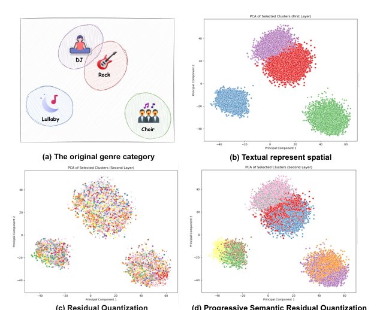
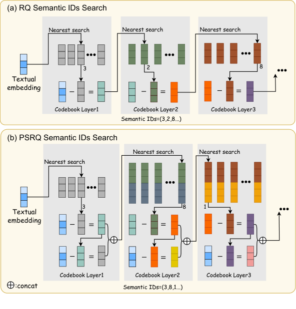
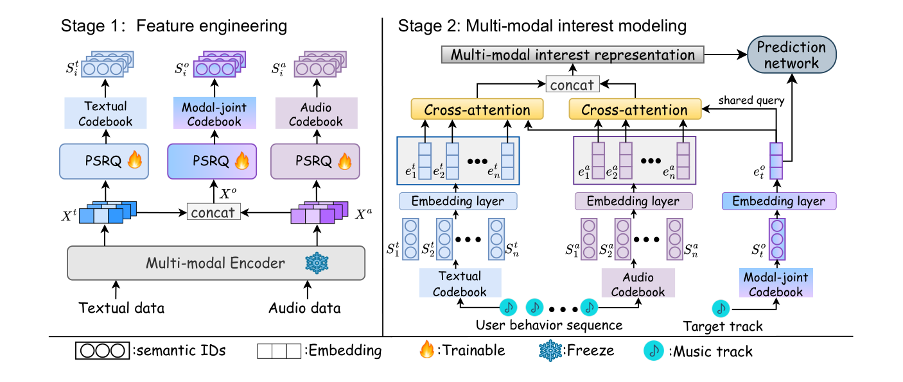

# 2025-渐进式语义残差量化用于音乐推荐中的多模态联合兴趣建模

本文介绍了 2025-渐进式语义残差量化用于音乐推荐中的多模态联合兴趣建模。核心内容：

关键发现：

---

王世嘉
> wangshijia1@corp.netease.com
网易云音乐
中国杭州

欧阳天培
ouyangtianpei@corp.netease.com
网易云音乐
杭州电子科技大学
中国杭州

肖强∗
hzxiaoqiang@corp.netease.com
网易云音乐
中国杭州

王东静
dongjing.wang@hdu.edu.cn
杭州电子科技大学
中国杭州

任引涛
renyintao@corp.netease.com
网易云音乐
中国杭州

徐松培
xusongpei@corp.netease.com
网易云音乐
中国杭州

郭达
guoda@corp.netease.com
网易云音乐
中国杭州

罗传江
luochuanjiang03@corp.netease.com
网易云音乐
中国杭州

## 摘要

在音乐推荐系统中，多模态兴趣学习至关重要，它使模型能够捕捉细微的偏好，包括文本元素（如歌词）和各类音乐属性（如不同乐器和旋律）。近年来，通过语义ID引入多模态内容特征的方法取得了令人瞩目的成果。然而，现有方法存在两个关键局限：1）模态内语义退化，即基于残差的量化过程逐渐将离散ID与原始内容语义解耦，导致语义漂移；以及2）模态间建模鸿沟，即传统融合策略要么忽略模态特定细节，要么无法捕捉跨模态相关性，阻碍了全面的用户兴趣建模。为应对这些挑战，我们提出了一种新颖的两阶段多模态推荐框架。在第一阶段，我们的渐进式语义残差量化（PSRQ）方法通过显式保留前缀语义特征来生成模态特定和模态联合的语义ID。在第二阶段，为了建模用户的多模态兴趣，设计了一个多码本交叉注意力（MCCA）网络，使模型能够同时捕捉模态特定兴趣并感知跨模态相关性。在多个真实世界数据集上的大量实验表明，我们的框架优于最先进的基线模型。该框架已部署在中国最大的音乐流媒体平台之一，在线A/B测试证实了其在商业指标上的显著改进，突显了其在工业级推荐系统中的实用价值。

*通讯作者。

允许为个人或课堂使用制作本作品的全部或部分数字或硬拷贝，无需付费，前提是复制的副本不得为盈利或商业目的而分发，并且副本在第一页包含此声明和完整的引用。本作品中由作者以外的其他人拥有的组件的版权必须得到尊重。允许带有引用的摘要。如需以其他方式复制、重新发布、上传到服务器或分发到列表，需要事先获得特定许可和/或支付费用。请向 permissions@acm.org 请求许可。

CIKM '25，2025年11月10日至14日，韩国首尔
© 2025 版权归作者/拥有者所有。出版权已授予ACM。
ACM ISBN 979-8-4007-2040-6/2025/11... $15.00$
https://doi.org/10.1145/3746252.3761579

## CCS概念
• 信息系统 $\to$ 推荐系统。

## 关键词
音乐推荐，多模态表示，残差量化，语义ID

## ACM引用格式：
Shijia Wang, Tianpei Ouyang, Qiang Xiao, Dongjing Wang, Yintao Ren, Songpei Xu, Da Guo, and Chuanjiang Luo. 2025. 渐进式语义残差量化用于音乐推荐中的多模态联合兴趣建模。载于第34届ACM国际信息与知识管理会议论文集（CIKM '25），2025年11月10日至14日，韩国首尔。ACM，纽约，NY，美国，9页。https://doi.org/10.1145/3746252.3761579

## 1 引言

在当代音乐流媒体平台中，用户在不同音乐模态上表现出不同的偏好，例如歌词、乐器、旋律。即使在不同的用户群体中，对模态兴趣的重视程度也可能存在显著差异。例如，Fiore等人[6]发现成年人更关注歌词，而儿童则更优先考虑旋律。进一步的研究[27, 33]表明，不同的音乐模态可能对用户的情绪产生不同的影响。然而，传统的推荐模型主要依赖于协同过滤[24]，专注于建模用户的行为偏好[47]，缺乏学习多模态兴趣的能力。

近年来，随着多模态特征提取技术的不断进步，越来越多的研究将多模态信息应用于短视频和音乐推荐等领域[9, 39, 41, 42, 44, 45]。这些研究表明，整合多模态信息可以显著提升推荐系统的性能，通过捕捉用户的细微偏好。随着研究者对多模态推荐的深入探索，一个核心见解逐渐显现：不同模态（包括视觉、文本和声学特征）的语义表示空间存在显著差异[7, 19, 23]。这些差异可能阻碍对交叉模态线索的整合，而这些线索对于理解用户偏好的细微差别至关重要[12, 25, 31]。此外，传统的内容表示本质上是静态的，因为它们是在训练前预先计算并固定的，这带来了一个挑战：它们无法在端到端的推荐框架内进行优化。这一限制可能妨碍模型适应复杂的交互模式，并可能导致训练期间收敛速度较慢[35]。如何桥接多模态表示与推荐系统以实现端到端训练，已成为一个难题。

最近，量化技术已被广泛应用于各个领域并取得了显著成果[1, 20, 22]。其中，VQ-Rec[10]识别了推荐系统中向量量化方法（VQ4Rec）的关键挑战，并展示了有前景的机会，可以启发该新兴领域的未来研究。TIGER [32]进一步引入了残差量化变分自编码器（RQ-VAE [17]），通过应用码本[17, 29]，正式打开了将内容特征转化为语义ID在推荐领域的大门。随后，大量研究[18, 36]表明，基于语义ID的表示可以桥接前述表示鸿沟，同时赋予模型对多模态信息的端到端适配能力。此外，一旦冷启动项目的多模态内容被映射到语义ID，该项目立即从码本中继承该ID的可学习嵌入。这产生了可靠且训练高效的表示，显著缓解了数据稀疏性和冷启动问题的挑战[3, 26]。

尽管取得了这些进展，仍然存在两个关键挑战：
• 多模态的模态内语义：当前方法纯粹依赖几何相似性（例如，残差之间的欧几里得距离或余弦相似度）进行量化。虽然残差量化（RQ）[17]和RQ-VAE通过迭代残差逼近提高了语义ID的准确性，但其逐层量化过程固有地将残差向量与原始语义含义解耦，忽视了层级语义对齐——量化层越深，与原始语义的连接越弱。如图1(c)所示，残差向量可能导致更多样化和离散的聚类结果，但倾向于忽略与原始语义的关联。因此，生成的聚类ID可能偏离预期的项目语义，导致次优的推荐性能。

• 多模态的模态间语义：现有范式如QARM[26]和OneRec[4]在量化之前通过对比学习融合多模态特征，这不可避免地抑制了对于细粒度用户偏好建模至关重要的模态唯一信号。而M3CRS [3]通过独立的嵌入表保留了模态特定特征，但其孤立地对用户模态特定兴趣进行建模，未能捕捉跨模态协同效应（例如，音乐中音频与歌词的互补性）。然而，在推荐系统的背景下，这两个方面都至关重要[2, 3, 25, 35, 48]。因此，第二个挑战是如何同时捕捉细粒度的模态偏好并利用互补的跨模态相关性，基于语义ID进行多模态兴趣建模。

为应对这些挑战，我们提出了一种基于多模态量化推荐的框架，该框架增强了语义保真度和跨模态交互。在特征工程阶段，我们使用一种新颖的渐进式语义残差量化（PSRQ）方法预处理多模态嵌入，通过显式保留前缀语义特征，生成与原始语义保持强对齐的模态特定和联合语义ID。然后，对于用户的多模态兴趣建模，我们引入了多码本交叉注意力（MCCA）网络，该网络使用共享的模态联合码本作为跨模态查询来建模多模态嵌入序列。该方法在推荐系统的排序阶段[40]以端到端方式运行，联合优化语义一致性和自适应多模态融合，以实现优越的推荐性能。

总之，我们的研究贡献如下：

• 我们提出了一种新颖的渐进式语义残差量化方法，该方法用前缀语义约束残差量化，增强了语义保留。

• 我们提出了一个多码本交叉注意力网络用于多模态兴趣学习，同时捕捉模态特异性和跨模态关联。

图1：子图1(b)展示了子图1(a)中歌曲的原始文本特征空间，通过PCA可视化。子图1(c)展示了传统残差量化中第二层的聚类结果。子图1(d)展示了使用所提出的PSRQ方法第二层的聚类结果。

DJRockLullabyChoir (a) 原始体裁类别 (b) 文本表示空间 (c) 残差量化 (d) 渐进式语义残差量化
渐进式语义残差量化用于音乐推荐中的多模态联合兴趣建模
CIKM '25，2025年11月10日至14日，韩国首尔
王世嘉等

• 在三个真实世界数据集上进行的大量离线实验和在线A/B测试验证了所提出方法的有效性，显著提升了冷启动性能指标。

## 2 相关工作

### 2.1 推荐中的多模态表示

近年来，多模态内容特征在增强推荐系统方面取得了令人瞩目的成果。早期代表性工作，如VBPR[9]，使用矩阵分解将视觉特征引入推荐领域。MMGCN[41]针对不同模态的每个用户-项目二部图建模了用户偏好的细粒度模态。为了进一步改进基于多模态的推荐，多模态兴趣表示融合的问题至关重要。一种常见的方法是通过预训练任务融合项目的多模态嵌入。AlignRec[25]使用掩码-然后-预测策略预训练了视觉-文本对齐任务。Sheng等人[35]通过SimTier在对比学习预训练任务后精炼用户的多模态兴趣表示，并使用MAKE解决ID特征与多模态表示所需训练轮次差异的问题。

### 2.2 推荐的量化表示学习

量化表示学习近年来因其提取语义信息的能力而受到众多学者的广泛关注，并在多个领域证明了其有效性。VQ-Rec[10]通过乘积量化（PQ）将文本内容向量转化为稀疏的语义ID表示。TIGER[32]进一步利用RQ-VAE基于文本内容特征生成层级语义ID作为项目表示。虽然RQ和RQ-VAE通过残差逼近原始嵌入以提高量化表示的准确性，但它们仍然面临沙漏问题[15]，导致离散空间中分布不均匀且深度级别的语义关联有限。OneRec[4]通过多层次平衡量化机制强制RQ每一层元素数量均匀分布。Singh等人[36]表明，使用句子片段模型（SPM）[16]的语义ID是一种更具适应性和高效的方案来表示项目内容，并实现更好的泛化结果。此外，Zheng等人[46]提出了一种前缀n-gram参数化方法，并证明了将聚类的层级性质纳入嵌入表映射是一种有效的措施。

## 3 预备知识

问题定义。令U和I分别表示用户集和项目集。|U|和|I|表示用户数和项目数。对于所有项目，我们基于现有的内容特征提取方法获得其多模态内容嵌入 X^m
$$
\in
$$
 R^{|I|
$$
\times
$$
d}。这里，m
$$
\in
$$
 {v, t, a}，其中v代表视觉，t代表文本，a代表音频。具体的内容特征提取方法详见第5.1.1节。对于每个用户u
$$
\in
$$
 U，我们基于正向交互（如点击、评论或收藏）构建其历史行为序列 H_u = {i^h_1, i^h_2, ..., i^h_n}。在该序列中，i^h_n
$$
\in
$$
 I 表示与第n次交互关联的项目。我们的推荐任务涉及预测用户u与目标项目i_t
$$
\in
$$
 I产生正向交互的概率 ŷ_{u,t}。

残差量化。在传统的基于K均值的残差量化（RQ）过程中，每一层将前一层产生的残差向量作为输入，并应用K均值算法获得聚类中心，这些聚类中心构成该层的码本。对于每种多模态嵌入：
X^m_1 = X^m
C_1 = K-means(X^m_1, k), X^m_2 = X^m_1 - NearestRep(X^m_1, C_1)
C_2 = K-means(X^m_2, k), X^m_3 = X^m_2 - NearestRep(X^m_2, C_2)
...
C_l = K-means(X^m_l, k), X^ $m_{l+1}$ = X^m_l - NearestRep(X^m_l, C_l)

其中l是量化层数，C_l
$$
\in
$$
 R^{k
$$
\times
$$
d}是第l层生成的聚类中心嵌入，k是K均值的聚类中心数，NearestRep(·)表示在聚类中心嵌入中的最近表示搜索。RQ的语义ID检索过程如图2(a)所示。

## 4 方法论

在本节中，我们详细阐述我们框架的组成部分及其整体部署流程，如图3所示，包括两个阶段：特征工程和下游推荐模型训练。

图2：子图2(a)和2(b)提供了RQ和PSRQ码本中语义ID检索过程的视觉比较。

(a) RQ语义ID搜索
码本层1 -> 文本嵌入 -> 最近邻搜索 -> 码本层2 -> 最近邻搜索 -> 码本层3 -> 最近邻搜索
语义ID = (3, 2, 8...)

(b) PSRQ语义ID搜索
码本层1 -> 文本嵌入 -> 最近邻搜索 -> 码本层2 -> 最近邻搜索 -> 码本层3 -> 最近邻搜索
:拼接
语义ID = (3, 8, 1...)

图3：我们推荐框架的整体工作流程。虽然第二阶段仅突出显示了核心交叉注意力组件，但我们还在模态联合和ID嵌入序列上进行了额外的序列建模。

### 4.1 渐进式语义残差量化

在特征工程阶段，受先前工作[3, 26]的启发，我们不直接利用原始的静态内容多模态内容嵌入 X^m
$$
\in
$$
 R^{|I|
$$
\times
$$
d}。相反，我们采用我们提出的渐进式语义残差量化（PSRQ）方法将这些嵌入映射到语义ID表示。与RQ不同，PSRQ引入了一个关键的修改：将残差向量与原始内容特征向量区分开，然后与其拼接，以增强对原始语义信息的保留，具体公式如下：

X^m_1 = X^m
C_1 = K-means(X^m_1, k)
X^m_2 = X^m - NearestRep(X^m_1, C_1)
C_2 = K-means(X^m_2 $⊕$ (X^m - X^m_2), k)
...
X^m_l = X^ $m_{l-1}$ - NearestRep(X^ $m_{l-1}$ , $C_{l-1}$ )
C_l = K-means(X^m_l $⊕$ (X^m - X^m_l), k)

其中 $⊕$ 表示拼接操作，C_1
$$
\in
$$
 R^{k
$$
\times
$$
d}，C_2到C_l均为R^{k
$$
\times
$$
2d}，且m
$$
\in
$$
 {v, t, a}。在我们的在线系统中，我们只使用了文本和音频模态嵌入，即m = {t, a}。具体地，对于模态联合信息，我们将X^m拼接为模态联合嵌入 X^o
$$
\in
$$
 R^{|I|
$$
\times
$$
2d}，以执行PSRQ并为每个项目生成模态联合语义ID S^o_i，其中o表示多模态联合信息。

然后对于每个项目i，我们从每个量化层中检索最近的聚类ID id^t
$$
\in
$$
 (0, 1, ..., k-1)作为语义ID S^m_i = [id^m_1, id^m_2, ..., id^m_l]。传统RQ和PSRQ之间的语义ID检索过程的差异如图2所示。

### 4.2 多码本交叉注意力

在对模态特定和联合内容表示进行量化之后，我们将语义ID集成到基于协同过滤的推荐模型中。这种集成使得能够建模用户的多模态兴趣，增强了泛化能力。

#### 4.2.1 层级嵌入层

为了实现内容特征的端到端优化，超越静态表示的约束，我们不使用原始的聚类中心嵌入作为语义ID嵌入。相反，在我们模型的嵌入层中，我们对通过量化码本生成的模态特定和联合语义ID使用随机初始化的嵌入表。具体地，对于每个项目的模态特定语义ID S^m_i和模态联合语义ID S^o_i，我们为每个量化层分配随机初始化的嵌入表，记为 E^z
$$
\in
$$
 R^{k
$$
\times
$$
d'}，其中d'是嵌入大小，z = {t, a, o}，t表示文本，a表示音频，o表示模态联合信息。然后我们可以检索每一层的语义ID嵌入，并将它们聚合为用户历史序列中每个项目的最终语义表示 e^z_i
$$
\in
$$
 R^{d'}：

e^z_i = $\Sigma$ _{j=1}^{l} one-hot(id^ $z_{ij}$ )
$$
\times
$$
 E^z_j, id^ $z_{ij}$
$$
\in
$$
 S^z_i

其中one-hot是一种常用选项，将i $d_{ij}$ 编码为一个独热向量。通过这种方法，我们构建了模态特定和联合语义嵌入序列 {e^z_1, e^z_2, ..., e^z_n}。

对于目标项目i_t，我们仅使用模态联合码本E^o，旨在获取其模态联合语义嵌入 e^o_t
$$
\in
$$
 R^{d'}，以捕捉跨模态关联。

此外，我们通过利用ID嵌入序列 {e^r_1, e^r_2, ..., e^r_n} 和目标项目ID嵌入 e^r_t
$$
\in
$$
 R^{d'} 来整合推荐系统中的协同信号。这种方法确保模型有效捕捉数据中的协同模式。

#### 4.2.2 交叉注意力层

在获得用户模态特定和联合嵌入序列之后，我们使用交叉注意力机制来建模用户的模态特定兴趣，同时捕捉跨模态相关性。目标项目的模态联合语义ID嵌入 e^o_t 被用作共享查询，以计算用户历史行为的模态特定和联合嵌入序列上的注意力分数。这种设计能够在一定程度上缓解模态间表示空间不一致的问题，同时支持捕捉跨模态相关性。多模态兴趣表示 h^z_u
$$
\in
$$
 R^{d'} 通过注意力加权聚合计算：

h^z_u = $\Sigma$ _{j=1}^{n} Cross-Attention(Q = e^o_t, K = e^z_j, V = e^z_j)
= $\Sigma$ _{j=1}^{n} Attention(e^z_j $⊕$ e^o_t) · e^z_j

其中Attention(·)是一个前馈网络，输出为激活权重。

为了捕捉协同模式，我们也应用注意力机制到协同嵌入序列 H^r_u，然后获得用户的协同兴趣表示：

h^r_u = $\Sigma$ _{j=1}^{n} Attention(e^r_j $⊕$ e^r_t) · e^r_j

其中 h^r_u 是用户的协同兴趣表示。

### 4.3 模型预测与优化

为了推导用户与目标项目之间正向交互的概率，我们将多模态兴趣表示 h^z_u、协同兴趣表示 h^r_u 与目标项目的协同嵌入 e^r_t 和模态联合语义ID嵌入 e^o_t 拼接起来。这个拼接向量随后被输入到一个多层感知器（MLP）中，用于预测logit ŷ_j。由于正向交互预测是一个二分类任务，我们采用交叉熵损失作为模型训练和优化的目标函数：

L = -1/N $\Sigma$ _{j=1}^{N} [y_j log $\sigma$ (ŷ_j) + (1 - y_j) log(1 - $\sigma$ (ŷ_j))]

其中N是训练实例的总数，y_j
$$
\in
$$
 {0, 1} 是每个样本的标签。

## 5 实验

在本节中，我们进行了多种离线实验和在线测试以评估所提出的方法。具体来说，我们的目标是解决以下研究问题。
• RQ1 所提出的基于量化的推荐框架在与通用和SOTA多模态推荐方法相比时性能如何？
• RQ2 与其他量化方法相比，PSRQ方法生成的语义ID在推荐任务中表现如何？
• RQ3 MCCA中的模态特定和模态联合码本是否有效？
• RQ4 所提出方法（PSRQ+MCCA）在真实在线场景中的整体表现如何？

### 5.1 实验设置

表1：数据集统计信息

数据集 | #用户 | #项目 | #交互
Amazon Baby | 81,423 | 33,652 | 230,444
工业数据集 | 4,926,656 | 1,387,247 | 8,696,093
Music4all | 14,127 | 99,596 | 2,597,382

#### 5.1.1 数据集

为了评估所提出方法的性能，我们在一个工业数据集和两个公开数据集上进行了实验，包括Amazon Baby[11]和Music4all[34]。每个数据集的详细数据统计和多模态信息见表1。对于所有数据集，我们将交互次数少于30次的项目标记为冷启动项目。
• Amazon Baby：对于Amazon评论数据集中的baby基准，我们将评分4或以上的交互定义为正样本，评分低于4的交互定义为负样本。用户交互序列基于时间戳构建。项目的图像特征使用数据集提供的预先存在的基于CNN的方法提取。文本特征通过LLaMA3.2-1B[28]模型从产品标题、描述、品牌和类别信息组成的文本中获取。
• 工业数据集：该数据集是从我们的在线音乐平台在一周时间内收集的。为了构建训练样本，我们将用户的歌曲收藏交互视为正样本，将用户播放但未收藏的歌曲视为负样本；进一步基于这些正向交互构建用户历史交互序列。对于文本特征提取，我们利用Baichuan2-7B模型[43]从多源文本信息（包括歌曲标题、体裁标签和歌词）生成文本嵌入。对于音频特征提取，我们使用MERT-v1-95M模型[21]直接从MP3格式音频文件中提取音频嵌入。
• Music4all：我们将重复播放的歌曲定义为正样本，仅播放一次的歌曲定义为负样本。文本特征由LLaMA3.2从歌曲标题、歌词、体裁标签等中提取。音频特征也由MERT模型采样并提取。

#### 5.1.2 实现细节

我们在TensorFlow 2中实现所有方法，同时轮数设置为1，三个数据集中的训练批次大小分别为{64, 512, 512}，学习率分别为{0.0005, 0.0001, 0.0001}。多模态语义ID嵌入和ID嵌入的维度d'均设置为64。用户历史序列的最大长度截断为20。对于所有模型，我们采用Adam [14]优化器。多模态大语言模型[38]（MLLM），包括Baichuan2-7B、MERT-v1-95M和LLaMA3.2-1B，均部署在NVIDIA A100 GPU上。对于提出的PSRQ和其他量化方法，我们在Amazon Baby、Industrial和Music4all中设置聚类数k分别为{64, 256, 128}，RQ、PQ、RQ-VAE和PSRQ的层数l分别为{3, 4, 3, 3}。此外，为确保训练过程的公平性，我们在不同数据集上的所有模型中保持一致的参数规模、学习率和批次大小。

#### 5.1.3 评估指标

为了全面评估模型的性能，我们采用AUC（ROC曲线下面积）[8]作为主要评估指标。我们将"All AUC"定义为在所有项目上评估的AUC指标，而"Cold AUC"指的是冷启动项目的AUC指标。此外，在相同的模型参数量级下，我们提供了Logloss指标，具体公式详见第4.3节。

### 5.2 离线性能对比

#### 5.2.1 与为工业场景提出的推荐模型的比较（RQ1）

为了验证所提出框架的有效性，我们将我们的模型与多种基线模型（包括最新的SOTA模型）的性能进行了比较。
• DIN[47]：该模型利用注意力机制从用户的历史行为中动态捕捉用户的兴趣。
• VBPR[9]：该模型将每个项目的多模态嵌入和ID嵌入集成作为其表示，并使用矩阵分解（MF）框架重构用户与项目之间的历史交互。
• SimTier+MAKE[35]：一个工业级推荐框架，结合了相似度分层和多模态知识嵌入，以处理大规模异构数据。
• QARM[26]：一个最近的SOTA方法，整合了对比学习和量化技术以提升推荐效率，同时保持模型表达能力。

如表2所示，提出的PSRQ+MCCA模型在三个数据集上的大多数实验结果中取得了优越的性能，特别是在冷启动项目的推荐中表现出色。QARM整合了对比学习和量化技术以增强语义泛化，在多个数据集上取得了次优性能。DIN由于ID嵌入的彻底端到端训练而显示出良好的拟合能力，尽管缺乏多模态信息。相比之下，SimTier+MAKE仅优于VBPR，可能是由于在单个轮次内训练不足。

表2：所有基线的性能在不同数据集上使用AUC（针对所有项目和冷启动项目）进行评估，模型拟合度通过Logloss评估。最佳模型以粗体显示，第二名以下划线标记。"%Improv."表示相对于最佳基线的百分比相对改进。"All AUC"在所有项目上计算，"Cold AUC"针对冷启动项目（少于30次交互）计算。

方法 | Amazon Baby | | | Industrial | | | Music4all | | |
All AUC | Cold AUC | Logloss | All AUC | Cold AUC | Logloss | All AUC | Cold AUC | Logloss
VBPR | 0.6466 | 0.5377 | 2.6145 | 0.7407 | 0.7229 | 1.4869 | 0.6217 | 0.5174 | 5.7460
SimTier+MAKE | 0.6213 | 0.5286 | 2.7974 | 0.7537 | 0.7446 | 1.2503 | 0.6871 | 0.6041 | 3.6962
DIN | 0.6492 | 0.5487 | 2.5766 | 0.7599 | 0.7382 | 1.2188 | 0.7260 | 0.6699 | 2.9386
QARM | 0.6557 | 0.5681 | 2.5686 | 0.7628 | 0.7429 | 1.2068 | 0.7347 | 0.7336 | 2.9181
PSRQ+MCCA | 0.6573 | 0.5781 | 2.5564 | 0.7636 | 0.7535 | 1.2006 | 0.7347 | 0.7373 | 2.9070
%Improv. | +0.24% | +1.76% | -0.47% | +0.10% | +1.20% | -0.51% | +0.00% | +0.50% | -0.38%

#### 5.2.2 量化方法的比较（RQ2）

为了严格评估所提出的PSRQ方法相对于替代量化技术在内容特征泛化方面及其对推荐性能影响的增强效果，我们在DIN [47]模型下保持相同的批次大小和学习率，仅使用文本模态嵌入。这种方法有助于减轻外部因素的影响，确保对量化方法本身的集中评估。用于比较的量化方法如下：
• PQ[13]：这是一种广泛使用的技术，通过将向量分割成子向量并独立量化每个子向量，将高维向量压缩到低维空间。
• VQ[37]：该方法使用由K均值聚类生成的码本将高维向量压缩到低维空间。
• RQ[5]：RQ也基于K均值聚类，但重点是迭代地对量化残差进行处理，以实现对原始向量更精确的逼近。
• RQ-VAE[17]：这种方法通过将RQ与自编码器架构集成来扩展RQ的概念，有助于重建丰富的语义信息。

参考表3，所有量化方法都提升了DIN模型的性能。其中，PQ缺乏全局语义信息，导致性能最差。VQ尽管只采用单层量化，但在冷启动项目上取得了可观的改进。RQ和RQ-VAE在多个数据集上均取得了次优结果。PSRQ方法展示了整体最佳性能，包括在三个数据集中的所有项目和冷启动项目上。

表3：仅将文本语义ID增强到DIN模型中，以公平评估每种量化方法的性能。表现最佳者以粗体显示，第二名以下划线标记。

方法 | Amazon Baby | | | Industrial | | | Music4all | | |
All AUC | Cold AUC | Logloss | All AUC | Cold AUC | Logloss | All AUC | Cold AUC | Logloss
DIN | 0.6492 | 0.5487 | 2.5766 | 0.7599 | 0.7382 | 1.2188 | 0.7260 | 0.6699 | 2.9386
+PQ | 0.6534 | 0.5515 | 2.5754 | 0.7617 | 0.7387 | 1.2050 | 0.7313 | 0.7321 | 2.9234
+VQ | 0.6520 | 0.5569 | 2.5725 | 0.7623 | 0.7411 | 1.2087 | 0.7328 | 0.7317 | 2.9146
+RQ | 0.6531 | 0.5546 | 2.5661 | 0.7628 | 0.7334 | 1.2077 | 0.7329 | 0.7327 | 2.9204
+RQ-VAE | 0.6535 | 0.5533 | 2.5711 | 0.7620 | 0.7400 | 1.2081 | 0.7338 | 0.7322 | 2.9184
+PSRQ | 0.6540 | 0.5610 | 2.5705 | 0.7630 | 0.7442 | 1.2003 | 0.7345 | 0.7331 | 2.9183

#### 5.2.3 MCCA的消融研究（RQ3）

为了验证MCCA的有效性，我们进行了消融研究，旨在分离模态特定和联合的影响：
• w/o模态特定码本（w/o MSC）：我们在注意力建模期间仅使用模态联合码本，消除了专门的模态特定兴趣表示。该消融测试移除细粒度模态语义是否会削弱模型在不同内容模态间捕捉细粒度用户偏好的能力。
• w/o模态联合码本（w/o MJC）：为了评估跨模态相关性建模的重要性，我们通过排除用户序列的共享模态联合码本和共享查询进行了实验。相反，我们使用模态特定语义ID嵌入作为各自模态语义嵌入序列的查询。该变体研究缺少共享查询机制是否会阻碍利用模态间依赖关系的能力，从而影响推荐性能。

消融研究的结果如表4所示，表明MCCA框架在大多数数据集和指标上表现更优，验证了通过模态联合码本提取跨模态信息以及独立建模每个模态的有效性。虽然在Music4all数据集中，MCCA在所有项目上的性能略逊于w/o MJC，但冷启动项目上的改进表明，跨模态关联有助于增强模型的泛化性能，特别是对于冷启动项目。

表4：在MCCA框架内消融模态特定和跨模态共享查询的作用。

方法 | Amazon Baby | | | Industrial | | | Music4all | | |
All AUC | Cold AUC | Logloss | All AUC | Cold AUC | Logloss | All AUC | Cold AUC | Logloss
w/o MSC | 0.6544 | 0.5549 | 2.5594 | 0.7627 | 0.7424 | 1.1991 | 0.7333 | 0.7281 | 2.9184
w/o MJC | 0.6555 | 0.5619 | 2.5598 | 0.7631 | 0.7467 | 1.2003 | 0.7353 | 0.7364 | 2.9089
PSRQ+MCCA | 0.6573 | 0.5781 | 2.5564 | 0.7636 | 0.7535 | 1.2006 | 0.7347 | 0.7373 | 2.9070

### 5.3 在线A/B测试（RQ4）

我们于2025年2月在我们的音乐流媒体平台上对我们的在线排序模型进行了A/B测试，每天向数千万用户提供歌曲推荐。基线模型是行业标准的深度学习推荐模型（DLRM[30]）。实验组通过结合来自PSRQ生成的语义ID和MCCA的用户多模态兴趣表示来增强基线模型。我们的核心指标包括用户与音乐曲目的互动，具体通过收藏和完整播放等行为。收藏行为表示用户将歌曲添加到他们的喜爱歌单中的动作，而完整播放行为表示用户已完整播放歌曲。在试验期间，相比于对照组，实验组的收藏增加了2.81%，完整播放增加了0.95%。对于在过去30天内发布的新曲目，收藏和完整播放的概率分别增加了5.98%和2.2%。此外，新曲目的收听时长增加了3.05%。

## 6 结论

在这项工作中，我们引入了一个新颖的多模态推荐框架，以解决音乐推荐系统中长期存在的语义退化和跨模态建模鸿沟的挑战。我们的渐进式语义残差量化（PSRQ）方法在量化过程中有效保留了原始语义，而多码本交叉注意力（MCCA）机制使得能够同时捕捉细粒度多模态兴趣和跨模态相关性。在多个数据集上进行的大量实验证明了显著的改进，验证了我们框架的最先进性能。在领先音乐流媒体平台上的成功部署突显了其在真实场景中的实用价值。本研究通过桥接语义保真度和多模态协同，为工业推荐系统提供了一个可扩展的解决方案，推动了该领域的发展。

## 7 致谢

本研究得到了浙江省自然科学基金（资助号LZ25F020010）的支持。

## 参考文献

[1] Artem Babenko and Victor Lempitsky. 2014. Additive Quantization for Extreme Vector Compression. In 2014 IEEE Conference on Computer Vision and Pattern Recognition. 931–938. doi:10.1109/CVPR.2014.124

[2] Feiyu Chen, Junjie Wang, Yinwei Wei, Hai-Tao Zheng, and Jie Shao. 2022. Breaking isolation: Multimodal graph fusion for multimedia recommendation by edge-wise modulation. In Proceedings of the 30th ACM International Conference on Multimedia. 385–394.

[3] Gaode Chen, Ruina Sun, Yuezihan Jiang, Jiangxia Cao, Qi Zhang, Jingjian Lin, Han Li, Kun Gai, and Xinghua Zhang. 2024. A Multi-modal Modeling Framework for Cold-start Short-video Recommendation. In Proceedings of the 18th ACM Conference on Recommender Systems (Bari, Italy) (RecSys '24). Association for Computing Machinery, New York, NY, USA, 391–400. doi:10.1145/3640457.3688098

[4] Jiaxin Deng, Shiyao Wang, Kuo Cai, Lejian Ren, Qigen Hu, Weifeng Ding, Qiang Luo, and Guorui Zhou. 2025. OneRec: Unifying Retrieve and Rank with Generative Recommender and Iterative Preference Alignment. arXiv:2502.18965 [cs.IR] https://arxiv.org/abs/2502.18965

[5] Sohrab Ferdowsi, Slava Voloshynovskiy, and Dimche Kostadinov. 2017. Regularized Residual Quantization: a multi-layer sparse dictionary learning approach. arXiv:1705.00522 [cs.LG] https://arxiv.org/abs/1705.00522

[6] Jennifer Fiore. 2016. Analysis of Lyrics from Group Songwriting with Bereaved Children and Adolescents. Journal of Music Therapy 53, 3 (05 2016), 207–231. doi:10.1093/jmt/thw005

[7] Rohit Girdhar, Alaaeldin El-Nouby, Zhuang Liu, Mannat Singh, Kalyan Vasudev Alwala, Armand Joulin, and Ishan Misra. 2023. ImageBind One Embedding Space to Bind Them All. In 2023 IEEE/CVF Conference on Computer Vision and Pattern Recognition (CVPR). 15180–15190. doi:10.1109/CVPR52729.2023.01457

[8] James A Hanley and Barbara J McNeil. 1982. The meaning and use of the area under a receiver operating characteristic (ROC) curve. Radiology 143, 1 (1982), 29–36.

[9] Ruining He and Julian McAuley. 2016. VBPR: visual Bayesian Personalized Ranking from implicit feedback. In Proceedings of the Thirtieth AAAI Conference on Artificial Intelligence (Phoenix, Arizona) (AAAI'16). AAAI Press, 144–150.

[10] Yupeng Hou, Zhankui He, Julian McAuley, and Wayne Xin Zhao. 2023. Learning Vector-Quantized Item Representation for Transferable Sequential Recommenders. In Proceedings of the ACM Web Conference 2023 (Austin, TX, USA) (WWW '23). Association for Computing Machinery, New York, NY, USA, 1162–1171. doi:10.1145/3543507.3583434

[11] Yupeng Hou, Jiacheng Li, Zhankui He, An Yan, Xiusi Chen, and Julian McAuley. 2024. Bridging Language and Items for Retrieval and Recommendation. arXiv:2403.03952 [cs.IR] https://arxiv.org/abs/2403.03952

[12] Hengchang Hu, Wei Guo, Yong Liu, and Min-Yen Kan. 2023. Adaptive Multi-Modalities Fusion in Sequential Recommendation Systems. In Proceedings of the 32nd ACM International Conference on Information and Knowledge Management (Birmingham, United Kingdom) (CIKM '23). Association for Computing Machinery, New York, NY, USA, 843–853. doi:10.1145/3583780.3614775

[13] Herve Jégou, Matthijs Douze, and Cordelia Schmid. 2011. Product Quantization for Nearest Neighbor Search. IEEE Transactions on Pattern Analysis and Machine Intelligence 33, 1 (2011), 117–128. doi:10.1109/TPAMI.2010.57

[14] Diederik P Kingma and Jimmy Ba. 2014. Adam: A method for stochastic optimization. arXiv preprint arXiv:1412.6980 (2014).

[15] Zhirui Kuai, Zuxu Chen, Huimu Wang, Mingming Li, Dadong Miao, Binbin Wang, Xusong Chen, Li Kuang, Yuxing Han, Jiaxing Wang, Guoyu Tang, Lin Liu, Songlin Wang, and Jingwei Zhuo. 2024. Breaking the Hourglass Phenomenon of Residual Quantization: Enhancing the Upper Bound of Generative Retrieval. In Proceedings of the 2024 Conference on Empirical Methods in Natural Language Processing: Industry Track. Association for Computational Linguistics, Miami, Florida, USA, 677–685. doi:10.18653/v1/2024.emnlp-industry.50

[16] Taku Kudo. 2018. Subword regularization: Improving neural network translation models with multiple subword candidates. arXiv preprint arXiv:1804.10959 (2018).

[17] Doyup Lee, Chiheon Kim, Saehoon Kim, Minsu Cho, and Wook-Shin Han. 2022. Autoregressive Image Generation Using Residual Quantization. In Proceedings of the IEEE/CVF Conference on Computer Vision and Pattern Recognition (CVPR). 11523–11532.

[18] Guanghan Li, Xun Zhang, Yufei Zhang, Yifan Yin, Guojun Yin, and Wei Lin. 2025. Semantic Convergence: Harmonizing Recommender Systems via Two-Stage Alignment and Behavioral Semantic Tokenization. In Proceedings of the AAAI Conference on Artificial Intelligence, Vol. 39. AAAI Press, AAAI, 12040–12048. doi:10.1609/aaai.v39i11.33311

[19] Junnan Li, Ramprasaath R. Selvaraju, Akhilesh D. Gotmare, Shafiq Joty, Caiming Xiong, and Steven C.H. Hoi. 2021. Align before fuse: vision and language representation learning with momentum distillation. In Proceedings of the 35th International Conference on Neural Information Processing Systems (NIPS '21). Curran Associates Inc., Red Hook, NY, USA, Article 742, 12 pages.

[20] Yue Li, Wenrui Ding, Chunlei Liu, Baochang Zhang, and Guodong Guo. 2021. TRQ: Ternary Neural Networks With Residual Quantization. In Proceedings of the Thirty-Fifth AAAI Conference on Artificial Intelligence, Vol. 35. AAAI Press, Palo Alto, California, USA, 8538–8546. doi:10.1609/aaai.v35i10.17036

[21] Yizhi Li, Ruibin Yuan, Ge Zhang, Yinghao Ma, Xingran Chen, Hanzhi Yin, Chenghao Xiao, Chenghua Lin, Anton Ragni, Emmanouil Benetos, et al. 2023. Mert: Acoustic music understanding model with large-scale self-supervised training. arXiv preprint arXiv:2306.00107 (2023).

[22] Zefan Li, Bingbing Ni, Wenjun Zhang, Xiaokang Yang, and Wen Gao. 2017. Performance Guaranteed Network Acceleration via High-Order Residual Quantization. In Proceedings of the IEEE International Conference on Computer Vision (ICCV).

[23] Ji Lin, Hongxu Yin, Wei Ping, Yao Lu, Pavlo Molchanov, Andrew Tao, Huizi Mao, Jan Kautz, Mohammad Shoeybi, and Song Han. 2023. VILA: On Pre-training for Visual Language Models. arXiv:2312.07533 [cs.CV]

[24] G. Linden, B. Smith, and J. York. 2003. Amazon.com recommendations: item-to-item collaborative filtering. IEEE Internet Computing 7, 1 (2003), 76–80. doi:10.1109/MIC.2003.1167344

[25] Yifan Liu, Kangning Zhang, Xiangyuan Ren, Yanhua Huang, Jiarui Jin, Yingjie Qin, Ruilong Su, Ruiwen Xu, Yong Yu, and Weinan Zhang. 2024. AlignRec: Aligning and Training in Multimodal Recommendations. In Proceedings of the 33rd ACM International Conference on Information and Knowledge Management (Boise, ID, USA) (CIKM '24). Association for Computing Machinery, New York, NY, USA, 1503–1512. doi:10.1145/3627673.3679626

[26] Xinchen Luo, Jiangxia Cao, Tianyu Sun, Jinkai Yu, Rui Huang, Wei Yuan, Hezheng Lin, Yichen Zheng, Shiyao Wang, Qigen Hu, Changqing Qiu, Jiaqi Zhang, Xu Zhang, Zhiheng Yan, Jingming Zhang, Simin Zhang, Mingxing Wen, Zhaojie Liu, Kun Gai, and Guorui Zhou. 2024. QARM: Quantitative Alignment Multi-Modal Recommendation at Kuaishou. arXiv:2411.11739 [cs.IR] https://arxiv.org/abs/2411.11739

[27] Yiqing Ma, David Baker, Katherine Vukovics, Connor Davis, and Emily Elliott. 2021. Generalizing the Effect of Lyrics on Emotion Rating. doi:10.31234/osf.io/5ku43

[28] Vladimir Malinovskii, Andrei Panferov, Ivan Ilin, Han Guo, Peter Richtárik, and Dan Alistarh. 2024. Pushing the Limits of Large Language Model Quantization via the Linearity Theorem. arXiv:2411.17525 [cs.LG] https://arxiv.org/abs/2411.17525

[29] Julieta Martinez, Holger H. Hoos, and James J. Little. 2014. Stacked Quantizers for Compositional Vector Compression. arXiv:1411.2173 [cs.CV] https://arxiv.org/abs/1411.2173

[30] Maxim Naumov, Dheevatsa Mudigere, Hao-Jun Michael Shi, Jianyu Huang, Narayanan Sundaraman, Jongsoo Park, Xiaodong Wang, Udit Gupta, Carole-Jean Wu, Alisson G. Azzolini, Dmytro Dzhulgakov, Andrey Mallevich, Ilia Cherniavskii, Yinghai Lu, Raghuraman Krishnamoorthi, Ansha Yu, Volodymyr Kondratenko, Stephanie Pereira, Xianjie Chen, Wenlin Chen, Vijay Rao, Bill Jia, Liang Xiong, and Misha Smelyanskiy. 2019. Deep Learning Recommendation Model for Personalization and Recommendation Systems. arXiv:1906.00091 [cs.IR] https://arxiv.org/abs/1906.00091

[31] D. Rafailidis, P. Kefalas, and Y. Manolopoulos. 2017. Preference dynamics with multimodal user-item interactions in social media recommendation. Expert Systems with Applications 74 (2017), 11–18. doi:10.1016/j.eswa.2017.01.005

[32] Shashank Rajput, Nikhil Mehta, Anima Singh, Raghunandan Keshavan, Trung Vu, Lukasz Heidt, Lichan Hong, Yi Tay, Vinh Q. Tran, Jonah Samost, Maciej Kula, Ed H. Chi, and Maheswaran Sathiamoorthy. 2023. Recommender systems with generative retrieval. In Proceedings of the 37th International Conference on Neural Information Processing Systems (New Orleans, LA, USA) (NIPS '23). Curran Associates Inc., Red Hook, NY, USA, Article 452, 17 pages.

[33] Soravitt Sangnark, Phairot Autthasan, Puntawat Ponglertnapakorn, Phudit Chalekarn, Thapanun Sudhawiyangkul, Manatsanan Trakulruangroj, Sarita Songsermsawad, Rawin Assabumrungrat, Supalak Amplod, Kajornvut Ounjai, and Theerawit Wilaiprasitporn. 2021. Revealing Preference in Popular Music Through Familiarity and Brain Response. IEEE Sensors Journal 21, 13 (2021), 14931–14940. doi:10.1109/JSEN.2021.3073040

[34] Igor André Pegoraro Santana, Fabio Pinhelli, Juliano Donini, Leonardo Gabiato Catharin, Rafael B. Mangolin, Yandre M. G. Costa, Valéria Delisandra Feltrim, and Marcos Aurélio Domingues. 2020. Music4All: A New Music Database and Its Applications. 2020 International Conference on Systems, Signals and Image Processing (IWSSIP) (2020), 399–404.

[35] Xiang-Rong Sheng, Feifan Yang, Litong Gong, Biao Wang, Zhangming Chan, Yujing Zhang, Yueyao Cheng, Yong-Nan Zhu, Tiezheng Ge, Han Zhu, Yuning Jiang, Jian Xu, and Bo Zheng. 2024. Enhancing Taobao Display Advertising with Multimodal Representations: Challenges, Approaches and Insights. In Proceedings of the 33rd ACM International Conference on Information and Knowledge Management (Boise, ID, USA) (CIKM '24). Association for Computing Machinery, New York, NY, USA, 4858–4865. doi:10.1145/3627673.3680068

[36] Anima Singh, Trung Vu, Nikhil Mehta, Raghunandan Keshavan, Maheswaran Sathiamoorthy, Yilin Zheng, Lichan Hong, Lukasz Heldt, Li Wei, Devansh Tandon, Ed Chi, and Xinyang Yi. 2024. Better Generalization with Semantic IDs: A Case Study in Ranking for Recommendations. In Proceedings of the 18th ACM Conference on Recommender Systems (Bari, Italy) (RecSys '24). Association for Computing Machinery, New York, NY, USA, 1039–1044. doi:10.1145/3640457.3688190

[37] Aaron van den Oord, Oriol Vinyals, and Koray Kavukcuoglu. 2017. Neural discrete representation learning. In Proceedings of the 31st International Conference on Neural Information Processing Systems (Long Beach, California, USA) (NIPS'17). Curran Associates Inc., Red Hook, NY, USA, 6309–6318.

[38] Jiaqi Wang, Hanqi Jiang, Yiheng Liu, Chong Ma, Xu Zhang, Yi Pan, Mengyuan Liu, Peiran Gu, Sichen Xia, Wenjun Li, Yutong Zhang, Zihao Wu, Zhengliang Liu, Tianyang Zhong, Bao Ge, Tuo Zhang, Ning Qiang, Xintao Hu, Xi Jiang, Xin Zhang, Wei Zhang, Dinggang Shen, Tianming Liu, and Shu Zhang. 2024. A Comprehensive Review of Multimodal Large Language Models: Performance and Challenges Across Different Tasks. arXiv:2408.01319 [cs.AI] https://arxiv.org/abs/2408.01319

[39] Shijia Wang, Tianpei Ouyang, Yunfan Zhou, Qiang Xiao, Yintao Ren, Yifei Pan, Fangjian Li, and Chuanjiang Luo. 2025. Enhanced Emotion-aware Music Recommendation via Large Language Models. In Proceedings of the 31st ACM SIGKDD Conference on Knowledge Discovery and Data Mining V. 2. 4986–4994.

[40] Shijia Wang, Yi Zheng, Qiang Xiao, Yilong Zhao, Qimeng Yang, and Chuanjiang Luo. 2024. Sparsity-Aware Personalized Pattern Extractor Network for Music Multi-task Learning. In Database Systems for Advanced Applications, Makoto Onizuka, Jae-Gil Lee, Yongxin Tong, Chuan Xiao, Yoshiharu Ishikawa, Sihem Amer-Yahia, H. V. Jagadish, and Kejing Lu (Eds.). Springer Nature Singapore, Singapore, 352–363.

[41] Yinwei Wei, Xiang Wang, Liqiang Nie, Xiangnan He, Richang Hong, and Tat-Seng Chua. 2019. MMGCN: Multi-modal Graph Convolution Network for Personalized Recommendation of Micro-video. In Proceedings of the 27th ACM International Conference on Multimedia (Nice, France) (MM '19). Association for Computing Machinery, New York, NY, USA, 1437–1445. doi:10.1145/3343031.3351034

[42] Songpei Xu, Shijia Wang, Da Guo, Xianwen Guo, Qiang Xiao, Fangjian Li, and Chuanjiang Luo. 2025. An Efficient Large Recommendation Model: Towards a Resource-Optimal Scaling Law. arXiv:2502.09888 [cs.IR] https://arxiv.org/abs/2502.09888

[43] Aiyuan Yang, Bin Xiao, Bingning Wang, Borong Zhang, Ce Bian, Chao Yin, Chenxu Lv, Da Pan, Dian Wang, Dong Yan, Fan Yang, Fei Deng, Feng Wang, Feng Liu, Guangwei Ai, Guosheng Dong, Haizhou Zhao, Hang Xu, Haoze Sun, Hongda Zhang, Hui Liu, Jiaming Ji, Jian Xie, JunTao Dai, Kun Fang, Lei Su, Liang Song, Lifeng Liu, Liyun Ru, Luyao Ma, Mang Wang, Mickel Liu, MingAn Lin, Nuolan Nie, Peidong Guo, Ruiyang Sun, Tao Zhang, Tianpeng Li, Tianyu Li, Wei Cheng, Weipeng Chen, Xiangrong Zeng, Xiaochuan Wang, Xiaoxi Chen, Xin Men, Xin Yu, Xuehai Pan, Yanjun Shen, Yiding Wang, Yiyu Li, Youxin Jiang, Yuchen Gao, Yupeng Zhang, Zenan Zhou, and Zhiying Wu. 2023. Baichuan 2: Open Large-scale Language Models. arXiv:2309.10305 [cs.CL] https://arxiv.org/abs/2309.10305

[44] Qimeng Yang, Shijia Wang, Da Guo, Dongjin Yu, Qiang Xiao, Dongjing Wang, and Chuanjiang Luo. 2024. Cascading Multimodal Feature Enhanced Contrast Learning for Music Recommendation. In 2024 IEEE International Conference on Data Mining (ICDM). 905–910. doi:10.1109/ICDM59182.2024.00113

[45] Jiashuo Yu, Jinyu Liu, Ying Cheng, Rui Feng, and Yuejie Zhang. 2022. Modality-aware Contrastive Instance Learning with Self-Distillation for Weakly-Supervised Audio-Visual Violence Detection. In Proceedings of the 30th ACM International Conference on Multimedia (Lisboa, Portugal) (MM '22). Association for Computing Machinery, New York, NY, USA, 6278–6287. doi:10.1145/3503161.3547868

[46] Carolina Zheng, Minhui Huang, Dmitrii Pedchenko, Kaushik Rangadurai, Siyu Wang, Gaby Nahum, Jie Lei, Yang Yang, Tao Liu, Zutian Luo, et al. 2025. Enhancing Embedding Representation Stability in Recommendation Systems with Semantic ID. arXiv preprint arXiv:2504.02137 (2025).

[47] Guorui Zhou, Xiaoqiang Zhu, Chenru Song, Ying Fan, Han Zhu, Xiao Ma, Yanghui Yan, Junqi Jin, Han Li, and Kun Gai. 2018. Deep Interest Network for Click-Through Rate Prediction. In Proceedings of the 24th ACM SIGKDD International Conference on Knowledge Discovery & Data Mining (London, United Kingdom) (KDD '18). Association for Computing Machinery, New York, NY, USA, 1059–1068. doi:10.1145/3219819.3219823

[48] Hang Zhou, Yucheng Wang, and Huijing Zhan. 2025. MDE: Modality Discrimination Enhancement for Multi-modal Recommendation. arXiv:2502.18481 [cs.IR] https://arxiv.org/abs/2502.18481
