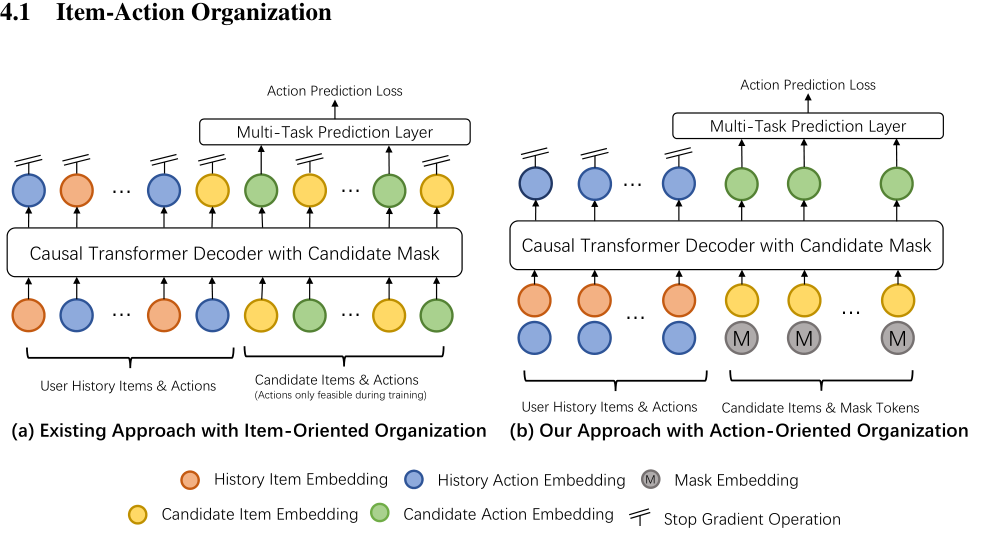
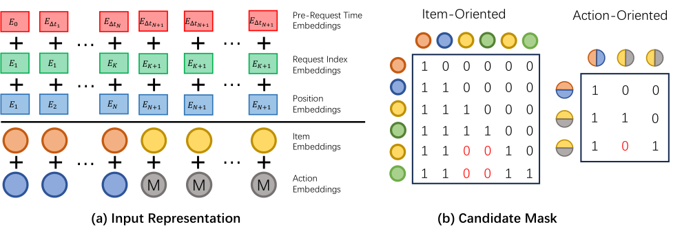

# 面向大规模生成式排序的RankGPT

> Yanhua Huang, Yuqi Chen, Xiong Cao, Rui Yang, Mingliang Qi, Yinghao Zhu, Qingchang Han, Yaowei Liu, Zhaoyu Liu, Xuefeng Yao, Yuting Jia, Leilei Ma, Yinqi Zhang, Taoyu Zhu, Liujie Zhang, Lei Chen, Weihang Chen, Min Zhu, Ruiwen Xu, Lei Zhang | RankGPT Team, Xiaohongshu Inc., Shanghai, China

生成式推荐（generative recommendation）最近已成为信息检索领域中一种有前景的范式。然而，生成式排序（generative ranking）系统在大规模工业场景中的有效性和可行性仍未得到充分研究。本文在服务于数亿用户的小红书探索发现流的排序阶段对此问题进行了研究。具体而言，我们首先考察了生成式排序如何优于当前的工业推荐系统。通过理论和实证分析，我们发现有效性的提升主要来源于生成式架构（generative architecture），而非训练范式（training paradigm）。为了促进生成式排序的高效部署，我们引入了RankGPT，一种新颖的生成式排序架构。我们通过在线A/B实验验证了我们方案的有效性和效率。结果表明，在与现有生产系统计算资源近乎相同的情况下，RankGPT在用户满意度方面取得了显著提升。

---

## 摘要

生成式推荐最近已成为信息检索领域中一种有前景的范式。然而，生成式排序系统在大规模工业场景中的有效性和可行性仍未得到充分研究。本文在服务于数亿用户的小红书探索发现流的排序阶段对此问题进行了研究。具体而言，我们首先考察了生成式排序如何优于当前的工业推荐系统。通过理论和实证分析，我们发现有效性的提升主要来源于生成式架构，而非训练范式。为了促进生成式排序的高效部署，我们引入了RankGPT，一种新颖的生成式排序架构。我们通过在线A/B实验验证了我们方案的有效性和效率。结果表明，在与现有生产系统计算资源近乎相同的情况下，RankGPT在用户满意度方面取得了显著提升。

## 1 引言

推荐系统是社交媒体平台的重要组成部分，能够使用户浏览和参与个性化物品推荐[4, 3, 7, 23]。为了平衡效率和效果，工业推荐系统通常采用级联流水线（cascade pipeline）[7, 23]，包含四个阶段，如图1（右）所示。检索（retrieval）阶段首先从数十亿物品中初步选出数万个候选物。随后是预排序（pre-ranking）阶段，执行粗略匹配，将候选集缩小到数百个。排序（ranking）阶段对每个候选物进行精确预测。最后，策略（policy）阶段基于序列信息和商业考量对数十个候选物进行重排序，以产生最终推荐。

在现代推荐系统中，排序阶段通常遵循MLP和Embedding范式[4]，其中序列建模（sequential modeling）在捕捉用户兴趣方面取得了显著成功[8, 29, 16, 10]。生成式推荐的出现进一步增强了序列方法的能力。与传统方法不同，生成式推荐将推荐问题定义为序列生成任务（sequence generation task）[13, 23]，直接从用户历史行为预测目标行为。Rajput等人[13]提出通过使用分层语义ID（hierarchical semantic IDs）量化物品来实现生成式检索。Yang等人[22]进一步引入了从粗到细的生成过程，以解决量化造成的信息损失。尽管这些方法具有新颖性，但用于排序任务的生成式推荐仍未得到充分研究，尤其是在大规模工业场景中。

本文研究大规模工业场景中的生成式排序系统。特别地，我们首先分析了生成式推荐中潜在的效果来源，然后使用现有的生成式推荐系统[23]进行实验以验证我们的假设。实验结果表明，生成式架构对实现强性能至关重要。

然而，当前的生成式架构往往效率低下，特别是在大规模场景中。为了解决这个问题，我们提出了一种新颖的架构RankGPT，以满足大规模训练和推理的需求。在小红书探索发现流（图1（左））——一个服务数亿用户的推荐系统——上进行的在线A/B实验证明了我们提出的方案的有效性和效率。

本文的主要贡献总结如下：

1. 我们识别并分析了生成式推荐效果的来源，强调了生成式架构在整体性能中的关键作用。
2. 我们提出了一种高效生成式架构，专门设计用于工业场景，包括面向动作的序列组织方法以及新颖的位置和时间偏置策略。
3. 我们进行了大规模在线A/B测试，以证明生成式排序在工业推荐系统中的有效性和可行性。

## 2 问题设定

本文研究排序阶段的生成式推荐。这里，推荐系统需要对一组预定义任务进行预测，例如预测点击概率或用户在看到候选物品时预期的停留时长。为了构建离线实验的数据集，我们从小红书探索发现流中收集了15天内数千亿的物品曝光日志。有三类输入特征：

- 类别特征（Categorical features）：用户ID、物品ID、用户历史行为、标签等。
- 数值特征（Numerical features）：用户年龄、物品发布时间、作者粉丝数等。
- 冻结嵌入（Frozen embeddings）：多模态物品嵌入、基于图的作者嵌入等。

根据先前的工作[4, 26]，数值特征通过预定义的边界离散化为类别特征，而类别特征通过嵌入表转换为稠密嵌入。预训练模型提供的冻结嵌入作为辅助信息，提供与其关联特征相关的先验知识。我们使用ROC曲线下面积（AUC）作为离线评估指标。值得注意的是，在我们的设置中，主要任务的AUC绝对提升0.0010被认为是显著的，因为这通常能为数亿在线用户的顶级指标带来0.5%的提升。

## 3 生成式推荐的效果来源

已有大量关于生成式推荐的工作[23, 22, 14, 13]。然而，生成式排序的效果，特别是在大规模工业场景中的效果，尚未得到充分探索。为了更好地理解促成生成式排序效果的因素，我们从两个角度进行实验：

1. 生成式推荐范式通过不同的底层机制与传统方法区分开来。我们特别感兴趣的是识别那些微小修改就会导致性能大幅下降的机制，因为这些可能对生成式排序方法的成功至关重要。
2. 当前的排序范式集成了几个成熟的模块，如SIM[10]和内容嵌入（content embeddings）[27, 7]。我们研究了在生成式设置中表现出显著性能差异的关键模块，为未来的研究提供了宝贵的见解。

具体来说，我们选择HSTU[23]作为基线模型来呈现上述视角的发现。默认情况下，块数为3，注意力头数为8，隐藏维度为768。每个用户序列的最大长度为480，包括历史行为和候选物品。我们在NVIDIA H20 GPU上使用混合精度训练策略。

### 3.1 生成式范式中的关键机制

与传统范式从历史行为中学习复杂的特征交互不同，生成式推荐将排序重新定义为序列转导任务（sequential transduction task）[23]。在这一背景下，生成式排序在两个重要方面存在显著差异：序列交互的方式和训练样本的组织方式。

生成式排序中序列交互的方式是自回归（auto-regressive）的。注意，HSTU仅在与候选物品对应的位置计算损失，如图2(a)所示。这种方法可以视为监督微调（supervised fine-tuning），其中用户信息和候选物品作为输入提示。现代LLM在监督微调期间采用自回归方式的一个原因是保留预训练期间获得的能力。然而，生成式排序不涉及预训练阶段。这就提出了一个问题：自回归方式对生成式排序真的必要吗？

为了研究这个问题，我们进行了两组实验。在第一组中，我们在历史行为对应的位置计算损失。我们观察到AUC下降了超过0.0100，即使只包含了少量历史位置。我们将其归因于Zhang等人[28]中描述的单轮问题（one-epoch issue），即模型从稀疏特征中学习到了错误的模式。在第二组中，我们将历史位置上的因果掩码替换为完全可见掩码。这种修改类似于T5模型[12]，其中注意力掩码最大化跨提示的特征交互。然而，这一变化导致AUC下降超过0.0015，并且随着模型规模的增大，下降变得更加显著。这些结果支持了自回归方式对生成式排序效果至关重要的结论。

传统范式中训练样本的组织方式通常是逐点（point-wise）的；也就是说，每个训练样本对应一个物品曝光日志。相比之下，生成式排序将用户的时间相邻行为分组到一个训练样本中。我们假设这种组织方式有两个潜在好处。首先，由于来自同一请求的两个曝光日志在特征（特别是用户特征）上重叠显著，在同一批次中处理它们可以提高梯度估计的稳定性。其次，我们从实际角度考虑。在大规模在线分布式训练中，样本处理的顺序并不严格遵循实际的时间顺序，这可能导致信息泄露。在这种情况下，模型可以在训练期间观察某个物品的曝光日志之前，从历史行为特征中推断出用户对该物品的偏好。生成式排序中的组织方式有助于减轻先训练后发生样本的风险。

然而，我们的实证结果并不强烈支持这两个假设。具体来说，我们使用分组训练样本但以逐点顺序训练生成式推荐器，以模拟传统训练。这种方法仅导致AUC略有下降。因此，我们得出结论，生成式推荐的效果主要来源于架构，而非训练样本的组织方式。

### 3.2 两种范式间模块效果的比较

为了比较两种范式之间模块的影响，我们进行了实验，测量了各种模块带来的性能提升。特别地，我们选择了工业排序系统中常用的四个重要模块：用于序列建模的SIM[10]、用于个性化表示学习的PPNet[3]、用于先验知识的内容嵌入[7, 27, 25]以及用于多任务学习的PLE[17]。结果表明，SIM、PPNet和PLE在两种范式中都实现了可比的改进，这表明生成式范式与这些模块是兼容的。此外，我们观察到内容嵌入在生成式范式下的AUC提升是两倍以上。我们将这种增强归因于内容嵌入的生成式训练与其在下游任务中的应用之间的架构一致性，从而使其能力得到最优利用。

我们还研究了特征工程的影响，这对工业推荐性能至关重要[6]。HSTU[23]提出移除这些特征，因为生成式推荐器能够充分表达统计模式。我们的实验表明，虽然大多数特征对生成式架构的益处微乎其微，但某些实时统计特征，特别是基于窗口的特征，在提升性能方面仍然非常有效。我们认为这些特征向模型提供了直接信号，使生成式架构能够学习复杂模式。值得注意的是，特征工程带来的显著计算开销限制了排序模型实时处理大型候选集的能力。生成式架构通过其最少的特征工程需求解决了这一限制，从而提高了推理的可扩展性。此外，KV缓存机制使生成式架构能够随着候选集大小的增加而更有效地扩展[23]。我们预计，随着计算开销的持续降低，生成式架构有潜力在未来系统中统一排序和预排序阶段。

## 4 工业场景中的高效生成式排序

前一节强调了架构在生成式排序中的重要性。它不仅对性能至关重要，还影响着未来推荐系统的整体设计。本节介绍一种新颖的生成式架构RankGPT，以实现大规模排序任务的高效训练和推理。RankGPT与现有工作在两个方面不同：物品-动作组织（item-action organization）（第4.1节）以及位置和时间偏置（position & time biases）（第4.2节）。

表1总结了我们在训练性能方面的实证结果。我们使用HSTU[23]作为基线方法。转换为面向动作的组织方式带来了78.7%的加速，而采用提出的位置和时间偏置带来了25.0%的加速。总体而言，RankGPT在训练期间实现了94.8%的总加速，同时在测试集上AUC略有提升。

| 变体 | 加速比 | AUC差异 |
|------|--------|---------|
| 基线 (HSTU) | / | / |
| + 面向动作的组织 | +78.7% | -0.0003 |
| + 提出的位置和时间偏置 | +25.0% | +0.0009 |
| + 全部 (RankGPT) | +94.8% | +0.0006 |

表1：RankGPT的消融研究。

### 4.1 物品-动作组织

传统的序列推荐方法通常将单个物品作为基本单元来构建模型[29, 8, 16, 2, 15]，我们将这种组织框架称为面向物品的架构（item-oriented architecture）。为了使这些方法适应排序任务中需要感知动作的公式化表达，HSTU[23]将动作token视为序列中的一种额外模态。如图2(a)所示，它将物品和动作交织在单个序列中，从而使模型能够根据上下文化的序列预测物品或动作。尽管这种方法可以在统一框架内支持检索和排序任务，但它为排序引入了大量开销，因为序列长度翻倍了。

为了解决这一限制，我们提出了一种新的视角：我们将物品视为位置信息，并专注于迭代预测与每个物品关联的动作，我们称之为面向动作的组织（action-oriented organization）。在这种范式中，动作成为序列生成中的基本单元，而物品作为上下文信号来指导生成过程，如图2(b)所示。这种方法专注于动作预测，在效率方面提供了显著优势。该设计将注意力机制的输入序列长度减半，将注意力成本削减了75%，线性投影成本削减了50%。

正式地，我们考虑按时间顺序排列的N个用户token $x_1, x_2, ..., x_N$ ，其中 $x_i \in \mathcal{X}$ （物品集）。对于每个物品 $x_i$ ，有一个关联的动作 $a_i \in \mathcal{A}$ （动作集），该动作发生在时间戳 $t_i$ 。因此，动作序列为 $a_1, a_2, ..., a_N$ ，对应的时间戳为 $t_1, t_2, ..., t_N$ 。在我们的设置中，模型学习逼近分布 $p(a_k|x_1, a_1, ..., x_k)$ 。为了实现面向动作的生成式排序，每个输入token同时结合了物品和动作嵌入，如图3(a)所示。对于用户历史序列中的每个位置，token嵌入由物品嵌入和动作嵌入之和得到，即 $e_i = \phi(x_i) + \psi(a_i)$ ，其中 $\phi(\cdot)$ 和 $\psi(\cdot)$ 分别表示物品和动作嵌入模块。我们的任务是预测用户在下一个候选物品上的动作。为此，候选物品的token嵌入为 $e_j = \phi(x_j) + M$ ，其中 $M$ 是掩码动作嵌入。注意，为了防止候选物之间的信息泄露，应用了候选掩码，如图3(b)右侧所示。

### 4.2 位置和时间偏置

HSTU[23]利用可学习的相对注意力偏置来编码位置和时间信息。虽然这种设计对性能至关重要[5]，但它引入了一个计算瓶颈：注意力偏置的I/O操作随序列长度呈二次方扩展，随着上下文窗口的增长会带来显著开销。这种低效性促使我们设计新的位置和时间偏置，以显著降低系统成本。具体而言，我们提出了一种全面的位置和时间嵌入设计，仅需要线性I/O操作，包括：

- **位置嵌入（Position Embeddings）**：使用可学习的位置嵌入来记录物品在用户序列中的索引，记为 $E_{\text{pe},i} = \Omega_{\text{pe}}(i)$ 。为确保训练和推理之间的一致性，同一请求内的候选物品共享相同的位置。
- **请求索引嵌入（Request Index Embeddings）**：在实践中，用户可以在单个请求中与多个物品交互。我们将属于同一请求的所有物品视为一个组，并将请求索引嵌入 $E_{\text{ri},i}$ 定义为 $\Omega_{\text{ri}}(|\{t_1, ..., t_i\}|)$ ，其中 $|\cdot|$ 表示基数。
- **请求前时间嵌入（Pre-Request Time Embeddings）**：该嵌入捕捉每个物品与前一次请求时间之间的分桶时间差，反映用户的活动水平。具体定义为 $E_{\text{rt},i} = \Omega_{\text{rt}}(\text{bucket}(t_i - \max_{t_j < t_i} t_j))$ 。

上述设计在保留位置和时序信息的同时引入了最小的训练开销。最终馈入后续网络的输入表示为：

$$
e_i^{(p,t)} = \phi(x_i) + \psi(a_i) + E_{\text{pe},i} + E_{\text{ri},i} + E_{\text{rt},i}. \qquad (1)
$$

此外，上述位置和时间嵌入的一个关键限制是时间与位置信息之间缺乏交互。为了解决这个问题，我们提出使用无参数偏置ALiBi[11]作为注意力机制中的相对位置和时间偏置。ALiBi有两个主要优点。它惩罚远距离查询-键对之间的注意力分数，惩罚随着键动作token和查询动作token之间距离的增加而增大。我们认为这一设计与用户兴趣建模的模式更加吻合。此外，ALiBi是无参数的，即它不需要 $O(N^2)$ 的内存访问开销或梯度反向传播。通过将ALiBi融合到flash注意力[21]中，我们仅产生最小的计算成本。

## 5 相关工作

### 5.1 生成式推荐

生成式推荐已成为信息检索中一种有前景的范式[13, 22, 20, 19, 1]。与传统推荐方法不同，生成式推荐旨在通过将推荐制定为序列生成任务，直接从用户历史行为中生成推荐。TIGER[13]是首个生成式检索框架。它首先通过量化物品的语义嵌入来获取物品的分层ID，然后训练一个序列到序列模型来预测下一个物品的语义ID。ColaRec[20]和LETTER[18]研究了在量化中增强协同信号的问题，以融合内容知识和协同交互。COBRA[22]通过粗到细的生成机制解决了量化造成的信息损失，实现了更具表达力的生成式建模。尽管取得了进展，但生成式排序在现实世界大规模场景中的有效性和可行性仍未得到充分探索。HSTU[23]是首个研究生成式排序任务的工作。它引入了一种交织组织方式，通过将用户动作视为一种新的模态来预测动作。相比之下，RankGPT将物品视为位置指示器，并将推荐重新定义为面向动作的生成问题。此外，我们系统地分析了生成式推荐中的效果驱动因素，为理解生成式排序范式和指导未来架构设计提供了关键见解。

### 5.2 推荐系统中的缩放定律

缩放定律（scaling laws）在自然语言处理和计算机视觉领域已得到充分建立[9, 24]，描述了模型性能与模型规模、数据集大小和计算资源等因素之间的可预测关系。在推荐系统领域，类似的缩放行为已在流水线的各个阶段被观察到并得到验证，包括检索[23, 5, 1]和排序[23, 26]。在最近的进展中，HSTU[23]成为生成式推荐中一种有前景的方法。然而，在现实世界大规模场景中部署此类模型需要仔细考虑效率问题。在本文中，我们引入了一种高效的生成式排序任务架构，同时保持了与当前工业推荐系统相当的开销。

## 6 在线实验

为了验证生成式排序在产品场景中的有效性和可行性，我们在小红书探索发现流上进行了在线实验。所有模型回溯了超过三个月的数据，并采用在线方式训练。对于对照组，我们随机选择了小红书10%的用户并应用生产排序模型。对于实验组，我们将RankGPT应用于随机选择的10%的用户。每个组包含数千万用户，组之间没有重叠。

| 指标 | 提升幅度 |
|------|---------|
| 停留时长 | +0.3345% |
| 阅读数 | +0.6325% |
| 互动数 | +1.2474% |
| 7日留存 (LT7) | +0.1481% |

表2：探索发现流场景中的在线A/B测试结果。

从离线指标来看，主要任务的AUC和GAUC[29, 3]的提升超过0.0020，而其他任务的提升在0.0005到0.0015之间。从在线指标来看，我们选择了四个指标来衡量在线性能：停留时长、阅读数、互动数和7日留存。在15天实验期内平均的在线A/B测试结果如表2所示，RankGPT在所有指标上均优于生产排序。具体而言，我们观察到RankGPT在冷启动物品上的改进尤为显著。我们认为这一改进源于RankGPT利用内容嵌入中的世界知识的能力增强。

在开销方面，RankGPT和生产排序模型需要的总体资源相当。具体而言，RankGPT的训练成本更高，但推理和存储成本更低。此外，RankGPT在P99响应时间上表现出显著改善，优于生产排序模型超过25%。这突显了测试时缩放进一步优化的潜力。

## 7 结论

在本文中，我们研究了大规模工业场景中生成式排序的有效性和可行性。通过理论分析和实证结果，我们发现生成式架构是生成式推荐效果的主要来源。我们还引入了一种新的生成式架构，名为RankGPT，它将物品视为位置信息，并专注于迭代预测用户行为，以解决现有方法中存在的效率低下问题。大规模离线和在线实验证明了我们提出的方案的有效性和效率。

## 参考文献

[1] Cai Hongru, Li Yongqi, Yuan Ruifeng, Wang Wenjie, Zhang Zhen, Li Wenjie, Chua Tat-Seng. Exploring Training and Inference Scaling Laws in Generative Retrieval // arXiv preprint arXiv:2503.18941. 2025.

[2] Chang Jianxin, Zhang Chenbin, Fu Zhiyi, Zang Xiaoxue, Guan Lin, Lu Jing, Hui Yiqun, Leng Dewei, Niu Yanan, Song Yang, et al. TWIN: TWo-stage interest network for lifelong user behavior modeling in CTR prediction at kuaishou // Proceedings of the 29th ACM SIGKDD Conference on Knowledge Discovery and Data Mining. 2023. 3785–3794.

[3] Chang Jianxin, Zhang Chenbin, Hui Yiqun, Leng Dewei, Niu Yanan, Song Yang, Gai Kun. Pepnet: Parameter and embedding personalized network for infusing with personalized prior information // Proceedings of the 29th ACM SIGKDD Conference on Knowledge Discovery and Data Mining. 2023. 3795–3804.

[4] Cheng Heng-Tze, Koc Levent, Harmsen Jeremiah, Shaked Tal, Chandra Tushar, Aradhye Hrishi, Anderson Glen, Corrado Greg, Chai Wei, Ispir Mustafa, et al. Wide & deep learning for recommender systems // Proceedings of the 1st workshop on deep learning for recommender systems. 2016. 7–10.

[5] Guo Wei, Wang Hao, Zhang Luankang, Chin Jin Yao, Liu Zhongzhou, Cheng Kai, Pan Qiushi, Lee Yi Quan, Xue Wanqi, Shen Tingjia, et al. Scaling New Frontiers: Insights into Large Recommendation Models // arXiv preprint arXiv:2412.00714. 2024.

[6] Huang Yanhua, Wang Hangyu, Miao Yiyun, Xu Ruiwen, Zhang Lei, Zhang Weinan. Neural statistics for click-through rate prediction // Proceedings of the 45th International ACM SIGIR Conference on Research and Development in Information Retrieval. 2022. 1849–1853.

[7] Huang Yanhua, Wang Weikun, Zhang Lei, Xu Ruiwen. Sliding spectrum decomposition for diversified recommendation // Proceedings of the 27th ACM SIGKDD conference on knowledge discovery & data mining. 2021. 3041–3049.

[8] Kang Wang-Cheng, McAuley Julian. Self-attentive sequential recommendation // 2018 IEEE international conference on data mining (ICDM). 2018. 197–206.

[9] Kaplan Jared, McCandlish Sam, Henighan Tom, Brown Tom B, Chess Benjamin, Child Rewon, Gray Scott, Radford Alec, Wu Jeffrey, Amodei Dario. Scaling laws for neural language models // arXiv preprint arXiv:2001.08361. 2020.

[10] Pi Qi, Zhou Guorui, Zhang Yujing, Wang Zhe, Ren Lejian, Fan Ying, Zhu Xiaoqiang, Gai Kun. Search-based user interest modeling with lifelong sequential behavior data for click-through rate prediction // Proceedings of the 29th ACM International Conference on Information & Knowledge Management. 2020. 2685–2692.

[11] Press Ofir, Smith Noah A, Lewis Mike. Train short, test long: Attention with linear biases enables input length extrapolation // arXiv preprint arXiv:2108.12409. 2021.

[12] Raffel Colin, Shazeer Noam, Roberts Adam, Lee Katherine, Narang Sharan, Matena Michael, Zhou Yanqi, Li Wei, Liu Peter J. Exploring the limits of transfer learning with a unified text-to-text transformer // Journal of machine learning research. 2020. 21, 140. 1–67.

[13] Rajput Shashank, Mehta Nikhil, Singh Anima, Hulikal Keshavan Raghunandan, Vu Trung, Heldt Lukasz, Hong Lichan, Tay Yi, Tran Vinh, Samost Jonah, et al. Recommender systems with generative retrieval // Advances in Neural Information Processing Systems. 2023. 36. 10299–10315.

[14] Ren Yuxin, Yang Qiya, Wu Yichun, Xu Wei, Wang Yalong, Zhang Zhiqiang. Non-autoregressive generative models for reranking recommendation // Proceedings of the 30th ACM SIGKDD Conference on Knowledge Discovery and Data Mining. 2024. 5625–5634.

[15] Si Zihua, Guan Lin, Sun ZhongXiang, Zang Xiaoxue, Lu Jing, Hui Yiqun, Cao Xingchao, Yang Zeyu, Zheng Yichen, Leng Dewei, et al. Twin v2: Scaling ultra-long user behavior sequence modeling for enhanced ctr prediction at kuaishou // Proceedings of the 33rd ACM International Conference on Information and Knowledge Management. 2024. 4890–4897.

[16] Sun Fei, Liu Jun, Wu Jian, Pei Changhua, Lin Xiao, Ou Wenwu, Jiang Peng. BERT4Rec: Sequential recommendation with bidirectional encoder representations from transformer // Proceedings of the 28th ACM international conference on information and knowledge management. 2019. 1441–1450.

[17] Tang Hongyan, Liu Junning, Zhao Ming, Gong Xudong. Progressive layered extraction (ple): A novel multi-task learning (mtl) model for personalized recommendations // Proceedings of the 14th ACM conference on recommender systems. 2020. 269–278.

[18] Wang Wenjie, Bao Honghui, Lin Xinyu, Zhang Jizhi, Li Yongqi, Feng Fuli, Ng See-Kiong, Chua Tat-Seng. Learnable item tokenization for generative recommendation // Proceedings of the 33rd ACM International Conference on Information and Knowledge Management. 2024. 2400–2409.

[19] Wang Ye, Xun Jiahao, Hong Minjie, Zhu Jieming, Jin Tao, Lin Wang, Li Haoyuan, Li Linjun, Xia Yan, Zhao Zhou, et al. EAGER: Two-Stream Generative Recommender with Behavior-Semantic Collaboration // Proceedings of the 30th ACM SIGKDD Conference on Knowledge Discovery and Data Mining. 2024. 3245–3254.

[20] Wang Yidan, Ren Zhaochun, Sun Weiwei, Yang Jiyuan, Liang Zhixiang, Chen Xin, Xie Ruobing, Yan Su, Zhang Xu, Ren Pengjie, et al. Content-Based Collaborative Generation for Recommender Systems // Proceedings of the 33rd ACM International Conference on Information and Knowledge Management. 2024. 2420–2430.

[21] Xu Rengan, Yang Junjie, Xu Yifan, Li Hong, Liu Xing, Shankar Devashish, Zhang Haoci, Liu Meng, Li Boyang, Hu Yuxi, et al. Enhancing Performance and Scalability of Large-Scale Recommendation Systems with Jagged Flash Attention // Proceedings of the 18th ACM Conference on Recommender Systems. 2024. 778–780.

[22] Yang Yuhao, Ji Zhi, Li Zhaopeng, Li Yi, Mo Zhonglin, Ding Yue, Chen Kai, Zhang Zijian, Li Jie, Li Shuanglong, et al. Sparse Meets Dense: Unified Generative Recommendations with Cascaded Sparse-Dense Representations // arXiv preprint arXiv:2503.02453. 2025.

[23] Zhai Jiaqi, Liao Lucy, Liu Xing, Wang Yueming, Li Rui, Cao Xuan, Gao Leon, Gong Zhaojie, Gu Fangda, He Michael, et al. Actions speak louder than words: Trillion-parameter sequential transducers for generative recommendations // arXiv preprint arXiv:2402.17152. 2024.

[24] Zhai Xiaohua, Kolesnikov Alexander, Houlsby Neil, Beyer Lucas. Scaling vision transformers // Proceedings of the IEEE/CVF conference on computer vision and pattern recognition. 2022. 12104–12113.

[25] Zhai Xiaohua, Mustafa Basil, Kolesnikov Alexander, Beyer Lucas. Sigmoid loss for language image pre-training // Proceedings of the IEEE/CVF international conference on computer vision. 2023. 11975–11986.

[26] Zhang Buyun, Luo Liang, Chen Yuxin, Nie Jade, Liu Xi, Guo Daifeng, Zhao Yanli, Li Shen, Hao Yuchen, Yao Yantao, et al. Wukong: Towards a scaling law for large-scale recommendation // arXiv preprint arXiv:2403.02545. 2024.

[27] Zhang Chao, Zhang Haoxin, Wu Shiwei, Wu Di, Xu Tong, Zhao Xiangyu, Gao Yan, Hu Yao, Chen Enhong. Notellm-2: Multimodal large representation models for recommendation // arXiv preprint arXiv:2405.16789. 2024.

[28] Zhang Zhao-Yu, Sheng Xiang-Rong, Zhang Yujing, Jiang Biye, Han Shuguang, Deng Hongbo, Zheng Bo. Towards understanding the overfitting phenomenon of deep click-through rate models // Proceedings of the 31st ACM international conference on information & knowledge management. 2022. 2671–2680.

[29] Zhou Guorui, Zhu Xiaoqiang, Song Chenru, Fan Ying, Zhu Han, Ma Xiao, Yan Yanghui, Jin Junqi, Li Han, Gai Kun. Deep interest network for click-through rate prediction // Proceedings of the 24th ACM SIGKDD international conference on knowledge discovery & data mining. 2018. 1059–1068.
