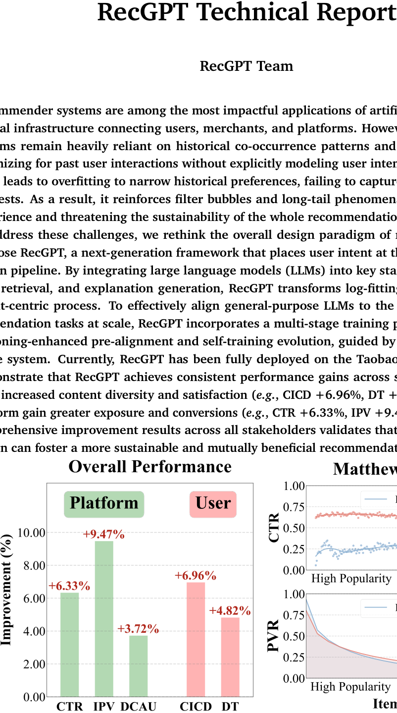
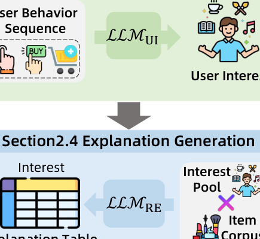
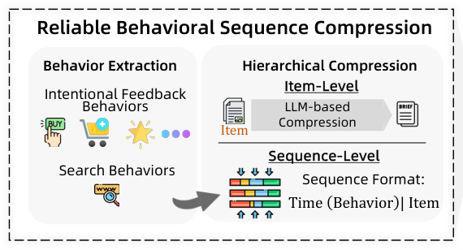
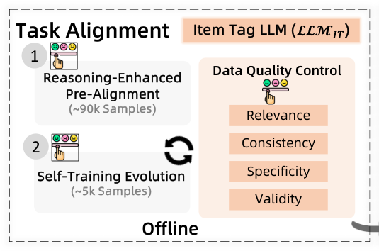
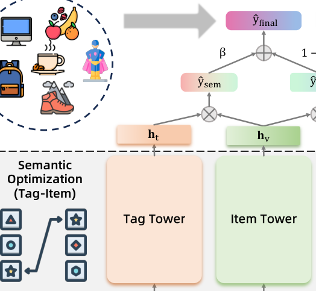
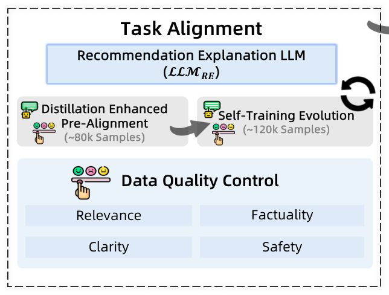
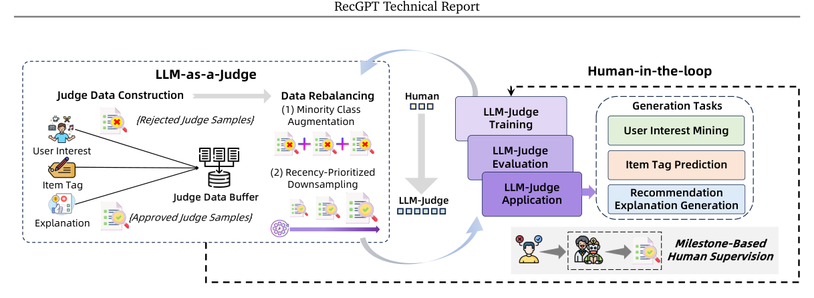
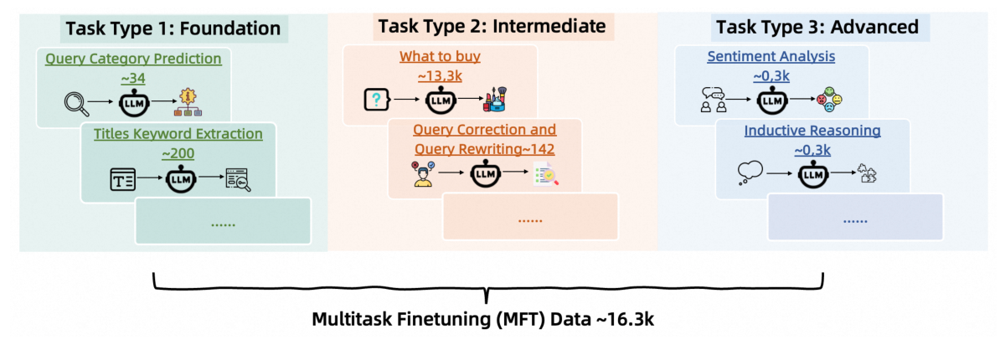

# RecGPT Technical Report（中文翻译）

本文介绍了 RecGPT Technical Report。核心内容：

关键发现：

---

> RecGPT Team
> 淘宝 / 阿里巴巴
> 2025

---

## 摘要

推荐系统是人工智能最具影响力的应用之一，作为连接用户、商家和平台的关键基础设施。然而，目前大多数工业系统仍然严重依赖历史共现模式和日志拟合目标——即优化过去的用户交互而没有显式建模用户意图。这种日志拟合方法通常导致对狭窄历史偏好的过拟合，无法捕获用户演变的和潜在的兴趣。结果，它强化了过滤气泡和长尾现象，最终损害用户体验并威胁整个推荐生态系统的可持续性。

为应对这些挑战，我们重新思考推荐系统的整体设计范式，并提出 **RecGPT**，一个将用户意图置于推荐流水线核心的下一代框架。通过将大型语言模型（LLM）集成到用户兴趣挖掘、item标签预测、item检索和解释生成的关键阶段，RecGPT 将日志拟合推荐转变为以意图为中心的过程。为了有效地将通用 LLM 与上述领域特定的推荐任务大规模对齐，RecGPT 整合了一个多阶段训练范式，结合了**推理增强的预对齐**和**自训练进化**，并由**人类-LLM 协作评判系统**引导。

目前，RecGPT 已全面部署在淘宝 App 的"猜你喜欢"场景中。在线实验表明，RecGPT 在所有利益相关者中取得了持续的性能提升：用户受益于增加的内容多样性和满意度（点击品类多样性 CICD +6.96%，用户停留时长 DT +4.82%），商家和平台获得更大的曝光和转化（点击率 CTR +6.33%，商品详情页浏览量 IPV +9.47%，日点击活跃用户数 DCAU +3.72%）。这些跨所有利益相关者的全面改进结果验证了以 LLM 驱动的以意图为中心的设计可以促进更可持续且互利的推荐生态系统。

**图 1 | RecGPT 在淘宝 APP 首页"猜你喜欢"场景中的在线性能。左图显示了 RecGPT 相比基线系统在关键指标上的整体性能提升，包括点击率（CTR）、商品详情页浏览量（IPV）、日点击活跃用户数（DCAU）、用户点击品类多样性（CICD）和用户停留时长（DT）。右图展示了 RecGPT 和基线系统在不同流行度等级的产品分组上的 CTR 和页面浏览率（PVR）分布。为保护商业机密，商业指标（如 CTR 和 PVR）已进行归一化处理。**

---

## 1 引言

推荐系统已遍布现代数字生态系统，从淘宝和亚马逊等电子商务门户到 YouTube 和 TikTok 等内容平台，从根本上改变了人们发现和消费信息的方式（Lü et al., 2012）。一个理想的推荐系统应将用户的（通常是隐式的）意图与最相关的item或内容匹配，使用户能以最小努力获得最大的体验价值（Resnick and Varian, 1997）。当这种对齐实现时，它形成了一个正向反馈循环，使所有利益相关者受益：用户享受满意的体验，商家看到销售额增长，平台获得持续的流量和收入。然而，实现这一愿景的关键在于准确推断和建模用户长长的且快速变化的行为轨迹背后的真实意图。

在过去二十年中，学术界和工业界通过不懈优化特征工程和模型架构来追求这一愿景。特征表示从手工统计特征发展到序列特征和交叉特征，再到最近的超长行为建模（Schifferer et al., 2020）。模型架构从因子分解机（Rendle, 2010）发展到深度匹配网络（Zhang et al., 2019）、图神经网络（Wu et al., 2022）以及最新的生成式 Transformer 骨干网络（Deng et al., 2025）。尽管这些努力带来了显著的商业收益，但它们仍然根本上受限于历史日志中的共现模式——它们本质上是在"从点击中学习点击"。由于缺乏对用户兴趣的显式理解，这种日志拟合方法倾向于强化相似用户已经消费过的内容，加剧过滤气泡效应（Nguyen et al., 2014; Wang et al., 2022），并进一步边缘化长尾稀疏性（即马太效应（Gao et al., 2023; Liu and Huang, 2021））。弥合这一差距需要一种新的建模范式，能够超越表面相关性，推理驱动用户行为的动机。

近年来大型语言模型（LLM）（Zhao et al., 2023）的出现，特别是那些具有强推理能力的模型，为超越纯粹的日志拟合推荐开辟了有希望的路径。得益于其广泛的世界知识、细粒度的语义理解和逐步推理能力，LLM 可以帮助准确、全面地分析用户的潜在兴趣，并显式推理用户为什么可能想要某个item。虽然越来越多的研究开始使用 LLM 来增强推荐系统，但大多数研究局限于小规模离线基准，无法应用于真实推荐环境（Wu et al., 2024; Zhao et al., 2024）。如何有效将 LLM 集成到大规摸工业推荐系统中，真正理解和挖掘用户意图——从而克服日志拟合推荐的局限性——仍然 largely 未被探索。

为填补这一空白，我们引入 **RecGPT**，一个生产级框架，将三个推理 LLM 集成到工业推荐流水线的核心，形成"用户兴趣挖掘 $\to$ item标签预测 $\to$ item检索 $\to$ 解释生成"的闭环（图 2）。具体来说，RecGPT 首先使用**用户兴趣 LLM** 全面分析用户的终身行为历史，并显式生成简洁的自然语言当前兴趣画像。第二个**item标签 LLM** 然后基于这些兴趣进行推理，生成描述用户最可能寻找的item的细粒度item标签。这些标签被注入item检索阶段，将传统的用户-item双塔匹配器扩展为用户-item-标签三塔架构。因此，只有与推断的用户意图一致的item才被传递到下游的排序和重排序级联。通过将用户行为日志转化为动态更新的意图签名，RecGPT 将候选生成从协同过滤重塑为兴趣增强过程，改善了召回相关性和长尾覆盖，而无需改变下游基础设施。最后，**推荐解释 LLM** 为最终推荐的item附加缓存的、用户友好的自然语言解释，完成了从意图发现到透明交付的闭环。

我们的主要贡献总结如下：

- RecGPT 已全面在线部署在淘宝 APP 首页的"猜你喜欢"场景中，在多个利益相关者中取得了显著的性能提升。从用户角度来看，我们的系统将 CICD 提升了 6.96%，DT 提升了 4.82%，表明有效发现了超越历史交互模式的用户潜在和多样化兴趣，有效突破了信息气泡，扩展了推荐边界。对于商家和平台，CTR (+6.33%)、IPV (+9.47%) 和 DCAU (+3.72%) 都观察到了显著的改进。
- 我们提出用三个推理 LLM 核心替换传统的日志拟合范式，覆盖用户兴趣挖掘、item标签预测和推荐解释生成。
- 我们引入多阶段训练范式，包括推理增强的预对齐和自训练进化，以及人类-LLM 协作评判系统，以实现可扩展的高质量对齐。

---

## 2 RecGPT 工作流

RecGPT 流水线由四个有序阶段组成，每个阶段由一个专门的 LLM 赋能：用户兴趣挖掘、item标签预测、item检索和个性化解释生成。这些阶段协同工作，将传统的日志拟合流水线转变为以意图为中心的过程。

### 2.1 用户兴趣挖掘

**用户兴趣 LLM (UI-LLM)** 是 RecGPT 的入口点。它接收用户的所有可用行为信号——包括点击、购买、搜索查询、收藏和浏览时长——以及用户画像数据，并生成一个结构化的**用户兴趣画像**。

**输入输出格式。** UI-LLM 的输入包括：用户画像（年龄、性别、地理位置等）、长期行为摘要（如最近购买的类别、高频搜索词）、短期行为信号（最近的点击序列）。输出是一个自然语言兴趣画像，按类别组织的偏好描述，以及推断的意图标签。

**推理增强的预对齐。** 在将通用 LLM 用于用户兴趣挖掘之前，我们使用推荐领域的特定数据进行推理增强的预对齐。这包括：(1) 行为到兴趣的映射数据——从用户行为日志中提取，由人工标注兴趣描述；(2) 思维链推理数据——要求模型逐步推理，从具体行为推断抽象兴趣。

**自训练进化。** 初始模型通过自训练进一步改进。UI-LLM 生成兴趣画像的候选，由人类评判员评估，高质量的预测被添加回训练集进行迭代优化。

### 2.2 item标签预测

**item标签 LLM (IT-LLM)** 接收 UI-LLM 生成的用户兴趣画像，并推理出一组细粒度的item标签，描述用户当前正在寻找的item类型。

**标签结构。** 标签是多层级的，包括：粗粒度类别（如"电子产品"）、细粒度属性（如"价格低于5000元"、"适合游戏"）和主题描述（如"送给男友的生日礼物"）。

**与检索链接。** 生成的标签被注入检索阶段，作为传统双塔模型的额外输入信号。

### 2.3 item检索

传统检索使用用户-item双塔架构，其中用户行为序列和item表示分别编码并通过内积匹配。RecGPT 将其扩展为**用户-item-标签三塔架构**：

- **用户塔**：编码用户行为和画像（与传统的用户表示部分相同）
- **标签塔**：编码 IT-LLM 生成的推理标签
- **item塔**：编码item特征

三塔的分数共同决定最终的检索候选。这种方式确保只有与推理出的用户意图一致的item被传递到排序阶段。

### 2.4 个性化解释生成

**推荐解释 LLM (RE-LLM)** 为最终展示给用户的每个推荐item生成自然语言解释。解释格式包括：相关性理由（"因为您最近浏览了..."），功能描述（"该产品具有以下特点..."），以及个性化陈述（"根据您的偏好..."）。

解释是预生成的并缓存的，因此在线推理时只需查表，不产生额外 LLM 开销。

---

## 3 人类-LLM 协作评判

为有效评估和持续改进 RecGPT 的输出质量，我们设计了**人类-LLM 协作评判系统**。

### 3.1 LLM-as-a-Judge

我们使用专门的评判 LLM 自动评估 UI-LLM、IT-LLM 和 RE-LLM 的输出。评判标准包括：准确性（画像/标签/解释是否准确）、相关性（是否与用户实际行为一致）、完整性（是否覆盖了所有关键方面）和可读性（自然语言输出是否流畅）。

### 3.2 人类参与循环

虽然 LLM-as-a-Judge 提供大规模自动评估，但人类评判员对边角案例提供反馈。人类评判员评估 LLM 评判的准确性，用于优化评判模型。具体流程：LLM 评判 $\to$ 人工抽检 $\to$ 校准评判标准 $\to$ 迭代改进。

---

## 4 评估

### 4.1 评估设置

我们在淘宝 APP 首页"猜你喜欢"场景进行在线 A/B 测试。流量划分为对照组（现有基线系统）和实验组（集成 RecGPT）。实验持续两周，覆盖数亿活跃用户。评估指标包括：业务指标（CTR、IPV、DCAU）、用户体验指标（CICD、DT）和 LLM 输出质量指标（人工评分）。

### 4.2 在线 A/B 测试

**表 1：RecGPT 在线 A/B 测试结果。所有指标均为百分比变化，相对于基线系统。**

| 指标 | 含义 | 提升 |
|------|------|------|
| CTR | 点击率 | +6.33% |
| IPV | 商品详情页浏览量 | +9.47% |
| DCAU | 日点击活跃用户数 | +3.72% |
| CICD | 用户点击品类多样性 | +6.96% |
| DT | 用户停留时长 | +4.82% |

所有改进在统计上显著（p<0.01）。

**图 1：左图展示了这些指标相对于基线的提升率。右图展示了跨不同流行度分组的 CTR 和 PVR 分布，表明 RecGPT 在所有分组上一致提升。**

### 4.3 人类 vs. LLM-as-a-Judge

我们比较了 LLM-as-a-Judge 与人类评判员对 RecGPT 输出质量的评估一致性。结果表明，LLM 评判与人类评判在大多数维度上具有高度一致性（Cohen's $\kappa$ > 0.8），验证了 LLM-as-a-Judge 的可靠性。

**表 2：人类与 LLM 评判员之间的评分者间一致性。**

| 任务 | 一致性 (Cohen's $\kappa$ ) |
|------|-------------------|
| 用户兴趣画像 | 0.85 |
| item标签 | 0.82 |
| 推荐解释 | 0.79 |

### 4.4 案例研究

**案例 1：兴趣发现。** 一个用户历史行为主要是美妆类，但 RecGPT 的 UI-LLM 从搜索词和浏览时长推断出其对"户外运动"的潜在兴趣，并推荐了运动装备，用户点击了推荐。

**案例 2：长尾曝光。** 一个过去主要购买热门品牌的用户，通过 IT-LLM 的细粒度标签匹配到了一个长尾小众品牌的产品，并产生了购买。

### 4.5 用户体验调查

我们进行了大规模用户调查，评估用户对 RecGPT 推荐结果的主观满意度。结果显示：
- **推荐相关性评分**：+0.23（5 分制）
- **推荐新颖性评分**：+0.41（5 分制）
- **推荐解释有帮助性评分**：+0.35（5 分制）

用户特别赞赏"推荐解释"功能，认为它增加了推荐的透明度和信任度。

---

## 5 结论、局限与未来方向

### 5.1 结论

本文提出了 RecGPT，一个以意图为中心的下一代推荐框架。通过三个推理 LLM 核心（用户兴趣挖掘、item标签预测、推荐解释生成）和人类-LLM 协作评判系统，RecGPT 将传统的日志拟合推荐转变为意图驱动的过程。在淘宝 APP 上的大规模在线部署验证了 RecGPT 在所有利益相关者中取得了显著收益。

### 5.2 局限性

1. **计算成本**：三个 LLM（即使经过优化）的推理成本高于传统方法
2. **实时性**：用户兴趣的变化可能无法立即反映在画像中（存在更新延迟）
3. **冷启动用户**：交互稀疏的用户，UI-LLM 的兴趣推理质量下降

### 5.3 未来方向

1. **多模态扩展**：将视觉、语音等多模态信息纳入意图推理
2. **端到端蒸馏**：将 LLM 的能力蒸馏到轻量级模型，降低部署成本
3. **更动态的更新**：实现实时兴趣更新机制
4. **更广泛的应用**：将 RecGPT 扩展到更多推荐场景和业务

---

## 参考文献

[1] Lü et al. Recommender systems. Physics Reports, 2012.
[2] Resnick and Varian. Recommender systems. CACM, 1997.
[3] Schifferer et al. Ultra-long behavior modeling. 2020.
[4] Rendle. Factorization machines. ICDM, 2010.
[5] Zhang et al. Deep learning for matching. 2019.
[6] Wu et al. Graph neural networks in recommendation. 2022.
[7] Deng et al. OneRec: Unifying retrieve and rank. 2025.
[8] Nguyen et al. Filter bubble effects. 2014.
[9] Wang et al. Filter bubbles in recommender systems. 2022.
[10] Gao et al. Matthew effects in recommendation. 2023.
[11] Liu and Huang. Long-tail recommendation. 2021.
[12] Zhao et al. Large language models. 2023.
[13] Wu et al. LLM-enhanced recommender systems. 2024.
[14] Zhao et al. LLM for recommendation. 2024.

---

## 附录

### A 贡献者

RecGPT 由淘宝技术团队开发和维护。核心贡献者包括推荐算法、LLM 微调、工程部署和评估团队。

### B 提示词（Prompts）

我们列出了 RecGPT 中三个 LLM 核心使用的关键提示词模板（略，具体内容参见原始技术报告第 38-39 页）。

### C 课程学习多任务微调的实现细节

RecGPT 使用课程学习策略进行多任务微调。训练阶段分为：第一阶段在通用推荐数据上预训练；第二阶段在推理增强数据上训练；第三阶段使用自训练数据迭代优化。使用 DeepSpeed 和混合精度训练进行高效扩展。（详细超参数设置参见原始技术报告第 40-41 页）
