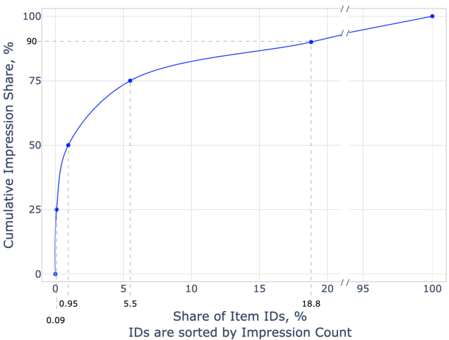
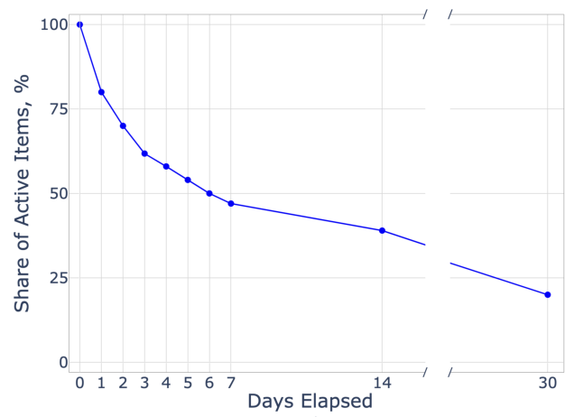
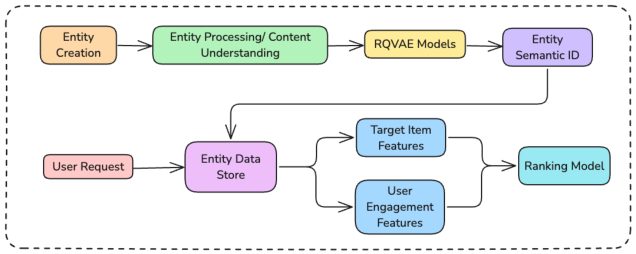
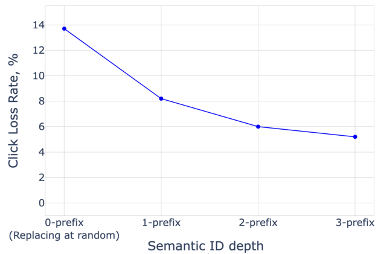
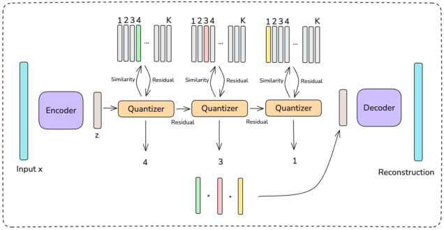
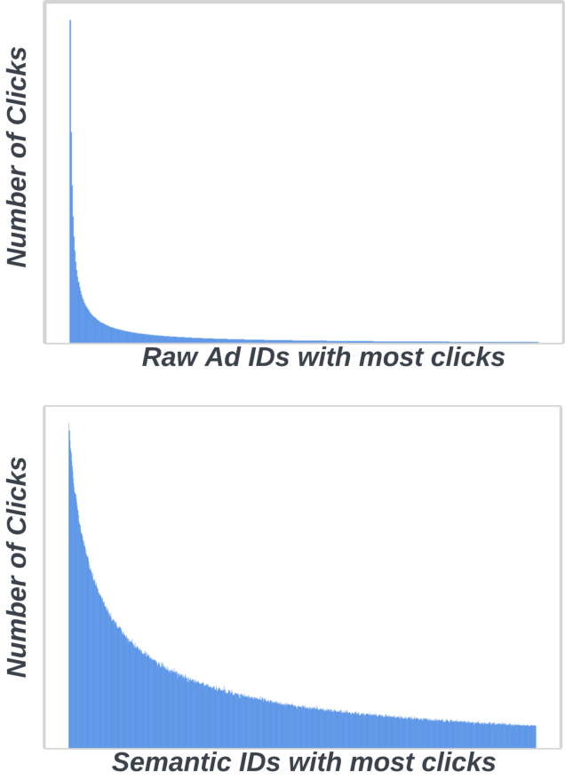

# 使用语义ID增强推荐系统中的嵌入表示稳定性

> Carolina Zheng*,1, Minhui Huang†, Dmitrii Pedchenko†, Kaushik Rangadurai†, Siyu Wang†, Gaby Nahum†, Jie Lei†, Yang Yang†, Tao Liu†, Zutian Luo†, Xiaohan Wei†, Dinesh Ramasamy†, Jiyan Yang†, Yiping Han†, Lin Yang†, Hangjun Xu†, Rong Jin†, Shuang Yang† | *Columbia University, †AI at Meta (1工作于2024年在Meta实习期间完成)

在线内容的指数级增长给工业推荐系统中基于ID的模型带来了重大挑战，包括极高的基数（cardinality）和动态增长的ID空间、高度倾斜的交互分布，以及由于自然ID生命周期（例如新ID的诞生和旧ID的退役）导致的预测不稳定性。为了解决这些问题，许多系统依赖随机哈希（random hashing）来处理ID空间并控制相应的模型参数（即嵌入表）。然而，这种方法引入了数据污染——多个ID共享同一嵌入，导致模型性能下降和嵌入表示不稳定。

本文审视了这些挑战，并引入了语义ID前缀n-gram（Semantic ID prefix ngram），一种新颖的token参数化技术，显著提升了原始语义ID（Semantic ID）的性能。语义ID前缀n-gram通过基于内容嵌入对物品进行分层聚类来创建语义上有意义的碰撞，而非随机分配。通过广泛的实验，我们证明语义ID前缀n-gram不仅解决了嵌入不稳定性问题，还显著改进了尾部ID建模、减少了过拟合并缓解了表示漂移。我们进一步强调了语义ID前缀n-gram在上下文化用户历史记录的基于注意力的模型中的优势，展示了显著的性能提升。我们还报告了将语义ID集成到Meta生产广告排序系统中的经验，在在线部署中带来了显著的性能提升和增强的预测稳定性。

---

## 摘要

在线内容的指数级增长给工业推荐系统中基于ID的模型带来了重大挑战，包括极高的基数和动态增长的ID空间、高度倾斜的交互分布，以及由于自然ID生命周期导致的预测不稳定性。为了解决这些问题，许多系统依赖随机哈希来处理ID空间并控制相应的模型参数。然而，这种方法引入了数据污染——多个ID共享同一嵌入，导致模型性能下降和嵌入表示不稳定。本文审视了这些挑战，并引入了语义ID前缀n-gram，一种新颖的token参数化技术，显著提升了原始语义ID的性能。语义ID前缀n-gram通过基于内容嵌入对物品进行分层聚类来创建语义上有意义的碰撞，而非随机分配。通过广泛的实验，我们证明语义ID前缀n-gram不仅解决了嵌入不稳定性问题，还显著改进了尾部ID建模、减少了过拟合并缓解了表示漂移。我们进一步强调了语义ID前缀n-gram在上下文化用户历史记录的基于注意力的模型中的优势，展示了显著的性能提升。我们还报告了将语义ID集成到Meta生产广告排序系统中的经验，在在线部署中带来了显著的性能提升和增强的预测稳定性。

关键词：推荐系统、内容理解、表示学习、向量量化

## 1 引言

物品推荐涉及许多信号丰富的特征，包括对应于物品ID的类别特征。原始物品ID通常被映射到嵌入向量，然后由基于深度学习的模型架构（如广泛部署的深度学习推荐模型（DLRM））进一步处理（Covington等人，2016；Naumov等人，2019）。然而，在工业级在线环境中，学习物品嵌入表示时出现了一些关键的数据相关挑战。特别是：物品基数（item cardinality），即物品总数庞大；曝光倾斜（impression skew），即只有少数物品构成了大多数用户曝光或转化（Milojević，2010）；以及ID漂移（ID drifting），即大多数物品在短时间内进入和离开系统（Gama等人，2014）。

一种流行且简单的学习嵌入表示的方法是随机哈希，其中原始物品ID被随机哈希以共享同一嵌入（Zhang等人，2020）。由于物品基数大以及嵌入表大小的系统约束，哈希被广泛使用。然而，随机哈希和ID漂移共同导致模型在长时间训练时出现不良的嵌入表示不稳定性。这是由于随机哈希碰撞的性质，导致嵌入权重的梯度更新矛盾。此外，随着物品因ID漂移而随时间变化，从旧物品中学到的知识会丢失，新物品的嵌入权重基本上是随机的。该方法对于曝光次数少的物品（由于曝光倾斜，这类物品占大多数）效果不佳。

为了缓解这些缺点，需要一个稳定的ID空间。稳定的ID空间理想地确保学习到的嵌入表示随着模型从更多数据中学习而具有稳定的含义。在这项工作中，我们研究了一种最近提出的称为语义ID（Singh等人，2023；Rajput等人，2024）的物品表示方法，作为稳定ID空间的候选方案。语义ID基于从物品的文本、图像或视频内容中学习到的语义相似性的分层聚类来派生物品ID。给定物品的语义ID通过参数化方案映射到嵌入表示。重要的是，语义ID的ID空间是先验固定的且具有语义含义——这意味着它可以解决嵌入表示不稳定性问题。然而，在推荐建模中使用语义ID的一个挑战是定义从其聚类分配到嵌入表的映射。

本文的主要贡献如下：

- 通过在Meta生产广告排序模型的简化版本上进行实验，我们加深了对语义ID如何改善嵌入表示稳定性的实证理解。我们进一步提出了语义ID前缀n-gram（Semantic ID prefix-ngram），一种在语义ID之上的新颖token参数化技术，与（Singh等人，2023）中引入的原始语义ID相比带来了显著的性能提升。
- 我们根据物品数量（物品基数）、大多数物品曝光次数少（曝光倾斜）以及物品在系统中的短生命周期（ID漂移）来刻画物品数据分布，并解释了它们与嵌入表示稳定性的联系。
- 我们描述了将语义ID前缀n-gram产品化为Meta生产系统中的稀疏特征和序列特征的过程。我们展示了添加这些特征带来的在线性能提升和在线预测稳定性的改善。

在Meta广告排序数据的离线实验中，我们表明与随机哈希相比，语义ID改善了泛化能力并且对分布漂移不那么敏感。证实了我们关于曝光倾斜的假设，我们发现语义ID的大部分收益来自物品分布的长尾部分。我们表明，通过纳入分层聚类信息，所提出的前缀n-gram对语义ID的有效性至关重要。我们还证明，语义相似性在离线和在线场景中都转化为预测相似性（第6.3节和第7.4节）。此外，当纳入用户物品交互历史的上文化模型中时，语义ID带来了超额的收益。

在在线场景中，我们描述了在Meta生产广告推荐系统中实施语义ID前缀n-gram特征的过程，这些特征按特征重要性是顶级的稀疏特征，并带来了0.15%的在线性能提升。最后，我们发现纳入语义ID特征显著降低了模型对同一物品的预测方差。这对于确保广告商对Meta推荐系统的信任并提高最终物品排序的稳定性至关重要。

剩余部分组织如下：第2节解释相关工作。第3节提供排序模型的概述。第4节介绍语义ID和token参数化。第5节解释三个物品曝光分布挑战。第6节描述离线实验。第7节描述Meta的语义ID产品化及在线实验。第8节总结。

## 2 相关工作

**推荐中的物品表示** 许多现代深度学习推荐模型使用训练好的嵌入来表示类别（"稀疏"）特征（Covington等人，2016；Naumov等人，2019；Naumov，2019）。解决高物品基数的一个简单方案是使用随机哈希（Weinberger等人，2009），但随机哈希碰撞可能是不期望的。一种选择是修改哈希过程。在这一类别下，无碰撞哈希（Liu等人，2022）通过动态释放已退役物品的嵌入内存来为每个物品引入独立嵌入。双重哈希（Zhang等人，2020）利用两个独立的哈希函数来减少内存使用，但仍然存在随机碰撞。学习哈希方法（Wang等人，2017）通过训练基于ML的哈希函数来专注于保持相似性。也有工作通过对比学习或聚类来解决曝光倾斜问题（Yao等人，2021；Chang等人，2024）；我们将这些视为互补方法。我们采取设计稳定ID空间的整体方法，以最小化哈希需求并直接解决嵌入表示漂移问题。

**稳定嵌入表示** 稳定ID受到NLP中token化方法的启发，该方法学习一个固定的词汇表来表示语言建模中的文本（Sennrich，2015；Kudo，2018；Devlin，2018）。在为物品推荐设计token化方案时，Hou等人（2023）提出对从物品内容理解模型学习到的嵌入进行向量量化；Qu等人（2024）引入了一个掩码向量量化器，将协同过滤模型学习到的表示迁移到生成式推荐器。语义ID在（Singh等人，2023；Rajput等人，2024）中同时被引入，基于（Hou等人，2023）并使用RQ-VAE进行量化，分别展示了其在泛化性能和序列推荐中的优势。在这项工作中，我们将语义ID作为我们的稳定ID方法，并分析其在解决在线物品推荐中三个挑战方面的有效性。

## 3 排序模型概述

推荐问题被表述为一个分类任务，其中数据点是与物品曝光或转化相关联的用户侧和物品侧特征，以及一个指示用户是否对该物品进行了交互或转化的二值标签。我们现在简要概述排序模型架构。

### 3.1 模型

推荐系统遵循基于DLRM的深度神经网络架构（Covington等人，2016；Naumov等人，2019）。该模型由三个堆叠部分组成。首先是信息聚合部分，其中稀疏（即类别）特征、稠密特征和基于用户历史的特征被独立处理。每个模块的输出是一个嵌入向量列表。其次，这些嵌入被拼接成一个单一列表，进入交互层，在该层中对所有向量对进行点积（或高阶交互）。第三，交互层的输出通过MLP进行变换以产生logit分数，并通过sigmoid函数输出概率。模型使用交叉熵损失进行训练。

在本文的剩余部分，我们关注模型的信息聚合部分。

**嵌入模块** 令 $I$ 为系统中原始ID的总数， $[1..N]$ 表示从1到N的整数。嵌入表是一个矩阵 $E \in \mathbb{R}^{H \times d_m}$ ，其中 $d_m$ 是嵌入维度， $H$ 是嵌入数量。令 $f = (f_1, ..., f_G) : [1..I] \to [1..H]^G$ 为一个嵌入查找函数，将原始ID映射到 $G$ 个嵌入表行索引。那么对于每个原始ID $x \in [1..I]$ ，稀疏模块查找嵌入行 $e_{f_1(x)}, ..., e_{f_G(x)}$ 并通过求和池化产生单个输出嵌入 $e_f(x) := \sum_{i=1}^G e_{f_i(x)}$ 。

**稀疏模块** 稀疏特征是一个原始ID的集合 $x := \{x_1, ..., x_n\}$ 。例如，这可以是给定物品所属的一组 $n$ 个产品类别ID。我们通常通过对组成的原始ID的嵌入 $e_f(x_i)$ 进行求和池化来产生单个嵌入 $e_f(x)$ 。

**用户历史模块** 我们将用户的物品交互历史建模为稀疏特征序列 $x^u := (x^u_1, ..., x^u_T)$ 和对应的交互时间戳。处理这些特征时，由于物品数量和序列长度 $T$ 的限制，存在系统约束。我们包含最多三个月的物品交互历史，这使模型需要处理的物品基数超过十亿。用户历史模块在特征被进一步下游处理之前对其进行上下文化至关重要。下面描述架构。

首先，我们使用稀疏模块嵌入每个稀疏特征 $x^u_i$ 并获得学习到的时间戳嵌入；它们的和为 $e_f^u(x^u_i)$ 。令 $X = [e_f^u(x^u_1); ...; e_f^u(x^u_T)]^\intercal \in \mathbb{R}^{T \times d_m}$ 表示得到的编码。然后我们通过聚合模块对该嵌入序列进行上下文化。我们使用以下三种聚合模块架构之一：Bypass、Transformer和池化多头注意力（PMA），这些在附录A中定义。

### 3.2 指标

**归一化熵** 我们通过归一化熵（NE）来衡量模型性能，定义为模型交叉熵除以从预测数据平均正标签频率的交叉熵。NE方程为：

$$
\text{NE} = \frac{-\frac{1}{N}\sum_{i=1}^N(y_i \log(p_i) + (1-y_i)\log(1-p_i))}{-(\bar{p}\log(\bar{p}) + (1-\bar{p})\log(1-\bar{p}))}, \qquad (1)
$$

其中 $N$ 是训练样本数， $y_i \in \{0, 1\}$ 是样本 $i$ 的标签， $p_i$ 是模型对样本 $i$ 的预测， $\bar{p} = \frac{\sum_{i=1}^N y_i}{N}$ 。值越低越好。

## 4 语义ID与参数化

语义ID的主要动机是设计一个高效的聚类模式来表示物品，允许语义共享的物品之间进行知识共享。直观地说，如果我们有数百个关于披萨的广告被不同用户点击，我们希望涉及其中一个广告的样本能够从其他广告的表示中获取信息。我们精心设计语义ID，以潜在地解决第5节中描述的物品基数、曝光倾斜和ID漂移等数据相关挑战。与基于随机聚类的嵌入表示相比，基于语义的表示可能随时间更加稳定。基于语义的聚类还将允许尾部物品从更多训练样本中学习。已经离开系统的物品的知识也可以被利用，新物品的嵌入权重不必从头学习。我们在第6节中实证研究了这些假设。

首先，我们在第4.1节中概述语义ID。然后我们在第4.2节中描述token参数化。这一步对于将语义ID纳入推荐模型至关重要。

### 4.1 概述

语义ID分两个阶段为物品学习：首先，对物品的文本、图像或视频应用内容理解模型以生成稠密内容嵌入。然后，在内容嵌入上训练一个RQ-VAE（Zeghidour等人，2021）以获得每个物品的向量量化，表示为从粗到细离散码的序列，称为该物品的语义ID。

令 $L$ 为层数（即序列长度）， $K$ 为码本大小（即每层的聚类数）。RQ-VAE由一个编码器组成，将内容嵌入 $x \in \mathbb{R}^D$ 映射到连续潜在表示 $z \in \mathbb{R}^{D'}$ ；一个残差量化器，将 $z$ 量化为一系列离散码 $c := (c_1, ..., c_L) \in \mathcal{K}^L$ ；以及一个解码器，从 $c$ 重构 $x$ 。这是通过将每一层 $l$ 与一个码本 $\{v^l_k\}_{k=1}^K$ 关联来实现的。离散码序列是分层的： $c_l$ 对应于码本向量 $v^{c_l}_l$ ，它近似 $r_l$ ，即 $z$ 在递归应用来自层 $(l-1)$ 到 $1$ 的码本向量后的剩余残差，即：

$$
r_l := z - \sum_{i=1}^{l-1} v^{c_i}_i, \qquad c_l := \arg\min_c \|v^l_c - r_l\|_2. \qquad (2)
$$

在第4.2节中，我们提供了关于RQ-VAE分层聚类性质的更多直觉，以及它如何指导token参数化的选择。

RQ-VAE使用两个损失项进行训练：一个重构损失和一个鼓励残差与码本向量彼此接近的损失：

$$
\mathcal{L}_{\text{RQ-VAE}}(x) = \|x - \text{dec}(c)\|^2 + \sum_{l=1}^L \beta\|r_l - \text{sg}(v^{c_l}_l)\|^2 + \|\text{sg}(r_l) - v^{c_l}_l\|^2,
$$

其中 $\text{dec}(c)$ 是对码应用解码器的结果， $\text{sg}(\cdot)$ 对应停止梯度算子， $\beta$ 是一个超参数，在实验中我们设为0.5。语义ID定义为由编码器和残差量化器产生的离散码序列 $(c_1, ..., c_L)$ 。

### 4.2 Token参数化

在我们的实验中，我们对每个层级使用相同的码本大小，总共产生 $K^L$ 个聚类。RQ-VAE的一个重要特性是它产生分层聚类。为简单起见假设 $L=3$ ，一个原始物品ID被映射到序列 $(c_1, c_2, c_3)$ 。向量量化的精度随着从第一个token $c_1$ 移动到更深层token $c_2$ 再到 $c_3$ 而增加。第一个token $c_1$ 表示最粗粒度的桶：例如，所有与食物相关的广告。第二个token $c_2$ 细化此信息，例如 $(c_1, c_2)$ 可能表示所有与披萨相关的广告。最后一个token $c_3$ 进一步细化此信息，例如 $(c_1, c_2, c_3)$ 可能表示所有与披萨相关且用特定语言（如英语）撰写的广告。

因此，我们可以控制推荐模型从语义ID接收的信息量和结构。值得注意的是，提供最细粒度的信息（所有可能的 $(c_1, c_2, ..., c_L)$ 元组）通常由于可能组合的高基数而不可行。因此，在token参数化的基数和模型从语义ID接收的信息量之间存在权衡。

| Token参数化 | $p(c_1, ..., c_L; H)$ |
|-------------|----------------------|
| Trigram | $[K^2 c_1 + K c_2 + c_3]$ |
| Fourgram | $[K^3 c_1 + K^2 c_2 + K c_3 + c_4]$ |
| All bigrams | $[K^2 \times (i-1) + K c_i + c_{i+1}, \text{ for } i \text{ in } [1..L-1]]$ |
| Prefix-ngram | $[\sum_{t=1}^i K^{i-t}(c_t+1)-1, \text{ for } i \text{ in } [1..n]]$ |

表1：Token参数化技术

令 $s(x) : [1..I] \to \mathcal{K}^L$ 为语义ID查找函数，将原始ID映射到由RQ-VAE学习的语义ID。考虑到token的分层性质，我们必须指定一个将语义ID映射到嵌入表行的token参数化 $p(c; H) : \mathcal{K}^L \to [1..H]^G$ 。表1定义了几种可能的参数化。当语义ID基数大于嵌入大小时，应用模哈希函数。当存在多个ID时，添加移位因子以避免不同位置之间的碰撞。在所有参数化技术中，只有前缀n-gram包含来自不同粒度的所有可能的元组。

| RQ-VAE $K \times L$ | Token参数化 | 训练NE增益 |
|---------------------|-------------|------------|
| [2048] $\times$ 3 | Trigram | $-0.028\%$ |
| [2048] $\times$ 4 | Fourgram | $-0.035\%$ |
| [2048] $\times$ 4 | All bigrams | $-0.091\%$ |
| [512] $\times$ 3 | Prefix-3gram | $-0.034\%$ |
| [1024] $\times$ 3 | Prefix-3gram | $-0.097\%$ |
| [2048] $\times$ 3 | Prefix-3gram | $-0.141\%$ |
| [2048] $\times$ 5 | Prefix-5gram | $-0.208\%$ |
| [2048] $\times$ 6 | Prefix-6gram | $-0.215\%$ |

表2：不同token参数化技术的NE性能

表2总结了不同token参数化下的模型性能。我们得出以下结论：i）前缀n-gram是最佳参数化。这表明在嵌入表映射中纳入聚类的分层性质是有效性的必要条件，因为它比平坦映射允许在更多物品之间进行知识共享；ii）增加前缀n-gram的深度改善了NE性能；iii）增加RQ-VAE基数改善了NE性能。

## 5 物品曝光分布问题

在本节中，我们讨论在Meta广告排序中给推荐建模带来挑战的数据分布方面，以及我们如何通过使用语义ID来解决这些问题。

**物品基数** 对于某些特征，例如目标物品，模型考虑的独特物品数量 $I$ 可能远大于稀疏模块中可行的嵌入表大小 $H$ 。在这种情况下，映射函数 $f(x)$ 引入了碰撞：两个或多个原始ID将映射到同一行。映射函数 $f(x)$ 通常选择为简单哈希。由于初始原始ID在物品创建时随机生成，由此产生的碰撞本质上是随机的。这种随机碰撞会对嵌入的表示质量产生负面影响，并成为跨物品有效知识共享的障碍。

**曝光倾斜** 对于目标物品特征，训练数据中的物品分布高度倾斜。图2显示，在我们的系统中，一小部分物品主导了物品曝光分布：按受欢迎程度排序物品时，前0.1%的"头部"物品拥有全部物品曝光的25%，接下来的5.5%的"躯干"物品拥有累计曝光的50%，而剩余的94.4%的"尾部"物品占据剩余的25%曝光。

由于尾部物品的训练样本很少，学习泛化良好的嵌入表示 $e(x)$ 可能具有挑战性。随机哈希不允许头部和躯干物品有效地与语义相似的尾部物品共享知识，因为几个物品到单个嵌入的分配是随机的。

**ID漂移** 现有的物品ID空间高度动态，大量旧物品退役（图3）和新物品进入系统。我们将系统中的这种物品分布漂移称为"原始ID漂移"。原始ID漂移现象源于在线推荐系统的性质，其中每天都有新广告创建，且大多数广告的生命周期相对较短。

作为副产品，基于随机哈希的推荐模型会随时间经历严重的嵌入表示漂移：随着物品进入和退出系统，给定的嵌入 $e$ 在不同时间代表不同的物品。

**使用语义ID的物品表示** 我们假设从原始ID切换到语义ID可以有效地解决上述问题。

当广告商向系统引入新广告 $x$ 并退役旧广告 $y$ 时，新广告的细粒度内容细节可能与退役广告不同，但产品的广泛语义类别通常保持不变。因此，新广告和退役广告的语义ID将匹配（或至少共享一个前缀）。因此，只要广泛的语义类别在时间上保持稳定，语义ID空间中的物品曝光分布与原始ID空间相比漂移要小得多。

类似地，如果尾部物品 $x$ 与头部或躯干物品 $y$ 具有相似的内容，它们的语义ID将匹配（或至少共享一个前缀）。由此产生的语义ID空间中的物品曝光分布与原始ID空间相比表现出更少的倾斜（见附录B）。

在上述两种情况下，嵌入 $e(x)$ 和 $e(y)$ 将相等（或相似，如果语义ID仅共享一个前缀）。这是模型将知识从具有许多训练样本的物品 $y$ 转移到物品 $x$ 的一种方式。总结来说，语义概念的时间稳定性导致语义ID编码的稳定性，这缓解了模型的嵌入表示不稳定性。

## 6 离线实验

为了研究我们的假设——语义ID相较于基线物品表示方法的优势，我们进行了一系列离线实验。

我们使用Meta生产广告排序模型的简化版本，保留所有稠密特征和用户物品交互历史，但仅在稀疏模块中包含目标物品（并移除约100个其他稀疏特征）。我们使用来自四天时间窗口的生产用户交互数据进行训练，顺序处理训练数据并训练一个epoch。我们在下一天数据的前六小时上评估模型。

### 6.1 基线

在第5节中，我们概述了在设计基于嵌入的物品表示的良好嵌入查找函数 $f(x)$ 时与数据相关的挑战和机遇。我们描述两种基线方法——独立嵌入（IE）和随机哈希（RH）——并将它们与语义ID进行比较。

**独立嵌入** 每个原始ID获得自己的嵌入表行， $I = H$ 且 $f_{\text{IE}}(x) := x$ 。虽然在生产场景中由于系统约束而不现实，但我们考虑此模型用于说明目的。评估期间，训练中未见过的ID被映射到随机初始化的未训练嵌入。

**随机哈希** 在 $I \approx a \cdot H$ 其中 $a > 1$ 的情况下，我们可以将原始ID随机哈希到嵌入表行， $f_{\text{RH}}(x) := h(x)$ ，其中 $h(x) : [1..I] \to [1..H]$ 是标准哈希函数（如模哈希）之一。这产生平均碰撞因子为 $a$ 的随机碰撞。

**语义ID** 物品的内容嵌入从多模态图像和文本基础模型获得。该基础模型使用图像和文本对齐目标（Radford等人，2021）在大型物品训练集上进行了预训练。然后对过去三个月的所有目标物品的内容嵌入训练RQ-VAE，其中 $L=3$ 和 $K=2048$ 。我们使用第4.2节中的前缀3-gram参数化 $f_{\text{SemID}} = p \circ s$ 。

第6.2节和第6.3节的分析聚焦于目标物品稀疏特征。我们使用上述三种嵌入查找函数训练三个版本的推荐模型。物品嵌入表的大小对于IE等于物品总数，对于RH和SemID设置为较小的大小，平均碰撞因子为3。用户历史特征使用随机哈希映射。

在第6.4节中，我们将语义ID用于用户历史特征，并研究其对聚合模块架构的影响。物品交互历史序列长度固定为约100。我们填充或截断用户历史以匹配所需长度。

### 6.2 分段分析

为了理解曝光倾斜对每种方法的影响，我们根据物品在训练期间的曝光次数对数据进行分段。我们按曝光次数对所有物品排序。与之前一样，我们根据物品在排序顺序中是否产生25%、75%或100%的累计曝光计数，将物品分段为头部、躯干和尾部物品。由于曝光倾斜，属于头部、躯干或尾部物品的百分比分别为0.1%、5.5%和94.4%。我们还在仅在评估期间出现且在训练期间未见的新物品段上进行评估。三种物品表示方法的性能如表3a所示。

与基线相比，语义ID改善了尾部物品的泛化能力，对头部物品NE中性，对躯干物品略微有益。由于这也是相对于独立嵌入方法而言的，语义ID不仅在聚类方面优于随机哈希，而且我们发现目标物品特征受益于基于语义的知识共享。

| | 评估NE | SemID NE增益 vs. |
|----------------|--------|-------------------|
| 累计曝光百分比 | 物品百分位 | RH | IE | SemID | RH | IE |
| 25% (头部) | 0.1 | 0.80105 | 0.80101 | 0.80108 | 0.00% | 0.01% |
| 75% (躯干) | 5.6 | 0.83589 | 0.83583 | 0.83580 | -0.01% | -0.00% |
| 100% (尾部) | 100 | 0.83904 | 0.83886 | 0.83872 | -0.04% | -0.02% |
| 训练中见过的物品 | | 0.82626 | 0.82612 | 0.82600 | -0.03% | -0.02% |
| 新物品 | | 0.83524 | 0.83453 | 0.83180 | -0.41% | -0.33% |
| 所有物品 | | 0.82663 | 0.82645 | 0.82621 | -0.05% | -0.03% |

表3a：三种物品表示方法在各物品段上的性能。评估NE（越低越好）。语义ID实现了对尾部和新冷启动物品的知识迁移。

具体来说，知识共享通过共享的嵌入权重视发生，这些权重接收语义相关物品的更新。知识共享的好处在新物品段上最大，SemID相对于RH和IE都取得了较大的增益（分别为-0.41%和-0.33%）。新物品使用训练中见过的语义相似物品的预训练权重进行预测，而不是使用不相关的权重（RH）或未训练的权重（IE）。

为了衡量嵌入表示漂移对模型性能的影响，我们在训练数据上但在两个不同的时间段上评估训练好的模型。我们取训练epoch结束前42-48小时的NE并减去训练最后六小时的NE。较小的值表明由ID漂移引起的嵌入表示漂移对模型拟合的影响较小。这是因为我们的模型按时间顺序训练一个epoch，因此最终模型在训练结束时学会拟合最近的训练时间段。结果在表3b中。

| | 累计曝光 | RH | IE | SemID |
|-------------|---------|------|------|--------|
| 25% (头部) | | 0.0057 | 0.0065 | 0.0059 |
| 75% (躯干) | | 0.0087 | 0.0075 | 0.0076 |
| 100% (尾部) | | 0.0128 | 0.0103 | 0.0106 |
| 所有物品 | | 0.0083 | 0.0074 | 0.0073 |

表3b：对分布漂移的敏感性： $\text{NE}[t_0, t_1] - \text{NE}[t_0+42h, t_1+42h]$ 。越低越好。

独立嵌入方法相比随机哈希具有更小的性能差距。这突显了随机哈希受ID漂移的影响——嵌入表示随时间推移失去表示较旧物品的能力，因为权重使用新物品样本进行更新。相比之下，语义ID匹配了独立嵌入的性能，表明其学习到的表示随时间更加稳定。

我们推测，这种改进的表示稳定性还允许模型在更长的训练周期上更好地泛化，其中ID漂移变得更加明显。我们在20天的时间内训练RH和SemID模型，并将它们与仅在该时间段最后四天训练的对应模型进行比较。表4中的结果显示，与随机哈希相比，语义ID的性能在更长周期内随训练数据的增加更好地扩展。

| | RH | Semantic ID |
|-------------|------|-------------|
| 评估NE增益 | $-0.18\%$ | $-0.23\%$ |

表4：使用20天数据对比4天数据训练的NE改善。

### 6.3 物品表示空间

为了更深入地理解物品嵌入表示，我们从每个训练好的模型中提取学习到的嵌入权重。可以将随机哈希和语义ID视为两种划分原始物品ID语料库的不同方式。我们希望检验语义ID产生的基于语义的划分是否比随机哈希产生的随机划分更适合推荐问题。

当多个物品被分配到相同的划分时，它们被嵌入查找模块映射到相同的嵌入。我们将这个嵌入向量视为独立嵌入模型学习的每个物品嵌入的摘要。虽然我们在本文中为说明目的拟合了独立嵌入模型，但在行业级别的设置中IE是不切实际的。具有较低划分内嵌入方差和较高划分间距离的划分可以被视为对独立嵌入更有效的摘要。我们计算IE模型学习的嵌入的RH和SemID划分的这些指标。

我们将本实验的碰撞因子设为5。因此，RH和SemID划分的结果聚类平均包含5个物品。然而，由于语义ID是由RQ-VAE模型学习的潜在码，聚类大小高度可变。我们计算两组语义ID聚类的指标：每个聚类4-10个物品的小聚类和每个聚类包含数千个物品的前1,000个聚类。表5包含平均方差和平均成对距离，括号内为标准差。指标在各嵌入维度上取平均以产生用于比较的单一标量。

| | 方差 | 成对距离 |
|-------------|------|---------|
| 随机哈希 | $1.52 \times 10^{-3}\ (8.0 \times 10^{-4})$ | $0.22\ (0.04)$ |
| SemID (小聚类) | $1.31 \times 10^{-3}\ (1.0 \times 10^{-3})$ | $0.24\ (0.09)$ |
| SemID (前1,000) | $1.23 \times 10^{-3}\ (5.5 \times 10^{-4})$ | $0.06\ (0.02)$ |

表5：随机哈希和基于SemID的划分的聚类内和聚类间方差及成对距离。

我们观察到语义ID划分产生的聚类内方差低于随机哈希。然而，由此产生的成对距离发出了混合信号。我们假设前1,000个聚类的低成对距离是因为RQ-VAE将多个质心放置在数据密度最高的区域以最小化模型损失。

### 6.4 用户历史建模

在本节中，我们探讨语义ID对用户历史建模的影响。该模块的一个角色是上下文化并总结用户历史。

我们发现，与不上下文化序列的基线（Bypass）相比，使用语义ID和上下文化的基于注意力的聚合模块（PMA或Transformer）带来了超额的收益。这些结果总结在表6中。

| | 训练NE增益 | 评估NE增益 |
|-------------|-----------|-----------|
| Bypass | $-0.056\%$ | $-0.085\%$ |
| Transformer | $-0.071\%$ | $-0.110\%$ |
| PMA | $-0.073\%$ | $-0.100\%$ |

表6：三种聚合模块的性能。基线：每个模块使用RH。语义ID对上下文化模块带来更大的收益。

为了理解使用语义ID如何改变PMA和Transformer聚合模块中学习到的注意力模式，我们在随机选择的1,000个评估样本子集上计算四个注意力分数指标。

令 $A \in \mathbb{R}^{T \times S}$ 为注意力分数矩阵，其中 $T$ 是目标序列长度， $S$ 是源序列长度。对于Transformer和Bypass， $T=S$ ；对于PMA， $T=32$ 。 $A$ 的每一行 $a_{i,:}$ 表示源token上的概率分布。我们考虑的指标定义如下：

- 第一个源token注意力： $\frac{1}{T}\sum_{i=1}^T a_{i,1}$
- 填充token注意力： $\frac{1}{T}\sum_{i=1}^T \sum_{j=1}^S \mathbb{I}\{a_{i,j} = \text{pad}\} \cdot a_{i,j}$
- 熵： $\frac{1}{T}\sum_{i=1}^T -\sum_{j=1}^S a_{i,j} \cdot \log_2 a_{i,j}$
- Token自注意力： $\frac{1}{T}\sum_{i=1}^T a_{i,i}$

| | 首个 | 填充 | 熵 | 自注意力 |
|-------------|------|------|------|---------|
| Transformer + RH | 0.030 | 0.460 | 2.149 | 0.052 |
| Transformer + SemID | 0.043 | 0.418 | 1.967 | 0.045 |
| PMA + RH | 0.071 | 0.351 | 3.075 | – |
| PMA + SemID | 0.074 | 0.313 | 3.025 | – |

表7：用户历史物品交互特征的随机哈希和基于SemID模型的基于注意力分数的评估指标。

从表7的指标读数中，我们看到使用语义ID训练的模型具有更低的熵、token自注意力和填充token注意力，以及序列中第一个源token上的更高注意力分数。这意味着基于语义ID的模型将更多权重放在高信号token上（即序列中的第一个和最近物品，而不是较早且可能过时的token或填充token），注意力分数分布在整个序列上不那么分散（即熵更低），并且对于Transformer，在自注意力上放置的权重更少。这些指标是有希望的信号，表明语义ID物品表示在用户历史建模中比其基于随机哈希的对应物更稳定和更有意义。

## 7 产品化

语义ID特征已在Meta广告推荐系统中产品化超过一年。根据特征重要性研究，它们作为现有广告排序模型中的顶级稀疏特征。在本节中，我们提供在线服务流水线的概述和关键实现细节。

### 7.1 离线RQ-VAE训练

RQ-VAE模型在Meta广告排序的内容理解（CU）模型上进行训练。CU模型在公开的CC100数据集（Conneau，2020）上预训练，然后在内部广告数据集上微调。我们从过去三个月的数据中采样广告ID及其对应的内容嵌入，并离线训练RQ-VAE模型。对于生产模型，我们训练 $L=6$ 和 $K=2048$ 的RQ-VAE，语义ID遵循第4.2节中前缀5-gram的设计， $H \approx 5\times 10^7$ 。训练后，我们使用冻结的RQ-VAE检查点进行在线服务。

### 7.2 在线语义ID服务系统

图4显示了实时语义ID特征的在线服务流水线。在广告创建时，我们处理广告内容信息并提供给CU模型。输出的CU嵌入随后通过RQ-VAE模型，该模型为每个原始ID计算语义ID信号。信号随后存储在实体数据存储（Entity Data Store）中。在特征生成阶段，目标物品原始ID和用户交互原始ID历史从实体数据存储中获取语义ID信号进行丰富，以产生语义特征。当服务请求到达时，预计算的特征被获取并传递给下游排序模型。

### 7.3 生产性能提升

我们从不同的内容嵌入源（包括文本、图像和视频）创建了六个稀疏特征和一个序列特征，并在表8中报告了旗舰Meta广告排序模型的NE增益。在Meta广告排序中，超过0.02%的离线NE增益被认为是显著的。总体而言，跨多个广告排序模型，纳入语义ID特征在我们的顶级在线指标上产生了0.15%的性能增益。由于Meta广告推荐系统服务数十亿用户，并且是公司中优化最彻底的模型之一，0.15%的在线性能增益被认为是显著的。

| | 训练NE增益 | 评估NE增益 |
|-------------|-----------|-----------|
| 基线 + 6个稀疏特征 | $-0.063\%$ | $-0.071\%$ |
| 基线 + 1个序列特征 | $-0.110\%$ | $-0.123\%$ |

表8：在旗舰Meta广告排序模型中纳入语义ID特征的NE改善。

### 7.4 语义与预测相似性

直观上，人们可能认为如果两个物品语义相似，它们的用户交互模式也会相似。然而，用户行为和感知更加微妙，并不随语义可预测地连续变化。为了语义ID稳健的投放性能，我们必须确保排序模型的行为与系统中物品之间的语义相似关系具有一定程度的连续性（或相关性）。

为了衡量这种相关性，我们进行了在线A/B测试，其中我们选择一组由系统推荐给用户的物品 $S$ 。对于给定用户，以50%的概率，我们通过将 $S$ 中的一个物品随机替换为语义ID具有相同前缀的不同物品，将集合 $S$ 变异为 $S'$ 。这一操作产生：

$$
\text{click loss rate} := \frac{\text{CTR on } S' - \text{CTR on } S}{\text{CTR on } S}. \qquad (3)
$$

使用语义ID更深层前缀带来的点击损失率降低总结在图5中。

由于语义ID基于物品语义划分物品语料库，我们得出结论，预测相似性与语义相似性相关。这支持了第6.3节中的表示空间分析结果。此外，语义ID中码的分层结构有效捕捉物品语义的更细粒度细节：更深层的前缀单调地降低点击损失率。

### 7.5 A/A方差

基于随机哈希的排序模型的另一个缺点是固有的模型预测方差，导致下游广告投放方差。具体来说，可以用不同的原始物品ID创建物品的副本。然后，原始物品和副本都进入推荐系统。由于哈希后原始物品和副本的嵌入不同，模型预测和投放系统行为也会不同。我们将这种现象称为A/A方差，其中"A/A"表示我们考虑原始物品的精确副本。这种方差是不期望的，因为它降低了下游广告排序顺序的鲁棒性和系统准确瞄准正确受众的能力。语义ID通过消除随机哈希引起的随机性来帮助减少A/A方差——精确副本或非常相似的物品通常具有相同的k前缀语义ID。

我们设置了一个在线影子广告实验，测量给定模型的相对A/A预测差异（AAR）。对于A/A对 $(a_1, a_2)$ ：

$$
\text{AAR}(a_1, a_2) := 2\frac{|p(a_1) - p(a_2)|}{p(a_1) + p(a_2) + \epsilon}, \qquad (4)
$$

其中 $p(a_i)$ 是排序模型对物品 $a_i$ 的预测。

具有六个语义ID稀疏特征的生产模型与没有这六个特征的相同模型相比，平均AAR降低了43%。我们相信AAR的降低主要来自尾部物品，如第6.2节所研究。

## 8 结论

我们展示了如何使用语义ID为物品表示创建稳定的ID空间，并提出了语义ID前缀n-gram，显著提升了语义ID在排序模型中的性能。在离线实验中，我们研究了训练好的排序模型，发现与随机哈希和独立嵌入基线相比，语义ID下嵌入表示不稳定性的有害影响得到了缓解。我们详细描述了在Meta广告推荐系统中语义ID特征的成功产品化，并展示了在线生产系统获得了显著的性能提升以及降低的下游广告投放方差。

## 参考文献

Bo Chang, Changping Meng, He Ma, Shuo Chang, Yang Gu, Yajun Peng, Jingchen Feng, Yaping Zhang, Shuchao Bi, Ed H Chi, et al. 2024. Cluster Anchor Regularization to Alleviate Popularity Bias in Recommender Systems. In *Companion Proceedings of the ACM on Web Conference 2024*. 151–160.

Alexis Conneau. 2019. Unsupervised cross-lingual representation learning at scale. *arXiv preprint arXiv:1911.02116* (2019).

Paul Covington, Jay Adams, and Emre Sargin. 2016. Deep neural networks for youtube recommendations. In *Proceedings of the 10th ACM conference on recommender systems*. 191–198.

Jacob Devlin. 2018. BERT: Pre-training of deep bidirectional transformers for language understanding. *arXiv preprint arXiv:1810.04805* (2018).

João Gama, Indrė Žliobaitė, Albert Bifet, Mykola Pechenizkiy, and Abdelhamid Bouchachia. 2014. A survey on concept drift adaptation. *ACM computing surveys (CSUR)* 46, 4 (2014), 1–37.

Yupeng Hou, Zhankui He, Julian McAuley, and Wayne Xin Zhao. 2023. Learning vector-quantized item representation for transferable sequential recommenders. In *Proceedings of the ACM Web Conference 2023*. 1162–1171.

Taku Kudo. 2018. SentencePiece: A simple and language independent subword tokenizer and detokenizer for neural text processing. *arXiv preprint arXiv:1808.06226* (2018).

Juho Lee, Yoonho Lee, Jungtaek Kim, Adam Kosiorek, Seungjin Choi, and Yee Whye Teh. 2019. Set transformer: A framework for attention-based permutation-invariant neural networks. In *International conference on machine learning*. PMLR, 3744–3753.

Zhuoran Liu, Leqi Zou, Xuan Zou, Caihua Wang, Biao Zhang, Da Tang, Bolin Zhu, Yijie Zhu, Peng Wu, Ke Wang, and Youlong Cheng. 2022. Monolith: Real Time Recommendation System With Collisionless Embedding Table. *arXiv:2209.07663* [cs.IR].

Staša Milojević. 2010. Power law distributions in information science: Making the case for logarithmic binning. *Journal of the American Society for Information Science and Technology* 61, 12 (2010), 2417–2425.

Maxim Naumov. 2019. On the dimensionality of embeddings for sparse features and data. *arXiv preprint arXiv:1901.02103* (2019).

Maxim Naumov, Dheevatsa Mudigere, Hao-Jun Michael Shi, Jianyu Huang, Narayanan Sundaraman, Jongsoo Park, Xiaodong Wang, Udit Gupta, Carole-Jean Wu, Alisson G Azzolini, et al. 2019. Deep learning recommendation model for personalization and recommendation systems. *arXiv preprint arXiv:1906.00091* (2019).

Haohao Qu, Wenqi Fan, Zihuai Zhao, and Qing Li. 2024. TokenRec: Learning to Tokenize ID for LLM-based Generative Recommendation. *arXiv preprint arXiv:2406.10450* (2024).

Alec Radford, Jong Wook Kim, Chris Hallacy, Aditya Ramesh, Gabriel Goh, Sandhini Agarwal, Girish Sastry, Amanda Askell, Pamela Mishkin, Jack Clark, et al. 2021. Learning transferable visual models from natural language supervision. In *International conference on machine learning*. PMLR, 8748–8763.

Shashank Rajput, Nikhil Mehta, Anima Singh, Raghunandan Hulikal Keshavan, Trung Vu, Lukasz Heldt, Lichan Hong, Yi Tay, Vinh Tran, Jonah Samost, et al. 2024. Recommender systems with generative retrieval. *Advances in Neural Information Processing Systems* 36 (2024).

Rico Sennrich. 2015. Neural machine translation of rare words with subword units. *arXiv preprint arXiv:1508.07909* (2015).

Anima Singh, Trung Vu, Nikhil Mehta, Raghunandan Keshavan, Maheswaran Sathiamoorthy, Yilin Zheng, Lichan Hong, Lukasz Heldt, Li Wei, Devansh Tandon, et al. 2023. Better Generalization with Semantic IDs: A Case Study in Ranking for Recommendations. *arXiv preprint arXiv:2306.08121* (2023).

Ashish Vaswani. 2017. Attention is all you need. *Advances in Neural Information Processing Systems* (2017).

Jingdong Wang, Ting Zhang, Nicu Sebe, Heng Tao Shen, et al. 2017. A survey on learning to hash. *IEEE transactions on pattern analysis and machine intelligence* 40, 4 (2017), 769–790.

Kilian Weinberger, Anirban Dasgupta, John Langford, Alex Smola, and Josh Attenberg. 2009. Feature hashing for large scale multitask learning. In *Proceedings of the 26th annual international conference on machine learning*. 1113–1120.

Tiansheng Yao, Xinyang Yi, Derek Zhiyuan Cheng, Felix Yu, Ting Chen, Aditya Menon, Lichan Hong, Ed H Chi, Steve Tjoa, Jieqi Kang, et al. 2021. Self-supervised learning for large-scale item recommendations. In *Proceedings of the 30th ACM international conference on information & knowledge management*. 4321–4330.

Neil Zeghidour, Alejandro Luebs, Ahmed Omran, Jan Skoglund, and Marco Tagliasacchi. 2021. Soundstream: An end-to-end neural audio codec. *IEEE/ACM Transactions on Audio, Speech, and Language Processing* 30 (2021), 495–507.

Caojin Zhang, Yicun Liu, Yuanpu Xie, Sofia Ira Ktena, Alykhan Tejani, Akshay Gupta, Pranay Kumar Myana, Deepak Dilipkumar, Suvadip Paul, Ikuhiro Ihara, et al. 2020. Model size reduction using frequency based double hashing for recommender systems. In *Proceedings of the 14th ACM Conference on Recommender Systems*. 521–526.

## 附录

### A 聚合模块架构

**Bypass** 对每个嵌入分别应用线性权重矩阵 $W \in \mathbb{R}^{d_m \times d_m}$ ：

$$
\text{Bypass}(X) := XW. \qquad (5)
$$

**Transformer（Vaswani，2017）** 对嵌入序列应用Transformer层。注意力子模块定义为：

$$
\text{Attention}(X) := \text{softmax}\left(\frac{(XW^Q)(XW^K)^\intercal}{\sqrt{d_m}}\right)(XW^V), \qquad (6)
$$

其中 $W^Q, W^K, W^V \in \mathbb{R}^{d_m \times d_a}$ 分别是查询、键和值权重矩阵， $d_a$ 是查询/键/值向量维度。完整的Transformer模块由下式给出：

$$
X^{(1)} = \text{Attention}(\text{LayerNorm}(X)) + X \qquad (7)
$$
$$
X^{(2)} = \text{MLP}(\text{LayerNorm}(X^{(1)})) + X^{(1)} \qquad (8)
$$

其中LayerNorm和MLP分别表示标准层归一化和逐位置MLP层。我们在应用Transformer或PMA模块之前向编码添加标准位置嵌入。

**池化多头注意力（PMA）（Lee等人，2019）** 对嵌入序列应用Transformer层，但将注意力查询向量替换为 $d_s$ 个可学习权重向量。PMA注意力子模块定义为：

$$
\text{PMAttention}(X) := \text{softmax}\left(\frac{S(XW^K)^\intercal}{\sqrt{d_m}}\right)(XW^V), \qquad (9)
$$

其中 $S \in \mathbb{R}^{d_s \times d_a}$ 由 $d_s$ 个可学习查询向量（或称种子）组成。在我们的实验中， $d_s = 32$ 。

PMA模块使用与Transformer模块相同的公式（公式7和8）形成，不同之处在于使用PMAttention代替Attention。

### B 语义ID的点击分布

语义ID空间中的点击分布（图6）明显比原始ID空间中的点击分布更少倾斜。注意，图2展示了累计曝光分布，而图6展示了点击的边际分布。

