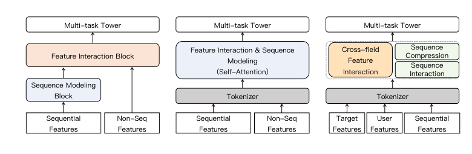
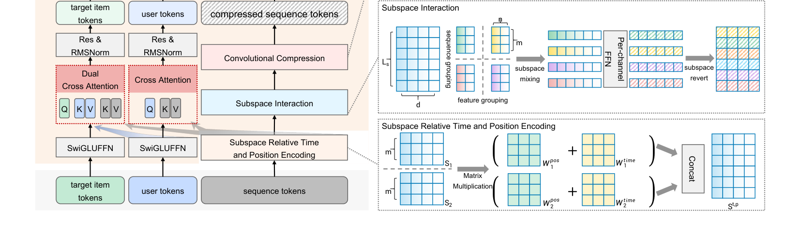
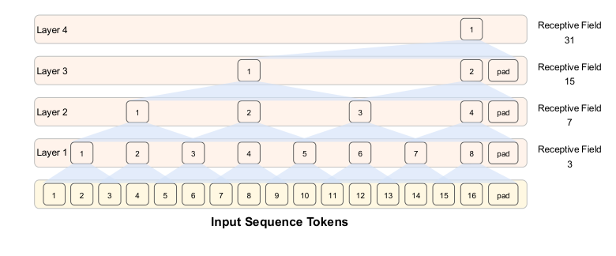
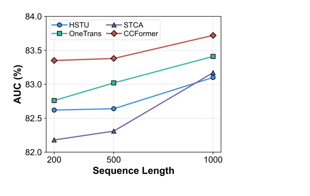
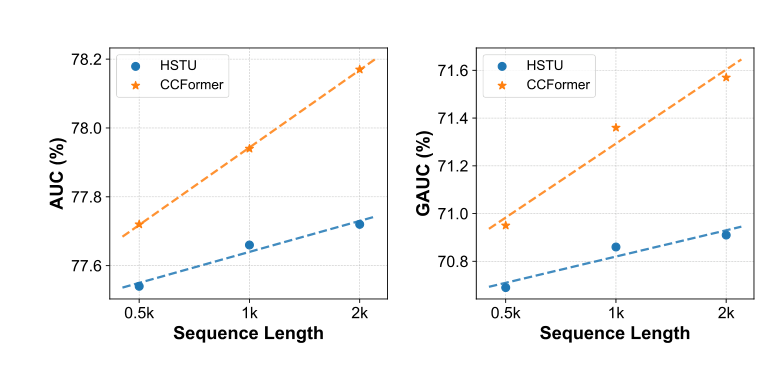
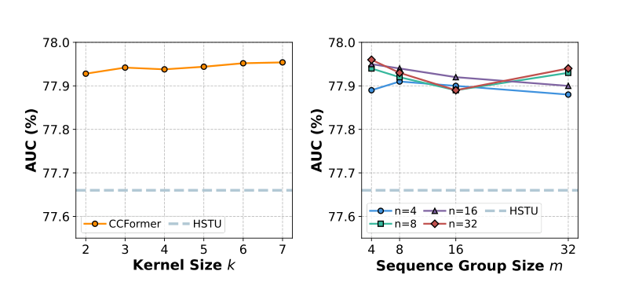

# CCFormer：腾讯工业推荐中的高效跨域交互与分层序列压缩

> Yunlong Wang\*、Huizhe Zhang\*、Haonan Hu\*（腾讯平台与内容事业群）；Yudong Li†（腾讯平台与内容事业群）；Bing Wen、Jianchao Tu（腾讯平台与内容事业群）；Chengxiang Zhuo、Zang Li（腾讯平台与内容事业群）
>
> \* 同等贡献；† 通讯作者。

本文提出 CCFormer：一个面向工业推荐的高效 Transformer 主干，把跨域特征交互与压缩式长序列建模统一起来——特征域分离的交叉注意力（feature-field separated cross attention）负责异构域间的早期融合，子空间 token 混合（subspace token mixing）在局部子空间内完成全长度序列的 token 交互，分层序列压缩（hierarchical sequence compression）用逐层扩张的感受野在极低开销下保留完整序列信息。核心发现是——**CCFormer 在公开基准与腾讯工业数据集上全面超越最强基线：训练加速 2.21×（对比 HSTU），线上视频推荐场景 CTR 提升 +3.57%、广告场景收入提升 +1.71%，已全量部署到腾讯生产推荐系统**。

核心内容：

- 痛点：基于 self-attention 的序列推荐模型受益于"序列越长、容量越大、性能越好"的可预测缩放定律，但二次复杂度 $O(L_s^2)$ 在工业延迟与资源约束下不可承受；压缩表示会丢细粒度信号，截断子序列又丢弃长期兴趣，且 token 混合类方法从未直接用于全长度行为序列
- 三大模块：① 特征域分离交叉注意力——user 域与 target 域分别对行为序列、彼此做三条有向注意力流（$u \rightarrow s$、$t \rightarrow s$、$t \rightarrow u$），避免全局自注意力的二次开销与跨域语义弱化；② 长序列子空间 token 混合——把序列 reshape 成 $B \times (L_s/m) \times (d/n) \times mn$ 子空间张量，按通道组做门控前馈（PFFN），复杂度 $O(L_s \cdot mn)$；③ 分层序列压缩——逐层对序列做 Conv1D 下采样（kernel $k=3$、stride $s=2$），感受野随层数指数扩张
- 工程优化：BF16/FP16 混合精度（内存 −35%）；稀疏 ID 特征 INT8 量化（~70% 压缩）+ 双重哈希（再 −50%）；候选 item 并行打分的解耦设计（在线峰值 QPS +30%）
- 验证：两个公开基准（Taobao、KuaiRec）+ 一个超 40 亿样本的腾讯工业数据集；与 DIN、DeepFM、SASRec、MIMN、HSTU、OneTrans、STCA 对比，TPE 超参搜索保证公平

关键发现：

- 公开基准全面最优：Taobao AUC 93.67%（ΔAUC 13.93）、KuaiRec AUC 83.35%（ΔAUC 10.36），分别领先最强序列基线 STCA/OneTrans 0.86 和 0.59 个百分点
- 工业数据集：AUC 77.94（相对提升 1.01%）、GAUC 71.36（相对提升 2.40%），优于最强基线 STCA 0.21 AUC / 0.41 GAUC 点
- 可预测缩放：序列长度 500→2000 时 AUC 从 77.72% 稳步升至 78.17%，GAUC 从 70.95% 升至 71.57%，对 HSTU 平均相对提升 1.08%/2.37%；仅 0.5k token 的 CCFormer 即可追平 2k token 的 HSTU 的 AUC；特征维度 128→512 时 GFLOPs 仅为 HSTU 的一半上下（d=256 时 18.28 vs 38.37）
- 消融显示子空间 token 混合是精度核心（移除后 AUC 跌至 77.73%），序列压缩是效率核心（移除后加速比 2.21×→1.29×）；替换为自注意力精度几乎持平但加速比跌至 1.41×；去掉相对时间-位置编码后 AUC 从 77.94% 降至 77.85%
- 线上 A/B（两周、每日超百万曝光用户，p<0.05 显著）：场景一 Page View +3.86%、CTR +3.57%、Video View +3.47%、Unique Viewer +2.61%、广告收入 +1.64%；场景二广告收入 +1.71%

---

## 摘要

近期工业推荐系统的研究表明，基于 self-attention 构建的序列推荐模型可以通过增加序列长度和模型容量受益于可预测的缩放定律（scaling law）。然而，实际的推荐系统有严格的延迟和资源约束，使得在计算开销与细粒度特征交互之间取得平衡颇具挑战。在本文中，我们提出 CCFormer，一个高效的 Transformer 主干，它统一了工业推荐中的跨域特征交互和压缩式长序列建模。具体来说，CCFormer 将特征域分离的交叉注意力与长序列子空间 token 混合相结合，以利用跨异构特征域的长期偏好信号。一种具有渐进扩张感受野的分层序列压缩策略能够在信息损失更少的情况下实现高效的长序列建模。在两个公开基准和一个大规模工业数据集上的大量实验表明，CCFormer 持续优于最先进的基线。在腾讯的视频推荐场景和广告排序场景进行的线上 A/B 测试进一步验证了其工业实用性，分别带来 3.57% 的 CTR 提升和 1.71% 的广告收入提升，同时相对强大的 HSTU 基线将模型训练加速了 2.21×。CCFormer 已完全部署在腾讯的生产推荐系统中，服务两个场景的主要流量。

关键词：Recommender System（推荐系统），Scaling Law（缩放定律），Long-Sequence Modeling（长序列建模）

## 1 引言

序列推荐模型（SRs）自然地捕捉长期序列行为，已成为各种工业应用中普遍存在的方法，例如在线广告、电子商务、新闻信息流和短视频平台 [35, 41]。传统的基于协同过滤或基于内容的推荐模型主要关注用户与 item 之间的浅层交互。SRs 旨在通过建模历史交互序列来推断用户不断演化的偏好，并预测他们未来的响应。最近的研究越来越转向长序列建模，利用更丰富的历史行为来捕捉更全面、多样和动态的用户兴趣 [18, 20, 28]。

由于对用户行为序列具有强大的表达能力，基于 Transformer 的模型已成为占主导地位的架构 [2, 8, 29]。这类基于 self-attention 构建的模型能够自适应地识别信息量大的历史交互，并捕捉过去行为与目标 item 之间的高阶交互。此外，最近的研究表明，推荐模型也可以从规模扩展中受益，包括增大模型规模、延长序列长度和分配更多计算预算 [38, 40]。这种扩展趋势使得深入利用长期用户历史成为可能，从而提高序列用户表示的表达能力。然而，基于 Transformer 的序列模型难以部署在实际的推荐系统中。self-attention 机制在序列长度上带来二次方的计算和内存复杂度，这在建模长用户行为序列时变得过于昂贵 [11]。这一挑战在工业排序场景中尤为关键，因为模型必须在严格的延迟和资源约束下处理大量流量。因此，直接扩展输入序列长度或增加模型容量往往带来无法接受的训练和推断成本，使得基于 Transformer 的序列模型难以在实际系统中扩展。

为了缓解长序列建模的效率瓶颈，现有的长序列推荐方法通常采用两种代表性范式：压缩序列表示或序列截断 [19, 23, 34]。如图 1 所示，一些传统方法在特征交互之前将长行为序列压缩为紧凑的序列表示。虽然这种序列压缩降低了计算成本，但它可能丢失细粒度的行为信号，并削弱后续历史行为与目标 item 之间的交互。近年来，一些新兴方法检索或截断与目标相关的子序列，并在有限的窗口内保留 token 级建模 [3, 25]，或者采用稀疏注意力来降低长序列建模的成本 [31, 37]。然而，序列截断不可避免地丢弃了潜在有用的长期兴趣，而保留序列内的完全 self-attention 仍然带来不可忽视的计算开销。因此，一个关键挑战仍未得到充分探索：如何在长用户行为序列中实现充分且高效的特征交互，以用于工业推荐。不足的序列级特征交叉可能削弱模型发现细粒度偏好模式的能力，而对长序列进行穷举式 self-attention 又过于昂贵 [6, 22]。这促使我们需要一种新的建模框架，既保留丰富的序列特征交互，又保持实际可行的效率。

图 1：架构比较。

为了解决这些挑战，我们提出 CCFormer，一个高效的 Transformer，统一了深度跨域特征交互与序列压缩，用于长序列推荐。具体来说，CCFormer 引入了特征域分离的交叉注意力，实现序列内与跨域的特征交互。它使来自不同域（例如用户画像、item 特征）的 token 能够与整个行为序列显式交互，并从丰富的历史上下文中捕捉长期偏好信号。此外，CCFormer 引入了一个长序列子空间 token 混合模块，有效地从长行为历史中捕捉与目标相关的偏好信号，而子空间级的相对时间-位置编码将感知新鲜度的顺序信息注入行为序列。最后，分层序列压缩策略通过扩张的感受野保留对完整序列的访问，从而在大幅降低长序列建模计算成本的同时减轻信息损失。我们的贡献总结如下：

- 我们为长序列推荐提出了一种新的交互范式：特征域分离的交叉注意力能够在异构域之间实现高效的早期融合，而子空间级的相对时间-位置编码将感知新鲜度的顺序信息注入行为序列。
- 据我们所知，这是首次尝试将 token 混合从统一的特征 token 扩展到工业排序模型中的全长度用户行为序列，并配合量身定制的分层序列压缩。这种范式保留了丰富的长序列信息，同时大幅降低计算开销，实现了高达 2.21× 的训练加速。
- 我们在公开基准和工业数据集上针对先进的工业基线进行了全面实验。在两个真实腾讯推荐场景中的缩放定律分析和线上 A/B 测试证明了 CCFormer 的有效性、可扩展性和实用性。
## 2 相关工作

传统深度学习推荐模型。传统深度学习推荐模型（DLRMs）[38] 致力于从高维稀疏类别特征和稠密数值特征中学习有效的表示 [5, 10]。一个常见的范式是将稀疏特征投影到低维嵌入空间，然后与稠密特征结合进行预测。这些模型设计了不同的特征交互机制来提高推荐模型的表达能力。例如，Wide & Deep [7] 联合记忆低阶特征共现模式，并通过深度神经网络进行泛化。DeepFM [13] 将因子分解机与深度网络集成，以捕捉低阶和高阶特征交互。然而，传统 DLRMs 通常将用户历史行为视为聚合的或短程的特征，而不是显式地建模长期序列依赖。单纯依赖静态特征交叉或池化的行为表示可能忽略重要的序列信号。

基于 token 混合的推荐模型。不依赖异构的手工特征交叉模块，新兴方法构建序列化的统一特征，以利用大规模工业推荐系统在大而动态的词表上的缩放定律 [38]。源自视觉 Transformer 的 MLP 驱动替代方案 [30]，近期一系列工作用轻量级 token 混合算子替换二次方复杂度的 self-attention。这些方法通过在 token 之间混合子空间向量来实现跨 token 的全局特征交互 [4, 14, 16]。例如，RankMixer [42] 将多头 token 混合模块与每个 token 的前馈网络（FFNs）结合，以高效建模异构特征子空间。TokenMixer-Large [17] 通过用"混合-还原"（mixing-and-reverting）操作重新设计残差通路，进一步改进了这一范式。然而，现有的基于 token 混合的推荐模型主要针对统一特征 token 设计，而非全长度用户行为序列。与这些方法不同，我们的工作旨在将 token 混合范式直接部署在完整行为序列上，用于长序列建模。

基于注意力的推荐模型。早期的序列模型倾向于采用循环神经网络、卷积网络或注意力机制来编码历史行为 [18, 26, 33]。这些方法显著提高了用户行为建模的表达能力，并已在召回和排序场景中得到广泛探索。最近的研究进一步将基于注意力的架构扩展到工业规模推荐，在可扩展框架中联合建模行为序列、item 特征和用户画像 [12, 15, 19, 40]。这些工作表明，扩展序列长度、模型容量和特征交互模块可以持续提升推荐性能，尤其是当用户兴趣分布在不同历史行为和特征域中时 [9, 21]。普通 self-attention 在实际推荐系统中引入二次方的计算和内存成本。此外，许多高效注意力变体主要关注降低序列建模开销，使它们在捕捉跨域特征交互方面效果不佳。因此，如何实现高效且充分的跨域特征交互，仍然是基于注意力的模型的关键挑战。

## 3 方法

本节详细介绍所提出的 CCFormer 的架构。如图 2 所示，CCFormer 采用了解耦的架构范式。它显式地将输入特征空间划分为三个不同的语义域：用户画像、历史行为序列和目标 item。现有基于 Transformer 的模型的一个根本局限是，对所有拼接 token 应用全局 self-attention 会带来令人望而却步的二次方计算复杂度。为了克服这一瓶颈，CCFormer 将特征交互过程解耦为两个正交的组成部分：跨域交互和序列内 token 交互。这种设计使模型能够从广泛的行为历史中有效提炼目标感知的用户兴趣，同时避免对完整 token 集进行穷举式 self-attention 的二次方开销。

图 2：CCFormer 总览。

形式化地，设 $U^{(0)} \in \mathbb{R}^{B \times L_u \times d}$、$S^{(0)} \in \mathbb{R}^{B \times L_s \times d}$ 和 $T^{(0)} \in \mathbb{R}^{B \times L_t \times d}$ 分别表示用户、行为序列和目标 item 域的初始 token 化表示。这里，$B$ 表示 batch 大小，$d$ 是隐藏维度，$L_u$、$L_s$ 和 $L_t$ 表示各自域中的 token 数量。具体来说，异构的用户侧特征被投影到一组紧凑的用户 token 上，而每个历史行为和目标 item 都被嵌入为一个细粒度的 item 级 token。

CCFormer 的核心由 $L$ 个堆叠的交互块组成。每个块通过上述解耦的交互迭代地精炼三个域的表示：

$$
(U^{(\ell+1)}, S^{(\ell+1)}, T^{(\ell+1)}) = \text{CCFormerBlock}_\ell(U^{(\ell)}, S^{(\ell)}, T^{(\ell)}) \qquad (1)
$$

经过 $L$ 层深度特征提取后，三个域最终的归一化表示被聚合，并送入任务特定的预测头进行多任务学习。

### 3.1 特征域分离的交叉注意力

CTR 预测涉及异构的特征交互，例如用户到历史的偏好检索、目标到历史的相关性匹配，以及目标到用户的兼容性建模。对所有 token 应用标准 self-attention 会统一地对待不同特征域，这不仅招致不必要的计算，还可能削弱它们的语义角色。为了解决这个问题，CCFormer 采用特征域分离的交叉注意力模块，通过三条有向注意力流来建模这些交互。

在跨域交互之前，我们首先对用户域和目标域应用轻量级的逐 token 前馈网络：

$$
\bar{U}^{(\ell)} = \text{SwiGLUFFN}_u^\ell(U^{(\ell)}), \quad \bar{T}^{(\ell)} = \text{SwiGLUFFN}_t^\ell(T^{(\ell)}) \qquad (2)
$$

用户域生成查询（queries）、键（keys）和值（values），而行为序列只提供键和值，因为它被用作待检索的上下文：

$$
(Q_u, K_u, V_u) = \text{RMSNorm}(\bar{U}^{(\ell)}) W_u^{QKV} \qquad (3)
$$

$$
(K_s, V_s) = \text{RMSNorm}(S^{(\ell)}) W_s^{QKV} \qquad (4)
$$

其中 $W_u^{QKV} \in \mathbb{R}^{d \times 3d}$，$W_s^{QKV} \in \mathbb{R}^{d \times 2d}$。我们应用 RMSNorm [39] 来对齐各特征域的尺度。

目标域使用两个查询投影，分别关注行为域和用户域：

$$
Q_{t \rightarrow s} = \bar{T}^{(\ell)} W_{t \rightarrow s}^{Q}, \quad Q_{t \rightarrow u} = \bar{T}^{(\ell)} W_{t \rightarrow u}^{Q} \qquad (5)
$$

然后计算有向交叉注意力：

$$
O_{u \rightarrow s} = \text{Attn}(Q_u, K_s, V_s; M), \\
O_{t \rightarrow s} = \text{Attn}(Q_{t \rightarrow s}, K_s, V_s; M), \qquad (6) \\
O_{t \rightarrow u} = \text{Attn}(Q_{t \rightarrow u}, K_u, V_u),
$$

其中

$$
\text{Attn}(Q, K, V; M) = \text{softmax}\left(\frac{QK^\top}{\sqrt{d_k}} + M\right) V \qquad (7)
$$

对于每个注意力头，设 $d_k = d/h$ 表示头维度。当注意力在没有掩码的情况下应用时，掩码 $M$ 被省略；在序列相关的注意力中，$M$ 用于掩蔽填充（padding）的行为位置。

最后，用户域和目标域按如下方式更新：

$$
\Delta U^{(\ell)} = O_{u \rightarrow s} W_u^{O}, \quad \Delta T^{(\ell)} = [O_{t \rightarrow s}; O_{t \rightarrow u}] W_t^{O} \qquad (8)
$$

通过这种方式，用户域有选择地检索历史行为，而目标域联合捕捉目标-历史相关性和目标-用户兼容性。

### 3.2 token 子空间中的相对时间-位置编码

用户行为序列中的时间和位置线索对于捕捉不断演化的偏好至关重要。最近的研究 [19, 36, 38] 表明，联合的时间-位置建模显著提升了推荐精度。传统 self-attention 的 $O(L_s^2)$ 复杂度引入令人望而却步的延迟，阻碍了现实世界中的长时域推荐。为了高效地编码时间-位置信息，我们在局部行为子空间内应用相对时间-位置编码，将计算复杂度降低到 $O(L_s m)$。

给定序列表示 $S \in \mathbb{R}^{B \times L_s \times d}$，我们沿着序列维度 $L_s$ 将 $S$ 划分为大小为 $m$ 的组，每组包含 $m$ 个行为。对于第 $p$ 个序列组中的第 $i$ 个和第 $j$ 个行为，相对时间-位置编码定义如下：

$$
W_{p,i,j}^{\text{time}} = \alpha \cdot \beta^{\gamma |t_{p,i} - t_{p,j}|} \qquad (9)
$$

其中 $\alpha$ 和 $\gamma$ 是正的可学习参数，$\beta \in (0, 1)$ 是时间衰减参数，$t_{p,i}$ 是第 $p$ 组中第 $i$ 个行为的时间戳。我们为第 $p$ 组构造一个相对时间编码矩阵 $W_p^{\text{time}} \in \mathbb{R}^{m \times m}$。由于 $\beta \in (0, 1)$，权重 $W_{p,i,j}^{\text{time}}$ 随着时间间隔 $|t_{p,i} - t_{p,j}|$ 的增长而单调递减，从而为时间上邻近的行为分配更大的权重。

除了时间信息，我们引入一个可学习的相对位置偏置 $W_{\text{pos\_origin}} \in \mathbb{R}^{2m-1}$，以捕捉每个序列组内不同行为之间的位置关系。给定第 $p$ 个序列组中的第 $i$ 个和第 $j$ 个行为，相对位置编码按如下方式获得：

$$
W_{p,i,j}^{\text{pos}} = W_{\text{pos\_origin}}[i - j + m - 1] \qquad (10)
$$

我们为第 $p$ 组构造一个相对位置矩阵 $W_p^{\text{pos}} \in \mathbb{R}^{m \times m}$。最后，我们将时间-位置信息纳入序列 $S$：

$$
S^{\text{t,p}} = \text{Concat}\left(S_1^{\text{t,p}}, S_2^{\text{t,p}}, \ldots, S_{L_s/m}^{\text{t,p}}\right), \qquad (11) \\
S_p^{\text{t,p}} = \left(W_p^{\text{time}} + W_p^{\text{pos}}\right) S[(p-1) \cdot m : p \cdot m].
$$

### 3.3 长序列子空间 token 混合

在跨域交互之后，捕捉历史行为之间的序列内依赖至关重要。然而，标准 self-attention 机制遭受相对序列长度 $L_s$ 的二次方计算瓶颈 $O(L_s^2)$。为了规避这一局限，CCFormer 引入了子空间 token 混合模块。我们不计算稠密的成对注意力，而是将行为序列划分为紧凑的 token 子空间，并通过逐通道前馈网络（Per-channel Feed-Forward Network，PFFN）处理它们。形式化地，输入序列表示 $S \in \mathbb{R}^{B \times L_s \times d}$ 首先被重塑为子空间张量：

$$
X = \text{Reshape}(S) \in \mathbb{R}^{B \times \frac{L_s}{m} \times \frac{d}{n} \times mn} \qquad (12)
$$

在这种形式下，每个子空间向量 $X_{b,p,c} \in \mathbb{R}^{mn}$ 共同封装了 $m$ 个相邻行为 token 和 $n$ 个隐藏维度。这种结构化重组至关重要：它迫使细粒度的 token 级和通道级信号在局部、紧凑的表示中直接交互。

随后，我们独立地对每个通道组应用 PFFN，以提取子空间特定的模式。PFFN 被实例化为门控前馈架构，以增强非线性表达能力：

$$
\text{PFFN}_c(x) = W_o^c \phi(xW_g^c) \odot (xW_v^c) \qquad (13)
$$

其中 $\phi(\cdot)$ 表示平滑的非线性激活函数，$\odot$ 是逐元素乘法，$W_g^c$、$W_v^c$ 和 $W_o^c$ 是第 $c$ 个通道组特定的可学习权重矩阵。对于每个子空间，变换计算如下：

$$
Z_{b,p,c} = \text{PFFN}_c(X_{b,p,c}) \qquad (14)
$$

通过在不同通道组间使用独立参数，模型可以并行捕捉多样且异构的行为模式。输出张量 $Z$ 保持 $X$ 的子空间拓扑结构，随后被还原为原始序列布局：

$$
\hat{S} = \text{Restore}(Z) \in \mathbb{R}^{B \times L_s \times d} \qquad (15)
$$

总的来说，这种基于子空间的混合机制在表达能力和计算效率之间提供了有利的平衡。通过在局部子空间内显式混合多个行为 token 和隐藏维度，它有效地捕捉序列内依赖。

### 3.4 分层长序列 token 压缩

虽然子空间 token 混合减轻了序列内交互的成本，但当序列长度 $L_s$ 极大时，处理完整行为序列在计算上仍然令人望而却步。此外，长用户历史本质上表现出冗余性和局部相关性。为了解决这一瓶颈，我们引入了分层 token 压缩模块，在更深层中逐步压缩序列表示。形式化地，在第 $\ell$ 个块更新序列后，我们沿序列维度应用一维卷积下采样算子：

$$
S^{(\ell+1)} = \text{Conv1D}_{k,s}\left(\hat{S}^{(\ell)}\right) \qquad (16)
$$

其中 $\hat{S}^{(\ell)}$ 表示第 $\ell$ 个 CCFormer 块在子空间 token 混合后的输出，$S^{(\ell+1)}$ 作为下一个块的输入序列表示。$k$ 和 $s$ 分别表示卷积核大小和步长。该操作通过融合相邻行为 token 来聚合局部上下文，为后续层产生缩短的序列。

压缩机制自然地与子空间 token 混合模块互补。子空间 token 混合在每层内捕捉局部交互，而卷积压缩在层间合并局部信息。在图 3 中，随着网络深度的增加，每个压缩 token 的感受野在原始行为序列上渐进扩张。这使得多粒度用户兴趣建模成为可能：浅层捕捉短期、细粒度的行为模式，而深层提取抽象的、长期的偏好信号。至关重要的是，序列长度的渐进式减小显著降低了计算复杂度，确保了 CCFormer 对超长用户序列建模的可扩展性。

图 3：序列 token 感受野随模型层数增加的变化。

### 3.5 训练与部署优化

CCFormer 构建在 Numerous-Torch 之上，这是我们面向大规模推荐模型的生产级训练和推断基础设施。Numerous-Torch 的角色是弥合灵活的模型创新与工业规模的推荐部署之间的鸿沟。在建模侧，它保持了 PyTorch 原生开发体验，使研究者能够高效复用快速演化的 LLM 社区涌现的新进展。在系统侧，它提供了生产推荐负载所需的基础设施，包括分布式数据接入、大规模稀疏特征处理、稀疏-稠密联合训练、checkpoint 恢复、模型导出，以及基于新用户反馈日志的持续训练。下面，我们描述在工业生产场景中采用的一些关键优化。

混合精度训练。我们对主模型计算采用混合精度训练（BF16 或 FP16）。在实践中，该策略将内存开销降低了 35% 以上，使得在相同的训练预算下可以使用更大的 batch 或更大的模型参数。

稀疏参数压缩。对于大规模推荐模型，稀疏用户和 item ID 特征占稀疏模型参数的大多数。我们使用 INT8 对称线性量化存储这些 ID 特征的嵌入表参数，与全精度存储相比实现了约 70% 的压缩。此外，我们应用双重哈希（double-hashing）策略 [27] 来减小 ID 特征嵌入表的规模，进一步将稀疏参数规模降低约 50%。通过结合这两种技术，我们大幅降低了模型训练期间的内存占用和通信成本，而不降低训练效果。

候选 item 的并行预测。在 CCFormer 块中，目标 token 仅用作查询（queries），从不互相注意。这种设计避免了跨目标的信息泄漏，并允许来自同一用户请求的多个候选 item 被并行打分。在线服务时，请求中的所有候选目标被打包进目标域，仅前向传播一次。由于用户域和序列域建模在候选之间是共享的，CCFormer 在单次前向传播中为所有目标产生多任务分数，避免了重复的用户序列计算并提高了服务吞吐量。与 DLRM 基线逐候选的 pointwise 推断相比，这种并行预测方案使 CCFormer 能够在相同推断资源下将在线峰值 QPS 提高 30%，尽管其计算复杂度高出 20 倍。
## 4 实验

数据集。我们在两个基准数据集（Taobao1 和 KuaiRec2）以及一个内部工业数据集上进行对比实验。数据集统计信息列于表 1。我们利用用户点击过的 item 作为行为序列，预测用户是否会点击目标 item [24]。KuaiRec 数据集是一个短视频推荐数据集，提供了丰富的用户-item 交互记录。我们使用提供的大矩阵数据，当交互的观看比例大于或等于 2 时将其视为正样本。对于两个公开数据集，除非另有说明，行为序列被截断为长度 200。工业数据集是从腾讯推荐系统的在线日志和真实用户反馈中收集的。它包含一个月左右的生产数据，超过 40 亿个样本、超过 3000 万用户和超过 1000 万条推荐内容。对于该工业数据集，用户行为序列长度设置为 1000。

表 1：数据集统计信息。

| 数据集 | #用户 | #item | #样本 |
| --- | --- | --- | --- |
| Taobao | 987,994 | 4,162,024 | 100,150,807 |
| KuaiRec | 7,176 | 10,728 | 12,530,806 |
| Industry | >30M | >10M | >4B |

数据集链接：
1. https://tianchi.aliyun.com/dataset/649
2. https://kuairec.com/

基线。对于公开数据集，我们将 CCFormer 与传统 DLRM 范式下的四个代表性基线（DIN [41]、DeepFM [13]、SASRec [18] 和 MIMN [24]）以及三个基于注意力的序列推荐模型（HSTU [38]、OneTrans [40] 和 STCA [12]）进行比较。每个实验重复 5 次，报告 AUC 和相应的相对提升。在工业数据集上，我们还使用 AUC 和分组 AUC（GAUC）作为评估指标，与强大的生产导向基线（HSTU、OneTrans 和 STCA）进行比较。遵循 [32]，ΔAUC 和 ΔGAUC 表示 AUC 和 GAUC 的相对提升。相对提升按 $\text{RelaImpr} = \left(\frac{\text{Metric(measured model)} - 0.5}{\text{Metric(base model)} - 0.5} - 1\right) \times 100\%$ 计算。我们采用基于树结构的 Parzen 估计器（TPE）超参数搜索 [1] 为每种方法选择最优配置。

实现细节。除非另有说明，对于所有工业实验，我们将特征 token 维度设置为 $d = 256$，并堆叠 8 个 CCFormer 块。子空间组大小和通道组大小分别设置为 $m = 8$ 和 $n = 16$。卷积压缩模块使用核大小 $k = 3$ 和步长 $s = 2$。所有模型使用 Adam 优化，学习率为 $1 \times 10^{-4}$，batch 大小为 4096。为确保公平比较，所有实验在 16 块 NVIDIA H20 GPU 集群上使用相同的硬件和软件配置进行。

### 4.1 总体性能

我们在两个公开基准和一个大规模工业数据集上评估 CCFormer，结果如表 2 和表 3 所示。结果表明，CCFormer 在公开和工业数据集上都持续取得最佳性能。在 Taobao 和 KuaiRec 上，CCFormer 取得最佳 AUC，分别为 93.67% 和 83.35%。它比每个数据集上最强的序列基线（Taobao 上的 STCA 和 KuaiRec 上的 OneTrans）分别高出 0.86 和 0.59 个百分点。我们进一步比较了四个先进的序列推荐模型在不同序列长度（200、500 和 1000）下的表现，如图 4 所示。CCFormer 在所有序列长度设置下都持续优于 HSTU、OneTrans 和 STCA，展示了其在建模用户行为序列方面的稳定优势。CCFormer 的优势在工业数据集上也得到了验证。CCFormer 相比 HSTU 提升 0.28 个 AUC 点和 0.50 个 GAUC 点，对应 1.01% 和 2.40% 的相对提升。与最强基线 STCA 相比，CCFormer 进一步获得 0.21 个 AUC 点和 0.41 个 GAUC 点的增益。这些改进表明，CCFormer 有效建模了用户、目标 item 和行为序列之间的跨域交互，同时捕捉细粒度的序列内 token 交互。在公开基准和工业数据集上的一致增益进一步证明，CCFormer 是可扩展的长序列 CTR 预测的有效且实用的解决方案。

表 2：公开数据集上的性能比较。DIN 模型作为计算 ΔAUC 的基础模型。

| 数据集 | 指标 | DIN | DeepFM | SASRec | MIMN | HSTU | OneTrans | STCA | CCFormer |
| --- | --- | --- | --- | --- | --- | --- | --- | --- | --- |
| Taobao | AUC (%) | 88.33±0.22 | 89.06±0.42 | 88.52±0.65 | 91.79±0.32 | 91.40±0.25 | 91.35±0.61 | 92.81±0.50 | 93.67±0.32 |
|  | ΔAUC (%) | 0.00 | 1.90 | 0.50 | 9.03 | 8.01 | 7.88 | 11.69 | 13.93 |
| KuaiRec | AUC (%) | 80.22±0.58 | 80.14±0.51 | 79.83±0.70 | 81.79±0.81 | 82.62±0.39 | 82.76±0.59 | 82.18±0.16 | 83.35±0.29 |
|  | ΔAUC (%) | 0.00 | -0.26 | -1.29 | 5.20 | 7.94 | 8.41 | 6.49 | 10.36 |

图 4：KuaiRec 上四个序列推荐模型在递增序列长度下的 AUC 比较。

表 3：工业数据集上的性能比较。HSTU 基线作为计算 ΔAUC 和 ΔGAUC 的基础模型。

| 模型 | AUC (%) | ΔAUC (%) | GAUC (%) | ΔGAUC (%) |
| --- | --- | --- | --- | --- |
| HSTU | 77.66 | 0.00 | 70.86 | 0.00 |
| OneTrans | 77.69 | 0.11 | 70.90 | 0.19 |
| STCA | 77.73 | 0.25 | 70.95 | 0.43 |
| CCFormer | 77.94 | 1.01 | 71.36 | 2.40 |

### 4.2 CCFormer 的缩放分析

在本节中，我们研究 CCFormer 是否表现出可预测的缩放行为。我们关注两个因素：序列长度和模型规模，它们对序列推荐模型至关重要。所有实验在相同的硬件和软件栈上进行。除了性能指标，我们还报告每个模型对应的 GFLOPs。

图 5：序列长度的缩放定律。我们改变序列长度（500、1000、2000）来评估 AUC 和 GAUC 方面的性能。

序列长度缩放。我们首先研究 CCFormer 是否能在工业数据集上有效扩展到更长的用户行为序列。如图 5 所示，CCFormer 在不同序列长度下持续优于 HSTU。随着序列长度的增加，CCFormer 表现出可预测的缩放行为，AUC 从 77.72% 稳步提升到 78.17%，GAUC 从 70.95% 提升到 71.57%。与 HSTU 相比，CCFormer 在不同序列长度设置下平均相对提升 1.08% 的 AUC 和 2.37% 的 GAUC。仅使用 0.5k 行为 token 的 CCFormer 已经追平了 2k 行为 token 的 HSTU 的 AUC，并超越了其 GAUC。值得注意的是，相对增益随着序列变长而增大。长序列子空间 token 混合从完整行为历史中捕捉富有表现力的模式，而序列压缩以显著更低的成本保留了大感受野。

模型规模缩放。模型规模对工业数据集的影响在表 4 中报告，我们改变特征维度来控制模型容量。随着特征维度的增大，CCFormer 遵循可预测的缩放定律，AUC 从 77.65% 提升到 78.13%，GAUC 从 70.76% 提升到 71.52%。与相同特征维度设置下的 HSTU 相比，CCFormer 平均相对提升 1.02% 的 AUC 和 1.93% 的 GAUC。同时，CCFormer 始终比 HSTU 需要更少的每样本 GFLOPs。缩放分析表明，CCFormer 提供了更有利的有效性-效率权衡，使其成为工业长序列推荐的实用且可扩展的解决方案。

表 4：模型规模的影响。HSTU 基线作为基础模型。

| 模型 | 特征维度 | AUC (%) | ΔAUC (%) | GAUC (%) | ΔGAUC (%) | GFLOPs/样本 |
| --- | --- | --- | --- | --- | --- | --- |
| HSTU | 128 | 77.42 | 0.00 | 70.55 | 0.00 | 28.87 |
| CCFormer | 128 | 77.65 | 0.84 | 70.76 | 1.02 | 9.34 |
| HSTU | 256 | 77.66 | 0.00 | 70.86 | 0.00 | 38.37 |
| CCFormer | 256 | 77.94 | 1.01 | 71.36 | 2.40 | 18.28 |
| HSTU | 512 | 77.79 | 0.00 | 71.02 | 0.00 | 63.47 |
| CCFormer | 512 | 78.13 | 1.22 | 71.52 | 2.38 | 36.14 |

### 4.3 长序列建模超参数的影响

为了评估 CCFormer 的稳健性，我们研究了与长序列建模相关的两类超参数。具体来说，序列压缩模块中的核大小 $k$ 控制相邻行为 token 上的感受野。组大小用于长序列子空间 token 混合，其中序列组大小 $m$ 沿序列维度划分行为 token，通道组大小 $n$ 沿特征维度划分 token 嵌入。

核大小。如图 6 所示，增大核大小会略微提升 AUC，而整体性能保持稳定。当核大小从 2 增加到 7 时，AUC 从 77.92% 变为 77.95%。此外，CCFormer 在不同核大小下都清晰胜过 HSTU。这表明分层压缩模块可以有效去除长行为序列中的冗余信息，同时保留关键的偏好信号。在工业实验中，我们将步长 $s$ 设置为 2，以在保持竞争力性能的同时缩短序列长度，实现高效的长序列建模。

组大小。然后我们研究长序列子空间 token 混合模块中的关键超参数：序列组大小 $m$ 和通道组大小 $n$。如图 6 所示，CCFormer 在不同 $m$ 和 $n$ 组合下保持稳定，所有配置都持续优于 HSTU 基线。虽然在某些情况下较小的组大小可以略微提升 AUC，但总体变化有限。这表明子空间 token 混合无需精细调参就能稳健地捕捉潜在依赖。

图 6：CCFormer 中核大小和组大小的参数敏感性。

### 4.4 消融研究

我们在工业数据集上进行消融研究，以分析 CCFormer 中每个关键组件的贡献。为了公平比较，所有消融变体在相同的硬件和软件栈下，使用相同的训练和评估协议进行评估。如表 5 所示，我们构建了四个消融变体来检验 CCFormer 的核心设计，涵盖相对时间-位置编码、长序列子空间 token 混合和分层序列压缩。我们用训练吞吐量（定义为单位时间处理的样本数）来衡量训练速度。为了更直观地比较训练效率，我们定义训练加速比指标为相对 HSTU 的训练吞吐量。

表 5：消融研究结果。HSTU 基线作为基础模型。

| 模型 | 说明 | 训练加速比 | AUC (%) | ΔAUC (%) | GAUC (%) | ΔGAUC (%) |
| --- | --- | --- | --- | --- | --- | --- |
| HSTU | - | 1 | 77.66 | 0.00 | 70.86 | 0.00 |
| CCFormer | - | 2.21 | 77.94 | 1.01 | 71.36 | 2.40 |
| CCFormer | 移除相对时间-位置编码 | 2.35 | 77.85 | 0.69 | 71.13 | 1.29 |
| CCFormer | 长序列 token 混合 → self-attention | 1.41 | 77.96 | 1.08 | 71.21 | 1.68 |
| CCFormer | 移除长序列 token 混合 | 2.40 | 77.73 | 0.25 | 71.02 | 0.77 |
| CCFormer | 移除序列压缩 | 1.29 | 77.96 | 1.08 | 71.25 | 1.87 |

在表 5 中，移除相对时间-位置编码使 AUC 从 77.94% 降至 77.85%，GAUC 从 71.36% 降至 71.13%。由于用户兴趣高度时间敏感，相对时间-位置编码帮助 CCFormer 区分近期行为与过时行为，并更好地捕捉感知新鲜度的偏好模式。移除序列 token 混合导致最大的性能下降，AUC 和 GAUC 分别降至 77.73% 和 71.02%。此外，将 token 混合替换为标准 self-attention 会将 AUC 略微提升至 77.96%，但将 GAUC 降至 71.21%，并将训练加速比从 2.21× 降至 1.41×。子空间 token 混合提供了一种轻量级替代方案，仅带来轻微精度损失，同时大幅提升训练效率。值得注意的是，移除序列压缩得到 77.96% 的 AUC 和 71.25% 的 GAUC。更重要的是，训练加速比从 2.21× 降至 1.29×，表明序列压缩是训练效率的关键组件。

### 4.5 线上 A/B 结果

我们在两个实际的腾讯商业推荐场景中报告线上 A/B 测试结果：视频推荐（场景 1）和广告排序（场景 2）。两个场景中的基线是长期存在、迭代优化的 DLRM 和已部署的 HSTU 模型。每个线上实验组每天接收超过一百万曝光用户，实验为期两周。在表 6 中，CCFormer 在两个场景的多个业务指标上实现了一致的提升。在场景 1 中，最大的增益出现在 Page View 上，相对提升 3.86%。CCFormer 在 CTR、Video View 和 Unique Viewer 上也分别实现了 3.57%、3.47% 和 2.61% 的相对提升。用户点击率（UCTR）和用户 3 日活跃度均提升 1.93%。CCFormer 不仅增强了用户即时响应，还惠及用户参与度和短期留存。CCFormer 在两个场景的广告收入上分别实现 1.64% 和 1.71% 的提升。作为关键的广告侧业务指标，这显示了 CCFormer 对工业变现的实用价值。所有报告的线上增益在统计上显著（双样本 $t$ 检验，$p < 0.05$），证实了改进在生产环境中的可靠性。在 A/B 测试之后，CCFormer 已在两个场景全面上线，目前服务全部生产流量，全量部署后线上增益保持稳定。

表 6：CCFormer 的线上 A/B 增益。

| 场景 1 | CTR | UCTR | 3 日活跃 | Video View | Unique Viewer | Page View | Watch Time | 广告收入 | 场景 2 | 广告曝光 | 广告收入 |
| --- | --- | --- | --- | --- | --- | --- | --- | --- | --- | --- | --- | --- |
| 提升 (%) | 3.57 | 1.93 | 1.93 | 3.47 | 2.61 | 3.86 | 1.29 | 1.64 | 提升 (%) | 1.43 | 1.71 |

## 5 结论

我们提出了 CCFormer，它将特征域分离的交叉注意力与子空间 token 混合和分层压缩统一起来，用于高效的长序列排序。CCFormer 在离线测试中持续优于强大的基线，并已完全部署在腾讯的生产推荐系统中，在视频推荐和广告排序两个场景中，以相当或更低的计算成本带来了显著的线上增益。在未来工作中，我们计划将 CCFormer 扩展到终身规模（lifelong-scale）的序列，并探索面向召回阶段的压缩感知建模。

## 参考文献

[1] James Bergstra, Rémi Bardenet, Yoshua Bengio, and Balázs Kégl. 2011. Algorithms for Hyper-Parameter Optimization. In Advances in Neural Information Processing Systems, J. Shawe-Taylor, R. Zemel, P. Bartlett, F. Pereira, and K. Weinberger (Eds.), Vol. 24. Curran Associates, Inc. https://proceedings.neurips.cc/paper_files/paper/2011/file/86e8f7ab32cfd12577bc2619bc635690-Paper.pdf

[2] Zheng Chai, Qin Ren, Xijun Xiao, Huizhi Yang, Bo Han, Sijun Zhang, Di Chen, Hui Lu, Wenlin Zhao, Lele Yu, et al. 2025. Longer: Scaling up long sequence modeling in industrial recommenders. In Proceedings of the Nineteenth ACM Conference on Recommender Systems. 247–256.

[3] Jianxin Chang, Chenbin Zhang, Zhiyi Fu, Xiaoxue Zang, Lin Guan, Jing Lu, Yiqun Hui, Dewei Leng, Yanan Niu, Yang Song, and Kun Gai. 2023. TWIN: TWo-stage Interest Network for Lifelong User Behavior Modeling in CTR Prediction at Kuaishou. In Proceedings of the 29th ACM SIGKDD Conference on Knowledge Discovery and Data Mining. 3785–3794.

[4] Jin Chen, Shangyu Zhang, Bin Hu, Chao Zhou, Junwei Pan, Gengsheng Xue, Wentao Ning, Gengyu Weng, Wang Zheng, Shaohua Liu, et al. 2026. RankUp: Towards High-rank Representations for Large Scale Advertising Recommender Systems. arXiv preprint arXiv:2604.17878 (2026).

[5] Qiwei Chen, Huan Zhao, Wei Li, Pipei Huang, and Wenwu Ou. 2019. Behavior sequence transformer for e-commerce recommendation in alibaba. In Proceedings of the 1st international workshop on deep learning practice for high-dimensional sparse data. 1–4.

[6] Xiangyi Chen, Kousik Rajesh, Matthew Lawhon, Zelun Wang, Hanyu Li, Haomiao Li, Saurabh Vishwas Joshi, Pong Eksombatchai, Jaewon Yang, Yi-Ping Hsu, et al. 2025. Pinfm: foundation model for user activity sequences at a billion-scale visual discovery platform. In Proceedings of the Nineteenth ACM Conference on Recommender Systems. 381–390.

[7] Heng-Tze Cheng, Levent Koc, Jeremiah Harmsen, Tal Shaked, Tushar Chandra, Hrishi Aradhye, Glen Anderson, Greg Corrado, Wei Chai, Mustafa Ispir, et al. 2016. Wide & deep learning for recommender systems. In Proceedings of the 1st workshop on deep learning for recommender systems. 7–10.

[8] Sunhao Dai, Jiakai Tang, Jiahua Wu, Kun Wang, Yuxuan Zhu, Bingjun Chen, Bangyang Hong, Yu Zhao, Cong Fu, Kangle Wu, et al. 2025. Onepiece: Bringing context engineering and reasoning to industrial cascade ranking system. arXiv preprint arXiv:2509.18091 (2025).

[9] Qin Ding, Kevin Course, Linjian Ma, Jianhui Sun, Ruochen Liu, Zhao Zhu, Chunxing Yin, Wei Li, Dai Li, Yu Shi, et al. 2026. Bending the scaling law curve in large-scale recommendation systems. arXiv preprint arXiv:2602.16986 (2026).

[10] Yufei Feng, Fuyu Lv, Weichen Shen, Menghan Wang, Fei Sun, Yu Zhu, and Keping Yang. 2019. Deep session interest network for click-through rate prediction. arXiv preprint arXiv:1905.06482 (2019).

[11] Yulong Gu, Lixin Zou, and Chenliang Li. 2026. Deep Learning to Rank in Industrial Search Engines, Recommender Systems, and Online Advertising: An Overview and New Perspectives. ACM Transactions on Information Systems 44, 4 (2026), 1–52.

[12] Lin Guan, Jia-Qi Yang, Zhishan Zhao, Beichuan Zhang, Bo Sun, Xuanyuan Luo, Jinan Ni, Xiaowen Li, Yuhang Qi, Zhifang Fan, et al. 2026. Make it long, keep it fast: End-to-end 10k-sequence modeling at billion scale on Douyin Recommendation. In Proceedings of the ACM Web Conference 2026. 7989–7998.

[13] Huifeng Guo, Ruiming Tang, Yunming Ye, Zhenguo Li, Xiuqiang He. 2017. DeepFM: a factorization-machine based neural network for CTR prediction. arXiv preprint arXiv:1703.04247 (2017).

[14] Mingming Ha, Guanchen Wang, Linxun Chen, Xuan Rao, Yuexin Shi, Tianbao Ma, Zhaojie Liu, Yunqian Fan, Zilong Lu, Yanan Niu, et al. 2026. UniMixer: A Unified Architecture for Scaling Laws in Recommendation Systems. arXiv preprint arXiv:2604.00590 (2026).

[15] Ruidong Han, Bin Yin, Shangyu Chen, et al. 2025. MTGR: Industrial-Scale Generative Recommendation Framework in Meituan. arXiv preprint arXiv:2505.18654 (2025).

[16] Xu Huang, Hao Zhang, Zhifang Fan, Yunwen Huang, Zhuoxing Wei, Zheng Chai, Jinan Ni, Yuchao Zheng, and Qiwei Chen. 2026. MixFormer: Co-Scaling Up Dense and Sequence in Industrial Recommenders. arXiv preprint arXiv:2602.14110 (2026).

[17] Yuchen Jiang, Jie Zhu, Xintian Han, Hui Lu, Kunmin Bai, Mingyu Yang, Shikang Wu, Ruihao Zhang, Wenlin Zhao, Shipeng Bai, et al. 2026. TokenMixer-Large: Scaling Up Large Ranking Models in Industrial Recommenders. arXiv preprint arXiv:2602.06563 (2026).

[18] Wang-Cheng Kang and Julian McAuley. 2018. Self-attentive sequential recommendation. In 2018 IEEE international conference on data mining (ICDM). IEEE, 197–206.

[19] Weijiang Lai, Beihong Jin, Di Zhang, Siru Chen, Jiongyan Zhang, Yuhang Gou, Jian Dong, and Xingxing Wang. 2026. Unleashing the Potential of Sparse Attention on Long-term Behaviors for CTR Prediction. In Proceedings of the ACM Web Conference 2026. 8041–8050.

[20] Yang Li, Tong Chen, Peng-Fei Zhang, and Hongzhi Yin. 2021. Lightweight self-attentive sequential recommendation. In Proceedings of the 30th ACM international conference on information & knowledge management. 967–977.

[21] Guanyu Lin, Jinwei Luo, Yinfeng Li, Chen Gao, Qun Luo, and Depeng Jin. 2025. Iterative sparse attention for long-sequence recommendation. In Proceedings of the AAAI Conference on Artificial Intelligence, Vol. 39. 12147–12155.

[22] Mingyang Liu, Yong Bai, Zhangming Chan, Sishuo Chen, Xiang-Rong Sheng, Han Zhu, Jian Xu, and Xinyang Chen. 2026. EST: Towards Efficient Scaling Laws in Click-Through Rate Prediction via Unified Modeling. arXiv preprint arXiv:2602.10811 (2026).

[23] Mengyang Ma, Xiaopeng Li, Wanyu Wang, Zhaocheng Du, Jingtong Gao, Pengyue Jia, Yuyang Ye, Yiqi Wang, Yunpeng Weng, Weihong Luo, et al. 2026. Blossomrec: Block-level fused sparse attention mechanism for sequential recommendations. In Proceedings of the ACM Web Conference 2026. 6389–6399.

[24] Qi Pi, Weijie Bian, Guorui Zhou, Xiaoqiang Zhu, and Kun Gai. 2019. Practice on long sequential user behavior modeling for click-through rate prediction. In Proceedings of the 25th ACM SIGKDD international conference on knowledge discovery & data mining. 2671–2679.

[25] Qi Pi, Guorui Zhou, Yujing Zhang, Zhe Wang, Lejian Ren, Ying Fan, Xiaoqiang Zhu, and Kun Gai. 2020. Search-based User Interest Modeling with Lifelong Sequential Behavior Data for Click-Through Rate Prediction. In Proceedings of the 29th ACM International Conference on Information & Knowledge Management. 2685–2692.

[26] Fei Sun, Jun Liu, Jian Wu, Changhua Pei, Xiao Lin, Wenwu Ou, and Peng Jiang. 2019. BERT4Rec: Sequential recommendation with bidirectional encoder representations from transformer. In Proceedings of the 28th ACM international conference on information and knowledge management. 1441–1450.

[27] Dan Svenstrup, Jonas Meinertz Hansen, and Ole Winther. 2017. Hash Embeddings for Efficient Word Representations. In Advances in Neural Information Processing Systems 30: Annual Conference on Neural Information Processing Systems 2017, December 4-9, 2017, Long Beach, CA, USA, Isabelle Guyon, Ulrike von Luxburg, Samy Bengio, Hanna M. Wallach, Rob Fergus, S. V. N. Vishwanathan, and Roman Garnett (Eds.). 4928–4936. https://proceedings.neurips.cc/paper/2017/hash/f0f6ba4b5e0000340312d33c212c3ae8-Abstract.html

[28] Qiaoyu Tan, Jianwei Zhang, Jiangchao Yao, Ninghao Liu, Jingren Zhou, Hongxia Yang, and Xia Hu. 2021. Sparse-interest network for sequential recommendation. In Proceedings of the 14th ACM international conference on web search and data mining. 598–606.

[29] Jiakai Tang, Sunhao Dai, Teng Shi, Jun Xu, Xu Chen, Wen Chen, Jian Wu, and Yuning Jiang. 2026. Think before recommend: Unleashing the latent reasoning power for sequential recommendation. IEEE Transactions on Knowledge and Data Engineering (2026).

[30] Ilya O Tolstikhin, Neil Houlsby, Alexander Kolesnikov, Lucas Beyer, Xiaohua Zhai, Thomas Unterthiner, Jessica Yung, Andreas Steiner, Daniel Keysers, Jakob Uszkoreit, et al. 2021. Mlp-mixer: An all-mlp architecture for vision. Advances in neural information processing systems 34 (2021), 24261–24272.

[31] Yifei Xia, Suhan Ling, Fangcheng Fu, Yujie Wang, Huixia Li, Xuefeng Xiao, and Bin Cui. 2025. Training-free and adaptive sparse attention for efficient long video generation. In Proceedings of the IEEE/CVF International Conference on Computer Vision. 15982–15993.

[32] Weinan Xu, Hengxu He, Minshi Tan, Yunming Li, Jun Lang, and Dongbai Guo. 2020. Deep interest with hierarchical attention network for click-through rate prediction. In Proceedings of the 43rd international ACM SIGIR conference on research and development in information retrieval. 1905–1908.

[33] Bencheng Yan, Yuejie Lei, Zhiyuan Zeng, Di Wang, Kaiyi Lin, Pengjie Wang, Jian Xu, and Bo Zheng. 2025. From Scaling to Structured Expressivity: Rethinking Transformers for CTR Prediction. arXiv preprint arXiv:2511.12081 (2025).

[34] Yuhao Yang, Zhi Ji, Zhaopeng Li, Yi Li, Zhonglin Mo, Yue Ding, Kai Chen, Zijian Zhang, Jie Li, LIU LIN, et al. 2026. Sparse meets dense: Unified generative recommendations with cascaded sparse-dense representations. Advances in Neural Information Processing Systems 38 (2026), 93746–93770.

[35] Yanwu Yang and Panyu Zhai. 2022. Click-through rate prediction in online advertising: A literature review. Information Processing & Management 59, 2 (2022), 102853.

[36] Dezhi Yi, Wei Guo, Wenyang Cui, Wenxuan He, Huifeng Guo, Yong Liu, Zhenhua Dong, and Ye Lu. 2026. FuXi-γ: Efficient Sequential Recommendation with Exponential-Power Temporal Encoder and Diagonal-Sparse Positional Mechanism. In Proceedings of the 32nd ACM SIGKDD Conference on Knowledge Discovery and Data Mining V. 1. 1797–1808.

[37] Jingyang Yuan, Huazuo Gao, Damai Dai, Junyu Luo, Liang Zhao, Zhengyan Zhang, Zhenda Xie, Yuxing Wei, Lean Wang, Zhiping Xiao, et al. 2025. Native sparse attention: Hardware-aligned and natively trainable sparse attention. In Proceedings of the 63rd Annual Meeting of the Association for Computational Linguistics (Volume 1: Long Papers). 23078–23097.

[38] Jiaqi Zhai, Lucy Liao, Xing Liu, Yueming Wang, Rui Li, Xuan Cao, Leon Gao, Zhaojie Gong, Fangda Gu, Michael He, et al. 2024. Actions speak louder than words: Trillion-parameter sequential transducers for generative recommendations. arXiv preprint arXiv:2402.17152 (2024).

[39] Biao Zhang and Rico Sennrich. 2019. Root Mean Square Layer Normalization. In Advances in Neural Information Processing Systems 32: Annual Conference on Neural Information Processing Systems 2019, December 8-14, 2019, Vancouver, BC, Canada, Hanna M. Wallach, Hugo Larochelle, Alina Beygelzimer, Florence d'Alché-Buc, Emily B. Fox, and Roman Garnett (Eds.). 12360–12371. https://proceedings.neurips.cc/paper/2019/hash/1e8a19426224ca89e83cef47f1e7f53b-Abstract.html

[40] Zhaoqi Zhang, Haolei Pei, Jun Guo, Tianyu Wang, Yufei Feng, Hui Sun, Shaowei Liu, and Aixin Sun. 2026. Onetrans: Unified feature interaction and sequence modeling with one transformer in industrial recommender. In Proceedings of the ACM Web Conference 2026. 8162–8170.

[41] Guorui Zhou, Xiaoqiang Zhu, Chenru Song, Ying Fan, Han Zhu, Xiao Ma, Yanghui Yan, Junqi Jin, Han Li, and Kun Gai. 2018. Deep interest network for click-through rate prediction. In Proceedings of the 24th ACM SIGKDD international conference on knowledge discovery & data mining. 1059–1068.

[42] Jie Zhu, Zhifang Fan, Xiaoxie Zhu, Yuchen Jiang, Hangyu Wang, Xintian Han, Haoran Ding, Xinmin Wang, Wenlin Zhao, Zhen Gong, et al. 2025. Rankmixer: Scaling up ranking models in industrial recommenders. In Proceedings of the 34th ACM International Conference on Information and Knowledge Management. 6309–6316.