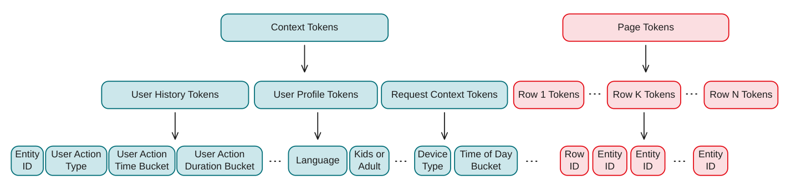
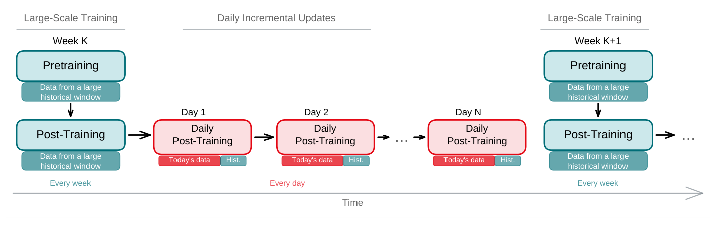
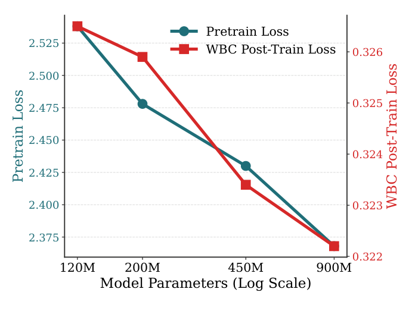
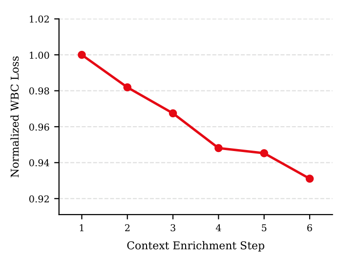
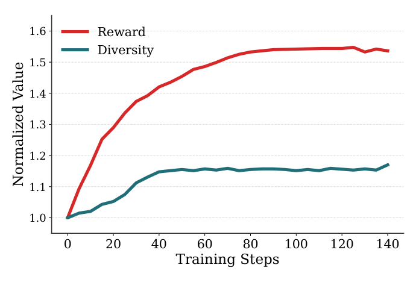
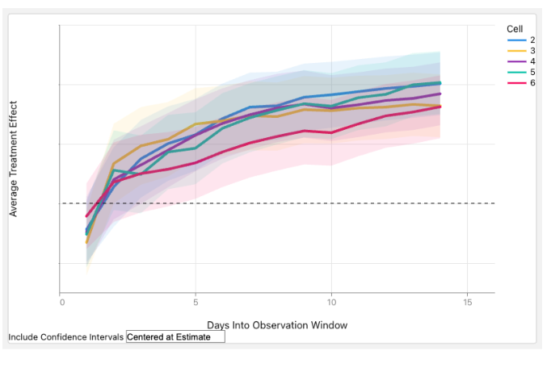

# GenPage：迈向 Netflix 端到端生成式首页构建

> Lequn Wang（美国纽约市）、Jiangwei Pan\*（美国加州洛斯加托斯）、Linas Baltrunas（美国加州洛斯加托斯）| Netflix
>
> \*该工作完成于作者任职 Netflix 期间。
>
> 邮箱：lequnw@netflix.com、panjiangwei@gmail.com、lbaltrunas@netflix.com

本文介绍了 GenPage——用**单个 transformer 端到端取代 Netflix 首页的多阶段推荐栈**：把用户和请求上下文 tokenize 成提示，把整个结构化多行首页当作响应自回归生成。核心发现是——**线上 A/B 测试核心参与指标 +0.24%（p < 0.001，近年最大算法驱动增益之一），端到端延迟反而降了 20%**；离线进一步发现，当前阶段"丰富提示"比"加大模型"更管用，且 RL 后训练意外提升了首页多样性。

核心内容：

- 传统首页构建是"候选生成→排序→重排"多阶段流水线，行/实体由多个专门模型独立建模，页面整体价值（行间交互、停止力）无法端到端优化
- GenPage 把首页构建建模为序列生成：领域定制 tokenizer（事件压成 4 个 token vs GPT-5 的 16 个），上下文+页面+反馈三件套训练样本，自定义 token 直接映射产品概念
- 训练沿用 LLM 配方：正向参与的生产页面上做下一 token 预测预训练，再用加权二元分类（WBC）或强化学习（RL，Dr. GRPO + verl + vLLM，页面级奖励模型）后训练
- 工业级落地四件套：冷启动（上下文注入 + 语义嵌入融合）、多节奏增量训练（周级大规模 + 日级增量）、业务规则（约束解码 + 回退 token）、推理效率（混合行解码）

关键发现：

- **线上 14 天 A/B（5 个变体 vs 生产基线）**：核心参与指标 +0.24%（95% CI [0.17%, 0.30%]，p < 0.001），全部 5 个变体统计显著；端到端延迟降 20%，打破"生成式更慢"的假设
- **提示 > 容量**：120M→900M 扩规模 WBC 损失仅降约 1.3%，而逐步丰富上下文累计降约 6.9%；单次精心设计的上下文添加就超过整个约 7.5× 容量扩展
- 预训练价值大：Entity AUC 0.910→0.920（误排率 9%→8%）；WBC 训练的生成式模型在加权 AUC 等实体级指标上超过生产排序器
- RL 后训练不在目标里也显著提升首页多样性（两两嵌入距离上升）——策略在整页优化而非逐 token 贪心
- 未来方向：RL 上线、长上下文端到端压缩、领域 token + 文本 token 混合 tokenization 把推荐做进 LLM

---

## 摘要

我们提出 GenPage，一种用于 Netflix 首页构建的端到端生成式方法，用单个 transformer 取代传统的多阶段推荐栈。GenPage 将用户和请求上下文视为提示，并将完整的结构化多行首页作为响应自回归地生成。我们适配了大语言模型（LLM，Large Language Model）的训练配方：在生产页面上预训练，随后通过加权二元分类（WBC，Weighted Binary Classification）或强化学习（RL，Reinforcement Learning）进行后训练。为支持工业级部署，我们引入了应对冷启动、模型新鲜度、业务规则执行和服务效率的技术。在与一个成熟且高度优化的生产首页推荐器的在线 A/B 测试中，GenPage 在我们用于发布决策的核心用户参与指标上带来了可观的提升，同时将端到端服务延迟降低了 20%。离线方面，有两个发现尤为突出：在我们当前的规模阶段，丰富提示带来的改进大于扩展模型容量；并且 RL 后训练提高了首页多样性，尽管多样性并非目标的一部分。

## 1 引言

大语言模型（LLM）已经展示了一个强大的范式：单个生成式 transformer 可以通过生成以提示（prompt）为条件的响应来执行多种任务。更广泛地说，它们重塑了我们对机器学习系统的思考方式：一个在端到端训练下表达力足够强的模型，可以减少对人工设计的表示和特征的依赖。

传统上，推荐系统被构建为多阶段流水线——候选生成、排序和重排——每个阶段单独优化 [5, 8]。构建像 Netflix 这样的首页又增加了一层复杂性：输出不是单一的排序列表，而是一个由行（row）和行内实体（entity）组成的结构化布局。这里，行是围绕某个主题或目的组织起来的一水平集合（例如"继续观看"或"韩剧"），实体则是电影、剧集或其他可推荐的 item。行或实体的价值可能取决于页面的其余部分。历史上，这种布局由多个专门模型组装而成，包括分别用于行和实体的模型。

在本文中，我们提出 GenPage，一种用于 Netflix 首页构建的端到端生成式方法。我们不再通过多个专门模型阶段和大量特征工程来构建首页，而是训练一个单一的生成式模型来回答一个更直接的问题：

> 给定我们对这位用户和这次请求所知的一切，我们应该生成什么样的首页来最大化用户满意度？

它将用户历史和请求上下文作为提示，并将整个首页作为响应自回归地生成。这一转变源于几个愿望：

- **端到端建模。** 一个从原始输入信号构建页面的单一 transformer 模型，可以取代复杂的多阶段推荐栈。这减少了需要维护的 ML 模型数量，缓解了各阶段之间目标不一致的问题，并消除了大部分传统特征工程。
- **通过强化学习（RL）进行整页优化。** 自回归页面生成使得用 RL 优化页面级奖励成为可能。这可以捕获行与实体之间的交互，例如多样性，或平衡具有不同停止力（stopping power）的行——停止力衡量一个行或实体吸引注意力并阻止用户继续浏览的强度。^[^1] 在页面级别建模这些交互，使我们能够比大多数传统推荐系统使用的实体级目标更直接地将系统与用户满意度对齐。
- **更好的扩展行为。** 推荐质量可以随着更多数据、算力和模型容量而提升，而无需对系统进行重大重新设计。
- **灵活性与可扩展性。** 提示-响应范式天生灵活。通过简化特征工程并支持整页优化，GenPage 使得支持新的产品体验更容易，包括直播活动、游戏和播客等额外内容类型；超越当前二维结构的布局；个性化 UI 组件；以及按实体定制的 artwork 个性化，且所需架构改动更少。

将 GenPage 引入 Netflix 生产环境还需要解决工业级推荐系统特有的一系列挑战。由于首页是实时生成的，服务延迟是首要的工程约束。我们还需要在不断演化的目录中处理实体冷启动（cold start），在用户兴趣和趋势变化时保持模型新鲜度，并对生成的输出强制执行复杂的产品和业务规则。

尽管存在这些挑战，GenPage 已经展示了可观的生产影响力。我们在一场在线 A/B 测试中，针对 Netflix 首页上一个成熟且高度优化的多阶段生产推荐器，验证了加权二元分类（WBC）后训练变体。它在我们用于发布决策的核心用户参与指标上带来了 +0.24% 的提升（p < 0.001），这是近年来最大的算法驱动增益之一，同时将端到端服务延迟降低了 20%。我们基于 RL 的后训练尚未上线，但我们将其视为实现 GenPage 全部潜力的关键路径。

具体而言，本文做出以下贡献：

- 我们将结构化、多行个性化界面的构建形式化为一个端到端生成式序列建模问题，其中单个 transformer 直接自回归地生成整个页面。这个问题为许多工业级推荐器所共有，例如 Netflix 首页、Amazon 首页和 Spotify 的首页货架，其输出都是元素相互作用的结构化行或模块布局。这与以往生成式推荐的工作 [2, 9, 10, 12, 13, 15, 18, 33, 43, 47, 49] 形成对比，后者主要聚焦于生成扁平的 item 排序列表。与以往页面级推荐工作 [1, 11, 46, 48] 相比，GenPage 将 LLM 的端到端生成式建模范式带到整页构建中，并在其余贡献中解决了在工业规模上这样做的挑战。
- 我们为这一场景适配了 LLM 训练配方：在正向参与的生产页面上预训练，以学习首页构建的"语言"，随后通过加权二元分类（WBC）或强化学习（RL）后训练，使页面与用户满意度对齐。WBC 训练模型估计每个 token 的即时价值，同时在服务时仍以自回归方式解码完整首页；RL 则针对一个直接从每个页面上有机用户参与训练的页面级奖励模型优化策略，这与 LLM RLHF 中通常使用的成对人工偏好 [6, 30] 形成对比。
- 我们提出了一套针对工业级生成式推荐的技术：用于服务效率和产品控制的自定义 tokenization；用于实体冷启动的上下文注入和语义嵌入融合；用于模型新鲜度的多节奏增量训练；用于业务规则执行的约束解码；以及用于推理时进一步降低延迟和成本的混合行解码。
- 我们报告了刻画预训练、模型扩展、上下文丰富度和 RL 后训练作用的离线实验。有两个发现尤为突出：在我们当前的阶段，丰富提示带来的改进大于扩展模型容量；并且 RL 后训练提高了首页多样性，尽管多样性并非目标的一部分。
- 我们在一次在线 A/B 测试中，与 Netflix 生产首页推荐器进行对比验证了 GenPage，证明它可以在用户参与度和服务延迟两方面显著超越一个成熟的多阶段生产栈。

我们预计这种方法可以推广到许多个性化场景。我们以 Netflix 首页构建作为具体案例研究，并分享我们的设计、权衡和学到的经验。

## 2 数据

从传统推荐模型转向生成式 transformer，需要在数据表示上进行根本性转变。正如 LLM 将文本表示为 token 序列，我们的方法将用户上下文和生成的首页都表示为离散 token 序列（图 1）。该序列包含完整的结构化首页布局，包括多个行及行内实体，因此模型可以整体生成页面，而不是孤立地对每个行或实体打分。

每个训练样本代表一次首页展示，由三部分组成：

- **上下文：** 用户参与历史、个人资料属性和请求上下文。
- **页面：** 首页上展示的推荐行和实体，按布局顺序排列。
- **反馈：** 用户与该页面的交互，例如播放、点赞以及对页面上实体的放弃。

只有上下文和页面被 tokenize 为模型输入和输出。反馈通过我们的内部奖励系统（第 3 节）用于推导监督信号。

我们没有使用现成的文本 tokenizer，而是为首页构建数据构建了一个领域特定的 tokenizer。这是推荐系统 [23] 以及其他专业领域（包括计算机视觉 [34]、生物学 [35] 和化学 [36]）中被证明有效的方法。与通用文本 tokenization 相比，这给了我们两个关键优势：

- **计算效率。** 自定义 tokenization 显著缩短了序列长度，从而降低了推理成本和延迟。例如，表示事件"用户 30 天前观看《女子监狱》（Orange Is the New Black）50 分钟"用 GPT-5 需要 16 个 token，而我们的方案将其压缩为 4 个 token：[Entity_ID]、[Action_Type]、[Action_Time_Bucket] 和 [Action_Duration_Bucket]。
- **产品控制。** token 与行、实体等产品概念之间的直接映射，使我们更容易控制模型可以生成什么。这对于在最终首页上强制执行业务规则至关重要（第 6.3 节）。

> **图 1：** Netflix 首页构建数据的 tokenization。上下文 token 充当提示，来自多种数据源，包括用户历史、个人资料属性和请求上下文，每个数据源展示了示例 token。页面 token 表示生成的响应，编码行和实体的结构化布局。

### 2.1 上下文 token

上下文 token 编码用户参与历史、用户个人资料和请求上下文。

我们将用户历史表示为 tokenize 后的用户动作序列 [16, 23, 39]。对每个动作，我们提取关键元数据作为 token，包括动作类型、实体 ID、时间戳和时长。这些动作既包括播放、添加到"我的清单"、点赞等显式信号，也包括预告片观看或访问详情页等隐式信号。

用户个人资料 token 捕获语言和个人资料类型等属性。请求上下文 token 编码时段、星期几和设备等信号。

有些数据源太长，无法直接以原始 token 序列的形式包含。例如，用户的完整展示历史全量 tokenize 的成本高得难以承受。在这种情况下，我们使用摘要版本。这是一个务实的权衡：虽然 GenPage 的目标是尽可能在原始输入上运行，但手工构建的摘要仍然向流水线中引入了一种形式的提示工程。学习端到端压缩这些长数据源是未来工作的重要方向。

为帮助模型区分数据源，我们插入标记每个源段开始位置的特殊 token。时间戳和时长等连续信号被分桶（bucketized）为离散区间，以维持有限词表。

### 2.2 页面 token

我们将每个实体（如电影或剧集）和每个行（如"韩剧"）表示为单个 token。首页按布局顺序 tokenize：从左到右、从上到下。我们每天更新实体和行词表，以纳入新加入的实体和行。在服务时，仍处于词表之外的实体通过语义嵌入融合（第 6.1 节）和回退 token（第 6.2 节）处理。

原则上，同样的范式可以扩展到任何可以表示为线性 token 序列的输出。这包括超越当前二维结构的布局，例如一维信息流或混合布局，以及个性化 UI 组件（如每个行的显示大小）和按实体输出的内容（如个性化 artwork）。我们将这些扩展留待未来工作。

### 2.3 分页推荐

为使推荐对会话内用户偏好做出响应，首页通常被增量生成，一次几行。在每次分页请求之前，我们将先前生成行的页面 token 追加到提示中，连同用户在这些行上的最新参与（来自 Netflix 的实时事件日志基础设施）。这使模型能够利用用户的长期偏好和最近的会话内参与来生成下一组推荐。

## 3 奖励系统

为了量化推荐的长期价值，我们依赖先前工作中描述的内部奖励系统 [42]。该奖励系统通过在线 A/B 测试调优，以与长期用户满意度对齐，并作为监督学习和强化学习的核心监督信号。

奖励系统处理用户反馈，并为首页上每个展示的实体分配一个标量奖励。例如，一夜之间狂追完的电视剧反映了更强的用户满意度，获得的奖励高于只看了 10 分钟的电影。展示但被放弃的实体获得负奖励。

我们将页面级奖励定义为首页上所有展示实体的奖励之和。

## 4 模型架构

GenPage 使用标准的仅解码器 transformer 架构 [32]，与许多现代 LLM 底层的一般架构相同。这一选择使模型保持简单和灵活，同时让我们能够利用更广泛的 LLM 生态系统中 transformer 架构、训练方法和服务系统的持续进步。

一个架构细节是，我们解绑输入嵌入与输出投影的权重 [19, 31]。这很有用，因为预训练和后训练对 logit 提出了不同的要求。下一 token 预测预训练（在词表上优化 softmax）与 WBC 后训练（优化逐 token 的 sigmoid）之间的最优 logit 尺度差异显著；参见第 5 节。解绑权重使模型有更多灵活性来同时适应这两个目标。

在我们第一轮在线 A/B 测试中，我们使用约 $\sim$200M 参数的模型，以确保我们保持在服务延迟预算内。离线扩展趋势（第 7 节）表明，随着推理优化创造延迟余量，还可以获得进一步的质量提升。

## 5 训练配方

我们的训练流水线模仿 LLM 配方：首先通过预训练教模型学习 Netflix 首页的"语言"，然后通过后训练将其输出与用户满意度对齐。对于后训练，我们探索两种替代方法：加权二元分类（WBC）和强化学习（RL）。

WBC 优化起来更简单，并与我们生产排序模型的实体级目标直接对齐。RL 更难评估和优化，但它是实现 GenPage 整页优化全部愿景的关键路径，并且具有整合测试时推理和多 token 实体表示的灵活性。

### 5.1 通过下一 token 预测进行预训练

我们用标准的下一 token 预测目标预训练模型：给定上下文 token 和页面 token 的一个前缀，模型学习预测下一个页面 token。这一阶段专注于表示学习，教模型理解用户上下文与成功首页之间的关系。注意，我们的上下文-页面训练样本更像 LLM 监督微调（SFT，Supervised Fine-Tuning）中使用的提示-响应对，而不是 LLM 预训练中使用的原始文本。我们仍然将这一阶段称为预训练，因为我们从零开始训练模型，而不是从现有 checkpoint 微调。

与常常面临高质量标注数据稀缺问题的 LLM 不同，推荐系统拥有丰富的用户反馈。对于预训练，我们使用在生产中服务时获得正向用户反馈的首页展示，引导模型生成与生产系统生成的页面相似的页面。

然而，预训练主要教会 GenPage 模仿生产系统。它不直接优化奖励的大小，而且随着 GenPage 成为生产的一部分，反复在早期版本模型生成的页面上训练有模型退化 [38] 的风险。为克服这些局限，我们探索了两种后训练方法。

### 5.2 通过加权二元分类进行后训练

将生成式模型与用户满意度对齐的一种有效方法是加权二元分类（WBC）。从高层次看，WBC 将生成转变为 token 级价值预测：给定用户上下文和迄今为止生成的 token，模型学习估计生成每个可能的下一个行或实体 token 的价值。

这一目标比页面级 RL 更容易优化。通过将首页分解为逐 token 目标，WBC 按构造提供了 token 级信用分配，而不需要 RL 去推断每个生成决策如何贡献于最终的页面级奖励。

这种训练设置得益于我们的自定义 tokenization（第 2 节）。每个页面 token 直接对应一个特定实体或行，使得分配奖励变得简单。对于页面上每个展示的实体，我们的奖励系统基于用户反馈提供一个标量奖励。对于每个展示的行，我们通过聚合该行内实体的奖励来推导行级奖励。

从每个奖励中，我们从其符号推导二元标签，例如正向参与与放弃，并从其大小推导权重，例如连续观看的权重高于短暂播放。然后我们在对应 token 的 logit 上优化加权二元交叉熵损失。在此设置下，token 的 logit 可以解释为模型对在该位置生成该 token 的价值估计。

对于每个展示的实体和行目标，我们还采样随机 token 作为负目标。由于很少被展示的 token 作为随机负样本被抽中的频率远高于其作为正样本出现的频率，这会向它们学到的价值中注入一种轻微的悲观（pessimism）[26, 40]——实际上是一种流行度先验——并防止模型自信地浮现出那些高分本会被噪声主导的小众实体。

尽管是作为价值预测器训练的，模型仍然可以自回归地生成页面。在每一步，它计算所有候选 token 的价值（logit），贪心地选择价值最高的那个，并将其追加到前缀。这个过程逐 token 重复，以生成整个首页。

在我们用于生产排序模型的标准留出评估集上，WBC 训练的生成式模型在加权 AUC（AUC，Area Under the ROC Curve，ROC 曲线下面积）等关键实体级指标上超过了我们的生产排序器。这表明，端到端的生成式公式可以在标准实体级离线指标上匹敌或超越多阶段生产栈。

### 5.3 通过强化学习进行后训练

强化学习（RL）是我们正在积极探索的后训练方向。虽然 WBC 在优化实体级指标方面很有效，但它并不直接优化首页整体。通过将页面生成视为一个序列决策过程，RL 实现了整页优化，同时保留了自回归生成的灵活性。这可以为几个重要能力打开大门：

- **整页优化。** RL 直接优化一个聚合的页面级奖励，考虑行与实体之间的交互，例如多样性和停止力，以及页面级业务约束。
- **测试时推理。** 与在 LLM 中的应用类似，RL 可以优化生成式推荐的推理能力 [28, 45]。推理输出也可以被视为一种自动特征工程的形式。
- **多 token 实体支持。** 在我们的自定义 tokenization 中，每个实体和行都是单个 token，因此奖励可以干净地映射到单个 token。然而，在更复杂的设置中，一个实体可能由多个 token 表示（例如，剧集内的某一集用 [Show_ID] + [Episode_#]，或多 token 语义 ID [33]）。在这种情况下，WBC 的逐 token 标注变得模棱两可，因为单个实体级奖励必须分配给多个 token。RL 通过优化序列级回报避免了这个问题的存在，使其更适合可变长度的多 token 实体。

其中，本文只探索了整页优化；测试时推理和多 token 实体支持是采用 RL 的动机的一部分，但属于未来工作方向。

受用于对齐大语言模型的两步 RLHF（Reinforcement Learning from Human Feedback，基于人类反馈的强化学习）配方 [6, 30] 启发，我们首先训练一个奖励模型，预测生成页面的页面级结果奖励，然后针对其预测优化生成策略。这个奖励模型与第 3 节的奖励系统不同。奖励系统将观察到的用户反馈转换为实际展示页面的标量奖励，而奖励模型预测任何生成页面（未展示给用户）的页面级奖励。正是这种预测让 RL 能够在训练期间针对任意候选页面进行优化。

针对奖励模型进行训练避免了记录或预测倾向上的离策略修正 [4] 的高方差，但引入了奖励黑客攻击（reward hacking）的风险。由于奖励模型是在生产策略生成的数据上训练的，它只在类似生产策略生成的页面上最可靠。因此，我们使用 KL 惩罚使策略保持接近预训练 checkpoint，而预训练 checkpoint 本身又经过训练以模仿生产策略。这使页面保持在奖励模型的覆盖区域内，并限制了奖励黑客攻击的机会。

对于 RL 算法，我们采用 Dr. GRPO [29]，它是 GRPO [14] 的一个变体，可缓解训练目标中的偏差。我们使用 verl RL 库 [37] 构建训练流水线，并以 vLLM [27] 作为推理引擎。要在该框架内训练模型，我们需要以下组件：

- **提示：** 生产用户请求，由上下文 token 表示。
- **策略和参考模型：** 两者都从预训练 checkpoint 初始化；参考模型锚定上述 KL 惩罚。
- **奖励模型：** 一个专门的基于 transformer 的奖励模型，也从预训练 checkpoint 初始化，预测页面级结果奖励，以我们内部奖励系统实体级奖励之和作为监督目标。我们还纳入基于规则的奖励来引导 RL 策略。例如，页面应该看起来像一个行列表，关键业务行或实体不应出现在页面过靠下的位置。

**未解决的挑战。** 与依赖稀缺的、人工标注的非结构化文本响应的成对偏好比较的 LLM RLHF 不同，我们的场景在结构化页面的实体和行级别上有直接的用户反馈。充分利用这种更丰富的结构化信号引发了两个相关的挑战。（1）离线评估：我们当前的页面级评估依赖一个策略也在针对其优化的奖励模型，这在很大程度上是循环的。人工标注——LLM 评估中的常见替代方案——也有问题，因为每个用户的偏好依赖于第三方标注者无法复现的个人上下文。候选方向包括专门的留出奖励模型、基于规则的评估和反事实估计器 [3, 20, 41]。（2）分解与联合建模：WBC 和页面级 RL 处于两个极端：WBC 将页面完全分解为实体级优化（简化了优化，但丢失了行与实体之间的一些交互），而页面级 RL 联合优化整个页面而不进行结构分解（捕获了行与实体之间的所有交互，但更难优化且样本效率更低）。利用部分结构的中间方案——混合目标、结构化策略参数化，或来自用户行为模型（例如点击模型 [7] 或选择模型 [44]）的假设，尤其是为二维页面布局开发的那些 [21, 22]——很有前景。

## 6 应对生产挑战

### 6.1 冷启动

新实体缺乏学习稳健 token 嵌入所需的丰富交互数据。我们通过两种互补策略来解决这个问题：

- **上下文注入。** 我们直接将新实体或时效敏感实体（例如"正在直播"活动）的元数据注入上下文 token，为模型提供语义和时效敏感信息。
- **语义嵌入融合。** 我们不仅依赖从用户交互数据学习的实体 ID 嵌入，还将每个实体表示为 ID 嵌入与基于语义信息（如剧情简介、演员阵容、字幕、类型和视频内容）的内容嵌入的融合。该融合嵌入作为 transformer 中该实体 token 的输入嵌入。在训练期间，以较小的概率，我们随机用通用回退 token（第 6.2 节）替换实体 ID token，因此模型学会仅基于内容嵌入做推荐。这确保新实体在其内容元数据可用时，甚至在它有任何交互数据之前，就在与既有实体相同的潜在空间中拥有一个有意义的表示。

### 6.2 多节奏增量训练

在 Netflix 规模上，每天从头重新训练大型 transformer 的成本高得难以承受，但推荐模型必须保持新鲜，以捕捉不断变化的趋势和新的目录加入。我们用多节奏增量训练策略（图 2）来解决这个问题。

> **图 2：** 多节奏增量训练策略。周期性的大规模预训练和后训练在大范围历史窗口上运行。在两者之间，每日增量后训练更新将最新一天的数据与过去数据的采样子集相结合，以保持模型新鲜，同时避免灾难性遗忘。

我们的训练流水线以循环调度运行，具有两种不同的节奏。在可调节奏下，我们在一个广阔的历史窗口的数据上执行大规模预训练和后训练。在两次大规模训练之间，我们每天通过从前一天的 checkpoint 继续后训练来执行增量更新，使用最新一天的数据与过去数据采样子集的混合。这帮助模型跟上新趋势和目录变化，同时防止过拟合和灾难性遗忘 [25]。

为管理每天涌入的新 token（例如新实体、新行），我们采用回退 token。新 token 使用其类型的回退 token 初始化（例如新行用 [Row_Fallback_Token]，新实体用 [Entity_Fallback_Token]）。在训练期间，我们随机将一小部分已知 token 替换为回退 token，教模型优雅地处理未知 token。

### 6.3 执行业务规则

Netflix 首页必须满足结构约束（例如，组织为行列表）以及产品逻辑，如去重、行固定和类别一致性（例如，"喜剧"行中的实体必须是喜剧）。虽然训练信号可以鼓励遵守规则，但它们不能保证严格遵守。

我们在推理时通过约束解码执行这些规则。在每个自回归生成步骤，我们基于适用的业务规则计算合格 token 的掩码，并将其应用于输出 logit，只允许符合规则的 token 被生成。我们的自定义 tokenization（第 2 节）大大简化了这一过程：因为每个实体和行都是单个 token，业务规则直接映射为 token 级掩码，避免了约束解码在文本词表上所需的多 token 簿记。例如，要将特定行（例如热门游戏）固定在一个固定位置（例如第 2 行位置），我们只需在该位置屏蔽所有其他 token。

**表 1：有预训练与无预训练的 WBC 后训练性能。** Loss 是加权二元交叉熵。Row AUC 和 Entity AUC 是行/实体目标上样本加权的 ROC-AUC。

| 指标 | 有预训练 | 无预训练 |
| --- | --- | --- |
| Loss | 0.321 | 0.333 |
| Row AUC | 0.884 | 0.879 |
| Entity AUC | 0.920 | 0.910 |

GenPage 面临的一个挑战是，适用的业务规则可能因请求而异。与复用固定约束集的常见 LLM 约束解码场景不同，GenPage 必须为每个请求和每个位置动态构建 token 掩码，这需要对推理引擎进行多处定制，以将解码延迟保持在预算内。

### 6.4 混合行解码

自回归生成确保每个新生成的 token 都以完整的先前上下文为条件，但逐 token 生成每个实体 token 可能很昂贵。我们利用首页的结构在推理效率与每个生成 token 可用的上下文信息量之间取得平衡。

在每行内，前几个实体尤其重要：它们获得最多的用户注意力，并强烈影响该行的感知质量和主题。为降低推理延迟，我们使用混合行解码策略。模型只对每行的前几个实体进行自回归生成。以这个生成的前缀为条件，我们在单次前向传播中为所有合格实体获得 logit，并选择得分最高的剩余实体，受上述相同的推理时业务规则约束。

这种方法在最关键的地方保留了自回归条件，同时避免了逐 token 解码长行的延迟和成本。

## 7 离线实验

我们提供在 Netflix 内部数据上的消融实验，刻画 GenPage 的不同组件如何影响模型质量。由于系统是迭代开发的，各消融实验跨越不同的训练配置和数据快照，因此我们只报告每项研究内部的相对比较。除非另有说明，实验使用约 $\sim$200M 参数的模型，并在一个留出评估集上报告结果。我们聚焦于与从业者最相关的指标和发现。

### 7.1 预训练有帮助吗？

我们比较了有和没有前序下一 token 预测预训练阶段的 WBC 后训练。表 1 显示预训练在所有指标上都带来了可观的改进。这些增益绝对值看起来可能很小，但在我们的生产规模下很大：撇开样本加权不谈，Entity AUC 从 0.91 提升到 0.92 意味着，对随机抽取的展示实体正负对，模型的误排率从 9% 降到 8%——这种量级的改进在一个成熟的生产系统上极少由单一变更实现。在 Netflix 首页的"语言"上预训练为后训练提供了一个强大的初始化，印证了现代 LLM 背后的先预训练再后训练配方。

> **图 3：** 模型规模从 120M 扩展到 900M 参数时的预训练和 WBC 后训练损失。两者都以类似幂律的方式下降，印证了 LLM 的扩展趋势。

### 7.2 性能如何随模型规模扩展？

我们将模型规模从约 $\sim$120M 扫到约 $\sim$900M 参数（图 3），并报告预训练的下一 token 预测损失和后训练的 WBC 损失。两条损失曲线都以类似幂律的方式下降，印证了 LLM 中观察到的扩展趋势 [17, 24]。这证实生成式方法随模型规模扩展良好，表明推荐质量可以通过扩展容量进一步提高。

### 7.3 性能如何随用户上下文中的信息扩展？

在开发过程中，我们逐步丰富了提示，既向上下文添加新的数据源，也改进每个源被 tokenize 的方式。在模型规模固定的情况下，图 4 显示 WBC 后训练损失随上下文丰富而显著下降。

模型规模扫描和上下文丰富扫描跨越不同的轴，并不严格可比：模型规模研究覆盖了大约一个数量级的参数量，而上下文研究覆盖了我们提示设计的完整轨迹。即便如此，两者之间的差距仍令人震惊。将模型从 120M 扩展到 900M 参数将 WBC 损失降低约 1.3%，而丰富上下文的累积效果约为 6.9%。在几个案例中，一次精心设计的上下文添加带来的改进就超过了整个约 $\sim$7.5 倍的容量扩展。

> **图 4：** 逐步丰富用户上下文 token 时的 WBC 后训练损失。损失归一化到步骤 1（= 1.0）。由于各项实验是在不同的数据快照上进行的，每一步的值是由其相对于前一步的实测相对改进复合而成，而非直接针对共享基线测量。

这表明，在我们的规模阶段，丰富提示——包括我们放入上下文的内容以及我们 tokenize 它的方式——带来的改进比扩展模型容量大得多。个性化质量似乎首先受限于模型可用的信息和表示，然后才是容量。我们预计上下文丰富将一直占主导，直到上下文饱和，此时模型容量成为主要驱动力。

### 7.4 RL 后训练是在页面级别进行优化吗？

在离线评估中（图 5），RL 后训练持续提升预训练 checkpoint 之上的页面级奖励，但这在很大程度上是预期内的：奖励是用策略正在针对其优化的同一个模型计算的。更有趣的是，尽管多样性不是 RL 目标的一部分，首页多样性——通过页面上实体之间的两两嵌入距离衡量——也在训练过程中增加。这表明 RL 训练的策略是在整体优化页面，而不是目光短浅地孤立优化每个 token。

> **图 5：** RL 后训练的训练动态。奖励和多样性相对于初始预训练 checkpoint（1.0）显示。奖励如预期稳步上升。多样性也显著增加，尽管它不是 RL 目标的一部分，这表明策略在整体优化页面，而不是目光短浅地孤立优化每个 token。

## 8 在线评估

我们针对当前的生产首页推荐器进行了一场在线 A/B 测试，使用约 $\sim$200M 参数的 WBC 模型。在这次测试中，GenPage 在现有的生产行和实体候选集上解码，这有助于处理许多业务规则（例如，资格）。我们只在线上评估 WBC 变体；将 RL 训练扩展到我们的数据规模、完善页面级奖励模型以及加强其离线评估都在进行中，我们计划在后续 A/B 测试中评估 RL 后训练。

> **图 6：** 14 天在线 A/B 测试中的每日核心用户参与指标。该图绘制了五个 GenPage 变体（单元 2–6，训练数据配置不同）相对于生产基线（单元 1）在我们用于发布决策的指标上的平均处理效应。阴影区域表示 95% 置信区间。所有五个变体都相对生产带来了统计显著的改进，表现最好的变体（单元 2）在第 14 天达到了 0.24% 的相对提升。

图 6 显示了结果：所有五个变体都对我们用于发布决策的核心用户参与指标带来了统计显著的改进（p < 0.001），与一个成熟且高度优化的多阶段生产基线相比。表现最好的变体带来了 +0.24% 的提升（95% CI [0.17%, 0.30%]）。这代表了近年来最大的算法驱动增益之一。这些变体探索了不同数量的随机负样本（第 5.2 节）以及对训练中纳入哪些生产展示的不同过滤条件；所有五个变体都带来了可比的提升，这表明增益对这些设计选择是稳健的，而不是依赖于某个特定配置。

在参与度胜利的同时，我们观察到展示实体构成在几个维度上的非预期变化（例如，新片与老片、电视剧与电影、以及较高与较低的参与质量）。这些变化不一定是负面的，但它们不是我们显式优化的对象，值得更深入的调查。我们怀疑这些变化反映了 GenPage 比生产栈更精确地个性化——与首页展示效率的提升一致，即用户用更少的展示参与他们看到的内容。这种更锐利的个性化似乎暴露了从生产系统继承的组件（例如奖励系统）尚未与新生成式范式对齐。我们计划刻画这些变化的驱动因素，并在适当的地方调优这些组件，使产生的分布与期望的产品行为更好地对齐。

我们还观察到对会话内信号的强烈响应性：最新的会话内动作（第 2.3 节）迅速影响后续推荐，并在一两天后回落到长期偏好，这证实模型有效地关注了动作时间戳。这种响应性自然地源自生成式公式，而无需生产栈中使用的大量手工特征工程。

与生成式模型通常较慢的普遍假设相反，GenPage 将端到端服务延迟相对于基线降低了 20%。通过用单个在原始 tokenize 输入上运行的 transformer 模型取代多个排序阶段和大量特征计算，我们消除了可观的服务复杂性和计算开销。自定义 tokenization 和混合行解码进一步减少了解码步数，从而降低了延迟。20% 的降低是在没有耗尽可用优化的前提下实现的；还有进一步降低的空间。这个余量可以重新投资于容量或更丰富的提示。

## 9 结论

我们提出了 GenPage，迈向端到端生成式 Netflix 首页构建的早期一步：将用户上下文表示为 tokenize 后的提示，并实时自回归生成整个首页。这将传统的多阶段推荐栈坍缩为单个可端到端优化的 transformer。

在针对一个成熟且高度优化的多阶段生产系统的在线 A/B 测试中，GenPage 在我们用于发布决策的核心用户参与指标上带来了 +0.24% 的可观提升（p < 0.001），同时将端到端服务延迟降低了 20%。实现这一点需要适配 LLM 训练配方——预训练加上 WBC 或 RL 后训练——以及一套领域特定技术：用于服务效率和产品控制的自定义 tokenization、用于实体冷启动的上下文注入和语义嵌入融合、用于模型新鲜度的多节奏增量训练、用于业务规则执行的约束解码，以及用于推理效率的混合行解码。

有两个离线发现尤为突出。首先，在我们当前的阶段，丰富提示带来的改进远大于扩展模型容量——我们预计这一经验可以推广到其他工业级个性化场景，至少在可用上下文被完全利用之前如此。其次，RL 后训练提高了首页多样性，尽管多样性并非目标的一部分——这表示页面级优化捕获了行与实体之间的交互。

完整愿景的几个部分仍在进行中：RL 后训练尚未上线，长上下文仍然依赖手工构建的摘要，更广泛的 LLM 风格能力——语言、多模态和推理——尚未整合进来。这里一个有前景的方向是混合 tokenization，将我们的领域特定 token 与通用文本 token 相结合，在保留结构化控制的同时继承通用 LLM 的优势；从概念上讲，这相当于向 LLM 中引入一种额外的推荐模态。

更广泛地说，我们期望 LLM 生态系统的许多进步能自然地迁移到这个场景，而 LLM 与推荐系统之间的边界可能会越来越模糊。我们的结果表明，这是一条通往更简单、更灵活、与用户满意度更直接对齐、并能更容易支持新产品体验的推荐系统的可行路径。

## 致谢

我们按字母顺序感谢 Abhishek Agrawal、Ashish Rastogi、Baolin Li、Casey Stella、Dan Zheng、Daneo Zhang、Ding Tong、Donnie DeBoer、Fengdi Che、Fernando Amat Gil、Grace Huang、Hakan Baba、Inbar Naor、Ishita Verma、Jason Uh、Jimmy Patel、Justin Basilico、Lanxi Huang、Lingyi Liu、Liping Peng、Louis Wang、Michelle Kislak、Nathan Kallus、Nicolas Hortiguera、Paran Jain、Qusai Al-Rabadi、Rein Houthooft、Ryan Lee、Santino Ramos、Scarlet Chen、Shaojing Li、Sheallika Singh、Si Cheng、Wei Wang、Yesu Feng 和 ZQ Zhang 对本工作的贡献，并特别感谢 Fengdi Che 负责强化学习实验。

## 参考文献

[1] Deepak Agarwal, Shaunak Chatterjee, Yang Yang, and Liang Zhang. 2015. Constrained optimization for homepage relevance. In International Conference on World Wide Web (WWW).
[2] Prabhat Agarwal, Anirudhan Badrinath, Laksh Bhasin, Jaewon Yang, Edoardo Botta, Jiajing Xu, and Charles Rosenberg. 2025. PinRec: Outcome-Conditioned, Multi-Token Generative Retrieval for Industry-Scale Recommendation Systems. arXiv preprint arXiv:2504.10507 (2025).
[3] Léon Bottou, Jonas Peters, Joaquin Quinonero-Candela, Denis X. Charles, D. Max Chickering, Elon Portugaly, Dipankar Ray, Patrice Simard, and Ed Snelson. 2013. Counterfactual Reasoning and Learning Systems: The Example of Computational Advertising. Journal of Machine Learning Research 14 (2013), 3207–3260.
[4] Minmin Chen, Alex Beutel, Paul Covington, Sagar Jain, Francois Belletti, and Ed H Chi. 2019. Top-K off-policy correction for a REINFORCE recommender system. In ACM International Conference on Web Search and Data Mining (WSDM).
[5] Heng-Tze Cheng, Levent Koc, Jeremiah Harmsen, Tal Shaked, Tushar Chandra, Hrishi Aradhye, Glen Anderson, Greg Corrado, Wei Chai, Mustafa Ispir, et al. 2016. Wide & Deep Learning for Recommender Systems. In Proceedings of the 1st Workshop on Deep Learning for Recommender Systems.
[6] Paul F. Christiano, Jan Leike, Tom B. Brown, Miljan Martic, Shane Legg, and Dario Amodei. 2017. Deep Reinforcement Learning from Human Preferences. In Advances in Neural Information Processing Systems (NeurIPS).
[7] Aleksandr Chuklin, Ilya Markov, and Maarten de Rijke. 2022. Click models for web search. Springer Nature.
[8] Paul Covington, Jay Adams, and Emre Sargin. 2016. Deep Neural Networks for YouTube Recommendations. In ACM Conference on Recommender Systems.
[9] Edoardo D’Amico, Marco De Nadai, Praveen Chandar, Divita Vohra, Shawn Lin, Max Lefarov, Paul Gigioli, Gustavo Penha, Ilya Kopysitsky, Ivo Joel Senese, et al. 2026. Deploying Semantic ID-based Generative Retrieval for Large-Scale Podcast Discovery at Spotify. arXiv preprint arXiv:2603.17540 (2026).
[10] Marco De Nadai, Edoardo D’Amico, Max Lefarov, Alexandre Tamborrino, Divita Vohra, Mark VanMiddlesworth, Shawn Lin, Jacqueline Wood, Jan Stypka, Eliza Klyce, et al. 2026. A Unified Language Model for Large Scale Search, Recommendation, and Reasoning. arXiv preprint arXiv:2603.17533 (2026).
[11] Weicong Ding, Dinesh Govindaraj, and SVN Vishwanathan. 2019. Whole page optimization with global constraints. In ACM SIGKDD International Conference on Knowledge Discovery & Data Mining (KDD).
[12] Hamed Firooz, Maziar Sanjabi, Adrian Englhardt, Aman Gupta, Ben Levine, Dre Olgiati, Gungor Polatkan, Iuliia Melnychuk, Karthik Ramgopal, Kirill Talanine, et al. 2025. 360Brew: A decoder-only foundation model for personalized ranking and recommendation. arXiv preprint arXiv:2501.16450 (2025).
[13] Shijie Geng, Shuchang Liu, Zuohui Fu, Yingqiang Ge, and Yongfeng Zhang. 2022. Recommendation as Language Processing (RLP): A Unified Pretrain, Personalized Prompt & Predict Paradigm (P5). In ACM Conference on Recommender Systems (RecSys).
[14] Daya Guo, Dejian Yang, Haowei Zhang, Junxiao Song, Peiyi Wang, Qihao Zhu, Runxin Xu, Ruoyu Zhang, Shirong Ma, Xiao Bi, et al. 2025. DeepSeek-R1 incentivizes reasoning in LLMs through reinforcement learning. Nature 645, 8081 (2025), 633–638.
[15] Ruining He, Lukasz Heldt, Lichan Hong, Raghunandan Keshavan, Shifan Mao, Nikhil Mehta, Zhengyang Su, Alicia Tsai, Yueqi Wang, Shao-Chuan Wang, Xinyang Yi, Lexi Baugher, Baykal Cakici, Ed Chi, Cristos Goodrow, Ningren Han, He Ma, Romer Rosales, Abby Van Soest, Devansh Tandon, Su-Lin Wu, Weilong Yang, and Yilin Zheng. 2025. PLUM: Adapting Pre-trained Language Models for Industrial-Scale Generative Recommendations. arXiv preprint arXiv:2510.07784 (2025).
[16] Balázs Hidasi, Alexandros Karatzoglou, Linas Baltrunas, and Domonkos Tikk. 2016. Session-Based Recommendations with Recurrent Neural Networks. In International Conference on Learning Representations (ICLR).
[17] Jordan Hoffmann, Sebastian Borgeaud, Arthur Mensch, Elena Buchatskaya, Trevor Cai, Eliza Rutherford, DDL Casas, Lisa Anne Hendricks, Johannes Welbl, Aidan Clark, et al. 2022. Training compute-optimal large language models. arXiv preprint arXiv:2203.15556 (2022).
[18] Yanhua Huang, Yuqi Chen, Xiong Cao, Rui Yang, Mingliang Qi, Yinghao Zhu, Qingchang Han, Yaowei Liu, Zhaoyu Liu, Xuefeng Yao, Yuting Jia, Leilei Ma, Yinqi Zhang, Taoyu Zhu, Liujie Zhang, Lei Chen, Weihang Chen, Min Zhu, Ruiwen Xu, and Lei Zhang. 2025. Towards Large-Scale Generative Ranking. arXiv preprint arXiv:2505.04180 (2025).
[19] Hakan Inan, Khashayar Khosravi, and Richard Socher. 2016. Tying word vectors and word classifiers: A loss framework for language modeling. arXiv preprint arXiv:1611.01462 (2016).
[20] Thorsten Joachims, Ben London, Yi Su, Adith Swaminathan, and Lequn Wang. 2021. Recommendations as treatments. AI Magazine 42, 3 (2021), 19–30.
[21] Jingwei Kang, Maarten de Rijke, Santiago de Leon-Martinez, and Harrie Oosterhuis. 2025. Rethinking click models in light of carousel interfaces: Theory-based categorization and design of click models. In International ACM SIGIR Conference on Innovative Concepts and Theories in Information Retrieval (ICTIR).
[22] Jingwei Kang, Maarten de Rijke, and Harrie Oosterhuis. 2026. Following the Eye-Tracking Evidence: Established Web-Search Assumptions Fail in Carousel Interfaces. In International ACM SIGIR Conference on Research and Development in Information Retrieval (SIGIR).
[23] Wang-Cheng Kang and Julian McAuley. 2018. Self-Attentive Sequential Recommendation. In IEEE International Conference on Data Mining (ICDM).
[24] Jared Kaplan, Sam McCandlish, Tom Henighan, Tom B Brown, Benjamin Chess, Rewon Child, Scott Gray, Alec Radford, Jeffrey Wu, and Dario Amodei. 2020. Scaling laws for neural language models. arXiv preprint arXiv:2001.08361 (2020).
[25] James Kirkpatrick, Razvan Pascanu, Neil Rabinowitz, Joel Veness, Guillaume Desjardins, Andrei A Rusu, Kieran Milan, John Quan, Tiago Ramalho, Agnieszka Grabska-Barwinska, et al. 2017. Overcoming catastrophic forgetting in neural networks. Proceedings of the National Academy of Sciences 114, 13 (2017), 3521– 3526.
[26] Aviral Kumar, Aurick Zhou, George Tucker, and Sergey Levine. 2020. Conservative Q-learning for offline reinforcement learning. In Advances in Neural Information Processing Systems (NeurIPS).
[27] Woosuk Kwon, Zhuohan Li, Siyuan Zhuang, Ying Sheng, Lianmin Zheng, Cody Hao Yu, Joseph Gonzalez, Hao Zhang, and Ion Stoica. 2023. Efficient Memory Management for Large Language Model Serving with PagedAttention. In ACM Symposium on Operating Systems Principles (SOSP).
[28] Mingfu Liang, Yufei Li, Jay Xu, Kavosh Asadi, Xi Liu, Shuo Gu, Kaushik Rangadurai, Frank Shyu, Shuaiwen Wang, Song Yang, et al. 2026. Generative Reasoning Re-ranker. arXiv preprint arXiv:2602.07774 (2026).
[29] Zichen Liu, Changyu Chen, Wenjun Li, Penghui Qi, Tianyu Pang, Chao Du, Wee Sun Lee, and Min Lin. 2025. Understanding r1-zero-like training: A critical perspective. In Conference on Language Modeling (COLM).
[30] Long Ouyang, Jeffrey Wu, Xu Jiang, Diogo Almeida, Carroll L. Wainwright, Pamela Mishkin, Chong Zhang, Sandhini Agarwal, Katarina Slama, Alex Ray, et al. 2022. Training Language Models to Follow Instructions with Human Feedback. In Advances in Neural Information Processing Systems (NeurIPS).
[31] Ofir Press and Lior Wolf. 2017. Using the output embedding to improve language models. In Conference of the European Chapter of the Association for Computational Linguistics: Volume 2, Short Papers.
[32] Alec Radford, Jeffrey Wu, Rewon Child, David Luan, Dario Amodei, Ilya Sutskever, et al. 2019. Language models are unsupervised multitask learners. OpenAI blog 1, 8 (2019), 9.
[33] Shashank Rajput, Nikhil Mehta, Anima Singh, Raghunandan Hulikal Keshavan, Trung Vu, Lukasz Heldt, Lichan Hong, Yi Tay, Vinh Tran, Jonah Samost, et al. 2023. Recommender systems with generative retrieval. In Advances in Neural Information Processing Systems (NeurIPS).
[34] Aditya Ramesh, Mikhail Pavlov, Gabriel Goh, Scott Gray, Chelsea Voss, Alec Radford, Mark Chen, and Ilya Sutskever. 2021. Zero-Shot Text-to-Image Generation. In International Conference on Machine Learning (ICML).
[35] Alexander Rives, Joshua Meier, Tom Sercu, Siddharth Goyal, Zeming Lin, Jason Liu, Demi Guo, et al. 2021. Biological Structure and Function Emerge from Scaling Unsupervised Learning to 250 Million Protein Sequences. Proceedings of the National Academy of Sciences 118, 15 (2021), e2016239118.
[36] Philippe Schwaller, Teodoro Laino, Théophile Gaudin, Peter Bolgar, Christopher A. Hunter, Costas Bekas, and Alpha A. Lee. 2019. Molecular Transformer: A Model for Uncertainty-Calibrated Chemical Reaction Prediction. ACS Central Science 5, 9 (2019), 1572–1583.
[37] Guangming Sheng, Chi Zhang, Zilingfeng Ye, Xibin Wu, Wang Zhang, Ru Zhang, Yanghua Peng, Haibin Lin, and Chuan Wu. 2025. HybridFlow: A Flexible and Efficient RLHF Framework. In European Conference on Computer Systems (EuroSys).
[38] Ilia Shumailov, Zakhar Shumaylov, Yiren Zhao, Nicolas Papernot, Ross Anderson, and Yarin Gal. 2024. AI Models Collapse When Trained on Recursively Generated Data. Nature 631, 8022 (2024), 755–759.
[39] Fei Sun, Jun Liu, Jian Wu, Changhua Pei, Xiao Lin, Wenwu Ou, and Peng Jiang. 2019. BERT4Rec: Sequential Recommendation with Bidirectional Encoder Representations from Transformer. In ACM International Conference on Information and Knowledge Management (CIKM).
[40] Adith Swaminathan and Thorsten Joachims. 2015. Batch learning from logged bandit feedback through counterfactual risk minimization. The Journal of Machine Learning Research 16, 1 (2015), 1731–1755.
[41] Adith Swaminathan, Akshay Krishnamurthy, Alekh Agarwal, Miroslav Dudik, John Langford, Damien Jose, and Imed Zitouni. 2017. Off-Policy Evaluation for Slate Recommendation. In Advances in Neural Information Processing Systems (NeurIPS).
[42] Gary Tang, Jiangwei Pan, Henry Wang, and Justin Basilico. 2023. Reward Innovation for Long-Term Member Satisfaction. In ACM Conference on Recommender Systems (RecSys).
[43] Yi Tay, Vinh Q. Tran, Mostafa Dehghani, Jianmo Ni, Dara Bahri, Harsh Mehta, Zhen Qin, Kai Hui, Zhe Zhao, Jai Gupta, Tal Schuster, William W. Cohen, and Donald Metzler. 2022. Transformer Memory as a Differentiable Search Index. In Advances in Neural Information Processing Systems (NeurIPS).
[44] Kenneth E Train. 2009. Discrete choice methods with simulation. Cambridge University Press.
[45] Alicia Tsai, Adam Kraft, Long Jin, Chenwei Cai, Anahita Hosseini, Taibai Xu, Zemin Zhang, Lichan Hong, Ed H Chi, and Xinyang Yi. 2024. Leveraging LLM reasoning enhances personalized recommender systems. In Findings of the Association for Computational Linguistics.
[46] Yue Wang, Dawei Yin, Luo Jie, Pengyuan Wang, Makoto Yamada, Yi Chang, and Qiaozhu Mei. 2016. Beyond ranking: Optimizing whole-page presentation. In ACM International Conference on Web Search and Data Mining (WSDM).
[47] Jiaqi Zhai, Lucy Liao, Xing Liu, Yueming Wang, Rui Li, Xuan Cao, Leon Gao, Zhaojie Gong, Fangda Gu, Jiayuan He, Yinghai Lu, and Yu Shi. 2024. Actions Speak Louder than Words: Trillion-Parameter Sequential Transducers for Generative Recommendations. In International Conference on Machine Learning (ICML).
[48] Xiangyu Zhao, Long Xia, Liang Zhang, Zhuoye Ding, Dawei Yin, and Jiliang Tang. 2018. Deep reinforcement learning for page-wise recommendations. In ACM Conference on Recommender Systems (RecSys).
[49] Guorui Zhou, Hengrui Hu, Hongtao Cheng, Huanjie Wang, Jiaxin Deng, Jinghao Zhang, Kuo Cai, Lejian Ren, Lu Ren, Liao Yu, et al. 2025. OneRec-V2 Technical Report. arXiv preprint arXiv:2508.20900 (2025).

[^1]: 例如，靠近顶部的"继续观看"行具有很高的停止力：用户倾向于继续观看已经开始的内容，而不是探索新内容。视觉呈现也很重要；artwork 更大的行往往会减少进一步的滚动。
