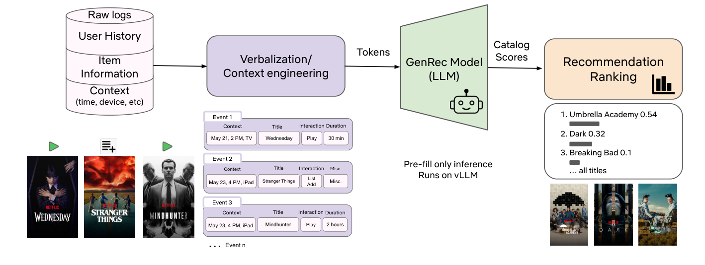
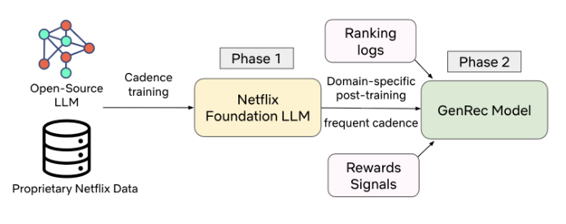

# GenRec：Netflix 的 LLM 支撑推荐排序器

> Ying Li、Shradha Sehgal\*、Arjun Rao、Rein Houthooft\*、Yaochen Zhu、Ashish Rastogi | Netflix（美国加州洛斯加托斯）
>
> \*该工作完成于作者任职 Netflix 期间。
>
> 邮箱：yingl@netflix.com、shradhasehgal7@gmail.com、arjunr@netflix.com、rein.houthooft@gmail.com、yzhu@netflix.com、arastogi@netflix.com

本文介绍了 GenRec——Netflix 自研的 LLM 支撑推荐排序器：用自带基础 LLM 做两阶段训练（Phase 1 打底 + Phase 2 高频后训练），把用户历史、item 元数据和上下文直接"文本化"成提示喂给解码器模型，在**一个前向传播内给整个 Netflix 目录打分排序**。核心发现是——**只用生产系统约 1/40 的 Phase-2 标注数据和输入信号，GenRec 就在线上 A/B 测试和离线指标上取得统计显著提升，LLM 原生推荐是走通的路**。

核心内容：

- 传统推荐栈依赖数千个手工特征、复杂的定制架构（双塔、DLRM 式特征交互、多任务网络），上新内容形态/新展示位成本极高，难以跟上业务增长
- GenRec 走两阶段框架：Phase 1 用 Netflix 专有数据把开源 LLM 调成 Netflix 基础模型（低频更新、重内容与用户理解）；Phase 2 用排序专用数据、标签和奖励信号高频后训练
- 输入侧做"上下文工程"：把原始交互日志文本化为自然语言提示，按信号质量决定完整保留/整体省略/压缩/选择性扩写，在固定 token 预算内构建紧凑高信息量上下文
- 架构侧：解码器 LLM 骨干 + 目录感知打分头，配奖励加权排序损失（多家奖励模型输出作为样本权重），并用采样 softmax 支持超大目录
- 服务侧：vLLM + 仅预填充（prefill-only）推理，一次前向为全目录输出分数，不逐 token 解码；配合压缩上下文与蒸馏小模型控制成本

关键发现：

- 线上 A/B 测试（约 10% 流量、4 周）：短期首页参与指标 +0.115%（P = 3.1 × 10⁻¹⁰），长期核心指标 +0.006%（P = 0.025），均统计显著
- 离线 MRR 提升约 +1.6%——而 Phase-2 标注训练样本只有生产模型的约 1/40，数据效率是 Phase-2 高频刷新模式下最值钱的资产
- **上下文压缩是最大成本杠杆**：文本化从约 5,000 token 压到约 1,700 token（约 1/3），离线质量几乎无损，服务成本同步降至约 1/3
- 消融归因：Phase 1 贡献 +10–20% 离线指标，Phase 2 贡献 +35–50%（模型越旧增益越大，两周后约 +80%）；数据规模 1x–20x 与模型规模 ~1B→~10B 均呈单调扩展

---

## 摘要

大语言模型（LLM，Large Language Model）正在重塑推荐系统：它直接在自然语言中实现了对用户、内容和上下文更丰富的建模。在 Netflix，我们正通过 GenRec 探索这一方向——一个构建于内部基础 LLM 之上的 LLM 支撑推荐排序器。GenRec 采用两阶段框架：Phase 1 将开源 LLM 适配到 Netflix 数据，在平衡内容理解、指令遵循等能力的同时，建立对目录和会员行为的深入理解。Phase 2 用推荐排序专用的数据、标签和奖励信号对该基础模型进行后训练，旨在让排序器与业务需求和长期会员满意度对齐。本文聚焦 Phase 2 以及从拥有数千个工程化特征的传统判别式排序器到由文本化用户历史与上下文驱动的 LLM 支撑排序器的转型。我们描述了输入文本化（verbalization）与上下文工程、后训练数据构建、奖励整合、模型架构，以及基于仅预填充（prefill-only）推理方法的成本受限服务设计。我们报告了一场大规模 A/B 测试的结果，将 GenRec 与当前生产排序模型对比，表明用显著更少的 Phase-2 标注训练样本和输入信号训练的 GenRec 模型，可以在离线和在线指标上取得统计显著的提升。我们讨论了 LLM 支撑推荐器如何改变推荐范式：从特征工程转向上下文工程，从定制架构转向共享的基础骨干。我们还总结了在真实资源约束下服务此类系统的实用经验。

## 1 引言

推荐系统是 Netflix 数亿会员体验的核心。我们当前生产环境中的推荐系统基于大量手工构造的特征（覆盖用户、item 和交互信号）以及广泛的更高阶特征交互生成个性化标题推荐，这与先前的大规模推荐系统一致 [3, 4, 11, 15]。它们还采用了针对不同推荐需求定制的、复杂且专用的架构。例如，用于建模特征交互的专用网络、用于捕获动态会员兴趣的基于 transformer 的架构，以及支撑多个推荐任务的多任务学习架构 [10, 14, 27, 28]。

这些模型经过多年的迭代，为 Netflix 产品中各种内容类型（电影、剧集、游戏、直播活动、播客等）生成推荐。虽然这一架构已成为我们会员体验的关键部分，但它越来越难以支撑新的业务需求。例如，接入一个新的内容类型或推荐展示位，通常需要特征工程、模型架构设计、基础设施变更和实验方面的大量工作。结果，系统的复杂性使其难以跟上 Netflix 业务的快速增长。

近来，大语言模型（LLM）开始重塑推荐系统在整个行业中的设计、部署和利用方式 [9, 13, 23]。它们广博的世界知识和富有表现力的语言理解能力，使其比传统架构能对用户、内容和上下文进行更丰富的建模。这为下一代推荐开辟了新的可能性：直接将用户历史和上下文信号表示为自然语言，凭借对用户偏好和 item 语义更深的理解生成更好的推荐。它还能更快地适配新用例，例如通过提示（prompt）来引导（steer）推荐，而不是重新设计专用的模型和流水线。

然而，开箱即用的 LLM 尚不适合直接作为生产级推荐器：它们倾向于过度推荐全球热门内容、幻想出目录外的标题、忽略微妙的业务约束，并提供有限的个性化。为解决这些问题，我们构建了 GenRec——一个在 Netflix 语料上对内部基础 LLM 进行后训练的 LLM 支撑推荐排序器。具体而言，我们聚焦于全目录排序用例，并证明基于 LLM 的推荐排序器是一条可行且有前景的路径。GenRec 是我们从传统推荐技术栈迈向 LLM 原生系统的第一步。

要使用 GenRec 生成推荐，我们首先将用户交互历史、item 元数据和上下文信息文本化为自然语言，然后对该文本表示进行 tokenize 并送入 LLM（图 1）。为了学习 Netflix 特有的用户偏好并避免过度推荐热门 item，我们在 Netflix 目录和会员行为数据上对模型进行后训练。我们通过在训练中整合多个奖励信号，将推荐输出与长期会员满意度和业务目标对齐。我们进一步让模型对 Netflix 目录"感知"（catalog-aware），即把它的输出约束到 Netflix 目录中的 item，从而消除目录外推荐。最后，我们在成本约束下优化 GenRec，并将其集成到 Netflix 的 LLM 服务技术栈中。

> **图 1：** GenRec 推理流水线。用户历史、item 元数据和上下文的原始日志通过上下文工程设计转换为自然语言提示，输入 GenRec 模型；该模型运行在 vLLM 上、采用仅预填充模式，为整个 item 目录输出分数，从而产生推荐排序[^1]。

与现有生产推荐排序器相比，GenRec 大幅简化了特征工程。我们不再手工构造复杂的特征交互，而是依赖 LLM 直接从原始输入文本中推断这些交互和用户偏好。这把推荐问题从特征工程转变为上下文工程：决定向模型展示哪些信息、如何在有限的 token 预算内表达这些信息、以及优化什么目标和奖励，而不是迭代地设计和整合新的特征与特征交互。

GenRec 还受益于预训练基础 LLM 的能力——如用户理解和内容理解——因此我们无需从零构建这些能力。结果，我们观察到 GenRec 可以用比传统模型显著更少的 Phase-2 标注样本和输入信号，达到成熟生产排序器的水平。这种 Phase-2 后训练阶段的边际数据效率尤其宝贵，因为 Phase-1 基础训练以低得多的频率运行，而 Phase-2 模型刷新更频繁。我们用离线实验和一场针对成熟生产基线的大规模在线 A/B 测试来评估 GenRec。在测试的配置中，GenRec 只使用当前生产技术栈 Phase-2 标注训练数据和输入信号的一小部分，却在离线和在线指标上都取得了统计显著的提升，同时减少了对手工特征和定制架构的依赖。这些结果共同表明，至少在所测试的推荐展示位上，LLM 支撑排序器是传统模型可行且有前景的替代方案。

本文的贡献包括：

- **可与成熟生产系统竞争的 LLM 支撑排序。** 我们提出 GenRec——构建于内部基础 LLM 之上的 LLM 支撑推荐排序器，并将其与一个长期运行、高度工程化的生产排序器对比。用显著更少的 Phase-2 训练样本和输入信号训练的 GenRec 模型，在我们主要的离线和在线指标上取得了统计显著的增益。
- **一个收益量化、以 LLM 为核心的两阶段训练框架。** 我们验证了两阶段训练方案：Phase 1 将开源 LLM 适配到 Netflix 数据，构建 Netflix 感知的基础模型；Phase 2 针对推荐排序进行高频后训练。我们阐明了两个阶段各自的角色和目标，并实证分解了它们对排序质量的影响，表明两个阶段都带来了可观增益。
- **一个带目录感知打分的 LLM 支撑排序架构。** 我们描述了一个使用生成式仅解码器 LLM 骨干、以及可在单次前向传播中给大型 item 目录打分的目录感知打分头的架构。该设计支持在大型候选集上排序，同时将推荐限制在目录内 item。
- **将上下文工程与奖励加权训练作为质量-成本控制的实用杠杆。** 我们把上下文工程和奖励整合视为一流的设计维度。在上下文方面，我们表明精心的文本化设计可以将有效上下文长度减少到原 token 预算的约三分之一，而离线排序质量几乎无损失，服务成本也获得相近比例的降低。在目标方面，我们通过奖励加权排序损失整合多个奖励信号，以稳健且成本高效的方式引导模型向长期价值和业务目标靠近。
- **关于数据/模型扩展与质量-成本权衡的实证观察。** 我们刻画了推荐质量如何随 Phase-2 后训练数据和骨干规模扩展，以及这些增益如何与训练和服务成本相互作用。我们观察到各种模型规模下一致、单调的数据扩展行为，并在 Phase-2 配置的质量-成本 Pareto 前沿上识别出实用的"甜点区"（sweet spots）。这些发现为在资源约束下设计 LLM 支撑推荐器提供了可操作的指导。

本文其余部分组织如下。第 2 节将我们的工作置于现有生成式与基于 LLM 的推荐研究背景中。第 3 节形式化问题设定。第 4 节描述我们的方法，包括输入文本化、模型架构、后训练数据与奖励、以及服务优化。第 5 节展示离线实验和一场大规模在线 A/B 测试的结果。第 6 节讨论 LLM 原生推荐可能带来的范式转移。第 7 节总结并展望未来的工作方向。

[^1]: 所示文本化示例仅供说明，并不反映生产环境中的真实用户数据。

## 2 相关工作

### 2.1 使用特殊 token 的生成式推荐

一条不断壮大的研究线索将推荐建模为用户交互序列上的自回归生成。SASRec [10] 和 BERT4Rec [21] 等序列推荐器通过 item ID 序列上的下一个 item 预测确立了这一范式。工业系统此后用 transformer 解码器骨干扩展了这一范式，其词表用编码 item ID、item 元数据、语言区域、时间、设备、展示位等的特殊 token 扩充，使模型能够以异构信息为条件 [1, 16, 25]。

一个互补的方向是将 item tokenize 成语义码（semantic codes）以捕获 item 的语义含义。例如，TIGER [19] 将每个 item 表示为通过内容嵌入上的 RQ-VAE（Residual Quantized Variational Autoencoder，残差量化变分自编码器）学习的短"语义 ID"序列，支持在数十亿 item 的目录上进行自回归解码。该方法的变体已被多家平台采用，包括 Google 的排序 [20] 和快手（Kuaishou）的端到端检索-排序 [6]。这些模型展现了强劲的性能，但它们利用广博世界知识、通过灵活提示引导推荐或继承现代预训练语言模型更丰富能力的能力通常受限。这些局限催生了一条并行的研究线索：直接在 LLM 骨干之上构建推荐器。

### 2.2 基于 LLM 的推荐

大语言模型在各种任务上的成功启发了一条研究线索：用预训练 LLM 作为推荐器的骨干，而不是用特殊 token 从零训练推荐系统专属的 transformer。早期的学术系统把推荐建模为语言模型之上的文本到文本生成 [2, 7, 24]。

为了让 LLM 直接生成 item 而非自由文本，近期的工业系统用语义 ID item token 扩展 LLM 词表。Google 的 PLUM [8] 通过语义 ID tokenization、领域数据上的持续预训练和任务特定微调，在 YouTube 规模上适配预训练 LLM。Spotify 的 GLIDE [5] 将播客发现刻画为语义 ID 目录上的指令遵循。快手的 OneRec-Think [12] 用 Qwen3 模型骨干和推理步骤扩展 OneRec。大多数基于 LLM 的生成式检索系统在推理时依赖带束搜索的自回归解码，这引入的延迟开销在规模上可能是不可接受的，尤其是对大型候选集。我们的工作通过给基础 LLM 架构增配目录感知排序头来规避这些局限，使其能在单次前向传播中给大型候选集排序，让服务更具成本效益。此外，我们明确地以 LLM 视角设计系统，包括有效的上下文工程和奖励整合，以在真实资源约束内满足业务需求并优化长期用户满意度。

## 3 问题设定

在 GenRec 中，我们聚焦一个全目录排序问题（如果给定候选集，则是 top-K 排序）。产生的排序列表可作为用户偏好的个性化表示，复用（reuse）于各种用例，包括各展示位上的 item 排序，以及作为下游应用的个性化输入信号。

**符号（Notation）。** 设 $U$ 表示用户集合，$C$ 表示 item 目录（电影、剧集、游戏、直播活动、播客等），$X$ 表示上下文空间（设备、展示位、语言区域、时段等）。这里，我们考虑由用户 $u \in U$、上下文 $\tau \in X$ 和时间 $t$ 刻画的一次推荐请求；设 $H$ 表示该用户在时间 $t$ 之前的交互历史。每个 item $i \in C$ 关联元数据 $M_i$（标题名、类型、简介、发布日期等）。

**排序目标（Ranking Target）。** 推荐器将请求 $(u, \tau, t, H)$ 映射到目录 $C$ 的一个排序 $\pi$，$\pi: C \to \{1, \ldots, |C|\}$，其中 $\pi(i)$ 表示指派给 item $i$ 的位置（排名 1 位于列表顶部）。目标是选择一个排序 $\pi$，最大化期望的长期会员效用——它是会员满意度和留存（retention）的代理指标——而不只是短期参与度。

## 4 方法

### 4.1 概述

GenRec 采用两阶段训练框架（图 2）。在 Phase 1 中，在开源（OSS）模型之上用 Netflix 专有数据训练基础 LLM，以建立对 Netflix 用户和内容的深入理解。在 Phase 2 中，我们进一步用排序应用特定的数据和目标对该基础模型进行后训练，产出为推荐排序任务定制和优化的 GenRec。

与 Phase 1 相比，GenRec 的 Phase-2 后训练追求几个不同的目标：

(1) **能力侧重：** Phase 1 优化并平衡一组广泛的基础能力，如世界知识、个性化能力、内容理解和语言能力。相比之下，Phase 2 更侧重推荐排序能力，如排序质量和推荐引导。

(2) **更新节奏：** Phase 1 更新相对不频繁，面向长期的用户与内容理解以及语言能力。Phase 2 需要更频繁地更新，以跟踪新内容上线（launches）、不断变化的流行度模式和会员的最新兴趣。

(3) **成本敏感性：** Phase 1 旨在构建最强大的基础模型，受服务成本约束较小；而 Phase 2 必须明确地成本高效，以服务大规模流量。

> **图 2：** 两阶段训练框架。Phase 1 在 Netflix 数据上训练基础 LLM，用于用户与内容理解；Phase 2 在推荐排序特定的数据和目标上进行后训练。

### 4.2 后训练数据

在 Netflix，会员在各种内容类型（包括电影、剧集、游戏、直播等）上产生数千亿交互事件。这些交互覆盖广泛的参与信号——观看、播放、点赞（thumbing）、加入片单（adding to list）等——并发生在多个推荐展示位上。

为了用推荐能力对 LLM 进行后训练，我们将会员的历史交互数据转换为用户与推荐器之间单轮或多轮的"对话"。每一轮把一个用户消息（结合上下文、历史和任务）与一个代表该轮会员实际参与的助手消息配对。具体而言，每段对话包含：

- **上下文：** 展示位、时间、设备、语言区域等。
- **用户画像与历史：** 国家、会员时长（tenure）、订阅方案、历史交互等。
- **item 级细节：** item ID、item 元数据（标题名、上线时间、简介等）、流行度趋势等。
- **任务：** 例如，预测用户接下来将播放或点赞的 item。
- **助手消息：** 用户的隐式或显式反馈（播放、播放时长、放弃、点赞等），在训练期间充当真实标签信号。

在 Phase-2 后训练期间，LLM 在这些对话数据上被优化，以建模助手消息如何依赖于前面的用户消息。这种对话式框架提供了一种统一的方式，将丰富的推荐日志表达为文本，随后用于训练"模型架构"一节中描述的语言建模目标和目录感知排序目标。

### 4.3 输入文本化与上下文工程

与把用户交互和 item 元数据编码为手工特征或稠密嵌入的传统推荐器不同，GenRec 将丰富的用户交互历史和上下文文本化为自然语言或轻结构化文本。通过直接在 LLM 的语义空间中编码原始交互信号，GenRec 依赖 LLM 学习更高层的模式——如 item 间关系、时间动态和不断演变的用户兴趣——而不是通过手工特征工程显式编码这些关系。

文本化不只是将信号转换成文本；它需要刻意的上下文工程（context engineering）[18]，以便在有限的 token 预算内容纳长用户上下文。会员的交互历史很容易超过 token 预算，既因为交互数量大，也因为每个交互的元数据丰富。上下文窗口是一种有限且宝贵的资源，过长的上下文会稀释注意力，并显著增加训练和推理成本。

因此，我们仔细策展哪些事件和属性进入上下文窗口：

- **完整保留：** 高信号参与，如长时播放和点赞事件，用更丰富的元数据文本化。
- **整体省略：** 近期低信号事件——如非常短的播放或有噪声的浏览/点击——被省略，因为它们相对于 token 成本，对排序质量贡献很小。
- **总结或压缩：** 重复行为，如连续追剧（binge-watching）会话，被压缩而不是重复列出每个事件。
- **选择性扩写：** 对重要 item（如新上线内容或冷启动（cold-start）item），我们可以包含更详细的元数据，以弥补预训练模型和历史交互中可用信息有限的问题。

在固定 token 预算内，我们优先用更高粒度保留短到中期历史，而更早的历史要么省略，要么压缩成简短的用户兴趣摘要。总体目标是构建一组紧凑且信息量高的 token，在不超出上下文窗口或招致难以承受的推理成本的情况下保持推荐质量。

### 4.4 后训练目标

GenRec 的 Phase-2 训练主要结合两个目标：

(1) **推荐排序目标。** 主要任务是目录感知排序目标：训练模型为对应高价值参与事件的 item 分配更高分数。在该任务中，正标签对应高质量的参与事件（如高时长播放、强显式反馈），并使用随内容类型变化的去噪逻辑和阈值。这些标签用于 item 目录（或候选集）上的交叉熵损失，教会模型在给定文本化上下文的情况下产生高质量的 item 排序。

(2) **语言建模目标。** 此外，我们还在文本化的输入和输出（如预测的标题和其他文本字段）上纳入语言建模目标。该任务帮助维持骨干模型的一般语言理解和文本生成能力，(i) 这对建模丰富的自然语言用户历史和 item 元数据很重要，(ii) 也能通过提示启用推荐引导。

训练时，模型被联合优化，目标为 (i) 给 item 打分以用于排序，以及 (ii) 建模文本领域（如预测标题和文本化上下文中的 token）。推理时，我们目前只用排序任务来生成推荐排序。语言建模目标主要用于引入互补的文本信息以改进排序任务、保持语言理解和响应提示引导的能力，并为未来文本生成用例（如自然语言解释）保留可能性。

GenRec 整体模型用一个多目标损失训练，该损失结合了推荐排序目标、语言建模目标以及其他适用目标：

$$
\begin{aligned}
L &= \alpha \cdot L_{\text{ranking}} + \beta \cdot L_{\text{language}} + \gamma \cdot L_{\text{miscellaneous}} \\
\text{s.t.} \quad & \alpha + \beta + \gamma = 1, \qquad \alpha, \beta, \gamma \geq 0
\end{aligned}
$$

其中 $\alpha$、$\beta$、$\gamma$ 是可调超参数，可通过离线实验调整。

### 4.5 模型架构

GenRec 的骨干架构紧密跟随基础 LLM：一个以 next-token 预测风格目标训练的仅解码器 Transformer。它增配了一个目录感知排序头，将推荐约束在 Netflix 目录内 item，并支持在大型候选集上高效打分。

**打分模型。** 分数通过以下三个阶段计算：

(1) **文本化（Verbalization）。** 一个文本化器（verbalizer）$V$ 将交互历史、上下文和 item 元数据映射为单一文本序列：

$$
x = V(H, \{M_i\}_{i \in C}, \tau) \qquad (1)
$$

(2) **池化表示（Pooled representation）。** LLM 将 $x$ 编码为 $d$ 维表示 $h$，取自某个池化位置的隐藏状态，它总结了用户偏好和上下文。

(3) **目录感知打分（Catalog-aware scoring）。** 一个打分头 $\phi$ 将 $h$ 与学习到的 $d$ 维嵌入 $e_i$ 结合，为每个 item $i$ 分配一个分数，作为推荐排序任务。

参数 $\theta$（包括 LLM 的权重、打分头 $\phi$ 和 item 嵌入 $\{e_i\}$）被联合训练。目录上的 softmax 将这些分数转换为概率分布。之后，目录排序 $\pi$ 可以从 item 分数推导出来。当目录太大而无法穷尽打分时，我们可以将打分与采样 softmax（sampled-softmax）结合。

### 4.6 奖励信号

除了原始推荐准确性，GenRec 还必须满足两个额外的目标：

(1) 尊重业务需求，如内容混合（content mixing）逻辑（例如，平衡电影、剧集、直播、游戏、播客等内容类型）。

(2) 最大化长期会员满意度，而不仅仅是优化短期用户参与度。

仅仅在原始交互序列上进行后训练会带来偏离这些目标的风险。例如，模型可能过度推荐追剧而非探索（discovery），偏好视频而非游戏，或选择以牺牲目录探索或长期留存为代价来最大化即时点击的 item。为解决这一问题，我们将源自独立奖励模型的奖励信号整合进 GenRec 的训练目标。我们使用两大类奖励：

(1) **长期满意度代理（proxies）。** 这些奖励估计短期参与事件与长期结果的相关强度。由于真实长期指标有噪声且延迟，我们依赖从历史数据中学习的更稳定的代理。例如，奖励模型会为鼓励会员回归服务、在目录更广区域探索、或带来持续参与度的参与事件分配更高价值。

(2) **跨内容与参与类型的行为再平衡。** 额外的奖励用于再平衡跨内容类型（如电影 vs. 游戏 vs. 直播 vs. 播客）和上线阶段（如上线前、新上线、常青（ever-green））的行为，以满足业务目标，如跨内容类型的曝光公平性。

我们利用现有奖励建模框架 [22] 中的多个奖励模型，并通过奖励加权排序损失将它们的输出整合进 GenRec。具体而言，每个训练样本被赋予一个由多个奖励信号推导的标量权重，该样本的排序损失相应缩放。高价值参与（根据奖励模型）获得更大权重，而低价值或不受欢迎的行为被降权。

这种奖励加权损失提供了一种简单、稳健且成本高效的方式，引导模型走向长期价值和业务一致的行为。与完整的强化学习方法相比，这种方法更易部署和维护。在初步实验中，RL 风格的方法（如 GRPO）在监督微调之上显示了额外增益，但其高训练开销使它们更适合未来工作。因此，目前我们采用奖励加权损失方法作为 GenRec 的主要对齐机制，出于其简单性、稳定性和成本考虑。

### 4.7 在线服务与成本优化

GenRec 使用 Netflix 内部的 LLM 服务技术栈，基于 vLLM 框架 [17] 提供服务。在 Netflix 规模（全球数亿会员）下，服务成本是一等约束，实际推理成本大致与模型规模和上下文长度的乘积成正比。因此，我们采用两种互补策略来优化服务成本。首先，我们探索在更大或更有针对性的数据集上训练的更小、经过蒸馏（distilled）的语言模型 [26]，旨在用更低的每次请求计算量恢复大模型的绝大部分质量。其次，我们通过前一节所述的文本化压缩（verbalization compaction）激进地优化上下文长度，在不显著降低离线排序质量的情况下减少表示输入信号所用的 token。

推理成本的另一个杠杆是推理模式。由于 GenRec 需要在大型候选集上排序 item，朴素的自动回归解码（如逐 token 生成或使用束搜索）会贵得不可接受。尽管底层骨干是一个能够自回归解码的生成式仅解码器 LLM，我们特意将 GenRec 部署为仅预填充（prefill-only）配置：模型只消费一次输入上下文，并在单次前向传播中为完整候选集产出排序。这避免了逐步解码，使 GenRec 能够在我们的算力预算内服务高流量工作负载。

## 5 实验与结果

在本节中，我们评估 GenRec 与生产模型的对比，分析性能如何随数据和模型规模扩展，量化 Phase-1 和 Phase-2 训练的贡献，并研究上下文长度优化的影响。

> **图 3：** GenRec 与生产模型的在线指标。GenRec 在短期和长期在线指标上都取得了统计显著的提升。

### 5.1 GenRec 与生产基线的对比

我们将 GenRec 与生产基线——一个经过多年调优的成熟判别式模型——进行了对比。

离线方面，GenRec 使用了显著更少的 Phase-2 训练数据和更少的输入信号，却在排序指标平均倒数排名（MRR，Mean Reciprocal Rank）上超过了生产模型。具体而言，GenRec 使用的 Phase-2 标注训练样本比生产模型少约 40 倍，在 MRR 上相对基线实现了约 +1.6% 的离线提升。此外，随着我们进一步扩大训练数据和输入信号，离线指标还在持续改善。

我们在一场大规模在线 A/B 测试中验证了这一结果，聚焦于关键的批量计算（batch-compute）展示位。我们分配了约 10% 的 Netflix 流量，持续 4 周。在低数据、低信号配置下，Phase-2 的 GenRec 模型在短期和长期在线指标上都取得了相对生产基线的统计显著提升（见图 3）。例如，我们观察到核心在线指标上 +0.006% 的相对提升，这在 Netflix 规模下具有统计意义。这些发现表明，一个 LLM 支撑排序器在配合适当的后训练和奖励信号时，可以成为传统推荐排序器可行且有前景的替代方案。

与生产排序器相比，GenRec 使用的训练样本和输入信号数量相对较少，这体现了 Phase-2 后训练的边际数据效率。由于 Phase 2 比 Phase 1 更新频繁得多，在这一阶段提高数据效率在实际中尤其宝贵，因为它直接减少了保持排序器新鲜所需的算力。

### 5.2 数据与模型扩展

**数据扩展：** 我们首先研究推荐质量如何随 Phase-2 后训练数据量扩展。保持其他变量不变，我们在最小数据规模配置 1 倍到 20 倍大小的数据集上训练 GenRec。我们对两种骨干规模进行了这项研究：一个较小的模型（约 $\sim$1B 参数量级）和一个较大的模型（约 $\sim$10B 参数量级）。对两种模型规模，我们都观察到随着 Phase-2 数据量的增加，离线排序指标 MRR 单调提升（图 4）。虽然 $\sim$1B 模型的绝对 MRR 低于 $\sim$10B 模型，但它表现出与 $\sim$10B 模型类似的扩展模式。

> **图 4：** $\sim$10B 模型的 Phase-2 数据扩展。

**模型扩展：** 我们还考察了推荐质量如何随骨干规模变化。我们在固定训练预算（相同的 GPU 配置和相似的墙钟训练时间）下，用不同规模的基座模型（约 $\sim$1B 到 $\sim$10B 参数量级）后训练了几个 GenRec 变体。在该约束下，更大的骨干始终比更小的骨干获得更高的离线 MRR。

**Phase-2 中的质量-成本权衡：** 虽然数据和模型扩展都提升了质量，它们也增加了训练和服务成本，尤其是对以更高节奏训练并直接服务大规模在线流量的 GenRec。因此，我们明确搜索平衡质量与成本的 Phase-2 配置：大得足以捕获绝大部分增量质量收益，但又不能大到使后训练或服务变得难以承受的昂贵。在实践中，我们结合数据与模型扩展曲线以及下文所述的上下文长度消融，在质量-成本 Pareto 前沿上识别出一个"甜点区"，在给定算力预算内恢复大部分可实现的质量提升。

### 5.3 Phase 1 与 Phase 2 对推荐任务的影响

我们量化了 Phase-1 基础训练和 Phase-2 后训练对离线排序指标的贡献。

**Phase 1。** 使用 Phase-1 基础 LLM 作为基座模型，相比使用现成（off-the-shelf）LLM 作为骨干，离线排序指标提升了约 10–20%。这凸显了从 Phase-1 基础模型继承的个性化和内容理解能力的重要性。

**Phase 2。** 在 Phase-1 训练截止日期评估时（即 Phase-1 模型最新鲜时），Phase-2 后训练在离线排序指标上提供了进一步的约 35–50% 增益。这凸显了任务特定适配的价值，包括领域特定数据、奖励和文本化。此外，Phase 2 的相对收益随时间增长：两周后提升升至约 80%，这符合预期。这种不断增长的增益既反映了任务特定适配的强度，也反映了更新频率更低的 Phase-1 骨干日益陈旧的影响，例如在内容流行度趋势变化和会员兴趣演变方面。

**表 1：Phase 1 与 Phase 2 训练的影响**（离线排序指标（MRR））

| 方案 | 影响 |
| --- | --- |
| Phase 1 的影响 | 相比使用 OSS 模型作为基础，+10–20% |
| Phase 2 的影响 | 相比新训练的 Phase 1，+35–50%，且增益随时间增大 |

### 5.4 上下文长度优化

LLM 中的上下文窗口既是质量驱动因素也是成本驱动因素：更长的文本化会暴露更多关于用户行为和上下文的信息，但也增加训练和服务成本。因此，我们研究上下文长度和冗长程度如何影响推荐性能，并明确搜索保持质量的紧凑文本化。我们在"输入文本化与上下文工程"的启发式基础上分几步进行。

- **首先，我们执行事件选择与压缩。** 我们省略低信号或有噪声的参与，压缩重复活动，并保留高信号交互。这产生一个清洗后、有序的、可作为候选纳入上下文的参与事件序列。
- **其次，我们搜索要详细展开（elaborate）的最优历史长度。** 从这个清洗后的序列出发，我们变化保留在提示中的历史事件数量。具体而言，我们扫描保留的参与事件数，画出 MRR 对参与事件数量的曲线。这揭示出一个肘点（elbow point）：质量随上下文长度增加到该点而提升，之后额外的 token 只带来边际收益（图 5）。
- **最后，我们构建简洁高效的文本化。** 对每个保留事件，我们用不同细节层级构建提示（如不同的参与细节、简化措辞、移除少样本示例）并测量离线性能。

在我们的实验中，我们观察到上下文长度可以压缩到原 token 预算的约三分之一（例如，从约 5,000 个 token 降到约 1,700 个 token），而离线排序指标的退化可以忽略不计。这对应于上下文规模的显著减少——因此推理成本也降低——同时保持基本相同的模型质量。由于 GenRec 很大程度上是计算受限的，服务成本约与上下文长度成正比，我们观察到服务成本同样降至原来的约三分之一。

> **图 5：** 提示中包含的用户参与事件数量与归一化离线排序指标（MRR）。虚线标记基线肘点：超过该点增加事件数量只会带来递减的回报。

## 6 讨论：LLM 原生推荐

GenRec 是 Netflix 走向更以 LLM 为中心的推荐技术栈的初步一步。从传统推荐系统转向基于 LLM 的系统，不只是"把排序器换成 transformer"：它改变了我们表示用户和内容的方式、构建模型和训练的方式、以及设计服务基础设施的方式。下面，我们概述这些变化中的几项，以及它们在 GenRec 中如何体现。整体上，它们让我们的推荐技术栈更接近更广阔的 LLM 范式。

### 6.1 从特征工程到上下文工程

传统系统围绕大量手工特征构建，并由大量的聚合、新鲜度、交互设计和泄漏控制基础设施支撑。相比之下，以 LLM 为中心的系统优先从原始交互序列、内容元数据、上下文、工具输出或用户记忆中构建丰富的文本上下文。"提示"成了新的特征向量。建模工作的重心从设计单个特征转向上下文工程：决定包含哪些信号、如何总结它们、时间上回溯多远、以及如何在有限的 token 预算内编码它们。我们在文本化压缩上的实验说明了这一转变：精心的上下文设计可以在大幅降低服务成本的同时保持质量。

### 6.2 从定制架构到基础骨干

历史上，推荐系统依赖各种各样的定制架构——双塔（two-tower）模型、DLRM 式特征交互网络、自定义注意力块和大型多任务架构。以 LLM 为中心的系统转而标准化到从基础模型继承的 transformer 骨干上。创新上移了一个层级：从逐任务架构设计转向数据、缩放定律、后训练策略和推理优化的问题。在 GenRec 中，我们复用与基础 LLM 相同的 LLM 骨干，而不是从零设计新架构。LLM 骨干还通过自然语言输入支持灵活的推荐引导，以支撑新的会员体验。

### 6.3 将缩放定律作为设计指南

经典 RecSys 技术栈可能因稀疏 ID、重度工程化的目标和任务特定架构而遭遇收益递减。在 LLM 支撑的设置中，推荐模型与预训练 LLM 共享骨干，并继承其数据和模型缩放行为。我们的研究显示了数据和模型规模两方面的清晰缩放趋势：随着 Phase-2 训练数据的增加，性能单调提升；在固定训练预算下，更大模型始终胜过更小模型。这使 RecSys 更接近更广阔的 LLM 范式，在该范式中缩放定律被视为核心设计指南，而非事后观察。

### 6.4 预训练、后训练与奖励对齐

以 LLM 为中心的方法不是从零构建每个推荐器，而是从一个预训练基础模型出发，然后用任务特定的后训练和奖励对齐来适配这个共享骨干。在 GenRec 中，Phase 1 提供 Netflix 感知的基础 LLM，Phase 2 用标签、奖励和文本化执行轻量的、推荐特定的适配。这种模式使创新更容易跨应用扩展：多个用例可以复用相同的基础设施，而不是在各自隔离开的系统中重复实现类似能力。

### 6.5 从 RecSys 基础设施到 LLM 基础设施

LLM 支撑推荐器必须处理更长的用户历史上下文，这使得服务效率成为核心设计关切。与此同时，LLM 本身训练和服务成本高昂，因此成本优化必须塑造模型规模、上下文长度和解码策略的选择。KV 缓存（KV-caching）、前缀缓存（prefix caching）和仅预填充推理等技术成为在成本预算内保持推理可行的关键杠杆。结果，推荐的在线服务技术栈越来越像现代 LLM 基础设施——GPU 加速、基于 vLLM/Triton、精心批处理和缓存——而不是围绕 MLP 或因子分解模型构建的经典 RecSys 基础设施。

## 7 结论与未来工作

我们介绍了 GenRec——Netflix 的 LLM 支撑推荐排序器，并描述了如何将内部基础 LLM 适配成一个适合批量计算展示位生产流量的排序器。通过文本化用户历史和上下文、增配目录感知排序头、并用多个奖励信号训练，我们得到了一个 LLM 支撑推荐器：尽管使用的 Phase-2 标签和显式输入信号远少于我们长期运行的生产排序器，它在我们研究的设置中，于短期和长期在线指标上都取得了相对后者的统计显著提升。

总体而言，GenRec 代表 Netflix 走向更以 LLM 为中心的推荐技术栈的初步一步。我们的结果表明，至少在某些场景下，这是一条大规模个性化可行且有前景的路径——前提是我们继续谨慎管理成本和基础设施复杂性，并对照强大的非 LLM 基线严格评估质量权衡。

## 8 致谢

GenRec 是 Netflix 多个团队和组织密切协作的成果。本工作的贡献者（按字母顺序）：

**AI for members（面向会员的 AI）：** Arjun Rao、Ashish Rastogi、Baolin Li、Fernando Amat Gil、Grace Huang、Justin Basilico、Kamelia Aryafar、Linas Baltrunas、Moumita Bhattacharya、Oghenevovo Dibie、Rein Houthooft、Shradha Sehgal、Sejoon Oh、Sergi Perez、Sourabh Medapati、Thea Wang、Yaochen Zhu、Yesu Feng、Ying Li、Yun Li、Yucheng Shi、Yunan Hu

**AI platform and serving（AI 平台与服务）：** Abhishek Agrawal、Adam Singer、Binh Tang、Daneo Zhang、Derek Olejnik、Ed Maddox、Erik Osheim、Lingyi Liu、Liping Peng、Meghana Chilukuri、Nicolas Hortiguera、Shaojing Li、ZQ Zhang

**Product（产品）：** Ilke Kaya、Michelle Kislak、Scarlet Chen、Si Cheng

## 参考文献

[1] Prabhat Agarwal, Anirudhan Badrinath, Laksh Bhasin, Jaewon Yang, Edoardo Botta, Jiajing Xu, and Charles Rosenberg. 2026. PinRec: Outcome-Conditioned, Multi-Token Generative Retrieval for Industry-Scale Recommendation Systems. arXiv:2504.10507 [cs.IR] https://arxiv.org/abs/2504.10507

[2] Keqin Bao, Jizhi Zhang, Yang Zhang, Wenjie Wang, Fuli Feng, and Xiangnan He. 2023. TALLRec: An Effective and Efficient Tuning Framework to Align Large Language Model with Recommendation. In Proceedings of the 17th ACM Conference on Recommender Systems (Singapore, Singapore) (RecSys ’23). Association for Computing Machinery, New York, NY, USA, 1007–1014. doi:10.1145/3604915.3608857

[3] Heng-Tze Cheng, Levent Koc, Jeremiah Harmsen, Tal Shaked, Tushar Chandra, Hrishi Aradhye, Glen Anderson, Greg Corrado, Wei Chai, Mustafa Ispir, Rohan Anil, Zakaria Haque, Lichan Hong, Vihan Jain, Xiaobing Liu, and Hemal Shah. 2016. Wide & Deep Learning for Recommender Systems (DLRS 2016). Association for Computing Machinery, New York, NY, USA, 7–10. doi:10.1145/2988450.2988454

[4] Paul Covington, Jay Adams, and Emre Sargin. 2016. Deep Neural Networks for YouTube Recommendations. In Proceedings of the 10th ACM Conference on Recommender Systems (Boston, Massachusetts, USA) (RecSys ’16). Association for Computing Machinery, New York, NY, USA, 191–198. doi:10.1145/2959100.2959190

[5] Edoardo D’Amico, Marco De Nadai, Praveen Chandar, Divita Vohra, Shawn Lin, Max Lefarov, Paul Gigioli, Gustavo Penha, Ilya Kopysitsky, Ivo Joel Senese, Darren Mei, Francesco Fabbri, Oguz Semerci, Yu Zhao, Vincent Tang, Brian St. Thomas, Alexandra Ranieri, Matthew N. K. Smith, Aaron Bernkopf, Bryan Leung, Ghazal Fazelnia, Mark VanMiddlesworth, Timothy Christopher Heath, Petter Pehrson Skiden, Alice Y. Wang, Doug J. Cole, Andreas Damianou, Maya Hristakeva, Reid Wilbur, Tarun Chillara, Vladan Radosavljevic, Pooja Chitkara, Sainath Adapa, Juan Elenter, Bernd Huber, Jacqueline Wood, Saaketh Vedantam, Jan Stypka, Sandeep Ghael, Martin D. Gould, David Murgatroyd, Yves Raimond, Mounia Lalmas, and Paul N. Bennett. 2026. Deploying Semantic ID-based Generative Retrieval for Large-Scale Podcast Discovery at Spotify. arXiv:2603.17540 [cs.IR] https://arxiv.org/abs/2603.17540

[6] Jiaxin Deng, Shiyao Wang, Kuo Cai, Lejian Ren, Qigen Hu, Weifeng Ding, Qiang Luo, and Guorui Zhou. 2025. OneRec: Unifying Retrieve and Rank with Generative Recommender and Iterative Preference Alignment. arXiv:2502.18965 [cs.IR] https://arxiv.org/abs/2502.18965

[7] Shijie Geng, Shuchang Liu, Zuohui Fu, Yingqiang Ge, and Yongfeng Zhang. 2022. Recommendation as Language Processing (RLP): A Unified Pretrain, Personalized Prompt & Predict Paradigm (P5). In Proceedings of the 16th ACM Conference on Recommender Systems (Seattle, WA, USA) (RecSys ’22). Association for Computing Machinery, New York, NY, USA, 299–315. doi:10.1145/3523227.3546767

[8] Ruining He, Lukasz Heldt, Lichan Hong, Raghunandan Keshavan, Shifan Mao, Nikhil Mehta, Zhengyang Su, Alicia Tsai, Yueqi Wang, Shao-Chuan Wang, Xinyang Yi, Lexi Baugher, Baykal Cakici, Ed Chi, Cristos Goodrow, Ningren Han, He Ma, Romer Rosales, Abby Van Soest, Devansh Tandon, Su-Lin Wu, Weilong Yang, and Yilin Zheng. 2026. PLUM: Adapting Pre-trained Language Models for Industrial-scale Generative Recommendations. In Proceedings of the ACM Web Conference 2026 (United Arab Emirates) (WWW ’26). Association for Computing Machinery, New York, NY, USA, 8093–8104. doi:10.1145/3774904.3792802

[9] Yupeng Hou, An Zhang, Leheng Sheng, Zhengyi Yang, Xiang Wang, Tat-Seng Chua, and Julian McAuley. 2025. Generative Recommendation Models: Progress and Directions. In Companion Proceedings of the ACM on Web Conference 2025 (Sydney NSW, Australia) (WWW ’25). Association for Computing Machinery, New York, NY, USA, 13–16. doi:10.1145/3701716.3715856

[10] Wang-Cheng Kang and Julian McAuley. 2018. Self-Attentive Sequential Recommendation. arXiv:1808.09781 [cs.IR] https://arxiv.org/abs/1808.09781

[11] Yehuda Koren, Robert Bell, and Chris Volinsky. 2009. Matrix Factorization Techniques for Recommender Systems. Computer 42, 8 (2009), 30–37. doi:10.1109/MC.2009.263

[12] Zhanyu Liu, Shiyao Wang, Xingmei Wang, Rongzhou Zhang, Jiaxin Deng, Honghui Bao, Jinghao Zhang, Wuchao Li, Pengfei Zheng, Xiangyu Wu, Yifei Hu, Qigen Hu, Xinchen Luo, Lejian Ren, Zixing Zhang, Qianqian Wang, Kuo Cai, Yunfan Wu, Hongtao Cheng, Zexuan Cheng, Lu Ren, Huanjie Wang, Yi Su, Ruiming Tang, Kun Gai, and Guorui Zhou. 2025. OneRec-Think: In-Text Reasoning for Generative Recommendation. arXiv:2510.11639 [cs.IR] https://arxiv.org/abs/2510.11639

[13] Hanjia Lyu, Song Jiang, Hanqing Zeng, Yinglong Xia, Qifan Wang, Si Zhang, Ren Chen, Chris Leung, Jiajie Tang, and Jiebo Luo. 2024. LLM-Rec: Personalized Recommendation via Prompting Large Language Models. In Findings of the Association for Computational Linguistics: NAACL 2024, Kevin Duh, Helena Gomez, and Steven Bethard (Eds.). Association for Computational Linguistics, Mexico City, Mexico, 583–612. doi:10.18653/v1/2024.findings-naacl.39

[14] Jiaqi Ma, Zhe Zhao, Xinyang Yi, Jilin Chen, Lichan Hong, and Ed H. Chi. 2018. Modeling Task Relationships in Multi-task Learning with Multi-gate Mixture-of-Experts (KDD ’18). Association for Computing Machinery, New York, NY, USA, 1930–1939. doi:10.1145/3219819.3220007

[15] Maxim Naumov, Dheevatsa Mudigere, Hao-Jun Michael Shi, Jianyu Huang, Narayanan Sundaraman, Jongsoo Park, Xiaodong Wang, Udit Gupta, Carole-Jean Wu, Alisson G. Azzolini, Dmytro Dzhulgakov, Andrey Mallevich, Ilia Cherniavskii, Yinghai Lu, Raghuraman Krishnamoorthi, Ansha Yu, Volodymyr Kondratenko, Sir Charles Pereira, Xianjie Chen, Wenlin Chen, Vijay Rao, Bill Jia, Liang Xiong, and Mikhail Smelyanskiy. 2019. Deep Learning Recommendation Model for Personalization and Recommendation Systems. ArXiv abs/1906.00091 (2019). https://api.semanticscholar.org/CorpusID:173990641

[16] Netflix Technology Blog. 2025. Foundation Model for Personalized Recommendation. https://netflixtechblog.com/foundation-model-for-personalized-recommendation-1a0bd8e02d39.

[17] Netflix Technology Blog. 2026. In-House LLM Serving at Netflix. https://netflixtechblog.com/in-house-llm-serving-at-netflix-a5a8e799ea2c.

[18] Prithvi Rajasekaran, Ethan Dixon, Carly Ryan, and Jeremy Hadfield. 2025. Effective context engineering for AI agents. https://www.anthropic.com/engineering/effective-context-engineering-for-ai-agents. Anthropic Tech Blog.

[19] Shashank Rajput, Nikhil Mehta, Anima Singh, Raghunandan Keshavan, Trung Vu, Lukasz Heidt, Lichan Hong, Yi Tay, Vinh Q. Tran, Jonah Samost, Maciej Kula, Ed H. Chi, and Maheswaran Sathiamoorthy. 2023. Recommender systems with generative retrieval. In Proceedings of the 37th International Conference on Neural Information Processing Systems (New Orleans, LA, USA) (NIPS ’23). Curran Associates Inc., Red Hook, NY, USA, Article 452, 17 pages.

[20] Anima Singh, Trung Vu, Nikhil Mehta, Raghunandan Keshavan, Maheswaran Sathiamoorthy, Yilin Zheng, Lichan Hong, Lukasz Heldt, Li Wei, Devansh Tandon, Ed Chi, and Xinyang Yi. 2024. Better Generalization with Semantic IDs: A Case Study in Ranking for Recommendations. In Proceedings of the 18th ACM Conference on Recommender Systems (Bari, Italy) (RecSys ’24). Association for Computing Machinery, New York, NY, USA, 1039–1044. doi:10.1145/3640457.3688190

[21] Fei Sun, Jun Liu, Jian Wu, Changhua Pei, Xiao Lin, Wenwu Ou, and Peng Jiang. 2019. BERT4Rec: Sequential Recommendation with Bidirectional Encoder Representations from Transformer. In Proceedings of the 28th ACM International Conference on Information and Knowledge Management (Beijing, China) (CIKM ’19). Association for Computing Machinery, New York, NY, USA, 1441–1450. doi:10.1145/3357384.3357895

[22] Gary Tang, Jiangwei Pan, Henry Wang, and Justin Basilico. 2023. Reward innovation for long-term member satisfaction. In Proceedings of the 17th ACM Conference on Recommender Systems (Singapore, Singapore) (RecSys ’23). Association for Computing Machinery, New York, NY, USA, 396–399. doi:10.1145/3604915.3608873

[23] Likang Wu, Zhi Zheng, Zhaopeng Qiu, Hao Wang, Hongchao Gu, Tingjia Shen, Chuan Qin, Chen Zhu, Hengshu Zhu, Qi Liu, Hui Xiong, and Enhong Chen. 2024. A Survey on Large Language Models for Recommendation. arXiv:2305.19860 [cs.IR] https://arxiv.org/abs/2305.19860

[24] Zhenrui Yue, Sara Rabhi, Gabriel de Souza Pereira Moreira, Dong Wang, and Even Oldridge. 2023. LlamaRec: Two-Stage Recommendation using Large Language Models for Ranking. arXiv:2311.02089 [cs.IR] https://arxiv.org/abs/2311.02089

[25] Jiaqi Zhai, Lucy Liao, Xing Liu, Yueming Wang, Rui Li, Xuan Cao, Leon Gao, Zhaojie Gong, Fangda Gu, Michael He, Yinghai Lu, and Yu Shi. 2024. Actions Speak Louder than Words: Trillion-Parameter Sequential Transducers for Generative Recommendations. arXiv:2402.17152 [cs.LG] https://arxiv.org/abs/2402.17152

[26] Changsheng Zhao, Ernie Chang, Zechun Liu, Chia-Jung Chang, Wei Wen, Chen Lai, Sheng Cao, Yuandong Tian, Raghuraman Krishnamoorthi, Yangyang Shi, et al. 2025. Mobilellm-r1: Exploring the limits of sub-billion language model reasoners with open training recipes. arXiv preprint arXiv:2509.24945 (2025).

[27] Zhe Zhao, Lichan Hong, Li Wei, Jilin Chen, Aniruddh Nath, Shawn Andrews, Aditee Kumthekar, Maheswaran Sathiamoorthy, Xinyang Yi, and Ed Chi. 2019. Recommending what video to watch next: a multitask ranking system. In Proceedings of the 13th ACM conference on recommender systems. 43–51.

[28] Guorui Zhou, Xiaoqiang Zhu, Chenru Song, Ying Fan, Han Zhu, Xiao Ma, Yanghui Yan, Junqi Jin, Han Li, and Kun Gai. 2018. Deep interest network for click-through rate prediction. In Proceedings of the 24th ACM SIGKDD international conference on knowledge discovery & data mining. 1059–1068.