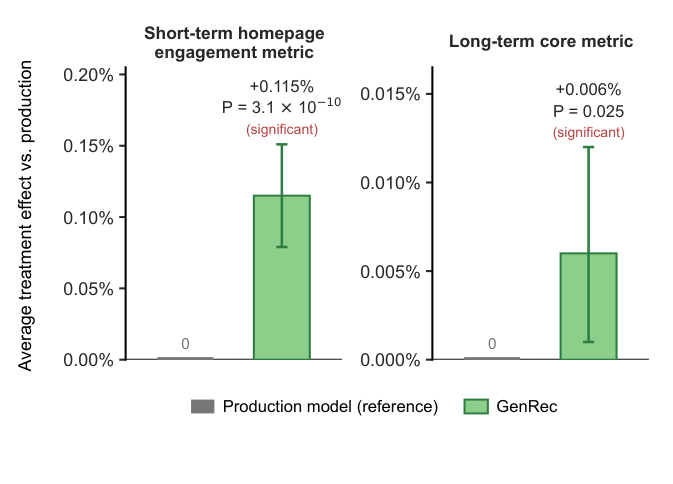
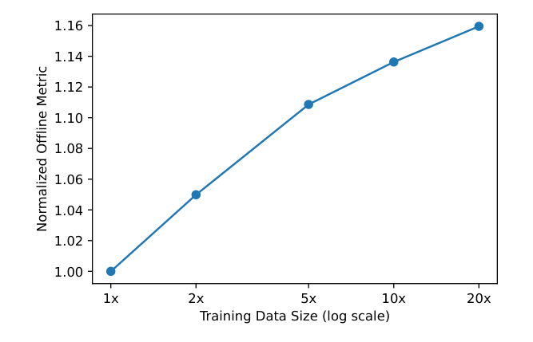
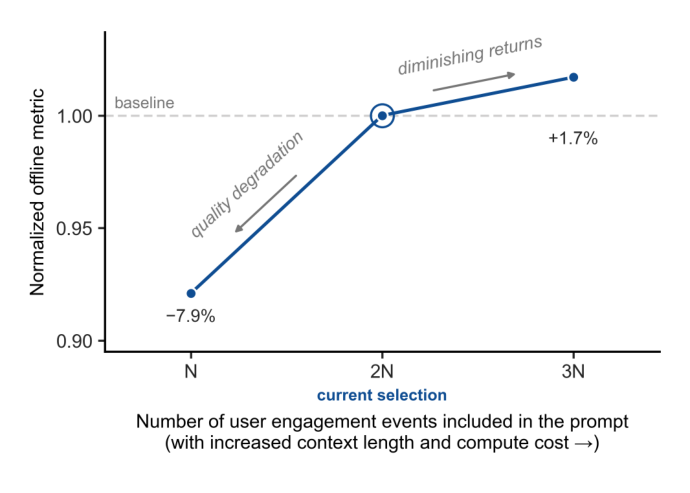

# Netflix 用 LLM 直接给整个片库排序了：GenRec 只用 1/40 的数据，就跑赢了打磨多年的生产排序器

> 转载/引用请注明来源。本文基于论文《GenRec: An LLM-Backed Recommendation Ranker at Netflix》整理解读，论文链接：[arXiv](https://arxiv.org/abs/2604.13481)。

最近 Netflix 把所有推荐系统的羊毛都薅到了 LLM 上：不是拿 BERT 当双塔的 encoder，也不是用大模型做"精排前的知识增强"，而是**把用户历史、片库元数据、上下文一股脑文本化成自然语言提示，喂给一个自研的基础 LLM，让它在一次前向传播里给整个 Netflix 片库打分排序**——这就是 **GenRec**。

这篇文章值得读的最大理由就一句话：**它用生产系统约 1/40 的标注训练数据和输入信号，在离线指标和线上 A/B 上都赢了那个打磨了多年的生产排序器**。如果你在工业界做推荐、或者正在纠结"LLM 到底能不能真正接管排序"，这篇是实打实的航标。

---

## TL;DR 先上结论

- **范式变了**：推荐的核心工作从「特征工程」变成了「上下文工程」——你怎么把日志组织成提示，比你怎么构造一个特征更重要
- **两阶段训练**：Phase 1 用 Netflix 数据把开源 LLM 调成"Netflix 懂王"基础模型（低频更新）；Phase 2 用排序专用数据、标签和奖励信号高频后训练
- **架构很朴素**：仅解码器 LLM 骨干 + 一个"目录感知打分头"，加上采样 softmax 解决超大目录打分
- **成本是逼出来的**：服务用 vLLM + **仅预填充（prefill-only）** 推理，一次前向排完整个目录，不做逐 token 解码
- **结果为证**：线上 A/B（约 10% 流量、4 周）短期参与 **+0.115%**（P = 3.1×10⁻¹⁰）、长期核心指标 **+0.006%**（P = 0.025），双双统计显著；离线 MRR **+1.6%**

---

## 为什么 Netflix 要换引擎？因为旧引擎"加不动需求"了

先说个背景。Netflix 现在的生产推荐栈，是典型的"传统工业级 RecSys"：

- 几千个**手工特征**（用户、item、交互三路信号 + 大量的高阶特征交互）
- **定制架构**一堆：建模特征交互的专用网络、捕获动态兴趣的 transformer 结构、支撑多个推荐任务的多任务学习（MMoE 那种）
- 这套东西迭代了多年，支撑了电影、剧集、游戏、直播、播客等一堆内容形态

听起来很成熟对吧？但作者点出核心矛盾：**这套架构越来越扛不住新业务了**。想接入一个新的内容类型或者新的推荐展示位？要做特征工程、架构设计、基础设施改造、实验验证……一套下来成本极高，系统复杂性已经让迭代速度赶不上 Netflix 业务增长的速度。

而另一边，LLM 展现出传统架构没有的能力：广博的世界知识、对用户和内容的语义理解、通过自然语言提示就能"指挥"推荐方向。这直接把推荐问题的姿势变了——**不用再为每个新用例重新设计模型和流水线**。

但开箱即用的通用 LLM 也不能直接用，它有三宗罪：过度推荐全球热门内容、幻想出片库里根本不存在的标题、对业务约束（内容混合、曝光公平）毫不在意，个性化还不行。GenRec 就是冲着解决这些来的。

---

## GenRec 是怎么做的？

### 1. 两阶段训练：快速出活的关键

GENRec 没有从零训一个推荐模型，而是走"打底 + 微调适配"的两阶段路线：

- **Phase 1**：用 Netflix 专有数据，把开源（OSS）模型调成 Netflix 的基础模型。目标是建立对片库和会员行为的深度理解，同时平衡世界知识、个性化、内容理解等一堆基础能力。**更新低频**，面向长期。
- **Phase 2**：用推荐排序特定的数据、标签和奖励信号，对基础模型做**高频后训练**。目标非常聚焦：排序质量和推荐引导。因为要跟踪新内容上线、流行度变化、会员兴趣演变，所以更新得频繁。

这个分工非常利于工程落地：真正烧算力、烧数据的 Phase 1 低频跑，而高频刷新的 Phase 2 追求"用小数据办好大事"——**Phase-2 的边际数据效率，直接决定你每天刷新排序器要烧多少算力**。

### 2. 把日志"说"给 LLM 听：上下文工程是新的特征工程

传统推荐器把用户交互和 item 元数据编码成手工特征或稠密嵌入；GenRec 反过来，**把几千亿条交互日志直接文本化成自然语言**，在固定 token 预算内喂给 LLM。作者说得很妙：这从"特征工程"彻底转向了"**上下文工程**"——决定给模型看什么、怎么在 token 预算内表达、优化什么损失什么奖励，而不是手工设计特征交叉。

但用户上下文太长了，会员动辄几千次交互，全塞进上下文又贵又稀释注意力。所以 GenRec 对事件有一套"策展"策略：

- **完整保留**：高信号事件（长时播放、点赞），用更丰富的元数据展开
- **整体省略**：近期低信号事件（超短播放、有噪声的浏览/点击），贡献小、token 贵，直接砍
- **压缩去重**：连续追剧这种重复行为，压缩成一段话而不是逐条列出
- **选择性扩写**：新上线内容、冷启动 item 这种信息稀缺的，反而给它更多详细元数据

结果：提示从约 **5,000 token 压到约 1,700 token**（约 1/3），离线质量几乎无损，服务成本同步降到约 1/3。**这是全文我最想划重点的一节**——在"上下文越长不一定越好"上给出了工业级实证。

### 3. 目录感知打分：一次前向排完整个片库

这也是 GenRec 和"LLM 生成式检索"路线（束搜索逐 token 解码那种）最大的分岔点：

- 先是一个 verbalizer，把历史、上下文、item 元数据映射成单一文本序列
- LLM 把它编码成一个池化表示（取某个位置的隐藏状态）
- 一个目录感知打分头把表示和每个 item 的学习嵌入组合，给全目录打分
- 目录太大就上**采样 softmax** 支撑超大候选集

整个流程**只有一次前向传播**，不逐 token 解码。这让它在服务成本上碾过了那些靠自回归解码做生成式检索的同行（Google PLUM、Spotify GLIDE 那一路）——毕竟大型候选集上逐 token 解码的延迟和成本是天文数字。

### 4. 奖励加权：不只看"点了没点"

光在原始交互上后训练，模型会跑偏——比如只会推荐追剧不推荐探索、偏好视频忽略游戏、为了即时点击牺牲长期留存。所以 GenRec 引入**奖励加权排序损失**：多个独立奖励模型的输出推导出每个样本的权重，高价值参与加大权重，低价值/不当行为降权。奖励分两大类：

- **长期满意度代理**：估计参与事件和长期结果（回归、探索、持续参与）的相关强度，用比真实长线指标更稳定的历史代理
- **跨内容/参与类型的再平衡**：电影 vs 游戏 vs 直播 vs 播客、上线前/新上线/常青内容之间的曝光公平

为什么不直接上 GRPO 这类 RL？作者很务实：**RL 在 SFT 之上确实还有增量，但训练开销太大，作为对齐机制，奖励加权损失在简单性、稳定性、成本上更优**。这点很值得工业界同人参考——不是最先进的对齐就一定最划算。

### 5. 服务成本：算力面前人人平等

Netflix 几亿会员的全球规模，推理成本是一等约束，且大致正比于「模型规模 × 上下文长度」。两条腿走路：

- 训练更小的、经过蒸馏的语言模型，用更低的单请求算力找回大模型的大部分质量
- **激进压缩上下文**（就是上面那套上下文工程），在此基础上把 GenRec 部署成 **prefill-only 配置**：只消费一次输入上下文，单次前向给完整候选集出分，彻底绕开自动回归解码

---

## 数字会说话：1/40 的数据，凭什么赢？

- **数据效率**：GenRec 的 Phase-2 标注训练样本，比生产模型**少约 40 倍**；输入信号也少得多。离线 MRR 仍相对基线**+1.6%**
- **线上验证**：约 10% 流量、跑 4 周。短期参与指标 **+0.115%**（P = 3.1×10⁻¹⁰）、长期核心指标 **+0.006%**（P = 0.025），都统计显著
- **消融归因**：Phase 1 贡献离线指标 **+10–20%**；Phase 2 贡献 **+35–50%**，而且模型越旧增益越大——**两周后这个值升到约 +80%**（因为 Phase 1 低频更新，越来越"老"，任务特定适配的价值被放大）
- **扩展性**：Phase-2 数据从 1x 扩到 20x，离线 MRR 单调上升；模型从 ~1B 放大到 ~10B，固定训练预算下更大的一直更赢。这俩缩放曲线，直接让推荐跟上了"以大模型的行事方式做事"的节奏

---

## 范式转移：这四件事被永久改变了

作者在第 6 节自己总结了，我帮你翻译成人话：

1. **特征工程 → 上下文工程**：提示（prompt）变成了新的特征向量。建模工作的重心从"设计单个特征"变成"决定包含哪些信号、怎么总结、回溯多深、怎么在预算内编码"
2. **定制架构 → 共享基础骨干**：不再双塔、DLRM、自定义注意力块各来一套，统一收敛到从基础模型继承的 transformer 骨干上。创新上移了一个层级：数据、缩放定律、后训练策略、推理优化
3. **缩放定律成了设计指南**：推荐模型继承 LLM 的扩展行为，性能随数据/模型单调上升——这是经典 RecSys（稀疏 ID、重度工程化目标）给不了的东西
4. **RecSys 基础设施 → LLM 基础设施**：KV 缓存、前缀缓存、prefill-only、GPU 批处理，这些成了在线推荐服务的主战场

---

## 我的几点观察（仅供参考）

- **"Lift and shift" 别急着信**。GenRec 的赢面建立在 Netflix 的特定前提上：海量自带语义的元数据（标题、简介）、天然适合文本化的内容形态、以及一个自研基础 LLM 撑着 Phase 1。电商（稀疏商品、图片主导、标题凑数）和短视频（纯消费流、无强语义）直接复刻，上下文工程的地基可能不一样。
- **Phase 1 是隐形的护城河**。1/40 数据的奇迹，本质是预训练的"先验"在兜底。没有自家基础模型的小厂，想蹭这条路，先想清楚 Phase 1 从哪来。
- **成本的真相在"甜点区"**。作者明确识别了质量-成本的 Pareto 前沿，还建议结合数据扩展、模型扩展和上下文消融来找甜点。换句话说：**无脑堆上下文、无脑放大模型，都是给钱包放血**；先做上下文工程，收益来得最便宜。
- **时代真的在变**。特征工程那套手艺正在贬值，上下文工程、后训练、奖励对齐、推理优化正在上位。对做推荐的人，这既是威胁也是机会——你的技能树该往 LLM 侧长一长了。

---

## 写在最后

GenRec 最有价值的信号，不是某个具体指标，而是**"LLM 原生推荐是走通的路，只要管好成本、算清账"**。它用完整的两阶段训练、上下文工程、目录感知打分和 prefill-only 服务，把"大模型做排序"从论文概念降级成了可复制的工程范式。

当然，它也有保留了神秘感的部分：1/40 数据打底的具体预处理、奖励模型的细节、蒸馏小模型的实际部署尺寸，都没公开。想看底层原理的去扒[论文原文](https://arxiv.org/abs/2604.13481)。

你怎么看 LLM 原生排序？是"天花板近在眼前"还是"新玩法刚开场"？评论区聊聊。

---

*文中图 3（在线指标）、图 4（数据扩展曲线）、图 5（上下文长度消融）是这篇论文最值得贴的三张图，已用 Markdown 相对路径嵌入文内（`.picture/` 目录下），发知乎时把 `` 换成对应图片即可直接上传。*