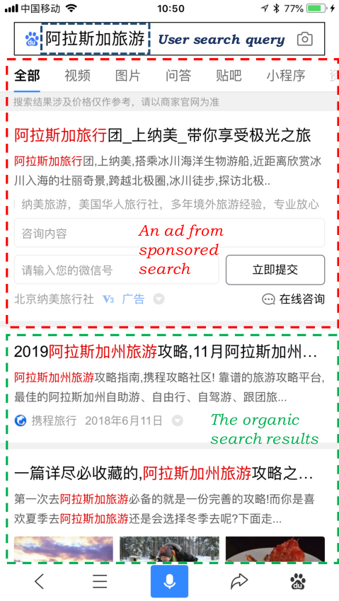
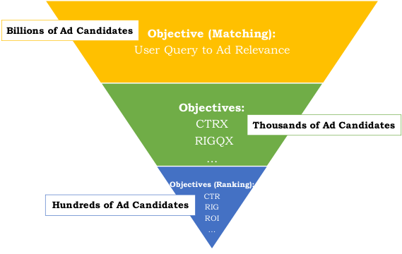
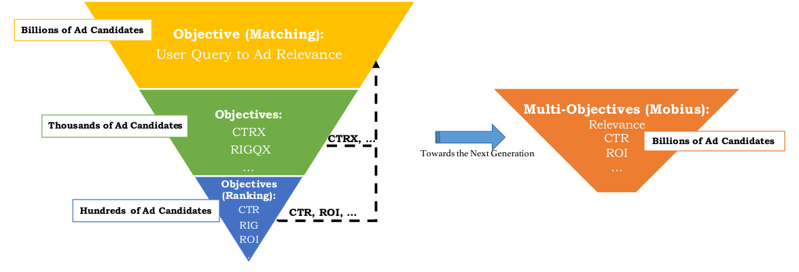
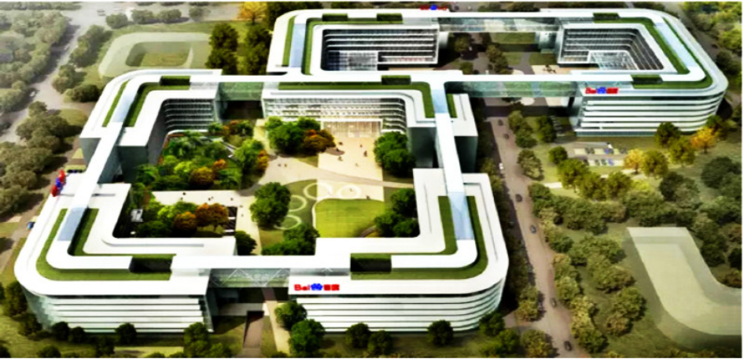
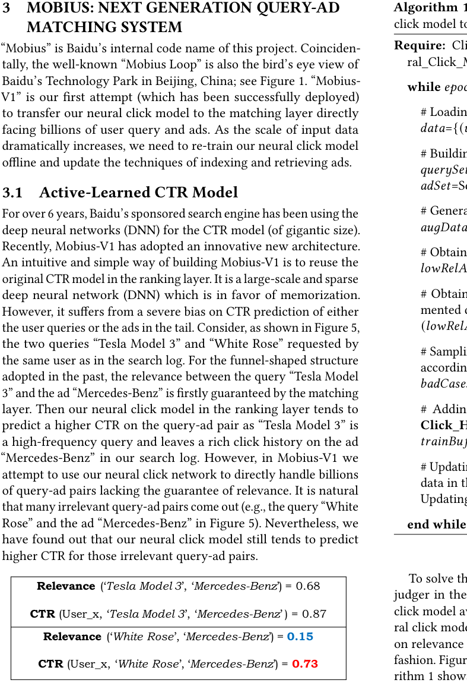
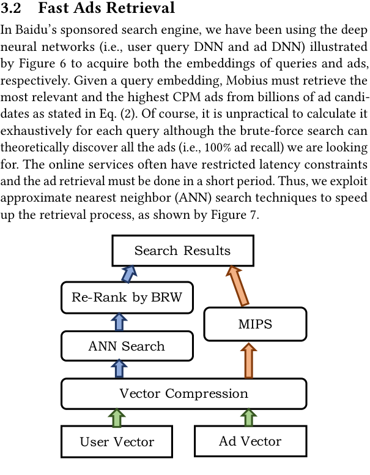

# MOBIUS：百度赞助搜索中下一代查询-广告匹配技术

> 作者 | Miao Fan, Jiacheng Guo, Shuai Zhu, Shuo Miao, Mingming Sun, Ping Li
> 单位 | $^1$百度研究院认知计算实验室（CCL）；$^2$百度搜索广告（凤巢）

**核心内容**

- 针对百度商业搜索引擎中查询-广告匹配层与排序层目标分离导致商业收益下降的问题，提出了 Mobius 项目，旨在统一查询-广告相关性与 CPM（每千次展示费用）等商业指标。
- 设计了基于主动学习的"教师-学生"框架，通过离线数据增强解决尾部查询和广告的点击历史不足问题，使神经点击模型能够识别"低相关性但高 CTR"的坏案例。
- 采用近似最近邻（ANN）搜索和最大内积搜索（MIPS）技术（OPQ 算法），实现从数十亿广告候选集中高效检索，将广告覆盖率提升 33.2%。
- Mobius-V1 已成功部署于百度搜索，CPM 在百度 App 上提升 3.8%，百度搜索上提升3.5%。

**关键发现**

- 原始 CTR 模型由于在高频广告和查询上训练，对高频查询或广告倾向于预测更高的 CTR，即使它们之间相关性很低。
- 基于主动学习的3分类（点击、未点击、坏案例）模型相比2分类模型，相关性得分从 0.312 提升至 0.575，且 AUC 保持可比性。
- OPQ 压缩编码相比随机分区树方法（ANN+Re-Rank），广告覆盖率从 7.3% 提升至 40.5%，平均响应时间从 120ms 降至30ms。

## 关键词

Sponsored search; query-ad matching; active learning; click-through rate (CTR) prediction; approximate nearest neighbor (ANN) search; Baidu; Phoenix Nest

---

## 1 引言

百度搜索（www.baidu.com）作为中国最大的商业搜索引擎，每天为数以亿计的在线用户提供搜索服务。众所周知，广告是全球各大商业搜索引擎公司最主要的收入来源。本文聚焦于百度搜索广告系统（在百度内部通常称为"凤巢"）中近期的一些重要进展和发明。如图2所示，百度搜索广告系统在检索与用户查询相关的广告（ad）方面发挥着至关重要的作用，因为广告主愿意为广告被点击付费。

百度赞助搜索系统的目标是在在线用户、广告主和赞助搜索平台之间形成并维护一个良性循环。

传统的赞助搜索引擎 [10, 11, 22] 通常通过两步流程展示广告：第一步是根据查询检索相关广告，第二步是根据预测的用户参与度对这些广告进行排序。作为百度面向商业用途的高效赞助搜索引擎，我们过去采用三层漏斗式结构，从数十亿广告候选集中筛选和排序数百个广告，以满足低响应延迟和计算资源限制的要求。如图3所示，顶层匹配层负责根据用户查询和丰富的用户画像为下一层提供语义相关的广告候选。为了覆盖更多语义相关的广告，查询扩展 [1, 3, 4] 和自然语言处理（NLP）技术 [2] 主要被采用。底层排序层更关注上层筛选后广告的商业指标 [16]，如每千次展示费用（CPM = CTR $ \times $ 出价）、投资回报率（ROI）等。

然而，匹配和排序目标之间的分离导致商业收益下降。给定用户查询，我们必须使用复杂的模型并花费大量计算资源对数百甚至数千个广告候选进行排序。也许最令人失望的是，排序模型显示许多由匹配层提供的相关广告由于 CPM 不高而不会被展示。为解决此问题，百度搜索广告设立了"Mobius"项目，旨在实现百度赞助搜索中的下一代查询-广告匹配系统。该项目期望将包括查询-广告相关性和许多其他商业指标在内的多种学习目标统一，同时满足低响应延迟、计算资源限制和对用户体验的微小负面影响。

在本文中，我们介绍了 Mobius-V1，这是我们的首次尝试，使匹配层除了查询-广告相关性之外，还将 CPM 作为额外的优化目标。换言之，Mobius-V1 具备准确且快速地为数十亿用户查询与广告对预测点击率（CTR）的能力。为实现此目标，我们必须解决以下主要问题：

• 点击历史不足：排序层使用的原始神经点击模型由高频广告和查询训练。它倾向于在高频广告或高频查询出现时，预测更高的 CTR，即使它们之间相关性很低。

• 计算/存储成本高：Mobius 预计需要预测数十亿用户查询与广告对的多种指标（包括相关性、CTR、ROI 等），自然面临计算资源消耗更大的挑战。

为解决上述问题，我们首先设计了受主动学习 [34, 41] 启发的"教师-学生"框架，用于增强大规模神经点击模型的训练数据。具体而言，一个离线数据生成器负责根据数十亿用户查询和广告候选构建合成查询-广告对。这些查询-广告对不断被一个教师代理判断，该代理源自原始匹配层，擅长衡量查询-广告对的语义相关性。它有助于检测合成查询-广告对中的坏案例（即高 CTR 但低相关性）。我们的神经点击模型作为学生，通过这些额外的坏案例进行学习，以提升在尾部查询和广告上的泛化能力。为节省计算资源并满足低响应延迟要求，我们进一步采用了最新的近似最近邻（ANN）搜索和最大内积搜索（MIPS）技术来更高效地索引和检索大量广告。

为应对上述挑战，Mobius-V1 作为下一代查询-广告匹配系统的第一个版本，整合了上述解决方案，已成功部署于百度赞助搜索引擎中。

## 2 百度赞助搜索的愿景

长期以来，漏斗式结构是赞助搜索引擎 [10, 11, 22] 的经典架构。其主要组件包括查询-广告匹配和广告排序。查询-广告匹配通常是一个轻量级模块，衡量用户查询与数十亿广告之间的语义相关性。相比之下，广告排序模块应更关注 CPM、ROI 等商业指标，并使用复杂的神经网络对数百个广告候选进行排序展示。这种解耦结构在早期是节省昂贵计算资源的明智选择。此外，它还便于科学研究和软件工程，因为两个模块可以分配给不同的研发团队以最大化各自的目标。

百度的赞助搜索过去采用三层漏斗式结构，如图3所示。顶层匹配层（记为 $ O_{Matching} $）的优化目标是最大化所有查询-广告对的平均相关性得分：

$$O_{Matching} = \max \frac{1}{n} \sum_{i=1}^{n} Relevance(query_i, ad_i). \tag{1}$$

然而，根据我们对百度赞助搜索引擎性能的长期分析，我们发现匹配和排序目标之间的分离往往导致较低的 CPM，这是商业搜索引擎的关键商业指标之一。当排序模型显示匹配层提供的许多相关广告由于估计的 CPM 不高而不会在搜索结果中展示时，这令人不满意。

随着计算资源的快速增长，百度搜索广告团队（"凤巢"）最近成立了 Mobius 项目，旨在实现百度赞助搜索中的下一代查询-广告匹配系统。该项目的蓝图如图4所示，期望将包括查询-广告相关性和许多其他商业指标在内的多种学习目标统一到百度赞助搜索中的单一模块中，同时满足低响应延迟、有限计算资源和对用户体验的微小负面影响。

本文将报告 Mobius 的第一个版本，即 Mobius-V1，这是我们的首次尝试，使匹配层除了查询-广告相关性之外，还考虑 CPM 作为额外的优化目标。我们如下形式化 Mobius-V1 的目标：

$$O_{Mobius-V1} = \max \sum_{i=1}^{n} CTR(user_i, query_i, ad_i) \times Bid_i,$$
$$s.t. \quad \frac{1}{n} \sum_{i=1}^{n} Relevance(query_i, ad_i) \ge threshold. \tag{2}$$

因此，如何准确预测数十亿用户查询与广告候选对的 CTR 成为 Mobius-V1 中的挑战。在本文的其余部分，我们将详细描述如何设计、实现和部署 Mobius-V1。

## 3 MOBIUS：下一代查询-广告匹配系统

"Mobius"是百度该项目的内部代号。巧合的是，著名的"Mobius 环"也是百度科技园在中国北京的鸟瞰图（见图1）。"Mobius-V1"是我们的首次尝试（已成功部署），将我们的神经点击模型直接转移到面对数十亿用户查询和广告的匹配层。随着输入数据规模的急剧增加，我们需要重新训练我们的神经点击模型，并更新广告的索引和检索技术。

### 3.1 基于主动学习的 CTR 模型

6 年多来，百度的赞助搜索引擎一直使用深度神经网络（DNN）进行 CTR 模型（规模庞大）的训练。最近，Mobius-V1 采用了创新的新架构。构建 Mobius-V1 一个直观且简单的方法是复用排序层的原始 CTR 模型。它是一个大规模稀疏的深度神经网络（DNN），擅长记忆。然而，它在用户查询或广告的尾部 CTR 预测上存在严重偏差。考虑图5中的两个查询："Tesla Model 3"和"White Rose"，由搜索日志中的同一用户请求。对于过去采用的漏斗式结构，查询"Tesla Model 3"与广告"Mercedes-Benz"之间的相关性首先由匹配层保证。然后排序层中的神经点击模型倾向于为这对查询-广告预测更高的 CTR，因为"Tesla Model 3"是高频查询，并在搜索日志中留下了丰富的"Mercedes-Benz"点击历史。然而，在 Mobius-V1 中，我们试图使用神经点击网络直接处理缺乏相关性保证的数十亿查询-广告对。自然会出现许多不相关的查询-广告对（例如图5中的查询"White Rose"与广告"Mercedes-Benz"）。尽管如此，我们发现神经点击模型仍然倾向于为这些不相关的查询-广告对预测更高的 CTR。

根据我们对百度赞助搜索查询日志的分析，广告和用户查询都存在长尾效应和冷启动问题。因此，我们不能直接利用原始神经点击模型准确预测数十亿尾部用户查询和广告的 CTR。问题的关键在于如何教导我们的模型学习识别"低相关性但高 CTR"的查询-广告对作为坏案例。

为解决此问题，我们提出使用匹配层中的原始相关性判断模型作为教师，使神经点击模型感知"低相关性"查询-广告对。我们的神经点击模型作为学生，通过增强的坏案例以主动学习的方式获取关于相关性的额外知识。图6通过流程图说明了这种方式，算法1以伪代码形式展示了用主动学习教导神经点击模型的训练过程。一般而言，主动学习的迭代过程有两个阶段：数据增强和 CTR 模型学习。具体而言，我们将逐步详细阐述每个阶段的模块。

数据增强阶段从将一批点击历史（即用户查询和广告对）从查询日志加载到数据增强器开始。每次数据增强器接收到查询-广告对时，将其拆分为两个集合：查询集和广告集。然后我们对两个集合应用交叉连接操作（$ \otimes $）以构建更多用户查询和广告对。假设一批点击历史中有 $ m $ 个查询和 $ n $ 个广告，则数据增强器可以帮助生成 $ m \times n $ 个合成查询-广告对。在列出所有可能的查询-广告对后，相关性判断模型介入并负责对这些对的相关性进行评分。由于我们希望发现低相关性查询-广告对，我们设置一个阈值以保留这些对作为候选教学材料。这些低相关性查询-广告对作为教学材料首次被输入到我们的神经点击模型中，每对被分配前一次迭代中更新模型预测的 CTR。为了教导我们的3分类（即点击、未点击和坏案例）神经点击模型学习识别"低相关性但高 CTR"查询-广告对，我们可能会直观地设置另一个阈值来过滤大多数低 CTR 查询-广告对。然而，我们认为更好的选择是平衡增强数据的探索和利用。我们使用一个数据采样器，根据预测的 CTR 对合成查询-广告对进行选择和标注。一旦查询-广告对被采样为神经点击网络的坏案例，该对被标注为额外的类别，即"坏"。

在 CTR 模型学习阶段，点击/未点击历史和标注的坏案例都被添加到增强缓冲区中作为训练数据。我们的神经点击网络是一个大规模多层稀疏 DNN，由两个子网组成，即用户查询 DNN 和广告 DNN。如图6所示，左侧的用户查询 DNN 以丰富的用户画像和查询作为输入，右侧的广告 DNN 将广告嵌入作为特征。两个子网各产生一个96维的分布式表示，每个表示被分割为三个向量（$ 32 \times 3 $）。我们对用户查询 DNN 和广告 DNN 之间的三对向量进行3次内积操作，并采用 softmax 层进行 CTR 预测。

总体而言，我们提出了一种学习范式，用于在百度赞助搜索引擎中离线训练神经点击模型。为了提高其在尾部数十亿查询-广告对上 CTR 预测的泛化能力，神经点击模型（学生）可以主动向相关性模型（教师）请求标签。这种迭代监督学习被称为主动学习 [34, 41]。

**算法1** 用于训练神经点击模型预测数十亿查询-广告对 CTR 的主动学习过程。

$$\begin{aligned}
&\textbf{Require:} \ Click\_History, Relevance\_Judger \ (Teacher), Neural\_Click\_Model \ (Student) \\
&\textbf{while} \ epoch \le N \ \textbf{or} \ err \ge \epsilon \ \textbf{do} \\
&\quad \# \text{Loading a batch of Click\_History} \\
&\quad data = \{(user_i, query_i, ad_i, (un)click_i), i = 1, 2, ..., n\} \\
&\quad \# \text{Building the query set and the ad set} \\
&\quad querySet = Set(List(query_i)) \\
&\quad adSet = Set(List(ad_i)) \\
&\quad \# \text{Generating the augmented data} \\
&\quad augData = querySet \otimes adSet \\
&\quad \# \text{Obtaining the low-relevance augmented data} \\
&\quad lowRelAugData = Relevance\_Judger(augData) \\
&\quad \# \text{Obtaining the predicted CTRs for the low-relevance augmented data} \\
&\quad (lowRelAugData, pCtrs) = Neural\_Click\_Model(lowRelAugData) \\
&\quad \# \text{Sampling the bad cases from low-relevance augmented data according to predicted CTRs} \\
&\quad badCases = Sampling(lowRelAugData) \ s.t. \ pCTRs \\
&\quad \# \text{Adding the bad cases into the training buffer with the Click\_History} \\
&\quad trainBuffer = [data, badCases] \\
&\quad \# \text{Updating the weights inside Neural\_Click\_Model with the data in the training buffer} \\
&\quad Updating(Neural\_Click\_Model) \ s.t. \ trainBuffer \\
&\textbf{end while}
\end{aligned}$$

### 3.2 广告快速检索

在百度赞助搜索引擎中，我们一直使用图6所示的深度神经网络（即用户查询 DNN 和广告 DNN）分别获取查询和广告的嵌入。给定查询嵌入，Mobius 必须从数十亿广告候选中检索相关性最高且 CPM 最高的广告，如公式 (2) 所述。当然，尽管暴力搜索可以理论上发现所有我们需要的广告（即100%广告召回），但为每个查询进行穷举计算是不切实际的。在线服务通常具有严格的延迟限制，广告检索必须在短时间内完成。因此，我们采用近似最近邻（ANN）搜索技术来加速检索过程，如图7所示。

#### 3.2.1 ANN 搜索

如图6所示，映射函数通过余弦相似度组合用户向量和广告向量，然后余弦值通过 softmax 层产生最终的 CTR。这样，余弦值和 CTR 是单调相关的。模型训练后，它们是正相关还是负相关将变得清晰。如果是负相关，我们可以通过否定广告向量轻松将其转换为正相关。这样，我们将 CTR 排序问题简化为余弦排序问题，这是典型的 ANN 搜索设置。

近似最近邻（ANN）搜索的目标是，对于给定的查询对象，仅扫描语料库中一小部分对象，就从大型语料库中检索"最相似"的对象集。这是一个基本问题，自计算机科学早期以来就一直被积极研究 [12, 13]。通常，流行的 ANN 算法基于空间分区的思想，包括基于树的方法 [12, 13]、随机哈希方法 [5, 7, 15, 20, 27, 37]、基于量化的方法 [14, 23, 42]、随机分区树方法 [8, 9] 等。对于这个特定问题（处理稠密且相对较短的向量），我们发现随机分区树方法相当有效。随机分区树方法有一个已知的实现称为"ANNOY"，以及其他变体 [8, 9]。

#### 3.2.2 最大内积搜索（MIPS）

在上述解决方案中，业务相关的权重信息在用户向量和广告向量匹配之后才被考虑。实践中，这个权重在广告排序中至关重要。为了在排序中更早地考虑权重信息，我们将快速排序过程形式化为加权余弦问题：

$$\cos(x, y) \times w = \frac{x^\top y \times w}{\|x\| \|y\|} = \frac{x^\top y \times w}{\|x\| \cdot \|y\|}, \tag{3}$$

其中 $ w $ 是业务相关权重，$ x $ 是用户查询嵌入，$ y $ 是广告向量。注意，加权余弦构成一个内积搜索问题，通常称为最大内积搜索（MIPS）[36]。在这一研究方向上，多种框架可用于快速内积搜索 [36, 38, 43, 44]。

#### 3.2.3 向量压缩

为数十亿广告中的每一个存储高维浮点特征向量需要大量磁盘空间，并且如果这些特征需要在内存中进行快速排序，则会带来更大的问题。一个通用的解决方案是将浮点特征向量压缩为随机二进制（或整数）哈希码 [7, 28, 30] 或量化码 [23]。压缩过程可能会在一定程度上降低检索召回率，但可以带来显著的存储收益。对于当前实现，我们采用了基于量化的方法，如 K-Means，对索引向量进行聚类，而不是对索引中的所有广告向量进行排序。当查询到来时，我们首先找到查询向量被分配到的聚类，然后从索引中获取属于同一聚类的广告。乘积量化（PQ）[23] 的思想更进一步，将向量分割为若干子向量，并对每个分割分别进行聚类。在我们的 CTR 模型中，如第3.1节所述，我们将查询嵌入和广告嵌入各分割为三个子向量。然后每个向量可以被分配到聚类质心的三元组。例如，如果我们为每组子向量选择 $ 10^3 $ 个质心，则可以利用 $ 10^9 $ 个可能的聚类质心，这对于数十亿规模的多索引 [26] 广告来说已经足够。在 Mobius-V1 中，我们采用了一种称为优化乘积量化（OPQ）[14] 的变体算法。

## 4 实验

在将 Mobius-V1 集成到百度赞助搜索引擎之前，我们进行了全面的实验。具体而言，我们首先需要对 CTR 预测模型和广告索引的新方法进行离线评估。我们需要确保更新检索广告方法的 CTR 模型能够发现更多具有更高 CPM 的相关广告。然后我们尝试将其在线部署，处理百度搜索中一定比例的查询流量。在 Mobius-V1 通过离线评估和在线 A/B 测试后，我们在多个平台上发布它，以监控 CPM、CTR 和 ACP（平均点击价格）的统计数据。

### 4.1 离线评估

我们加载搜索日志以收集点击/未点击历史，并构建包含 800 亿样本的训练集。我们还使用搜索日志构建测试集，包含 100 亿条广告点击/未点击历史记录。我们将基于主动学习的 CTR 模型的有效性与两种基线方法进行比较。一种方法是原始排序层采用的2分类 CTR 模型，仅使用点击历史训练，不使用任何增强数据。另一种方法是3分类 CTR 模型，使用随机增强数据训练，未经过相关性模型（教师）的判断。如表1所示，我们的模型可以保持与原始排序模型相当的 AUC，但由相关性模型衡量的相关性得分显著提高（从 0.312 到 0.575）。换言之，低相关性但高 CPM 的查询-广告对被我们的新 CTR 模型成功识别为坏案例。

此外，我们将每种方法预测的 CTR 最高的前100,000个查询-广告对交付给百度众包团队，由人类专家手动对查询-广告相关性进行0到4的评分（0：无相关性，4：非常相关）。主观意见报告也表明 Mobius-V1 中的 CTR 模型在发现相关查询-广告对方面表现良好。此外，我们使用同一组数据从两个由随机分区树（ANN+Re-Rank）和 OPQ（Compressed Code+MIPS）驱动的广告索引系统中检索广告。表2显示 OPQ 将广告覆盖率提高了 33.2%。

**表1** 不同数据生成策略训练的神经点击模型离线评估比较结果。AUC 表示接收者操作特征曲线下的面积。REL 是测试集中查询-广告对的相关性平均得分，可由原始匹配模型自动评估或由人类专家评分。

| Neural Click Model for CTR Prediction | AUC | REL（相关性模型）| REL（人类专家）|
|---|---|---|---|
| 2-Class（点击和未点击数据）| 0.823 | 0.312 | 1.500 |
| 3-Class（点击和未点击数据 + 随机标注坏案例）| 0.795 | 0.467 | 1.750 |
| 3-Class（点击和未点击数据 + 主动学习的坏案例）| 0.811 | 0.575 | 3.000 |

**表2** 不同广告检索策略的比较结果。广告覆盖率实验离线进行。平均响应时间和内存使用在线测试。

| Ad Retrieval | Ad Coverage Rate | Avg. Response Time | Avg. Response Time | Memory Usage |
|---|---|---|---|---|
| Brute Force | 100% | - | - | - |
| Original Vector+ANN+Re-Rank | 7.3% | 120ms | 74ms | 100% |
| Compressed Code+MIPS | 40.5% | 30ms | 16ms | 5% |

### 4.2 在线 A/B 测试

在线 A/B 测试在 Mobius-V1 采用的两种不同广告检索策略之间进行，从平均响应时间和内存使用的角度进行评估。表2显示 OPQ 可以提供比随机分区树方法低得多的延迟，并将平均响应时间减少 48ms/查询。此外，我们检查了 CPM 最高的前3%广告的平均响应时间，这些广告具有更大的商业价值但需要更多计算资源。结果显示 OPQ 将查询延迟降低了75%（从120ms降至30ms），并大幅节省了内存消耗。

### 4.3 系统上线

在 Mobius-V1 成功通过离线评估和在线 A/B 测试后，我们决定在百度内外多个平台上发布它。这些平台包括手机上的百度 App、PC 上的百度搜索以及我们的赞助搜索引擎服务的许多其他附属网站/App。表3显示了我们在7天内对整个在线流量监控的 CPM、CTR 和 ACP 统计数据。CPM 是评估赞助搜索引擎性能的主要指标。与之前的系统相比，Mobius-V1 在百度 App 上使 CPM 提升了3.8%，在百度搜索上提升了3.5%。

**表3** Mobius-V1 与之前部署在不同网站/App 上的系统相比，CPM、CTR 和 ACP 的改进情况。结果基于我们对整个在线流量的7天监控。

| Launched Platform | CPM | CTR | ACP |
|---|---|---|---|
| Baidu App on Mobiles | +3.8% | +0.7% | +2.9% |
| Baidu Search on PCs | +3.5% | +1.0% | +2.2% |
| Affiliated Websites/Apps | +0.8% | +0.5% | +0.2% |

## 5 相关工作

我们在 Mobius 上的工作涉及查询-广告匹配和点击率（CTR）预测的研究，旨在实现面向商业用途的百度赞助搜索引擎中的下一代查询-广告匹配系统。

### 5.1 查询-广告匹配

查询-广告匹配 [32] 是一个被广泛研究的任务，旨在检索与给定查询不仅相同而且语义相似的广告（例如图2中显示的查询"美国旅游签证"和关于"旅行社"的广告）。由于查询通常是短文本，这个问题主要通过查询扩展 [4, 40]、查询重写 [18, 45] 和语义匹配 [3, 17] 技术来解决。除了利用不同的 NLP 工具直接计算查询和文本广告之间的相似性外，查询和广告之间的语义关系也可以通过从广告展示中学习来捕获。DSSM [35] 是一个著名的学习匹配范式，利用深度神经架构捕获查询意图，并利用点击信息提高语义匹配的质量。

### 5.2 CTR 预测

CTR 预测 [31, 39] 是赞助搜索中的另一个核心任务，因为它直接影响 CPM 等商业指标。它侧重于预测广告在作为提交查询的响应展示时被点击的概率。传统的 CTR 预测方法偏好从历史点击数据中通过贝叶斯 [33] 或特征选择方法 [19, 21] 手工制作的广告展示特征。随着深度学习 [25] 的兴起，许多 CTR 预测方法 [6, 46, 48] 利用各种深度神经网络，主要通过从原始查询和文本广告中自动学习特征，来缓解手工制作特征的创建和维护问题。自2013年以来，百度搜索广告（"凤巢"）已成功使用超高维和超大规模深度神经网络训练 CTR 模型。

## 6 结论

在本文中，我们向您介绍了 Mobius 项目，这是百度赞助搜索引擎中的下一代查询-广告匹配系统，通过回答以下四个问题：

• 问题：动机——我们为什么提出 Mobius 项目？

  答案：我们过去采用三层漏斗式结构从数十亿广告候选中筛选和排序数百个广告进行展示。然而，匹配和排序目标之间的分离导致商业收益下降。为解决此问题，我们设立了 Mobius-V1，这是我们的首次尝试，使匹配层考虑商业影响指标（如 CPM），而不是简单地为数十亿查询-广告对预测 CTR。

• 问题：挑战——在构建 Mobius-V1 过程中遇到了哪些挑战？

  答案：第一个问题是训练神经点击模型的点击历史不足，该模型需要在尾部查询和广告上具有泛化能力。由于排序层使用的原始神经点击模型由高频广告和查询训练，它倾向于在高频广告或高频查询出现时预测更高的 CTR，即使它们之间没有相关性。另一个问题是由于 Mobius 需要处理的查询和广告候选数量不断增加，导致检索效率低和内存消耗高。

• 问题：解决方案——我们如何设计和实现 Mobius 来应对这些挑战？

  答案：为克服点击历史不足的问题，我们设计了受主动学习启发的"教师-学生"框架来增强训练数据。具体而言，一个离线数据生成器负责根据数十亿用户查询和广告候选构建合成查询-广告对。这些查询-广告对不断被一个教师代理判断，该代理源自原始匹配层，擅长衡量查询-广告对的语义相关性。教师代理有助于检测合成查询-广告对中的坏案例（即 CTR 较高但相关性较低）。Mobius-V1 中的神经点击模型作为学生，通过这些额外的坏案例进行学习以提升泛化能力。为节省计算资源并满足低响应延迟要求，我们测试了多种空间分区算法用于近似最近邻（ANN）搜索，我们发现对于我们的数据集，OPQ [14] 能够实现良好的性能，更高效地索引和检索数十亿广告。

• 问题：反馈——Mobius-V1 在百度赞助搜索引擎中的表现如何？

  答案：我们已经将 Mobius-V1 部署在百度赞助搜索引擎中。在线和离线实验结果都表明，这个新的匹配系统将 CPM 提升了3.8%，广告覆盖率提升了33.2%。

## 7 未来工作

自2013年以来，百度搜索广告（"凤巢"）已成功部署超大规模深度神经网络训练 CTR 模型。为超越 CTR 模型，Mobius 已被设立为一个创新且前瞻性的项目。将优化用户体验和商业目标的目标统一的思想也启发了 Feeds 等其他特色产品。

对于未来工作，许多潜在方向可以探索。例如，我们期望能够将更多商业目标（如投资回报率（ROI）等）作为额外的学习目标引入匹配层，以便发现更多对商业友好的广告。随着数十亿候选广告和查询的优化目标增加，计算复杂度将显著增加。鉴于低响应延迟的要求和计算资源的限制，我们的赞助搜索引擎在有效性和效率之间需要权衡。

Mobius 项目的关键步骤是通过近似最近邻搜索（ANN）进行广告快速检索。当前系统使用余弦相似度来近似 CTR，基于它们的单调相关性。如果最后一层更复杂，通过余弦（或加权余弦）排序将会有问题。通过复杂度量进行搜索已被研究，例如 [38]，这可以被 Mobius 的未来版本采用。另一个有前途的方向是采用基于 GPU 的快速 ANN 系统，这已被证明对通用 ANN 任务非常有效 [24, 29, 47]。

## 致谢

我们衷心感谢百度众多同事的贡献。其中一些名字是 Lin Liu、Yue Wang、Anlong Qi、Lian Zhao、Shaopeng Chen、Hanju Guan 和 Shulong Tan；但肯定还有更多为这个大型项目做出贡献的人。

## 参考文献

[1] Vibhanshu Abhishek and Kartik Hosanagar. 2007. Keyword Generation for Search Engine Advertising Using Semantic Similarity between Terms. In Proceedings of the 9th International Conference on Electronic Commerce (EC). Minneapolis, MN, 89–94.

[2] Ricardo Baeza-Yates, Massimiliano Ciaramita, Peter Mika, and Hugo Zaragoza. 2008. Towards Semantic Search. In International Conference on Application of Natural Language to Information Systems. Springer, 4–11.

[3] Xiao Bai, Erik Ordentlich, Yuanyuan Zhang, Andy Feng, Adwait Ratnaparkhi, Reena Somvanshi, and Aldi Tjahjadi. 2018. Scalable Query N-Gram Embedding for Improving Matching and Relevance in Sponsored Search. In Proceedings of the 24th ACM SIGKDD International Conference on Knowledge Discovery and Data Mining (KDD). London, UK, 52–61.

[4] Andrei Broder, Peter Ciccolo, Evgeniy Gabrilovich, Vanja Josifovski, Donald Metzler, Lance Riedel, and Jeffrey Yuan. 2009. Online Expansion of Rare Queries for Sponsored Search. In Proceedings of the 18th International conference on World Wide Web (WWW). Madrid, Spain, 511–520.

[5] Andrei Z. Broder, Steven C. Glassman, Mark S. Manasse, and Geoffrey Zweig. 1997. Syntactic Clustering of the Web. Computer Networks 29, 8-13 (1997), 1157–1166.

[6] Patrick P. K. Chan, Xian Hu, Lili Zhao, Daniel S. Yeung, Dapeng Liu, and Lei Xiao. 2018. Convolutional Neural Networks based Click-Through Rate Prediction with Multiple Feature Sequences. In Proceedings of the Twenty-Seventh International Joint Conference on Artificial Intelligence (IJCAI). Stockholm, Sweden, 2007–2013.

[7] Moses S Charikar. 2002. Similarity Estimation Techniques from Rounding Algorithms. In Proceedings on 34th Annual ACM Symposium on Theory of Computing (STOC). Montréal, Québec, Canada, 380–388.

[8] Sanjoy Dasgupta and Yoav Freund. 2008. Random Projection Trees and Low Dimensional Manifolds. In Proceedings of the 40th Annual ACM Symposium on Theory of Computing (STOC). Victoria, British Columbia, Canada, 537–546.

[9] Sanjoy Dasgupta and Kaushik Sinha. 2015. Randomized Partition Trees for Nearest Neighbor Search. Algorithmica 72, 1 (2015), 237–263.

[10] Kushal Dave and Vasudeva Varma. 2014. Computational Advertising: Techniques for Targeting Relevant Ads. Foundations and Trends in Information Retrieval 8 (Oct. 2014), 263–418.

[11] Daniel C Fain and Jan O Pedersen. 2006. Sponsored Search: A Brief History. Bulletin of the American Society for Information Science and Technology 32, 2 (2006), 12–13.

[12] Jerome H. Friedman, F. Baskett, and L. Shustek. 1975. An Algorithm for Finding Nearest Neighbors. IEEE Trans. Comput. 24 (1975), 1000–1006.

[13] Jerome H. Friedman, J. Bentley, and R. Finkel. 1977. An Algorithm for Finding Best Matches in Logarithmic Expected Time. ACM Trans. Math. Software 3 (1977), 209–226.

[14] Tiezheng Ge, Kaiming He, Qifa Ke, and Jian Sun. 2013. Optimized Product Quantization for Approximate Nearest Neighbor Search. In Proceedings of the IEEE Conference on Computer Vision and Pattern Recognition (CVPR). 2946–2953.

[15] Aristides Gionis, Piotr Indyk, and Rajeev Motwani. 1999. Similarity Search in High Dimensions via Hashing. In Proceedings of 25th International Conference on Very Large Data Bases (VLDB). Edinburgh, Scotland, UK, 518–529.

[16] Thore Graepel, Joaquin Quiñonero Candela, Thomas Borchert, and Ralf Herbrich. 2010. Web-Scale Bayesian Click-Through Rate Prediction for Sponsored Search Advertising in Microsoft's Bing Search Engine. In Proceedings of the 27th International Conference on Machine Learning (ICML). 13–20.

[17] Mihajlo Grbovic, Nemanja Djuric, Vladan Radosavljevic, Fabrizio Silvestri, Ricardo Baeza-Yates, Andrew Feng, Erik Ordentlich, Lee Yang, and Gavin Owens. 2016. Scalable Semantic Matching of Queries to Ads in Sponsored Search Advertising. In Proceedings of the 39th International ACM SIGIR Conference on Research and Development in Information Retrieval (SIGIR). Pisa, Italy, 375–384.

[18] Mihajlo Grbovic, Nemanja Djuric, Vladan Radosavljevic, Fabrizio Silvestri, and Narayan Bhamidipati. 2015. Context- and Content-aware Embeddings for Query Rewriting in Sponsored Search. In Proceedings of the 38th International ACM SIGIR Conference on Research and Development in Information Retrieval (SIGIR). Santiago, Chile, 383–392.

[19] Xinran He, Junfeng Pan, Ou Jin, Tianbing Xu, Bo Liu, Tao Xu, Yanxin Shi, Antoine Atallah, Ralf Herbrich, Stuart Bowers, et al. 2014. Practical Lessons from Predicting Clicks on Ads at Facebook. In Proceedings of the Eighth International Workshop on Data Mining for Online Advertising (ADKDD). New York, NY, 1–9.

[20] Piotr Indyk and Rajeev Motwani. 1998. Approximate Nearest Neighbors: Towards Removing the Curse of Dimensionality. In Proceedings of the Thirtieth Annual ACM Symposium on the Theory of Computing (STOC). Dallas, TX, 604–613.

[21] Michael Jahrer, A Toscher, Jeong-Yoon Lee, J Deng, Hang Zhang, and Jacob Spoelstra. 2012. Ensemble of Collaborative Filtering and Feature Engineered Models for Click Through Rate Prediction. In KDDCup Workshop.

[22] Bernard J Jansen and Tracy Mullen. 2008. Sponsored Search: An Overview of the Concept, History, and Technology. International Journal of Electronic Business 6, 2 (2008), 114–131.

[23] Herve Jegou, Matthijs Douze, and Cordelia Schmid. 2011. Product Quantization for Nearest Neighbor Search. IEEE Transactions on Pattern Analysis and Machine Intelligence (TPAMI) 33, 1 (2011), 117–128.

[24] Jeff Johnson, Matthijs Douze, and Hervé Jégou. 2017. Billion-scale Similarity Search with GPUs. arXiv preprint arXiv:1702.08734 (2017).

[25] Yann LeCun, Yoshua Bengio, and Geoffrey Hinton. 2015. Deep Learning. Nature 521, 7553 (2015), 436.

[26] Victor Lempitsky. 2012. The Inverted Multi-index. In Proceedings of the 2012 IEEE Conference on Computer Vision and Pattern Recognition (CVPR). Providence, RI, 3069–3076.

[27] Ping Li, Art B Owen, and Cun-Hui Zhang. 2012. One Permutation Hashing. In Advances in Neural Information Processing Systems (NIPS). Lake Tahoe, NV, 3122–3130.

[28] Ping Li, Gennady Samorodnitsky, and John Hopcroft. 2013. Sign Cauchy Projections and Chi-Square Kernel. In Advances in Neural Information Processing Systems (NIPS). Lake Tahoe, NV, 2571–2579.

[29] Ping Li, Anshumali Shrivastava, and Christian A. Konig. 2012. GPU-based Minwise Hashing: GPU-based Minwise Hashing. In Proceedings of the 21st World Wide Web Conference (WWW). Lyon, France, 565–566.

[30] Ping Li and Martin Slawski. 2017. Simple Strategies for Recovering Inner Products from Coarsely Quantized Random Projections. In Advances in Neural Information Processing Systems (NIPS). Long Beach, CA, USA, 4570–4579.

[31] H. Brendan McMahan, Gary Holt, David Sculley, Michael Young, Dietmar Ebner, Julian Grady, Lan Nie, Todd Phillips, Eugene Davydov, Daniel Golovin, Sharat Chikkerur, Dan Liu, Martin Wattenberg, Arnar Mar Hrafnkelsson, Tom Boulos, and Jeremy Kubica. 2013. Ad click prediction: a view from the trenches. In Proceedings of the 19th ACM SIGKDD International Conference on Knowledge Discovery and Data Mining (KDD). Chicago, IL, 1222–1230.

[32] Hema Raghavan and Rukmini Iyer. 2008. Evaluating Vector-space and Probabilistic Models for Query to Ad Matching. In SIGIR Workshop on Information Retrieval in Advertising (IRA).

[33] Matthew Richardson, Ewa Dominowska, and Robert Ragno. 2007. Predicting Clicks: Estimating the Click-through Rate for New Ads. In Proceedings of the 16th International Conference on World Wide Web (WWW). Banff, Alberta, Canada, 521–530.

[34] Burr Settles. 2012. Active Learning. Synthesis Lectures on Artificial Intelligence and Machine Learning 6, 1 (2012), 1–114.

[35] Yelong Shen, Xiaodong He, Jianfeng Gao, Li Deng, and Grégoire Mesnil. 2014. Learning Semantic Representations Using Convolutional Neural Networks for Web Search. In Proceedings of the 23rd International Conference on World Wide Web (WWW). Seoul, Korea, 373–374.

[36] Anshumali Shrivastava and Ping Li. 2014. Asymmetric LSH (ALSH) for Sublinear Time Maximum Inner Product Search (MIPS). In Advances in Neural Information Processing Systems (NIPS). Montréal, Québec, Canada, 2321–2329.

[37] Anshumali Shrivastava and Ping Li. 2014. In Defense of MinHash Over SimHash. In Proceedings of the Seventeenth International Conference on Artificial Intelligence and Statistics (AISTATS). Reykjavik, Iceland, 886–894.

[38] Shulong Tan, Zhixin Zhou, Zhaozhuo Xu, and Ping Li. 2019. Fast Item Ranking under Neural Network based Measures. Technical Report. Baidu Research.

[39] Looja Tuladhar and Manish Satyapal Gupta. 2014. Click Through Rate Prediction System and Method. US Patent 8,738,436.

[40] Haofen Wang, Yan Liang, Linyun Fu, Gui-Rong Xue, and Yong Yu. 2009. Efficient Query Expansion for Advertisement Search. In Proceedings of the 32nd International ACM SIGIR Conference on Research and Development in Information Retrieval (SIGIR). Boston, MA, 51–58.

[41] Meng Wang and Xian-Sheng Hua. 2011. Active Learning in Multimedia Annotation and Retrieval: A Survey. ACM Transactions on Intelligent Systems and Technology (TIST) 2, 2 (2011), 10.

[42] Xiang Wu, Ruiqi Guo, Ananda Theertha Suresh, Sanjiv Kumar, Daniel N Holtmann-Rice, David Simcha, and Felix Yu. 2017. Multiscale Quantization for Fast Similarity Search. In Advances in Neural Information Processing Systems (NIPS). Long Beach, CA, 5745–5755.

[43] Xiao Yan, Jinfeng Li, Xinyan Dai, Hongzhi Chen, and James Cheng. 2018. Norm-Rangeing LSH for Maximum Inner Product Search. In Advances in Neural Information Processing Systems (NeurIPS). 2956–2965.

[44] Hsiang-Fu Yu, Cho-Jui Hsieh, Qi Lei, and Inderjit S. Dhillon. 2017. A Greedy Approach for Budgeted Maximum Inner Product Search. In Advances in Neural Information Processing Systems (NIPS). Long Beach, CA, 5459–5468.

[45] Wei Vivian Zhang, Xiaofei He, Benjamin Rey, and Rosie Jones. 2007. Query Rewriting Using Active Learning for Sponsored Search. In Proceedings of the 30th Annual International ACM SIGIR Conference on Research and Development in Information Retrieval (SIGIR). Amsterdam, The Netherlands, 853–854.

[46] Yuyu Zhang, Hanjun Dai, Chang Xu, Jun Feng, Taifeng Wang, Jiang Bian, Bin Wang, and Tie-Yan Liu. 2014. Sequential Click Prediction for Sponsored Search with Recurrent Neural Networks. In Proceedings of the Twenty-Eighth AAAI Conference on Artificial Intelligence (AAAI). Québec City, Québec, Canada, 1369–1375.

[47] Weijie Zhao, Shulong Tan, and Ping Li. 2019. SONG: Approximate Nearest Neighbor Search on GPU. Technical Report. Baidu Research.

[48] Guorui Zhou, Xiaoqiang Zhu, Chenru Song, Ying Fan, Han Zhu, Xiao Ma, Yanghui Yan, Junqi Jin, Han Li, and Kun Gai. 2018. Deep Interest Network for Click-through Rate Prediction. In Proceedings of the 24th ACM SIGKDD International Conference on Knowledge Discovery and Data Mining (KDD). London, UK, 1059–1068.
