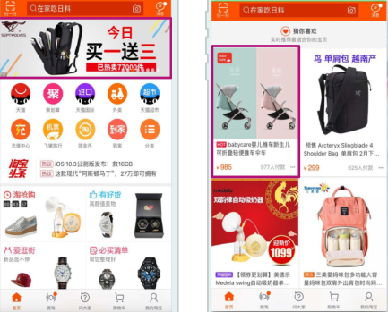
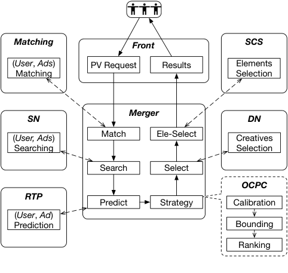
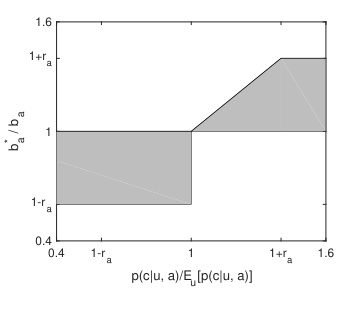
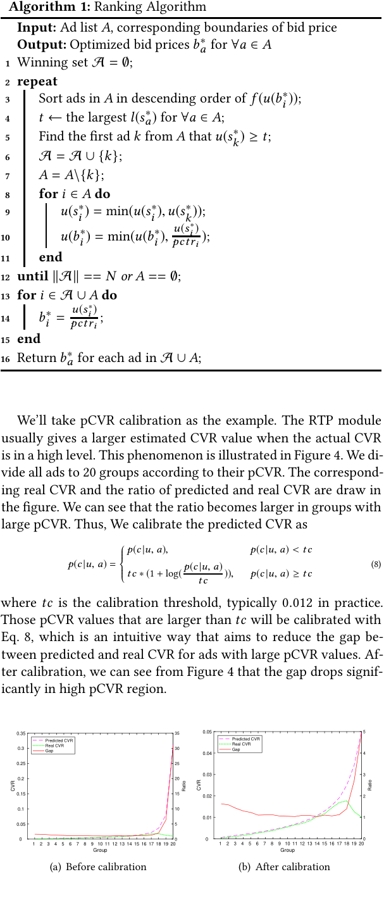
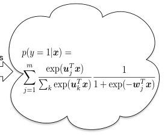
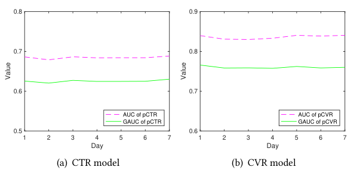
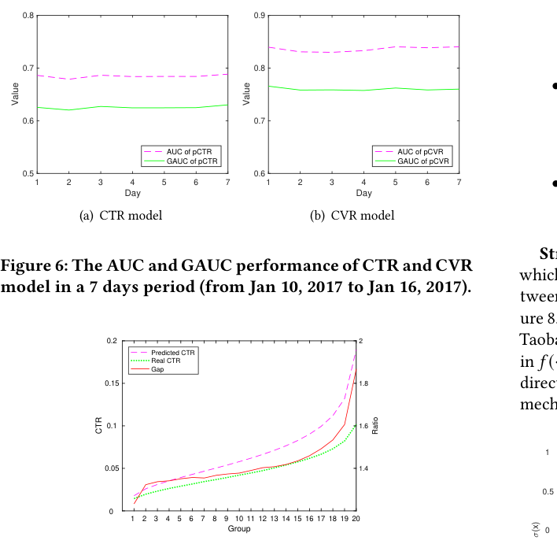
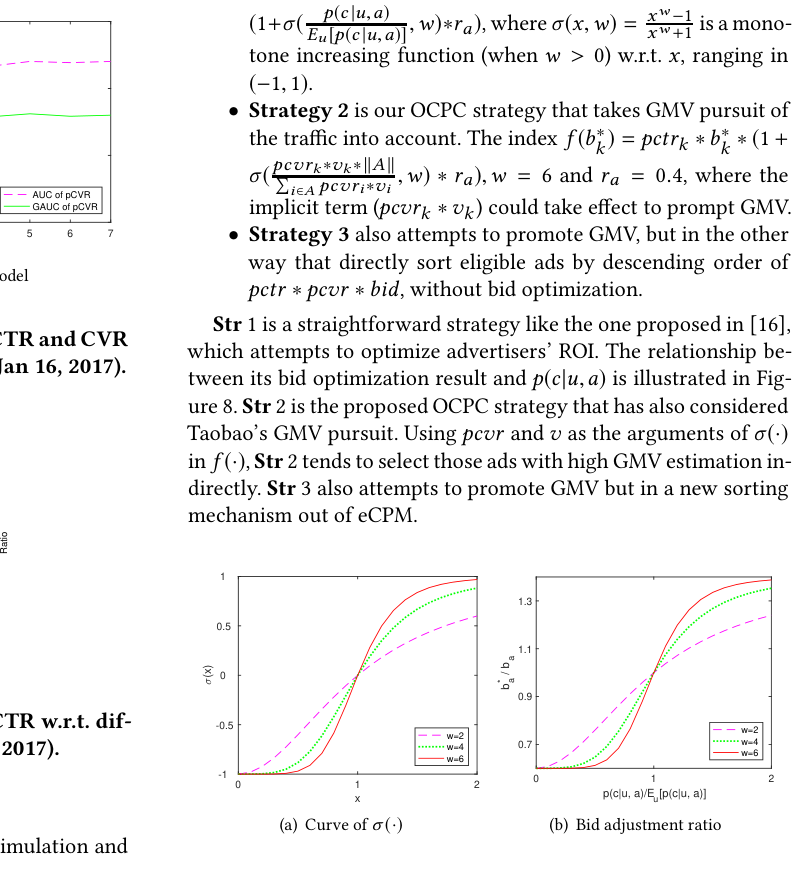
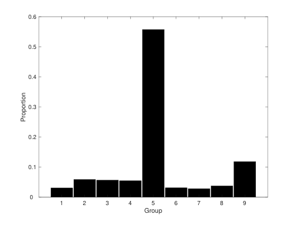
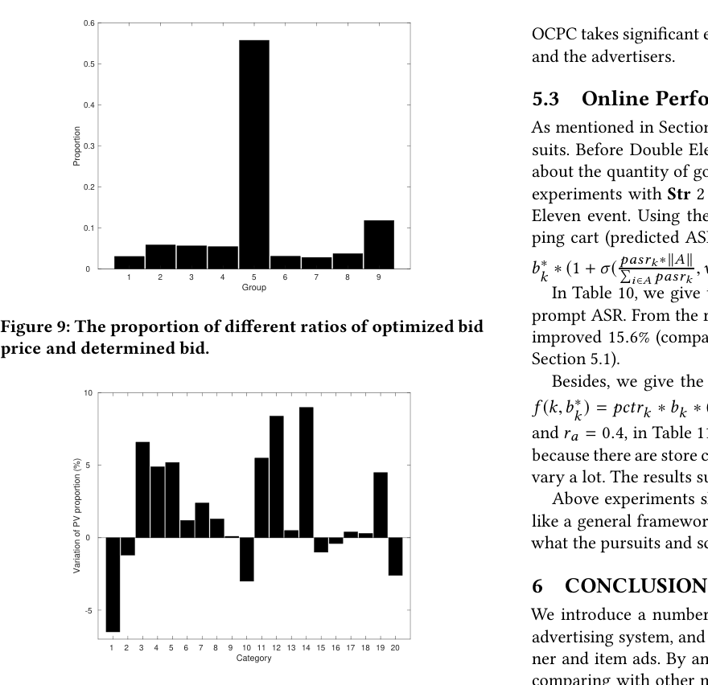

# 淘宝展示广告中的优化点击出价

> Han Zhu, Junqi Jin, Chang Tan, Fei Pan, Yifan Zeng, Han Li, Kun Gai | 阿里巴巴集团

本文提出了淘宝展示广告中的**优化点击出价**（OCPC，Optimized Cost per Click）策略。核心内容：

- 淘宝作为全球最大在线零售平台，每天为 数百万广告主 提供 数十亿展示广告曝光
- 传统CPC方法中广告主**设置固定出价**，无法充分优化对不同质量流量的匹配
- OCPC在每次PV请求粒度上**自动调整出价**，实现 **出价与流量质量的更精细匹配**
- **保持 eCPM排序 机制不变，优化广告主需求、平台商业收入和用户体验的整体生态**

关键发现：

- 在线A/B测试显示OCPC策略使RPM提升6.6%、GPM提升8.9%、ROI提升2.1%，实现三方共赢
- 67%的广告计划同时获得 GPM 和 ROI 提升
- OCPC机制已自动应用于淘宝移动端Item CPC广告的全部生产流量

---

## 摘要

淘宝作为全球最大的在线零售平台，每天为 数百万广告主 提供 数十亿 在线展示广告曝光。出于商业目的，广告主对特定广告位和目标人群出价以竞争商业流量。平台在数十毫秒内选择最合适的广告进行展示。常见的定价方式包括千次展示成本（CPM，Cost Per Mille）和点击成本（CPC，Cost Per Click）。传统广告系统以**固定出价**定向特定用户特征和广告位，本质上是出价与流量质量的粗粒度匹配。然而，广告主为不同质量请求设定的固定出价无法充分优化广告主的关键需求。此外，平台还需对商业收入和用户体验负责。因此，我们提出了一种称为优化点击出价（OCPC）的出价优化策略，它**自动调整出价**以在页面浏览（PV）请求粒度上实现出价与流量质量的更精细匹配。我们的方法优化了广告主需求、平台商业收入和用户体验，整体提升了流量分配效率。我们在淘宝展示广告系统的生产环境中验证了该方法。在线A/B测试表明，我们的算法比之前的固定出价方式产生了显著更好的结果。

## CCS 概念

- 信息系统 $\rightarrow$ 计算广告；展示广告

## 关键词

Display Advertising, Bid Optimization, Probability Estimation

## 1 引言

广告推动了新品牌的崛起并保持现有优质品牌永葆青春。在线广告[6, 9, 13, 14]是一种利用互联网作为媒介获取网站流量并定向向合适客户传递营销信息的营销策略，自20世纪90年代初以来经历了指数级增长。在线广告中的实时竞价（RTB，Real-Time Bidding）[15, 16, 22]技术允许广告主为每个单独的曝光出价。大量研究[23-26]已发现有效且高效的出价策略可以最大化一方（如广告主、消费者和中介平台）的单边经济剩余。

**图1：淘宝移动应用首页展示的横幅和item CPC广告。**

不仅仅是RTB系统，被《经济学人》[1]称为"全国最大在线市场"的淘宝，建立了世界上最先进的在线广告系统之一。在淘宝的移动应用和PC网站中，选定的广告在特定广告位呈现给用户。在本文中，我们聚焦于淘宝移动应用中不可或缺的CPC展示广告的出价优化问题。涉及的两种广告格式如下：

- **横幅CPC广告**：广告出现在淘宝首页顶部横幅中，如图1所示。广告主为单个item、店铺或品牌设置广告计划。
- **Item CPC广告**：单个item在"猜你喜欢"栏目中展示给用户，包含约两百个广告位，其中三个用于广告，其余用于推荐，如图1所示。

连接用户和广告主的淘宝广告平台形成了自己独特的生态系统，其特点如下：

- 首先，与大多数RTB系统难以获取完整的用户数据不同，淘宝本身同时充当需求方和供应方。这种生态闭环系统使淘宝能够收集完整的用户数据和广告计划信息。
- 其次，系统中的大多数广告主是中小企业，他们更关注收入增长而非品牌推广。因此，商品交易总额（GMV，Gross Merchandise Volume）的增长可以更好地惠及这些广告主。
- 第三，虽然不同的广告主可能追求不同的关键绩效指标（KPI，Key Performance Indicator，如曝光、点击、转化或投资回报率（ROI，Return on Investment）），但他们在淘宝平台上为点击出价，即采用CPC。我们稍后将讨论其他方法，如千次展示成本（CPM）和按销售付费（CPS，Cost Per Sale）。
- 最后但最重要的是，广告位必须满足媒体要求，这通过点击率（CTR，Click-Through Rate）、转化率（CVR，Conversion Rate）、GMV等指标来衡量。以下是GMV分析的一个例子。首先，我们希望商业流量的引入不会过度影响用户体验。因此，设置GMV要求可以实现商业收入和用户体验的双赢。其次，由于淘宝的广告主恰好是淘宝的卖家，卖家使用大约固定比例（抽成率）的收入用于营销目的，提高GMV将导致广告主增加广告预算，为平台带来长期利益。

权衡利弊，我们在两种广告格式中采用CPC。尽管广告主使用CPS[2, 5, 21]承担的风险更小，但与CPC相比，CPS忽略了点击的价值，提供更差的流量变现效率。由于涉及的广告格式主要面向中小企业广告主，CPM带来更高风险，而CPC允许广告主控制点击成本，平台承担将页面浏览转化为点击的风险。凭借淘宝完整的数据生态、标准化的电子商务广告和交互流程，CPC已足够有效。

许多最先进的系统如Facebook [7]使用与淘宝不同的设计。对于某些大型社交网络服务（SNS），例如通过优化千次展示成本（oCPM，optimized Cost Per Mille），广告主可以为点击出价而实际按展示付费[7]。SNS广告交互通常是发散的，如点赞、点击、分享等，而淘宝的交易通常通过简单的串行点击完成。从数据生态的角度看，广告点击后，淘宝用户的所有行为仍在淘宝平台上，这为后续基于交互的推断提供了条件。然而，SNS通常让广告主为点击或其他行动出价，然后转换为等效的CPM方式，这在机制上鼓励广告主上传真实的后续交互数据，进一步优化出价。

在前述两种广告格式中，考虑到生态、效率等因素，我们选择CPC方法，这也是本文的重点。

淘宝的广告系统包括过滤数百万广告和对这些候选广告排序。首先，从用户行为数据和广告item详情中挖掘用户偏好，淘宝定向系统[17, 18]训练模型为每个PV请求过滤大量广告，这称为匹配阶段。与不涉及广告主的推荐[20]不同，匹配服务召回相关用户必须反映广告主的出价意愿并确保市场深度。其次，实时预测（RTP，Real-Time Prediction）引擎为每个合格广告预测点击率（pCTR，predicted CTR）。第三，传统上，这些候选广告按 $\text{bid} \times \text{pCTR}$ 排序并基于该顺序展示，以最大化有效千次展示成本（eCPM，effective Cost Per Mille，eCPM排序机制）。

广告主总是期望出价与流量质量匹配。由于技术限制，传统方法只能为特定用户群体和广告位设置固定出价进行粗粒度的流量区分，而广告主寻求出价与流量质量的进一步细粒度匹配。基于固定出价的排序过程有两个缺陷。一方面，广告主设定的固定出价应对持续变化的不同商业质量的互联网流量是低效的；另一方面，传统方法最大化eCPM追求短期商业收入，但无法优化和控制GMV等媒体要求，损害了淘宝的长期利益。

针对这两个问题，从广告主的角度看，某些SNS中[7]从其他竞价目标等效转换的oCPM能够最大化广告主利益，但可能无法保证GMV等平台生态健康；从另一个方面，通过修改排序公式 $\text{bid} \times \text{pCTR}$ 过度追求GMV等媒体要求，无法为广告主和平台带来有效的商业利益。

为解决上述问题，我们提出优化点击出价（OCPC），其特点如下：对于每个PV请求，在优化广告主需求的前提下，OCPC将出价调整向流量质量的真实价值，同时在保持eCPM排序机制不变的情况下，最大化反映用户体验、广告主利益和平台收入整体生态的综合分数；我们的设计允许我们以较低成本灵活适配OCPC系统以满足业务变化的需求。我们期望通过优化流量匹配效率，OCPC实现用户、广告主和平台指标的全面升级。值得一提的是，Google AdWords中的增强点击出价[10]（ECPC，Enhanced Cost per Click）也尝试根据潜在转化率调整出价。然而，除了转化率外，GMV等对淘宝平台至关重要的平台指标无法在ECPC方式下直接优化。

我们的主要贡献总结如下：(i) 我们阐明了淘宝展示广告系统及其子系统的一些特征。(ii) 我们提出了一种新颖的出价优化方法，实现了淘宝生态中广告主利益、用户体验和平台收入的整体优化。(iii) 我们进行了全面的离线和在线实验以验证所提OCPC机制的有效性。

本文其余部分组织如下：第2节简要介绍淘宝广告系统。第3节介绍OCPC细节。第4节介绍预测过程。最后，第5节聚焦于所提方法的实验结果，包括模型有效性估计、离线实验机制和在线A/B测试性能。

## 2 系统架构

本节描述数据和信息在淘宝展示广告系统中的流动，如图2所示，这对于理解出价优化为何以及如何工作至关重要。每个系统组件和从最前端的页面浏览请求到最终展示所处理的事件序列如下所述：

**图2：淘宝展示广告系统的星型架构及其中使用的所提出价优化策略。**

前端服务器接收用户的页面浏览请求并分发给合并服务器，后者作为中央协调者在整个过程中与其他组件通信。合并服务器请求匹配服务器分析用户并根据广告主的用户定向需求获取特征标签列表。通过合并服务器，这些标签被传递给搜索节点（SN，Search Node）服务器，用于搜索特定的候选广告及其出价。在前述"猜你喜欢"中，候选数量从数千减少到约四百。然后，实时预测（RTP）服务器为来自SN的候选预测点击率（pCTR）和转化率（pCVR）。关于CTR预测[3, 11, 12]，我们使用混合逻辑回归（MLR，Mixture of Logistic Regression，也称为LS-PLM [8]）模型来处理特别高维（通常数亿维）、稀疏和二值化的特征。

作为合并的一部分，策略层包含OCPC的主要逻辑，通过基于pCTR、pCVR和出价的排序阶段优化流量分配。策略层还负责后续的广告去重，以及在广义第二价格拍卖（GSP，Generalized Second-Price auction）下的最终展示价格计算。根据广告排名，数据节点（DN，Data Node）服务器提取标题和图片地址，由智能创意服务（SCS，Smart Creative Service）进一步优化。最后，前端服务器将广告结果返回给移动应用或PC网站。随后的点击或转化将被记录在日志系统中。所有子系统共同构成一个完整的数据生态，基于此我们在下一节介绍OCPC策略。

## 3 优化点击出价

在本部分，我们首先数学描述广告主的需求和优化条件。其次，我们提出一种算法来优化平台生态指标和平台收入。最后，介绍相关细节。实际上，我们的算法框架适用于广泛的广告主需求和平台生态指标，如页面浏览数、点击数、转化数等。作为典型案例，本文将ROI和获取优质流量设为广告主需求，将GMV设为平台生态指标，这些连同平台收入一起通过调整广告主出价来优化。假设 $A$ 是对某个PV请求合格的广告计划集。对于该特定PV请求，对于每个广告计划 $a \in A$，广告主存在一个预设的对应出价 $b_a$。对于每个 $b_a$，OCPC算法的作用是调整它并找到一个优化的 $b_a^*$ 以实现预设的各种优化需求。

### 3.1 优化范围

**ROI约束。** 考虑到中小企业广告主更关注营销效果，我们选择在保持或提高ROI的同时优化其收入（GMV）作为算法的主要应用。这里我们引入相关符号并最终推导ROI的数学表示。

首先，我们定义在用户 $u$ 和点击广告 $a$ 条件下交易转化 $c$ 的概率为 $p(c \mid u, a)$。对于特定item，注意在 $p(c \mid u, a)$ 中广告位不作为条件，因为不同的广告位最终导向相同的item页面。对于特定广告计划 $a$，定义 $v_a$ 为消费者预测的按购买付费（PPB，Pay-Per-Buy），即卖家收入。因此，单次点击的预期GMV为 $p(c \mid u, a) \times v_a$。

虽然实际成本根据GSP机制计算，但这里我们假设广告主支付的单次点击成本为 $b_a$。因此单次点击的预期ROI推导为公式(1)：

$$
\text{roi}(u, a) = \frac{p(c \mid u, a) \times v_a}{b_a} \qquad (1)
$$

进一步，广告 $a$ 跨不同用户和点击的整体ROI推导为公式(2)，其中 $n_u$ 是用户在一段时间内的总点击数（我们假设ROI是针对特定人群和广告位的，因此 $b_a$ 是一致的）：

$$
\text{roi}_a = \frac{v_a \cdot \sum_u n_u \cdot p(c \mid u, a)}{b_a \cdot \sum_u n_u} = \frac{E_u[p(c \mid u, a)] \cdot v_a}{b_a} \qquad (2)
$$

公式(2)表明广告主的整体ROI由三个因素决定：转化率的期望 $E_u[p(c \mid u, a)]$、预测的 $v_a$ 和出价 $b_a$，其中 $v_a$ 对每个广告是固有的，$E_u[p(c \mid u, a)]$ 在每次特定拍卖中被视为平稳的。

实践中，当前预测模型用于预测过去几天竞争广告的pCVR，去除最大和最小10%的CVR后，剩余的平均值构成当前的 $E_u[p(c \mid u, a)]$。出价优化的目标要求 $\text{roi}_a$ 保持不变或提高（即所谓的ROI约束），并且广告主能够获得更多优质流量。

**出价优化边界。** 公式(2)证明了 $\text{roi}_a$ 与 $E_u[p(c \mid u, a)]$ 之间的线性关系，即满足 $\frac{b_a^*}{b_a} \leq \frac{p(c \mid u, a)}{E_u[p(c \mid u, a)]}$ 的出价优化将防止ROI下降。结合考虑广告主获取优质流量的需求，我们制定以下出价优化原则：在ROI约束下提高出价以帮助广告主竞争优质流量（$\frac{p(c \mid u, a)}{E_u[p(c \mid u, a)]} \geq 1$），以及降低出价为低质量流量（$\frac{p(c \mid u, a)}{E_u[p(c \mid u, a)]} < 1$）节省成本。

**图3：ROI约束下的出价优化范围（灰色区域）。**

出价优化范围中质量和数量的权衡如图3灰色区域所示，基于 $p(c \mid u, a)$ 和 $E_u[p(c \mid u, a)]$ 的比值。注意存在一个固定阈值 $r_a$（例如40%），出于安全和业务设置考虑。下限对于避免某些广告主在优化ROI时可能获得很少流量的情况至关重要。

在图3描述的区域中，广告计划 $a$ 的出价优化下限和上限分别记为 $l(b_a^*)$ 和 $u(b_a^*)$，如公式(3)和(4)所示。值得强调的是，出价优化边界可以推广到广告主的其他追求，不限于ROI。如果某些广告主未授权出价优化，对应的下限和上限都等于 $b_a$。

$$
l(b_a^*) = \begin{cases} b_a \cdot (1 - r_a), & \frac{p(c \mid u, a)}{E_u[p(c \mid u, a)]} < 1 \\ b_a, & \frac{p(c \mid u, a)}{E_u[p(c \mid u, a)]} \geq 1 \end{cases} \qquad (3)
$$

$$
u(b_a^*) = \begin{cases} b_a, & \frac{p(c \mid u, a)}{E_u[p(c \mid u, a)]} < 1 \\ b_a \cdot \min\left(1 + r_a, \frac{p(c \mid u, a)}{E_u[p(c \mid u, a)]}\right), & \frac{p(c \mid u, a)}{E_u[p(c \mid u, a)]} \geq 1 \end{cases} \qquad (4)
$$

### 3.2 排序

在给定边界内优化出价可以帮助广告主获得更优质的流量和更高的ROI。然而，从可行区域选择的不同出价 $b_a^*$ 可能在eCPM排序机制下导致不同的广告排名（即广告在出价优化后仍按 $\text{pCTR} \times \text{bid}$ 排序），从而带来不同的收入或其他指标。在本节后续内容中，我们将介绍从可行区域选择 $b_a^*$ 的新颖方式，在保持eCPM排序机制的前提下，获得考虑各方追求的最佳综合指标。

假设我们将在eCPM排序机制下展示一个广告，我们期望该广告最大化以下目标：

$$
\max_{b_1^*, \ldots, b_n^*} f(b_k^*) \qquad (5)
$$

$$
\text{s.t.} \quad k = \arg\max_i \text{pCTR}_i \times b_i^* \qquad (6)
$$

$$
l(b_i^*) \leq b_i^* \leq u(b_i^*), \quad i = 1, \cdots, n \qquad (7)
$$

其中 $n$ 是一次PV中合格广告的数量，即 $\|A\|$，$f(\cdot)$ 是可以给出包含各方追求的综合指标的函数。不失一般性，我们假设 $f(b_i^*)$ 关于 $b_i^*$ 单调递增。公式(6)中的条件意味着拍卖获胜的广告是在eCPM排序下排名第一的第 $k$ 个广告，上述优化问题是最大化拍卖获胜广告的 $f(b_k^*)$。公式(7)中的条件确保优化后的出价在确定范围内。公式(5)中的优化问题有两层含义：一方面，我们试图选择可能具有最大 $f(b_k^*)$ 值的第 $k$ 个广告；另一方面，每个广告 $i \in A$ 的出价应被调整以确保所选第 $k$ 个广告具有最大的eCPM。对于 $f(\cdot)$，我们给出以下两个例子：

$$
f_1(b_k^*) = \text{pCTR}_k \times \text{pCVR}_k \times v_k
$$

$$
f_2(b_k^*) = \text{pCTR}_k \times \text{pCVR}_k \times v_k + \alpha \times \text{pCTR}_k \times b_k^*
$$

其中 $f_1(\cdot)$ 倾向于提升淘宝平台的整体GMV（即所有广告主的收入）。$f_2(\cdot)$ 是淘宝GMV和广告收入的折衷。注意 $\alpha$ 是GMV和广告收入之间的权衡系数，不同的 $\alpha$ 值可能导致不同的出价优化目标，正如公式(5)所示。

排序的剩余工作是为每个 $a$ 找到能最大化公式(5)目标的 $b_a^*$。类似于优化出价的边界，我们推导 $\text{pCTR}_a \times b_a^*$ 的边界为 $l(s_a^*)$ 和 $u(s_a^*)$，称为优化排名分数 $s_a^*$ 的下限和上限（$l(s_a^*) = \text{pCTR}_a \times l(b_a^*)$，$u(s_a^*) = \text{pCTR}_a \times u(b_a^*)$，根据公式(3)和(4)）。为优化目标(5)，我们只需按 $f(u(b_i^*))$ 降序排列广告（注意这里使用出价上限 $u(b_i^*)$ 是因为我们假设 $f(b_i^*)$ 关于 $b_i^*$ 单调递增），然后选择第一个 $u(s_k^*)$ 不小于所有其他广告 $l(s_i^*)$ 的广告 $k$（以确保约束(6)和(7)可以满足）作为展示结果，并设 $b_k^* = u(b_k^*)$。最后，在可行区域内更新其他候选的出价，确保广告 $k$ 具有最大的eCPM。

回到可能有多个（例如 $N$ 个）广告在每次PV中展示的真实场景，我们在算法1中提出了一种贪心算法，简要解释如下。

首先，我们按 $f(\cdot)$ 排列广告（第3行），并通过优化公式(5)中的目标函数选出一个广告（推导广告请求，第4-5行）。然后，我们通过限制剩余广告的 $u(s_i^*)$ 不超过 $u(s_k^*)$ 来更新它们（相应地更新 $u(b_i^*)$ 以确保广告 $k$ 在出价优化后具有最大的eCPM，如约束(6)，第8-11行）。之后，我们重复上述两个步骤直到所有 $N$ 个广告被选出（第2-12行）。最后，将所有广告的 $b_i^*$ 设为其出价上限 $u(b_i^*)$（第13-15行）。所提排序算法的时间复杂度为 $O(N \times \|A\| \times \log \|A\|)$。通常 $N$ 是一个小数（例如Item CPC广告中 $N=3$），实时响应不会成为问题。

**算法1：排序算法**

$$
\begin{aligned}
&\textbf{输入：} \text{广告列表 } A \text{，对应的出价边界} \\
&\textbf{输出：} \text{优化后的出价 } b_a^* \text{，} \forall a \in A \\
&\text{获胜集 } \bar{A} = \emptyset \\
&\textbf{repeat} \\
&\quad \text{按 } f(u(b_i^*)) \text{ 降序排列 } A \text{ 中的广告} \\
&\quad t \leftarrow \forall a \in A \text{ 中最大的 } l(s_a^*) \\
&\quad \text{从 } A \text{ 中找到第一个 } u(s_k^*) \geq t \text{ 的广告 } k \\
&\quad \bar{A} = \bar{A} \cup \{k\} \\
&\quad A = A \setminus \{k\} \\
&\quad \textbf{for } i \in A \textbf{ do} \\
&\quad\quad u(s_i^*) = \min(u(s_i^*), u(s_k^*)) \\
&\quad\quad u(b_i^*) = \min(u(b_i^*), \frac{u(s_i^*)}{\text{pCTR}_i}) \\
&\quad \textbf{end for} \\
&\textbf{until } \|A\| == N \text{ 或 } A == \emptyset \\
&\textbf{for } i \in A \cup \bar{A} \textbf{ do} \\
&\quad b_i^* = \frac{u(s_i^*)}{\text{pCTR}_i} \\
&\textbf{end for} \\
&\textbf{返回 } A \cup \bar{A} \text{ 中每个广告的 } b_a^*
\end{aligned}
$$

**示例3.1。** 这里我们给出一个例子帮助理解排序算法。假设表1中有4个合格广告，要展示的广告数为 $N=2$。现在我们要从表1的广告1-4中选择2个广告。根据所提排序算法，这4个广告按 $f_2(u(b^*))$ 降序排列。最大的排名分数下限是 $l(s_3^*) = 0.09$（表1中蓝色标记）。排名第一的广告的 $u(s_1^*) = 0.112$（也蓝色标记），大于0.09。因此，广告1从 $A$ 中选出并插入获胜集 $\bar{A}$，候选集 $A$ 更新为表2（更新的单元格为红色）。之后，在第二轮中广告3而非广告2被选为另一个获胜广告，因为广告2的排名分数上限 $u(s_2^*) = 0.075$ 小于0.09。然后循环结束因为 $\|A\| == N$。最后，每个广告的出价优化结果在表3中给出。

**表1：$A$ 中4个合格广告及其pCTR、出价等，$f_2(\cdot)$ 中 $\alpha$ 设为1。**

| 广告# | pCTR | 出价 | $u(b^*)$ | $u(s^*)$ ($\times 10^{-2}$) | $l(s^*)$ ($\times 10^{-2}$) | $f_2(u(b^*))$ |
|-------|------|------|----------|---------------------------|---------------------------|---------------|
| 1 | 0.04 | 2 | 2.8 | 11.2 | 8 | 0.312 |
| 2 | 0.05 | 1.5 | 1.5 | 7.5 | 4.5 | 0.255 |
| 3 | 0.06 | 1.5 | 1.95 | 11.7 | 9 | 0.237 |
| 4 | 0.04 | 1 | 1 | 4 | 3.6 | 0.14 |

**表2：广告1被选出后 $A$ 中剩余3个广告及其更新。更新的单元格为红色。**

| 广告# | pCTR | 出价 | $u(b^*)$ | $u(s^*)$ ($\times 10^{-2}$) | $l(s^*)$ ($\times 10^{-2}$) | $f_2(u(b^*))$ |
|-------|------|------|----------|---------------------------|---------------------------|---------------|
| 2 | 0.05 | 1.5 | 1.5 | 7.5 | 4.5 | 0.255 |
| 3 | 0.06 | 1.5 | 1.86 | 11.2 | 9 | 0.232 |
| 4 | 0.04 | 1 | 1 | 4 | 3.6 | 0.14 |

**表3：每个合格广告的出价优化结果。**

| 广告# | pCTR | 出价 | $b^*$ | $f_2(u(b^*))$ | eCPM |
|-------|------|------|-------|---------------|------|
| 1 | 0.04 | 2 | 2.8 | 0.312 | 0.112 |
| 3 | 0.06 | 1.5 | 1.86 | 0.232 | 0.112 |
| 2 | 0.05 | 1.5 | 1.5 | 0.255 | 0.075 |
| 4 | 0.04 | 1 | 1 | 0.14 | 0.04 |

通过这种排序策略，我们将最终排序指标和广告流量的目标解耦。一方面，广告仍可按 $\text{pCTR} \times \text{bid}$ 排序，这是最大化eCPM的方式；另一方面，广告平台可以通过不同的 $f(\cdot)$ 根据其他追求选择广告。另一个关注的问题是广告主的预算约束。一旦广告计划花费完预算，它将被排除在后续拍卖之外，这不会影响出价优化过程。

### 3.3 算法细节

在介绍了OCPC机制的核心思想后，我们将详细说明整个策略层。

**校准。** 从维护广告系统的历史经验中，我们发现OCPC层使用的预测值存在固有偏差，可能影响算法有效性。由于在模型训练中进行调整很困难，我们在OCPC层开始时在预测后进行校准。我们以pCVR校准为例。RTP模块通常在实际CVR处于较高水平时给出较大的估计CVR值。该现象如图4所示。我们将所有广告按pCVR分为20组。对应的实CVR以及预测和实CVR的比值在图中绘制。我们可以看到在pCVR较大的组中比值变得更大。因此，我们将预测CVR校准为：

$$
\hat{p}(c \mid u, a) = \begin{cases} p(c \mid u, a), & p(c \mid u, a) < t_c \\ t_c \times \left(1 + \log\left(\frac{p(c \mid u, a)}{t_c}\right)\right), & p(c \mid u, a) \geq t_c \end{cases} \qquad (8)
$$

其中 $t_c$ 是校准阈值，实践中通常为0.012。大于 $t_c$ 的pCVR值将用公式(8)校准，这是一种直观的方式，旨在减少具有大pCVR值的广告的预测和实CVR之间的差距。校准后，我们可以从图4中看到差距在高pCVR区域显著下降。

**图4：校准前后不同pCVR水平下预测和实CVR之间的差距（$t_c = 0.012$，2017年1月10日至16日）。**

**图5：CTR和CVR预测模型的特征组成。**

**整体OCPC策略。** 在算法2中，我们给出了整体OCPC策略的概述，从校准到排序。第1-4行的函数calibrate和calculateBoundary具有线性时间复杂度 $O(\|A\|)$。rank函数的时间复杂度为 $O(N \times \|A\| \times \log \|A\|)$。因此，OCPC策略的运行时性能瓶颈是排序阶段。考虑到 $\|A\|$（约数百个）和 $N$ 的典型值，实时性能对所提方法来说不是问题。

**算法2：OCPC算法**

$$
\begin{aligned}
&\textbf{输入：} \text{合格广告 } A \text{，及对应的预测值} \\
&\textbf{输出：} \text{优化后的出价 } b_a^* \text{，} a \in A \\
&\textbf{for } i \in A \textbf{ do} \\
&\quad \text{calibrate()} \\
&\quad \text{calculateBoundary()} \\
&\textbf{end for} \\
&\text{rank()} \\
&\textbf{返回每个 } b_a^*
\end{aligned}
$$

## 4 模型估计

所述OCPC的出价优化边界极度依赖于CVR预测。同时，pCTR等预测值也会在很大程度上影响所提策略的性能。在本节中，我们将聚焦于预测模型，以及预测值的准确性和稳定性。

### 4.1 模型和特征

在淘宝估计中，我们拥有用户和广告计划的稀疏特征，维度达数千万。逻辑回归是CTR预测[19]等任务中广泛使用的算法。然而，要解决的问题可能是非线性的。因此，我们在RTP服务器中使用混合逻辑回归（MLR，也称为LS-PLM [8]）算法。我们不在这里展开更多关于MLR的介绍，而是介绍特征组成以帮助理解学习模型如何工作。

在图5中，我们展示了CTR和CVR预测中的特征组成。我们将简要介绍这三类特征及其组合。**上下文特征**是与上下文相关的特征。例如，广告位位置特征（我们称之为PID特征）用于区分不同的广告位（例如Android或iOS中的广告位）。**用户特征**主要包含用户画像特征（如性别、年龄等）和用户行为特征（如一段时间内不同类别的点击次数）。**广告计划特征**由广告ID等特征组成。除了这三类中的单独特征外，它们的组合（例如昵称和广告ID的笛卡尔积）也被使用。此外，在CVR预测中，点击质量模型（用于量化点击行为）的结果被用作输入，这在实践中显示了显著的改进。

在CTR模型中，正样本来自被点击的展示。负样本是未被点击的展示。在CVR模型中，正样本是被点击且转化的展示，负样本是被点击但未转化的展示。每天训练新模型以消除不同天之间的方差。

### 4.2 模型性能

服务精确的结果对预测模型非常重要。在CTR预测等任务中，AUC（Area Under the Curve，曲线下面积）是广泛使用的衡量模型有效性的指标。然而，现有研究[4]表明测试中更好的AUC结果可能在生产中带来更差的性能。这也在我们调优预测模型时在实践中困扰了我们。我们分析了该问题，发现AUC指标不加区分地对待不同的用户和广告位。例如，从不点击任何广告的用户或冷门广告位会给AUC结果带来向更低值的波动。根据这些事实和分析，我们提出了一种类AUC指标，称为分组AUC（GAUC，Group AUC），如公式(9)所示。首先，我们按用户（$u$）和广告位的特定位置（$p$）聚合所有测试数据。然后在每个单独组中计算AUC结果（注意如果一组中全为正样本或负样本，我们从数据中移除该组）。最后，我们对不同组的加权AUC（权重 $w_{(u,p)}$ 与组内展示次数或点击次数成比例）结果取平均作为GAUC值。

$$
\text{GAUC} = \frac{\sum_{(u,p)} w_{(u,p)} \times \text{AUC}_{(u,p)}}{\sum_{(u,p)} w_{(u,p)}} \qquad (9)
$$

**CTR和CVR模型性能。** 在图6中，我们给出了7天期间CTR和CVR预测模型的AUC和GAUC性能。结果表明MLR算法产生的每日模型性能相当稳定。CVR模型比CTR模型具有更高的GAUC，因为CVR模型的样本中噪声更少。在图7和4中，我们展示了不同预测值水平下预测和实CTR、CVR值的比值。结果表明CTR的预测值通常大于实值。然而，更重要的是所提OCPC策略中不同预测CTR值之间的序数关系。

性能结果表明，作为所提OCPC机制前提的CTR和CVR预测模型是可行的。

**图6：7天期间CTR和CVR模型的AUC和GAUC性能（2017年1月10日至16日）。**

**图7：不同pCTR水平下预测和实CTR之间的差距（2017年1月10日至16日）。**

## 5 实验结果

在满足上述预测模型性能结果的基础上，我们将评估所提OCPC方法的有效性。以下实验有两部分：离线模拟和在线A/B测试。

### 5.1 离线模拟

在在线广告中，新算法生效通常需要几天甚至几周。如此长的反馈时间会推迟新算法的开发和升级。为克服该问题，我们构建了一个离线模拟平台以加速新想法的验证。基于日志数据，预览过程可以完美还原。换句话说，给定每个PV请求的相同合格广告列表，模拟环境中的拍卖获胜广告与生产环境相同。对于即将到来的展示后用户行为，我们使用预测概率作为真实点击或转化的替代来估计不同出价优化策略的真实性能。例如，如果一个展示广告的CTR预测为4%，那么它将为总点击次数贡献0.04。在模拟中，我们使用2017年2月11日Item CPC广告中所有竞价记录的20%（约两千万PV），并比较了4种不同的出价优化策略：

- **策略0** 是没有出价优化的旧策略。由于商业数据的敏感性和隐私性，其他策略的结果将以与该基础策略的对比形式展示。

- **策略1** 是一种从广告主角度出发的简单出价优化策略。这里我们直接优化 $b_a^* = b_a \times (1 + \sigma(\frac{p(c \mid u, a)}{E_u[p(c \mid u, a)]}, w) \times r_a)$，其中 $\sigma(x, w) = \frac{x^w - 1}{x^w + 1}$ 是关于 $x$ 的单调递增函数（当 $w > 0$ 时），范围在 $(-1, 1)$ 内。

- **策略2** 是我们考虑淘宝GMV追求的OCPC策略。指标 $f(b_k^*) = \text{pCTR}_k \times b_k^* \times (1 + \sigma(\frac{\text{pCVR}_k \times v_k \times \|A\|}{\sum_{i \in A} \text{pCVR}_i \times v_i}, w) \times r_a)$，$w = 6$，$r_a = 0.4$，其中隐含项 $(\text{pCVR}_k \times v_k)$ 可以发挥作用以提升GMV。

- **策略3** 也尝试提升GMV，但以另一种方式，直接按 $\text{pCTR} \times \text{pCVR} \times \text{bid}$ 降序排列合格广告，不进行出价优化。

Str 1是一种类似于[16]中提出的直观策略，试图优化广告主的ROI。其出价优化结果与 $p(c \mid u, a)$ 的关系如图8所示。Str 2是所提OCPC策略，还考虑了淘宝的GMV追求。使用pCVR和 $v$ 作为 $f(\cdot)$ 中 $\sigma(\cdot)$ 的参数，Str 2倾向于间接选择那些具有高GMV估计的广告。Str 3也尝试提升GMV，但采用eCPM之外的新排序机制。

**图8：$\sigma(\cdot)$ 的曲线及Str 1在 $r_a = 0.4$ 时对应的出价调整比，不同 $w$ 值。**

在给出结果之前，我们将详细介绍一些用于评估不同出价优化策略性能的指标。**RPM** 是每千次展示的广告收入指标，可以衡量广告平台的流量变现效率。**千次展示GMV**（GPM，GMV Per Mille）是每千次展示的商品交易总额，与广告主收入和淘宝的用户体验相关。**ROI** 衡量广告主的投资回报。**CTR**、**CVR** 和 **PPC**（Pay-Per-Click，每次点击付费）分别是平均点击率、转化率和每次点击费用。

**表4：不同OCPC策略在 $r_a = 0.4$ 时的模拟结果。**

| | RPM | GPM | ROI | CTR | CVR | PPC |
|------|------|------|------|------|------|------|
| Str 1 | -9.5% | 8.8% | 20.2% | -0.5% | 10.1% | -7.8% |
| Str 2 | 5.6% | 14.1% | 8.1% | -1.9% | 14.9% | 9.5% |
| Str 3 | -17.7% | 23.6% | 50.2% | -8.6% | 74.0% | -9.8% |

在表4中，我们给出了Str 1、2、3相对于Str 0的结果。调整函数 $\sigma(\cdot)$ 中的参数 $w$ 通过交叉验证选择，Str 1和2分别设为2和6。Str 1专注于优化广告主ROI，无法确保更好的RPM。Str 3可以通过按 $\text{pCTR} \times \text{pCVR} \times \text{bid}$ 排序提升GPM，但也会拉低RPM（因为PPC和CTR下降）。只有所提OCPC策略Str 2可以实现GPM、ROI和RPM的三方共赢。

为衡量不同调整范围 $r_a$ 的影响，我们用Str 2（在上述实验中优于其他策略）进行实验，结果如表5所示。离线模拟结果表明更大的 $r_a$ 可以带来更好的性能。RPM的增量小于GPM，导致当调整范围较大时ROI提升更高。

**表5：Str 2在不同 $r_a$ 下的模拟结果。**

| $r_a$ | RPM | GPM | ROI | CTR | CVR | PPC |
|-------|------|------|------|------|------|------|
| 0.2 | 4.2% | 6.5% | 2.2% | -0.5% | 6.5% | 5.5% |
| 0.3 | 5.2% | 10.2% | 4.8% | -1.1% | 10.4% | 7.6% |
| 0.4 | 5.6% | 14.1% | 8.1% | -1.9% | 14.9% | 8.1% |
| 0.5 | 5.5% | 18.1% | 11.9% | -3.1% | 19.9% | 11.2% |

表4和表5中的结果表明策略2在提升整体GMV方面有积极作用，ROI约束可以保护广告主利益。

**广告计划结果。** 除了整体性能外，我们还模拟了Str 2下特定广告计划的性能，以确保所提策略可以改善每个单独广告计划的广告效果。模拟中花费最多的10个广告计划的结果如表6所示。"成本"指标是广告的总支付。一个有趣的观察是，七个广告计划的GPM增加而PV同时下降，这意味着它们通过OCPC机制赢得了更少的低质量机会。此外，十个广告计划中有八个的ROI得到改善，表明ROI约束确实对单独广告计划有效。广告计划3和8的ROI略有下降，是因为它们竞争了更多PV。

**表6：Str 2下不同广告计划的模拟结果。**

| | GMV | 成本 | PV | GPM | ROI |
|-------|------|------|------|------|------|
| 计划1 | -0.9% | -17.5% | -16.2% | 18.2% | 20.1% |
| 计划2 | -7.7% | -27.9% | -26.8% | 26.2% | 28.1% |
| 计划3 | 2.5% | 9.2% | 2.6% | -0.1% | -6.2% |
| 计划4 | 23.0% | 9.2% | 0.4% | 22.6% | 12.7% |
| 计划5 | -13.1% | -23.8% | -22.0% | 11.4% | 14.0% |
| 计划6 | 0.0% | -4.0% | -10.3% | 11.5% | 4.1% |
| 计划7 | -5.0% | -8.0% | -9.7% | 5.2% | 3.2% |
| 计划8 | 64.6% | 65.7% | 49.5% | 10.1% | -0.6% |
| 计划9 | -19.2% | -30.4% | -28.5% | 13.1% | 16.1% |
| 计划10 | -4.2% | -5.3% | -8.6% | 4.9% | 1.2% |

### 5.2 OCPC策略2的在线结果

经过离线模拟和在线小流量A/B测试后，我们最终决定在生产中部署前述Str 2。同时，Str 0作为对比测试保留。在本节中，我们将研究所提OCPC策略在Item CPC广告中的在线性能。不同流量追求和场景的其他结果也展示了以证明OCPC机制的有效性和通用性。

在表7中，我们给出了Str 2在30%全生产流量下的实验结果，基准Str 0也有30%流量。用户被随机分配到每个策略，同时所有广告计划同时存在于两个策略中。注意我们在Item CPC广告中每天约有九千万PV。结果证明了所提出价优化策略的稳定改进。广告主利益（由ROI指示）、平台收入（由RPM指示）和整体GPM实现了三方共赢。

**表7：Str 2在30%全生产流量下的在线实验结果（$r_a = 0.4$，2016年8月23日至29日）。**

| | RPM | GPM | ROI | CTR | CVR |
|------|------|------|------|------|------|
| 提升百分比 | 6.6% | 8.9% | 2.1% | -1.3% | 5.2% |

在给出整体性能结果后，我们进行了其他实验（2016年9月8日至14日）以进一步验证Str 2的有效性，探究它是否长期内有利于大多数单独广告主和广告平台。

**广告主视角的性能。** 首先，我们分析每个单独广告计划的性能。包含一周内至少有5次转化的广告计划。在表8中，我们给出了广告效果得到改善的广告计划的比例数据。在一周内超过5次转化的所有广告计划中，67%的广告计划同时获得GPM和ROI提升。24%的广告计划处于所谓的量质交换情况：它们的PV增量大于ROI下降。我们认为这对某些广告主也是可以接受的，因为PV增量可能使那些次要展示到达广告计划并降低ROI。然而，更多展示也可能带来更多转化。

**表8：性能得到改善的广告计划比例。这里选择实验中超过5次转化的广告计划。**

| | 广告计划比例 |
|------|------------|
| GPM和ROI同时提升 | 67% |
| 量质交换 | 24% |

在OCPC机制下，广告主可能还关心优化后的出价实际是多少。在图9中，我们展示了2017年2月19日展示广告的优化出价 $b_a^*$ 与设定出价 $b_a$ 的数值关系。我们将竞价记录按 $b_a^*/b_a$ 的值（范围从 $1-r_a$ 到 $1+r_a$）分为9组。从结果中，我们可以看到超过一半的展示属于第5组（即 $b_a^* = b_a$ 的中间组）。这是一个合理的观察，因为根据公式(4)，低质量流量的出价优化上限设为 $b_a$，且所提排序算法倾向于采用上限。

**图9：优化出价与设定出价不同比例的展示比例。**

**平台视角的性能。** 站在平台方，仅仅关注整体RPM、GPM和ROI结果是远远不够的。在淘宝广告系统中，广告item来自各种类别，如女装、家具或数码产品。每个类别都有其固有的CVR或ROI水平。存在整体GMV或ROI提升来自不同类别之间流量转移的可能性，这从长远来看并不好。因此，我们给出实验结果以捕获流量转移。

PV比例变化的结果如图10所示。类别的PV比例是该类别PV与实验桶中总PV的比值。结果表明流量转移不太明显，所有变化都在 $\pm 10\%$ 以内（注意PV比例可能在不同桶中因算法不同而变化）。

**图10：前20个类别（按类别总广告花费排名）PV比例的变化。**

类比广告主视角，我们也进行了实验展示类别视角的性能。表9中的结果表明17%的类别（占62%的PV）同时获得GPM和ROI提升。

**表9：性能得到改善的类别比例及对应的类别PV比例。**

| | 类别比例 | PV比例 |
|------|---------|--------|
| GPM和ROI同时提升 | 17% | 62% |
| GPM提升 | 27% | 21% |
| 量质交换 | 30% | 12% |

平台方和广告主视角的结果证明OCPC算法有能力将合适的机会分配给不同的广告，可以提高广告流量的综合利用效果。以上所有结果证明OCPC对淘宝广告平台和广告主都产生了显著效果。

### 5.3 其他场景的在线性能

如第3.1节所述，广告主可能有不同的追求。在双十一之前，淘宝卖家更关注加入购物车的商品数量。我们在2016年双十一活动前使用不同的 $f(\cdot)$ 对Str 2进行实验。使用预测的加入购物车概率（predicted ASR，Add-to-Shopping-cart Rate），指标函数 $f(k, b_k^*) = \text{pCTR}_k \times b_k^* \times (1 + \sigma(\frac{\text{pASR}_k \times \|A\|}{\sum_{i \in A} \text{pASR}_i}, w) \times r_a)$，$w = 6$，$r_a = 0.4$。

在表10中，我们给出了帮助提升ASR的OCPC策略结果。从结果中，我们可以观察到ASR提升了15.6%（与使用第5.1节中前述 $f(\cdot)$ 的Str 2相比）。

**表10：关于提升加入购物车概率的在线结果（2016年10月30日至11月10日，5%生产流量）。**

| | GPM | RPM | CTR | CVR | ASR |
|------|------|------|------|------|------|
| 提升百分比 | 0.3% | -6.1% | -2.9% | 21.1% | 15.6% |

此外，我们在横幅CPC广告中给出了Str 2的结果，使用 $f(k, b_k^*) = \text{pCTR}_k \times b_k \times (1 + \sigma(\frac{\text{pCVR}_k \times \|A\|}{\sum_{i \in A} \text{pCVR}_i}, w) \times r_a)$，$w = 6$，$r_a = 0.4$，如表11所示。注意我们从 $f(\cdot)$ 中移除了 $v_a$ 项，因为存在店铺广告计划中不同item的PPB差异很大。结果表明CVR和GPM有较大提升。

**表11：横幅广告中的在线结果（2017年1月13日至15日，30%生产流量）。**

| | GPM | RPM | ROI | CTR | CVR |
|------|------|------|------|------|------|
| 提升百分比 | 15.7% | 3.6% | 11.7% | -0.6% | 19% |

以上实验表明OCPC机制可以作为一个通用框架来处理不同的问题，无论追求和场景是什么。

## 6 结论

我们介绍了淘宝展示广告系统的许多重要特征，详细阐述了两种关键广告格式，即横幅和item广告。通过分析生态特征并与其他方法比较，我们在涉及的广告格式中使用了最合适的定价方法即CPC。我们展示了系统架构和广告投放流程，基于此分析了传统CPC方法的不足并提出了OCPC算法来调和广告主需求、平台生态指标和平台收入。我们将优化目标数学化并给出了详细的算法，连同预测模型、校准和算法复杂度分析等其他相关技术细节。保持eCPM排序机制，所提OCPC策略通过出价优化不仅使广告主受益，也使包括eCPM本身在内的其他指标受益。在淘宝展示广告平台中，OCPC已自动应用于Item CPC广告的全部移动端生产流量，广告主也可选择在自己的横幅CPC广告流量中应用。

## 参考文献

[1] 2015. The everything creditor. Economist (2015).

[2] Gagan Aggarwal, Ashish Goel, and Rajeev Motwani. 2006. Truthful auctions for pricing search keywords. In Proceedings of the 7th ACM conference on Electronic commerce. ACM, 1–7.

[3] Junxuan Chen, Baigui Sun, Hao Li, Hongtao Lu, and Xian-Sheng Hua. 2016. Deep CTR Prediction in Display Advertising. In Proceedings of the 2016 ACM on Multimedia Conference. ACM, 811–820.

[4] Heng-Tze Cheng, Levent Koc, Jeremiah Harmsen, Tal Shaked, Tushar Chandra, Hrishi Aradhye, Glen Anderson, Greg Corrado, Wei Chai, Mustafa Ispir, et al. 2016. Wide & deep learning for recommender systems. In Proceedings of the 1st Workshop on Deep Learning for Recommender Systems. ACM, 7–10.

[5] Benjamin Edelman, Michael Ostrovsky, and Michael Schwarz. 2007. Internet advertising and the generalized second-price auction: Selling billions of dollars worth of keywords. The American economic review 97, 1 (2007), 242–259.

[6] David S Evans. 2009. The online advertising industry: Economics, evolution, and privacy. The journal of economic perspectives 23, 3 (2009), 37–60.

[7] Facebook. 2012. Cost per Action and Optimized Cost Per Mille. developers.facebook.com (2012).

[8] Kun Gai, Xiaoqiang Zhu, Han Li, Kai Liu, and Zhe Wang. 2017. Learning Piecewise Linear Models from Large Scale Data for Ad Click Prediction. arXiv preprint arXiv:1704.05194 (2017).

[9] Avi Goldfarb and Catherine Tucker. 2011. Online display advertising: Targeting and obtrusiveness. Marketing Science 30, 3 (2011), 389–404.

[10] Google. 2010. Enhanced Cost per Click in Google AdWords. https://support.google.com/adwords/answer/2464964 (2010).

[11] Thore Graepel, Joaquin Q Candela, Thomas Borchert, and Ralf Herbrich. 2010. Web-scale bayesian click-through rate prediction for sponsored search advertising in microsoft's bing search engine. In Proceedings of the 27th International Conference on Machine Learning (ICML-10). 13–20.

[12] Xinran He, Junfeng Pan, Ou Jin, Tianbing Xu, Bo Liu, Tao Xu, Yanxin Shi, Antoine Atallah, Ralf Herbrich, Stuart Bowers, et al. 2014. Practical lessons from predicting clicks on ads at facebook. In Proceedings of the Eighth International Workshop on Data Mining for Online Advertising. ACM, 1–9.

[13] Chinmay Karande, Aranyak Mehta, and Ramakrishnan Srikant. 2013. Optimizing budget constrained spend in search advertising. In Proceedings of the sixth ACM international conference on Web search and data mining. ACM, 697–706.

[14] Sébastien Lahaie, David M Pennock, Amin Saberi, and Rakesh V Vohra. 2007. Sponsored search auctions. Algorithmic game theory (2007), 699–716.

[15] S Muthukrishnan. 2010. Data Mining Problems in Internet Ad Systems. In COMAD. 9.

[16] Claudia Perlich, Brian Dalessandro, Rod Hook, Ori Stitelman, Troy Raeder, and Foster Provost. 2012. Bid optimizing and inventory scoring in targeted online advertising. In Proceedings of the 18th ACM SIGKDD international conference on Knowledge discovery and data mining. ACM, 804–812.

[17] Foster Provost, Brian Dalessandro, Rod Hook, Xiaohan Zhang, and Alan Murray. 2009. Audience selection for on-line brand advertising: privacy-friendly social network targeting. In Proceedings of the 15th ACM SIGKDD international conference on Knowledge discovery and data mining. ACM, 707–716.

[18] Troy Raeder, Ori Stitelman, Brian Dalessandro, Claudia Perlich, and Foster Provost. 2012. Design principles of massive, robust prediction systems. In Proceedings of the 18th ACM SIGKDD international conference on knowledge discovery and data mining. ACM, 1357–1365.

[19] Matthew Richardson, Ewa Dominowska, and Robert Ragno. 2007. Predicting clicks: estimating the click-through rate for new ads. In Proceedings of the 16th international conference on World Wide Web. ACM, 521–530.

[20] J Ben Schafer, Dan Frankowski, Jon Herlocker, and Shilad Sen. 2007. Collaborative filtering recommender systems. In The adaptive web. Springer, 291–324.

[21] Hal R Varian. 2007. Position auctions. international Journal of industrial Organization 25, 6 (2007), 1163–1178.

[22] Shuai Yuan, Jun Wang, Bowei Chen, Peter Mason, and Sam Seljan. 2014. An empirical study of reserve price optimisation in real-time bidding. In Proceedings of the 20th ACM SIGKDD international conference on Knowledge discovery and data mining. ACM, 1897–1906.

[23] Shuai Yuan, Jun Wang, and Xiaoxue Zhao. 2013. Real-time bidding for online advertising: measurement and analysis. In Proceedings of the Seventh International Workshop on Data Mining for Online Advertising. ACM, 3.

[24] Yong Yuan, Feiyue Wang, Juanjuan Li, and Rui Qin. 2014. A survey on real time bidding advertising. In IEEE International Conference on Service Operations and Logistics, and Informatics. 418–423.

[25] Weinan Zhang, Shuai Yuan, and Jun Wang. 2014. Optimal real-time bidding for display advertising. In Proceedings of the 20th ACM SIGKDD international conference on Knowledge discovery and data mining. ACM, 1077–1086.

[26] Weinan Zhang, Tianxiong Zhou, Jun Wang, and Jian Xu. 2016. Bid-aware Gradient Descent for Unbiased Learning with Censored Data in Display Advertising. In Proceedings of the 22nd ACM SIGKDD international conference on Knowledge discovery and data mining. 665–674.
