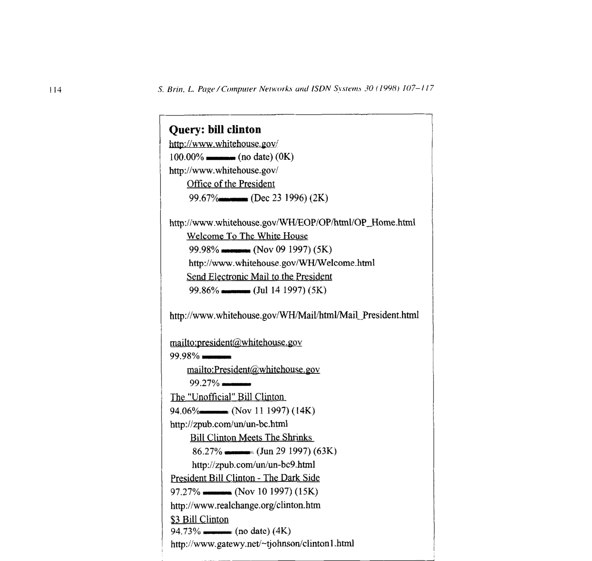

# The Anatomy of a Large-Scale Hypertextual Web Search Engine

> Sergey Brin, Lawrence Page | Computer Science Department, Stanford University

本文是 Google 搜索引擎的原始论文，详细描述了 Google 系统的架构和设计理念。核心内容：

- 提出 PageRank 算法，利用网页的链接结构来评估网页质量，将链接视为"投票"，高质量网页的链接具有更高权重
- 利用锚文本（Anchor Text）扩展搜索能力，使搜索引擎能够索引无法直接爬取的文档（如图片、程序、数据库）
- 设计了高效的系统架构，包括分布式爬虫、倒排索引、正向索引等数据结构，能够处理数千万网页的索引和查询
- 在 2400 万网页上构建了完整的搜索引擎原型，查询时间在 1-10 秒内

关键发现：
- PageRank 作为一种客观的网页质量度量，与人们主观判断的网页重要性高度吻合
- 仅依靠关键词匹配的搜索引擎返回大量低质量结果，而结合链接分析可以显著提升搜索质量
- 系统的爬虫、索引、排序操作足够高效，能够在一周内构建 2400 万网页的索引

## 关键词

World Wide Web, Search engines, Information retrieval, PageRank, Web crawling, Inverted index

---

## 摘要

我们介绍了 Google，一个大规模搜索引擎的原型，它大量利用超文本中存在的结构。Google 被设计用于高效地爬取和索引 Web，并产生比现有系统更令人满意的搜索结果。该原型拥有至少 2400 万网页的全文和超链接数据库，可在 http://google.stanford.edu/ 获取。

构建搜索引擎是一项具有挑战性的任务。搜索引擎索引数千万到数亿个 Web 网页，涉及数量相当的不同词条。它们每天回答数千万次查询。尽管大规模搜索引擎在 Web 上非常重要，但学术界对它们的研究却很少。此外，由于技术的快速发展和 Web 的普及，今天创建一个 Web 搜索引擎与三年前大不相同。本文深入描述了我们的大规模 Web 搜索引擎——据我们所知，这是迄今为止首个此类详细的公开描述。

除了将传统搜索技术扩展到如此大规模数据的问题外，使用超文本中存在的额外信息来产生更好的搜索结果还涉及新的技术挑战。本文解决了如何构建一个实用的、能够利用超文本中存在的额外信息的大型系统的问题。同时，我们也研究了如何有效处理不受控制的超文本集合——任何人都可以在其中发布他们想要的任何内容。

**关键词**：World Wide Web；搜索引擎；信息检索；PageRank；Google

## 1. 引言

Web 为信息检索带来了新的挑战。Web 上的信息量正在快速增长，同时不熟悉 Web 研究技术的新用户数量也在增加。人们很可能通过其链接图来浏览 Web，通常从高质量的人工维护索引（如 Yahoo!）或搜索引擎开始。人工维护的列表有效地覆盖了流行主题，但具有主观性、构建和维护成本高、改进缓慢，且无法覆盖所有小众主题。依赖关键词匹配的自动搜索引擎通常返回太多低质量的匹配结果。更糟糕的是，一些广告商试图通过误导性手段来吸引人们的注意力。

我们构建了一个大规模搜索引擎，解决了现有系统的许多问题。它特别大量利用超文本中存在的额外结构来提供更高质量的搜索结果。我们选择系统名称 Google，因为它是 googol（即 $10^{100}$）的常见拼写，非常符合我们构建超大规模搜索引擎的目标。

### 1.1. Web 搜索引擎——扩展：1994-2000

搜索引擎技术必须大幅扩展以跟上 Web 的增长。1994 年，最早的 Web 搜索引擎之一 World Wide Web Worm（WWWW）[6] 拥有 110,000 个 Web 网页和 Web 可访问文档的索引。截至 1997 年 11 月，顶级搜索引擎声称索引从 200 万（WebCrawler）到 1 亿（来自 Search Engine Watch）个 Web 文档。可以预见，到 2000 年，Web 的综合索引将包含超过十亿个文档。同时，搜索引擎处理的查询数量也在惊人增长。1994 年 3 月和 4 月，World Wide Web Worm 平均每天收到约 1500 次查询。1997 年 11 月，AltaVista 声称每天处理约 2000 万次查询。随着 Web 用户数量的增加以及查询搜索引擎的自动化系统的增加，到 2000 年，顶级搜索引擎很可能每天处理数亿次查询。我们系统的目标是解决将搜索引擎技术扩展到如此巨大数字时引入的质量和可扩展性问题。

### 1.2. Google：随 Web 扩展

随着 Web 的增长，这些任务变得越来越困难。然而，硬件性能和成本已经显著改善，部分抵消了这种困难。但是，在这一进展中有一些显著的例外，如磁盘寻道时间和操作系统健壮性。在设计 Google 时，我们考虑了 Web 的增长速度和技术变化。Google 被设计为能够很好地扩展到极大数据集。它高效地利用存储空间来存储索引。其数据结构针对快速高效的访问进行了优化（见第 4.2 节）。此外，我们预计索引和存储文本或 HTML 的成本最终将相对于可用量下降（见完整版本中的附录 B）。这将为像 Google 这样的集中式系统带来有利的扩展特性。

### 1.3. 设计目标

#### 1.3.1. 提高搜索质量

即使扩展到今天的 Web，构建搜索引擎也面临许多挑战。需要快速的爬取技术来收集 Web 文档并保持其最新。必须高效地使用存储空间来存储索引，以及可选地存储文档本身。索引系统必须高效地处理数百 GB 的数据。查询必须快速处理，速率达到每秒数百到数千次。

我们的主要目标是提高 Web 搜索引擎的质量。1994 年，有些人相信完整的搜索索引将使人们能够轻松找到任何东西。根据 Best of the Web 1994 - Navigators，"最好的导航服务应该使人们能够轻松找到 Web 上的几乎任何东西（一旦所有数据输入完毕）。"然而，1997 年的 Web 已经大不相同。任何最近使用过搜索引擎的人都可以轻易证明，索引的完整性并不是搜索结果质量的唯一因素。"垃圾结果"往往会淹没用户感兴趣的结果。事实上，截至 1997 年 11 月，四大商业搜索引擎中只有一家能找到自己（在其名称的前十名结果中返回自己的搜索页面）。这个问题的主要原因之一是索引中的文档数量增加了几个数量级，但用户查看文档的能力并没有增加。人们仍然只愿意查看前几十个结果。因此，随着集合大小的增长，我们需要具有非常高精确率的工具（在前几十个结果中返回的相关文档数量）。实际上，我们希望"相关"的概念仅包括最好的文档，因为可能有成千上万的略微相关文档。即使以召回率（系统能够返回的相关文档总数）为代价，这种非常高的精确率也很重要。

最近有很多乐观情绪认为，使用更多的超文本信息可以帮助改善搜索和其他应用 [4, 9, 12, 3]。特别是链接结构和链接文本为进行相关性判断和质量过滤提供了大量信息。Google 同时利用链接结构和锚文本（见第 2.1 节和第 2.2 节）。

#### 1.3.2. 学术搜索引擎研究

除了巨大的增长，Web 还随着时间变得越来越商业化。1993 年，1.5% 的 Web 服务器在 .com 域上。这个数字在 1997 年增长到超过 60%。同时，搜索引擎已经从学术领域迁移到商业领域。到目前为止，大多数搜索引擎开发都是在公司中进行的，很少发布技术细节。这导致搜索引擎技术在很大程度上仍然是黑魔法且以广告为导向（见完整版本中的附录 A）。有了 Google，我们有一个强烈的目标，将更多的开发和理解推入学术领域。

另一个重要的设计目标是构建合理数量的人实际可以使用的系统。使用对我们很重要，因为我们认为一些最有趣的研究将涉及利用现代 Web 系统中可用的大量使用数据。例如，每天有数千万次搜索。然而，获取这些数据非常困难，主要是因为它被认为具有商业价值。

我们的最终设计目标是构建一个能够支持大规模 Web 数据上新颖研究活动的架构。为了支持新颖的研究用途，Google 以压缩形式存储其爬取的所有实际文档。我们设计 Google 的主要目标之一是建立一个环境，其他研究人员可以快速进入，处理大量 Web，并产生否则很难产生的有趣结果。在系统运行的短短时间内，已经有多篇使用 Google 生成的数据库的论文，还有更多正在进行中。我们的另一个目标是建立一个类似 Spacelab 的环境，研究人员甚至学生可以在我们的大规模 Web 数据上提出和进行有趣的实验。

## 2. 系统特性

Google 搜索引擎有两个重要特性，帮助它产生高精确率的结果。首先，它利用 Web 的链接结构来计算每个 Web 网页的质量排名。这个排名称为 PageRank，在 [7] 中有详细描述。其次，Google 利用链接来改善搜索结果。

### 2.1. PageRank：为 Web 带来秩序

Web 的引用（链接）图是一个重要的资源，在现有的 Web 搜索引擎中很大程度上未被利用。我们创建了包含多达 5.18 亿个超链接的地图，这是总量的重要样本。这些地图允许快速计算网页的"PageRank"——一种对其引用重要性的客观度量，与人们对重要性的主观想法非常吻合。由于这种对应关系，PageRank 是优先处理 Web 关键词搜索结果的绝佳方式。对于大多数流行主题，当 PageRank 对结果进行优先排序时，限制在网页标题上的简单文本匹配搜索表现非常出色（演示可在 google.stanford.edu 获取）。对于 Google 主系统中的全文搜索类型，PageRank 也有很大帮助。

#### 2.1.1. PageRank 计算描述

学术引用文献已被应用于 Web，主要通过计算指向给定页面的引用或反向链接数量。这给出了页面重要性或质量的近似值。PageRank 通过不平等计算所有页面的链接，并通过页面上的链接数量进行归一化来扩展这一思想。PageRank 定义如下：

我们假设页面 A 有页面 $T_1 \ldots T_n$ 指向它（即引用）。参数 $d$ 是阻尼因子，可以设置在 0 和 1 之间。我们通常将 $d$ 设置为 0.85。下一节中有关于 $d$ 的更多细节。$C(A)$ 定义为从页面 A 出去的链接数量。页面 A 的 PageRank 由以下公式给出：

$$
PR(A) = (1-d) + d \left(\frac{PR(T_1)}{C(T_1)} + \ldots + \frac{PR(T_n)}{C(T_n)}\right)
$$

注意 PageRanks 在 Web 网页上形成概率分布，所以所有网页 PageRanks 的总和为 1。

PageRank 或 $PR(A)$ 可以使用简单的迭代算法计算，对应于 Web 归一化链接矩阵的主特征向量。此外，在一台中等规模的工作站上，2600 万 Web 网页的 PageRank 可以在几小时内计算完成。还有许多其他细节超出了本文的范围。

#### 2.1.2. 直觉验证

PageRank 可以被视为用户行为的模型。我们假设有一个"随机冲浪者"，随机获得一个网页并不断点击链接，从不点击"返回"，但最终感到无聊并开始访问另一个随机页面。随机冲浪者访问一个页面的概率就是它的 PageRank。阻尼因子 $d$ 是"随机冲浪者"在每个页面感到无聊并请求另一个随机页面的概率。一个重要的变体是仅将阻尼因子 $d$ 添加到单个页面或一组页面。这允许个性化，并且几乎不可能故意误导系统以获得更高的排名。我们还有其他几种 PageRank 扩展，同样参见 [7]。

另一个直觉验证是，一个页面可以有很高的 PageRank，如果有许多页面指向它，或者如果有某些页面指向它并且具有很高的 PageRank。直观地说，来自 Web 各处良好引用的页面值得查看。此外，可能只有来自 Yahoo! 主页的一个引用的页面通常也值得查看。如果一个页面不是高质量的，或者是一个损坏的链接，Yahoo! 的主页很可能不会链接到它。PageRank 通过递归地通过 Web 的链接结构传播权重来处理这两种情况以及介于两者之间的所有情况。

### 2.2. 锚文本

在我们的搜索引擎中，链接的文本以特殊方式处理。大多数搜索引擎将链接的文本与链接所在的页面关联。此外，我们将它与链接指向的页面关联。这有几个优势。首先，锚文本通常比页面本身提供更准确的 Web 页面描述。其次，锚文本可能存在于无法被基于文本的搜索引擎索引的文档中，如图像、程序和数据库。这使得返回实际上未被爬取的网页成为可能。注意未被爬取的页面可能会引起问题，因为它们在返回给用户之前从未被检查有效性。在这种情况下，搜索引擎甚至可以返回一个实际上从未存在但有指向它的超链接的页面。然而，可以对结果进行排序，使得这个特定问题很少发生。

将锚文本传播到其引用的页面的想法在 World Wide Web Worm [6] 中实现，特别是因为它有助于搜索非文本信息，并以较少的下载文档扩展搜索覆盖范围。我们使用锚传播主要是因为锚文本可以帮助提供更高质量的结果。高效使用锚文本在技术上是困难的，因为必须处理大量数据。在我们当前 2400 万网页的爬取中，我们索引了超过 2.59 亿个锚点。

## 3. 相关工作

Web 上的搜索研究有着简短而精炼的历史。World Wide Web Worm（WWWW）[6] 是最早的 Web 搜索引擎之一。随后出现了几个学术搜索引擎，其中许多现在是上市公司。与 Web 的增长和搜索引擎的重要性相比，关于最近搜索引擎的文献非常少 [8]。根据 Michael Mauldin（Lycos 公司首席科学家）[15] 的说法，"各种服务（包括 Lycos）都严格保护这些数据库的细节"。然而，搜索引擎特定功能的工作已经有了相当多的成果。尤其是通过后处理现有商业搜索引擎结果或生成小规模"个性化"搜索引擎的工作。最后，信息检索系统的研究很多，特别是在受控集合上 [11]。

然而，信息检索的工作大多是在相当小、受控良好的集合上进行的，如文本检索会议（TREC）[10]。在 TREC 上效果好的东西在 Web 上通常不产生好结果。例如，标准向量空间模型试图返回最接近查询的文档，假设查询和文档都是由它们的词频定义的向量。在 Web 上，这种策略通常返回非常短的文档，即查询加上几个词。例如，我们见过一个主要搜索引擎在"Bill Clinton"查询中返回仅包含"Bill Clinton Sucks"和图片的页面。鉴于这样的例子，我们相信标准的信息检索工作需要扩展以有效地处理 Web。

Web 是一个庞大的、完全不受控制的异构文档集合。文档在语言、格式和风格上差异显著。两个文档在大小、质量、流行度和可信度上可能有好几个数量级的差异。所有这些都是 Web 上有效搜索的重大挑战。它们在一定程度上通过超链接和格式化等辅助数据的可用性得到缓解，Google 试图利用这两者。

## 4. 系统解剖

在本节中，我们将给出整个系统如何工作的高级概述，如图 1 所示。后续章节将讨论本节中未提及的应用和数据结构。Google 的大部分功能用 C 或 C++ 实现以提高效率，可以在 Solaris 或 Linux 上运行。

在 Google 中，Web 爬取（下载 Web 网页）由几个分布式爬虫完成。有一个 URL 服务器向爬虫发送要获取的 URL 列表。获取的 Web 网页然后发送到存储服务器。存储服务器然后压缩并将 Web 网页存储到仓库中。每个 Web 网页都有一个关联的 ID 号，称为 docID，当从网页中解析出新 URL 时分配。索引功能由索引器和排序器执行。索引器执行多项功能。它读取仓库，解压缩文档，并解析它们。每个文档被转换为一组称为命中的词出现记录。命中记录词、文档中的位置、字体大小的近似值和大写情况。索引器将这些命中分发到一组"桶"中，创建部分排序的正向索引。索引器执行另一个重要功能。它解析每个网页中的所有链接，并将有关它们的重要信息存储在锚文件中。此文件包含足够的信息来确定每个链接的来源和目标，以及链接的文本。

URL 解析器读取锚文件，将相对 URL 转换为绝对 URL，然后转换为 docID。它将锚文本放入正向索引中，与锚指向的 docID 关联。它还生成一个链接数据库，即 docID 对。链接数据库用于计算所有文档的 PageRank。

排序器获取按 docID 排序的桶（这是一个简化，见完整版本中的第 4.2.5 节），并按 wordID 重新排序以生成倒排索引。这是就地完成的，因此此操作只需要很少的临时空间。排序器还生成一个 wordID 列表和倒排索引中的偏移量。一个名为 DumpLexicon 的程序获取此列表以及索引器生成的词典，并生成一个新的词典供搜索器使用。搜索器由 Web 服务器运行，使用 DumpLexicon 构建的词典以及倒排索引和 PageRank 来回答查询。

### 4.2. 数据结构

Google 的数据结构经过优化，以便以低成本爬取、索引和搜索大型文档集合。尽管多年来 CPU 和批量输入输出速率显著提高，但磁盘寻道仍然需要约 10 毫秒完成。Google 被设计为尽可能避免磁盘寻道，这对数据结构的设计产生了相当大的影响。本文的完整版本包含对所有主要数据结构的详细讨论。我们这里只给出简要概述。

Google 的几乎所有数据都存储在 Bigfiles 中，这是我们开发的虚拟文件，可以跨多个文件系统并支持压缩。原始 HTML 仓库使用大约一半必要的存储空间。它由每个页面压缩 HTML 的串联组成，前面有一个小头部。文档索引保存有关每个文档的信息。它是一个固定宽度的 ISAM（索引顺序访问模式）索引，按 docID 排序。每个条目中存储的信息包括当前文档状态、指向仓库的指针、文档校验和和各种统计信息。可变宽度信息（如 URL 和标题）保存在单独的文件中。还有一个辅助索引将 URL 转换为 docID。词典有几种不同的形式用于不同的操作。它们都是基于内存的哈希表，每个词附带不同的值。

命中列表对应于特定词在特定文档中的出现列表，包括位置、字体和大写信息。命中列表占据了正向索引和倒排索引中使用的大部分空间。因此，尽可能高效地表示它们很重要。我们考虑了几种编码位置、字体和大写的替代方案——简单编码（整数三元组）、紧凑编码（手动优化的位分配）和 Huffman 编码。最终我们选择了手动优化的紧凑编码，因为它比简单编码需要的空间少得多，且比 Huffman 编码的位操作少得多。我们的紧凑编码使用两个字节记录每个命中。此编码的详细信息在本文的完整版本中。命中列表的长度存储在命中本身之前。为了节省空间，命中列表的长度与正向索引中的 wordID 和倒排索引中的 docID 组合。

正向索引实际上已经部分排序。它存储在多个桶中（我们使用了 64 个）。每个桶保存一个 wordID 范围。如果一个文档包含落入特定桶的词，docID 被记录到该桶中，后跟与这些词对应的 wordID 和命中列表。此方案由于重复的 docID 需要稍微更多的存储空间，但对于合理的桶数量，差异非常小，并且节省了排序器执行的最终索引阶段的大量时间和编码复杂度。倒排索引由与正向索引相同的桶组成，只是它们已经过排序器处理。对于每个有效的 wordID，词典包含一个指向该 wordID 落入的桶的指针。它指向一个 docID 列表及其相应的命中列表。此列表称为文档列表，表示该词在所有文档中的所有出现。

一个重要的问题是文档列表中 docID 应该以什么顺序出现。一个简单的解决方案是按 docID 排序存储。这允许多个词查询的不同文档列表快速合并。另一个选项是按词在每个文档中的出现排名排序存储。这使得单个词查询变得简单，并且多词查询的答案可能靠近开头。然而，合并要困难得多。此外，这使得开发变得更加困难，因为排名函数的更改需要重建索引。我们选择了这些选项之间的折衷，保留两组倒排桶——一组用于包含标题或锚点命中的命中列表，另一组用于所有命中列表。这样，我们首先检查第一组桶，如果这些桶中的匹配不够，我们检查更大的桶。

### 4.3. 爬取 Web

运行 Web 爬虫是一项具有挑战性的任务。有棘手的性能和可靠性问题，更重要的是，有社会问题。爬虫是最脆弱的应用，因为它涉及与数十万个 Web 服务器和各种名称服务器交互，这些都超出了系统的控制。

为了扩展到数亿个 Web 网页，Google 有一个快速的分布式爬取系统。一个 URL 服务器向多个爬虫（我们通常运行约 3 个）提供 URL 列表。URL 服务器和爬虫都用 Python 实现。每个爬虫同时保持大约 300 个连接打开。这是以足够快的速度检索网页所必需的。在峰值速度下，系统可以使用四个爬虫每秒爬取超过 100 个网页。一个主要的性能压力是 DNS 查找，因此每个爬虫都维护一个 DNS 缓存。数百个连接中的每一个都可能处于多种不同的状态：查找 DNS、连接到主机、发送请求和接收响应。这些因素使爬虫成为系统的一个复杂组件。它使用异步 IO 来管理事件，并使用多个队列来将页面获取从一个状态移动到另一个状态。

我们爬取的超过 50 万台服务器由数万名网络管理员运行。因此，爬取 Web 涉及与相当多的人交互。几乎每天我们都会收到这样的电子邮件："哇，你看了很多来自我网站的页面。你觉得怎么样？"其他交互涉及版权问题和可能仅在千万分之一页面上出现的模糊错误。由于像爬虫这样的大型复杂系统不可避免地会引起问题，因此需要投入大量资源来阅读电子邮件并在问题出现时解决它们。

### 4.4. 搜索

搜索的目标是高效地提供高质量的搜索结果。许多大型商业搜索引擎在效率方面似乎取得了很大进展。因此，我们在研究中更关注搜索质量，尽管我们相信我们的解决方案稍加努力就可以扩展到商业量级。

Google 比典型的搜索引擎保存了更多关于 Web 文档的信息。每个命中列表包括位置、字体和大写信息。此外，我们还考虑了锚文本的命中和文档的 PageRank。将所有这些信息组合成一个排名是困难的。我们设计了排名函数，使没有任何一个因素可以有太大的影响。对于每个匹配文档，我们在不同的接近度级别上计算不同类型命中的计数。然后通过一系列查找表运行这些计数，最终转换为排名。这个过程涉及许多可调参数。我们还没有花太多时间调整系统；相反，我们开发了一个反馈系统，将在未来帮助我们调整这些参数。

## 5. 结果和性能

衡量搜索引擎最重要的指标是其搜索结果的质量。虽然完整的用户评估超出了本文的范围，但我们使用 Google 的经验表明，对于大多数搜索，它比主要商业搜索引擎产生更好的结果。作为说明 PageRank、锚文本和接近度使用的示例，图 2 显示了 Google 对"bill Clinton"搜索的结果。这些结果展示了 Google 的一些特性。结果按服务器分组。这在筛选结果集时非常有帮助。许多结果来自 whitehouse.gov 域，这是人们可以合理预期的。目前，大多数主要商业搜索引擎不返回任何来自 whitehouse.gov 的结果，更不用说正确的结果了。注意第一个结果没有标题。相反，Google 依赖于锚文本来确定这是查询的好答案。同样，第五个结果是一个电子邮件地址，当然，它是不可爬取的。它也是锚文本的结果。所有结果都是相当高质量的页面，并且在最后检查时，没有损坏的链接。

这主要是因为它们都有很高的 PageRank。PageRanks 是红色的百分比以及条形图。最后，没有关于 Clinton 以外的 Bill 或 Bill 以外的 Clinton 的结果。这是因为我们非常重视词出现的接近度。当然，搜索引擎质量的真正测试需要广泛的用户研究或结果分析，我们这里没有空间。相反，我们邀请读者在 http://google.stanford.edu 自己尝试 Google。

除了搜索质量，Google 被设计为随着 Web 的增长能够经济地扩展。一个方面是高效使用存储空间。表 1 显示了 Google 的一些统计数据和存储需求的细分。

对于搜索引擎来说，高效地爬取和索引非常重要。这样信息可以保持最新，并且可以相对快速地测试系统的重大更改。总共花了大约 9 天时间下载 2600 万个页面（包括错误）。然而，一旦系统运行顺畅，它运行得更快，在仅 63 小时内下载了最后 1100 万个页面，平均每天超过 400 万个页面或每秒 48.5 个页面。索引器以大约每秒 54 个页面的速度运行。排序器可以完全并行运行；使用四台机器，整个排序过程大约需要 24 小时。改进搜索性能不是我们研究到目前为止的主要焦点。当前版本的 Google 在 1 到 10 秒内回答大多数查询。此时间主要由 NFS 上的磁盘 IO 主导（因为我们的磁盘分布在多台机器上）。此外，Google 没有使用许多常见的优化来加速信息检索系统，如查询缓存、常见术语的子索引和其他常见优化。我们打算在未来显著加快 Google 的速度。表 2 显示了当前版本 Google 的一些示例查询时间。

## 6. 结论

大规模 Web 搜索引擎是一个复杂系统，还有很多工作要做。我们的直接目标是提高搜索效率并扩展到大约 1 亿个 Web 网页。提高效率的一些简单改进包括查询缓存、智能磁盘分配和子索引。另一个需要大量研究的领域是更新。我们必须有智能算法来决定哪些旧网页应该重新爬取，哪些新网页应该爬取。在这个目标上的工作已经在 [2] 中完成。一个有前途的研究领域是使用代理缓存来构建搜索数据库，因为它们是需求驱动的。我们计划添加商业搜索引擎支持的简单功能，如布尔运算符、否定和词干提取。然而，其他功能才刚刚开始被探索，如相关性反馈和聚类（Google 目前支持简单的基于主机名的聚类）。我们还计划支持用户上下文（如用户的位置）和结果摘要。我们还在努力扩展链接结构和链接文本的使用。简单的实验表明，PageRank 可以通过增加用户主页或书签的权重来个性化。至于链接文本，我们正在实验使用链接周围的文本以及链接文本本身。Web 搜索引擎是一个非常丰富的研究想法环境。我们有太多想法无法在此列出，所以我们不期望这个未来工作部分在不久的将来会变得更短。

### 6.1. 高质量搜索

Web 搜索引擎用户今天面临的最大问题是他们得到的结果质量。虽然结果通常很有趣并且扩展了用户的视野，但它们通常令人沮丧并消耗宝贵的时间。例如，在一个最受欢迎的商业搜索引擎上搜索"Bill Clinton"的顶级结果是"Bill Clinton Joke of the Day: April 14, 1997"。

Google 被设计为提供更高质量的搜索，以便随着 Web 继续快速增长，信息可以轻松找到。为了实现这一点，Google 大量利用超文本信息，包括链接结构和链接（锚）文本。Google 还使用接近度和字体信息。虽然搜索引擎的评估很困难，但我们主观发现 Google 比当前商业搜索引擎返回更高质量的搜索结果。通过 PageRank 分析链接结构使 Google 能够评估网页的质量。使用链接文本作为链接指向内容的描述有助于搜索引擎返回相关（在某种程度上高质量）的结果。最后，使用接近度信息有助于大大提高许多查询的相关性。

### 6.2. 可扩展架构

除了搜索质量，Google 被设计为可扩展的。它必须在空间和时间上都高效，当处理整个 Web 时，常数因子非常重要。在实现 Google 的过程中，我们在 CPU、内存访问、内存容量、磁盘寻道、磁盘吞吐量、磁盘容量和网络 IO 方面遇到了瓶颈。Google 已经发展到在各种操作中克服了许多这些瓶颈。Google 的主要数据结构高效地利用可用存储空间。此外，爬取、索引和排序操作足够高效，能够在不到一周的时间内构建 Web 的大部分（2400 万网页）的索引。我们预计能够在不到一个月的时间内构建 1 亿个网页的索引。

### 6.3. 一个 Web 搜索工具

除了是一个高质量的搜索引擎，Google 还是一个研究工具。Google 收集的数据已经导致了许多其他提交给会议的论文，以及更多正在进行中的论文。最近的研究如 [1] 已经表明，关于 Web 的一些查询可以在没有 Web 本地可用的情况下得到回答。这意味着 Google（或类似系统）不仅是一个有价值的研究工具，而且对于广泛的应用来说是必要的。我们希望 Google 将成为全世界搜索者和研究人员的资源，并将激发下一代搜索引擎技术。

## 致谢

Scott Hassan 和 Alan Steremberg 对 Google 的开发至关重要。他们才华横溢的贡献是不可替代的，作者对他们深表感谢。我们还要感谢 Hector Garcia-Molina、Rajeev Motwani、Jeff Ullman 和 Terry Winograd 以及整个 WebBase 团队的支持和富有洞察力的讨论。最后，我们要感谢我们的设备捐赠者 IBM、Intel 和 Sun 以及我们的资助者的慷慨支持。本文描述的研究是斯坦福集成数字图书馆项目的一部分，由美国国家科学基金会合作协议 IRI-94 11306 支持。该合作协议的资金也由 DARPA 和 NASA 以及 Interval Research 和斯坦福数字图书馆项目的工业合作伙伴提供。

---

## 参考文献

[1] S. Abiteboul and V. Vianu. Queries and computation on the Web. in: Proceedings of the International Conference on Database Theory: Delphi, Greece, 1997.

[2] J. Cho, H. Garcia-Molina and L. Page. Efficient crawling through URL ordering. in: Proc. of the 7th International World Wide Web Conference (WWW 98), Brisbane, Australia, April 15-18, 1998; also Computer Networks, 30(1-7): 161-172 (this volume).

[3] O.-A. McBryan. GENVL and WWWW: tools for taming the Web. in: Proc. of the 1st International Conference on the World Wide Web, CERN, Geneva, Switzerland, May 25-27, 1994.

[4] M. Marchiori. The quest for correct information on the Web: hyper search engines. in: Proc. of the 6th International WWW Conference (WWW 97), Santa Clara, USA, April 7-11, 1997.

[5] M.L. Mauldin. Lycos design choices in an Internet service. IEEE Expert Interview. http://www.computer.org/pubs/expert/1997/trends/xi008/mauldin.htm

[6] B. Pinkerton. Finding what people want: experiences with the WebCrawler. http://www.webcrawler.com/bp/WWW94.html

[7] L. Page, S. Brin, R. Motwani and T. Winograd. The PageRank citation ranking: bringing order to the Web. Manuscript in Progress. http://google.stanford.edu/~backrub/pageranksub.ps

[8] E. Spertus. Parasite: mining structural information on the Web. in: Proc. of the 6th International WWW Conference (WWW 97), Santa Clara, USA, April 7-11, 1997.

[9] D.K. Harman and E.M. Voorhees (Eds.). Proceedings of the Fifth Text REtrieval Conference (TREC-5). Gaithersburg, Maryland. November 20-22, 1996. National Institute of Standards and Technology Special Publication 500-238.

[10] D.A. Grossman, O. Frieder and D.K. Gifford. HyPursuit: a hierarchical network search engine that exploits content-link hypertext clustering. in: Proc. of the 7th ACM Conference on Hypertext (HT 96), Washington, DC, 1996.

[11] I.H. Witten, A. Moffat, and T.C. Bell. Managing Gigabytes: Compressing and Indexing Documents and Images. Van Nostrand Reinhold, New York, NY, 1994.

[12] R. Weiss, B. Vélez, M.A. Sheldon, C. Manprempre, P. Szilagyi, A. Duda, and D.K. Gifford. HyPursuit: a hierarchical network search engine that exploits content-link hypertext clustering. in: Proc. of the 6th International WWW Conference (WWW 97), Santa Clara, USA, April 7-11, 1997.
