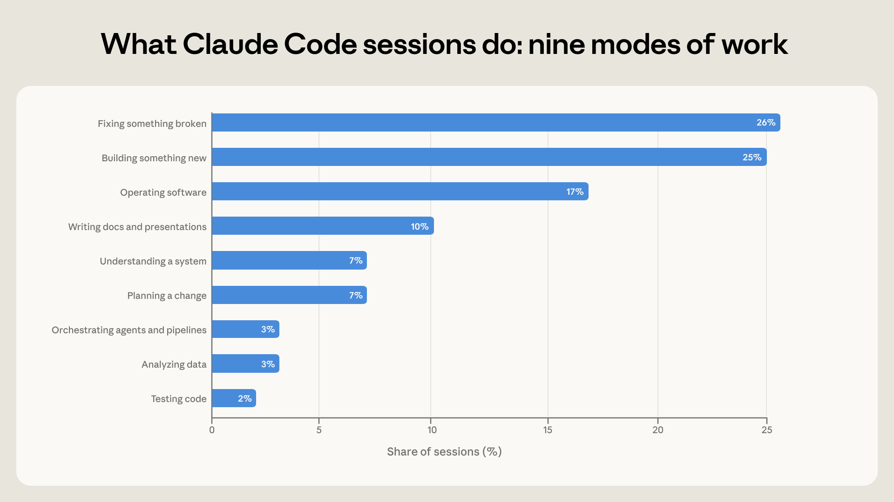
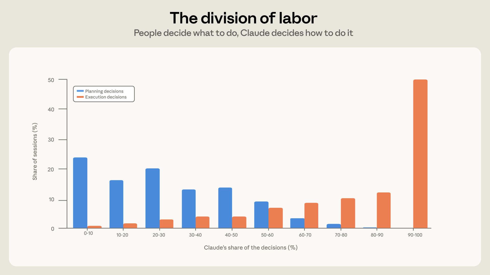
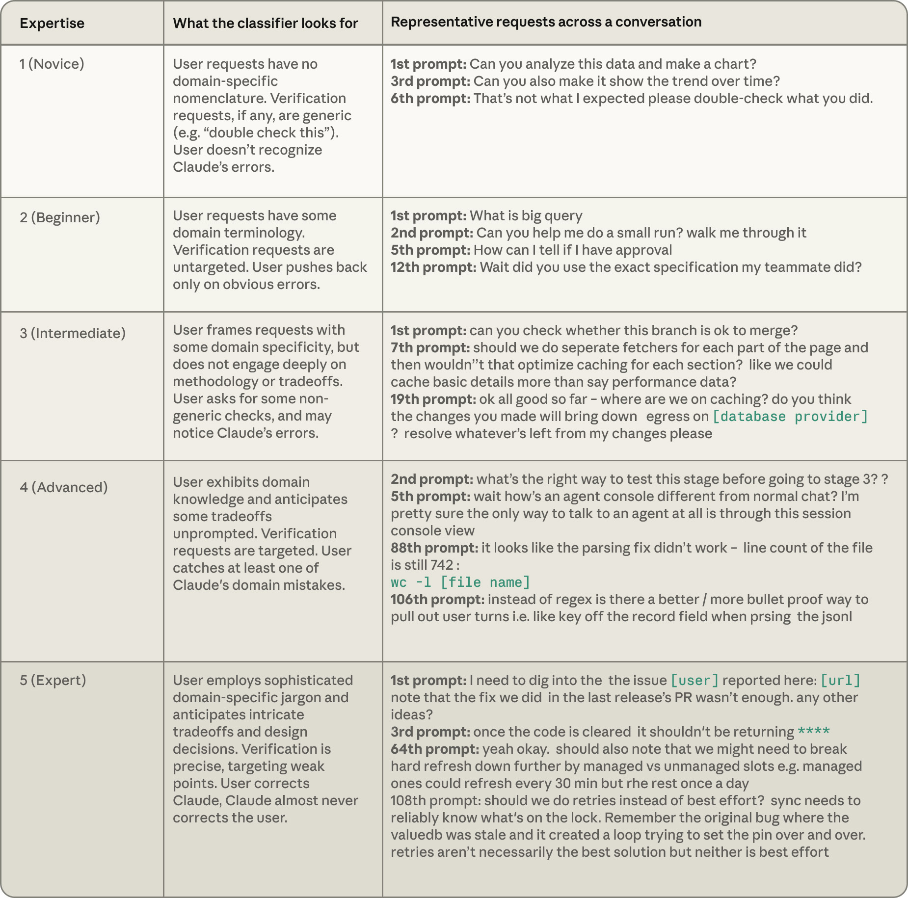
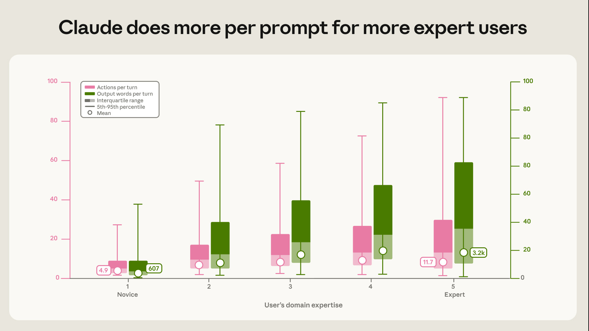
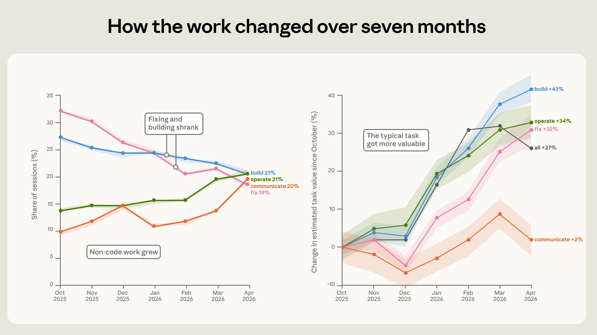
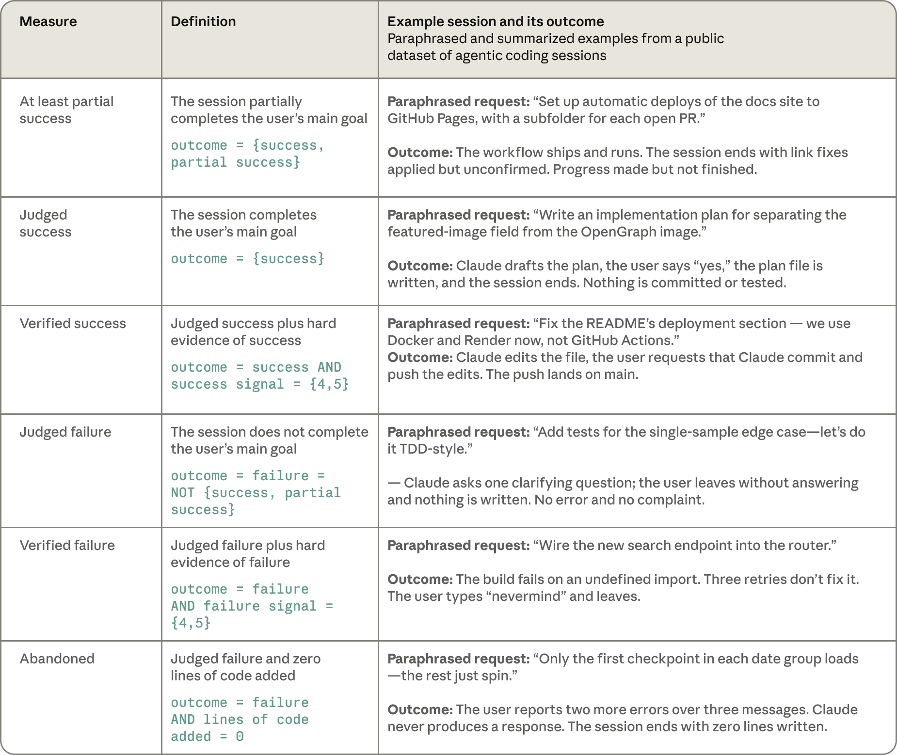
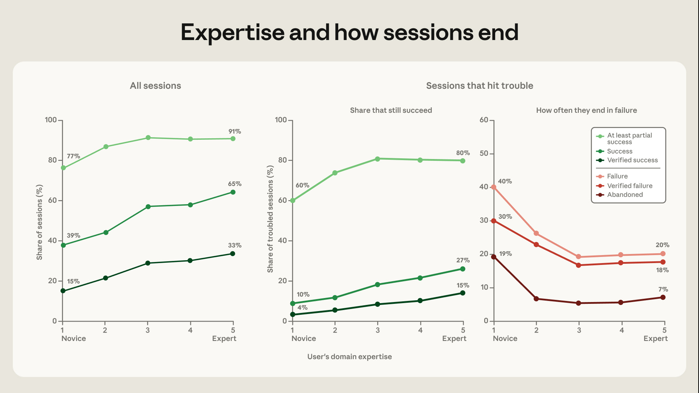
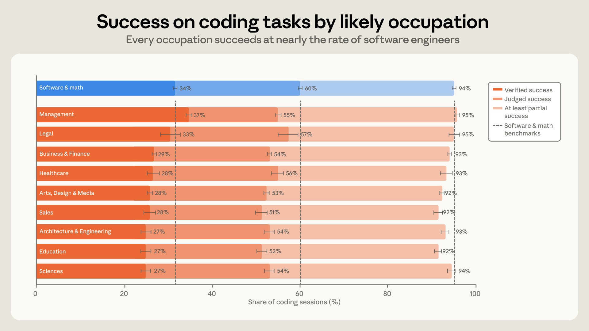

# AI编程助手用得好不好，主要看你是不是行家

> Anthropic 研究团队（Zoe Hitzig、Maxim Massenkoff、Eva Lyubich、Ryan Heller、Peter McCrory）| 2026年6月16日


本文分享了一份关于"AI智能编程助手（Claude Code）"的真实使用报告。研究分析了约40万次真实使用会话，核心想回答一个问题：**不懂编程的人，能不能指挥AI干复杂的活儿？答案是：能，但前提是你得懂自己的专业领域。**

核心内容：

- 用约40万次真实会话（2025年10月-2026年4月），分析人们怎么用Claude Code、干什么活、成功率高不高
- 典型分工：**人决定"做什么"，AI决定"怎么做"**
- 专业领域知识越强，AI一次指令干的活越多、成功率越高——但"中级"和"专家"差距不大
- 7个月里，修bug的活儿占比几乎减半，工作内容转向更"端到端"的AI用法

关键发现：

- 在编程任务上，几乎所有职业的成功率都跟软件工程师差不多——**会编程不再是编程成功的关键**
- 决定成败的是"你是否理解自己要做的事"，而不是"你会不会写代码"

---


## 摘要（核心结论）

1. **人定方向，AI干活**：在一次典型会话里，人做了约70%的"规划决策"（做什么），AI做了约80%的"执行决策"（怎么做）。
2. **专业能力 > 编程能力**：用户对任务的专业理解越深，AI每次指令做的工作越多、成功率越高。
3. **专家和普通人的差距没那么大**：从"新手"到"中级"进步收益最大；"中级"到"专家"的提升有限。
4. **工作内容在变**：修bug占比从33%降到19%，运行软件、分析数据、写文档等"围绕代码的工作"占比上升。
5. **任务价值在涨**：7个月内，典型任务的价值平均上涨约25%（对比自由职业平台报价估算）。

---


## 第一部分：为什么要研究这个问题？

AI编程助手火得很快：

- 2025年底以来，GitHub上活跃着编程智能体（coding agent）的项目占比**翻了一倍多**
- Claude Code 用户平均每周用这个工具约 **20小时**

由此带来两个关键问题：
1. **没学过编程的人**，能不能指挥AI完成复杂的技术工作？
2. AI工具快速普及和升级，对广义的"知识工作"意味着什么？

这个报告用真实数据找答案：基于约**40万个交互会话**（来自约**23.5万人**，2025年10月到2026年4月）。数据全程经过隐私保护处理，不读具体会话内容，只统计聚合结果。

**为什么关心这个？** 在Claude Code上发生的事，可能**预示着未来知识工作的走向**—— **当AI智能体渗透到编程之外的各类工作时，现在程序员身上发生的一切很可能重演**。

**三个核心发现（先行预告）：**

1. AI现在干的活越来越复杂、越来越有价值
2. 人机分工很明确：**人决定建什么，AI决定怎么建**
3. 决定工具使用效果的是**领域专业能力**，不是编程水平

---


## 第二部分：人机怎么分工？

### 2.1 人们用Claude Code干什么活？

报告把每次会话分成**9种工作模式**（用AI读会话记录自动分类）：

**跟写代码直接相关的（4种）：**
- 建新东西、修坏的东西、测试代码、指挥其他AI/自动化流水线

**跟运行软件相关的（1种）：**
- 部署、配置、跑流水线、监控系统

**跟"想清楚再干"相关的（2种）：**
- 搞懂现有系统怎么运作、规划要改什么

**跟代码无关的（2种）：**
- 分析数据、写文档/做演示材料

**图1：Claude Code 会话都在干什么？（9种工作模式占比）**



这张横向条形图，按占比从高到低完整列出全部9种工作模式：

1. **修东西（Fixing something broken）** —— 26%
2. **建新东西（Building something new）** —— 25%
3. **运行软件（Operating software）** —— 17%
4. **写文档/做演示（Writing docs and presentations）** —— 10%
5. **搞懂系统（Understanding a system）** —— 7%
6. **规划改动（Planning a change）** —— 7%
7. **指挥其他AI/流水线（Orchestrating agents and pipelines）** —— 3%
8. **分析数据（Analyzing data）** —— 3%
9. **测试代码（Testing code）** —— 2%

**两大头（1、2）加起来超过一半**，运行软件排第三，17%以后明显下降。

**总结：** 会话主要围绕"修和建代码"，但"围绕代码的活"（运行、规划、文档）已经占了相当比例。

**大多数会话都基于已有代码：**
- 48%主要修改现有代码，17%探索代码
- 14%从零写新代码
- 约五分之一完全不碰代码

**怎么分类的？** 让模型读会话记录，再用隐私保护工具对照自动记录的遥测数据（比如有没有增删代码行）。两个来源高度一致：90%以上被标为"新建或修改代码"的会话，在遥测里确实有代码变动。

### 2.2 谁来做决定？

AI理论上能做很自主的事（在基准测试上，前沿模型能连续自主干几小时的活）。**但实际使用中呢？**

报告用两个角度衡量：

1. **决策归因**：把会话里所有有意义的决定，分成"规划决策"（做什么、选什么方案、算完成）和"执行决策"（改哪个文件、写什么代码、用什么语言），再判断每个决定是**人**做的还是**AI**做的。
2. **动作数量**：人每发一条指令，AI平均干多少活。

**图2：规划决策 vs 执行决策，谁说了算？**



这张图展示了"Claude在决策中的占比"的分布情况：

- **横轴**：Claude做出的决策占比（0-10%一直到90-100%）
- **纵轴**：有多少比例的会话落在这个区间
- **实线（规划决策）**：峰值集中在左侧（Claude占比低），说明**大多数规划决策是人做的**
- **虚线（执行决策）**：峰值集中在右侧（Claude占比高），说明**大多数执行决策是AI做的**

**图上两个分布几乎完全分开，视觉化呈现了核心分工：人定方向，AI动手。**

**具体数字：**
- 平均来看，人做约**70%**的规划决策，只做约**20%**的执行决策
- 一次典型会话约**4轮**对话
- 人每发一条指令，AI平均触发约**10个动作**（有时超过100个）
- AI每轮平均输出约**2400字**（读文件、改代码、跑命令）

**动作数量和决策权的关联：**
- 人把执行权抓在手里（做超过80%执行决策）时，AI每轮只干约**8个动作**
- 当AI掌握规划权（做超过80%规划决策）时，动作数最多，约**16个**

### 2.3 怎么判断用户的专业水平？

模型按**5个等级**给用户的任务专业度打分（新手→专家），依据三个信号：

1. 用户怎么**描述需求**（够不够精准）
2. 用户让AI**验证什么**
3. 用户和AI**谁纠正谁**

**注意：专业度跟职位头衔无关，跟具体任务有关。** 资深工程师问第一个Rust问题，在Rust上就是新手；一个没用过Python的会计，只要能把月底对账规则讲清楚、还能揪出AI搞错的边界情况，在这个任务上就是专家。

**表1：专业度分级的判断标准**



这张表格定义了5个等级。**左列是等级**，**中列是分类器看什么**，**右列是真实的代表性会话摘录**：

| 等级 | 特征（分类器看什么） | 典型对话示例 |
|------|-------------------|-------------|
| **1 新手** | 没有领域术语；验证请求很笼统（如"帮我double check一下"）；看不出AI的错误 | "能分析下这个数据做个图吗"→"能再显示随时间变化的趋势吗"→"这不是我预期的，请再核对下" |
| **2 入门** | 有一点领域术语；验证不聚焦；只对明显错误提出异议 | "什么是big query"→"能帮我小跑一下吗，带我过一遍"→"等等，你用了我同事的精确规范吗？" |
| **3 中级** | 需求有一定领域针对性，但不在方法论或取舍上深入；会做部分针对性的检查，可能发现AI的错误 | "能检查这个分支可以合并吗"→讨论缓存优化→"目前都不错，缓存进展如何？你的改动会降低[数据库]出口吗？" |
| **4 高级** | 主动展现领域知识、预判取舍；验证有针对性；能抓住至少一个AI的领域错误 | "第三阶段之前正确的测试方式是什么？"→"解析修复似乎没生效，文件行数还是742"→"除了正则，有没有更稳妥的提取方式？" |
| **5 专家** | 使用复杂领域行话、预判精细的取舍和设计决策；验证精准直指弱点；总是用户纠正AI，AI几乎从不纠正用户 | "需要深挖[用户]报的问题，上次发版的修复不够，还有别的思路吗？"→"重试和尽力而为怎么选？同步需要可靠知道锁的状态，记得那个valuedb过期的老bug" |

**专业度越高，AI每次指令干的活越多：**
- 新手会话：每条指令触发约**5个动作**，输出约**600字**
- 专家会话：触发约**12个动作**（两倍多），输出约**3200字**（五倍）

**图3：用户越专业，AI每条指令干的活越多**



这张图有两个子图，横轴都是用户的专业度等级（1=新手 到 5=专家）：

- **左图（每个回合的动作数）**：从新手到专家，典型值从约4.9（中位数约4-5个动作，输出607字）一路涨到专家的12个动作、3200字
- **右图（每个回合的输出字数）**：同样明显上升
- 箱体代表中间50%的数据，须线代表5%-95%的范围，白点是几何均值

**关键：** 两条上升趋势在统计上都高度显著（p < 0.001），每一级之间的提升也显著。即使排除工作类型、任务价值、月份、职业、模型等因素的影响，每升一级专业度，动作数仍多9%、输出多13%。

**而且这个差距在每种工作、每个任务价值段里都普遍存在**，不是某一类任务的特例。

---


## 第三部分：谁在用Claude Code？用它干什么？

### 3.1 用户都是谁？

从会话记录推断用户职业，归到美国劳工统计局标准职业分类（SOC）的23个大类。

**怎么推断？** 只看项目上下文、文件名和结构、引用的资料（法律文件、临床数据、财报、课程等）和用词。**明确不允许"用户写了代码"就推断他做编程工作。** 比如律师写脚本自动检查合同里缺失的条款，归入**法律职业**，即使会话里主要是在写软件。

- 约**70%**的会话能推断出职业
- 最大群体当然是**计算机与数学职业**（软件相关工作）
- 其次是**商务与金融**、**艺术/设计/媒体**、**管理**、**生命/物理/社会科学**
- 增长最快的非软件职业：**管理、销售、法律**

### 3.2 工作内容怎么变？

**图4：Claude Code 工作的构成和价值变化（2025年10月-2026年4月）**



这张图分左右两个面板：

**左面板（左半边）：各工作模式占比随时间的变化**
- **横轴**：月份（2025年10月到2026年4月），**纵轴**：会话占比
- 深色线（修复和构建）整体往下走：**修bug的占比从33%降到19%**
- 绿色区域（非代码工作）明显上升：**运行软件从14%涨到21%**，**写文档和数据分析从约10%翻倍到约20%**
- 底部批注：构建21%、运行21%、沟通20%、修复19%

**右面板（右半边）：任务估算价值相对2025年10月的变化**
- **横轴**：月份，**纵轴**：价值变化百分比
- 几乎所有类型都上涨：**建新东西+43%、运行+34%、修复+32%**，全部工作平均**+27%**
- 只有"沟通/文档"类涨得很少（+2%）
- 图上标注"典型任务变得更有价值了"

**怎么估算任务价值？** 问"**这活放在自由职业平台上要花多少钱**"，对照一个真实公开发布的公私活数据集校准。注意：**这个估算是粗糙的**，主要用于"任务之间纵向比较"，不能当字面金额看。

---


## 第四部分：成不成，取决于人带来什么

任务价值只是"帮助程度"的一种度量。另一种角度是看**成功率**。

### 4.1 怎么定义成功？

用户真实世界的结局观测不到，也没法直接问。所以报告用**基于会话记录**的两层度量：

- **判定成功**：模型读完整段会话，判断用户是否达成了想做之事（成功/部分成功/失败/目标不明）
- **验证成功**：判定成功 + 至少一个**硬验证信号**（git提交或PR、测试套件通过、用户明确认可等）

**表2：成功与失败的定义**



这张表格给出6个指标的精确定义和真实会话举例：

| 指标 | 定义 | 举例 |
|------|------|------|
| **至少部分成功** | 会话部分完成了用户的主要目标 | "设置文档站自动部署到GitHub Pages，每个PR一个子目录"——工作流上线运行，修复了链接但未最终确认，有进展但没做完 |
| **判定成功** | 完成了用户的主要目标 | "写一个把featured-image字段与OpenGraph图片拆分的实施方案"——Claude写好方案，用户说"行"，方案文件落盘，会话结束（未提交未测试） |
| **验证成功** | 判定成功 + 强验证信号（成功信号=4或5） | "修README的部署章节——我们改用Docker和Render了"——Claude改文件，用户让提交并推送，成功推上main |
| **判定失败** | 没完成主要目标 | "给单样本边界情况加测试，用TDD方式"——Claude问了一个澄清问题，用户没回答就走了，什么都没写 |
| **验证失败** | 判定失败 + 强失败信号（失败信号=4或5） | "把新搜索端点接入路由"——构建因未定义导入失败，重试三次没解决，用户说"算了"离开 |
| **放弃** | 判定失败 且 一行代码都没写 | "每个日期组只有第一个检查点能加载，其余都转圈"——用户连报两个错误，Claude没回应，会话零代码结束 |

分析时排除"目标不明"的会话（约占全部样本的7.7%）。

### 4.2 专业度的回报

**核心发现：会话里展现的专业度越高，成功率越高。收益大头集中在新手→中级的跃迁。**

**图5：专业度与会话结局**



这张图分三个面板，横轴都是专业度（1=新手 到 5=专家）：

**左面板（所有会话，纵轴=成功会话占比）：**
- 新手：判定成功39%，验证成功仅15%，至少部分成功77%
- 中级到专家：判定成功约65%+，验证成功28-33%，至少部分成功91-92%
- 注意15%→33%这段在新手到中级的跳升最大，之后趋缓

**中面板（只统计中途遇到麻烦的会话，纵轴=仍成功的占比）：**
- 新手遇麻烦后，仍能验证成功的只有4%
- 专家则达到15%
- 至少部分成功：新手60%，中级到专家80-81%

**右面板（遇到麻烦的会话中各种失败率）：**
- 新手会话被"放弃"的比例高达19%（判定失败且零代码）
- 其他等级只有5-7%
- **换句话说：越没经验的人，遇到卡壳越容易直接放弃**

每个数据点都是"调整后比率"——只对比工作模式、任务价值段、月份、任务主题、用户类型相同的会话，排除其他干扰。

**为什么专家更扛得住？** 部分原因是专家遇到的"麻烦"可能本来就难（越专业，卡住的任务平均价值越高，大约翻倍）。新手卡在常规问题上，专家卡在难题上——但即便如此，专家恢复能力仍更强。

### 4.3 职业背景可能不如专业度重要

**图6：各职业做编程任务的成功率**



这张图统计"至少新增或修改一行代码"的会话，按用户职业分组，展示三个指标：

- **深色条（验证成功）**：软件与数学34%最高，其余各职业27-37%，差距很小
- **中间条（判定成功）**：各职业51-60%
- **浅色条（至少部分成功）**：所有职业都高达92-95%
- 底部虚线是软件与数学职业的基准线

**图上的关键信息：10个最大的职业群体，成功率都落在软件工程师的7个百分点以内。**

**具体数字：**
- 软件工程师验证成功约**30%**，其他职业约**26%**（全样本）；只统计产出代码的会话，分别约**34%**和**29%**
- 这5个点的差距很小，而且7个月里既没扩大也没缩小
- **管理职业的验证成功率最高**（略高于软件工程职业）——可能因为管理技能直接能迁移到"指挥AI"上；但也可能是度量方式的原因（验证部分依赖会话中的明确确认，管理者更习惯说"我要的就是这个"）

---


## 展望未来

这份报告描画了一个逐渐清晰的图景：**AI编程助手正在放大一部分知识和技能，同时替代另一部分。**

- 在产出代码的会话里，所有主要职业的成功率都跟软件相关工作相差无几——**会编程，正在变得不那么重要**
- 同时，成功的会话更常展现**领域专业能力**：专家级会话验证成功率是新手的两倍多；遇到麻烦时，新手的放弃率是其他人的好几倍
- 合作形态也印证了这点：**领域专家每给一条指令，都能指挥Claude干更多活**
- **所以，把Claude指挥到成功的能力，更多来自你对一个领域的掌握，而不是你会写代码。** 任何一个领域里有这种掌握的人，现在都可能做之前做不到的技术工作；而没有这种专业知识的人，从同一工具里得到的就少得多
- 而且收益主要来自"**够用**"而不是"精通"：对领域有基本掌握就能拿到大部分好处，深度专精只能再多加一点

**这份报告的局限：**
- 测量不到真实世界结局（比如写出的代码之后到底用没用到、有没有产生经济价值）
- 排除了"非交互式"使用——那是相当大一部分活动，是未来工作的优先方向
- 所有分类都依赖模型读会话记录，虽然报告验证了分类器与独立遥测一致，也跟强参考模型多数一致，但大规模验证分类器仍是难题

**后续看什么（信号）：**
1. 如果专业度的回报随时间下降 → 说明模型开始提供用户当前带来的关键判断，工具收益正从专家普及到大众
2. 如果非软件职业的编程会话成功率继续上升 → 说明"软件生产"正在变成各行各业普通工作的一部分

编程是最先被渗透的案例——软件里发生的事，很可能预示其他知识工作即将到来的变化。

---


## 脚注

**[1]** 一项覆盖128,000个公开仓库的研究发现，截至2025年10月底，估计有16-23%的项目检测到编码智能体活动。后续用同样方法的研究发现，在该时期之后创建的项目中，采用率高出一倍多。检测依赖智能体联合署名标签和配置文件，可能低估了实际使用量。

**[2]** 这里的"20小时"指的是 Claude Code 处于活跃运行状态的小时数，不是用户实际打字操作的时间。

**[3]** 另外，Sarkar（2026）和 Baumann 等人（2026）分别通过研究 Cursor IDE 会话和公开会话，为理解 agentic coding 提供了其他视角。

**[4]** 报告排除了通过第三方集成开发环境和软件开发工具包（SDK）运行的 Claude Code 使用，也排除了"headless"模式（用户通过 CLI 用 claude -p 运行单条指令）。原因有二：这类使用大多是程序化的（Claude Code 嵌在自动化工具和流水线里，而非与人对话）；即使有人在场，我们也无法像对待纳入分析的界面那样看到完整的端到端会话。

**[5]** 除非特别说明，本报告所有分类器都使用 Claude Sonnet 4.6。分类器的详细信息（包括完整提示词和验证结果）见附录。

**[6]** 每条指令触发动作数的长尾很长：约2%的会话平均每条指令超过100个动作，约1/270超过200个，约1/2300超过500个。

**[7]** 与本报告所有指标一样，这些推断都用隐私保护分析工具完成。没有研究员会阅读具体会话记录，职业标签从不关联到可识别身份的用户，我们只观察超过最低用户数的聚合统计。

**[8]** 这里的估算方法旨在反映会话价值的相对差异，而非绝对值。金额基于自由职业市场（非薪资工作）对比，且来自会话与招聘信息的最终模糊匹配。由于相对估计能消除这些问题的系统性偏差，我们更看重相对值。

**[9]** 对"遇到麻烦"的条件筛选对不同用户选取了不同的会话。专家总体更少遇到麻烦，所以他们遇到的麻烦会话很可能更难——用会话价格估计代表复杂度，可以看到从专业度最底端到最顶端，遇到麻烦的会话的平均估计价值大约翻倍。因此恢复率的差距部分可能反映：新手卡在常规问题上，专家卡在棘手的难题上。

**[10]** 即使模型误判了管理者，用于判断"该用户可能是管理者"的信号（比如任务如何委派和说明）往往与更高的成功率相关。换句话说，也许"表现得像个管理者"本身就带来更高的成功率。


## 参考文献（BibTex Citation）

```bibtex
@online{hitzig2026agentic,
  author = {Zoe Hitzig and Maxim Massenkoff and Eva Lyubich and Ryan Heller and Peter McCrory},
  title = {Agentic coding and persistent returns to expertise},
  date = {2026-06-16},
  year = {2026},
  url = {https://www.anthropic.com/research/research/claude-code-expertise},
}
```


## 附录（Appendix）

附录可在此处获取（请点击原文中的 "Available here" 链接）。
